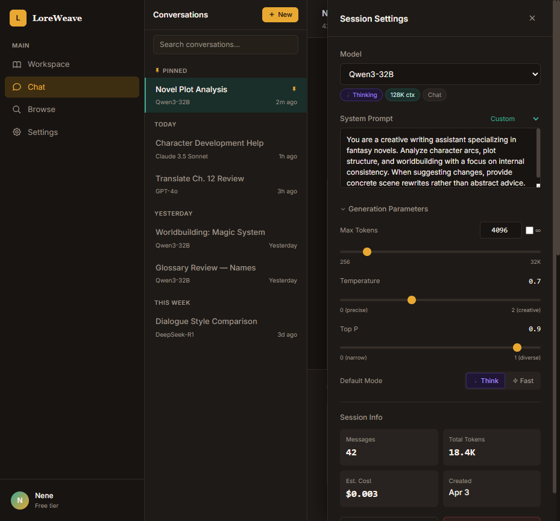
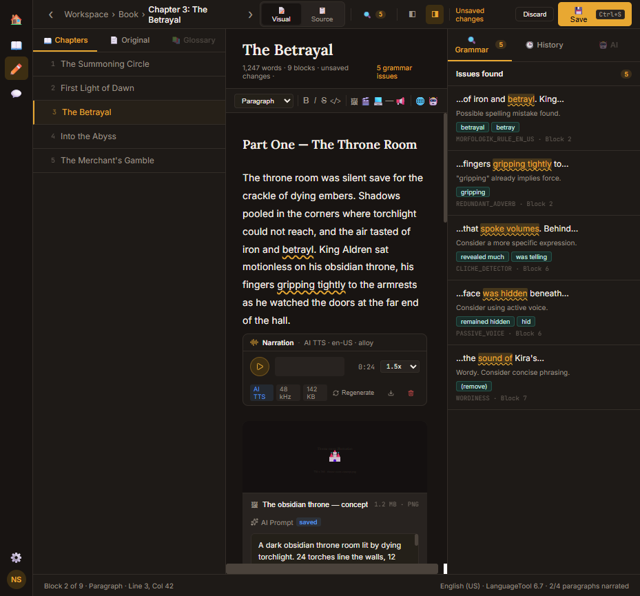
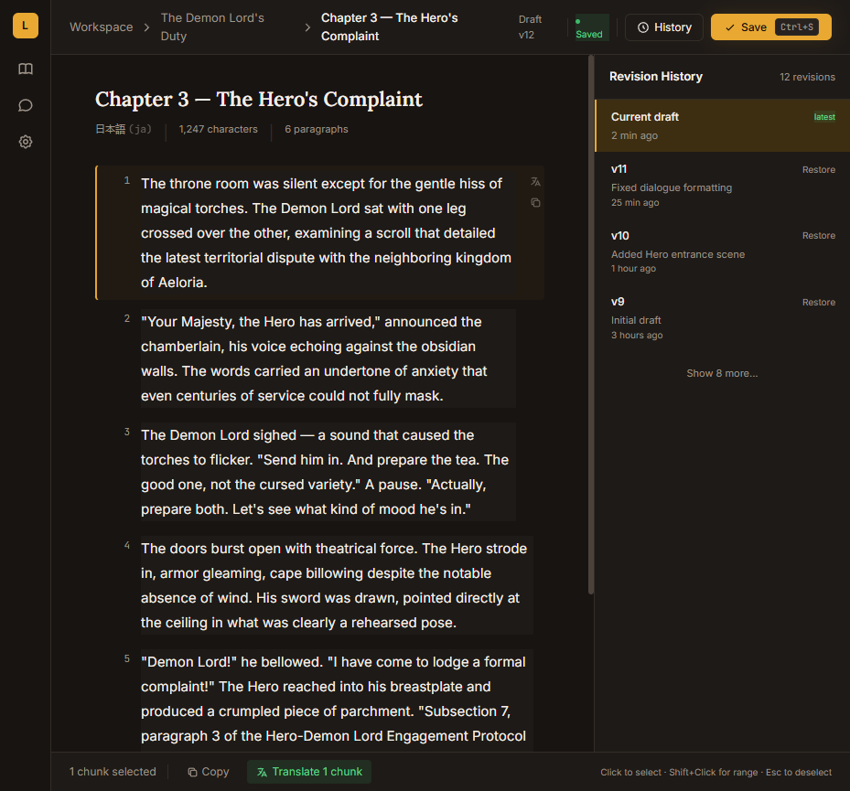
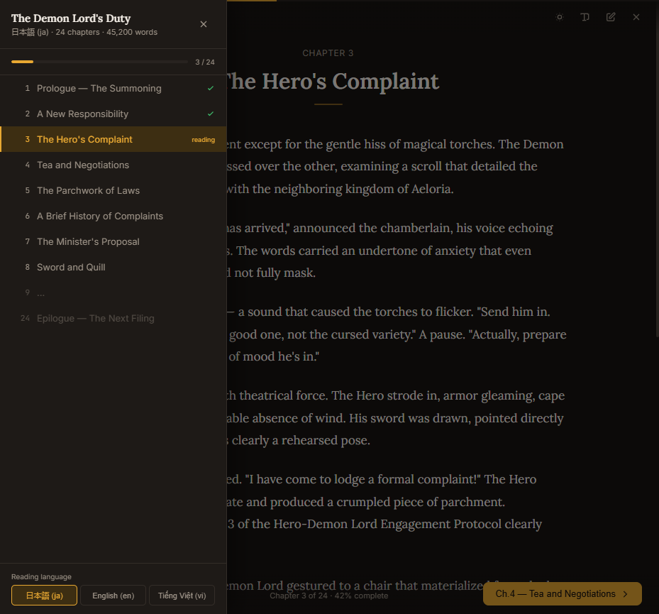
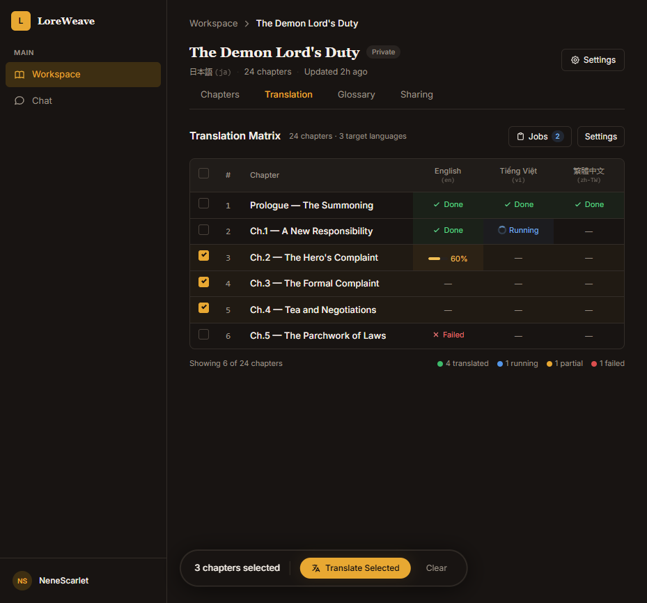
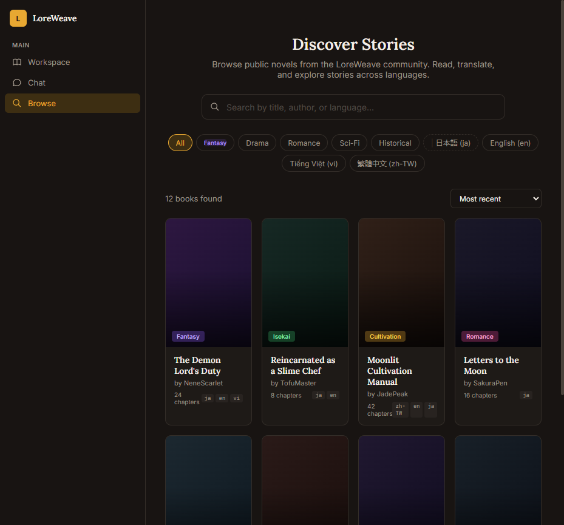
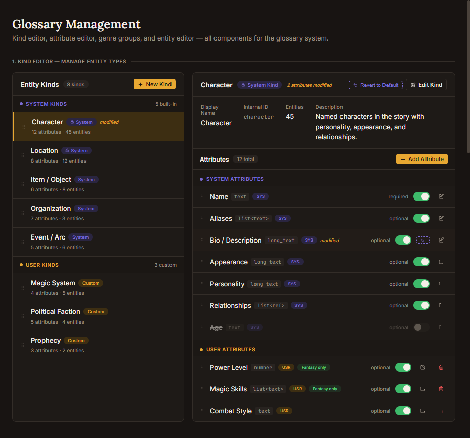
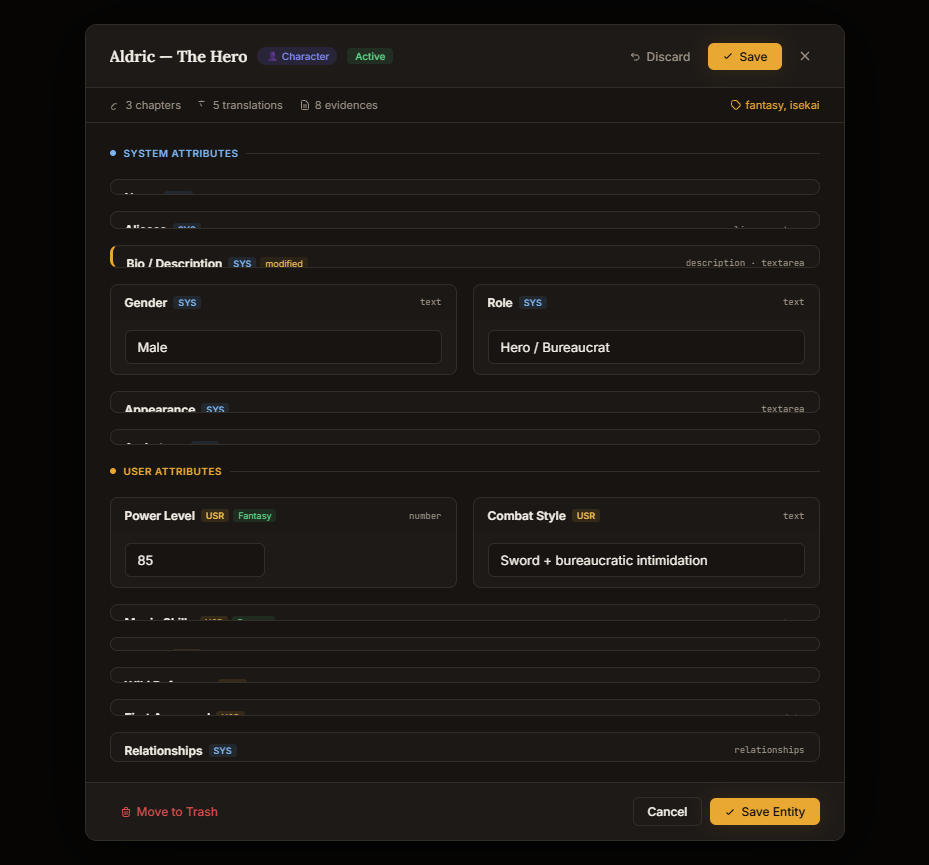
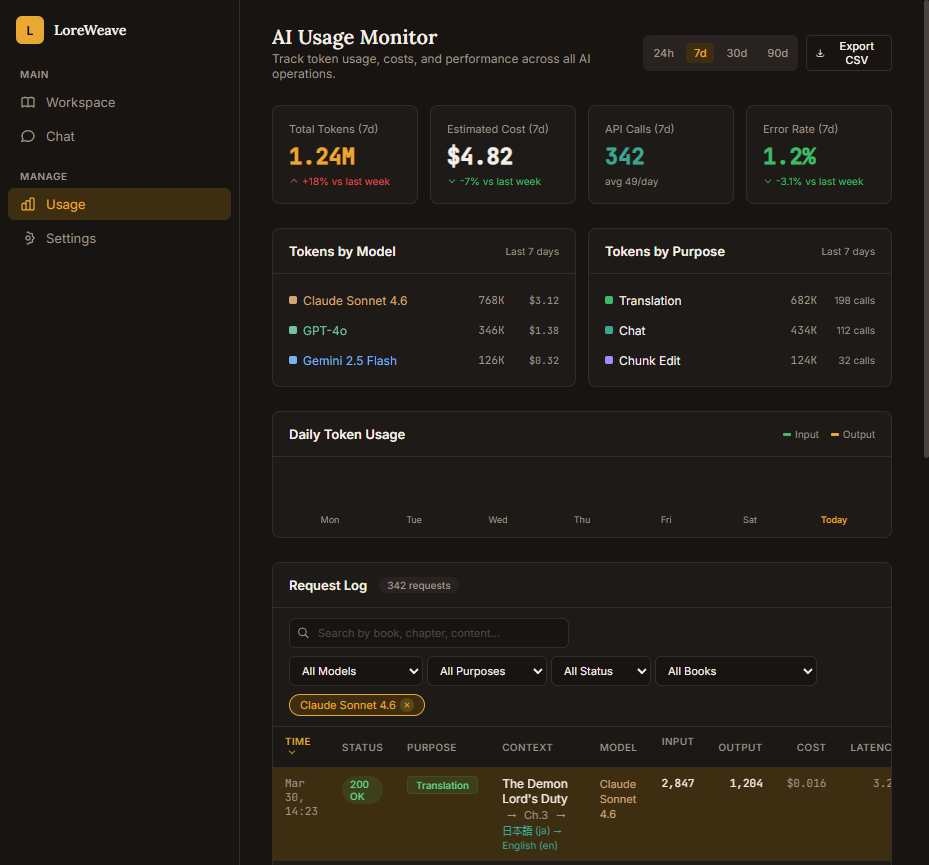

# LoreWeave

**The Open Source Creative Home for Novelists.**

LoreWeave is a self-hosted platform for writing, translating, and sharing multilingual novels. It combines AI assistance with deep worldbuilding tools to help you keep your lore consistent across every chapter and every language.

BYOK (Bring Your Own Key) — works with OpenAI, Anthropic, LM Studio, Ollama, and any OpenAI-compatible provider.

[](https://opensource.org/licenses/MIT)
[](https://github.com/)

---

## Screenshots

### AI Chat with Thinking Mode
Chat with any LLM. System prompts, generation parameters, thinking mode with real-time reasoning display, message branching, prompt templates.



### Rich Editor with AI Assistant Mode
Mixed media editor with text, images, audio narration, AI prompts, grammar checking, and source view. Visual/Source toggle, chapter sidebar, and grammar panel.



### Chapter Editor
Paragraph-level editing with revision history, chunk selection, inline translation, and AI context tools.



### Immersive Reader
Clean reading mode with table of contents, multi-language support, and chapter navigation.



### Translation Matrix
Batch translate chapters across multiple languages. Track progress, manage translation jobs, review status per chapter.



### Browse & Discover
Public catalog with genre filtering, language chips, search, and book cards.



### Glossary & Lore Management
Entity kinds (Character, Location, Item, etc.), custom attributes, system vs user fields, cross-reference tracking.



### Entity Editor
Card-based attribute editing with system/user separation, tags, evidence linking, and relationship tracking.



### AI Usage Monitor
Track token usage, costs, and performance across all AI operations. Per-model and per-purpose breakdowns.



---

## Features

### Writing & Editing
- Tiptap-based rich text editor with AI and Classic modes
- Paragraph-level chunk editing and selection
- Revision history with restore, version comparison
- Media blocks: images, video, code (AI mode)
- Source view (block JSON inspector)

### AI Chat
- Multi-provider streaming (OpenAI, Anthropic, LM Studio, Ollama)
- Thinking mode — real-time reasoning display (Qwen3, DeepSeek-R1)
- System prompts with presets (Novelist, Translator, Worldbuilder, Editor)
- Generation parameters (temperature, top_p, max_tokens)
- Message branching — edit creates branch, not delete
- Prompt template library (type "/" to search)
- Response format pills (Concise, Detailed, Bullets, Table)
- Token usage and timing metrics per message (TTFT, response time)
- Context attachment (books, chapters, glossary entities)
- Auto-title generation from first exchange

### Translation
- Batch translation pipeline with async workers
- Translation matrix — status per chapter per language
- Per-chunk inline translation from editor
- Multi-language support (any language pair)

### Worldbuilding
- Customizable entity kinds (Character, Location, Item, Organization, etc.)
- Dynamic attributes — add any field type (text, number, list, relationships)
- Evidence linking — tie lore entries to specific chapter paragraphs
- System + User attribute separation

### Community
- Public book catalog with search, genre, and language filters
- Sharing — public, unlisted (link-only), private visibility
- User profiles

### Platform
- BYOK — bring your own API keys from any provider
- Dynamic model discovery from provider APIs (58+ LM Studio models auto-detected)
- AI usage monitoring with cost estimates and daily breakdowns
- Recycle bin with restore
- Settings: Account, Providers, Translation, Reading, Language

---

## Architecture

Self-hosted Docker Compose monorepo with 11 microservices.

```
Frontend (React/Vite) ──> API Gateway (NestJS) ──> Microservices
                                                      ├── auth-service (Go)
                                                      ├── book-service (Go)
                                                      ├── sharing-service (Go)
                                                      ├── catalog-service (Go)
                                                      ├── provider-registry (Go)
                                                      ├── usage-billing (Go)
                                                      ├── translation-service (Go)
                                                      ├── glossary-service (Go)
                                                      ├── chat-service (Python/FastAPI)
                                                      └── video-gen-service (Python)
Data: PostgreSQL (per-service DBs) + Redis Streams + MinIO (objects)
```

| Layer | Tech | Purpose |
|-------|------|---------|
| Frontend | React + Vite + Tailwind + shadcn/ui | Premium dark UI |
| Gateway | NestJS | Route all external traffic |
| Domain Services | Go / Chi | Books, auth, sharing, glossary, providers |
| AI Services | Python / FastAPI | Chat streaming, translation, video gen |
| Data | PostgreSQL 18 | Per-service databases with JSONB |
| Objects | MinIO | Media uploads, exports |
| Events | Redis Streams | Async job processing |

---

## Quick Start

### Docker (recommended)
```bash
cd infra
docker compose up --build
```
Access the UI at [http://localhost:5173](http://localhost:5173)

### Manual / Hybrid
1. **Infra**: `cd infra && docker compose up -d postgres minio redis mailhog`
2. **Services**: Start individual services (see each service's README)
3. **Frontend**: `cd frontend-v2 && npm install && npm run dev`

---

## AI Models (BYOK)

LoreWeave is model-agnostic. Connect any provider:

| Provider | Setup | Dynamic Model Fetch |
|----------|-------|-------------------|
| **OpenAI** | API key | 110+ models auto-discovered |
| **Anthropic** | API key | 8 models with rich capabilities |
| **LM Studio** | Local URL | 58+ models with context length, type detection |
| **Ollama** | Local URL | Local models auto-listed |
| **Custom** | Any OpenAI-compatible endpoint | Dynamic fetch supported |

### Recommended Models

| Use Case | Cloud | Self-Hosted |
|----------|-------|-------------|
| Novel writing | GPT-5, Claude Sonnet 4.6 | Qwen3-32B, Llama 3 70B |
| Translation | Claude Opus 4.6, GPT-4.1 | Qwen3-14B |
| Quick tasks | GPT-5-nano, Claude Haiku 4.5 | Qwen3-1.7B, Gemma 3 4B |

---

## Documentation

- `docs/03_planning/` — Module planning docs, task lists
- `docs/sessions/` — Session logs and handoff docs
- `design-drafts/` — 30 interactive HTML design mockups
- `contracts/api/` — OpenAPI specs per service

---

## Contributing

LoreWeave is for everyone. Developers, artists, translators, and authors welcome.

- **License**: [MIT](LICENSE)
- **Architecture**: Contract-first microservices
- **Docs**: See [docs/](docs/) folder

Developed with care for the Creative Community.
