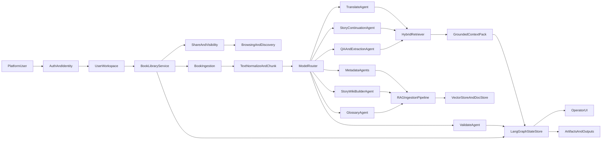

# LoreWeave - Platform Project Overview

## Document Metadata
- Document ID: LW-01
- Version: 1.2.0
- Status: Approved
- Owner: Product Manager + Solution Architect
- Last Updated: 2026-03-21
- Approved By: Governance Board
- Approved Date: 2026-03-21
- Summary: Platform vision, architecture direction, and strategic scope baseline.

## Change History
| Version | Date | Change | Author |
|---|---|---|---|
| 1.2.0 | 2026-03-21 | Updated approval metadata to Approved with Governance Board sign-off | Assistant |
| 1.1.0 | 2026-03-21 | Added governance metadata header and migrated to numbered docs structure | Assistant |
| 1.0.0 | 2026-03-21 | Baseline content established before docs reorganization | Assistant |

## Platform Name and Positioning

**LoreWeave** is a multi-agent platform for multilingual novel workflows across translation, analysis, knowledge building, and assisted creation.

The name reflects two core ideas:
- **Lore**: preserving and expanding story knowledge (plot, entities, relationships, world rules).
- **Weave**: orchestrating many specialized AI agents into one coherent pipeline and product experience.

LoreWeave is not only a translation tool. It is a full platform where users can onboard books, manage ownership, collaborate or share content, browse public works, and run advanced AI workflows on top of structured narrative knowledge.

## Vision

LoreWeave aims to become a unified operating platform for novel intelligence:
- Translate novels across languages with high consistency.
- Build reliable story knowledge bases similar to human-maintained wiki pages.
- Support downstream use cases: Q&A, extraction, fact checking, timeline tracing, and continuation writing.
- Give users transparent control through a UI-first workflow, not CLI-only scripts.
- Scale from single-user local workflows to multi-user platform operations.

## Current State (What Exists Today)

The current repository already provides a strong technical baseline:
- A Python pipeline in `translate_pipeline.py` with staged processing:
  1. glossary
  2. timeline
  3. entity facts
  4. relation edges
  5. scenes
  6. translation
- Prompt-driven stage design under `prompts/`.
- OpenAI-compatible model client in `llm_client.py`.
- Existing JSONL artifacts for RAG-like metadata (`timeline` and `metadata` outputs).

This foundation is valuable, but it currently behaves as a **single-process sequential pipeline** and is optimized around a small number of model interaction patterns.

## Grounding in Existing Codebase

This platform redesign is intentionally grounded in the current repository assets:
- `translate_pipeline.py`
  - already defines the stage order, chunking behavior, and many quality/retry constraints.
  - becomes the reference for first LangGraph node boundaries.
- `llm_client.py`
  - already centralizes OpenAI-compatible chat completion calls.
  - becomes the first model gateway abstraction before provider/router expansion.
- `prompts/`
  - already separates stage intent by template.
  - becomes a versioned prompt registry connected to agent nodes and evaluation runs.
- Existing outputs in `timeline/`, `metadata/`, `data/`, `translations/vi/`, and `runs/`
  - become seed datasets for schema definition, RAG indexing contracts, and baseline quality metrics.

## Why Redesign

### Current Limitations

1. **Single-model pressure**
   - One strong model is expected to do many different tasks (translation, validation, extraction, repair).
   - This is expensive and not always quality-optimal for each subtask.

2. **Serial bottlenecks**
   - Stage and chunk processing are mostly sequential.
   - Latency and cost rise quickly with chapter count and retry loops.

3. **Pipeline-first, product-second**
   - Current flow is CLI-centric.
   - Missing platform-level concepts: users, auth, ownership, sharing, discovery.

4. **Limited operational visibility**
   - Debug artifacts exist (`runs/`), but there is no integrated UI for live monitoring, intervention, and governance.

5. **RAG is present but not systematized**
   - Metadata extraction exists, but retrieval contracts, indexing policies, grounding rules, and quality metrics need a formal architecture.

## Target Platform Scope

LoreWeave will be a multi-tenant platform with two major layers:

1. **Platform Core**
   - Authentication and identity.
   - User workspaces and book ownership.
   - Book ingestion and lifecycle management.
   - Sharing and browsing of books and derived knowledge.

2. **AI Orchestration Layer**
   - LangGraph-based multi-agent workflows.
   - Model routing by task profile (quality/cost/latency).
   - Retrieval-grounded execution for translation, analysis, and creative tasks.

## Proposed High-Level Architecture

## LangGraph-Oriented Multi-Agent Design

### 1) Orchestration and State

- Use LangGraph as the workflow backbone for deterministic, inspectable state transitions.
- Each run persists graph state, intermediate outputs, confidence signals, and retry traces.
- Branching and fallback become explicit graph edges (instead of ad-hoc nested retries).

### 2) Core Agents

- **ModelRouterAgent**
  - Chooses model/provider and decoding profile per task and budget.
  - Routes lightweight tasks to cheaper models; reserves premium models for high-risk nodes.

- **GlossaryAgent**
  - Maintains canonical entity naming and aliases.
  - Produces normalized glossary assets reusable by translation and RAG.

- **TranslateAgent**
  - Performs chunk translation with retrieval-grounded context.
  - Supports style guides, terminology locks, and chapter consistency constraints.

- **ValidateAgent**
  - Checks hallucination risk, untranslated source leakage, and structure compliance.
  - Can trigger bounded correction loops by severity level.

- **MetadataAgents**
  - Extract timeline events, entity facts, relation edges, and scene segments.
  - Emit structured outputs aligned with retrieval and graph analytics.

### 3) Extended Product Agents

- **StoryWikiBuilderAgent**
  - Consolidates extracted facts into human-like wiki pages:
    - character pages
    - faction/group pages
    - location pages
    - arc and timeline summaries
  - Tracks source evidence and confidence per statement.

- **StoryContinuationAgent**
  - Assists continuation writing from selected canon context.
  - Supports constraint modes (tone lock, POV lock, timeline lock, no-retcon policy).

- **QAAndExtractionAgent**
  - Serves user questions over private/public book knowledge.
  - Handles ad-hoc extraction tasks and outputs structured data on demand.

## RAG Strategy (Overview Level)

### Knowledge Sources

- Raw chapter text.
- Translation outputs.
- Glossary entries.
- Timeline/events/facts/relations/scenes JSONL outputs.
- Story wiki pages generated by StoryWikiBuilderAgent.

### Ingestion and Indexing

- Normalize documents into a typed schema:
  - `source_type` (chapter, scene, fact, relation, wiki_page, etc.)
  - `book_id`, `chapter_id`, `entity_ids`, `language`, `visibility`
  - evidence pointers and timestamps
- Build hybrid retrieval indexes:
  - dense vector index for semantic recall
  - sparse/keyword index for exact name and phrase matching
  - optional graph index for relation traversal

### Retrieval Policy

- Task-aware retrieval profiles:
  - translation profile (terminology + recent chapter context + core entity cards)
  - QA profile (highest confidence evidence first, then supporting context)
  - creative profile (canon constraints + style memory + optional exploratory context)
- Multi-pass retrieval:
  1. candidate fetch
  2. rerank by task objective and confidence
  3. assemble a grounded context pack with citations

### Grounding and Safety

- Every generated claim should map to supporting evidence when required.
- Distinguish clearly between:
  - **grounded answer** (supported by indexed evidence)
  - **creative generation** (explicitly labeled as speculative/original)
- Enforce provenance fields in downstream artifacts to support auditability.

## Platform Capabilities

### 1) Authentication and Identity

- User registration, login, and session/token management.
- Role model for at least:
  - user
  - creator/owner
  - moderator/admin
- Basic security controls:
  - secure password hashing
  - email verification/reset flow
  - rate limiting and abuse monitoring hooks

### 2) Book Management

- Book onboarding:
  - manual upload
  - batch import
  - metadata-first registration
- Ownership and access:
  - owner, collaborator, viewer permissions
  - private/shared/public visibility states
- Library organization:
  - language variants
  - editions/versions
  - processing status and run history

### 3) Sharing and Browsing

- Share links and access scopes (private, unlisted, public).
- Public browsing experience:
  - searchable catalog
  - tags/genres/languages
  - trending or recommendation-ready signals
- Content governance:
  - reporting hooks
  - moderation queues
  - policy-aware visibility controls

## UI/UX Direction

LoreWeave should provide a product UI with distinct workflow surfaces:

1. **Workspace Dashboard**
   - books, recent runs, queue status, and alerts.

2. **Book Studio**
   - chapter explorer, translation workspace, glossary panel, and side-by-side compare.

3. **Knowledge Hub**
   - timeline, entities, relations graph, and generated wiki pages.

4. **Agent Console**
   - run configuration, model routing policy, live graph trace, retries, and cost telemetry.

5. **Creative and QA Lab**
   - ask questions, request structured extraction, and draft continuation scenes.

6. **Sharing and Discovery**
   - publication controls, preview pages, and browsing/search interfaces.

## Data Contracts and Artifacts

Core artifact families in the target system:
- **Translation artifacts**: per chunk/chapter outputs, validation reports, revision diffs.
- **Knowledge artifacts**: glossary, timeline, entity facts, relation edges, scenes, wiki pages.
- **Retrieval artifacts**: index records, embedding metadata, citation maps.
- **Operational artifacts**: run traces, routing decisions, latency/cost metrics, error taxonomy.

Each artifact should include:
- stable IDs
- `book_id` and `chapter_id` references
- language tags
- model/provider metadata
- provenance and timestamps

## Performance and Cost Strategy

- Route tasks to fit-for-purpose models instead of one premium model for all nodes.
- Parallelize independent graph branches where safe.
- Cache reusable context packs and stable extraction outputs.
- Use bounded retries with explicit failure classes.
- Support budget policies:
  - low-cost batch mode
  - balanced production mode
  - quality-first mode

## Migration Roadmap

### Phase 0 - Stabilize Baseline
- Keep current `translate_pipeline.py` behavior as a reference workflow.
- Define canonical schema contracts for existing outputs.
- Add quality/cost baseline metrics.

### Phase 1 - Platform Foundation
- Implement auth, user profile, and book library domain.
- Introduce book onboarding and ownership model.
- Build basic dashboard and book management UI.

### Phase 2 - LangGraph Core
- Wrap current stages into graph nodes.
- Externalize routing policy.
- Persist run state and graph transitions.

### Phase 3 - RAG Systemization
- Normalize and ingest all knowledge artifacts.
- Deploy hybrid retrieval and citation-aware context packing.
- Enable grounded QA flows.

### Phase 4 - Extended Agents
- Launch StoryWikiBuilderAgent and QAAndExtractionAgent as first-class features.
- Launch StoryContinuationAgent with canon-safety constraints.

### Phase 5 - Sharing and Discovery
- Release public browsing, sharing controls, and moderation hooks.
- Add recommendation-ready indexing and engagement analytics.

### Phase 6 - Optimization and Governance
- Improve routing with performance feedback loops.
- Add policy and compliance tooling for platform growth.

## Risks and Open Decisions

1. **Data governance risk**
   - Need clear policy for private vs shared knowledge and derived outputs.

2. **Quality variance across models**
   - Multi-model routing needs robust evaluation and fallback rules.

3. **Creative vs factual mode confusion**
   - Product UX must clearly separate grounded answers from creative generation.

4. **Index drift and stale canon**
   - RAG indexes and wiki pages require freshness and conflict resolution strategies.

5. **Complexity of platformization**
   - User management, permissions, and moderation add significant product scope.

## Immediate Next Decisions

Before implementation starts, finalize:
- primary backend stack for platform services
- initial auth strategy (provider and token/session approach)
- storage choices for:
  - transactional data
  - vector index
  - search index
  - object/file artifacts
- first production use case priority:
  - translation-first
  - knowledge-first
  - QA-first
  - creative-first

This document establishes LoreWeave as a platform-level blueprint that evolves the current repository from a strong sequential pipeline into a scalable multi-agent product ecosystem.

