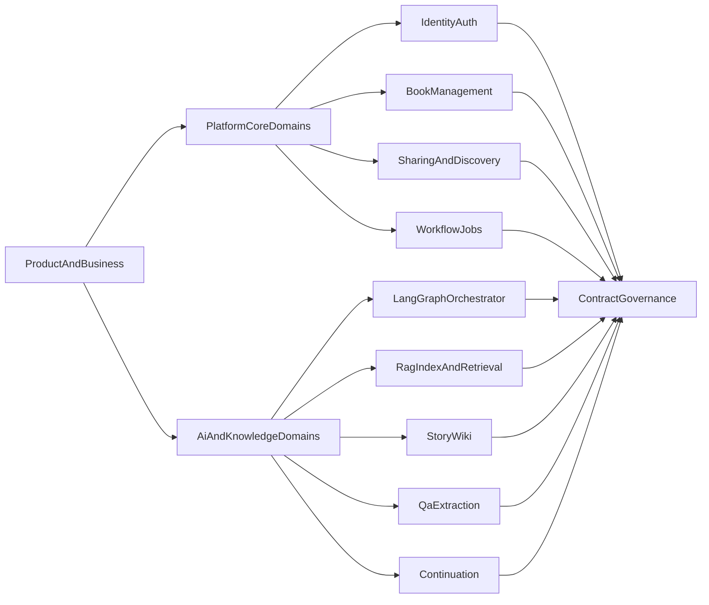

# LoreWeave Project Organization

## Document Metadata
- Document ID: LW-02
- Version: 1.1.0
- Status: Draft
- Owner: Product Manager + Solution Architect
- Last Updated: 2026-03-21
- Approved By: Pending
- Approved Date: N/A
- Summary: Operating model, team topology, and governance organization.

## Change History
| Version | Date | Change | Author |
|---|---|---|---|
| 1.1.0 | 2026-03-21 | Added governance metadata header and migrated to numbered docs structure | Assistant |
| 1.0.0 | 2026-03-21 | Baseline content established before docs reorganization | Assistant |

## Executive Purpose and Scope

This document defines how LoreWeave is organized as both:
- a business initiative (value creation, operating model, governance), and
- a technical program (solution architecture, ownership boundaries, delivery structure).

It is a planning and organizational artifact only. It does not define implementation code.

## Strategic Intent

LoreWeave is positioned as a unified platform for multilingual novel workflows:
- translation consistency,
- story knowledge intelligence (timeline, entities, relations, scenes),
- grounded QA and extraction,
- canon-aware continuation support.

The strategic gap in the market is the absence of a platform that combines these capabilities in one coherent system with multi-user platform operations.

## Product Operating Model

### Mission

Enable creators, translators, and readers to work on the same novel ecosystem with high consistency, explainability, and creative support.

### Core Value Streams

1. **Book Onboarding and Ownership**
   - users register books, manage metadata, assign visibility.

2. **Knowledge Construction**
   - platform transforms book content into searchable and reusable narrative knowledge.

3. **Grounded Assistance**
   - users ask questions, extract data, and receive evidence-linked outputs.

4. **Creative Continuation**
   - users generate continuation drafts while respecting canon constraints.

### Capability Map

- Platform capabilities: identity, access, book lifecycle, sharing, discovery.
- Knowledge capabilities: ingestion, indexing, retrieval, provenance.
- Agent capabilities: orchestration, wiki building, QA/extraction, continuation.
- Governance capabilities: contracts, release quality gates, risk management.

### Decision Cadence

- **Weekly product and architecture sync**
  - scope changes, dependency conflicts, priority updates.
- **Bi-weekly planning and re-forecast**
  - capacity, milestones, risk posture.
- **Release gate reviews per phase**
  - readiness and go/no-go decisions based on explicit criteria.

## Team Topology and Responsibilities

### Team Structure

1. **Business and Product Team**
   - defines problem framing, user segments, roadmap priorities, and KPI targets.

2. **Solution Architecture Team**
   - owns domain decomposition, boundary decisions, contract standards, and non-functional targets.

3. **Platform Core Team**
   - owns identity, book management, sharing/discovery, and policy enforcement.

4. **AI Orchestration and Knowledge Team**
   - owns orchestration, RAG foundation, wiki, QA/extraction, continuation workflows.

5. **Platform Reliability and DevEx Team**
   - owns CI/CD, observability, deployment topology, runtime health, and operational standards.

6. **QA and Validation Team**
   - owns acceptance test design, regression policy, and release confidence reporting.

### Ownership Model (RACI-style Narrative)

- **Business/Product**
  - accountable for outcome metrics and roadmap sequencing.
- **Architecture**
  - accountable for boundary coherence and architectural integrity.
- **Engineering Domain Teams**
  - responsible for implementation and service-level quality.
- **QA and Reliability**
  - responsible for verification and operational safety.
- **Cross-team review forums**
  - consulted for contract changes and critical design decisions.

## Governance Framework

### Architecture Governance

- Every cross-service design must include:
  - domain boundary statement,
  - data ownership declaration,
  - API/event contract impact.
- Architecture reviews are mandatory for:
  - new service introduction,
  - contract-breaking changes,
  - state or data model changes across domains.

### Contract and Versioning Governance

- Contracts are treated as first-class assets.
- Every API/event schema change requires:
  - semantic version impact classification,
  - backward compatibility note,
  - migration/deprecation strategy.

### Release and Risk Governance

- Each phase includes explicit readiness criteria.
- Risks are tracked by:
  - probability,
  - impact,
  - mitigation owner,
  - validation checkpoint.

## Solution Architecture Organization

### Domain Decomposition

1. **Identity and Access Domain**
   - user identity, authentication, authorization context.

2. **Book and Ownership Domain**
   - book lifecycle, ownership, visibility metadata, registration state.

3. **Sharing and Discovery Domain**
   - public/unlisted/private policies, catalog and browse views.

4. **Workflow and Orchestration Domain**
   - job lifecycle, orchestration state, retry and failure handling.

5. **Knowledge and RAG Domain**
   - ingestion, indexing, retrieval, provenance tracking.

6. **Story Knowledge Domain**
   - wiki-like knowledge outputs and narrative organization.

7. **Assistance and Continuation Domain**
   - grounded QA/extraction and canon-aware generation workflows.

### Service Boundary Principles

- A service owns one domain responsibility.
- Cross-domain access occurs only through published contracts.
- Workflow state authority is centralized in workflow governance logic (not duplicated in multiple services).
- Data duplication is allowed only when justified by query performance and with clear source-of-truth ownership.

### Data Ownership and Integration Patterns

- Transactional source of truth:
  - identity, books, sharing policies, job records.
- Knowledge source of truth:
  - indexed evidence units with provenance metadata.
- Integration patterns:
  - synchronous API for query interactions,
  - asynchronous eventing for long-running workflows.

## Architecture Mapping

## Environment and Delivery Organization

### Environment Model

- **Development**
  - fast feedback, local integration, contract validation.
- **Staging**
  - release candidate validation, performance smoke checks, cross-service compatibility checks.
- **Production**
  - controlled release, incident management, SLO monitoring.

### Delivery Responsibilities

- Product/BA:
  - story acceptance criteria and business outcome alignment.
- Architecture:
  - design integrity and dependency sequencing.
- Engineering:
  - implementation quality and contract compliance.
- Reliability:
  - observability, release automation, rollback readiness.
- QA:
  - validation matrix, regression safety, acceptance sign-off.

## Phase-by-Phase Delivery Organization

### Phase 0: Alignment and Governance Setup

- Lead: Product + Architecture
- Output:
  - approved scope,
  - approved organization model,
  - approved governance checklists.

### Phase 1: Platform Foundation Organization

- Lead: Platform Core + Reliability
- Output:
  - identity/book/sharing/discovery service ownership and operating model,
  - baseline service quality controls.

### Phase 2: Workflow and Knowledge Foundation

- Lead: AI Orchestration and Knowledge Team
- Output:
  - orchestration governance,
  - retrieval and evidence governance.

### Phase 3: Knowledge Assistance Organization

- Lead: AI Knowledge + QA
- Output:
  - wiki and QA/extraction operation model,
  - evidence and confidence review process.

### Phase 4: Continuation and Canon Safety Organization

- Lead: AI Creative + Architecture
- Output:
  - continuation quality policy,
  - canon-safety governance standards.

### Phase 5: Scale and Platform Hardening

- Lead: Reliability + Architecture + Domain Leads
- Output:
  - readiness for broader traffic,
  - reliability and compliance controls.

## Communication and Collaboration Rituals

- **Weekly planning sync**
  - cross-team dependencies and scope health.
- **Weekly architecture board**
  - boundary decisions, exceptions, governance changes.
- **Bi-weekly risk review**
  - risk register updates and mitigation tracking.
- **Monthly KPI review**
  - product adoption, reliability trends, and roadmap adjustments.
- **Incident review ritual**
  - root cause, prevention actions, ownership updates.

## Success Metrics and Exit Criteria

### Product Metrics

- Book onboarding completion rate.
- Share-to-browse conversion rate.
- Active projects per user cohort.

### Platform and Reliability Metrics

- Service availability and error budgets.
- API latency targets for critical user paths.
- Job completion success rate and retry burden.

### Knowledge and AI Metrics

- Evidence coverage rate in QA and extraction responses.
- Retrieval relevance quality trend.
- Canon-safety violation rate in continuation outputs.

### Organizational Exit Criteria (This Stage)

- Team boundaries and responsibilities are documented and accepted.
- Governance model is explicit and actionable.
- Domain/service ownership boundaries are defined without overlap ambiguity.
- Phase delivery leadership and handoff logic are clear.
- Metrics and readiness criteria are defined for program steering.

## Document Control

- Owner: Product Manager + Solution Architect
- Review cadence: bi-weekly during planning, monthly after execution starts
- Change policy: all structural updates require architecture and product sign-off

