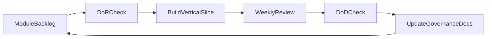

# LoreWeave Working Model - 1 Manager + 1 Executor (Scrumban)

## Document Metadata
- Document ID: LW-05
- Version: 1.1.0
- Status: Approved
- Owner: Decision Authority + Execution Authority
- Last Updated: 2026-03-21
- Approved By: Decision Authority
- Approved Date: 2026-03-21
- Summary: Scrumban working model for 1-manager + 1-executor delivery flow.

## Change History
| Version | Date | Change | Author |
|---|---|---|---|
| 1.1.0 | 2026-03-21 | Added governance metadata header and migrated to numbered docs structure | Assistant |
| 1.0.0 | 2026-03-21 | Baseline content established before docs reorganization | Assistant |

## 1) Purpose

This document defines the operating model for LoreWeave with:
- one **Decision Authority** (manager),
- one **Execution Authority** (assistant),
- Scrumban cadence,
- module-based end-to-end delivery where frontend-backend work progresses in parallel.

This is governance and workflow guidance only. It does not contain coding instructions.

## 2) Role Model

### Decision Authority (Manager)
- Owns final decisions for scope, priority, and phase transitions.
- Approves or rejects any major governance/document changes.
- Resolves conflicts when trade-offs cannot be settled by execution flow.

### Execution Authority (Assistant)
- Executes all planning, architecture, QA/reliability, and documentation operations.
- Proposes options, risks, and recommended decisions.
- Maintains consistency across project artifacts.

## 3) Why Scrumban for LoreWeave

- Scrum strengths used:
  - weekly planning rhythm,
  - defined review points,
  - explicit DoR and DoD.
- Kanban strengths used:
  - continuous flow across small module slices,
  - WIP control for a single executor,
  - flexible reprioritization with Decision Authority approval.

## 4) Delivery Unit: Module-Based Vertical Slice

Each module must represent one user-visible feature slice and include:
- frontend/UI surface,
- backend/API behavior,
- data/contract alignment,
- acceptance criteria and governance updates.

Examples of module slices:
- user sign-in flow,
- book registration flow,
- public browsing flow,
- QA query flow,
- continuation request flow.

## 5) Weekly Scrumban Cadence

### Weekly Cycle (default)
1. **Planning Gate (start of week)**: select 1-2 highest-priority modules.
2. **Execution Flow (during week)**: progress selected modules under WIP limits.
3. **Review Gate (end of week)**: assess DoD status and governance updates.
4. **Decision Gate**: Decision Authority approves carry-over, close, or reprioritize.

### Meeting Rhythm
- Planning sync: weekly
- Architecture/contract sync: weekly (lightweight)
- Risk review: bi-weekly (or ad hoc if triggered)
- Phase gate review: end-of-phase

## 6) Workflow Board and WIP Policy

Recommended board columns:
- `Backlog`
- `Ready`
- `In Progress`
- `Review`
- `Done`

WIP policy for solo executor:
- `In Progress` max: 2 modules
- `Review` max: 2 modules
- no new module starts while a blocker in `Review` remains unresolved for priority items

## 7) Definition of Ready (DoR) for Module Start

A module is **Ready** only when all are true:
- clear user outcome statement exists,
- backend and frontend acceptance points are both defined,
- dependencies and risks are listed with owner,
- contracts impacted are identified,
- Decision Authority has confirmed priority.

## 8) Definition of Done (DoD) for Module Closure

A module is **Done** only when all are true:
- planned frontend-backend scope for the module is completed,
- UI/API behavior is coherent against module acceptance criteria,
- impacted governance artifacts are updated,
- unresolved blockers are either closed or formally carried with owner and due date,
- Decision Authority accepts module closure.

## 9) Decision and Escalation Protocol

- Normal decisions are proposed by Execution Authority and approved by Decision Authority in weekly cadence.
- Urgent blockers can trigger ad hoc decision requests.
- If a module affects scope boundaries, it cannot proceed without explicit decision confirmation.
- Any exception to DoR/DoD must be logged in decision records.

## 10) Artifact Update Protocol (Mandatory)

After each module reaches `Done`, update affected governance artifacts:
- roadmap (phase/module progression),
- checklist (task closure/progress),
- RACI (if responsibility model changes),
- phase execution pack (if phase gate implications exist).

No module is considered fully closed until artifact updates are complete.

## 11) Guardrails

- Keep planning-first discipline; avoid implementation detail in governance artifacts.
- Preserve single-accountable-owner logic per decision line.
- Keep frontend-backend coupling explicit at module level.
- Prefer small, testable module scope over broad multi-feature batches.

## 12) Scrumban Flow Diagram

