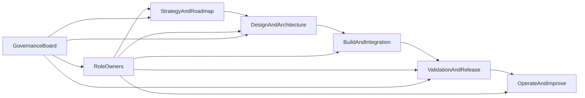

# LoreWeave Operating RACI

## Document Metadata
- Document ID: LW-06
- Version: 1.1.0
- Status: Approved
- Owner: Product Manager + Solution Architect
- Last Updated: 2026-03-21
- Approved By: Decision Authority
- Approved Date: 2026-03-21
- Summary: RACI accountability, decision rights, and escalation model.

## Change History
| Version | Date | Change | Author |
|---|---|---|---|
| 1.1.0 | 2026-03-21 | Added governance metadata header and migrated to numbered docs structure | Assistant |
| 1.0.0 | 2026-03-21 | Baseline content established before docs reorganization | Assistant |

## Purpose, Scope, and Usage Rules

This document defines decision accountability and operating responsibilities across LoreWeave planning, architecture, delivery, quality, and runtime operations.

Scope includes:
- platform-core operations (identity, book management, sharing, discovery),
- AI workflow operations (orchestration, RAG, wiki, QA/extraction, continuation),
- module-based frontend-backend integration governance (vertical feature slices),
- governance operations (contracts, release, risk, incident, change control).

Usage rules:
- This is the authority document for role accountability.
- If two documents conflict, this file controls role assignment while architecture docs control technical design.
- Any structural change in responsibilities requires formal change control and sign-off.

## Role Definitions

### Product Manager (PM)
- Owns product outcomes, roadmap priority, and go/no-go product decisions.
- Accountable for business KPI targets and value delivery sequence.

### Business Analyst (BA)
- Owns requirements quality, acceptance criteria clarity, and process traceability.
- Responsible for requirement-to-delivery continuity across phases.

### Solution Architect (SA)
- Owns domain boundaries, architecture integrity, non-functional alignment, and design arbitration.
- Approves architectural exceptions and contract-impacting design changes.

### Platform Core Lead (PCL)
- Owns implementation and runtime quality of auth/book/sharing/catalog service domains.
- Responsible for policy enforcement and platform-core delivery commitments.

### AI Orchestration Lead (AOL)
- Owns orchestration, RAG workflows, evidence policy alignment, and AI service behavior quality.
- Responsible for AI workflow reliability and canon-safe operation standards.

### QA Lead (QAL)
- Owns test governance, release quality signal, regression posture, and acceptance validation.
- Responsible for objective release readiness evidence.

### SRE and DevEx Lead (SRE)
- Owns CI/CD reliability, observability baseline, incident process, environment stability, and rollback safety.
- Responsible for operational SLO/SLI health.

### Security and Compliance Owner (SCO)
- Owns security policy controls, access risk governance, and compliance checks.
- Approves security-sensitive release gates and high-risk exceptions.

## RACI Legend and Interpretation Rules

- **R (Responsible):** executes the work.
- **A (Accountable):** final decision owner; only one A per line item.
- **C (Consulted):** must be consulted before decision/closure.
- **I (Informed):** notified after decision/closure.

Interpretation rules:
- Every operational line item must have exactly one **A**.
- **R** can be multiple roles if delivery is shared.
- If no explicit role is listed, default escalation goes to SA for technical governance and PM for product scope.

## RACI by Workstream

| Workstream | PM | BA | SA | PCL | AOL | QAL | SRE | SCO |
|---|---|---|---|---|---|---|---|---|
| Roadmap planning and sequencing | A | R | C | C | C | I | I | I |
| Requirement baselining and acceptance criteria | C | A/R | C | C | C | C | I | I |
| Architecture boundaries and service decomposition | I | C | A/R | C | C | I | C | C |
| Module slicing governance (vertical frontend-backend feature units) | C | R | A | C | C | C | I | I |
| API and event contract governance | I | C | A | R | R | C | C | C |
| Frontend-backend integration readiness per module | I | C | C | R | R | A | C | I |
| UI/API acceptance gate ownership per module | I | R | C | C | C | A | I | I |
| Platform-core delivery (auth/book/sharing/catalog) | I | C | C | A/R | I | C | C | C |
| AI workflow and RAG delivery | I | C | C | I | A/R | C | C | C |
| QA strategy, test gates, release confidence | I | C | C | C | C | A/R | C | I |
| Release operations and rollback readiness | I | I | C | C | C | C | A/R | C |
| Incident triage and postmortem governance | I | I | C | C | C | C | A/R | C |
| Security review and compliance controls | I | I | C | C | C | I | C | A/R |

## RACI by Lifecycle Phase

| Lifecycle Phase | PM | BA | SA | PCL | AOL | QAL | SRE | SCO |
|---|---|---|---|---|---|---|---|---|
| Discovery | A | R | C | I | I | I | I | I |
| Design | C | C | A/R | C | C | I | C | C |
| Build | I | C | C | A/R (platform-core) | A/R (AI domains) | C | C | I |
| Validation | I | C | C | C | C | A/R | C | C |
| Release | A (scope) | I | C | C | C | C | A/R (operations) | C |
| Operate | I | I | C | R | R | C | A/R | C |

## Decision Rights Matrix

| Decision Type | Approver | Required Consulted Roles | Decision SLA |
|---|---|---|---|
| Roadmap priority change | PM | BA, SA, affected leads | 3 business days |
| Module definition or slicing change | SA | BA, PM, impacted leads | 3 business days |
| Domain boundary change | SA | PCL, AOL, SRE, BA | 5 business days |
| Breaking API/event contract change | SA | PCL, AOL, QAL, SRE | 5 business days |
| Module UI/API acceptance gate exception | QAL | BA, SA, impacted leads | 2 business days |
| Release go/no-go | PM (scope) + SRE (operational) + QAL (quality signal) | SA, relevant leads | 1 business day pre-release |
| Security exception | SCO | SA, SRE, impacted lead | 2 business days |
| Incident severity declaration (SEV-1/SEV-2) | SRE | SA, impacted leads, SCO if security-related | 30 minutes from trigger |

## Escalation Path

1. Domain Lead -> Solution Architect (design/ownership conflicts).
2. Solution Architect + Product Manager (scope vs architecture trade-offs).
3. Product Manager + SRE + Security Owner (release safety conflicts).
4. Governance Board final ruling when deadlock exceeds SLA.

## Governance Operating Diagram

## Meeting Cadence and Required Attendees

| Meeting | Cadence | Required Attendees | Purpose |
|---|---|---|---|
| Product and Architecture Planning | Weekly | PM, BA, SA, PCL, AOL | Scope, dependencies, trade-offs |
| Contract and Interface Review | Weekly | SA, PCL, AOL, QAL, SRE | Contract changes and compatibility |
| Release Readiness Review | Per release | PM, QAL, SRE, SA, impacted leads | Go/no-go decision |
| Risk and Governance Review | Bi-weekly | PM, SA, SRE, SCO, BA | Risk posture and mitigation tracking |
| Incident Review | As needed + weekly summary | SRE, SA, impacted leads, SCO | Root cause and prevention actions |

## Change Control for RACI Updates

Any RACI update requires:
1. Change proposal with rationale and impacted workstreams.
2. Review by SA, PM, and impacted role owners.
3. Approval from Governance Board.
4. Effective date and communication plan.

No RACI changes become active before approval and publication.

## Anti-Patterns and Boundary Violations

- Multiple **A** owners for a single decision line.
- Role bypass for contract-breaking or boundary changes.
- Release approvals without QA and SRE readiness signals.
- Security-sensitive changes without SCO consultation.
- Scope changes during release window without PM and SA alignment.

## Acceptance and Sign-off Checklist

- Role catalog and boundaries are explicitly documented.
- Workstream RACI matrix is complete and conflict-free.
- Lifecycle phase RACI matrix is complete and conflict-free.
- Decision rights and escalation paths are explicit with SLAs.
- Meeting cadence and required attendees are defined.
- Change control policy for future RACI updates is clear.
- Governance-only scope is preserved (no coding instructions).

## Document Control

- Owner: Product Manager + Solution Architect
- Co-owners: QA Lead, SRE Lead
- Review cadence: monthly or after significant org change
- Change approval: Governance Board

