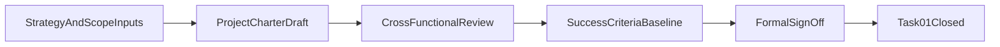

# LoreWeave Task 01 - Project Charter and Success Criteria Baseline

## Document Metadata
- Document ID: LW-07
- Version: 1.1.0
- Status: Approved
- Owner: Product Manager + Solution Architect
- Last Updated: 2026-03-21
- Approved By: Decision Authority
- Approved Date: 2026-03-21
- Summary: Task 01 charter baseline, KPI criteria, and sign-off controls.

## Change History
| Version | Date | Change | Author |
|---|---|---|---|
| 1.1.0 | 2026-03-21 | Added governance metadata header and migrated to numbered docs structure | Assistant |
| 1.0.0 | 2026-03-21 | Baseline content established before docs reorganization | Assistant |

## 1) Purpose and Intended Outcomes

This document operationalizes Task #1 from `10_BASIC_TASK_CHECKLIST.md`:
- **Confirm project charter and success criteria baseline.**

Intended outcomes:
- create one agreed project charter baseline across Product, Architecture, Platform, AI, QA, SRE, and Security;
- define measurable success criteria baseline before implementation activities begin;
- establish clear sign-off ownership and closure conditions for Task #1.

This is a planning and governance artifact only. It does not include coding or implementation instructions.

## 2) Task #1 Definition and Success Statement

### Task Definition

Task #1 is complete when LoreWeave has:
1. a reviewed and approved charter baseline, and
2. an agreed set of measurable success criteria with explicit ownership.

### Success Statement

Task #1 succeeds if all core decision-makers share one consistent answer to:
- what we are building,
- why we are building it now,
- what is in scope and out of scope for the first delivery window,
- how success will be measured and governed.

## 3) Project Charter Baseline

### 3.1 Mission

Enable creators, translators, and readers to collaborate on multilingual novels with:
- consistent translation and terminology,
- structured story intelligence,
- grounded QA/extraction,
- canon-aware continuation support.

### 3.2 Problem Statement

Current market tooling is fragmented:
- translation tools often lack knowledge continuity;
- creative tools often lack canon grounding and platform operations;
- platform tools often do not unify translation, knowledge, QA, and continuation in one operational model.

LoreWeave addresses this gap by establishing one unified platform operating model.

### 3.3 Target Users (Primary and Secondary)

Primary:
- translators and editorial operators,
- novel maintainers and content owners,
- knowledge-curation operators.

Secondary:
- readers who browse and query published works,
- creative contributors producing continuation drafts under canon constraints.

### 3.4 Value Proposition Baseline

LoreWeave delivers value through four connected streams:
1. Book onboarding and ownership control.
2. Story knowledge construction and evidence traceability.
3. Grounded assistance (QA/extraction) with provenance.
4. Continuation support with canon-safety guardrails.

### 3.5 Scope Baseline (Initial)

In-scope baseline (aligned with `03_V1_BOUNDARIES.md`):
- identity and access fundamentals,
- book management and ownership/visibility baseline,
- sharing and browsing baseline,
- workflow lifecycle baseline,
- RAG baseline retrieval with evidence,
- minimal wiki, QA/extraction, and continuation endpoint governance baseline.

Out-of-scope baseline:
- rich UI polish and full design system,
- advanced recommendation ranking,
- multi-region autoscaling and full K8s operations,
- full moderation suite,
- deep growth analytics and enterprise SSO.

### 3.6 Non-Goals Baseline

This stage does not aim to:
- optimize implementation velocity through code-level shortcuts;
- lock production-scale infrastructure decisions prematurely;
- maximize feature breadth before governance and baseline quality are validated.

### 3.7 Constraints and Assumptions

Constraints:
- planning-first discipline before implementation detail;
- clear ownership boundaries across domains;
- contract-first governance posture.

Assumptions:
- role model and decision rights in `06_OPERATING_RACI.md` are active;
- scope boundaries in `03_V1_BOUNDARIES.md` are authoritative unless formally changed;
- organization and governance in `02_PROJECT_ORGANIZATION.md` remain valid.

## 4) Success Criteria Baseline

## 4.1 Business KPI Baseline

- **B1 - Scope Stability Ratio**
  - Definition: approved scope changes / total proposed scope changes per planning cycle.
  - Baseline target: managed and documented change ratio with explicit approvals.
- **B2 - Planning Decision SLA Adherence**
  - Definition: percentage of decisions resolved within defined SLA in RACI.
  - Baseline target: all critical planning decisions resolved within SLA.
- **B3 - Stakeholder Alignment Completion**
  - Definition: percentage of required stakeholders completing charter sign-off.
  - Baseline target: 100% required-signature coverage.

## 4.2 Platform and Reliability KPI Baseline

- **P1 - Governance Gate Readiness**
  - Definition: percent of required governance gates with complete criteria and owners.
- **P2 - Dependency Clarity Score**
  - Definition: percent of identified dependencies with owner and mitigation.
- **P3 - Operational Readiness Baseline Coverage**
  - Definition: percent of release/incident review templates finalized for planning stage.

## 4.3 AI and Knowledge KPI Baseline

- **A1 - Evidence Policy Completeness**
  - Definition: QA/extraction/continuation governance requirements that include evidence expectations.
- **A2 - Canon Safety Policy Clarity**
  - Definition: continuation policy lines with explicit acceptance/rejection criteria.
- **A3 - Workflow Governance Coverage**
  - Definition: lifecycle states with owner, transition policy, and escalation rule.

## 4.4 Governance KPI Baseline

- **G1 - Role Accountability Unambiguity**
  - Definition: critical workstreams with exactly one accountable owner.
- **G2 - Contract Governance Readiness**
  - Definition: change-impact policy availability and approval path completeness.
- **G3 - Risk Register Completeness**
  - Definition: high-impact risks with owner, mitigation, and review checkpoint.

## 4.5 KPI Quality Rules

Every KPI in this baseline must be:
- specific and measurable;
- owner-assigned;
- review-cadence assigned;
- tied to a decision or governance outcome;
- time-bounded at least by phase.

## 5) Stakeholders and Decision Owners

Required stakeholder set for Task #1 closure:
- PM (product accountability),
- BA (requirements and traceability),
- SA (architecture integrity),
- PCL (platform-core ownership),
- AOL (AI workflow ownership),
- QAL (quality governance),
- SRE (operational readiness),
- SCO (security and compliance governance).

Decision owners:
- charter acceptance owner: **PM**,
- architecture/scope integrity owner: **SA**,
- readiness evidence owner: **QAL** and **SRE** (for quality and operations),
- governance conformance owner: **SCO** (for security-sensitive controls).

## 6) Dependencies and Risks for Task #1 Completion

## 6.1 Core Dependencies

- approved organization and role model;
- explicit scope in/out baseline;
- governance cadence active;
- draft success metrics available for review.

## 6.2 Risk Register (Task #1 Level)

| Risk | Impact | Likelihood | Owner | Mitigation |
|---|---|---|---|---|
| Ambiguous scope language | High | Medium | PM | Freeze scope dictionary and examples |
| Split accountability across teams | High | Medium | SA | Enforce single-accountable-owner rule |
| KPI definitions too abstract | Medium | Medium | BA | Apply KPI quality rules checklist |
| Governance SLA not adopted | Medium | Medium | PM | Add SLA adherence check in weekly governance |
| Security and compliance late involvement | High | Low/Medium | SCO | Mandatory consultation gate before sign-off |

## 7) Detailed Sub-Checklist (Deep)

## 7.1 Charter Completeness Checklist

- [ ] Mission statement is explicit and approved.
- [ ] Problem statement and market gap are explicit and approved.
- [ ] Target user segments are explicit and approved.
- [ ] Value streams are explicit and approved.
- [ ] In-scope list is explicit and approved.
- [ ] Out-of-scope list is explicit and approved.
- [ ] Non-goals list is explicit and approved.
- [ ] Constraints and assumptions are explicit and approved.

## 7.2 KPI Quality Checklist

- [ ] Every KPI has a unique ID.
- [ ] Every KPI has a plain-language definition.
- [ ] Every KPI has a named owner.
- [ ] Every KPI has a review cadence.
- [ ] Every KPI has a baseline target statement.
- [ ] Every KPI maps to a governance or value-stream decision.

## 7.3 Stakeholder Alignment Checklist

- [ ] PM confirms charter-business fit.
- [ ] BA confirms requirement traceability fit.
- [ ] SA confirms architectural consistency fit.
- [ ] PCL confirms platform-core feasibility fit.
- [ ] AOL confirms AI workflow feasibility fit.
- [ ] QAL confirms quality gate fit.
- [ ] SRE confirms operational readiness fit.
- [ ] SCO confirms security/compliance fit.

## 7.4 Sign-off Readiness Checklist

- [ ] All dependency prerequisites are satisfied.
- [ ] All high-impact risks have mitigations and owners.
- [ ] Open issues log is below agreed threshold.
- [ ] Decision log entries are complete for major trade-offs.
- [ ] Formal approval meeting is scheduled and agenda published.

## 8) Sign-off Workflow

Workflow steps:
1. Prepare charter draft and KPI baseline package.
2. Conduct cross-functional review with required stakeholders.
3. Resolve open issues and finalize acceptance conditions.
4. Conduct formal sign-off meeting.
5. Record closure evidence and publish baseline version.

## 9) Approval Record Template

Use this template during formal sign-off:

| Field | Value |
|---|---|
| Task ID | Task #1 |
| Document Version |  |
| Date |  |
| PM Decision |  |
| SA Decision |  |
| QAL Readiness Statement |  |
| SRE Readiness Statement |  |
| SCO Compliance Statement |  |
| Open Risks Accepted |  |
| Follow-up Actions |  |
| Final Status | Approved / Approved with conditions / Rework required |

## 10) Exit Criteria for Closing Task #1

Task #1 is closed only when all conditions are true:
- charter baseline is approved by PM and SA;
- success criteria baseline is complete and owner-assigned;
- required stakeholder alignment checklist is complete;
- high-impact risks have named owners and mitigation plans;
- approval record is completed and archived.

## 11) Document Control

- Owner: Product Manager + Solution Architect
- Contributors: BA, QAL, SRE, SCO, domain leads
- Review cadence while open: weekly
- Change policy: updates require PM + SA approval

