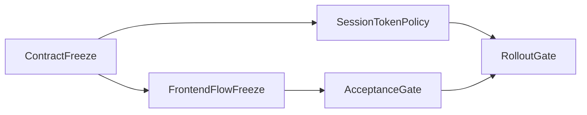

# LoreWeave Module 01 Risk, Dependency, and Rollout Plan

## Document Metadata
- Document ID: LW-M01-15
- Version: 1.2.0
- Status: Approved
- Owner: SRE + Solution Architect
- Last Updated: 2026-03-21
- Approved By: Governance Board
- Approved Date: 2026-03-21
- Summary: Dependency graph, risk register, mitigation ownership, and rollout/rollback planning for Module 01 identity scope.

## Change History
| Version | Date | Change | Author |
|---|---|---|---|
| 1.2.0 | 2026-03-21 | Added monorepo-specific risk controls and service-scoped rollout governance | Assistant |
| 1.1.0 | 2026-03-21 | Updated document status to Approved after Governance Board review | Assistant |
| 1.0.0 | 2026-03-21 | Initial risk/dependency/rollout baseline for Module 01 | Assistant |

## 1) Dependency Map

| Dependency ID | Dependency | Blocks | Owner | Status |
|---|---|---|---|---|
| M01-D01 | API contract freeze | FE flow lock and QA matrix finalization | SA | Active |
| M01-D02 | Frontend flow freeze | Integration acceptance checklist | PM | Active |
| M01-D03 | Error taxonomy alignment | Stable UX error handling | QAL | Active |
| M01-D04 | Session/token policy agreement | Rollout and incident response design | SRE | Active |
| M01-D05 | Security preference policy clarity | Compliance acceptance | SCO | Active |

## 2) Dependency Flow

## 3) Risk Register (Module 01)

| Risk ID | Description | Probability | Impact | Owner | Mitigation | Trigger | Status |
|---|---|---|---|---|---|---|---|
| M01-R01 | Contract drift between frontend and backend | Medium | High | SA | Freeze endpoint/schema draft before FE lock | API/FE mismatch found in review | Open |
| M01-R02 | Account recovery flow ambiguity | Medium | High | PM | Define reset preference policy and UX fallback | Inconsistent reset outcomes | Open |
| M01-R03 | Session invalidation edge-case confusion | Medium | Medium | SRE | Document token rotation and revocation behavior | Re-auth loops observed in tests | Open |
| M01-R04 | Verification flow delays block first-use success | Medium | Medium | BA | Provide verified and pending-verified UX states | High verification support requests | Open |
| M01-R05 | Rate-limit policy harms user onboarding | Low/Medium | Medium | SCO | Separate abuse controls and user-facing retry messaging | 429 spikes on register/login | Open |
| M01-R06 | Monorepo cross-service blast radius from shared changes | Medium | High | SA | Enforce path-based checks and service-scoped approvals | One path change impacts multiple domains | Open |
| M01-R07 | Shared contract drift under `contracts/` affects multiple services | Medium | High | SA + QAL | Require contract impact matrix and dependent checks | Incompatible schema change detected | Open |

## 4) Mitigation Ownership Protocol

- Every open risk must have one accountable owner.
- Risks without mitigation owner cannot pass Rollout Gate.
- High-impact risks require weekly status updates in module review.
- Deferred risks require explicit Decision Authority acceptance note.

## 5) Rollout Strategy (Planning-Level)

### Stage 1 - Internal Validation
- Validate all acceptance scenarios in non-production environment.
- Confirm gate evidence bundle is complete.

### Stage 2 - Controlled Rollout
- Enable identity flows for initial limited user set.
- Monitor auth failures, reset failures, and verification completion trend.

### Stage 3 - Baseline Expansion
- Expand availability once critical error rates are stable.
- Re-run acceptance smoke matrix after expansion.

## 6) Rollback Strategy

- Rollback trigger examples:
  - sustained critical auth failures
  - token/session inconsistency affecting access control
  - reset/verification flows producing security risk
- Rollback actions (planning level):
  - suspend new identity flow exposure
  - revert to last approved contract behavior baseline in affected service paths
  - publish incident and mitigation note with owner assignment

## 7) Operational Readiness Checks

- [ ] Monitoring signals are defined for login/register/reset/verify flows.
- [ ] Incident severity mapping includes identity-specific triggers.
- [ ] Escalation path references `06_OPERATING_RACI.md`.
- [ ] Rollback authority and communication path are explicit.
- [ ] Risk owners confirmed in module sign-off package.

## 8) Gate Readiness Snapshot Template

| Gate | Ready (Y/N) | Blocking Item | Owner | ETA |
|---|---|---|---|---|
| Contract Freeze |  |  |  |  |
| Frontend Flow Freeze |  |  |  |  |
| Acceptance Gate |  |  |  |  |
| Rollout Gate |  |  |  |  |
