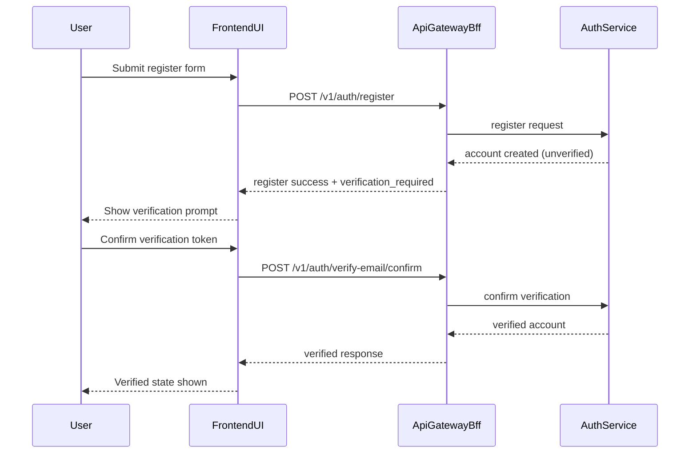
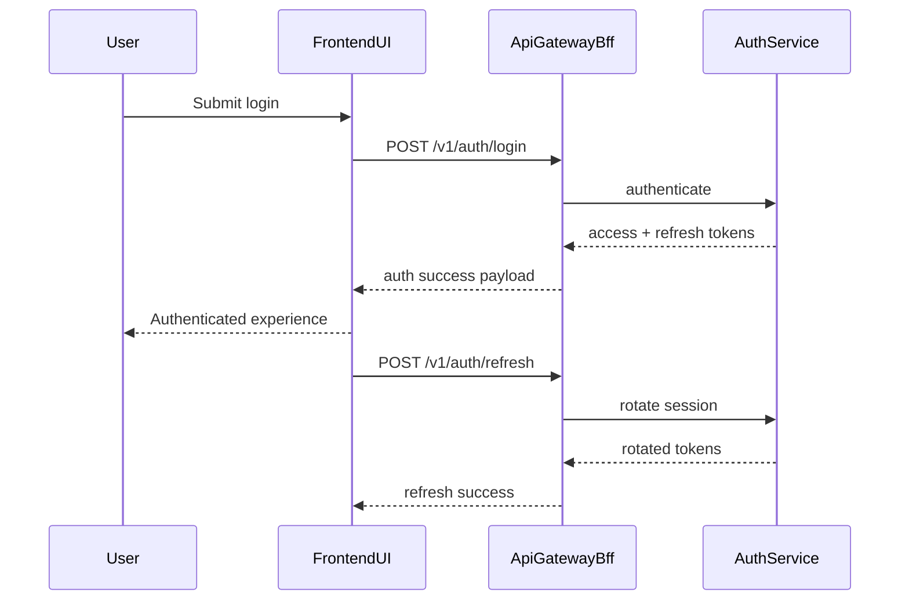
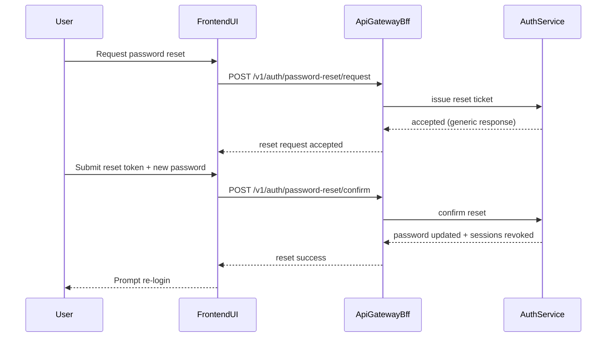
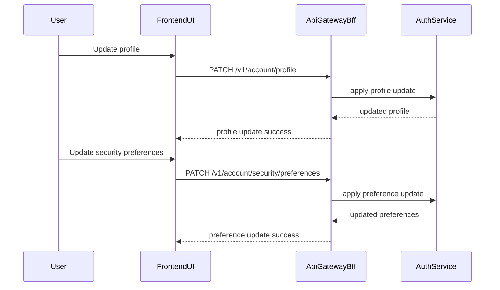
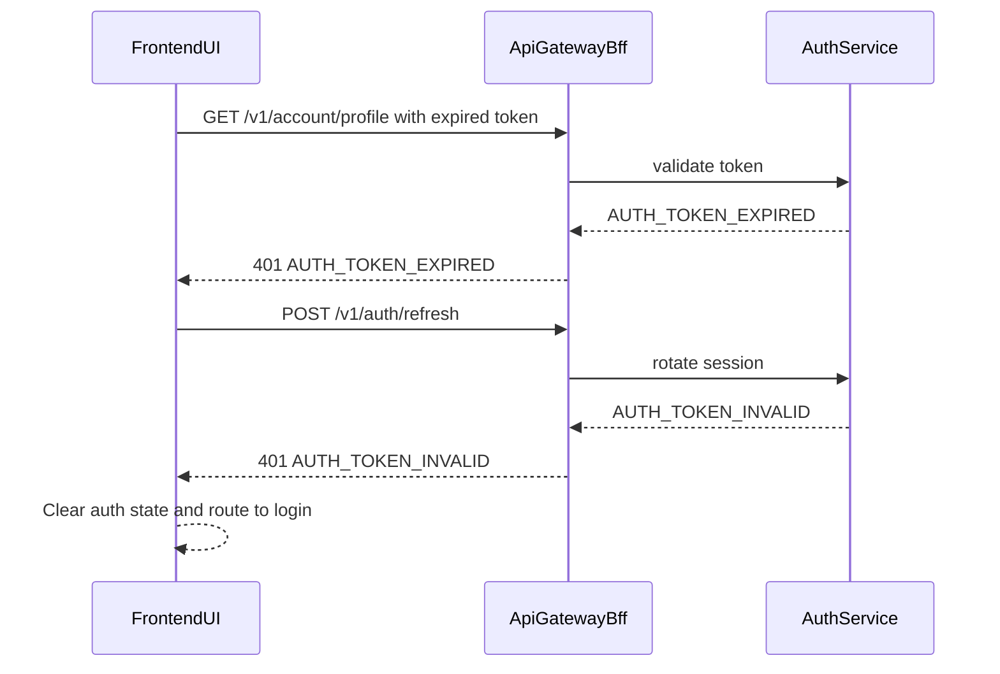
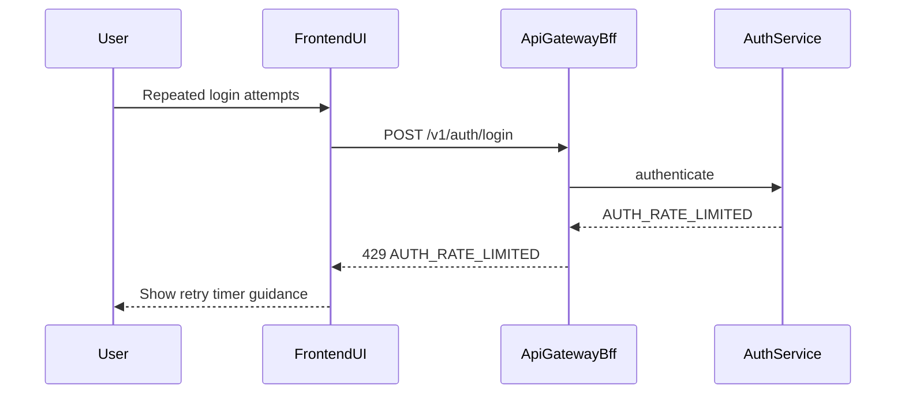

# LoreWeave Module 01 Integration Sequence Diagrams

## Document Metadata
- Document ID: LW-M01-21
- Version: 1.1.0
- Status: Draft
- Owner: Solution Architect + QA Lead
- Last Updated: 2026-03-21
- Approved By: Pending
- Approved Date: N/A
- Summary: Integration sequence diagrams for Module 01 happy paths and critical failure paths.

## Change History
| Version | Date | Change | Author |
|---|---|---|---|
| 1.1.0 | 2026-03-21 | Aligned integration sequences with monorepo service roots and shared contract governance | Assistant |
| 1.0.0 | 2026-03-21 | Initial integration sequence diagram document for Module 01 | Assistant |

## 0) Monorepo Integration Context

- `FrontendUI` maps to implementation paths in `frontend/`.
- `ApiGatewayBff` maps to `services/api-gateway-bff/`.
- `AuthService` maps to `services/auth-service/`.
- endpoint and payload expectations are governed by `contracts/api/identity/v1/`.
- monorepo ownership and CI/release controls are authoritative in `17_MODULE01_MICROSERVICE_SOURCE_STRUCTURE.md`.

## 1) Register and Verify (Happy Path)

## 2) Login and Refresh (Happy Path)

## 3) Password Reset (Happy Path)

## 4) Profile and Preference Update (Happy Path)

## 5) Failure Path - Invalid or Expired Session

## 6) Failure Path - Rate Limited Request

## 7) Integration Diagram Review Checklist

- [ ] All critical Module 01 journeys have sequence coverage.
- [ ] Failure paths include token expiry and throttling behavior.
- [ ] Actor responsibilities align with gateway/service boundaries.
- [ ] Sequence flows match API contract and frontend design documents.
- [ ] Participant boundaries align with monorepo path ownership and shared contract governance.
