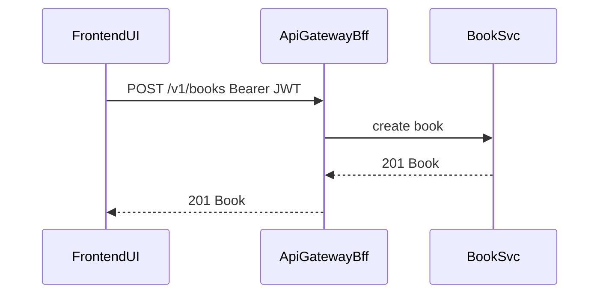
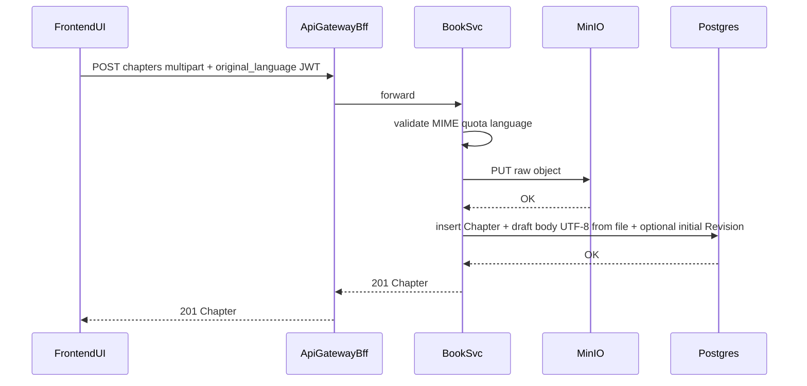
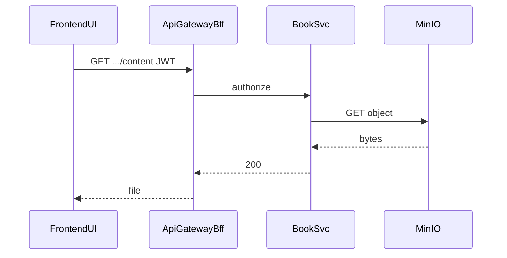
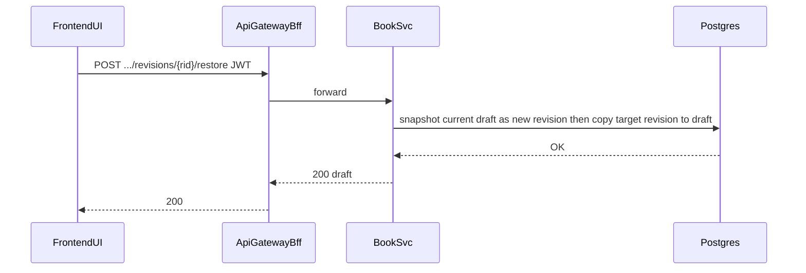
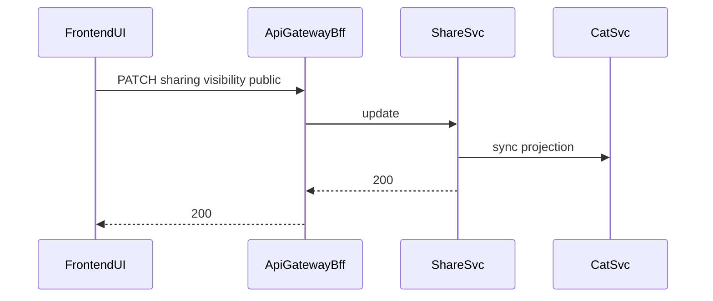
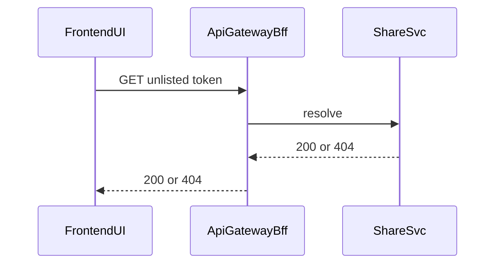

# LoreWeave Module 02 Integration Sequence Diagrams

## Document Metadata

- Document ID: LW-M02-34
- Version: 1.3.0
- Status: Approved
- Owner: Solution Architect + QA Lead
- Last Updated: 2026-03-21
- Approved By: Decision Authority
- Approved Date: 2026-03-21
- Summary: Sequences for upload→MinIO+**Postgres draft**, **PATCH draft→revision**, **restore**, **trash/restore/purge (logical)**, catalog.

## Change History

| Version | Date       | Change                                                         | Author    |
| ------- | ---------- | -------------------------------------------------------------- | --------- |
| 1.3.0   | 2026-03-21 | Approved by Decision Authority (status governance update) | Assistant |
| 1.0.0   | 2026-03-21 | Initial M02 sequences                                          | Assistant |
| 1.1.0   | 2026-03-21 | Upload chapter→MinIO, download, publish+cover                  | Assistant |
| 1.2.0   | 2026-03-21 | Seed draft + revision; PATCH draft; restore; **Pg** as draft store | Assistant |
| 1.3.0   | 2026-03-21 | Narrative: owner **DELETE** book→**trashed** (cascade chapters); **CatSvc** excludes non-active; future **GC** deletes **purge_pending** + MinIO | Assistant |

## 0) Participants

- `FrontendUI`, `ApiGatewayBff`, `BookSvc`, `ShareSvc`, `CatSvc`, `MinIO`, **`Postgres`** (draft/revisions)

## 1) Create Book



## 2) Upload Chapter — MinIO + seed draft (Postgres)



## 3) Download original upload (not draft)



## 4) PATCH draft — new revision

```mermaid
sequenceDiagram
  participant ui as FrontendUI
  participant gw as ApiGatewayBff
  participant book as BookSvc
  participant pg as Postgres

  ui->>gw: PATCH .../draft body commit_message JWT
  gw->>book: forward
  book->>book: check draft_version if present
  book->>pg: insert ChapterRevision snapshot; update draft
  pg-->>book: OK
  book-->>gw: 200 ChapterDraftResponse
  gw-->>ui: 200
```

## 5) Restore revision



## 6) Publish to public catalog



## 7) Unlisted resolve



## 8) Trash, restore, and purge (planning narrative)

- **Trash book:** `BookSvc` sets book + chapters **`trashed`**; **`CatSvc`** / **`ShareSvc`** must not serve the book to anonymous readers (**404**); implementation may use projection sync or read book lifecycle (**`25`** OQ-M02-15).
- **Purge from bin:** `BookSvc` sets **`purge_pending`** + **`purge_eligible_at`**; owner **GET** **404**; **future GC worker** deletes Postgres rows + MinIO objects in batch (**`25`** OQ-M02-13).

## 9) References

- `25_MODULE02_API_CONTRACT_DRAFT.md`
- `30_MODULE02_MICROSERVICE_SOURCE_STRUCTURE_AMENDMENT.md`
- `21_MODULE01_INTEGRATION_SEQUENCE_DIAGRAMS.md`
