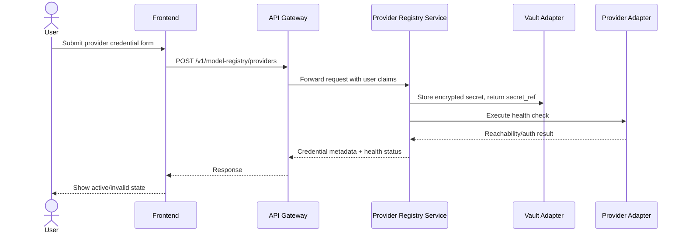
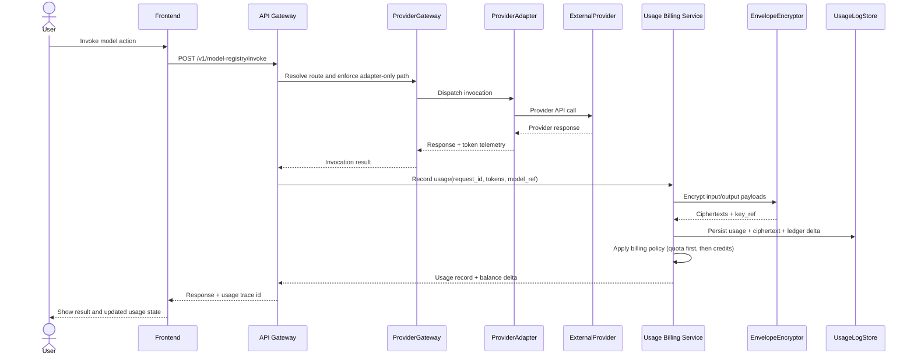
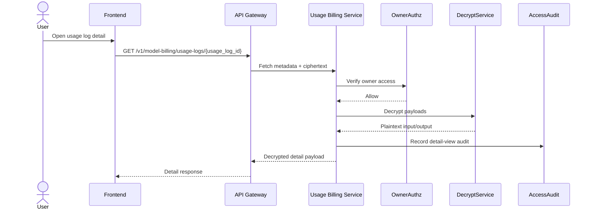
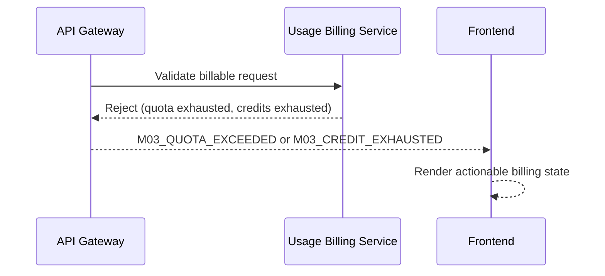
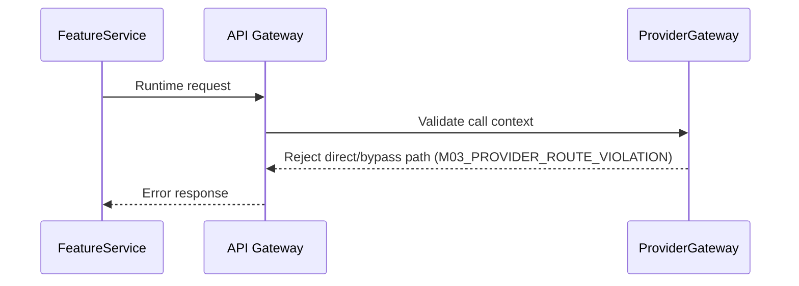

# LoreWeave Module 03 Integration Sequence Diagrams

## Document Metadata

- Document ID: LW-M03-54
- Version: 0.3.0
- Status: Approved
- Owner: Solution Architect + Backend Lead
- Last Updated: 2026-03-21
- Approved By: Decision Authority
- Approved Date: 2026-03-21
- Summary: Integration sequences for Module 03 BYOK and platform-managed model paths, including metering and billing transitions.

## Change History

| Version | Date       | Change                               | Author    |
| ------- | ---------- | ------------------------------------ | --------- |
| 0.3.0   | 2026-03-21 | Approved by Decision Authority (status governance update) | Assistant |
| 0.2.0   | 2026-03-21 | Added strict provider-gateway enforcement and encrypted interaction-log write/read sequences | Assistant |
| 0.1.0   | 2026-03-21 | Initial Module 03 integration sequences | Assistant |

## 1) BYOK Provider Registration and Health Check

## 2) Strict Provider-Gateway Invocation with Tier->Credits Billing

## 3) Owner Detail Read with Decryption and Audit

## 4) Failure Path - Quota and Credits Exhausted

## 5) Failure Path - Provider Route Violation

