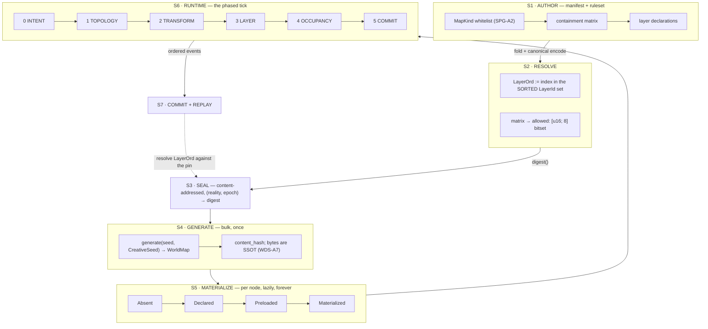

# 41 — Space dataflow: manifest to runtime
<!-- design-lint: ok prefix ML — `ML-1..ML-7` are the Multilingual / Anti-Language-Bias rules,
     owned by docs/standards/multilingual.md on the PLATFORM track. Cited here (SDF-A4 rule 6),
     not redefined; registering `ML` in this track's id catalog would claim another track's
     namespace, which is the opposite of what the catalog is for. -->

> **Prefix:** `SDF-*` (registered 2026-08-02 under a `_boundaries` claim; axioms `SDF-A1..A12`, decisions `SDF-D1..D6`,
> findings `SDF-F1..F6`, open `SDF-Q1..Q11`).
>
> **What this doc is for.** [Doc 36](36_map_architecture.md) settled the *shape* of space
> (`MapKind`, the containment matrix, `SpaceNode`). [Doc 37](37_world_data_storage.md) settled where
> its *bytes* live. **Neither says what happens between a manifest and a tick** — who writes what,
> when, in what order, and what is forbidden to read. This doc is that, and it is modelled on
> [`2026-08-02-actor-dataflow.md`](../../specs/2026-08-02-actor-dataflow.md), which is the standard.
>
> **Origin.** PO, 2026-08-02, in substance: **the map is where everything in the game happens; every
> new feature will probably attach one more data layer onto it; so if this is not designed well now, it
> will certainly break.** That is the spec's subject, not its preamble.
>
> **Status honesty.** This is a **first pass**. The actor dataflow reached its depth over many
> sessions and four measured red-team rounds. This one has **one measurement** (§2) and **eight
> research reports** ([RUN-STATE §9–16](../../plans/2026-08-02-space-substrate-RUN-STATE.md)). Its
> open register (§8) is therefore longer than its axiom list, which is the correct shape for a first
> pass and not a defect to hide.

---

## 1 — The stage boundary, and the observation that dissolves half the findings



### `SDF-A1` — **Materialization is a STAGE, not a FIELD**

This is the load-bearing observation, and it dissolves six findings at once.

Doc 36 declares `materialization: Materialization` **on the node**. A tick that honours that field must
therefore **read every resident to discover which to skip** — `O(residents)`, no matter how few are live.
Measured (§2): **92× worse than an index at 0.1 % live**, and the index costs **~1 µs to maintain at 512
churn events per tick**.

> **S5 owns a LIVE SET. The tick iterates the live set. `SpaceNode.materialization` is a
> DENORMALISATION of that set and is never its source of truth. The tick is FORBIDDEN to scan
> residents.**

What this dissolves:

| finding | why it stops being a separate problem |
|---|---|
| `M-1` (measured, §2) | it *is* this axiom |
| `R-1` — World's `ActiveSet` Roaring bitmap | the same live set, named differently |
| `R-8` — Arena's *"layers are never `SpaceNode`s"* | feature data cannot enter a structure the tick walks |
| `R-16` — *"no layer ticks"*, `Decay` computes on read | a layer is not in the live set at all |
| `R-30` — *"layers are not actors"* (150 empty Unreal components = 1 ms) | same rule, other vocabulary |
| `R-60` — Bethesda's per-cell lazy reset, *nothing ticks globally* | a stored timestamp evaluated on load *is* S5 |

**Eight independent sources reached this from eight directions.** It is the same shape as `SPG-A5`'s
parent-relative rule: **the authoritative structure is the one the hot path walks; a field that merely
records the answer invites an `O(n)` reader.**

### `SDF-A2` — space has SEVEN stages because `SPAWN` splits in two

The actor track goes `AUTHOR → RESOLVE → SEAL → SPAWN → RUNTIME → COMMIT`. An actor is spawned from an
archetype in **one** step. A space node is **generated in bulk** (S4, content-addressed, once per world)
and then **materialized per node, lazily, forever** (S5). Collapsing them is what produced `GDA-D4`'s
33 000 genesis events for a payload that regenerates in ~1 s ([`WDS-F1`](37_world_data_storage.md)).

**S4 is `O(1)` in wall-clock per world. S5 is `O(nodes actually visited)` over the world's lifetime, and
most nodes are never visited.**

### `SDF-A3` — three lifetimes, and doc 36 gave them one struct

| | authored by | mutated by | lifetime | storage |
|---|---|---|---|---|
| **Geometry** — shape, transform | S4 generation *or* an author | never (immutable per definition) | content-addressed | `WDS` baseline |
| **Topology** — parent, portals | S1 manifest *or* a topology op | Graft/Merge/Breach/Sever | event-sourced | `space_node` + `portal` |
| **Layers** — everything a feature attaches | a registered layer owner | that owner only | per-layer version | per-layer sidecar |

`SpaceNode` as declared in doc 36 mixes all three. **The layer tier must not be fields on the node**
(`R-39`/`R-51`: Unity measures **>1.5 GB for 100 k entities with unique archetypes**, 16 KB chunk
granularity; `R-40`: a merged bag crosses Postgres' **~2 032 B** TOAST cliff at exactly our layer count,
costing **2–10× on every read of any key**).

---

## 2 — The one measurement this doc rests on

Settles [`SPG-Q6`](36_map_architecture.md) — *"cost of loci acting has **never been measured**"* — which
this project recorded and then sealed an axiom on top of anyway.

**Harness:** rustc 1.89, release + LTO + `codegen-units=1`, best-of-7, single core, 65 536 residents
(one 256×256 zone), deterministic xorshift, W=8 work unit.

| live | ladder as **FIELD** | ladder as **INDEX** | ratio |
|---:|---:|---:|---:|
| 0.1 % | 27.8 µs | 0.30 µs | **92.4×** |
| 1.0 % | 26.1 µs | 3.27 µs | 8.0× |
| 25 % | 184.9 µs | 84.66 µs | 2.2× |
| 100 % | 232.6 µs | 318.56 µs | **0.7×** |

**Index maintenance — the objection that would kill it:**

| churn/tick | maintenance | index scan | **total** | field scan |
|---:|---:|---:|---:|---:|
| 64 | 0.09 µs | 3.02 µs | **3.11 µs** | 28.5 µs |
| 512 | 1.06 µs | 1.68 µs | **2.74 µs** | 28.5 µs |

### Where this measurement STOPS — stated, not buried

- **There is no capacity table here and there will not be one** until the real per-node work exists
  ([doc 21 §7](21_architecture_ceilings.md) forbids inferring headroom). v1 of the harness *had* one and
  it was meaningless — at ~1 ns of synthetic work it measured memory bandwidth, not loci. Deleted rather
  than caveated.
- **The advantage collapses on two axes**, and both are honest limits: at **100 % live the index is a
  small LOSS (0.7×)**, and as the per-node work grows the ratio falls from 40× (W=1) to **1.3× (W=256)**.
  The index matters *exactly when the per-node question is cheap* — *"does this node have anything to
  do?"* — which is the common case, and stops mattering when the answer is expensive.
- **Strategy B is not monotonic** in the live fraction, because a balanced split is the worst case for the
  branch predictor. v1 of the harness mistook that for a result.
- **The work unit is synthetic.** This measures *shape*, not loci.

---

## 3 — S6: the phased tick, and who may read or write what

The determinism rule, stated once and identical to the actor spec's, because it is the same rule:

> **A module reads only the output of a COMPLETED phase, never the in-progress state of the current one.**

| phase | may READ | may WRITE | may EMIT |
|---|---|---|---|
| **0 · Intent** | ruleset · node state **as of the previous phase 5** | the command queue only | — |
| **1 · Topology** | the command queue · containment matrix · portal set | `parent`, `portal`, node create/destroy | `Grafted` `Merged` `Breached` `Severed` |
| **2 · Transform** | topology (post-phase-1) · `mobility` | `transform`, `frame_epoch` | `FrameMoved` |
| **3 · Layer** | node state · **layers in strictly EARLIER `Phase`** | **only layers whose `owner` is this module** | `LayerChanged` |
| **4 · Occupancy** | transform · portals · layer output | `occupancy`, the **live set** | `Traversed` `Materialized` `Dematerialized` |
| **5 · Commit** | everything | — | the ordered event stream |

Five consequences, each traceable to a finding:

1. **Topology precedes transform** (`R-47`): Graft must be *one atomic event* that rewrites the edge,
   bumps `frame_epoch` on the whole subtree, and invalidates every cached world transform. Valkyrien
   Skies' [#829] is the failure — the transform updated, the dimension binding did not: **a silent
   partial Graft.**
2. **A layer may read only strictly-earlier-phase layers** (`R-33`). The registry builds the dependency
   graph from each layer's declared inputs at load and **rejects cycles**, turning *"quests secretly read
   weather"* from an undiscoverable implicit contract into a declared edge.
3. **Occupancy is last** because it depends on transform *and* portals *and* layer gates (a locked door is
   a layer).
4. **The live set is written in phase 4 and read in phase 0 of the next tick** — never mid-tick. This is
   what makes `SDF-A1` replay-safe.
5. **The ruleset is read-only for the whole tick**, and an epoch switch is inter-tick. Same as `ACT`.

### `SDF-A4` — the six determinism prohibitions

Adopted verbatim from `R-34`/`R-11`/`R-19`, because three agents independently converged and one of them
is a bug we would certainly have shipped:

1. **No hash-ordered iteration in simulation.** `HashMap` order is randomly seeded per process — a
   different replay **in the same binary on the same machine**. `BTreeMap`, sorted `Vec`, or sort-on-iterate.
2. **`LayerOrd` is derived from the SORTED `LayerId` set in the PINNED RULESET DIGEST** — never from
   registration order. Otherwise **installing a mod silently invalidates every replay.**
3. **No ordering derived from allocation** — a sparse set's dense array order depends on `swap_remove`
   history.
4. **No non-associative folds.** Any accumulated layer op must be associative with an identity,
   property-tested at registration. Non-associative fold + caching is a replay divergence that takes weeks
   to find.
5. **Dirty sets are collected freely but drained in `NodeOrdinal` order.**
6. **Never break a tie by display name.** Foundry breaks initiative ties *alphabetically by name*; in a
   multilingual project collation is locale-dependent, so **the same operation yields a different order
   under a different locale.** This is an ML-4-shaped bug in a place nobody would look for one.

---

## 4 — The layer model, which is the PO's thesis answered

### `SDF-A5` — a layer binds to a `MapKind`, not to "nodes"

**The highest-leverage decision in the whole design** (`R-29`):

> **Weather on a `Region` is 200 rows. Weather on every node is 300 000.**

`home_kinds: KindSet` is a **required** field, validated on write (`layer.kind_violation`, sibling to
`map.containment_violation`). A layer needing two scales registers **two layers plus an explicit
aggregation function** — which forces the designer to *state* the aggregation instead of discovering it
later as a bug. **~1000× reduction, obtained free from a closed set we already have.**

### `SDF-A6` — the registry, and every field is required

```rust
pub struct LayerDef {
    id:         LayerId,      // blake3-128 of the fully-qualified name. NEVER reused.
    name:       &'static str, // "weather.state" — namespaced
    owner:      ModuleId,     // the ONLY module that may write (SDF-A7)
    home_kinds: KindSet,      // SDF-A5. NEVER empty.
    storage:    StorageClass, // by density — SDF-A8
    update:     UpdatePolicy, // NO DEFAULT — SDF-A9
    lifecycle:  LifecyclePolicy, // NO DEFAULT — SDF-A10
    inherit:    Inheritance,  // SDF-A11
    scope:      Scope,        // ReadWrite | WriteOnly — R-41, GeoPackage
    schema:     SchemaVersion,
    visibility: Visibility,   // Public | OwnerOnly | PerObserver
}
```

**No `Default` impl anywhere in it.** Omitting a field is a compile error. *"The default is what you get
when someone doesn't think about it, and these are precisely the fields that must be thought about."*

`scope: ReadWrite | WriteOnly` is lifted from GeoPackage and is the single best idea in the research: **it
lets a consumer that has never heard of layer 37 decide by policy, not by guessing, whether it may still
safely read the node. Without it, "unknown layer" is undecidable.**

### `SDF-A7` — one writer per layer, enforced by the EVENT-LOG VALIDATOR

Type-level tokens are good; the load-bearing check is `layer.foreign_write`, **rejected on append**,
*"because it holds across process boundaries, across replay, and against a mod, which the type system does
not."*

### `SDF-A8` — storage class by density; `Uniform` is the default and it is load-bearing

`Uniform` (0 bytes) · `Dense` · `Sparse` (paged) · `Rare` (**sorted `Vec`** — a determinism decision, not
just a memory one) · `Interval` · `Derived` (never stored) · `BaselineOverlay` · `PerObserver`.

| mix @ 256×256 | per Locale | × 1 000 |
|---|---:|---:|
| 50 × dense `u32` | 12.5 MiB | **12.5 GiB — dead** |
| **`Uniform` default + lazy** | **~100–300 KiB** | **~100–300 MB ✓** |

> *"Fifty layers is fine. Fifty **materialized dense** layers is not."* **The default decides the outcome,
> not the count.**

### `SDF-A9` — `UpdatePolicy` has no default, and it is the tick budget's enforcement point

`Immutable` (0) · `EventDriven` (`O(events)`) · `Lazy{inputs}` (0 until read) · `Scheduled{every, phase}`
(the only per-tick cost, at its *home kind*, over a dirty set).

**`Decay` computes on READ** — store `(value, as_of_tick)` and shift on read; per-tick cost is *literally
zero*. RimWorld's `snowGrid` ticks, and that is the named anti-pattern.

**No layer may register `Scheduled` at a home kind whose live node count exceeds a threshold without a
measured budget entry.** That converts the constraint from prose into a gate.

### `SDF-A10` — `LifecyclePolicy` has no default either, and layers survive topology ops by RE-DERIVATION

RimWorld's mechanism (`R-45`), which is the deliverable the topology ops were missing: **do not transfer
layer data along node identity.** Snapshot the layer **onto the cells** before the rebuild; **re-derive**
onto the new nodes after, with a **per-layer reduction**.

> Split a hot room in half → both halves inherit the heat. Merge hot + cold → mass-weighted mixture.
> **Neither case is special-cased.**

`mean` for temperature · `max` for on-fire · `union` for permissions · `sum` for stored volume · `min` for
structural integrity.

**Three classes, three mechanisms:** *derived/simulable* → snapshot-and-reduce · *authored/non-derivable*
(ownership, permissions, storage, timers) → **store at the finest authored granularity so a Sever needs no
migration at all**, and name the survivor **explicitly in the event** · *cheap caches* → destroy and
rebuild.

> **`Sever`/`Merge` MUST carry the surviving `NodeId` in the event.** Never compute it from geometry.
> RimWorld picks by region count, SE by mass; fine for temperature, **a security defect for ownership**,
> and on a tie the winner is decided by iteration order — which is also a determinism defect.

And **`Merge` must record what it changed so `Sever` can invert it.** SE ships the bug: merge a ship to a
station → it converts to static; unmerge → **it stays static**. *An op that is not invertible from its own
event record is not event-sourced.*

### `SDF-A11` — inheritance is resolved-and-cached, never copied; invalidation is `O(depth ≤ 16)`

Bump an `ancestry_epoch` on ≤16 ancestors; every descendant discovers staleness on its next read via **one
integer compare**. A weather change over a `Region` containing **5 000 locales costs 16 increments and
touches zero descendants.**

`stop_at` must include every **coordinate-root boundary** — a Universe's "weather" is not a Locale's
weather.

### `SDF-A12` — a layer is retired, never deleted

A layer removed in v4 becomes a `Retired { decodes_through, migrate_into }` **tombstone that still
decodes.** Deleting the decoder makes the log un-replayable, and **for an event-sourced world that means
the world is gone.** Generalises [`WDS-A6`](37_world_data_storage.md), with the same acknowledged cost:
DFU's fix chain is never pruned, which is why a 2011 Minecraft world still loads.

---

## 5 — The absent tables, written out

Nothing below exists. This is the deliverable, not the prose around it.

| # | table | why it does not exist yet | blocks |
|---|---|---|---|
| **T1** | `space_node` | `SpaceNode` is docs-only; **`MapKind` does not appear in any `.rs`** | everything |
| **T2** | `space_node_live` — the live set (`SDF-A1`) | never designed; doc 36 has a field instead | the tick |
| **T3** | `portal` — `(from, to, anchor, gate)` bidirectional | **`R-14`: containment ≠ connectivity, and we have no traversal relation at all** | travel, doors, `TVL_*` |
| **T4** | `layer_registry` — one row per `LayerDef` | the whole layer model is new | every feature |
| **T5** | `layer_<name>` — one sidecar per layer | *"adding a layer is `CREATE`, never `ALTER`"* | every feature |
| **T6** | `world_baseline` — content-addressed bytes | [`WDS-A4`](37_world_data_storage.md) says copy `RulesetStore`; not built | S4 |
| **T7** | `node_occupancy` — `(entity, node, local_pos)` | `R-53`: membership is maintained **incrementally on crossing**, never by search | AOI, combat siting |
| **T8** | `frame_epoch` index | `R-49`: a cached world transform is `(Transform, frame_epoch_of_chain)` | moving frames |
| **T9** | `encounter` (`R-6`) | **`Arena` and `Encounter` are different things**; doc 36 has only the node | `SPG-D1` |

**T3 and T9 are the two the sealed design does not merely lack — it has the wrong shape for them.**

---

## 6 — Feature census: what touches a space node, and how

| feature | touches | as | phase |
|---|---|---|---|
| `GEO_001` world geometry | `World` | S4 baseline + `Dense` layers | S4 |
| `TMP_001` tilemap | `Locale` | S4 baseline + `Dense`/`Palette` | S4 |
| `CSC_001` cell scene | `Domain` | definition ref + `Sparse` | S5 |
| `MAP_001` map layout | all kinds | node fields (`kind`, transform) | S1/S2 |
| `PF_001` places | `Locale`/`Domain` | `holder` join + `Rare` | S5 |
| `TVL_001..004` travel | **`Passage`** | **T3 — does not exist** | S6/1 |
| `COMB_*` combat | `Arena` *or* in place | **T9 — does not exist** | S6/4 |
| `AIT_001` existence | all | **T2 — the live set** | S5 |
| `RES_001` resources | `Locale` | `Sparse` layer | S6/3 |
| `REP_001` reputation | `Region` | `Interval` layer | S6/3 |
| `ACT_001` actors | via `occupancy` | **T7** | S6/4 |
| weather · seasons | `Region` | `Interval` + `Scheduled` | S6/3 |
| factions · territory | `Region`/`Locale` | `Sparse` + `EventDriven` | S6/3 |
| fog of war | per-viewer | **`PerObserver` — NOT the shared store** | S6/3 |

> **`R-17`: fog of war in the shared map is a TENANCY DEFECT** by our own User Boundaries rule — one
> player's exploration must not be visible in, or mutable through, a row another player can reach. Caught
> by an agent applying our standard to a design we had not written.

---

## 7 — Amendments this doc raises against sealed doc 36

| # | target | change | evidence |
|---|---|---|---|
| `SDF-R1` | `SPG-A12` | the existence ladder is an **INDEX**; `materialization` is a denormalisation; the tick may not scan residents | **measured, §2** |
| `SDF-R2` | `SPG-A17` | `Transform` must be **integer + `scale_exp`**, not float | `R-36` (f64 covers ONE of 15 orders; 128 m ULP at EVE scale) + `R-13` (a house at tile 137,42 must round-trip) — **two agents, opposite directions** |
| `SDF-R3` | doc 36 §3 | add **`PortalSet`** — containment ≠ connectivity; portals are first-class, bidirectional, and resident below their Domain's tier | `R-14` · `R-53` (Teller 1992) · `R-59` (one-sided door links are a classic Bethesda mod bug) |
| `SDF-R4` | `SPG-D1` | in-place combat needs an **Encounter closure**; `Arena` and `Encounter` are different things | `R-6` · `R-7` |
| `SDF-R5` | `SPG-A2` | layers bind to `MapKind`; `home_kinds` required, validated on write | `R-29` |
| `SDF-R6` | `SPG-R5` | the 16×16 default gains a quantitative justification **and a cost**: layout solvers fall over at ~30 rooms (so recursion is mandatory), but over-fragmentation makes a continuous field numerically unstable | `R-62` (Edgar) · `R-48` (Barotrauma) |

---

## 8 — Open

| # | question |
|---|---|
| `SDF-Q1` | **What is the simulation grouping, and is it coarser than the structural nesting?** `R-48`: Barotrauma's devs document that over-fragmenting into many small linked hulls makes the fluid layer *numerically unstable* and propose collapsing them into one computational entity. A palace as a Domain-of-Domains with an atmosphere layer **is** that graph. Refusing rigid-body physics does not exempt us from designing the equalisation. |
| `SDF-Q2` | **What is the per-Domain object budget, and is it split placement-vs-render?** `R-54`: FFXIV is the only shipped game that publishes both (600 placed / 400 drawn) and its real bottleneck was **rehydration**, not steady state. `R-65`: an unmaterialised child Domain must not consume its parent's budget. Neither is decided here. |
| `SDF-Q3` | **`Domain → World` (內天地) has NO PRIOR ART.** Two agents searched; the nearest analogue's implementation could not be obtained. *"You are designing this without precedent."* Depth- and cycle-checking on write is the minimum; the semantics are unsettled. |
| `SDF-Q5` | **Which of `TDIL_001`'s four clocks does a decaying layer use?** (`SDF-F1`) |
| `SDF-Q6` | **Border/adjacency has no index and no phase** — the shape every territory feature asks for. (`SDF-F2`) |
| `SDF-Q7` | **Who may write TOPOLOGY?** Layers have an owner; the tree does not. `PROG_001` growing a 內天地 is a progression feature performing a Graft. (`SDF-F3`) |
| `SDF-Q8` | **History-derived layers** — traffic, schedules, contestedness. A layer class, or projections outside the layer system? I lean outside. (`SDF-F4`) |
| `SDF-Q9` | **The space-side READ contract** — bounded, ordered, deterministic *"what is here"* for prompt assembly. §3 governs writes only. (`SDF-F5`) |
| `SDF-Q10` | **Volume-keyed layers** (formations, auras, weather fronts) — `R-9`'s `Region` shape was dropped from §4. (`SDF-F6`) |
| `SDF-Q11` | **Which of `T1..T9` are reality-scoped?** Doc 37 says the node tree is per-reality and the baseline is shared by digest; §5 says neither. No multi-reality measurement exists for space. (§9.4) |
| `SDF-Q4` | **Does the delta store have a bound, and what happens at the bound?** `R-61`: No Man's Sky caps at 15 000 edits / 256 buffers and past it **the base regenerates UNDER player-authored content** — and visiting another player's base consumes *your* buffers. Our divergence log is currently unbounded. |

**Non-vacuity obligations, stated in advance** (three agents proposed these against their own
recommendations):

- A determinism gate over a node with only `Uniform` layers **cannot fail** — every representation agrees
  trivially. It must be bite-tested against one layer in **each** storage class, including one
  mid-promotion. (`R-20`)
- The replay corpus must be replayed **twice in one process, with shuffled registration order and a
  randomised hash seed**. A single-order replay cannot catch three of the six `SDF-A4` prohibitions, and
  *"without that leg, those rules are unfalsifiable claims."* (`R-34`)
- **`Fold`-on-dematerialize is synthesis, not prior art** — its own author called it *"the highest-risk
  piece of the recommendation"* and said it *"should get a prototype before it gets an axiom."* It is
  therefore **not** an axiom here.

**And the honest limit on all of §4:** *"No public ECS benchmark exceeds 6 components. There is no
published benchmark of a 50-layer scenario in any engine."* The storage argument is **mechanism plus
adjacent measurement**, not a measurement of our case. Likewise *"every performance claim in these
ecosystems is qualitative — if you need numbers, you will have to generate them."*

---

## 9 — The load: what the map must actually serve, present and future

> **Purpose: this census is a FALSIFICATION TEST, not an inventory.** §4's layer model is a hypothesis.
> The question is not *"can I list features"* but **"which feature does the model fail to carry?"** Six do.
> They are `SDF-F1..F6` below and each is a hole in what §4 just claimed.
>
> **Present load, counted rather than estimated:** **69 distinct feature ids across 134 docs in 36
> folders** under `features/`. The future column is *hypothesised from the genre commitments this project
> has already made* (cultivation/wuxia, LLM-driven NPCs, multi-reality, emergent play, daily-life sim) —
> it is deliberately speculative and marked so, because designing the layer model against only what
> exists is how it becomes unable to carry what comes.

### 9.1 The census

`D` dense · `S` sparse · `R` rare · `I` interval (value at the shallowest node that has it) · `Ø` derived
· `PO` per-observer · **`T`** = topology, not a layer at all.

| feature | home kind | shape | update | on Sever |
|---|---|---|---|---|
| `GEO_001..004` geometry, political, settlement, route | `World` | D | Immutable | re-derive |
| `TMP_001..009` tilemap | `Locale` | D/palette | Immutable | ride the cells |
| `CSC_001` cell scene | `Domain` | S | EventDriven | ride the cells |
| `MAP_001` layout | all | **T** | — | **explicit survivor** |
| `PF_001` places | `Locale`·`Domain` | R | EventDriven | ride the cells |
| `TVL_001..005` travel | **`Passage`** | **T** (`T3`) | EventDriven | explicit |
| `COMB_001..006` combat | `Arena`/in place | **`T9`** | per-turn | n/a (transient) |
| `ABL_001` abilities | — | not spatial | — | — |
| `AIT_001` existence | all | **the live set (`T2`)** | S5 | engine |
| `ACT_001`·`NPC_001..003`·`PCS_001` actors | via occupancy (`T7`) | R | EventDriven | explicit |
| `RES_001` resources | `Locale` | S | EventDriven | sum |
| `REP_001` reputation | `Region` | I | EventDriven | union |
| `FAC_001` faction | `Region`·`Locale` | S | EventDriven | **see `SDF-F2`** |
| `FF_001` family · `TIT_001` titles · `PLT_001..002` politics | `Region` | S/I | EventDriven | union |
| `PROG_001` progression | **entity, not node** | — | — | **see `SDF-F3`** |
| `DL_001` daily life | `Locale` | **Ø over history** | Lazy | **see `SDF-F4`** |
| `TDIL_001` time dilation | `Region`+ | **`T`/clock** | — | **see `SDF-F1`** |
| `WA_001..006` world authoring / Forge | all | admin writes | EventDriven | explicit |
| `IDF_001..005` identity · `PO_001` | not spatial | — | — | — |
| `PL_001..007` play loop | reads everything | **read path** | — | **see `SDF-F5`** |
| **— hypothesised —** | | | | |
| weather · seasons | `Region` | I | Scheduled(600) | copy to both |
| hazards · traps | `Domain`·`Passage` | R | EventDriven | ride the cells |
| patrols · spawn pressure | `Passage`·`Locale` | S | Scheduled | explicit |
| ley-lines / spiritual density (靈脈) | `Region`→`Locale` | I + Ø | Immutable+Lazy | mean |
| fog of war · knowledge | **per `(observer, node)`** | **PO** | EventDriven | **not shared state** |
| ownership · permissions | `Domain` | S | EventDriven | **explicit — security** |
| lighting · temperature · atmosphere | `Domain` | Ø/I | Decay-on-read | **mass-weighted mean** |
| scent · tracks | `Locale` | S | Decay-on-read | mean |
| pollution · corruption (魔氣) | `Region`→`Locale` | I+Ø | Scheduled | mean |
| economy · prices · trade flow | `Locale` (settlements) | R | Scheduled | sum |
| quest markers · narrative anchors | any | R | EventDriven | explicit |
| sect / org territory (宗門) | `Region` | S | EventDriven | **see `SDF-F2`** |
| formations / arrays (陣法) | `Domain`·`Arena` | S + volume | EventDriven | **see `SDF-F6`** |
| destruction state | `Domain` | S | EventDriven | ride the cells |
| population density | `Locale` | Ø | Lazy | sum |
| danger level | any | Ø | Lazy | max |

### 9.2 The six the model does NOT carry

#### `SDF-F1` — `Decay`-on-read has **four candidate clocks and §4 named none**

`SDF-A9` says a decaying layer stores `(value, as_of_tick)` and shifts on read. `TDIL_001` is a **4-clock
relativity model** — realm · actor · soul · body — and carries `TDIL-A11 ObservationAdvance`: *"any
observation of the channel — actor entry, cross-realm read, AIT materialization, `DL_001`
read-evaluation — first lazily advances"* it.

**Two things follow, and the second is the finding.** First, `ObservationAdvance` **is** my lazy-decay
mechanism, arrived at independently by another feature — good corroboration. Second: **`now − as_of` is
ambiguous.** A cave whose scent decays while its realm is time-dilated relative to the actor reading it
has *two different elapsed spans*, and they disagree. Worse, if the value advances **on observation**,
then **who observed it** changes the answer — which is a replay divergence the moment two observers
differ.

⇒ **`Decay` must name its clock in `LayerDef`, and the clock must be a property of the NODE's frame, not
of the reader.** Unresolved: whether a layer may legally decay on a clock its home kind does not own.
`SDF-Q5`.

#### `SDF-F2` — **border and adjacency queries have no shape in the model**

Faction territory, sect territory, political control: a per-node `faction_id` answers *"who owns this"* in
`O(1)`. It does not answer the questions the features actually ask — ***"where do two factions border"***,
*"which of my holdings is exposed"*, *"is this contiguous"*. Those are **edge predicates over the
containment tree plus the portal graph**, and §4 has neither an index nor a phase for them.

This is not hypothetical: `FAC_001`, `PLT_001/002`, `REP_001` and every hypothesised territory feature ask
it, and the research corroborates that it is the expensive shape — Paradox ships **separate `adjacencies.csv`**
alongside the province raster precisely because adjacency is not derivable cheaply from per-cell values.

⇒ **A `Border` layer kind is missing** — derived, cached, invalidated by its source layer's epoch, and
computed over the **portal graph** (`T3`), not over geometry. `SDF-Q6`.

#### `SDF-F3` — a feature that MUTATES THE TREE has no owner, and progression is one

§4 gives every *layer* an `owner: ModuleId` enforced by `layer.foreign_write`. **Phase 1 writes topology —
and nothing says who may.**

This is live, not theoretical: `PROG_001` + `SPG-A1` means **a cultivator advancing a realm grows their
內天地** — a `Domain` whose parent is an entity, gaining children as the holder progresses. That is a
progression feature performing a **Graft**. Likewise `WA_003` Forge (admin edits the tree), `TVL_*`
(opening a passage), `COMB_*` (carving an `Arena`).

⇒ **Topology ops need the same single-writer discipline as layers**, with a `topology.foreign_write`
sibling. Otherwise the one graph everything else hangs from is the only unowned thing in the design.
`SDF-Q7`.

#### `SDF-F4` — `Derived` takes LAYERS as inputs; several features derive from **HISTORY**

`SDF-A8`'s `Derived { inputs: LayerSet }` is a pure function of *other current layer values*. But:

- *"who is usually here"* (`DL_001` schedules) is a function of **occupancy over time**;
- *"how travelled is this passage"* — which `R-26` makes the **load-bearing input for emergent content**
  (*"instrument passage traversals and let content systems subscribe to measured high-centrality
  passages; do not hand-place bandits"*) — is a function of **traversal history**;
- *"how contested is this border"* is a function of **conflict events**.

None is expressible as a function of current layers.

⇒ Either a **`Windowed { source: EventKind, window }`** storage class (a decaying counter fed by the event
stream, which is `Decay` with an event source), **or** these are projections outside the layer system
entirely. **I lean to the second** — they are read models, and putting them in the layer store makes the
layer store a projection engine. `SDF-Q8`.

#### `SDF-F5` — §3 is a WRITE contract; the LLM read path is unspecified and it is the one that must be bounded

`PL_001..007` and every LLM-driven NPC decision need *"what is here"* — a view across many layers at one
node and its neighbours, assembled into a prompt. That read must be **deterministic** (replay) **and
bounded** (cost), and §3's table governs only writes.

Doc 17's `R8` prompt assembly + `GDA-D17`'s budget exist for the **actor** side; there is no space-side
equivalent. Without one, each feature invents its own traversal and the prompt's content becomes a
function of iteration order — `SDF-A4`'s prohibitions apply to the read path too, and nothing states it.

⇒ **A bounded, ordered, layer-aware read projection** — *"the space section of a prompt"* — with its own
budget. `SDF-Q9`.

#### `SDF-F6` — layers are keyed by NODE; some features are keyed by VOLUME

Formations/arrays (陣法), area auras, weather fronts, blast radii, zones of control: these are **shapes
that overlap nodes**, not values *on* nodes. `R-9`'s four-shape taxonomy has `Region` (sparse shape +
predicate — Foundry's model) for exactly this, and **§4 dropped it**, keeping only node-keyed classes.

⇒ **`StorageClass::Shape { geometry, plane }`** is missing, with the DOS2 ground-vs-volume split
(`Ground` does not occlude; `Volume` does) and Foundry's elevation bounds. Note this interacts with
`SDF-F2`: a shape layer's *"which nodes am I over"* is the same index question as a border. `SDF-Q10`.

### 9.3 One thing the census confirms rather than breaks

**Every non-hypothetical feature binds to ONE `MapKind`** — the column is never ambiguous. `SDF-A5`'s
required `home_kinds` survives its first real load, and the ~1000× reduction it buys is available for all
69 present features. That is the model's strongest result here, and it is worth stating because the rest
of this section is the model failing.

### 9.4 And one gap in what was just committed

**`T1..T9` never says which tables are reality-scoped.** [Doc 37](37_world_data_storage.md) is explicit
that the `space_node` tree is *"per-reality Postgres"* while the generated baseline is **content-addressed
and shared by digest across realities**. So `T6` (baseline) is shared and `T1`, `T2`, `T4`, `T5`, `T7` are
per-reality — and **the multi-reality tax the actor track measured in its own red-team round has no
equivalent measurement here.** `SDF-Q11`.
