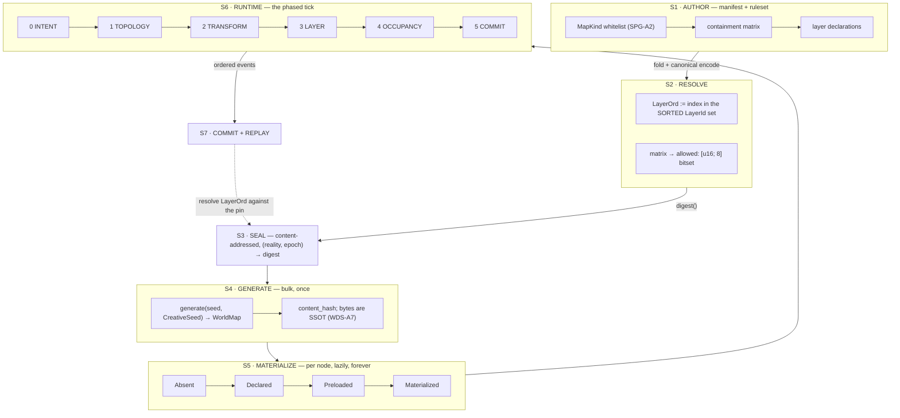

# 41 — Space dataflow: manifest to runtime
<!-- design-lint: ok prefix ML — `ML-1..ML-7` are the Multilingual / Anti-Language-Bias rules,
     owned by docs/standards/multilingual.md on the PLATFORM track. Cited here (SDF-A4 rule 6),
     not redefined; registering `ML` in this track's id catalog would claim another track's
     namespace, which is the opposite of what the catalog is for. -->

> **Prefix:** `SDF-*` (registered 2026-08-02 under a `_boundaries` claim; axioms `SDF-A1..A30`,
> decisions `SDF-D1..D6`, findings `SDF-F1..F9`, amendments `SDF-R1..R9` — **two applied (`R1`, `R2`), seven proposed** —
> open `SDF-Q1..Q18`, of which **sixteen are resolved and TWO remain** — `Q12`, blocked on a `PROG_001`
> parameter that does not exist and which this tier may not invent, and `Q15`, which needs a space
> view to measure and that view is not built yet, §8.1).
>
> **What this doc is for.** [Doc 36](36_map_architecture.md) settled the *shape* of space
> (`MapKind`, the containment matrix, `SpaceNode`). [Doc 37](37_world_data_storage.md) settled where
> its *bytes* live. **Neither says what happens between a manifest and a tick** — who writes what,
> when, in what order, and what is forbidden to read. This doc is that, and it is modelled on
> [`2026-08-02-actor-dataflow.md`](../../specs/2026-08-02-actor-hub/analysis/2026-08-02-actor-dataflow.md) — **which became a DERIVATION RECORD on 2026-08-02. The standards are now [`2026-08-02-actor-hub.md`](../../specs/2026-08-02-actor-hub/2026-08-02-actor-hub.md) (the hub) and [`2026-08-02-engine-substrate.md`](../../specs/2026-08-02-actor-hub/2026-08-02-engine-substrate.md) (the layer beneath).**
>
> **Origin.** PO, 2026-08-02, in substance: **the map is where everything in the game happens; every
> new feature will probably attach one more data layer onto it; so if this is not designed well now, it
> will certainly break.** That is the spec's subject, not its preamble.
>
> **Status honesty.** This is a **first pass**. The actor dataflow reached its depth over many
> sessions and four measured red-team rounds. This one has **one measurement** (§2) and **eight
> research reports** ([RUN-STATE §9–16](../../plans/2026-08-02-space-substrate-RUN-STATE.md)).
>
> **What changed since that sentence was written, and what did not.** The open register opened at
> `Q1..Q11` *longer than the axiom list* — the correct shape for a first pass. Four analysis rounds
> (§10–§13) then closed thirteen rows and grew the axioms to thirty. **That is not the same as being
> finished.** The four rows left (§8.1) are the ones no argument can close: **every one of them now needs
> a MEASUREMENT**, and one of them (`SDF-Q12`) cannot be closed by this tier at all, because its answer
> lives in a `PROG_001` parameter. The honest summary is that the *design* questions are answered and the
> *arithmetic* has not been run.
>
> **Reading order.** §1–§8 are **normative** — the contract. §9–§13 are the **analyses that produced it**,
> kept because the reasoning is the evidence. Where a §9–§13 axiom changed the contract, **the change was
> folded back into §1–§8** on the reconciliation pass rather than left as an appendix; a doc that states
> its contract in one place and amends it in another has two readings, which is the defect this whole arc
> is about. Two `LayerDef` fields and one determinism rule arrived that way, and one of them exposed a
> false claim — see §4.

---

## 1 — The stage boundary, and the observation that dissolves half the findings



### `SDF-A1` — **Materialization is a STAGE, not a FIELD**

This is the load-bearing observation, and it dissolves six findings at once.

Doc 36 declares `materialization: Materialization` **on the node**. A tick that honours that field must
therefore **read every resident to discover which to skip** — `O(residents)`, no matter how few are live.
Measured (§2): **92× worse than an index at 0.1 % live**, and the index costs **~1 µs to maintain at 512
churn events per tick**.

> **S5 owns a LIVE SET. The tick iterates the live set. `SpaceNode.materialization` is a
> DENORMALISATION of that set and is never its source of truth. The tick is FORBIDDEN to scan
> residents.**

What this dissolves:

| finding | why it stops being a separate problem |
|---|---|
| `M-1` (measured, §2) | it *is* this axiom |
| `R-1` — World's `ActiveSet` Roaring bitmap | the same live set, named differently |
| `R-8` — Arena's *"layers are never `SpaceNode`s"* | feature data cannot enter a structure the tick walks |
| `R-16` — *"no layer ticks"*, `Decay` computes on read | a layer is not in the live set at all |
| `R-30` — *"layers are not actors"* (150 empty Unreal components = 1 ms) | same rule, other vocabulary |
| `R-60` — Bethesda's per-cell lazy reset, *nothing ticks globally* | a stored timestamp evaluated on load *is* S5 |

**Eight independent sources reached this from eight directions.** It is the same shape as `SPG-A5`'s
parent-relative rule: **the authoritative structure is the one the hot path walks; a field that merely
records the answer invites an `O(n)` reader.**

### `SDF-A2` — space has SEVEN stages because `SPAWN` splits in two

The actor track goes `AUTHOR → RESOLVE → SEAL → SPAWN → RUNTIME → COMMIT`. An actor is spawned from an
archetype in **one** step. A space node is **generated in bulk** (S4, content-addressed, once per world)
and then **materialized per node, lazily, forever** (S5). Collapsing them is what produced `GDA-D4`'s
33 000 genesis events for a payload that regenerates in ~1 s ([`WDS-F1`](37_world_data_storage.md)).

**S4 is `O(1)` in wall-clock per world. S5 is `O(nodes actually visited)` over the world's lifetime, and
most nodes are never visited.**

> **And the one rule S4 must obey, adopted on the slice-7 pass** (`R-63`): **generation ANNOTATES stable
> nodes. It never moves or deletes them.** *Unexplored* — ~50 modules, ~5 000 rules, 24 cycle types —
> builds a level as a **sequence of annotations over stable node identity**, which its authors note is
> *"extremely friendly to event sourcing and deterministic replay"*; semantic edges are first-class and
> **survive spatial rearrangement**, so a key stays linked to its lock through every rewrite even as
> positions change. A generator that deletes and re-creates nodes makes every id in the log dangle, which
> is `SDF-A12`'s *"retire, never delete"* arriving one stage earlier. **Cycles nest** in that system too —
> *"a new cycle inside of an existing one"* — which is the recursion precedent `Domain → Domain` had been
> missing.

### `SDF-A3` — three lifetimes, and doc 36 gave them one struct

| | authored by | mutated by | lifetime | storage |
|---|---|---|---|---|
| **Geometry** — shape, transform | S4 generation *or* an author | never (immutable per definition) | content-addressed | `WDS` baseline |
| **Topology** — parent, portals | S1 manifest *or* a topology op | Graft/Merge/Breach/Sever | event-sourced | `space_node` + `portal` |
| **Layers** — everything a feature attaches | a registered layer owner | that owner only | per-layer version | per-layer sidecar |

`SpaceNode` as declared in doc 36 mixes all three. **The layer tier must not be fields on the node**
(`R-39`/`R-51`: Unity measures **>1.5 GB for 100 k entities with unique archetypes**, 16 KB chunk
granularity; `R-40`: a merged bag crosses Postgres' **~2 032 B** TOAST cliff at exactly our layer count,
costing **2–10× on every read of any key**).

---

## 2 — The one measurement this doc rests on

Settles [`SPG-Q6`](36_map_architecture.md) — *"cost of loci acting has **never been measured**"* — which
this project recorded and then sealed an axiom on top of anyway.

**Harness:** rustc 1.89, release + LTO + `codegen-units=1`, best-of-7, single core, 65 536 residents
(one 256×256 zone), deterministic xorshift, W=8 work unit.

| live | ladder as **FIELD** | ladder as **INDEX** | ratio |
|---:|---:|---:|---:|
| 0.1 % | 27.8 µs | 0.30 µs | **92.4×** |
| 1.0 % | 26.1 µs | 3.27 µs | 8.0× |
| 25 % | 184.9 µs | 84.66 µs | 2.2× |
| 100 % | 232.6 µs | 318.56 µs | **0.7×** |

**Index maintenance — the objection that would kill it:**

| churn/tick | maintenance | index scan | **total** | field scan |
|---:|---:|---:|---:|---:|
| 64 | 0.09 µs | 3.02 µs | **3.11 µs** | 28.5 µs |
| 512 | 1.06 µs | 1.68 µs | **2.74 µs** | 28.5 µs |

### Where this measurement STOPS — stated, not buried

- **There is no capacity table here and there will not be one** until the real per-node work exists
  ([doc 21 §7](21_architecture_ceilings.md) forbids inferring headroom). v1 of the harness *had* one and
  it was meaningless — at ~1 ns of synthetic work it measured memory bandwidth, not loci. Deleted rather
  than caveated.
- **The advantage collapses on two axes**, and both are honest limits: at **100 % live the index is a
  small LOSS (0.7×)**, and as the per-node work grows the ratio falls from 40× (W=1) to **1.3× (W=256)**.
  The index matters *exactly when the per-node question is cheap* — *"does this node have anything to
  do?"* — which is the common case, and stops mattering when the answer is expensive.
- **Strategy B is not monotonic** in the live fraction, because a balanced split is the worst case for the
  branch predictor. v1 of the harness mistook that for a result.
- **The work unit is synthetic.** This measures *shape*, not loci.

---

## 3 — S6: the phased tick, and who may read or write what

The determinism rule, stated once and identical to the actor spec's, because it is the same rule:

> **A module reads only the output of a COMPLETED phase, never the in-progress state of the current one.**

| phase | may READ | may WRITE | may EMIT |
|---|---|---|---|
| **0 · Intent** | ruleset · node state **as of the previous phase 5** | the command queue only | — |
| **1 · Topology** | the command queue · containment matrix · **scale matrix** (`SDF-A19`) · portal set | `parent`, `portal`, node create/destroy · **invalidates every per-layer simulation group** (`SDF-A27`) | `Grafted` `Merged` `Breached` `Severed` |
| **2 · Transform** | topology (post-phase-1) · `mobility` | `transform`, `frame_epoch` | `FrameMoved` |
| **3 · Layer** | node state · **layers in strictly EARLIER `Phase`** · **projections at a PINNED version** (`SDF-A4` rule 7) | **only layers whose `owner` is this module** | `LayerChanged` |
| **4 · Occupancy** | transform · portals · layer output · **a DECLARED adjacency relation** (`SDF-A25`) | `occupancy`, the **live set** | `Traversed` `Materialized` `Dematerialized` |
| **5 · Commit** | everything | — | the ordered event stream |

Six consequences, each traceable to a finding:

1. **Topology precedes transform** (`R-47`): Graft must be *one atomic event* that rewrites the edge,
   bumps `frame_epoch` on the whole subtree, and invalidates every cached world transform. Valkyrien
   Skies' [#829] is the failure — the transform updated, the dimension binding did not: **a silent
   partial Graft.**
2. **A layer may read only strictly-earlier-phase layers** (`R-33`). The registry builds the dependency
   graph from each layer's declared inputs at load and **rejects cycles**, turning *"quests secretly read
   weather"* from an undiscoverable implicit contract into a declared edge.
3. **Occupancy is last** because it depends on transform *and* portals *and* layer gates (a locked door is
   a layer).
4. **The live set is written in phase 4 and read in phase 0 of the next tick** — never mid-tick. This is
   what makes `SDF-A1` replay-safe.
5. **The ruleset is read-only for the whole tick**, and an epoch switch is inter-tick. Same as `ACT`.
6. **The simulation grouping is invalidated in phase 1 and consumed in phase 3** (`SDF-A27`, added on the
   reconciliation pass). A layer's group is the connected components under its own `EdgePolicy`, so a
   `Sever` in phase 1 can split an air group that phase 3 is about to equalise. **Recomputing it is a
   subscriber to the topology event, never a scan** — which is only affordable because `SDF-A16` already
   made every topology op an event.

### `SDF-A4` — the determinism prohibitions: six adopted, one derived

Rules 1–6 are adopted **verbatim** from `R-34`/`R-11`/`R-19`, because three agents independently converged
and one of them is a bug we would certainly have shipped. **Rule 7 is ours**, derived in §13.2 and added on
the reconciliation pass — it is the only one with no external corroboration, and it is marked so:

1. **No hash-ordered iteration in simulation.** `HashMap` order is randomly seeded per process — a
   different replay **in the same binary on the same machine**. `BTreeMap`, sorted `Vec`, or sort-on-iterate.
2. **`LayerOrd` is derived from the SORTED `LayerId` set in the PINNED RULESET DIGEST** — never from
   registration order. Otherwise **installing a mod silently invalidates every replay.**
3. **No ordering derived from allocation** — a sparse set's dense array order depends on `swap_remove`
   history.
4. **No non-associative folds.** Any accumulated layer op must be associative with an identity,
   property-tested at registration. Non-associative fold + caching is a replay divergence that takes weeks
   to find.
5. **Dirty sets are collected freely but drained in `NodeOrdinal` order.**
6. **Never break a tie by display name.** Foundry breaks initiative ties *alphabetically by name*; in a
   multilingual project collation is locale-dependent, so **the same operation yields a different order
   under a different locale.** This is an ML-4-shaped bug in a place nobody would look for one.
7. **No read of a LIVE projection inside a tick** — *derived here, §13.2, no external corroboration.* A
   `Derived` layer or a space view may read a projection (`SDF-A29`) only at a **version pinned for the
   whole tick**, the same discipline as `R-23`'s metric epoch. A projection that advances mid-tick makes
   two readers in one tick disagree, which is rule 2's failure arriving on the **read** path, where the
   ruleset digest does not protect us.

---

## 4 — The layer model, which is the PO's thesis answered

### `SDF-A5` — a layer binds to a `MapKind`, not to "nodes"

**The highest-leverage decision in the whole design** (`R-29`):

> **Weather on a `Region` is 200 rows. Weather on every node is 300 000.**

`home_kinds: KindSet` is a **required** field, validated on write (`layer.kind_violation`, sibling to
`map.containment_violation`). A layer needing two scales registers **two layers plus an explicit
aggregation function** — which forces the designer to *state* the aggregation instead of discovering it
later as a bug. **~1000× reduction, obtained free from a closed set we already have.**

### `SDF-A6` — the registry, and every field is required

```rust
pub struct LayerDef {
    id:         LayerId,      // blake3-128 of the fully-qualified name. NEVER reused.
    name:       &'static str, // "weather.state" — namespaced
    owner:      ModuleId,     // the ONLY module that may write (SDF-A7)
    home_kinds: KindSet,      // SDF-A5. NEVER empty.
    storage:    StorageClass, // by density — SDF-A8
    update:     UpdatePolicy, // NO DEFAULT — SDF-A9
    lifecycle:  LifecyclePolicy, // NO DEFAULT — SDF-A10
    edges:      EdgePolicyMatrix, // NO DEFAULT — SDF-A27. Per EDGE KIND:
                              //   Propagates | Blocks. Determines this layer's
                              //   simulation grouping. See §13.1.
    inherit:    Inheritance,  // SDF-A11
    scope:      Scope,        // ReadWrite | WriteOnly — R-41, GeoPackage
    projection: ProjectionPolicy, // NO DEFAULT — SDF-A26. How this layer renders
                              //   into a space view + its drop priority under
                              //   budget. Declared by the OWNER, never the reader.
    schema:     SchemaVersion,
    visibility: Visibility,   // Public | OwnerOnly | PerObserver
}
```

**No `Default` impl anywhere in it.** Omitting a field is a compile error. *"The default is what you get
when someone doesn't think about it, and these are precisely the fields that must be thought about."*

> **⚠ `edges` and `projection` were added on the reconciliation pass, and the second one was a defect.**
> Both fields are demanded by axioms this doc derived *after* §4 was written (`SDF-A26` in §12.5,
> `SDF-A27` in §13.1). `projection` announces itself — `SDF-A26` says *"`LayerDef` **gains**"*. **`edges`
> did not.** `SDF-A27`'s second consequence argues *"no new authoring surface, because `EdgePolicy` is
> already required at layer registration"* — **and against §4 as written, that was false.** The argument
> was sound about `R-46`'s research and wrong about our own struct, which is the cheapest possible version
> of *believing a table instead of opening the target*. The claim is now true because this edit made it
> true; it was not true when it was written. Recorded in the run-state drift log.

> **And one field deliberately NOT added: a clock.** `SDF-F1` implied `LayerDef` was missing one;
> `SDF-A28` shows the clock is a property of the **node's nearest realm-declaring ancestor**, so a field
> here would be a second source of truth for something the tree already knows. **The absence is the
> decision** — see §13.1.

`scope: ReadWrite | WriteOnly` is lifted from GeoPackage and is the single best idea in the research: **it
lets a consumer that has never heard of layer 37 decide by policy, not by guessing, whether it may still
safely read the node. Without it, "unknown layer" is undecidable.**

**Two rules about the registry itself**, both from research that the first pass adopted the *conclusions*
of and dropped the *rules* (found by the slice-7 adjudication, RUN-STATE §22):

- **The core registers through the identical mechanism as a plugin — no privileged path** (`R-18`).
  RimWorld ships **15 hardcoded grid fields on `Map`** *and* a working reflection-registered
  `MapComponent` plugin path, **and the core does not use its own extension point** — so adding grid #16
  requires recompiling `Map` while a mod adds one for free. *"If the core doesn't dogfood the extension
  point, the extension point is decoration."* This is the repo's own **no-silent-no-op / the API
  advertises only what the engine wires** discipline, arrived at from outside it.
- **No accessor may materialise a layer as a side effect of reading it** (`R-41`). NeoForge's `getData()`
  **allocates and attaches a default when absent** while `hasData()` does not — so one read-heavy path
  using the auto-vivifying accessor materialises every layer on every node it touches, which is `SDF-A8`'s
  entire memory argument defeated by an API-naming choice. **Make the allocating call impossible to type
  by accident:** `get_or_default` says so in its name; `get_layer` never allocates.

### `SDF-A7` — one writer per layer, enforced by the EVENT-LOG VALIDATOR

Type-level tokens are good; the load-bearing check is `layer.foreign_write`, **rejected on append**,
*"because it holds across process boundaries, across replay, and against a mod, which the type system does
not."*

### `SDF-A8` — storage class by density; `Uniform` is the default and it is load-bearing

`Uniform` (0 bytes) · `Dense` · `Sparse` (paged) · `Rare` (**sorted `Vec`** — a determinism decision, not
just a memory one) · `Interval` · `Derived` (never stored) · `BaselineOverlay` · `PerObserver`.

**The set is CLOSED at eight, and two later analyses tried to extend it and were refused:**

| the pressure | the answer | where |
|---|---|---|
| volume-keyed data (formations 陣法, auras, weather fronts) wants a `Shape` class | **refused.** A shape is an *authoring and command* concept that resolves to a node-set **at write time** and stores as ordinary `Sparse`. `SDF-A24` | §12.3 |
| history-derived values (traffic, contestedness, *"who is usually here"*) want a history class | **refused.** They are **projections**, not layers — the tier already ships. `SDF-A29` | §13.2 |

> **`Derived` reads only from a PINNED version.** `SDF-A29` lets a `Derived` recipe read a projection;
> `SDF-A4` rule 7 requires the version be pinned for the tick. A recipe reading a projection that advanced
> mid-tick is a replay divergence wearing a read-model's clothes.

**Layer presence is a BIT on the node, never part of the node's TYPE** (`R-51`, adopted on the slice-7
pass — three agents argued it and none of it had been written down). A fixed `SpaceNode` layout carries a
`LayerMask` of presence bits; the data lives in per-layer side tables. Without the mask, *"which layers
does this node have"* costs a probe into every sidecar.

> **And the refusal that follows from it, stated because three independent agents reached it and the doc
> recorded none of them: an archetype ECS is DISQUALIFIED for this design.** Not "not chosen" — 
> disqualified, for four separate reasons, each sufficient on its own:
>
> | reason | evidence |
> |---|---|
> | `Optional` is the pathological query shape **and it is exactly ours** | flecs: *"a query that only has `Optional` terms will match all entities."* *"Give me every node plus whichever of the 50 layers it has"* is the worst case **by construction** (`R-39`) |
> | a structural change costs `O(total bytes on the entity)` | toggling one layer on a 50-layer node copies the other 49 — measured **24 ns sparse-set vs 246 ns archetype** (`R-39`) |
> | archetype count ratchets **monotonically upward** and taxes every unrelated query | Bevy: *"empty archetypes are not removed… persist until the world is dropped."* **For a persistent MMO this is disqualifying on its own** (`R-39`) |
> | N optional layers ⇒ up to **2ⁿ** archetypes, and memory is **chunk-granular** | Unity: 100 000 entities with unique archetypes allocate **>1.5 GB**, *"most of it empty"* (`R-51`) |
>
> **The converse is why it does not cost us anything:** our cells never change composition — cell 41 203
> has a biome for the world's lifetime — so the archetype *iteration* win is available with exactly one
> archetype, and a general ECS would be machinery we pay for and never use (`R-5`). **The honest limit:
> no public ECS benchmark exceeds 6 components, so this is mechanism plus adjacent measurement, not a
> measurement of our case** (§8).

| mix @ 256×256 | per Locale | × 1 000 |
|---|---:|---:|
| 50 × dense `u32` | 12.5 MiB | **12.5 GiB — dead** |
| **`Uniform` default + lazy** | **~100–300 KiB** | **~100–300 MB ✓** |

> *"Fifty layers is fine. Fifty **materialized dense** layers is not."* **The default decides the outcome,
> not the count.**

### `SDF-A9` — `UpdatePolicy` has no default, and it is the tick budget's enforcement point

`Immutable` (0) · `EventDriven` (`O(events)`) · `Lazy{inputs}` (0 until read) · `Scheduled{every, phase}`
(the only per-tick cost, at its *home kind*, over a dirty set).

**`Decay` computes on READ** — store `(value, as_of_tick)` and shift on read; per-tick cost is *literally
zero*. RimWorld's `snowGrid` ticks, and that is the named anti-pattern.

**No layer may register `Scheduled` at a home kind whose live node count exceeds a threshold without a
measured budget entry.** That converts the constraint from prose into a gate.

### `SDF-A10` — `LifecyclePolicy` has no default either, and layers survive topology ops by RE-DERIVATION

RimWorld's mechanism (`R-45`), which is the deliverable the topology ops were missing: **do not transfer
layer data along node identity.** Snapshot the layer **onto the cells** before the rebuild; **re-derive**
onto the new nodes after, with a **per-layer reduction**.

> Split a hot room in half → both halves inherit the heat. Merge hot + cold → mass-weighted mixture.
> **Neither case is special-cased.**

`mean` for temperature · `max` for on-fire · `union` for permissions · `sum` for stored volume · `min` for
structural integrity.

**Three classes, three mechanisms:** *derived/simulable* → snapshot-and-reduce · *authored/non-derivable*
(ownership, permissions, storage, timers) → **store at the finest authored granularity so a Sever needs no
migration at all**, and name the survivor **explicitly in the event** · *cheap caches* → destroy and
rebuild.

> **`Sever`/`Merge` MUST carry the surviving `NodeId` in the event.** Never compute it from geometry.
> RimWorld picks by region count, SE by mass; fine for temperature, **a security defect for ownership**,
> and on a tie the winner is decided by iteration order — which is also a determinism defect.

And **`Merge` must record what it changed so `Sever` can invert it.** SE ships the bug: merge a ship to a
station → it converts to static; unmerge → **it stays static**. *An op that is not invertible from its own
event record is not event-sourced.*

### `SDF-A11` — inheritance is resolved-and-cached, never copied; invalidation is `O(depth ≤ 16)`

Bump an `ancestry_epoch` on ≤16 ancestors; every descendant discovers staleness on its next read via **one
integer compare**. A weather change over a `Region` containing **5 000 locales costs 16 increments and
touches zero descendants.**

`stop_at` must include every **coordinate-root boundary** — a Universe's "weather" is not a Locale's
weather.

### `SDF-A12` — a layer is retired, never deleted

A layer removed in v4 becomes a `Retired { decodes_through, migrate_into }` **tombstone that still
decodes.** Deleting the decoder makes the log un-replayable, and **for an event-sourced world that means
the world is gone.** Generalises [`WDS-A6`](37_world_data_storage.md), with the same acknowledged cost:
DFU's fix chain is never pruned, which is why a 2011 Minecraft world still loads.

---

## 5 — The absent tables, written out

Nothing below exists. This is the deliverable, not the prose around it.

| # | table | **scope** (`SDF-A30`) | why it does not exist yet | blocks |
|---|---|---|---|---|
| **T1** | `space_node` | per-reality | `SpaceNode` is docs-only; **`MapKind` does not appear in any `.rs`** | everything |
| **T2** | `space_node_live` — the live set (`SDF-A1`) | per-reality, **not persisted** | never designed; doc 36 has a field instead | the tick |
| **T3** | `portal` — `(from, to, anchor, gate)` bidirectional | per-reality | **`R-14`: containment ≠ connectivity, and we have no traversal relation at all** | travel, doors, `TVL_*` |
| **T4** | `layer_registry` — one row per `LayerDef` | **per-ruleset** (pinned per reality-epoch) | the whole layer model is new | every feature |
| **T5** | `layer_<name>` — one sidecar per layer | per-reality | *"adding a layer is `CREATE`, never `ALTER`"* | every feature |
| **T6** | `world_baseline` — content-addressed bytes | **shared by digest** across realities | [`WDS-A4`](37_world_data_storage.md) says copy `RulesetStore`; not built | S4 |
| ~~**T7**~~ ⛔ **STRUCK §17.4** | ~~`node_occupancy` — `(entity, node, local_pos)`~~ — it is `EF_001`'s **`entity_binding`**, which is richer (a closed `InCell \| HeldBy \| InContainer \| Embedded`) and whose granularity was settled on 2026-06-20: **cell-granular BY DESIGN**, fine position realtime-owned and never per-tick in the log (`ILR-A2`/`RTM-A1`). `local_pos` would have contradicted that. `SDF-A34` | per-reality | **owned by `EF_001`, not absent** | AOI, combat siting |
| **T8** | `frame_epoch` index | per-reality, **not persisted** | `R-49`: a cached world transform is `(Transform, frame_epoch_of_chain)` | moving frames |
| **T9** | `encounter` (`R-6`) | per-reality | **`Arena` and `Encounter` are different things**; doc 36 has only the node | `SPG-D1` |

**T3 and T9 are the two the sealed design does not merely lack — it has the wrong shape for them.**

> **The scope column is not bookkeeping — it is where `WDS-A1` pays.** It follows one rule (`SDF-A30`,
> §13.2): **seed-derived → shared by digest · log-derived → per-reality · registry → per-ruleset.** So a
> hundred realities forked from one book share **one** copy of `T6` — 14.9 MB at `Megaplanet` — and pay
> per-reality only for divergence. Doc 37 says the node tree is per-reality and says nothing about the
> other eight; that gap is `SDF-R9`.
>
> **The two `not persisted` rows carry an obligation, not a licence.** `T2` and `T8` are runtime state
> over the log, so they must be **rebuildable identically on replay** — `SDF-A23`'s constraint stated one
> table down. An incrementally-maintained index that survives a restart without a rebuild proof is a
> replay divergence waiting for a crash.

**Three column-level rules the first pass adopted the conclusions of and dropped** (slice-7 adjudication,
RUN-STATE §22):

- **`T1` · id widths are `u32` for cells and `u64` for `NodeId`, from day one** (`R-4`). **EU4
  hard-crashes past 32 768 provinces** — an `i16` somewhere — and our test fixture already holds
  **501 264** cells. A `u16` caps at 65 535. This costs nothing to decide now and is a migration later.
- **`T6` · the baseline stores SEMANTICS, never presentation** (`R-18`). HoMM3 spends **4 of 7 tile bytes
  — 57 % — on renderer state** (autotile variant + flip flags), so the same logical map has many valid
  encodings, the file **is not content-addressable**, and a renderer change forces a map-format
  migration. **Under [`WDS-A1`](37_world_data_storage.md) that is disqualifying**: store `terrain_type`,
  derive the variant at render. Doc 37 does not say this; it is owed there alongside `SDF-R8`/`R9`.
- **`T1` · a node carries a `LayerMask` of presence bits** (`R-51`, §4) — otherwise *"which layers does
  this node have"* is a probe into every sidecar in `T5`.

> **What `T1` still does not say, and it is now an open row.** How a `NodeId` is *allocated*. `R-43`
> proposes splitting the space by the top bit — **authored** ids from a monotonic event-sourced counter,
> **generated** ids as a truncated content hash of `(parent_id, generation_rule_ref, local_address)`, so
> a generated node's identity is *derivable, never stored, and identical on every machine and every
> replay*. `R-58` reaches the same seam from Bethesda's side: **interiors are keyed by NAME, exteriors by
> GRID COORDINATE**, and an interior *"has no position in any worldspace"* — which says our `Locale` and
> `Domain` may legitimately use **different addressing**. Two agents, one unanswered question:
> **`SDF-Q18`.**

---

## 6 — Feature census: what touches a space node, and how

> **There are TWO censuses in this doc and they do different jobs.** This one is the **mechanism** table:
> for each feature that touches space *today*, which kind, which storage class, which phase — it is how you
> check that a feature has a home. **§9 is the FALSIFICATION census**: all 69 feature ids counted, run
> against §4 to find the features the model **cannot** carry (it found six). Read §6 to place a feature;
> read §9 to break the model. Neither supersedes the other, and if they ever disagree §9 wins, because §9
> was counted rather than listed.

| feature | touches | as | phase |
|---|---|---|---|
| `GEO_001` world geometry | `World` | S4 baseline + `Dense` layers | S4 |
| `TMP_001` tilemap | `Locale` | S4 baseline + `Dense`/`Palette` | S4 |
| `CSC_001` cell scene | `Domain` | definition ref + `Sparse` | S5 |
| `MAP_001` map layout | all kinds | node fields (`kind`, transform) | S1/S2 |
| `PF_001` places | `Locale`/`Domain` | `holder` join + `Rare` | S5 |
| `TVL_001..004` travel | **`Passage`** | **T3 — does not exist** | S6/1 |
| `COMB_*` combat | `Arena` *or* in place | **T9 — does not exist** | S6/4 |
| `AIT_001` existence | all | **T2 — the live set** | S5 |
| `RES_001` resources | `Locale` | `Sparse` layer | S6/3 |
| `REP_001` reputation | `Region` | `Interval` layer | S6/3 |
| `ACT_001` actors | via `occupancy` | **T7** | S6/4 |
| weather · seasons | `Region` | `Interval` + `Scheduled` | S6/3 |
| factions · territory | `Region`/`Locale` | `Sparse` + `EventDriven` | S6/3 |
| fog of war | per-viewer | **`PerObserver` — NOT the shared store** | S6/3 |

> **`R-17`: fog of war in the shared map is a TENANCY DEFECT** by our own User Boundaries rule — one
> player's exploration must not be visible in, or mutable through, a row another player can reach. Caught
> by an agent applying our standard to a design we had not written.

---

## 7 — Amendments this doc raises against sealed docs 36 and 37

**Status: `SDF-R1` and `SDF-R2` are APPLIED (2026-08-22); the other seven are PROPOSED.** Doc 36's `SPG-A17` now carries the integer `Transform`
and an amendment note recording what applying it corrected; every other row is still only here, which is
the mechanism. `R1..R6` come from
the first pass; **`R7..R9` were raised by the deep dives in §11–§13** and two of them target doc 37, which
is why the section title changed.

| # | target | change | evidence |
|---|---|---|---|
| `SDF-R1` ✅ **APPLIED 2026-08-22** | `SPG-A12` | the existence ladder is an **INDEX**; `materialization` is a denormalisation; the tick may not scan residents | **APPLIED** — the field is removed from doc 36 §4 and `SPG-A12` gains an amendment note carrying **both** the 92.4× result and its limits (0.7× at 100 % live, 1.3× under heavy work). Landed **before the first migration** deliberately: a column is cheap to add and expensive to remove, and this would have been the first column in the space schema the project had already measured as wrong |
| `SDF-R2` ✅ **APPLIED 2026-08-22** | `SPG-A17` | `Transform` is **integer + `scale_exp`**, not float | **APPLIED — and applying it struck its own lead evidence.** `R-36`'s magnitude argument (f64 covers one of fifteen orders) **was already dissolved by the target itself**: `SPG-A17`'s coordinate roots mean no chain ever spans those orders, so there was nothing for `f64` to fail at. What survives is **sufficient on its own and is not about range** — `R-37` (floats are not bit-reproducible across machines; transcendentals differ AMD vs Intel), `R-13` (a house at tile 137,42 must round-trip), and `WDS-A7`, which reached the identical conclusion one tier down. **`scale_exp` is not the field `SPG-Q3` rejected**: that one was COMPOSED down the chain, this one is never composed and is a power of two, so a frame conversion is an integer shift |
| `SDF-R3` | doc 36 §3 | add **`PortalSet`** — containment ≠ connectivity; portals are first-class, bidirectional, and resident below their Domain's tier | `R-14` · `R-53` (Teller 1992) · `R-59` (one-sided door links are a classic Bethesda mod bug) |
| `SDF-R4` | `SPG-D1` | in-place combat needs an **Encounter closure**; `Arena` and `Encounter` are different things | `R-6` · `R-7` |
| `SDF-R5` | `SPG-A2` | layers bind to `MapKind`; `home_kinds` required, validated on write | `R-29` |
| `SDF-R6` | `SPG-R5` | the 16×16 default gains a quantitative justification **and a cost**: layout solvers fall over at ~30 rooms (so recursion is mandatory), but over-fragmentation makes a continuous field numerically unstable | `R-62` (Edgar) · `R-48` (Barotrauma) |
| **`SDF-R7`** | `SPG-A3` | the containment matrix answers *which* kinds may nest and **nothing bounds the size of what nests**. Add a **SCALE matrix** beside it: `allowed_scale(parent_kind, child_kind) → WorldScale` band, so `Domain → World` is legal *at `Pocket`*. Validated at manifest time, not at runtime | `SDF-A19` (§11.2) · `SDF-F7` — the matrix legalises an edge worth **up to 500× the authored world** and nothing prices it |
| **`SDF-R8`** | doc 37 ([`WDS-*`](37_world_data_storage.md)) | **snapshot-compaction is absent.** `compact`, `truncate` and `fold-baseline` return **zero hits** in a doc committed on the same day. Without it `SDF-A17`'s bound is on *lifetime* edits, so a long-lived world eventually refuses its owner's edits permanently — worse than the `R-61` behaviour it was written to avoid | `SDF-A21` (§11.4). Carries a retention cost: the **original** baseline must be kept while any replay target predates the compaction — `WDS-A6` arriving a second time for a second reason |
| **`SDF-R9`** | doc 37 | doc 37 scopes **the node tree** (*"per-reality Postgres"*) and is silent on the other eight tables. State the rule instead of the instance: **seed-derived shared by digest · log-derived per-reality · registry per-ruleset** | `SDF-A30` (§13.2). The payoff is concrete — a hundred realities forked from one book share one 14.9 MB baseline |

**`SDF-R3` carries a rider added on the reconciliation pass.** `PortalSet` supplies **connective**
adjacency; `SDF-A25` (§12.4) found there are **two** relations and the other one already exists — the
generated mesh's `neighbors`, immutable and already sorted ascending. Doc 36 names neither. The amendment
is therefore *"add `PortalSet` **and say which relation a spatial read means**"*, not *"add `PortalSet`"*.

---

## 8 — Open

| # | question |
|---|---|
| ~~`SDF-Q1`~~ | ~~simulation grouping~~ **✅ RESOLVED §13.1 — `SDF-A27`**: the group for layer `L` is the **connected components under `EdgePolicy(L) == Propagates`** — PER-LAYER, because air does not group like heat. No new authoring surface: an author saying *"this door blocks air"* has already declared the grouping. A palace of 30 chambers with open archways is **one** air group, automatically — Barotrauma had to hand-author `linked hulls` to get this. ~~ `R-48`: Barotrauma's devs document that over-fragmenting into many small linked hulls makes the fluid layer *numerically unstable* and propose collapsing them into one computational entity. A palace as a Domain-of-Domains with an atmosphere layer **is** that graph. Refusing rigid-body physics does not exempt us from designing the equalisation. |
| ~~`SDF-Q2`~~ | ~~per-Domain object budget~~ **✅ RESOLVED §11.5 — `SDF-A22`**: TWO numbers, placement + render, with a published deterministic culling order. FFXIV is the only shipped answer that publishes both, and its real bottleneck was **rehydration**, which our lazy tree dodges by construction. ~~ `R-54`: FFXIV is the only shipped game that publishes both (600 placed / 400 drawn) and its real bottleneck was **rehydration**, not steady state. `R-65`: an unmaterialised child Domain must not consume its parent's budget. Neither is decided here. |
| ~~`SDF-Q3`~~ | ~~`Domain → World` has no prior art~~ **✅ RESOLVED §11.2 — `SDF-A19`**: SCALE-bound it, do not quota it. The matrix says which kinds nest; a **scale matrix** says at what scale. `Domain → World` is bounded to `Pocket` — 16× cheaper, genre-correct (洞天福地 *is* a pocket realm), and it fails at DESIGN time not runtime. ~~ Two agents searched; the nearest analogue's implementation could not be obtained. *"You are designing this without precedent."* Depth- and cycle-checking on write is the minimum; the semantics are unsettled. |
| ~~`SDF-Q5`~~ | ~~which clock~~ **✅ RESOLVED §13.1 — `SDF-A28`**: the **realm clock of the node's nearest realm-declaring ancestor**, never the reader's. Already shipped as a per-channel `time_flow_rate` (`TDIL`:644 — 天上一日人間一年). **`LayerDef` needs NO clock field** — a finding resolved by *deleting* the fix it seemed to demand. ~~ (`SDF-F1`) |
| ~~`SDF-Q6`~~ | ~~border/adjacency has no index~~ **✅ RESOLVED §12.4 — `SDF-A25`**: there are **TWO adjacency relations** and only one was named. Geometric (the generated mesh's `neighbors`, immutable, **already sorted ascending**) vs Connective (the portal graph, mutable). A read must DECLARE which. The border query needs **no index and no cache** — one pass, ~6 000 tests, cheaper than the invalidation bookkeeping. ~~ — the shape every territory feature asks for. (`SDF-F2`) |
| ~~`SDF-Q7`~~ | ~~Who may write TOPOLOGY?~~ **✅ RESOLVED §10** — a `TopologyCapability` per `(module, op)`, enforced as `topology.foreign_write`; invariants checked centrally; ops atomic and invertible; **plus a node budget**, because working it found `SDF-F7` underneath |
| `SDF-Q12` ⚠ **STILL OPEN — and §16 made it MEASURABLY WORSE** | `M-2` is measured: a node costs **251 B**, not the computed 96 B, so 1 M nodes is **239 MiB** and the same envelope buys **~191 nodes per player**, not ~500. A `Pocket` inner world (1 024) is therefore **5.4× the allowance, not 2×**. The blocking half is unchanged and re-verified 2026-08-22: **`PROG_001` states no realm distribution** — searched for population, rarity, proportion and tier-reach language and found none. So the space tier now knows its own number exactly and still cannot close the row, which is `SDF-F8` stated with arithmetic instead of concern. (§11.6 · §16.3) |
| ~~`SDF-Q13`~~ | ~~is a dematerialised subtree charged~~ **✅ RESOLVED §11.1 — `SDF-A18`**: YES, and the research only looked contradictory because *budget* meant three costs. The node budget is **storage** (charged always); the live set and object budget are **CPU/render** (charged while materialised). Containment compresses the latter two, never the first. ~~ `R-65` says an unmaterialised child should not consume its parent's *object* budget; whether that holds for the *node* budget is the difference between *"you may own ten worlds if you visit them rarely"* and *"you may own ten worlds."* (§10.7) |
| ~~`SDF-Q14`~~ | ~~Limbo's budget is unowned~~ **✅ RESOLVED §11.3 — `SDF-A20`**: Limbo is **not a parent, it is a QUEUE WITH A DEADLINE**, and the charge stays with the estate until resolved. EVE Asset Safety is the shipped model. ~~ — `R-52` says a Domain outlives its dead holder and reparents to Limbo, so its charge has no principal. A slow leak with a name. (§10.7) |
| ~~`SDF-Q8`~~ | ~~history-derived layers~~ **✅ RESOLVED §13.2 — `SDF-A29`**: they are **PROJECTIONS, not layers**, and the tier already ships (`crates/projections`). A layer is read AND written by the sim; a projection is only read. Reads must be against a **pinned** projection version, or it is `SDF-A4` rule 5 in a new costume. ~~ — traffic, schedules, contestedness. A layer class, or projections outside the layer system? I lean outside. (`SDF-F4`) |
| ~~`SDF-Q9`~~ | ~~space-side read contract~~ **✅ RESOLVED §12.5 — `SDF-A26`**: the projection is declared **per LAYER by its owner**, never per reader — otherwise the prompt is a function of which features are loaded, which is `SDF-A4` rule 2 reappearing where nobody would look. The reader picks a **budget**, never a set. ~~ — bounded, ordered, deterministic *"what is here"* for prompt assembly. §3 governs writes only. (`SDF-F5`) |
| ~~`SDF-Q10`~~ | ~~volume-keyed layers~~ **✅ RESOLVED §12.3 — `SDF-A24`, by DELETING a storage class rather than adding one**: a shape is an authoring/command concept that resolves to a node-set at WRITE time and stores as `Sparse`. The only case that defeats it is a topology change under the shape — and `SDF-A16` already makes that an event, so the re-resolve is a **subscriber, not a scan**. ~~ (formations, auras, weather fronts) — `R-9`'s `Region` shape was dropped from §4. (`SDF-F6`) |
| `SDF-Q15` | **Fan-out and occupant caps** for the space view — same shape as `SDF-Q12`: needs a measured prompt-assembly cost that does not exist. (§12.6) |
| ~~`SDF-Q16`~~ | ~~does `Adjacency::Geometric` exist above `Locale`~~ **✅ RESOLVED §15 — `SDF-A32`: YES, DERIVED ONCE AT S4 — and this FALSIFIES the lean recorded in §8.1.** `R-2`'s Paradox evidence said region adjacency is authored, because Paradox regions are **authored groupings** of provinces. **Ours are not.** `crates/world-gen/src/hierarchy.rs` builds L2 regions as a **great-circle Voronoi partition of the same mesh**, so region adjacency is exact, contiguous by construction, and one pass over `neighbors` away. Authoring it would be transcribing something the generator already knows. ~~ |
| ~~`SDF-Q11`~~ | ~~reality scoping~~ **✅ RESOLVED §13.2 — `SDF-A30`**: **scope follows DERIVATION.** Seed-derived → shared by digest · log-derived → per-reality · registry → per-ruleset. So a hundred realities forked from one book share ONE baseline (14.9 MB) and pay only for divergence — `WDS-A1` delivering its actual value. ~~
| ~~`SDF-Q17`~~ | ~~the multi-reality tax has no measurement for space~~ **✅ MEASURED §16 — `SDF-A33`: `SDF-A30` HOLDS, and `SDF-A31` is what makes it hold.** Per reality `T1` = **1.10 MB** measured against a **14.9 MB** shared baseline, so 100 realities forked from one book cost **125 MB instead of 1 490 MB — 92 % saved**. The counterfactual is the finding: had generated cells been rows, `Gigaplanet` would cost **126 MB per reality**, 8.5× the baseline, falsifying `SDF-A30` outright. ~~ |
| ~~`SDF-Q18`~~ | ~~how is a `NodeId` allocated~~ **✅ RESOLVED §14.4 — `SDF-A31`**: the id space has **two halves and only authored nodes are rows.** An authored node is a `channels` row minted by the **shipped** `ChannelTree` — no new allocator, no new type, and emphatically no third `ChannelId`. A generated cell is **not a node**: it is an index `(owner_node, cell_index)` into its owner's baseline, derivable on every machine by *not allocating* rather than by hashing. `R-58`'s "two key spaces" turned out to be a **disclosed placeholder** awaiting a swap, not a competing design. ~~ Opened by the slice-7 adjudication; closed by the first consumer, which is the difference between the two passes |
| ~~`SDF-Q4`~~ | ~~delta store bound~~ **✅ RESOLVED §11.4 — `SDF-A21`**: bound + refuse + **COMPACT**. Refusing alone is worse than NMS; snapshot-compaction folds divergence into a new baseline `H'` so the bound is on *un-compacted* delta. **Not in doc 37 — a gap in a committed doc.** ~~ `R-61`: No Man's Sky caps at 15 000 edits / 256 buffers and past it **the base regenerates UNDER player-authored content** — and visiting another player's base consumes *your* buffers. Our divergence log is currently unbounded. |

**Non-vacuity obligations, stated in advance** (three agents proposed these against their own
recommendations):

- A determinism gate over a node with only `Uniform` layers **cannot fail** — every representation agrees
  trivially. It must be bite-tested against one layer in **each** storage class, including one
  mid-promotion. (`R-20`)
- The replay corpus must be replayed **twice in one process, with shuffled registration order and a
  randomised hash seed**. A single-order replay cannot catch three of the six `SDF-A4` prohibitions, and
  *"without that leg, those rules are unfalsifiable claims."* (`R-34`)
- **`Fold`-on-dematerialize is synthesis, not prior art** — its own author called it *"the highest-risk
  piece of the recommendation"* and said it *"should get a prototype before it gets an axiom."* It is
  therefore **not** an axiom here.

**And the honest limit on all of §4:** *"No public ECS benchmark exceeds 6 components. There is no
published benchmark of a 50-layer scenario in any engine."* The storage argument is **mechanism plus
adjacent measurement**, not a measurement of our case. Likewise *"every performance claim in these
ecosystems is qualitative — if you need numbers, you will have to generate them."*

### 8.1 — The four MEASUREMENTS that remain — now the whole of the open register

> **Why this subsection exists.** Thirteen rows closed by argument. These four did not, and the reason is
> the same every time: **they are arithmetic, and nobody has run it.** Leaving them as prose questions
> would make them indistinguishable from the thirteen that were genuinely settled — so each is written
> here as a measurement with a **falsification condition**, which is the only form in which *"we don't
> know yet"* is a spec statement rather than an omission.
>
> **The bar each row must clear, from [`non-vacuity.md`](../../standards/non-vacuity.md):** a measurement
> whose every possible outcome leaves the design unchanged is not a measurement, it is a ritual. So each
> row names **what result would change the design, and to what.** A row that cannot name one does not
> belong here.

#### ~~`M-2`~~ — ✅ **MEASURED 2026-08-22, §16. Both falsification conditions fired.**

**Both `SDF-Q12` and `SDF-Q17` are blocked on one number that does not exist: the measured size of a node
row.** §11.6 used **96 B/node** and that figure is **computed, not measured** — it counts the fields in a
`SpaceNode` and stops. It omits the layer sidecars (`T5`), the occupancy row (`T7`), index overhead, and
Postgres per-row overhead, every one of which is real storage that a node budget must charge for.

| | |
|---|---|
| **quantity** | bytes per node, *as stored*, for a representative mix — including sidecars, indexes and page overhead |
| **method** | materialise `T1`+`T4`+`T5`+`T7` for one `Locale` subtree at the §4 layer mix (`Uniform` default, a handful of `Sparse`, one `Dense`), then read the size off the database rather than off the struct |
| **falsifies** | if the measured figure is **≥2× the computed 96 B**, `SDF-A17`'s per-principal budget is being denominated in a unit that under-charges by half, and every number in §11.6 moves |
| **owns** | the space tier. **No other tier is needed** — which is why this is the row to run first |

#### The four rows

| # | quantity to measure | the decision it changes | what would falsify the current lean |
|---|---|---|---|
| **`SDF-Q12`** budget numbers | nodes-per-principal, given `M-2` **and** a `PROG_001` statement of how many actors reach 神境 | whether `SDF-A19`'s `Pocket` bound (1 024) is affordable, or inner worlds need a scale **below** `Pocket` (a `GEO_001` band change) | the lean is *"genre makes 神境 rare, so it is fine."* It is falsified if `PROG_001`'s distribution puts inner worlds within reach of a **common** tier — at which point 16× is not enough and the band must move |
| **`SDF-Q15`** view caps | prompt-assembly cost per included node (tokens **and** wall-clock) at the §12.5 producer mix | the fan-out and occupant caps in `ProjectionPolicy`, which are currently *declared* with no number behind them | the lean is that ancestors are already free (`≤16` by `DP-Ch1`) and only the portal ring and occupancy need caps. Falsified if **occupancy dominates** — a market square with 200 occupants would make the occupant cap, not the ring, the binding constraint |
| ~~**`SDF-Q16`**~~ **CLOSED — the falsification fired** | the count and the cost were both obtainable without a new harness | `Adjacency::Geometric` **is** defined above `Locale`, derived at S4 | **the lean was falsified exactly as written**: *"falsified if aggregation at S4 is cheap AND more than a couple of features need it."* Both held. §15 |
| **`SDF-Q17`** the multi-reality tax | bytes and query cost added **per additional reality** forked from one book, at `M-2`'s row size | whether `SDF-A30`'s *"share the baseline, pay for divergence"* holds at N realities, or divergence dominates and the sharing is theoretical | the lean is that `T6` (14.9 MB) is the expensive artefact and divergence is small. Falsified if per-reality `T1`+`T5` growth **exceeds the shared baseline** at realistic N — the actor track ran a full red-team round on exactly this and space has run none |

**Two things this table is careful not to claim.** `SDF-Q12` is **not** merely unmeasured — it is
*unanswerable by this tier*, because half its input is a progression decision (`SDF-F8`). And `M-2`
unblocks `Q12` only **partially**: it supplies the row size and not the distribution. `SDF-Q15`, `Q16` and
`Q17` are fully within the space tier's power to settle.

**Sequencing, stated so it is not rediscovered:** `M-2` first (nothing else needs another tier) → `Q17`
and `Q15` next (independent of each other) → `Q16` (a count plus a cost, no new harness) → `Q12` last, and
only after `PROG_001` states a distribution. **None of this is design work. It is arithmetic, and the
design is what is waiting on it.**

### 8.2 — `SDF-F9`: eleven research findings had been adopted NOWHERE, and the table is what found them

The fan-out produced **66 findings** (`R-1..R-66`). The first pass adopted them into `SDF-A1..A12` and
routed four to open rows — **and never wrote the row-by-row table**, which is why slice 7 stood at
*partial* for the whole arc. Doing it (RUN-STATE §22) produced a result the prose had hidden:

> **Eleven findings had no home at all — and the pattern is not that they were rejected. It is that they
> were CONCLUSIONS the doc adopted while dropping the RULES underneath them.**

`R-51` is the cleanest example: the doc took *"do not use an archetype ECS"* and left behind *"layer
presence is a bit, never part of the node's type"* — the mechanism that makes the conclusion
implementable. Same shape for `R-18` (the core must dogfood the registry), `R-41` (no auto-vivifying
accessor), `R-4` (id widths), `R-63` (generation annotates, never moves).

| disposition | findings | where |
|---|---:|---|
| folded into the contract **on this pass** | **8** | `R-63` → §1 · `R-5` `R-18` `R-39` `R-41` `R-51` → §4 · `R-4` → §5 · `R-65` → §11.5 |
| **opened as a row**, because it is a real decision and not an omission | **2** | `R-43` + `R-58` → `SDF-Q18` — **closed in §14.4 by the first consumer**, one round after being opened |
| **owed to a sealed doc** and recorded rather than silently kept | **1** | `R-21` — a *stronger justification for `Passage`-as-node than the one we wrote*, owed to doc 36, in no amendment row |

*(Two further findings — `R-10` encounter-time status ticking, `R-23` metric-table recomputation — are
**correctly** out of this tier's scope and routed to combat and travel. They are dispositions, not gaps,
and are not part of the eleven.)*

**Why this is a finding and not a cleanup note:** every one of the eight was cheap, uncontroversial, and
already argued by an agent in writing. **None of them was rejected — they were simply never transcribed**,
because a summary paragraph is lossy in a way a row-by-row table is not, and nothing forced the table to
exist. That is the same defect as `SDF-A27` citing a `LayerDef` field that was not there (§4), reached from
the other direction: **the doc believed its own summary.**

---

## 9 — The load: what the map must actually serve, present and future

> **Purpose: this census is a FALSIFICATION TEST, not an inventory.** §4's layer model is a hypothesis.
> The question is not *"can I list features"* but **"which feature does the model fail to carry?"** Six do.
> They are `SDF-F1..F6` below and each is a hole in what §4 just claimed.
>
> **Present load, counted rather than estimated:** **69 distinct feature ids across 134 docs in 36
> folders** under `features/`. The future column is *hypothesised from the genre commitments this project
> has already made* (cultivation/wuxia, LLM-driven NPCs, multi-reality, emergent play, daily-life sim) —
> it is deliberately speculative and marked so, because designing the layer model against only what
> exists is how it becomes unable to carry what comes.

### 9.1 The census

`D` dense · `S` sparse · `R` rare · `I` interval (value at the shallowest node that has it) · `Ø` derived
· `PO` per-observer · **`T`** = topology, not a layer at all.

| feature | home kind | shape | update | on Sever |
|---|---|---|---|---|
| `GEO_001..004` geometry, political, settlement, route | `World` | D | Immutable | re-derive |
| `TMP_001..009` tilemap | `Locale` | D/palette | Immutable | ride the cells |
| `CSC_001` cell scene | `Domain` | S | EventDriven | ride the cells |
| `MAP_001` layout | all | **T** | — | **explicit survivor** |
| `PF_001` places | `Locale`·`Domain` | R | EventDriven | ride the cells |
| `TVL_001..005` travel | **`Passage`** | **T** (`T3`) | EventDriven | explicit |
| `COMB_001..006` combat | `Arena`/in place | **`T9`** | per-turn | n/a (transient) |
| `ABL_001` abilities | — | not spatial | — | — |
| `AIT_001` existence | all | **the live set (`T2`)** | S5 | engine |
| `ACT_001`·`NPC_001..003`·`PCS_001` actors | via occupancy (`T7`) | R | EventDriven | explicit |
| `RES_001` resources | `Locale` | S | EventDriven | sum |
| `REP_001` reputation | `Region` | I | EventDriven | union |
| `FAC_001` faction | `Region`·`Locale` | S | EventDriven | **see `SDF-F2`** |
| `FF_001` family · `TIT_001` titles · `PLT_001..002` politics | `Region` | S/I | EventDriven | union |
| `PROG_001` progression | **entity, not node** | — | — | **see `SDF-F3`** |
| `DL_001` daily life | `Locale` | **Ø over history** | Lazy | **see `SDF-F4`** |
| `TDIL_001` time dilation | `Region`+ | **`T`/clock** | — | **see `SDF-F1`** |
| `WA_001..006` world authoring / Forge | all | admin writes | EventDriven | explicit |
| `IDF_001..005` identity · `PO_001` | not spatial | — | — | — |
| `PL_001..007` play loop | reads everything | **read path** | — | **see `SDF-F5`** |
| **— hypothesised —** | | | | |
| weather · seasons | `Region` | I | Scheduled(600) | copy to both |
| hazards · traps | `Domain`·`Passage` | R | EventDriven | ride the cells |
| patrols · spawn pressure | `Passage`·`Locale` | S | Scheduled | explicit |
| ley-lines / spiritual density (靈脈) | `Region`→`Locale` | I + Ø | Immutable+Lazy | mean |
| fog of war · knowledge | **per `(observer, node)`** | **PO** | EventDriven | **not shared state** |
| ownership · permissions | `Domain` | S | EventDriven | **explicit — security** |
| lighting · temperature · atmosphere | `Domain` | Ø/I | Decay-on-read | **mass-weighted mean** |
| scent · tracks | `Locale` | S | Decay-on-read | mean |
| pollution · corruption (魔氣) | `Region`→`Locale` | I+Ø | Scheduled | mean |
| economy · prices · trade flow | `Locale` (settlements) | R | Scheduled | sum |
| quest markers · narrative anchors | any | R | EventDriven | explicit |
| sect / org territory (宗門) | `Region` | S | EventDriven | **see `SDF-F2`** |
| formations / arrays (陣法) | `Domain`·`Arena` | S + volume | EventDriven | **see `SDF-F6`** |
| destruction state | `Domain` | S | EventDriven | ride the cells |
| population density | `Locale` | Ø | Lazy | sum |
| danger level | any | Ø | Lazy | max |

### 9.2 The six the model does NOT carry

#### `SDF-F1` — `Decay`-on-read has **four candidate clocks and §4 named none**

`SDF-A9` says a decaying layer stores `(value, as_of_tick)` and shifts on read. `TDIL_001` is a **4-clock
relativity model** — realm · actor · soul · body — and carries `TDIL-A11 ObservationAdvance`: *"any
observation of the channel — actor entry, cross-realm read, AIT materialization, `DL_001`
read-evaluation — first lazily advances"* it.

**Two things follow, and the second is the finding.** First, `ObservationAdvance` **is** my lazy-decay
mechanism, arrived at independently by another feature — good corroboration. Second: **`now − as_of` is
ambiguous.** A cave whose scent decays while its realm is time-dilated relative to the actor reading it
has *two different elapsed spans*, and they disagree. Worse, if the value advances **on observation**,
then **who observed it** changes the answer — which is a replay divergence the moment two observers
differ.

⇒ **`Decay` must name its clock in `LayerDef`, and the clock must be a property of the NODE's frame, not
of the reader.** Unresolved: whether a layer may legally decay on a clock its home kind does not own.
`SDF-Q5`.

#### `SDF-F2` — **border and adjacency queries have no shape in the model**

Faction territory, sect territory, political control: a per-node `faction_id` answers *"who owns this"* in
`O(1)`. It does not answer the questions the features actually ask — ***"where do two factions border"***,
*"which of my holdings is exposed"*, *"is this contiguous"*. Those are **edge predicates over the
containment tree plus the portal graph**, and §4 has neither an index nor a phase for them.

This is not hypothetical: `FAC_001`, `PLT_001/002`, `REP_001` and every hypothesised territory feature ask
it, and the research corroborates that it is the expensive shape — Paradox ships **separate `adjacencies.csv`**
alongside the province raster precisely because adjacency is not derivable cheaply from per-cell values.

⇒ **A `Border` layer kind is missing** — derived, cached, invalidated by its source layer's epoch, and
computed over the **portal graph** (`T3`), not over geometry. `SDF-Q6`.

#### `SDF-F3` — a feature that MUTATES THE TREE has no owner, and progression is one

§4 gives every *layer* an `owner: ModuleId` enforced by `layer.foreign_write`. **Phase 1 writes topology —
and nothing says who may.**

This is live, not theoretical: `PROG_001` + `SPG-A1` means **a cultivator advancing a realm grows their
內天地** — a `Domain` whose parent is an entity, gaining children as the holder progresses. That is a
progression feature performing a **Graft**. Likewise `WA_003` Forge (admin edits the tree), `TVL_*`
(opening a passage), `COMB_*` (carving an `Arena`).

⇒ **Topology ops need the same single-writer discipline as layers**, with a `topology.foreign_write`
sibling. Otherwise the one graph everything else hangs from is the only unowned thing in the design.
`SDF-Q7`.

#### `SDF-F4` — `Derived` takes LAYERS as inputs; several features derive from **HISTORY**

`SDF-A8`'s `Derived { inputs: LayerSet }` is a pure function of *other current layer values*. But:

- *"who is usually here"* (`DL_001` schedules) is a function of **occupancy over time**;
- *"how travelled is this passage"* — which `R-26` makes the **load-bearing input for emergent content**
  (*"instrument passage traversals and let content systems subscribe to measured high-centrality
  passages; do not hand-place bandits"*) — is a function of **traversal history**;
- *"how contested is this border"* is a function of **conflict events**.

None is expressible as a function of current layers.

⇒ Either a **`Windowed { source: EventKind, window }`** storage class (a decaying counter fed by the event
stream, which is `Decay` with an event source), **or** these are projections outside the layer system
entirely. **I lean to the second** — they are read models, and putting them in the layer store makes the
layer store a projection engine. `SDF-Q8`.

#### `SDF-F5` — §3 is a WRITE contract; the LLM read path is unspecified and it is the one that must be bounded

`PL_001..007` and every LLM-driven NPC decision need *"what is here"* — a view across many layers at one
node and its neighbours, assembled into a prompt. That read must be **deterministic** (replay) **and
bounded** (cost), and §3's table governs only writes.

Doc 17's `R8` prompt assembly + `GDA-D17`'s budget exist for the **actor** side; there is no space-side
equivalent. Without one, each feature invents its own traversal and the prompt's content becomes a
function of iteration order — `SDF-A4`'s prohibitions apply to the read path too, and nothing states it.

⇒ **A bounded, ordered, layer-aware read projection** — *"the space section of a prompt"* — with its own
budget. `SDF-Q9`.

#### `SDF-F6` — layers are keyed by NODE; some features are keyed by VOLUME

Formations/arrays (陣法), area auras, weather fronts, blast radii, zones of control: these are **shapes
that overlap nodes**, not values *on* nodes. `R-9`'s four-shape taxonomy has `Region` (sparse shape +
predicate — Foundry's model) for exactly this, and **§4 dropped it**, keeping only node-keyed classes.

⇒ **`StorageClass::Shape { geometry, plane }`** is missing, with the DOS2 ground-vs-volume split
(`Ground` does not occlude; `Volume` does) and Foundry's elevation bounds. Note this interacts with
`SDF-F2`: a shape layer's *"which nodes am I over"* is the same index question as a border. `SDF-Q10`.

### 9.3 One thing the census confirms rather than breaks

**Every non-hypothetical feature binds to ONE `MapKind`** — the column is never ambiguous. `SDF-A5`'s
required `home_kinds` survives its first real load, and the ~1000× reduction it buys is available for all
69 present features. That is the model's strongest result here, and it is worth stating because the rest
of this section is the model failing.

### 9.4 And one gap in what was just committed

**`T1..T9` never says which tables are reality-scoped.** [Doc 37](37_world_data_storage.md) is explicit
that the `space_node` tree is *"per-reality Postgres"* while the generated baseline is **content-addressed
and shared by digest across realities**. So `T6` (baseline) is shared and `T1`, `T2`, `T4`, `T5`, `T7` are
per-reality — and **the multi-reality tax the actor track measured in its own red-team round has no
equivalent measurement here.** `SDF-Q11`.

---

## 10 — Who may write the tree, and who pays for it (`SDF-F3`, resolved)

`SDF-F3` found that §4 gives every *layer* an `owner` enforced by `layer.foreign_write`, while **phase 1
writes topology and nothing says who may.** Working it produced a second, larger finding underneath.

### 10.1 `SDF-F7` — ⛔ the matrix legalises an edge whose cost is unbounded, and nothing prices it

Three facts, each already sealed, that nobody has yet put in the same sentence:

1. **The 內天地 interior is granted AT RUNTIME by a gameplay event** — doc 36:120, *"not authored at
   world creation."* So a gameplay feature creates nodes during play.
2. **`Domain → World` is legal** — doc 36:396 and its footnote: *"an interior that contains an entire
   world."*
3. **A production `World` is 16 384 cells** (`GEO-D14`).

Compose them and the authored world stops being the thing that sizes the tree:

| scenario | inner-world nodes | vs the authored world (16 384) |
|---|---:|---:|
| inner world is a bare `Domain` + ~8 chambers, 500 cultivators | 4 000 | 0.24× — fine |
| inner world **contains a `World`**, 100 cultivators | 1 638 400 | **100×** |
| …500 cultivators | 8 192 000 | **500×** |

**And it is a treadmill, so it grows monotonically with playtime.** Nothing in the corpus budgets nodes —
`PCU`, `node budget` and `quota` return **zero hits** across the map docs; the quotas that exist are
gateway rate limits, a different thing entirely.

> **This is not an argument to remove the edge.** `Domain → World` is the PO's stress case and doc 36
> survived it deliberately. It is an argument that **legalising an edge is not the same as pricing it**,
> and the matrix currently does the first and not the second.

Corroborated by the research from the other direction: `R-42` (OpenUSD) — *"cost scales with prims
populated, but much, much less so with the number of properties"* — **adding data to nodes is cheap;
adding NODES is expensive.** `R-8` said the same for combat: *"if features may add nodes per zone, the
tree explodes."* **`SDF-F7` is that rule meeting a feature that legitimately adds nodes.**

### 10.2 `SDF-A13` — topology is multi-writer by nature; a layer's single-owner rule does not transfer

A **layer is one column**, so one owner is natural and `layer.foreign_write` is exactly right. **The tree
is one structure that many features must legitimately modify**, and the census proves it: progression
grants an interior · `WA_003` Forge edits · `TVL_*` opens a passage · `COMB_*` carves an `Arena` ·
seeding builds the initial tree · `GEO_*`/`TMP_*` generate it.

⇒ **"One owner per node" is the wrong shape.** The right shape is a capability **per operation kind**.

### 10.3 `SDF-A14` — `TopologyCapability` is per `(module, op)`, declared at registration, enforced on append

```rust
pub enum TopoOp { Create, Destroy, Graft, Merge, Breach, Sever, SetHolder }

pub struct TopologyCapability {
    module:     ModuleId,
    ops:        TopoOpSet,   // bitset
    home_kinds: KindSet,     // which kinds it may create/attach — mirrors SDF-A5
    budget:     BudgetRef,   // SDF-A17
}
```

Enforced by the event-log validator as **`topology.foreign_write`**, sibling to `layer.foreign_write` and
load-bearing for the same reason (`R-33`): *it holds across process boundaries, across replay, and against
a mod, which a type system does not.*

Note `home_kinds` appears again. A progression feature may create a `Domain`; it may not create a
`Universe`. That is the same closed-set narrowing `SDF-A5` buys for layers, applied to the tree.

### 10.4 `SDF-A15` — the invariants are checked CENTRALLY, never by the caller

The containment matrix · acyclicity · depth ≤ 16 (`DP-Ch1`'s DB `CHECK`) · `holder ∉ descendants(node)`
(`R-52`) · frame/coordinate-root boundaries (`SDF-R2`).

> **A caller that checks its own invariants is a caller that will get one of them wrong** — and with six
> writers and five invariants there are thirty places to get it wrong instead of five.

This is why `SDF-A14` grants *capability*, not *access*: a module says **what it wants**, the engine
decides whether the tree may have it.

### 10.5 `SDF-A16` — one atomic event, carrying enough to invert it

From `R-47`, both halves shipped as bugs elsewhere:

- **Partial application must be impossible.** Valkyrien Skies #829: a ship's transform updated and its
  dimension binding did not — a **silent partial Graft**. So a Graft is *one* event that rewrites the
  edge, bumps `frame_epoch` across the subtree, and invalidates every cached world transform.
- **Merge must record what it changed so Sever can invert it.** Space Engineers: merge a ship to a
  station → it converts to static; unmerge → **it stays static.** *An op that is not invertible from its
  own event record is not event-sourced.*
- **The surviving `NodeId` is named IN THE EVENT, never computed from geometry** — RimWorld picks by
  region count, SE by mass; fine for temperature, **a security defect for ownership**, and a determinism
  defect on ties.

### 10.6 `SDF-A17` — a node budget, charged to a principal, and a Graft TRANSFERS the charge

The answer to `SDF-F7`, and the prior art is exact. Space Engineers ships **PCU**: a per-world build
budget (default 100 k, configurable to 500 k / 1 M) where **accepting a transferred grid consumes *your*
budget**.

```rust
pub struct NodeBudget {
    principal: Principal,   // Reality | Player | Faction | System
    cap:       u32,
    charged:   u32,         // live nodes attributed to this principal
}
```

Four rules, each earning its place:

1. **Every created node is charged to a principal.** A player's inner world charges the *player*, not the
   reality — so one cultivator cannot consume the world's headroom.
2. **A `Graft` transfers the charge to the new parent's principal**, and **fails if the receiver cannot
   afford it.** This is SE's rule verbatim, and it is what stops budget laundering by re-parenting.
3. **The budget is a ruleset value, not a constant** — a sandbox reality and a shared one want different
   numbers, and `SDF-A4`'s determinism requires it be pinned.
4. **Exceeding it is a REFUSED WRITE, never a silent prune.** `R-61` is the counter-example: No Man's Sky
   silently overwrites the oldest delta buffers, and *"whatever was overwritten will result in respawned
   terrain"* — bases buried or airborne. **A refused write is a design surface; a silent prune is data
   loss with a UI.**

> **`SDF-A17` also gives `SPG-A12`/`M-1` its missing half.** The live set bounds what *ticks*; the budget
> bounds what *exists*. Neither substitutes for the other, and doc 36 had neither.

### 10.7 What this does NOT settle

- **The numbers.** `cap` per principal is a product decision informed by a measurement that does not
  exist. `SDF-Q12`.
- **Whether a player-owned subtree is charged while DEMATERIALISED.** `R-65` says an unmaterialised child
  should not consume its parent's *object* budget (UO's *"a locked-down container counts as one
  lockdown"*, EQ2's separately-budgeted Moving Crate). Whether the same holds for the *node* budget is
  open — and it is the difference between "you may own ten worlds if you visit them rarely" and "you may
  own ten worlds." `SDF-Q13`.
- **Reclamation.** A destroyed node returns its charge; a node whose *principal* is destroyed (a dead
  player) does not, because `R-52` says the Domain outlives its holder and reparents to Limbo. **Limbo's
  budget is unowned by construction**, which is a slow leak with a name. `SDF-Q14`.

---

## 11 — The growth question, analysed (`SDF-Q2`·`Q3`·`Q4`·`Q13`·`Q14` resolved; `Q12` scoped)

> The PO cannot adjudicate these and should not have to — they are engineering questions with
> researchable answers. Six open rows turn out to be **one question wearing six hats**: *what bounds the
> world's growth?* Analysing them together resolves five. The sixth does not close, and **why it does not
> close is the most useful thing in this section.**

### 11.1 — The move that unlocks the cluster: there are THREE budgets, not one

`SDF-Q13` (*is a dematerialised subtree charged?*) looked contradictory because the research said both
things. It said both things because **"budget" was being used for three different costs**:

| budget | denominated in | cost class | charged when | prior art |
|---|---|---|---|---|
| **Node budget** (`SDF-A17`) | nodes | **storage** — a row exists | **always**, materialised or not | SE `PCU` |
| **Live set** (`SDF-A1`) | nodes | **CPU** — it ticks | only while **materialised** | measured, §2 |
| **Object budget** (`SDF-Q2`) | entities inside a `Domain` | **render + sim** | only while **materialised** | FFXIV, UO, EQ2 |

**`SDF-Q13` resolves immediately and in the opposite direction to my earlier lean.** `R-65`'s evidence —
UO's *"a locked-down container counts as one lockdown"*, EQ2's separately-budgeted Moving Crate — is about
the **object** budget. **Dematerialising frees CPU, not storage. A row does not stop existing because
nobody is looking at it.**

> **`SDF-A18` — the node budget is a STORAGE budget and is charged for the lifetime of the node,
> materialised or not. The live set and the object budget are CPU/render budgets and are charged only
> while materialised. Containment compresses the latter two and never the first.**

That one distinction is what made the research look self-contradictory, and it is why `Q13` was open.

### 11.2 — `SDF-Q3`: scale-bound the edge. Do not forbid it, and do not merely quota it

`Domain → World` has no prior art (two agents searched). The instinct is a quota. **A quota is the wrong
instrument** — it is arbitrary, it is a runtime failure rather than a design statement, and it tells an
author nothing about what they may build.

The right instrument is already in the repo and unused for this: **`WorldScale` is a closed set with a
declared band** — `Pocket 1024 · Region 2025 · Continent 8281 · SuperContinent 12321 · Megaplanet 16384`,
band `[1024, 16384]`.

> **`SDF-A19` — the containment matrix says WHICH kinds may nest; a SCALE matrix says AT WHAT SCALE.**
> `ScaleBound(parent_kind, child_kind) → max WorldScale`, validated on write beside the containment check.
> **`Domain → World` is bounded to `Pocket`.**

Three reasons this is better than a quota:

1. **It is 16× cheaper by construction.** 500 cultivators × 1 024 = **512 000** nodes, against 8 192 000
   for the unbounded case.
2. **It is genre-correct rather than arbitrary.** An inner world in cultivation fiction *is* a pocket
   realm — 洞天福地 (*a grotto-heaven, a blessed land*: a small, self-contained world). A 神境 cultivator
   holding a **pocket realm** rather than a full planet is more faithful to the source, not less.
3. **It fails at DESIGN time, not at runtime.** An author declaring a `Megaplanet` inside a `Domain` is
   refused when the manifest is validated, with a reason. A quota refuses a player mid-breakthrough.

### 11.3 — `SDF-Q14`: Limbo is not a parent. It is a queue with a deadline

`R-52` says a `Domain` outlives its dead holder and reparents to a Limbo node — which leaves its node
charge with no principal. **A parent is unbounded; a queue with a deadline is bounded.** That is the whole
resolution.

EVE's Asset Safety is the shipped model and it is precise: contents are **evacuated, never deleted** —
5 days at **0.5 %** of value, 20 days at **15 %**, and a structure *abandoned* (unfuelled 7 days) loses
asset safety entirely, its contents going to a **50/50 drop-or-destroy** roll.

> **`SDF-A20` — a Limbo entry carries a RESOLUTION DEADLINE, and its node charge stays with the ESTATE
> until resolved.** At the deadline the ruleset's policy runs — delivered to an heir, collapsed to a
> summary, or released — and the charge is freed. **Limbo with a deadline is bounded; Limbo as a parent is
> a leak with a name.**

Note what this does *not* do: it does not delete a player's palace because they died. It gives the
deletion a **deadline, a price and a policy**, which is exactly the shape `CLAUDE.md`'s destructive-ops
rule asks for.

### 11.4 — `SDF-Q4`: bound + refuse + **COMPACT**, and compaction is missing from doc 37

`SDF-A17` rule 4 already says overflow is a **refused write, never a silent prune** — `R-61`'s No Man's
Sky counter-example (buffers overwritten, bases buried or airborne) settles that.

**But refusing alone is a worse experience than NMS's**, because a player eventually cannot edit their own
world at all. The missing piece:

> **`SDF-A21` — snapshot-compaction. Periodically fold a node's divergence into a NEW content-addressed
> baseline `H'` and reset its log.** The bound is then on **un-compacted delta**, not on lifetime edits,
> so a player may edit forever while any single log stays short.

**This is not in doc 37** — `compact`, `truncate` and `fold baseline` return **zero hits**. It is a gap in
a doc committed two commits ago, and it is the mechanism that makes `WDS-A1`'s baseline+divergence model
survive contact with a persistent world.

The determinism cost, stated because it is not free: **after compaction, replay from `t=0` needs either
the ORIGINAL baseline plus the full log, or `H'` plus the tail.** So the old baseline must be retained
while any replay target predates the compaction — which is `WDS-A6`'s *"a generator version may not be
removed while a reality pins it"*, arriving a second time for a second reason.

### 11.5 — `SDF-Q2`: adopt FFXIV's split, because it is the only shipped answer that publishes both numbers

**600 placed / 400 drawn**, with a **published, deterministic culling order** (different floor → small →
distant).

> **`SDF-A22` — the per-`Domain` object budget is TWO numbers: a placement cap (storage/persistence) and a
> render cap (client), with a deterministic, published culling order between them.**

**And each of the two is per CLASS, not a flat count** (`R-65`, adopted on the slice-7 pass — the first
pass took the two-number split and dropped the bucketing under it). ESO runs **four** separate buckets
(Traditional / Special / Collectible / Special Collectible) *because those classes have different runtime
costs*; New World caps light sources separately by tier (4/6/8/10); FFXIV cut shadow-casting lights
specifically for PS4. **A flat count is a cheap proxy for a real cost budget, and every studio that
shipped one eventually added classes** — so the shape is *"caps: `Map<ObjectClass, u16>`"* from the start,
even if it launches with one class.

And the reason the split exists is the part worth carrying: Yoshida's binding constraint was
**rehydration**, not steady state — at 1.5× the cap a server restart could *triple maintenance duration*,
and servers crashed in testing. **Our recursive + lazily-materialised design dodges that specific
bottleneck by construction**, because it never rehydrates the whole tree at once. That is `SPG-A12`
earning its place for a reason nobody had written down.

### 11.6 — `SDF-Q12`: the numbers do NOT close, and that is the finding

The node budget is a **storage** budget (`SDF-A18`), so it is denominated in bytes. Using the Universe
agent's computed node size (**96 B**, `SpaceNode` as declared, before layer sidecars):

| nodes | node rows alone |
|---:|---:|
| 1 000 000 | ~91.5 MiB |
| 10 000 000 | ~916 MiB |

Take **1 M nodes per reality** as a sane footprint (~100 MB of node rows) and reserve half for authored
content. With **1 000 active players**, that leaves **500 nodes per player**.

> **An inner world bounded to `Pocket` is 1 024 cells. That is DOUBLE the per-player allowance.**

So `SDF-A19`'s scale bound — a 16× improvement — **is still not sufficient if inner worlds are common.**
The arithmetic closes only under one of three conditions:

| condition | who owns it |
|---|---|
| 神境 is **rare** (say ≤5 % of players) | **`PROG_001`** — a progression parameter |
| inner worlds get a scale **below `Pocket`** | `GEO_001` — would need a new band member |
| the per-reality cap is much larger | infrastructure |

**`SDF-F8` — the spatial budget's viability depends on a PROGRESSION parameter that neither doc names.**
How many players reach the realm that grants an interior is a `PROG_001` decision, and it silently sets
the space tier's storage footprint. Genre suggests 神境 is rare, which would make the design fine — but
*"genre suggests"* is not a bound, and a progression rebalance could quietly multiply the map tier's
storage by an order of magnitude with nobody noticing the coupling.

> ⇒ **The dependency must be declared in both directions**, and `SDF-Q12` cannot be closed by the space
> tier alone. That is not a deferral for lack of effort — it is the correct answer, and it took the
> arithmetic to find it.

**What would close it:** a measured node-row size including layer sidecars (this used a *computed* 96 B),
plus a `PROG_001` statement of expected realm distribution. Neither exists. The provisional numbers above
are stated **with their derivation** so they are falsifiable rather than authoritative.

---

## 12 — The read path, analysed (`SDF-Q6`·`Q9`·`Q10` resolved)

> Three more open rows, and again one question wearing three hats: **§3 is a WRITE contract, so what
> shape are the READS?** The growth cluster resolved by finding three budgets where I had one. This one
> resolves by finding **one result type where I had three problems** — and by *deleting* a storage class
> rather than adding one.

### 12.1 — The asymmetry that makes reads a separate problem at all

**A write names its target. A read must FIND its targets.**

That is why §3's per-phase table covers writes completely and says nothing useful about reads: a write is
localised by construction (a module writes *this* layer on *that* node), while every interesting read is
**relational** — sets, neighbourhoods, overlaps.

### 12.2 — `SDF-A23`: all three reads produce ONE result type; only the PRODUCER differs

| read | the question | producer |
|---|---|---|
| `Q9` *"what is here"* | neighbourhood of one node | **interval** — subtree range + depth bound + portal ring |
| `Q6` *"where do factions border"* | edge predicate over a set | **adjacency** — one pass over a set's neighbours |
| `Q10` *"what is under this formation"* | overlap with a shape | **geometry** — a spatial resolve |

All three yield **a sorted node-set**. Once they do, everything else is bitmap algebra: intersect the
producer's output with `bitmap(layer = value)` and with a subtree interval, and the answer falls out.

> **`SDF-A23` — every spatial read returns a NODE-SET in `NodeOrdinal` order. Producers differ; the result
> type does not, and intersection is closed over it.**

This is not a tidiness argument. It satisfies **`SDF-A4`'s determinism prohibitions structurally rather
than by discipline**: a sorted set intersected in a fixed order and iterated in `NodeOrdinal` order cannot
depend on hash order, allocation order, or which feature asked first. The alternative — each feature
writing its own traversal — makes `SDF-A4` a rule that must be *remembered* in a dozen places.

**The one constraint this imposes, stated because it is easy to violate:** any index a read consults must
be a **pure derivation of committed state**, rebuilt identically on replay. An incrementally-maintained
index that survives a restart without a rebuild proof is a replay divergence waiting for a crash.

### 12.3 — `SDF-Q10` resolves by DELETING a storage class, not adding one

`SDF-F6` said layers are node-keyed while formations (陣法), auras and weather fronts are **volume**-keyed,
and that `R-9`'s `Shape` class had been dropped. The instinct is to add it back. **That is wrong.**

> **`SDF-A24` — a shape is an AUTHORING and COMMAND concept, not a storage class.** It resolves to a
> node-set **at write time** and stores as an ordinary `Sparse` layer. Re-resolution is an **explicit
> event**, never an implicit per-read cost.

Why this holds, checked against the cases that would break it:

| case | does write-time resolution survive? |
|---|---|
| a formation over a Domain's cells | **yes** — cells do not come and go |
| a moving weather front | **yes** — weather is `Scheduled{600}` at `Region` scale (~200 nodes); re-resolving 200 nodes every 600 ticks is nothing |
| a blast radius in combat | **yes** — an `Arena` is a few hundred cells, resolved per use, transient |
| a `Breach` opening a new way into the area | **no** — and that is exactly why re-resolution is an **event**: the topology op emits it |

So the only case that defeats materialisation is a **topology change under the shape**, and `SDF-A16`
already makes every topology op an event. **The re-resolve is a subscriber, not a scan.**

**Net: `SDF-F6` is closed by removing a class from §4 rather than adding one** — which is the better
outcome, because a storage class is a permanent surface and an authoring concept is not.

### 12.4 — `SDF-Q6`: there are TWO adjacency relations and we have only named one

This is the finding of the section, and it is `SPG-A4`'s containment-≠-connectivity distinction **arriving
one level down**.

A border query — *"where does faction X meet faction Y"* — needs to know what **adjacent** means. Our
design has `Passage`/`PortalSet` (`SDF-R3`), which is **connective** adjacency: a way exists. But two
`Locale`s can share a geographic border with **no road between them**, and for territory purposes they
plainly *do* border each other — an army marches overland.

**Both relations already exist in the repo and only one has been named:**

| relation | source | mutable? | ordering |
|---|---|---|---|
| **Geometric** | the generated mesh — `neighbors: Vec<Vec<u32>>`, *"sorted ascending + deduped; symmetric"* (`world-gen/src/mesh.rs:38`), degree validated ∈ [3,12] by `geography.invalid_neighbor_degree` | **no** — part of the content-addressed baseline | **already sorted ascending** |
| **Connective** | `PortalSet` (`T3`) | **yes** — topology ops mutate it | maintained sorted |

> **`SDF-A25` — a spatial read that depends on adjacency must DECLARE which relation it means.**
> `Adjacency::Geometric` (immutable, from the baseline) · `Adjacency::Connective` (mutable, the portal
> graph) · `Adjacency::Either`.

Paradox corroborates the split from the other side: it ships **`adjacencies.csv` separately from the
province raster** precisely because *special* adjacency (straits, canals) is not derivable from
geometric adjacency. We have the same two relations; we had simply not distinguished them.

**And the border query itself needs no index and no cache:**

```
border(X) = { n ∈ X : ∃ m ∈ neighbours(n) with m ∉ X }
```

One pass over `X`'s set bits. At |X| = 1 000 and mean degree 6 that is **6 000 membership tests** —
microseconds. **Do not cache it.** Caching costs an invalidation on every faction change, and the
recompute is cheaper than the invalidation bookkeeping. *(Free bonus: because the mesh's `neighbors` are
already sorted ascending, the result is deterministic with no extra sort.)*

### 12.5 — `SDF-Q9`: the projection is declared per LAYER, never per reader

*"What is here"*, assembled into a prompt for an LLM NPC, must be **deterministic** (replay) and
**bounded** (cost). Doc 17's `R8` + `GDA-D17` solve the actor side, including *what gives way* under
budget pressure. The space side has nothing.

The trap to avoid is subtle: if each **reader** decides which layers to include, then the prompt's content
is a function of **which features happen to be loaded** — which is exactly `SDF-A4` rule 2 (*installing a
mod silently invalidates every replay*) reappearing on the read path, where nobody would look for it.

> **`SDF-A26` — `LayerDef` gains a `projection: ProjectionPolicy` — how this layer renders into a space
> view, and at what priority it is dropped under budget. Declared by the layer's OWNER, at registration,
> with no default.** The reader chooses a *budget*, never a *set*.

Consistent with the rest of §4's discipline: every field required, nothing inferred, and the closed set is
the thing that makes the outcome stable across configurations.

The view itself is a `SDF-A23` node-set with three producers composed and bounded:

| section | producer | bound |
|---|---|---|
| this node | — | 1 |
| ancestors | interval | **≤16** by `DP-Ch1`'s DB `CHECK` |
| portal ring | connective adjacency | declared fan-out cap |
| occupants | the occupancy index (`T7`) | declared cap, sorted by `NodeOrdinal` |

Everything except the fan-out and occupant caps is **already bounded by an existing invariant**, which is
the argument for reusing `DP-Ch1`'s depth rather than inventing a traversal limit.

### 12.6 — What this does not settle

- **The budget numbers** for fan-out and occupants — same shape as `SDF-Q12`, and same answer: they need a
  measured prompt-assembly cost that does not exist. `SDF-Q15`.
- **Whether `Adjacency::Geometric` exists above `Locale`.** The mesh gives cell neighbours inside a
  `World`. Whether two `Region`s are geometrically adjacent is a question about aggregated boundaries, and
  `R-2`'s Paradox evidence (area → region → superregion as *authored grouping files*) suggests the honest
  answer is that region adjacency is **authored or derived once at S4**, not computed per query.
  `SDF-Q16`.

---

## 13 — The last four (`SDF-Q1`·`Q5`·`Q8`·`Q11` resolved)

Two pairs, and both resolve by finding that **the containment tree is not the only tree** — and that the
other trees already exist in the repo, unnamed.

---

### 13.1 · Pair A — the SIMULATION tree is not the containment tree (`Q1` + `Q5`)

#### `SDF-Q1` → `SDF-A27`: the simulation group is the connected components under the layer's OWN edge policy

`SDF-Q1` came from `R-48`, and it is the sharpest warning in the whole fan-out: Barotrauma's own developers
document that over-fragmenting into many small linked hulls makes the fluid layer **numerically unstable**
— *"large spikes of water throwing the crew about before it eventually equalises"* — and their proposed fix
is to **collapse linked hulls into ONE computational entity**.

**A palace as a `Domain` of `Domain`s with an atmosphere layer is exactly that graph.** `SPG-R5` made
16×16 a default and said a palace is a Domain-of-Domains; this is the cost of that decision, and it is
real.

The instinct is a second, coarser hand-authored tree. **That is wrong, and the right answer is already
built:** `R-46`'s `EdgePolicy` matrix — from Space Engineers shipping **four topology edges with four
different propagation sets** (Landing Gear shares nothing · Connector shares power+items+terminal · Merge
Block fuses everything *including* airtightness).

> **`SDF-A27` — the simulation group for layer `L` is the CONNECTED COMPONENTS of the graph restricted to
> edges where `EdgePolicy(L, edge_kind) == Propagates`.** It is computed once, cached, and invalidated by
> topology ops — which `SDF-A16` already makes events, so the recompute is a subscriber, not a scan.

Three things fall out, and the first is why this beats a hand-authored grouping:

1. **The grouping is PER-LAYER, and it must be.** Air does not group like heat: a closed door blocks air
   and conducts heat. Sound groups differently again. A single global "simulation tree" would be wrong for
   every layer but one.
2. **No new authoring surface.** `EdgePolicy` is already required at layer registration; the grouping is
   derived from it. An author who says *"this door blocks air"* has already said *"these rooms are
   different air groups"* without being asked a second question.
3. **The over-fragmentation cure is automatic.** A palace of 30 chambers with open archways is **one** air
   group, not 30 — because the archways propagate. Barotrauma had to add `linked hulls` by hand to get
   this; we get it from a field that exists for another reason.

#### `SDF-Q5` → `SDF-A28`: the node's realm clock, never the reader's — and the machinery already ships

`SDF-F1` found that `SDF-A9`'s `Decay` stores `(value, as_of_tick)` against **four candidate clocks**
(`TDIL_001`: realm · actor · soul · body), and that if a value advances **on observation**
(`TDIL-A11 ObservationAdvance`) then **who observed it changes the answer** — a replay divergence the
moment two observers differ.

**The repo already answers this and doc 41 simply had not looked.** `TDIL_001`:34 maps *"coordinate time
t → realm_clock"*, and :644 records the shipped mechanic:

> **Multi-realm time — 天上一日人間一年 (*one day in heaven, one year among men*) via channel
> `rate = 0.0027`.**

**The realm clock is already a per-CHANNEL property with a `time_flow_rate`.** So:

> **`SDF-A28` — a decaying layer advances on the REALM CLOCK OF ITS NODE'S NEAREST REALM-DECLARING
> ANCESTOR. Never the reader's clock, and never an entity clock.** An observer's read *samples*; it does
> not advance the value. `TDIL-A11`'s lazy channel advance stays exactly as specified — it advances the
> **channel's** clock, and `Decay` is then a pure function of `(value, as_of, now)` with all three
> node-side.

Two consequences worth stating:

- **`LayerDef` does NOT need a clock field.** `SDF-F1` implied one was missing; it is not — the clock is
  determined by the node, so adding it to the layer would be a second source of truth for something the
  tree already knows. **A finding resolved by deleting the fix it seemed to demand.**
- **The 內天地 case gets richer, not harder.** An inner world that is a `World` may **declare its own
  realm rate** — which is not a special case but *literally the Journey-to-the-West mechanic already
  supported*. A day inside, a year outside, with no new machinery.

---

### 13.2 · Pair B — what is DERIVED, and at what scope (`Q8` + `Q11`)

#### `SDF-Q8` → `SDF-A29`: history aggregates are PROJECTIONS, and the tier already exists

`SDF-F4` found that `Derived { inputs: LayerSet }` is a function of *current layers*, while several
features derive from **history**: `DL_001`'s *"who is usually here"*, *"how contested is this border"*, and
— the load-bearing one — **`R-26`'s measured passage traffic**, which the research makes the input for
emergent content (*"instrument passage traversals and let content systems subscribe to measured
high-centrality passages; do not hand-place bandits"*).

The choice was a new storage class or something outside the layer system. **Outside, and the home is
already built:** `crates/projections`, `crates/projection-golden`, `crates/projection-reference` ship
today, and doc 17 already specifies projections as *"denormalised read views; derived; rebuildable from
`event_log`."*

> **`SDF-A29` — a value derived from HISTORY is a PROJECTION, not a layer. A layer's `Derived` recipe may
> READ a projection, but no projection is stored as a layer.**

Why the boundary matters rather than being bookkeeping:

- **A layer is read AND written by the simulation. A projection is only read.** Putting a read-model in
  the layer store would give the layer store a second rebuild semantics and make it a projection engine —
  the *"one home, one name"* violation this repo has paid for before.
- **The determinism rule that makes it safe:** a projection read inside a tick must be against a
  **pinned projection version**, never a live-updating one — the same discipline as `R-23`'s metric epoch.
  A layer recipe reading a projection that advanced mid-tick is `SDF-A4` rule 5 in a new costume.

#### `SDF-Q11` → `SDF-A30`: scope follows DERIVATION, not the node

Doc 37 says the `space_node` tree is *"per-reality Postgres"* while the generated baseline is
content-addressed and **shared by digest across realities**. §5's `T1..T9` said neither. The rule that
settles all nine at once:

> **`SDF-A30` — anything derived from a SEED is shared by digest. Anything derived from the LOG is
> per-reality. The registry is per-RULESET, which is itself pinned per `(reality, epoch)`.**

| table | derived from | scope |
|---|---|---|
| `T6` world baseline | seed + `CreativeSeed` + generator version | **shared by digest** |
| `T4` layer registry | the ruleset | **per-ruleset** (pinned per reality-epoch) |
| `T1` `space_node` · `T3` portal · `T5` layer sidecars · `T7` occupancy · `T9` encounter | the log | **per-reality** |
| `T2` live set · `T8` frame-epoch index | runtime state over the log | **per-reality**, not persisted |

**And the thing that makes this more than bookkeeping:** it means a hundred realities forked from one book
share **one** copy of the expensive artefact (the baseline — 14.9 MB at `Megaplanet`) and pay per-reality
only for **divergence**. That is `WDS-A1` delivering its actual value, which nothing had yet stated in
scope terms.

**What it does NOT settle:** the multi-reality tax has **no measurement** for space, where the actor track
ran a whole red-team round on it. `SDF-Q17`.

---

## 14 — Round 2 opens with a consumer, and `SDF-Q18` closes against shipped code

> **What changed since §13.** The first pass had **no consumer**. Its census (§9) was a hypothesis and its
> research a survey. On 2026-08-03 the **actor hub sealed as feature #1** and explicitly de-scoped
> *"spawn · maps and places"*, which gives this tier its first real demand and its first real scope seal:
>
> > **An actor must be able to come into existence somewhere.**
>
> Everything in §14 is measured against shipped code rather than argued, because for the first time there
> is shipped code on both sides of the seam.

### 14.1 — What the hub asks of space: nothing, and that is the finding

`2026-08-02-seams-and-triggers.md` registers **eighteen** measured seams (`S-1..S-18`). **Not one of them
is spatial.** The hub holds identity, intrinsic quantities, existence, plugin attachment and the fold, and
`crates/actor-hub/src/actor.rs` carries **no location field of any kind**.

> **So the seam is NEW, and it is ours to define.** The hub does not owe space a location; space owes the
> hub a place. Its own membership test says why — *strip the being naked and move them to another world;
> what travels is intrinsic, what stays behind is a plugin's* — and **where you are stays behind.**
> Position is not an actor field. It is a relation, and `T7` is where it lives.

### 14.2 — The measured surprise: a node-shaped tree ALREADY SHIPS

§5 says `T1 space_node` *does not exist*. **By that name it is true; in substance it is most of the way
built** — `contracts/migrations/per_reality/0019_channels.up.sql`:

| what `T1` needs | what `channels` ships |
|---|---|
| per-reality identity | `PRIMARY KEY (reality_id, id)` — `reality_id` in the key is what stops a channel in reality A claiming a parent in reality B, **structurally** |
| a parent edge | `parent BIGINT`, FK within the reality |
| a bounded depth | `depth SMALLINT`, `DP-Ch1`'s `≤16` — the bound §12.5 already reuses |
| **a strict acyclic tree** (`SPG-A4`) | **enforced by construction**: a `parent_depth` column `GENERATED ALWAYS AS (depth - 1) STORED` in the FK target, so along every parent edge depth falls by exactly one and a cycle of length `k` requires `d = d - k` |
| a lifecycle | `lifecycle TEXT`, `dissolved_at` |

**`SPG-A4`'s acyclic containment tree is shipped, in SQL, and mechanised better than the doc that
specifies it.** Note also what the migration records about itself (`REC-106`, amended 2026-08-08): an
earlier comment claimed a cycle was *"not representable"* and the amendment states plainly that **the
description was stronger than the mechanism**, naming two measured routes around it. That is this repo's
own standard applied to the exact table the map tier is about to build on.

### 14.3 — And the gap is not the schema. **Nothing in production ever creates a place.**

Every `INSERT INTO channels` in the repository is in a **test**: `dp-kernel/tests/…`,
`commit-service/tests/…`. There is no production path that brings a place into existence.

> **That is the real state of "a place where an actor can spawn": the table is ready, the tree is
> mechanised, and no code has ever made one outside a fixture.** The first pass would have described this
> as *building the space tree*. It is not. It is **giving the shipped tree a spatial meaning and a
> production birth path** — which is what `SPG-R1` already decided when it put `MapKind` on a feature
> aggregate keyed by `channel_id` rather than on the data-plane channel (`SPG-R2`'s retirement, §3).

### 14.4 — `SDF-Q18` → `SDF-A31`: the id space splits, and one half already ships

`SDF-Q18` asked how a `NodeId` is allocated, from two agents in two vocabularies (`R-43` authored vs
generated · `R-58` two key spaces). **Both halves resolve against shipped code, in opposite directions.**

**`R-58`'s "two key spaces" is not a design question — it is a disclosed placeholder.** Two types with one
name exist today:

| type | representation | status |
|---|---|---|
| `crates/dp/src/ids.rs:126` `ChannelId(i64)` | `i64` | **the real one.** Minted `pub(crate)` only from a resolved `ChannelTree`, and its pre-SDK escape hatch is **ratcheted** — `contracts/dp/channel-id-baseline.json` + `scripts/channel-id-adoption-gate.py` fail on an *increase* |
| `services/tilemap-service/src/types/channel.rs:14` `ChannelId(String)` | `String` | **self-declared temporary**: *"Phase 0a is a string newtype — Phase 2 will swap in the real DP-K1 `ChannelId` once the Rust DP SDK exists."* |

The doc's own history is the reason to be careful here: `dp/src/ids.rs` records that minting a second
representation would have produced *"two types with one name differing in representation — the
`pc_*`/`npc_*` shape with a compiler behind it."* **The map tier must not add a third.**

**`R-43`'s authored-vs-generated split is a REAL gap, and the consumer is what exposes it.**
`ChannelTree` mints **authored ids only** — a resolved answer from a tree that must already hold the row.
That is correct for a `Region` or a `Locale` and **impossible for the generated tier**: a `Megaplanet`
carries **16 384** cells and the `Gigaplanet` fixture **501 264**, and minting a channel row per cell
would both defeat `WDS-A1`'s content-addressed baseline and walk straight into `R-8`'s prohibition.

> **`SDF-A31` — the space id space has TWO halves and only authored nodes are rows.**
>
> - **Authored node** (`Universe`·`World`·`Region`·`Locale`·`Domain`·`Passage`·`Arena`) — **a `channels`
>   row**, id minted by the shipped `ChannelTree`, per-reality, acyclic by construction. **No new
>   allocator, no new type, no third `ChannelId`.**
> - **Generated cell** — **not a node and never a row.** It is an **index into its owner's baseline**,
>   addressed as `(owner_node, cell_index: u32)`, derivable and identical on every machine and every
>   replay (`R-43`'s content-derived identity, obtained by *not allocating* rather than by hashing).
>
> **The boundary between the halves is `SDF-A5`'s `home_kinds` boundary seen from the id side:** the
> authored tier is where a feature may attach; the generated tier is where a feature may only *read* a
> baseline and write a **layer**.

**What this buys for the spawn demand:** an actor spawns **at an authored node**, and its position within
that node is `(node, cell_index, local_pos)` in `T7`. **No id is invented, because the only id that
exists is one the shipped tree already mints.**

**What it does NOT settle** — stated because `SDF-A31` is one closure and not three:

- `local_pos` still needs `SDF-R2`'s integer `Transform`, which is **PROPOSED and unapplied**. The moment
  `T7` carries a position, a float there is a replay defect (`R-13`: a house at tile 137,42 must
  round-trip). **`SDF-R2` is now blocking rather than theoretical.**
- **`ChannelTier` is still live** in `services/tilemap-service`, three months after `SPG-R1` retired it.
  This is *known and disclosed* — `amendment-rot-gate.py` check D states in its own docstring that a
  retired identifier reappearing in `crates/`/`services/` is **not covered**. It becomes load-bearing here
  because the tilemap is the `Locale` surface an actor would spawn onto.

---

## 15 — `SDF-Q16` closed, and the answer falsifies the lean this doc recorded

**§8.1 wrote down what would falsify the current lean, and then it fired.** The lean was `R-2`'s Paradox
evidence: area → region → superregion ship as **authored grouping files**, and Paradox ships
`adjacencies.csv` separately *precisely because* special adjacency is not derivable. So the expectation
was that region adjacency is authored, or derived once at S4 at best.

The falsification condition as written: *"falsified if aggregation at S4 is cheap **and** more than a
couple of features need it, in which case deriving it beats authoring it."* **Both halves hold, and the
reason the Paradox analogy fails is structural rather than a matter of degree.**

### 15.1 — Why Paradox's evidence does not transfer

| | Paradox | ours |
|---|---|---|
| what a region IS | an **authored grouping** of provinces, listed in a file | a **great-circle Voronoi partition** of the mesh — `hierarchy.rs`, L2, `region_subdivision` seeds by farthest-point sampling, each cell assigned by maximum dot product on the unit sphere |
| is it contiguous? | only if the author kept it so | **by construction** — nearest-seed on a sphere cannot produce a disconnected part |
| can adjacency be derived? | **no** — a grouping file has no geometry, hence `adjacencies.csv` | **yes, exactly** — the generator already holds `region_of[cell]` parallel to the mesh |

**Authoring ours would be transcribing something the generator already knows**, and every transcription
is a source of drift. That is `SDF-A30`'s rule arriving in another costume: *scope — and provenance —
follows derivation.*

### 15.2 — The cost, bounded by a shipped assertion rather than estimated

```
region_neighbours = { (region_of[a], region_of[b])
                    : b ∈ neighbors[a], region_of[a] ≠ region_of[b], both ≠ NONE }
```

One pass over the cell neighbour lists. Two properties make it cheap and deterministic **without adding
anything**: `neighbors[i]` is documented *"sorted ascending + deduped; symmetric"* (`mesh.rs:38`), so the
output needs no sort — and cell degree is **asserted by a shipped test**, not merely assumed
(`mesh.rs:450`, *"Fibonacci sphere: degree distribution is tight around 6… Allow 4..=10"*).

| scale | cells | upper bound at degree 10 |
|---|---:|---:|
| `Megaplanet` | 16 384 | **164 thousand** membership tests |
| `Gigaplanet` (test fixture) | 501 264 | **5.0 million** |

**Both are negligible against what S4 already does in the same pass** — plate tectonics, erosion,
hydrology, climate and settlement placement all run over the same mesh. The honest framing is not *"this
is fast"* but *"this is invisible next to its neighbours in the same stage."*

> **`SDF-A32` — `Adjacency::Geometric` IS defined above `Locale`. It is DERIVED ONCE AT S4 from
> `region_of` and the mesh's `neighbors`, stored in the content-addressed baseline, and NEVER computed
> per query.** It is immutable for the same reason the mesh is (`SDF-A25`), so it inherits the baseline's
> sharing (`SDF-A30`: seed-derived ⇒ shared by digest) and costs nothing per reality.

### 15.3 — What must change, and one thing that must not

`crates/world-gen/src/world_map.rs:207` ships `Region { id, subcontinent, seed_cell, name }` — **no
neighbour field.** The data is one pass from the inputs and is not in the output. That is the whole gap,
and it is small.

**What must NOT change:** `Adjacency::Connective` stays separate and mutable. `SDF-A25` exists because a
road and a border are different relations, and deriving one from the other is the error Paradox avoids by
shipping two files. **We now have two relations for two reasons — geometric because it is derivable,
connective because it is authored and mutable — and a read still has to declare which it means.**

**And what this does not settle:** whether `Continent` and `Subcontinent` also carry it. They are the same
construction one level up, so the same pass yields them — but no feature in §9's census asks for
continent-level adjacency, and building an index nothing reads is how `SDF-A1`'s defect started.

---

## 16 — `M-2` MEASURED, and both of its falsification conditions fired

§8.1 said `SDF-Q12` and `SDF-Q17` were blocked on one number nobody had: **the size of a node row as
stored.** §11.6 used **96 B**, computed by counting fields in a struct. It is now measured.

### 16.1 — Harness

**Postgres 18-alpine** (`infra-postgres-1`), a **scratch database created and dropped for this
measurement** — no shared database was written. The schema is the **real migration**,
`contracts/migrations/per_reality/0019_channels.up.sql`, applied unmodified: the table, its five
indexes, and every `CHECK`. Under `SDF-A31` an authored node **is** a `channels` row, so this measures
`T1` directly rather than by analogy.

Populated with a realistic authored tree — 1 world → 16 regions → 256 locales → 4 096 domains =
**4 369 nodes per reality**, at depths 0–3 — then a **second reality** of the same shape, to measure
per-reality isolation and to let page overhead amortise. `VACUUM ANALYZE` before every read.

### 16.2 — The numbers

| | 4 369 rows (1 reality) | 8 738 rows (2 realities) |
|---|---:|---:|
| heap | 540 672 B | 1 024 000 B |
| indexes | 622 592 B | 1 130 496 B |
| **total** | **1 204 224 B** | **2 195 456 B** |
| heap per row | 123.8 B | 117.2 B |
| index per row | 142.5 B | 129.4 B |
| **total per row** | **275.6 B** | **251.3 B** |

Controls: the tuple alone is **111.7 B** with a `display_name` and **98.0 B** without, so the optional
name costs ~13.7 B; and the per-row total **falls** from 275.6 to 251.3 as row count doubles, which is
page and index overhead amortising exactly as it should. **Take 251 B as the figure at realistic scale.**

> **⭐ THE FINDING INSIDE THE FINDING: INDEXES ARE 51.5 % OF THE COST.** More is spent making a node
> findable than storing it. **A field-counting estimate cannot see this** — it is not a property of the
> row, it is a property of the five indexes the migration ships. That is the whole reason `M-2` had to be
> measured rather than refined.

### 16.3 — Falsification 1: the node budget's unit under-charged by 2.6×

§8.1's condition, written before the measurement: *"if the measured figure is **≥2× the computed 96 B**,
`SDF-A17`'s per-principal budget is being denominated in a unit that under-charges by half, and every
number in §11.6 moves."*

**251 B ÷ 96 B = 2.6×. It fired.** And this is a **floor**, not the figure: `T5` layer sidecars and `T7`
occupancy are not in it, because neither is built.

**What moves in §11.6.** 1 M nodes is **239 MiB**, not 91.5 MiB. Read the other way — holding the same
~91.5 MiB envelope — the budget buys **~382 000 nodes**, half reserved for authored content, over 1 000
active players:

| | §11.6 as written | measured |
|---|---:|---:|
| bytes per node | 96 B *(computed)* | **251 B** |
| nodes per player | ~500 | **~191** |
| a `Pocket` inner world | 1 024 — **2× the allowance** | 1 024 — **5.4× the allowance** |

**`SDF-F8` is not merely still open. It is measurably worse**, and by a factor nobody could have argued
their way to.

### 16.4 — Falsification 2: `SDF-A30` HOLDS, and `SDF-A31` is what makes it hold

§8.1's condition for `SDF-Q17`: *"falsified if per-reality `T1`+`T5` growth **exceeds the shared
baseline** at realistic N."*

Measured, per reality: 4 369 authored nodes × 251.3 B = **1.10 MB**, against a shared `T6` baseline of
**14.9 MB** at `Megaplanet`.

| realities forked from one book | baseline shared (`SDF-A30`) | baseline copied per reality |
|---:|---:|---:|
| 1 | 16.0 MB | 16.0 MB |
| 10 | 25.9 MB | 160 MB |
| **100** | **125 MB** | **1 490 MB** |

**Sharing saves 92 % at N = 100**, and one baseline is worth about **13.5 realities' worth of `T1`**.
`SDF-A30` is confirmed, not falsified.

> **But it holds only because of `SDF-A31`, and the counterfactual is the point.** If generated cells
> were rows — the design `SDF-A31` refused this morning — per-reality `T1` would be:
>
> | | cells | per-reality `T1` at 251 B | against a 14.9 MB baseline |
> |---|---:|---:|---|
> | `Megaplanet` | 16 384 | **4.1 MB** | still under, but 3.7× worse |
> | `Gigaplanet` | 501 264 | **126 MB** | **8.5× OVER — `SDF-A30` falsified outright** |
>
> **So the two axioms written on the same day are load-bearing for each other**, and neither could have
> been checked without the other. *An authored node is a row; a generated cell is an index* is what keeps
> *share the baseline, pay for divergence* true.

### 16.5 — What is measured and what is not

**Measured:** `T1` as stored, including indexes, at two scales, with a control for the optional column.
**Not measured, and each would only add:** `T5` layer sidecars (the layer model is not built), `T7`
occupancy, the event log itself, and index bloat under churn — this table was populated by clean inserts
and vacuumed, which is the **best** case. **Every unmeasured term pushes the same direction**, so 251 B
is a floor and `SDF-F8` cannot improve from here without a design change.

---

## 17 — Round 2's remaining slices ALREADY HAVE OWNERS, and one of them corrects this doc

Slice `2-4` was *"write the map hub contract"*. **Writing it would have been the encroachment the actor
round exists to prevent**, because the work already has owners — and finding that out took reading three
feature docs this track had never opened.

### 17.1 — The consumer already stated its own prerequisites, and we own exactly one

`crates/actor-hub/src/actor.rs:26-31` — a **measured** note, not a plan:

> *"**No spawn, no archetype, no "what kind of thing is this".** `D-283` and `D-289` ruled these
> **PREMATURE, not missing**: spawn needs **a place to spawn into, a template to spawn from, and a reason
> to spawn**, and measured, none of the three exists — no `SpawnPoint` anywhere in `crates/` or
> `services/`, `struct Place`/`struct Tile` only in `tilemap-service`, and the only `Archetype` type in
> `world-gen`."*

**That is a better scope seal for this round than the one §23.0 wrote**, because the consumer wrote it:
of the three, the space tier owns **one** — *a place to spawn into*. A template is an archetype feature's;
a reason is a play-loop feature's.

### 17.2 — `PF_001` has owned "a place to spawn into" since April, and it is CANDIDATE-LOCK

[`PF_001 Place Foundation`](features/00_place/PF_001_place_foundation.md), CANDIDATE-LOCK 2026-04-26,
states in its own header that it **resolves the *"spawn-empty-place gap"*** and **defers spawn itself**:
*"`PF_001` provides the semantic place context; **spawn-into-place is consumer responsibility**."*

**Two tiers, two jobs, and they do not collide:**

| | `PF_001` | `SPG`/`SDF` |
|---|---|---|
| owns | **semantic identity** — what counts as a meaningful in-fiction location; a closed `PlaceType`; structural state | **structure** — the closed `MapKind` set, the containment matrix, placement, the id space |
| grain | **1:1 with a leaf-tier channel**; aggregation tiers carry **no** place row | every node at every kind |
| answers | *"what place is this?"* | *"what may contain what, and where is it?"* |

> **⚠ AND THE COLLISION THAT ISN'T ONE — checked, because it looked fatal.** `PF_001` §5 keys a place to
> a **cell**, and `SDF-A31` says a **cell is not a row**. Reading the section settles it: `PF_001` means a
> **cell-tier CHANNEL** (`cell:yen_vu_lau`), an authored node — not a Voronoi cell of the world mesh.
> **`SPG-F4` already recorded that `cell` carries exactly these two meanings**, so this is that known
> vocabulary defect surfacing in the doc that owns spawn. `SDF-A31` and `PF_001` §5 are **compatible**,
> and the only real problem is the word.
>
> **What IS a genuine defect:** `PF_001` is written throughout in `continent / country / district / town /
> cell` — **`ChannelTier`, retired by `SPG-R1` on 2026-07-30.** The doc that owns the spawn target speaks
> only the retired vocabulary, which is the same rot the `2-x` board tracks at 73 code sites, reaching the
> design layer.

### 17.3 — The birth path is not missing. It is DESIGNED and unbuilt

Slice `2-5` said *"nothing in production ever creates a place"*. **True of the code, and wrong about the
design.** `PF_001` §5 ships a numbered **bootstrap order at `RealityManifest` ingestion**, with §9 as its
manifest extension and §14.1 as its worked sequence:

```
1  DP creates the channel hierarchy from `root_channel_tree`
2  PF_001 creates `place` rows from `places: Vec<PlaceDecl>`
3  validation — every cell-tier channel has a place, else `place.missing_decl` REJECTS the bootstrap
4  fixture seeds — EnvObjects instantiated with deterministic UUID v5 ids from `(place_id, seed_uid)`
5  NPC + PC canonical seeds place actors at cells whose place rows are now valid
```

> **Step 5 IS the spawn**, and step 3 is a **refusing** validator rather than a warning — the shape
> `SDF-A17` rule 4 asks for, designed four months earlier by another tier.

**So `2-5` is not a design slice. It is a build slice with a reconciliation in front of it**, and the
reconciliation is `SPG-R1`'s vocabulary.

### 17.4 — ⛔ `T7` IS WRONG IN THIS DOC, and `EF_001` says so

§5 specifies `T7 node_occupancy — (entity, node, local_pos)`. **The `local_pos` column must not exist.**

`EF_001`'s `entity_binding` is `T7` under another name and is **richer**: a closed
`LocationKind = InCell | HeldBy | InContainer | Embedded`, so an entity in a chest or embedded in a gate
is expressible and `T7` could not express either. And a **2026-06-20 reconciliation already settled the
granularity question `T7` silently re-opened**:

> *"`EntityLocation::InCell(cell_id)` is the **coarse cell membership** — authoritative + durable,
> **evented on the cell transition** — and is layer 1 of the three-layer position stack (`ILR-A2`). The
> **fine, continuous within-cell position is NOT stored** in `entity_binding`; it is
> **realtime-layer-owned ephemeral state** (`RTM-A1`), periodically checkpointed, **never per-tick in the
> event log**. `entity_binding` thus stays cell-granular **BY DESIGN, NOT BY OMISSION**."*

**`T7`'s `local_pos` would have put a per-tick continuous value into the event log** — the precise thing
that reconciliation exists to forbid, and a `SDF-A4` determinism hazard on top, since a continuous
position is exactly the float `SDF-R2` just removed from `Transform`.

> **`SDF-A34` — occupancy is `EF_001`'s `entity_binding`, at CELL GRANULARITY, and this tier adds no
> second position store.** `T7` is struck from §5: the table exists, it has an owner, and its shape is
> already decided. Fine position is `RTM-A1`'s and is not persisted per tick.

### 17.5 — What round 2 actually has left

| slice | what it really is |
|---|---|
| `2-4` | **not a hub contract** — a **reconciliation**: `PF_001` re-stated in `MapKind` terms, which is `SPG-R9` + `SPG-R13` applied to the doc that owns spawn |
| `2-5` | **not a design** — a **build** of `PF_001` §5's five steps, blocked behind that same reconciliation |
| `2-6` | **closed by `SDF-A34`** — the relation exists, is richer than `T7`, and its granularity was settled in June |

**Three slices, and none of them was the thing the board said.** The board was written from this tier's
view of its own gaps; every gap turned out to have an owner one folder away. That is the fourth time in
this run — after `SPG-Q6`, `SDF-Q16` and the eight retired-row citations — and the pattern is now the
finding: **this project's most common defect is not a wrong design, it is a register that was never told.**
