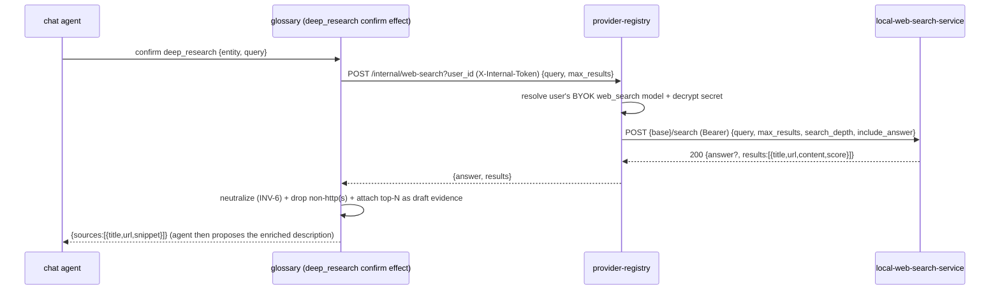

# Web-Search Service — Integration Guide & API Contract

**Status:** contract draft · 2026-06-21 · owners: LoreWeave (consumer, this repo) + external **`local-web-search-service`** repo (provider, to be built)
**Why:** the glossary deep-research feature (S5) lets the assistant research an entity on the **web** and attach the fetched **source URLs as evidence**. Neither LM Studio nor Ollama exposes web search, and per the **provider-gateway invariant** no domain service may call a search API directly. So web search lives in a **dedicated external service** (its own repo, like `local-rerank-service` / `local-stt-service` / `local-tts-service` / the ComfyUI `local-image-generator-service`) that LoreWeave reaches **only as a BYOK provider credential through `provider-registry`**.

This document is the **contract** both repos implement against. **The consumer side (this repo) is already built** — see §6; the provider side (external repo) implements **§3–§5**. A conforming service drops in with zero LoreWeave code changes.

---

## 1. Design principles

1. **Standard web-search API.** One request shape, **Tavily-compatible** (the de-facto AI-search standard, also spoken by clean-content search APIs). LoreWeave's adapter targets exactly this shape — see §3. Any backend (SearXNG, Tavily proxy, Brave, SerpAPI, …) is wrapped to speak it.
2. **Pluggable backend, stable wire.** The *backend* (a metasearch engine, a commercial API, a scraper) is the service's business; the **wire shape to LoreWeave is fixed**. Swap backends without touching this repo.
3. **Self-hosted, no lock-in, free-capable.** Standard HTTP + JSON, addressed by URL (+ optional bearer). Runs anywhere (homelab, VPS). A **keyless local** backend (SearXNG) is a first-class target — no account, no per-query cost.
4. **Untrusted output.** Returned `content`/`title` is **hostile external DATA** — LoreWeave neutralizes it (INV-6) before it ever reaches a prompt or lands as evidence. The service SHOULD still return clean text, but the consumer never trusts it.
5. **Graceful, never-blocking.** A search service that is down/slow degrades the assistant's research turn to "no results" with a clear message — it never 500s the chat.

---

## 2. Authentication

Bearer token (shared secret), matching LoreWeave's BYOK provider pattern:

```
Authorization: Bearer <secret>
```

- The secret is the **BYOK credential secret** stored in `provider-registry` (`provider_credentials.secret_ciphertext`, AES-GCM at rest) and injected per call.
- A **keyless local** backend (e.g. SearXNG on a private network) MAY accept no auth — register the credential with an empty secret and the service ignores `Authorization`.
- Unauthorized (when a secret IS configured) → `401`.
- **Compat note:** for a backend that *is* Tavily itself, LoreWeave's adapter also places the secret in the request body as `api_key` (Tavily's native field). A non-Tavily service MUST ignore an unknown `api_key` body field.

---

## 3. Web-search API (the contract to implement)

### `POST {endpoint_base_url}/search`

Run one web search; return ranked results (+ an optional synthesized answer).

**Request**
```json
{
  "query": "Nezha 哪吒 Investiture of the Gods deity",
  "max_results": 5,
  "search_depth": "basic",
  "include_answer": true,
  "api_key": "<ignored unless you ARE Tavily>"
}
```
| field | type | required | notes |
|---|---|---|---|
| `query` | string | yes | the search query (may be CJK or mixed-language) |
| `max_results` | int | no | desired result count; LoreWeave sends **1–20** (default 5). Clamp server-side. |
| `search_depth` | string | no | `"basic"` (default) or `"advanced"` (deeper crawl / fuller `content`). A backend without depth tiers ignores it. |
| `include_answer` | bool | no | if `true`, the service MAY also return a synthesized `answer`. Optional — omit/empty is fine. |
| `api_key` | string | no | **ignore** unless your backend is literally Tavily (compat field). |

**Response `200`**
```json
{
  "query": "Nezha 哪吒 ...",
  "answer": "Nezha is a protection deity in Chinese mythology...",
  "results": [
    { "title": "Nezha — Wikipedia", "url": "https://en.wikipedia.org/wiki/Nezha", "content": "Nezha is a protection deity ...", "score": 0.95 },
    { "title": "Investiture of the Gods", "url": "https://example.org/fsyy", "content": "Nezha appears in the novel ...", "score": 0.81 }
  ]
}
```
| field | type | required | notes |
|---|---|---|---|
| `results` | array | yes | ranked results, **best first** (LoreWeave takes the top `max_results`). |
| `results[].title` | string | yes | page title (may be empty). |
| `results[].url` | string | yes | **absolute http(s) URL.** LoreWeave drops any non-`http(s)` result (no `javascript:`/`data:`). |
| `results[].content` | string | yes | a clean text snippet/extract of the page (the evidence text). `advanced` depth ⇒ longer. |
| `results[].score` | number | no | relevance ∈ `[0,1]`; omit ⇒ LoreWeave keeps array order. |
| `answer` | string | no | optional synthesized answer; LoreWeave neutralizes + may show it. |
| `query` | string | no | echo (informational). |

- An **empty `results: []` with `200`** is valid ("nothing found") — not an error.
- The exact JSON keys above are what LoreWeave's adapter parses (`answer`, `results[].{title,url,content,score}`). Extra fields are ignored.

### Errors
| status | body | meaning (LoreWeave behavior) |
|---|---|---|
| 400 | `{"error":"validation"}` | empty query etc. |
| 401 | `{"error":"unauthorized"}` | bad/missing bearer (when a secret is set) → consumer surfaces a provider error |
| 429 | `{"error":"rate_limited","retry_after_s":N}` | backend quota — consumer returns a 502-class "provider error" |
| 5xx | `{"error":"upstream"}` | backend failed → consumer returns 502; the assistant degrades to "search unavailable" |

LoreWeave treats **any non-2xx as a provider error** (it does not retry inside the turn) and surfaces a clean message — never blocks the chat.

---

## 4. Optional: backend selection & metering

- **`provider_model_name`** — LoreWeave resolves a `user_models` row whose `provider_model_name` is passed *conceptually* as the "model". A search service has no LLM model, so treat it as an **optional backend/profile selector** (e.g. `"searxng-default"`, `"tavily-advanced"`). A single-backend service ignores it. (LoreWeave's current `/internal/web-search` resolves the user's preferred `web_search` model but does not forward the name in the body — so this is forward-compat only.)
- **Pricing** lives on the LoreWeave side (`user_models.pricing`, per-search), not in the service. A free local backend ⇒ price `0`. The service does not bill.
- **Rate-limit headers** (optional): return `429 {retry_after_s}` when a metered backend is exhausted.

### `GET /health` (liveness) · `GET /ready` (process up). Standard, unauthenticated.

---

## 5. Reference implementations (external repo)

Pick one backend; all speak §3 on the wire.

### 5a. SearXNG wrapper — **recommended for local + free** ⭐
- **What:** [SearXNG](https://github.com/searxng/searxng) is an OSS metasearch engine (aggregates Google/Bing/DuckDuckGo/Brave/…). One Docker container, **no API key, no account, no per-query cost**, JSON output.
- **Build:** a thin FastAPI (or any HTTP) shim that:
  1. accepts `POST /search` (§3),
  2. calls SearXNG `GET {SEARXNG_URL}/search?q=<query>&format=json&language=<…>` (+ engines/categories config),
  3. maps SearXNG's `results[]` (`title`, `url`, `content`) → the §3 response (set `score` from SearXNG's `score` if present; `answer` from SearXNG's `answers[]`/`infoboxes[]` if available, else omit),
  4. returns ≤ `max_results`.
- **Content depth:** SearXNG returns search-snippet `content`. For richer `content` on `advanced`, optionally fetch + extract the page (e.g. `trafilatura`/`readability`) for the top results — but snippet-only is fine for v1.
- **Footprint:** tiny — no GPU, no model load (unlike rerank/STT/TTS, this service has **no VRAM lifecycle**; §4 of the rerank doc does not apply).

### 5b. Tavily proxy
- Forward §3 → Tavily `POST https://api.tavily.com/search` (Tavily's shape is already §3-compatible). Inject the user's Tavily key. Useful when an operator prefers Tavily's clean-content extraction. (LoreWeave can also point *directly* at Tavily with no service — but a proxy lets you swap/meter/cache.)

### 5c. Brave / SerpAPI / Exa wrappers
- Same pattern — translate the vendor response into §3. Map the vendor's snippet → `content`, result link → `url`.

**Whatever the backend, keep the §3 wire shape.**

---

## 6. LoreWeave integration (consumer side — **already built in this repo**)

Web search is an AI provider call → it goes **through `provider-registry`** (the provider-gateway invariant; no search SDK in any domain service), as a **BYOK credential** (exactly like a local rerank/STT model — NOT a per-service `*_URL` env):

```
glossary deep_research (confirm effect)
  ─▶ providerregistry_client.webSearch(user_id, query, max)            [glossary-service]
     ─▶ provider-registry  POST /internal/web-search?user_id=…          [internal-token]
        ─▶ resolves the user's BYOK web_search user_model JOIN provider_credentials
        ─▶ provider.WebSearch(baseURL, secret, query, opts)             [the ONLY outward call]
           ─▶ POST {endpoint_base_url}/search   ──────────────────────▶ local-web-search-service
```

Already shipped (commits on `feat/glossary-assistant-coverage`):
- **`services/provider-registry-service/internal/provider/web_search.go`** — the adapter that speaks §3 (POST `/search`, parses `{answer, results[]}`). Receives a *resolved* `endpoint_base_url` + secret, like `Rerank`.
- **`internalWebSearch`** (`POST /internal/web-search?user_id=…`, internal-token gated) — resolves the user's preferred active `web_search` model (`capability_flags {"web_search": true}`, tenant-isolated), decrypts the secret, dispatches; `404` when the user has no web_search credential ("add one in Settings"); `502` on upstream error.
- **`glossary_deep_research`** MCP tool (class-C, cost-gated) — the confirm effect runs the search, **neutralizes** every result (INV-6: drop control chars, collapse whitespace, cap length), **drops non-http(s) URLs**, attaches the top sources as **draft `reference` evidence** (deduped by URL), and returns `{title,url,snippet}` so the agent proposes the enriched description.

So the external service only needs to satisfy **§3** — no LoreWeave code changes.

### 6.1 Registration recipe (once the service is running)

Register a BYOK `web_search` credential + model for the user (via Settings UI, the `settings_*` MCP tools, or directly):

1. **Provider credential** — `provider_kind = 'web_search'`, `endpoint_base_url = http://<service-host>:<port>` (e.g. `http://local-web-search-service:8090` on the compose network, or the LAN URL), `secret` = the bearer (empty for a keyless local SearXNG).
2. **User model** — `provider_credential_id` = the above, `provider_model_name` = a backend/profile label (e.g. `searxng-default`), `capability_flags = {"web_search": true}` (**strict** — must be explicit), `pricing = {"input_per_mtok":0,"output_per_mtok":0}` (free local) or a per-search nominal.
3. Mark `is_active = true` (+ `is_favorite` to make it the preferred web_search model — `/internal/web-search` picks `is_favorite DESC, created_at ASC LIMIT 1`).

### 6.2 Config (this repo)
- `glossary-service` needs `PROVIDER_REGISTRY_URL` set (service URL, like `BOOK_SERVICE_URL`) so `deep_research` can reach `/internal/web-search`. No web-search URL/key lives in any consuming service — it's all in the BYOK credential.

---

## 7. Sequence



---

## 8. Build checklist (external repo)

- [ ] `POST /search` per §3 (request fields tolerated, response keys exact: `answer`, `results[].{title,url,content,score}`).
- [ ] Bearer auth when a secret is configured; keyless allowed for a private local backend; ignore an unknown body `api_key`.
- [ ] `max_results` clamp (1–20); empty `results` on no-hit (200, not error); `429 {retry_after_s}` on backend quota; non-2xx `{error}` otherwise.
- [ ] `GET /health` + `GET /ready`.
- [ ] Return **absolute http(s) URLs** and **clean snippet `content`** (LoreWeave neutralizes regardless, but clean text = better evidence).
- [ ] Containerized; addressable by URL on the compose/LAN network. (SearXNG backend ⇒ ship SearXNG + the shim.)
- [ ] README declares the backend + whether `search_depth`/`answer` are supported.

**No VRAM/model-lifecycle layer is required** (unlike rerank/STT/TTS) — web search is stateless per request.
