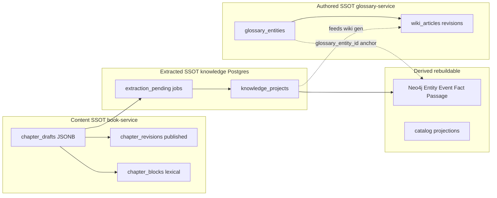

# LoreWeave — Data Architecture

> **Purpose:** Single entry point for the platform data layer — where data lives, who owns it, how it flows, and what is SSOT vs derived.
> **Audience:** Developers, architects, and AI agents onboarding to the monorepo.
> **Last updated:** 2026-07-17
>
> **Companion docs:** [`ARCHITECTURE.md`](ARCHITECTURE.md) (system/services overview) · [`FEATURE_INDEX.md`](FEATURE_INDEX.md) (frontend feature → route → backing service) · [`standards/README.md`](standards/README.md) (cross-cutting rules) · [`03_planning/101_DATA_RE_ENGINEERING_PLAN.md`](03_planning/101_DATA_RE_ENGINEERING_PLAN.md) (knowledge re-engineering deep-dive) · **Educational intro (no prior LoreWeave knowledge required):** [blog — AI-Driven Data Architecture](blog/README.md)

---

## 1. Purpose & how to read this doc

LoreWeave is a multi-agent platform for multilingual novel workflows. The data layer spans **22 Postgres databases** on the main cluster (plus a **separate meta/per-reality Patroni HA plane** for Living Worlds — §5), **Neo4j** (derived knowledge graph), **Valkey/Redis**, **RabbitMQ**, and **MinIO** — too large to infer from any single service.

This document follows the industry **4-layer model** (conceptual → logical → physical → flow) plus governance. It is a **map and compass**, not a column-level data dictionary.

| If you need… | Read… |
|--------------|-------|
| Where wiki articles live | §3 SSOT layers + §4 matrix (`glossary-service`) |
| How hybrid search works | §6 flow #3 + [`specs/2026-06-07-raw-search.md`](specs/2026-06-07-raw-search.md) |
| Full knowledge/memory design | [`03_planning/KNOWLEDGE_SERVICE_ARCHITECTURE.md`](03_planning/KNOWLEDGE_SERVICE_ARCHITECTURE.md) |
| Column-level schema | Service migrate files (§4 "Migration source" column) |
| Living Worlds / MMO RPG data plane | §5 + [`03_planning/LLM_MMO_RPG/06_data_plane/_index.md`](03_planning/LLM_MMO_RPG/06_data_plane/_index.md) |

**Inventory source of truth:** migrate files in each service + [`infra/postgres-init/01-databases.sql`](../infra/postgres-init/01-databases.sql) + [`infra/db-ensure.sh`](../infra/db-ensure.sh) + [`infra/docker-compose.yml`](../infra/docker-compose.yml).

---

## 2. Storage topology

### Container diagram (C4 level)

```mermaid
flowchart TB
  subgraph clients [Clients]
    FE[React SPA]
  end
  subgraph gateway [Gateway]
    BFF[api-gateway-bff]
    AIGW[ai-gateway MCP federation]
    PubMCP[mcp-public-gateway]
    KAL[knowledge-gateway KAL]
  end
  subgraph domainGo [Go domain services]
    Auth[auth-service]
    Book[book-service]
    Glossary[glossary-service]
    Share[sharing-service]
    Catalog[catalog-service]
    Provider[provider-registry THE LLM gateway]
    Billing[usage-billing]
    Stats[statistics-service]
    Notify[notification-service]
    AgentReg[agent-registry-service]
    Sched[scheduler-service]
  end
  subgraph domainPy [Python AI services]
    Knowledge[knowledge-service]
    Chat[chat-service]
    Translation[translation-service]
    Composition[composition-service]
    Enrich[lore-enrichment-service]
    Learning[learning-service]
    Campaign[campaign-service]
    Jobs[jobs-service]
    VideoGen[video-gen-service]
  end
  subgraph workers [Workers]
    WInfra[worker-infra outbox relay]
    WAI[worker-ai]
    TWorker[translation-worker]
  end
  subgraph stores [Data stores]
    PG[(Postgres 18 with 22 per-service DBs)]
    Neo4j[(Neo4j derived KG plus vectors)]
    Redis[(Valkey cache and streams)]
    RMQ[RabbitMQ job queue]
    MinIO[(MinIO object storage)]
  end
  FE --> BFF
  BFF --> domainGo
  BFF --> domainPy
  BFF --> AIGW
  BFF --> KAL
  PubMCP --> AIGW
  Chat --> AIGW
  AIGW --> Knowledge
  KAL --> Glossary
  KAL --> Knowledge
  domainPy --> Provider
  domainGo --> PG
  domainPy --> PG
  Knowledge --> Neo4j
  Knowledge --> PG
  Book --> MinIO
  Chat --> MinIO
  Enrich --> MinIO
  VideoGen --> MinIO
  Provider --> MinIO
  Translation --> MinIO
  WInfra --> PG
  WInfra --> Redis
  WInfra --> Notify
  WAI --> PG
  Translation --> RMQ
  TWorker --> RMQ
  Redis --> Jobs
  domainGo --> Redis
  domainPy --> Redis
```



**`provider-registry-service` is the only node with provider SDKs/keys.** Every LLM/embedding/rerank/image/audio/STT call from any Python AI service routes through it — including local backends (LM Studio, Ollama, `local-rerank-service`), which integrate as BYOK credentials, never as per-service URL config.

The **meta / per-reality plane** (Living Worlds) is a separate Patroni cluster and is not shown above — see §5.

### Store catalog

| Store | Role | Durability | Primary consumers |
|-------|------|------------|-------------------|
| **PostgreSQL 18** | Per-service SSOT (app + transactional data) | Durable (RDS in prod) | All domain services |
| **Neo4j** | Derived knowledge graph + vector passages | Durable; rebuildable from Postgres + extraction | knowledge-service |
| **Valkey 8** (Redis-compatible) | Cache, rate limits, sessions, **event stream fan-out** | Ephemeral / cache; streams are relay buffer | gateway, workers, AI services |
| **RabbitMQ** | Heavy async jobs (batch translation) | Durable queues | translation-worker |
| **MinIO** | S3-compatible blobs (covers, media, chat attachments, imports) | Durable (S3 in prod) | book-service, chat-service, lore-enrichment |

### Dev vs production

| Aspect | Local (Docker Compose) | Production (AWS target) |
|--------|------------------------|-------------------------|
| Postgres | Single server (`:5555`), 22 `loreweave_*` database names | Per-service RDS instances or schemas per team policy |
| Neo4j | Single container (`:7688` Bolt) — `NEO4J_URI` optional for Track-1-only | Dedicated graph instance |
| Valkey / Redis | Single container (`:6399`) | ElastiCache |
| MinIO | Local container (`:9123` API, `:9124` console) | S3 |
| Meta / per-reality plane | Separate Patroni HA stack (§5), not started by default | Dedicated HA cluster |
| Multi-tenant isolation | `user_id` on every query; no cross-DB FK | Same |

---

## 3. SSOT & derivative layers (conceptual model)

Understanding **which layer is authoritative** prevents silent data loss and duplicate writes.



### Layer definitions

| Layer | Owner | Examples | Notes |
|-------|-------|----------|-------|
| **Identity & billing** | auth, provider-registry, usage-billing | users, sessions, credentials, usage_logs | Reference/master data for the platform |
| **Content (raw)** | book-service | `chapter_drafts`, `chapter_revisions`, `chapter_blocks` | Tiptap JSONB + extracted plain text for search |
| **Authored lore** | glossary-service | `glossary_entities`, `wiki_*`, evidences | User-curated SSOT; wiki is a **deferred-sync materialized view** over knowledge (see wiki spec v3) |
| **Extracted knowledge** | knowledge-service Postgres | `knowledge_projects`, `extraction_*`, summaries | SSOT for extraction state and orchestration |
| **Graph & vectors** | Neo4j (via knowledge-service) | `:Entity`, `:Event`, `:Fact`, `:Passage`, `:RELATES_TO` | **Derived** — rebuild from extraction pipeline |
| **Projections** | catalog, statistics | `catalog_runtime_state`, rollups | Read models; fed by events or HTTP aggregation |
| **Ephemeral** | Redis | job status, stream relay, rate limits | Not user SSOT |

### Two-layer glossary ↔ knowledge pattern

- **glossary-service** = authored SSOT (`glossary_entities`, manual CRUD, wiki).
- **knowledge-service** = fuzzy/semantic entity layer anchored via `glossary_entity_id` on Neo4j `:Entity` nodes.
- Extraction **writes canonical entities through glossary** via `/internal/books/{book_id}/extract-entities`; never writes Neo4j canonical content without the glossary SSOT path for promoted lore.
- Enriched/quarantined facts live in knowledge until author promote → glossary writeback.

---

## 4. Service × database ownership matrix

Each microservice owns **one Postgres database** (database-per-service). No cross-service foreign keys or direct table access.

### Postgres databases (22)

Created by [`infra/postgres-init/01-databases.sql`](../infra/postgres-init/01-databases.sql) (first volume creation only) **and** [`infra/db-ensure.sh`](../infra/db-ensure.sh) (every start, via the postgres healthcheck). **Both lists must agree** — a DB present only in the SQL init is never created on an existing volume.

| Database | Owner service(s) | Table groups (high level) | Migration source |
|----------|------------------|---------------------------|-------------------|
| `loreweave_auth` | auth-service | users, sessions, verification_tickets, reset_tickets, security_preferences, user_preferences, user_follows | `services/auth-service/internal/migrate/migrate.go` |
| `loreweave_book` | book-service | books, chapters, chapter_drafts, chapter_revisions, chapter_blocks, parts, scenes, outbox_events, cover/media, import_jobs, reading_progress, favorites, canon_model_migration | `services/book-service/internal/migrate/migrate.go` |
| `loreweave_sharing` | sharing-service | sharing_policies | `services/sharing-service/internal/migrate/migrate.go` |
| `loreweave_scheduler` | scheduler-service | scheduled_agent_runs | `services/scheduler-service/internal/migrate/migrate.go` |
| `loreweave_catalog` | catalog-service | catalog_runtime_state | `services/catalog-service/internal/migrate/migrate.go` |
| `loreweave_provider_registry` | provider-registry-service | provider_credentials, provider_inventory_models, user_models, user_model_tags, platform_models, llm_jobs | `services/provider-registry-service/internal/migrate/migrate.go` |
| `loreweave_usage_billing` | usage-billing-service | account_balances, usage_logs, usage_log_details, token_reservations, spend_guardrails, platform_balances, reconciliation_reports | `services/usage-billing-service/internal/migrate/migrate.go` |
| `loreweave_translation` | translation-service, translation-worker | user_translation_preferences, book_translation_settings, translation_jobs, chapter_translations, chapter_translation_chunks, active_chapter_translation_versions, extraction_jobs, outbox_events, quality_issues | `services/translation-service/app/migrate.py` |
| `loreweave_glossary` | glossary-service | entity_kinds, attribute_definitions, glossary_entities, chapter_entity_links, entity_attribute_values, evidences, wiki_articles, wiki_revisions, wiki_suggestions, merge_journal, merge_candidates, entity_enrichments, outbox_events | `services/glossary-service/internal/migrate/migrate.go` |
| `loreweave_chat` | chat-service | chat_sessions, chat_messages, chat_outputs, message_audio_segments, message_feedback, chat_suspended_runs, outbox_events | `services/chat-service/app/db/migrate.py` |
| `loreweave_knowledge` | knowledge-service, worker-ai | knowledge_projects, knowledge_summaries, extraction_pending, extraction_jobs, entity_alias_map, knowledge_pending_facts, summary_*, outbox_events, dead_letter_events, eval/benchmark tables | `services/knowledge-service/app/db/migrate.py` |
| `loreweave_composition` | composition-service, composition-worker | composition_work, structure_template, outline_node, scene_link, canon_rule, generation_job, outbox_events | `services/composition-service/app/db/migrate.py` |
| `loreweave_campaign` | campaign-service | campaign saga state, per-chapter projection | `services/campaign-service/app/migrate.py` |
| `loreweave_lore_enrichment` | lore-enrichment-service, lore-enrichment-worker | source_corpus, enrichment_job, enrichment_proposal, enrichment_template, enrichment_book_profile, enrichment_upload | `services/lore-enrichment-service/app/db/migrate.py` |
| `loreweave_learning` | learning-service | corrections, eval_runs, eval_results, quality_scores, extraction_runs, config_registry, online_eval_rule | `services/learning-service/app/db/migrate.py` |
| `loreweave_statistics` | statistics-service | book_stats, view_events, reading_events, author_stats, rank_snapshots, daily_book_rollups, translation_events, voice_turn_events | `services/statistics-service/internal/migrate/migrate.go` |
| `loreweave_notification` | notification-service | notifications | `services/notification-service/internal/migrate/migrate.go` |
| `loreweave_video_gen` | video-gen-service, video-gen-worker | video generation jobs/assets | `services/video-gen-service/app/db/migrate.py` |
| `loreweave_jobs` | jobs-service | job_projection | `services/jobs-service/app/migrate.py` |
| `loreweave_roleplay` | roleplay-service (Rust) | scripts, actor memory, start-orchestration | `services/roleplay-service/migrations/0001_init.sql` (`sqlx::migrate!` at startup) |
| `loreweave_agent_registry` | agent-registry-service | plugin/skill/MCP-server registrations, AES-GCM secret vault | `services/agent-registry-service/internal/migrate/migrate.go` |
| `loreweave_events` | worker-infra | event_log, event_consumers, dead_letter_events | `services/worker-infra/internal/migrate/migrate.go` |

### Cross-DB readers (own no DB, or read another's)

Permitted only where listed; **prefer HTTP for new code** (see §5).

| Service | Reads | Via |
|---|---|---|
| worker-ai | `loreweave_knowledge` | `KNOWLEDGE_DB_URL` — owns no DB of its own |
| knowledge-service | `loreweave_glossary` | `GLOSSARY_DB_URL` — a second pool alongside its own DB (legacy; avoid for new code) |
| worker-infra | `loreweave_book` | `BOOK_DB_URL` for the import-processor, plus 11 outbox source pools |

### Services without a Postgres database

| Service | State | Notes |
|---------|-------|-------|
| api-gateway-bff | Stateless | Routes/proxies only |
| ai-gateway | Stateless | MCP federation; no persistence |
| mcp-public-gateway | Stateless | Public MCP edge; relays to ai-gateway |
| knowledge-gateway | Stateless | KAL typed read/write boundary; federates glossary + knowledge |
| game-server | In-memory | Colyseus room state |
| worker-ai | Stateless worker | Reads/writes `loreweave_knowledge` only |

> **Not in either init file:** `breach-notifier` hard-requires `BREACH_NOTIFIER_DB_URL` and ships its own migration (`services/breach-notifier/internal/migrate/0001_breach_dpo_delivery.up.sql`), but its database is absent from `01-databases.sql` and `db-ensure.sh`, and the service has no compose entry. It is not bootable from the local stack as-is.

### Neo4j (knowledge-service derived store)

Schema: `services/knowledge-service/app/db/neo4j_schema.cypher`

**Node labels (8):**

| Label | Purpose |
|--------------|---------|
| `:Entity` | Characters, places, items — anchored to glossary via `glossary_entity_id` |
| `:Event` | Narrative happenings |
| `:Fact` | Typed propositions (decision, preference, milestone, negation) |
| `:Passage` | Chunk text + embeddings for semantic search / RAG |
| `:EntityStatus` | Per-entity status/state records |
| `:Project`, `:Session` | Scoping for the multi-tenant graph |
| `:ExtractionSource` | Provenance for evidence edges |

**Relationship types (3):** `:RELATES_TO` (canonical directed entity relation — the only edge with declared indexes: `schema_version`, `graph_id`, `(valid_from_ordinal, valid_to_ordinal_eff)`) · `:EVIDENCED_BY` (source → target evidence) · `:ABOUT` (`(:Fact)-[:ABOUT]->(:Entity)`).

**Constraints (9):** an `*_id_unique` per label, plus composite `entity_glossary_fk_unique` on `(user_id, project_id, glossary_entity_id)`.

**Indexes:** 9 vector indexes (Entity @ 384/1024/1536/3072 · Event @ 1024 · Passage @ 384/1024/1536/3072, all cosine) + 1 fulltext (`passage_text_cjk_ft` on `Passage.text`, `cjk` analyzer).

> ⚠️ `user_id NOT NULL` is **not** enforced in Neo4j (Enterprise-only). Tenancy is enforced in application code via `assert_user_id_param` — a query path that skips it has no database-level backstop.

### MinIO buckets (by service)

| Service | Bucket | Source |
|---------|--------|--------|
| book-service | `loreweave-dev-books` | `BOOKS_STORAGE_BUCKET` — covers, imports |
| book-service | `loreweave-media` | const `mediaBucket` (`internal/api/media.go`) |
| video-gen-service | `loreweave-media` | `MINIO_BUCKET` — **shares** book-service's media bucket |
| worker-infra | `loreweave-dev-books` | `MINIO_BUCKET` — import processing |
| provider-registry-service | `loreweave-audio-cache` | `AUDIO_CACHE_BUCKET` |
| translation-service | `lw-extraction-raw` | `MINIO_BUCKET` ← `TRANSLATION_RAW_BUCKET` |
| chat-service | `lw-chat` | attachments, audio |
| lore-enrichment-service (+ worker) | `lore-enrichment-uploads` | `MINIO_BUCKET` |
| archive-worker / admin-cli | `lw-event-archive` | Parquet+ZSTD event archive (writer / reader) |
| meta-ha Patroni | `lw-meta-wal-archive` | `WAL_ARCHIVE_BUCKET` — separate cluster (§5) |

**8 distinct app buckets** + the event archive + the meta WAL archive.

> Names that look bucket-shaped but are **not** buckets: `loreweave-auth` (JWT issuer), `loreweave-mcp-oauth` (OAuth issuer), `loreweave-kek-ref` (KEK reference), `loreweave_llm` (a Rust/Python crate name).

---

## 5. Cross-service integration rules

### Data principles (enforced)

1. **Database-per-service** — each service owns its Postgres DB and migrations.
2. **No cross-DB FK** — integration via HTTP internal APIs or async events, never shared tables.
3. **Gateway invariant** — all external traffic through `api-gateway-bff`.
4. **Provider gateway** — all LLM/embedding/rerank calls through `provider-registry-service`.
5. **MCP-first for agent logic** — AI agent capabilities invoke MCP tools via `ai-gateway`, not bespoke prompt+HTTP endpoints.
6. **Server is SSOT** — user data in Postgres/MinIO; no localStorage for user data (UI prefs excepted).

### Integration patterns

| Pattern | When | Example |
|---------|------|---------|
| **Sync HTTP (internal)** | Request/response, ownership checks | book-service `verifyBookOwner`; knowledge → book lexical search |
| **Transactional outbox** | Reliable domain events | `outbox_events` in book, glossary, translation, chat, knowledge, composition |
| **Outbox relay → Redis Streams** | Fan-out to consumers | `worker-infra` `OUTBOX_SOURCES` → `loreweave:events:{aggregate}` |
| **RabbitMQ** | Long-running batch jobs | translation-worker consumes translation jobs |
| **Read-only cross-DB** | Legacy/orchestration only | knowledge-service `GLOSSARY_DB_URL` (read); avoid for new code — prefer HTTP |

### Outbox sources (current — 11)

Configured as `OUTBOX_SOURCES` on `worker-infra` ([`infra/docker-compose.yml`](../infra/docker-compose.yml), parsed by `services/worker-infra/internal/config/config.go`). Each entry maps `name:postgres://…/loreweave_<name>`:

`book` · `translation` · `chat` · `glossary` · `knowledge` · `composition` · `campaign` · `lore_enrichment` · `video_gen` · `learning` · `auth`

- Relay tasks: `WORKER_TASKS: "outbox-relay,outbox-cleanup,import-processor"`
- Retention: `OUTBOX_CLEANUP_RETAIN_DAYS: "30"` — bumped 7→30 so a learning-service outage can be backfilled by replay (D#049)
- Notification-typed outbox rows are delivered to `NOTIFICATION_SERVICE_URL` rather than a stream
- Central event log: `loreweave_events.event_log`

**An outbox emit must raise → roll back the transaction** — swallowing the error strands the event. The sweeper redelivers.

### Living Worlds — the second data plane (separate track, separate cluster)

Everything above lives on the **main `postgres` container**. The **LLM MMO RPG / Living Worlds** track adds an entirely separate plane that neither `01-databases.sql` nor `db-ensure.sh` covers:

| Aspect | Main plane | Meta / reality plane |
|---|---|---|
| Topology | one DB per microservice | one **meta** DB + **DB-per-reality** (thousands) |
| Cluster | `postgres` container (`:5555`) | **Patroni HA** — [`infra/docker-compose.meta-ha.yml`](../infra/docker-compose.meta-ha.yml), project scope `lw-meta-pg`, network `lw-meta-ha`, `127.0.0.1:15432` (Postgres) / `:18008` (Patroni REST), etcd-backed, own MinIO for `lw-meta-wal-archive` |
| Connected via | per-service `DATABASE_URL` | `META_DB_URL` + per-reality `REALITY_DB` |
| Consumers | the novel platform | world-service (Rust), meta-worker, meta-outbox-relay, publisher, archive-worker, retention-worker, integrity-checker |

Rules:

- **No cross-instance live queries** — see [`02_governance/CROSS_INSTANCE_DATA_ACCESS_POLICY.md`](02_governance/CROSS_INSTANCE_DATA_ACCESS_POLICY.md)
- Approved alternatives: meta-level lookup, event-driven propagation, import/export between named realities
- **`meta-worker` is the only consumer of `xreality.*` Redis Streams** (invariant I7)
- Full data-plane design: [`03_planning/LLM_MMO_RPG/06_data_plane/_index.md`](03_planning/LLM_MMO_RPG/06_data_plane/_index.md)

None of these services are in the default `docker-compose.yml` — `docker compose up` gives you the novel platform only.

---

## 6. Major data flows

### Flow 1 — Chapter save → extraction → knowledge graph

1. Author saves chapter in frontend → gateway → **book-service** writes `chapter_drafts` (Tiptap JSONB).
2. Trigger/SQL extracts plain text → **chapter_blocks** (lexical search index).
3. Row inserted into **book `outbox_events`** (e.g. chapter saved / published).
4. **worker-infra** relays outbox → Redis Stream.
5. **knowledge-service** / **worker-ai** consumes → `extraction_pending` → LLM extraction.
6. Results written to **Neo4j** (`:Entity`, `:Event`, `:Fact`, `:Passage`) + **knowledge Postgres** state.
7. Canonical entity promotion → **glossary-service** via internal extract-entities API (SSOT write path).

Deep-dive: [`03_planning/101_DATA_RE_ENGINEERING_PLAN.md`](03_planning/101_DATA_RE_ENGINEERING_PLAN.md) · [`03_planning/data_pipelines/GLOSSARY_EXTRACTION_PIPELINE.md`](03_planning/data_pipelines/GLOSSARY_EXTRACTION_PIPELINE.md)

### Flow 2 — Translation job

1. User starts translation → **translation-service** creates `translation_jobs` snapshot (settings frozen at job creation).
2. Job enqueued to **RabbitMQ** → **translation-worker** consumes.
3. Worker reads chapter text from **book-service** (HTTP, not direct DB).
4. LLM calls via **provider-registry**; glossary terms injected from **glossary-service**.
5. Results written to `chapter_translations` / chunks in **loreweave_translation**.
6. Optional: knowledge layer (V3) pulls relations from knowledge-service for pronoun/honorific context.

Deep-dive: [`03_planning/data_pipelines/TRANSLATION_PIPELINE_V2.md`](03_planning/data_pipelines/TRANSLATION_PIPELINE_V2.md)

### Flow 3 — Raw / hybrid search

1. Frontend → gateway → **knowledge-service** `GET /v1/knowledge/books/{id}/search`.
2. **Lexical leg:** knowledge → book-service internal `/lexical-search` over `chapter_blocks` (draft) or published revision JSONB (canon).
3. **Semantic leg:** embed query via provider-registry → vector search on Neo4j `:Passage` nodes.
4. **RRF fusion** + optional cross-encoder rerank (provider-registry → rerank service).
5. Results returned with rune-correct highlights and jump-to-source (`blockIndex`).

Deep-dive: [`specs/2026-06-07-raw-search.md`](specs/2026-06-07-raw-search.md)

### Flow 4 — Chat with RAG context

1. User message → **chat-service** persists to `chat_messages`.
2. Tool definitions + execution via **ai-gateway** (MCP) → federates **knowledge-service** tools.
3. Grounding/context assembly: knowledge-service L0–L3 stack (glossary anchor + Neo4j passages + summaries).
4. LLM stream via provider-registry; session history in **loreweave_chat** (not unbounded replay — memory feeds knowledge pipeline).

Deep-dive: [`03_planning/KNOWLEDGE_SERVICE_ARCHITECTURE.md`](03_planning/KNOWLEDGE_SERVICE_ARCHITECTURE.md) · [`specs/2026-06-10-glossary-assistant-architecture.md`](specs/2026-06-10-glossary-assistant-architecture.md)

### Flow 5 — Wiki generation

1. **knowledge-service** holds extracted facts and generation inputs.
2. Wiki generate → constrained Markdown → IR → TipTap → write **glossary-service** `wiki_articles` / `wiki_revisions`.
3. Staleness tracked in DB ledger + sweep (not realtime CDC); user-gated regen.
4. Wiki = materialized view over knowledge; glossary remains SSOT for published wiki content.

Deep-dive: [`specs/2026-06-08-wiki-llm-building.md`](specs/2026-06-08-wiki-llm-building.md)

### Flow 6 — Lore enrichment & composition

1. **lore-enrichment-service** detects gaps → retrieval-grounded proposals → quarantined until author promote.
2. Promote writes through **glossary SSOT** only; knowledge graph syncs via existing pipeline.
3. **composition-service** (LOOM co-writer) reads canon context via knowledge/glossary HTTP; persists outlines/jobs in **loreweave_composition**.

Deep-dive: [`03_planning/lore-enrichment/`](03_planning/lore-enrichment/) · [`03_planning/LOOM/`](03_planning/LOOM/)

### Flow 7 — Eval & learning flywheel

1. User corrections / message feedback captured in **learning-service** (`corrections`, `quality_scores`).
2. knowledge outbox events (`*_corrected`) relayed to learning consumers.
3. Eval runs and gold labels drive retrieval tuning (e.g. raw-search eval harness).

Deep-dive: [`03_planning/102_DATA_RE_ENGINEERING_DETAILED_TASKS.md`](03_planning/102_DATA_RE_ENGINEERING_DETAILED_TASKS.md) · learning-service plans in SESSION_HANDOFF

---

## 7. Deep-dive index

| Topic | Document |
|-------|----------|
| Knowledge re-engineering (Postgres + Neo4j stack) | [`03_planning/101_DATA_RE_ENGINEERING_PLAN.md`](03_planning/101_DATA_RE_ENGINEERING_PLAN.md) |
| Knowledge service tasks & phases | [`03_planning/102_DATA_RE_ENGINEERING_DETAILED_TASKS.md`](03_planning/102_DATA_RE_ENGINEERING_DETAILED_TASKS.md) |
| Memory, L0–L3 context, chat integration | [`03_planning/KNOWLEDGE_SERVICE_ARCHITECTURE.md`](03_planning/KNOWLEDGE_SERVICE_ARCHITECTURE.md) |
| Data pipelines (translation, glossary extraction) | [`03_planning/data_pipelines/README.md`](03_planning/data_pipelines/README.md) |
| Wiki LLM building | [`specs/2026-06-08-wiki-llm-building.md`](specs/2026-06-08-wiki-llm-building.md) |
| Raw / hybrid search | [`specs/2026-06-07-raw-search.md`](specs/2026-06-07-raw-search.md) |
| Glossary assistant + ai-gateway MCP | [`specs/2026-06-10-glossary-assistant-architecture.md`](specs/2026-06-10-glossary-assistant-architecture.md) |
| Module DB ownership (legacy per-module) | `03_planning/30_MODULE02_*`, `50_MODULE03_*`, `62_MODULE04_*` amendments |
| Cross-instance policy (Living Worlds) | [`02_governance/CROSS_INSTANCE_DATA_ACCESS_POLICY.md`](02_governance/CROSS_INSTANCE_DATA_ACCESS_POLICY.md) |
| Living Worlds data plane | [`03_planning/LLM_MMO_RPG/06_data_plane/_index.md`](03_planning/LLM_MMO_RPG/06_data_plane/_index.md) |
| Living Worlds storage | [`03_planning/LLM_MMO_RPG/02_storage/00_overview_and_schema.md`](03_planning/LLM_MMO_RPG/02_storage/00_overview_and_schema.md) |
| OpenAPI contracts | [`contracts/api/`](../contracts/api/) |

---

## 8. Maintenance & drift prevention

### When to update this doc

- New service or Postgres database added
- SSOT boundary moves (e.g. BookProfile relocation)
- New outbox source or major pipeline added
- Neo4j schema label changes

### Update checklist

1. Add `CREATE DATABASE` to [`infra/postgres-init/01-databases.sql`](../infra/postgres-init/01-databases.sql) and [`infra/db-ensure.sh`](../infra/db-ensure.sh).
2. Add row to §4 matrix (service, DB, table groups, migrate path).
3. If new end-to-end flow, add §6 bullet flow or link to spec.
4. Note in [`docs/sessions/SESSION_HANDOFF.md`](sessions/SESSION_HANDOFF.md) NEXT block.

### Drift check (run these — don't trust the tables above)

```bash
# The two DB lists MUST agree. 01-databases.sql runs only on a fresh volume;
# db-ensure.sh runs on every start. A DB in one but not the other is a latent bug.
diff <(grep -oE 'loreweave_[a-z_]+' infra/postgres-init/01-databases.sql | sort -u) \
     <(grep -oE 'loreweave_[a-z_]+' infra/db-ensure.sh | sort -u)

grep -oE 'OUTBOX_SOURCES: "[^"]*"' infra/docker-compose.yml   # real relay set
ls services/ | wc -l                                           # service count
```

This exact check would have caught `loreweave_scheduler` — added to the SQL init but not to `db-ensure.sh` (fixed 2026-07-17), which meant any pre-existing volume silently never created it while `scheduler-service` depended on it.

### Optional automation (future)

Script `scripts/inventory-databases.py` could parse `DATABASE_URL` / `*_DB_URL` from compose and grep `CREATE TABLE` from migrate files to generate an appendix — reduces drift like the stale table formerly in `E2E_REVIEW_BRIEF.md` §3, and the 16→22 drift this doc carried until 2026-07-17.

### Known gaps vs target architecture

| Gap | Status | Track |
|-----|--------|-------|
| Full JSON_TABLE block extraction in Postgres trigger | Partial / incremental | 101 plan |
| Qdrant split from Neo4j vectors | Not selected (Neo4j v2026 native vectors) | 101 decision |
| BookProfile in book-service | Planned (wiki-LLM prerequisite) | wiki spec v3 |
| Glossary LLM flows → MCP migration | In progress | DEFERRED 066 |
| `breach-notifier` DB in neither init file; no compose entry | Not bootable locally | SRE tier |
| Meta/reality plane not covered by the main init files | By design (separate Patroni cluster) | Living Worlds |
| `knowledge-service` reads `loreweave_glossary` directly (`GLOSSARY_DB_URL`) | Legacy cross-DB read | prefer HTTP for new code |
| Neo4j `user_id NOT NULL` unenforceable (Community edition) | App-level only (`assert_user_id_param`) | tenancy |

---

*This document is the Data Architecture domain entry point (TOGAF Phase C / DAMA-DMBOK lightweight). For application and technology architecture, see [`ARCHITECTURE.md`](ARCHITECTURE.md).*
