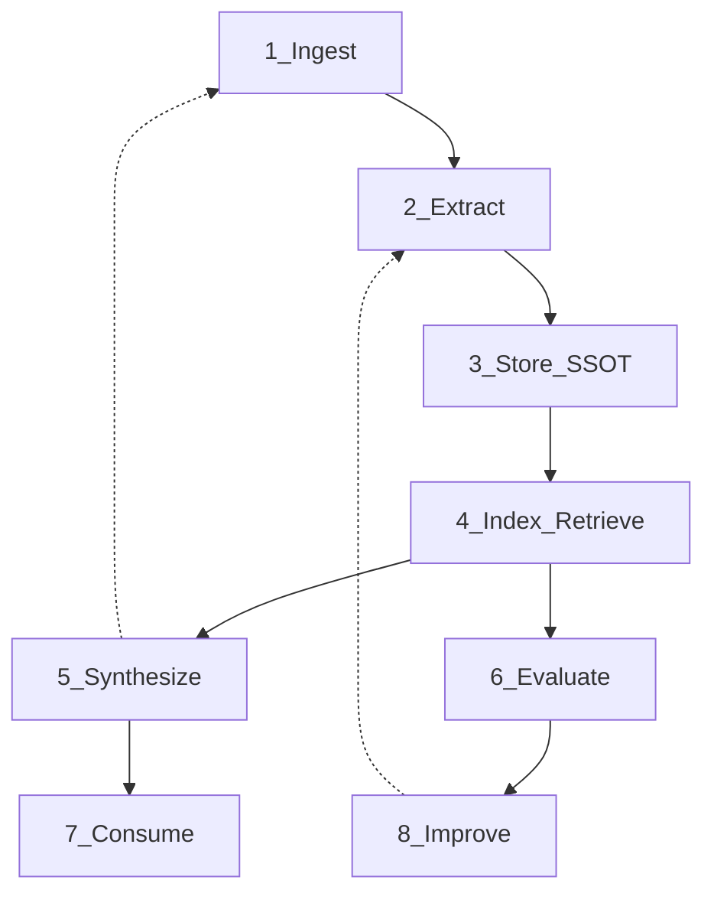

# AI-Driven Data Architecture, Part 1: Why Prompts Are Not Enough

*What AI-driven data architecture means to me, and how I learned it the hard way*

**Next:** [Part 2 — The Blueprint](2026-06-10-ai-driven-data-architecture-part-2-the-blueprint.md)

---

## What you'll take away

If you've moved past the chat-demo stage, you may have hit the same wall I did: the model forgets what it said three sessions ago, retrieved context feels random, translated terms drift, and nobody can answer *"where did this fact come from?"* without reading git history and hoping.

This two-part series is for builders wrestling with that same wall. It isn't a standard or a prompt cookbook — it's **the model I arrived at from one build**, written down so you can borrow it, adapt it, or tell me where it breaks.

By the end of Part 1 you will have:

- A working definition of **AI-driven data architecture** as I use the term (and how it differs from "LLM + database")
- An **eight-layer lens** you can try mapping onto your own product domain
- An honest account of **why my "two weeks to ship" estimate was a trap** — from a real project, not theory

Part 2 turns the lens into **patterns**: layered SSOT, the generate→extract→retrieve flywheel, retrieval as engineering, and a maturity rubric for locating yourself when you're "half done" (spoiler: that's normal).

I've only validated these patterns in one domain (fiction). The same *shape* looks familiar wherever AI has to stay grounded in evolving source material — **support tickets** (raw threads → extracted intents → approved macros → agent replies), **legal review** (contracts → extracted obligations → human-approved clause library → drafting assist), **internal wikis** (docs → extracted entities → curated glossary → search-backed chat) — but outside fiction those remain hypotheses, not shipped results. Creative writing is just where the continuity problems hurt most visibly.

I'll occasionally reference a multilingual novel-workflow platform I've been building (LoreWeave) where a pattern showed up in production. The blog stands alone without it.

---

## The illusion: prompt + context = product?

The most seductive plan in AI product development — the one I believed — looks like this:

1. Collect user content (documents, tickets, chapters, contracts).
2. Stuff the relevant slice into a prompt.
3. Call the model.
4. Ship.

I wrote that plan on a napkin. Estimated timeline: **two weeks**. The product would help authors write and translate fiction with LLM assistance — chat, maybe batch translation, done.

Demos reinforced the fantasy. A single book, lore pasted into the system prompt, a friendly UI — it *worked*. Stakeholders clapped. I clapped. Then I tried to live in the system.

Continuity broke first. A character's honorific changed in chapter twelve because the model had no durable memory of chapter three. Translation wasn't string replacement: the same proper noun had three acceptable renderings across languages, and the model picked whichever sounded fluent that hour. When I asked *"did the author write this, or did extraction infer it?"* my own codebase shrugged. Context windows didn't save me — replaying fifty messages every turn doesn't scale in cost, latency, or coherence.

None of these failures were prompt-engineering problems in the narrow sense. They were **data architecture problems wearing prompt-engineering costumes** — at least, that's the framing that finally unblocked me.

That distinction is the subject of this series.

---

## What I mean by "AI-driven data architecture"

I use **AI-driven data architecture** to mean the set of structures and pipelines that turn raw inputs into **grounded, traceable, reusable knowledge** that AI features consume — with explicit ownership, measurement, and improvement loops.

In my usage it is not:

- A vector database relabeled "RAG"
- A single Postgres schema with an `embeddings` column
- A folder of JSON files the prompt loader reads

It **is** a commitment that the system's job is to **prepare, own, and serve context** — and that the LLM is one consumer among many (chat, batch jobs, agents, translation pipelines), not the center of gravity. That commitment is the one I kept failing to make early on.

### Two mindsets — mine, before and after

This is my own before/after, not a scorecard for anyone else's work:

| Where I started | Where the hard parts pushed me |
|-------------------|-------------------------------------|
| Prompt engineering is the core skill | Data contracts and SSOT boundaries are the core skill |
| One database | Layered stores: raw, authored, extracted, derived |
| RAG = embed + search | Retrieval is engineered, benchmarked, degrades gracefully |
| Ship features | Ship **vertical slices** through the full stack |
| Model upgrade fixes quality | Flywheel: generate → measure → correct → re-ingest |

The shift was subtle and, for me, slow: I stopped asking *"what should the prompt say?"* and started asking *"who owns this fact, how did it get here, and how do we know retrieval worked?"*

### An eight-layer lens

Think of these as the **questions an AI-native architecture has to answer** sooner or later — not org-chart boxes. They're the ones I wish I'd asked on day one.

| Layer | Question it answers | If you skip it… |
|-------|---------------------|-----------------|
| **Ingest** | Where does raw truth live? | No ground truth; everything is prompt fiction |
| **Extract** | What structured facts exist in the source? | Lore lives only in prompts; re-extraction is manual |
| **Store (SSOT)** | Who owns each class of fact? | Silent corruption; merges delete the wrong rows |
| **Index / retrieve** | How do you find the *right* passage? | "We have RAG" but answers feel unrelated |
| **Synthesize** | Translation, summaries, co-writing, reports | One-off generations that never feed back |
| **Evaluate** | How do you know retrieval and generation work? | "Live smoke passed" becomes your only metric |
| **Consume** | Chat, agents, pipelines calling the model | Token-wasteful mega-prompts |
| **Improve** | Feedback → better configs, data, models | Static slop forever |

**The insight that cost me the most:** this is not one database. It behaves more like a **pipeline culture**. Layers can share physical stores, but **logical ownership** has to stay explicit. Collapsing "author wrote it" and "model inferred it" into one table without a promote/quarantine story is how I started losing trust in my own data.

You don't need eight microservices on day one — I don't have eight. You need **eight answered questions**. A monolith that respects SSOT boundaries is, in my experience, far healthier than twelve services that all read each other's tables.

### SSOT in one sentence

**SSOT** (single source of truth) means: for every fact type, exactly one layer **owns writes**; everyone else **reads via contract** (API, event, projection) — never by reaching into another service's tables.

---

## A stopping point I recognize (because I stopped there too)

From the outside — which is all I get with other people's tools; I haven't read their code — creative-AI products often share a shape: a **story bible** or codex UI (characters, places, rules) paired with drafting or continuation. That looks like layers 1 and 7 with a thin manual layer between them. I can't see their backends, so read this as pattern-recognition from my *own* early versions, not an audit of theirs.

Here's what I had to add once continuity, provenance, and multilingual consistency stopped being nice-to-haves:

- **Automatic extraction** from real manuscripts or corpora at scale
- **Split ownership** between human-authored canon and machine-extracted candidates
- **Retrieval I could measure** (not "we embedded chunks")
- A **closed loop** where new writing updates structured knowledge without me copy-pasting summaries

Research prototypes often show a different archetype — impressive **multi-agent orchestration** over a thin data foundation. That's usually the *right* trade-off for research: a paper isolates and proves one new capability; it isn't trying to own a knowledge graph in production a year later. In fact the academic work on retrieval and graph-grounded generation is where I borrowed most of these ideas — patterns in Part 2 echo published systems like GraphRAG and HippoRAG. I'm field-testing a field's work, not inventing in a vacuum.

So none of this is a failing on anyone's part. It's an **architecture stopping point** that feels shippable — it felt shippable to *me* — right up until those requirements arrive. The honest version of the lesson, in my own case: at first **AI was the UI, not the system.** Turning it into infrastructure was the part I underestimated.

---

## Seven lessons from one build

Field notes, not laws — but the ones that cost me the most to learn.

**1. Prompting is consumption, not foundation.**  
Prompts assemble context at call time. They don't replace ingest, SSOT, or extraction. Treat prompt templates as **views** over owned data.

**2. SSOT boundaries beat model choice.**  
When human-curated glossary terms and machine-extracted entities lived in the same mental bucket, we got subtle corruption — merges that looked fine in UI tests but violated "no silent data loss" in production. Split **authored** vs **extracted** knowledge early; define a promote path.

**3. Derived stores must be rebuildable.**  
Graph and vector indexes are **projections**. If you can't re-derive them from extraction state + raw content, you've created a second source of truth by accident.

**4. Measurement is a layer, not a phase.**  
We shipped hybrid search that "worked" in manual testing. A retrieval eval harness (golden queries, recall, NDCG) found a recall bug integration tests missed — wide terms clustered into few chapters because SQL returned a flat row limit. Numbers hurt; they also saved weeks of guessing.

**5. Events before intelligence.**  
Reliable change notification (outbox, streams, queues) precedes "smart" features. Extraction triggered by saves beats nightly cron once users expect freshness.

**6. Agents come after data contracts.**  
Tool-calling agents need **owned, scoped data** exposed as tools — not 40k tokens of JSON in the system prompt. Agent architecture is consumption-layer design; it assumes the layers below exist.

**7. Fifty to seventy percent foundation is normal.**  
As a system grows past the demo, you'll ship vertical slices (search works end-to-end! translation works!) while horizontal layers (eval flywheel, agent tooling, full synthesis loop) mature in parallel. Half-built foundation isn't failure — **undisciplined half-building** is. The rubric in Part 2 helps distinguish the two.

### A note on RAG

Retrieval-augmented generation is a **consumption technique** (layer 7 calling layer 4), not a foundation. If your "RAG architecture" is embed-chunk-search with no SSOT story, no eval, and no path from new content back into indexes, you have a feature — not the architecture I'm describing. That was fine while I was prototyping; it got fragile for me exactly when continuity and provenance became requirements.

---

## What's next

[Part 2 — The Blueprint](2026-06-10-ai-driven-data-architecture-part-2-the-blueprint.md) walks through four patterns:

1. **Layered SSOT** — content, authored, extracted, derived  
2. **The generate → extract → retrieve flywheel**  
3. **Retrieval as engineering** — hybrid search, eval gates, graceful degradation  
4. **Consumption layers** — chat, pipelines, agents  

It closes with a **maturity rubric** so you can locate where your foundation actually is — and a short case study of LoreWeave at roughly fifty-five to sixty-five percent on that rubric, offered as one worked example, not proof the model is universal.

The monster I underestimated wasn't the LLM. It was the **data system the LLM assumes already exists**. Part 2 is the map I drew for myself.
