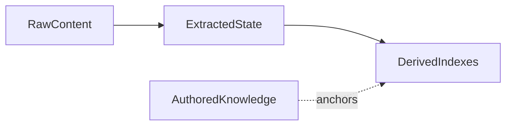
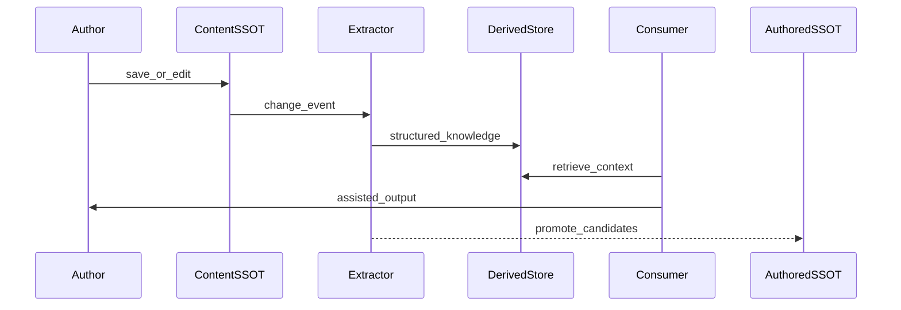

# AI-Driven Data Architecture, Part 2: The Blueprint

*Patterns, layers, and knowing when you're halfway done*

**Previous:** [Part 1 — Why Prompts Are Not Enough](2026-06-10-ai-driven-data-architecture-part-1-why-prompts-are-not-enough.md)

---

## Recap

In [Part 1](2026-06-10-ai-driven-data-architecture-part-1-why-prompts-are-not-enough.md), I defined **AI-driven data architecture** as structures and pipelines that turn raw inputs into grounded, traceable, reusable knowledge — with explicit ownership, measurement, and improvement loops. The LLM is a consumer; the pipeline is the product.

This post is the **blueprint** I drew for myself: four patterns that recurred across my build, plus a maturity rubric you can try on Monday. The same split between *what humans canonized*, *what machines extracted*, and *what indexes serve at query time* shows up well beyond fiction — support knowledge bases, contract review, internal documentation (though fiction is the one I've actually shipped).

If Part 1 was diagnosis, Part 2 is **design vocabulary** — the words I now reach for in architecture reviews, including with myself.

---

## Pattern 1 — Layered SSOT

The most expensive mistake I made was treating "our database" as one flat lore bucket. The systems I've built or studied tend to converge on **four logical layers** — I won't claim *every* system needs exactly four, but four is where I keep landing:

| Layer | Typical contents | Write policy |
|-------|------------------|--------------|
| **Content SSOT** | Source documents: manuscripts, tickets, contracts, chat logs | Versioned; author or system of record owns edits |
| **Authored knowledge SSOT** | Human-curated canon: glossary, approved FAQ, policy clauses | Humans promote; AI proposes into quarantine first |
| **Extracted state SSOT** | Job queues, extraction checkpoints, orchestration metadata | Workers write; not the graph itself |
| **Derived indexes** | Embeddings, graph projections, search indexes, materialized wiki pages | **Rebuildable** from content + extraction — never the only copy of truth |

### Why four, not one?

- **Content** answers: *what did someone actually write?*
- **Authored knowledge** answers: *what does the organization assert is true?*
- **Extracted state** answers: *what has the pipeline processed, and what's pending?*
- **Derived** answers: *what shape makes retrieval fast?*

Collapsing authored and extracted into one store felt efficient to me until I needed to **re-run extraction** after a model upgrade, or **reject** an inferred fact without polluting human canon.

**Anchoring:** derived graph nodes should link back to authored records where humans have decided equivalence ("this extracted entity *is* glossary entry X"). Without anchors, you get duplicate characters and irreconcilable search results.

### Pitfall: promote-less AI writes

If generated text lands directly in authored SSOT with no quarantine, you cannot audit, roll back, or teach the system *"this was machine-suggested."* The fix is a **promote flow**: extract → candidate → human or policy gate → authored SSOT → optional sync to derived graph.

> **Case study aside (LoreWeave):** Authored lore and extracted graph knowledge are deliberately split. A production bug — merge paths that silently dropped wiki content when two entities both had articles — was an SSOT-boundary smell, not a prompt bug. Fixing it meant archive-in-place and explicit merge journals, not better instructions to the model.

---

## Pattern 2 — The generate → extract → retrieve flywheel

One-way prompt apps treat user content as **read-once fuel**. AI-driven architecture treats content as **living input** to a loop:

**Closed loop properties:**

1. **Save triggers work** — extraction is event-driven (outbox, queue, stream), not "run when someone remembers."
2. **Consumers read derived + authored** — chat, translation, and agents pull grounded context; they don't re-parse raw PDFs every call.
3. **Promotion closes the circle** — validated extractions become authored facts; the next retrieval pass is cleaner.

I'd expect the same in support software: new ticket replies should update suggested categories and linked KB articles, not require an engineer to re-embed a static export — though that's analogy, not something I've run.

**Idempotency matters:** extraction must tolerate re-runs — same chapter saved twice, same ticket edited, same paragraph re-ingested — without duplicating graph nodes or corrupting counts. Deterministic IDs derived from `(tenant, source, normalized text)` are boring and lifesaving.

### Why async shows up everywhere

Synchronous "extract on save in the request path" breaks the moment extraction exceeds a few hundred milliseconds — which it always does at book/chapter scale. **Transactional outbox** (write business data + event row in one DB transaction; relay publishes asynchronously) is the boring pattern that keeps "save" fast and "process" reliable.

> **Case study aside (LoreWeave):** Chapter saves fan out to block indexing for lexical search and to extraction jobs for semantic passages. Hybrid retrieval later needed **both** legs — a single-vector "RAG" story would have lied about coverage for exact proper-noun matches in multilingual text.

---

## Pattern 3 — Retrieval as engineering

Adding embeddings is a start, not a retrieval strategy. Engineering retrieval, the way I had to learn it, means:

### Hybrid recall

Real corpora need **lexical** and **semantic** legs:

- Lexical (keyword, BM25, trigram) excels at exact tokens — names, codes, rare compounds.
- Semantic (embeddings) excels at paraphrase and conceptual proximity.

Fuse rankings (e.g. **reciprocal rank fusion**) instead of picking one winner. Optionally add a **cross-encoder rerank** on the fused shortlist when cosine similarity alone can't separate plausible junk from genuine matches — common with compressed embedding spaces on non-English text.

### Eval harness as architecture

Build **golden queries** with expected relevant documents. Track the metrics the IR literature already standardized — **recall@k**, **MRR**, **NDCG** — borrowed here as **regression gates**, not just paper numbers. Integration tests prove APIs return 200; they rarely prove the *right* passage is in the top five.

"We manually clicked search and it looked fine" failed us. Measurement showed lexical recall stuck at 0.63 until we changed SQL from flat row limits to best-hit-per-chapter windowing — then recall jumped toward 0.95 on the same golden set. Without the harness, we'd still be debating prompt tweaks.

### Graceful degradation

Design retrieval so **one leg failing doesn't 500 the product**:

- Semantic index unavailable → lexical-only with a visible degraded flag.
- Reranker timeout → fall back to fused ranking.
- User still gets an answer; telemetry records the missing leg.

Retrieval is a **service level**, not a demo checkbox.

### Anti-patterns in retrieval reviews

- **"We'll add eval later"** — later means after a customer trusts wrong answers.
- **Cosine threshold as junk filter** — embedding geometry varies by model and language; a universal floor often deletes good hits or keeps bad ones (we measured compressed cosine ranges where negatives scored higher than some positives until reranking).
- **Single-chunk RAG** — chapter-scale narrative needs block- or passage-level granularity with jump-to-source, not one embedding per document.

---

## Pattern 4 — Consumption layers

The LLM appears in multiple shapes:

| Consumer | Pattern | Needs from foundation |
|----------|---------|------------------------|
| **Chat** | Turn-based context assembly | Retrieve + trim + policy filters |
| **Batch pipelines** | Jobs (translate, summarize, audit) | Stable snapshots; idempotent writes |
| **Agents** | Tool calls over scoped data | MCP or equivalent; no 40k-token lore dumps |
| **Human UI** | Search, diff, approve | SSOT writes gated; provenance visible |

**Provider gateway:** centralize model names, keys, billing, and routing. When every service imports SDKs directly, you can't swap models, enforce spend caps, or audit calls — and "no hardcoded model literals" becomes folklore instead of architecture.

**Agents last:** tool definitions should expose **owned operations** ("search glossary," "get passage," "propose entity") backed by the layers above. Agents without data contracts, in my experience, turn into prompt assembly with extra latency.

Emerging **tool protocols** (e.g. MCP — Model Context Protocol) formalize what good consumption design already required: enumerate capabilities, scope them per user or tenant, execute with structured inputs, return structured outputs. The protocol does not replace layers 1–6; it **surfaces** them safely to layer 7.

---

## Maturity rubric — "We're ~50–70% done"

Half-built foundation is **expected** if you're shipping vertical slices honestly. Use this rubric to locate yourself — not to feel behind.

| Pillar | Minimum viable foundation | Production-grade |
|--------|---------------------------|------------------|
| **Raw ingest + SSOT** | Versioned source content | Provenance, multi-surface indexes (draft vs published) |
| **Extraction** | Batch jobs complete | Event-driven, idempotent, safe re-run after model change |
| **Authored vs extracted** | Single combined lore store | Explicit two-layer model + promote/quarantine |
| **Retrieval** | Embeddings + basic search | Measured hybrid + optional rerank + eval CI gate |
| **Synthesis** | One pipeline (e.g. translate or summarize) | Multiple pipelines sharing the same knowledge core |
| **Evaluation** | Manual spot checks | Golden sets + regression thresholds in CI |
| **Consumption** | Chat with history replay | Agents/tools with grounding contracts |
| **Improve** | Ad-hoc fixes after complaints | Correction capture feeding config, data, or model loops |

**How to read "50–70%":** you can demo end-to-end value (search finds sources, translation respects glossary, extraction populates a graph) while **horizontal** capabilities — full eval flywheel, agent layer maturity, every synthesis path feeding back — remain in progress. Each shipped slice **reveals** the next missing layer; that's progress, not scope creep failure.

**A note on this rubric:** it's a self-diagnostic for locating yourself, not an industry benchmark.

> **Case study aside (LoreWeave):** On this rubric the project sits roughly **55–65%** — strong on raw content indexing and measured hybrid retrieval; maturing on evaluation flywheel, agent tooling, and deferred-sync materialized views (e.g. LLM-generated wiki with staleness tracking). Still building, still measuring.

---

## Case study — LoreWeave in one screen (optional depth)

**LoreWeave** is a multilingual novel-workflow platform I've been building as a solo-built but production-minded system: translation, authored glossary, extracted knowledge graph, hybrid search, chat, and assisted composition — not a single chat box.

Architecturally it reflects the patterns above — unsurprisingly, since I **derived the patterns from it**; this is a worked example, not independent confirmation:

- **Polyglot persistence** — relational stores for SSOT, a derived graph for relations and passages, object storage for media, message buses for heavy jobs.
- **Database-per-service ownership** — no cross-database foreign keys; integration via HTTP and events.
- **Measured retrieval** — hybrid search with an eval harness (golden queries, recall/MRR/NDCG) built to gate regressions; run on demand today, with CI auto-gating still being wired.
- **MCP-style agent routing** — a federation gateway so chat consumes tools over owned data instead of bespoke prompt endpoints.

If you want the **technical map** (service boundaries, flows, store catalog), it's documented separately: [DATA_ARCHITECTURE.md](../DATA_ARCHITECTURE.md). The blog series is intentionally standalone; that doc is for contributors and curious architects, not a prerequisite.

---

## What to do Monday

A practical checklist:

1. **Map your product to the eight layers** from Part 1. Mark each layer *missing*, *thin*, or *solid*.
2. **For every fact type**, write one line: *who owns writes?* If two layers can write the same fact without a promote story, you've found tomorrow's incident.
3. **Add one retrieval metric** before the next feature — even ten golden queries in a spreadsheet beats vibes.
4. **Pick one vertical slice** that touches ingest → retrieve → consume → (optional) evaluate. Ship that before widening agent surface area.
5. **Treat derived indexes as disposable** — prove you can rebuild them from content + extraction state.

---

## Closing

AI-driven products fail quietly when teams optimize prompts while **ownership, lineage, and measurement** stay undefined — at least, that's the failure mode I lived. The blueprint isn't glamorous: layered SSOT, a flywheel, engineered retrieval, disciplined consumption. For me it's been the difference between a demo that impresses in a meeting and a system that still makes sense after ten thousand chapters.

These patterns come from a measured build, not a whiteboard, and they stand on a deep body of published research. Where your experience contradicts mine, that's the interesting part — I'd rather update the model than defend it.

The model will keep changing. The foundation is what you keep.

**Previous:** [Part 1 — Why Prompts Are Not Enough](2026-06-10-ai-driven-data-architecture-part-1-why-prompts-are-not-enough.md) · **Index:** [Blog README](README.md)
