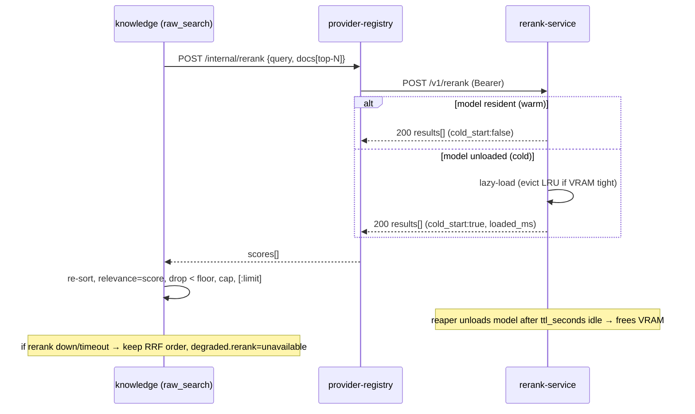

# Rerank Service — Integration Guide & API Contract

**Status:** contract draft · 2026-06-08 · owners: LoreWeave (consumer) + external rerank-service repo (provider)
**Why:** raw-search E5 proved a global cosine threshold can't reject off-topic queries on the bi-encoder (bge-m3) leg — cosine is compressed `[0.68, 0.82]` and a real paraphrase positive scores *below* a junk query. Only a **cross-encoder reranker** (reads the query+passage pair) separates them. Neither LM Studio nor Ollama exposes a rerank API, so rerank lives in a **dedicated external service** (its own repo) that LoreWeave calls.

This document is the **contract** both repos implement against. It defines: (1) a **standard rerank API**, (2) a **model load/unload + TTL** management API for VRAM control, and (3) **how LoreWeave consumes it** (placement, config, degradation, calibration).

---

## 1. Design principles

1. **Standard rerank API.** The scoring endpoint is **Cohere-Rerank-compatible** (the de-facto standard, also spoken by Jina, Voyage, TEI's cohere-compat, Infinity). Off-the-shelf clients and runtimes interoperate; LoreWeave's adapter targets this one shape.
2. **On-demand VRAM.** Models **load lazily** on first use and **auto-unload after an idle TTL**, so an idle reranker frees GPU memory for other local models (the LM Studio / Ollama / image-gen stack shares one GPU). A VRAM budget caps concurrently-resident models (LRU eviction).
3. **Graceful, never-blocking for the app.** A reranker that is down, loading, or slow must **degrade to the pre-rerank order** in LoreWeave — search never 500s or hangs because of rerank.
4. **Self-hosted, no lock-in.** Standard HTTP + JSON. Runs anywhere (homelab GPU box, another VPS); addressed by URL + a bearer token.

---

## 2. Authentication

All endpoints require a bearer token (shared secret), matching LoreWeave's internal-service pattern:

```
Authorization: Bearer <RERANK_SERVICE_TOKEN>
```

Unauthorized → `401`. The token is configured on both sides (env var). No per-user BYOK at this layer — the rerank service is platform infra (like Neo4j), not a user-keyed provider.

---

## 3. Rerank API (Cohere-compatible)

### `POST /v1/rerank`

Score `documents` by relevance to `query`, return them ranked.

**Request**
```json
{
  "model": "bge-reranker-v2-m3",
  "query": "主角第一次开启神武印记的经过",
  "documents": ["张若尘睁开双眼……", "他在武市买了一把剑……", "量子计算机……"],
  "top_n": 30,
  "return_documents": false
}
```
| field | type | required | notes |
|---|---|---|---|
| `model` | string | yes | model id (see `GET /v1/models`) |
| `query` | string | yes | the search query |
| `documents` | string[] | yes | candidate texts (passage/chunk text). Cap (e.g. ≤256) + per-doc length cap enforced server-side. |
| `top_n` | int | no | return only the top N (default: all) |
| `return_documents` | bool | no | echo doc text in results (default false — caller already has it by index) |

**Response `200`**
```json
{
  "model": "bge-reranker-v2-m3",
  "results": [
    { "index": 0, "relevance_score": 0.985 },
    { "index": 1, "relevance_score": 0.122 },
    { "index": 2, "relevance_score": 0.004 }
  ],
  "meta": { "cold_start": false, "loaded_ms": 0, "scored": 3 }
}
```
- `results` sorted by `relevance_score` **descending**; `index` refers to the request `documents` array.
- `relevance_score` ∈ `[0, 1]`, **calibrated by the cross-encoder** (well-separated — unlike bi-encoder cosine). This is what LoreWeave thresholds on.
- `meta.cold_start` = the model was loaded on this call; `loaded_ms` = load latency incurred.

### Cold-start behavior (interacts with §4 TTL)
If `model` is not resident when `/v1/rerank` is called, the service **lazy-loads it**, then serves. Two acceptable modes (declare which in the service README; LoreWeave handles both):
- **Block-and-load (preferred):** hold the request until loaded, serve, return `cold_start:true` + `loaded_ms`. Caller uses a generous timeout (see §6).
- **202-then-retry:** return `503 {"error":"model_loading","retry_after_ms":4000}`; caller retries after the hint. (LoreWeave will instead just degrade on the first 503 to keep search snappy — so block-and-load gives better UX.)

Any `/v1/rerank` call **touches `last_used_at`** (resets the TTL).

### Errors
| status | body `error` | meaning |
|---|---|---|
| 400 | `validation` | bad/empty query or documents, too many docs |
| 401 | `unauthorized` | bad token |
| 404 | `model_not_found` | unknown model id |
| 503 | `model_loading` | (202-then-retry mode) still loading |
| 503 | `out_of_memory` | load failed — VRAM budget exhausted even after eviction |
| 500 | `internal` | unexpected |

---

## 4. Model management API (load / unload / TTL — VRAM control)

Cross-encoder runtimes (TEI/Infinity) normally keep a model **always resident**. To share one GPU, this service adds an explicit lifecycle layer.

### `GET /v1/models`
```json
{ "models": [
  { "id": "bge-reranker-v2-m3", "state": "loaded",   "vram_mb": 1180,
    "last_used_at": "2026-06-08T10:01:22Z", "ttl_seconds": 600, "expires_at": "2026-06-08T10:11:22Z", "keep_warm": false },
  { "id": "qwen3-reranker-4b",  "state": "unloaded", "vram_mb": 0, "ttl_seconds": 600 }
] }
```
`state` ∈ `unloaded | loading | loaded | unloading | error`.

### `GET /v1/models/{id}` — single-model status (same shape).

### `POST /v1/models/{id}/load`
Idempotent. Loads into VRAM (evicting per §4.3 if needed). Returns when ready (or `503 out_of_memory`).
```json
{ "id": "bge-reranker-v2-m3", "state": "loaded", "vram_mb": 1180, "loaded_ms": 3400, "expires_at": "..." }
```
Optional body: `{ "ttl_seconds": 1800, "keep_warm": true }` to override TTL / pin resident.

### `POST /v1/models/{id}/unload`
Idempotent. Evicts now (frees VRAM). `200 { "id": "...", "state": "unloaded" }`. No-op if already unloaded.

### 4.1 TTL semantics
- Each model has a **`ttl_seconds`** (default `RERANK_DEFAULT_TTL`, e.g. 600). After `ttl_seconds` of **no `/v1/rerank` calls** (idle since `last_used_at`), a background reaper unloads it → frees VRAM.
- Every `/v1/rerank` call **resets the timer** (`last_used_at = now`, `expires_at = now + ttl`).
- **`keep_warm: true`** pins a model resident (TTL ignored) — for a hot reranker you never want cold.
- Reaper runs on an interval (`RERANK_REAPER_INTERVAL`, e.g. 30s).

### 4.2 Config (env, service side)
| var | default | meaning |
|---|---|---|
| `RERANK_SERVICE_TOKEN` | — | bearer secret (required) |
| `RERANK_DEFAULT_TTL` | 600 | idle seconds before auto-unload |
| `RERANK_REAPER_INTERVAL` | 30 | reaper tick seconds |
| `RERANK_VRAM_BUDGET_MB` | (gpu-dependent) | cap on total resident reranker VRAM |
| `RERANK_MAX_LOADED` | 1 | max concurrently-resident models (LRU evict beyond) |
| `RERANK_MODELS` | `bge-reranker-v2-m3` | allowlist of servable model ids + sources |

### 4.3 Eviction policy (VRAM budget)
On a load that would exceed `RERANK_VRAM_BUDGET_MB` / `RERANK_MAX_LOADED`: evict the **least-recently-used non-`keep_warm`** model(s) first; if still insufficient → `503 out_of_memory`. A model mid-serve is not evicted (refcount/lock during a rerank call).

### `GET /health` (liveness) · `GET /ready` (process up, even with 0 models loaded).

---

## 5. Reference implementation notes (external repo)
- **Scoring core:** `sentence-transformers` `CrossEncoder` or `FlagEmbedding` `FlagReranker` for `BAAI/bge-reranker-v2-m3` (1024-pair cross-encoder, CJK-strong). Wrap in FastAPI.
- **Lifecycle layer:** a `ModelManager` holding `{id → (model, last_used, lock, keep_warm)}`; lazy-load on first rerank; an asyncio reaper task enforcing TTL; an LRU + VRAM-budget check on load; `torch.cuda.empty_cache()` on unload.
- **Alternatives:** TEI / Infinity give a fast `/rerank` but **no load/unload/TTL** — you'd run one per model and gate them with this manager (process supervisor), or front them with a custom router. The custom FastAPI+ModelManager is simplest for the load/unload+TTL requirement.
- Keep the **rerank wire-shape Cohere-compatible** regardless of the engine behind it.

---

## 6. LoreWeave integration (consumer side — this repo)

### 6.1 Where it routes
Rerank is an AI model call → it goes **through the provider gateway** (provider-registry), mirroring embeddings (the provider-gateway invariant: no direct provider SDKs in domain services):
```
knowledge raw_search ─▶ RerankerClient ─▶ provider-registry POST /internal/rerank
                                          └▶ tei/cohere adapter ─▶ {RERANK_URL}/v1/rerank
```
- Register the rerank endpoint as a provider credential (`provider_kind='rerank'` or `'tei'`, `endpoint_base_url=RERANK_URL`) + a rerank `user_model` (model_ref the orchestrator passes).
- (Simpler interim: a direct `knowledge → RERANK_URL` `RerankerClient` behind a `RERANKER_URL` setting, treating the service as internal infra like Neo4j. Promote to the gateway path when productionizing.)

### 6.2 Pipeline placement (`app/routers/public/raw_search.py`)
After `rrf_fuse` produces the candidate list:
1. Take the fused **top-N** (N≈`RERANK_TOP_N`, e.g. 30) — rerank is O(N) cross-encoder passes; keep N bounded.
2. Call rerank with `query` + those candidates' `snippet`/text.
3. **Re-sort** by `relevance_score`; set each hit's `relevance` = the cross-encoder score (replaces the bi-encoder cosine / lexical sim for reranked hits).
4. Apply `min_rerank_score` floor (calibrated, §6.4) → drops off-topic queries' junk. THEN `cap_per_chapter` + `[:limit]`.

New query params: `rerank: bool = True` (default on for hybrid/semantic), `min_rerank_score: float`.

### 6.3 Degradation contract (mandatory)
Reranker `None`/timeout/`503`/down → **skip rerank, keep the RRF fusion order** (current E5 behavior), set `degraded["rerank"]="unavailable"`. Never 500, never block the search. Cold-start: use a **load-tolerant timeout** (e.g. 8–10s) on the *first* call, short (≤2s) on warm calls — or fire a `POST /v1/models/{id}/load` pre-warm at app start / on a schedule so user-facing searches are always warm.

### 6.4 Calibrating `min_rerank_score`
Cross-encoder scores separate cleanly (unlike cosine), so a real floor works. Calibrate via the eval harness: run the negative-control queries (`封神榜`…) + positives (incl. the weak `三年前…`) through rerank, set the floor between the highest-negative and lowest-true-positive cross-encoder score. Re-run `scripts/run_rawsearch_eval.py --rerank` and confirm: negatives → 0 results, positives retained, hybrid MRR/ndcg ≥ the E5 baseline.

### 6.5 Config keys (this repo)
`RERANK_URL`, `RERANK_SERVICE_TOKEN`, `RERANK_MODEL_REF`, `RERANK_TOP_N` (30), `MIN_RERANK_SCORE` (calibrated), `RERANK_TIMEOUT_WARM_MS` / `RERANK_TIMEOUT_COLD_MS`, `RERANK_ENABLED` (kill-switch → pure E5 behavior).

---

## 7. Sequence (warm + cold)



---

## 8. Acceptance (when both sides are built)
1. `POST /v1/rerank` Cohere-compatible; scores separate negatives from the weak `三年前` positive (the case cosine couldn't).
2. `load`/`unload`/`GET /v1/models` work; idle model auto-unloads after `ttl_seconds`; VRAM freed (verify `nvidia-smi`).
3. LoreWeave: negatives → 0 results with rerank on (no true-positive lost); reranker-down degrades to E5 order, no 500; hybrid MRR/ndcg@10 ≥ E5 baseline.
4. Cold-start tolerated (or pre-warm); warm rerank adds < ~150ms (GPU) to a search.

## 9. Open questions for the external repo
- GPU/CPU + which engine (sentence-transformers vs TEI-wrapped) — affects warm latency.
- Default `RERANK_VRAM_BUDGET_MB` / `RERANK_MAX_LOADED` for the shared GPU.
- Block-and-load vs 202-retry on cold start (LoreWeave prefers block-and-load + pre-warm).
- Whether to also serve **embeddings** from the same service (consolidate model management) — out of scope here; bge-m3 embeddings stay on LM Studio for now.
```
