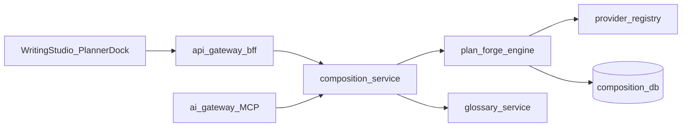

# PlanForge — Promote to composition-service

> **Date:** 2026-07-01 · **Status:** PLAN · **Implement SSOT:** [`09_PLANFORGE_BLUEPRINT.md`](../specs/2026-07-01-plan-forge/09_PLANFORGE_BLUEPRINT.md) · **Trigger:** POST-POC eval **GO** ([`04_PO_REVIEW.md`](../specs/2026-07-01-plan-forge/04_PO_REVIEW.md))

## Goal

Port headless PlanForge engine from [`scripts/plan-forge-poc/plan_forge/`](../../scripts/plan-forge-poc/plan_forge/) into [`services/composition-service/app/engine/plan_forge/`](../../services/composition-service/app/engine/plan_forge/), wire LLM via **provider-registry**, expose MCP tools via ai-gateway, persist `plan_runs` per `book_id`.

## Architecture (target)



## Milestones

### M1 — Engine port (rules + normalize)

| Task | Detail |
|------|--------|
| Copy engine modules | `ingest`, `propose`, `propose_llm`, `links`, `decompose`, `compile`, `validate`, `compare`, `json_extract` |
| Schemas | Import from [`contracts/plan-forge/`](../../contracts/plan-forge/) — no fork |
| Unit tests | Port `test_plan_forge.py` → `services/composition-service/tests/unit/test_plan_forge.py` |
| Remove direct `requests` LLM | Replace `llm_client.py` with composition-service `llm_client` pattern |

**Acceptance:** `pytest` green; rules path S1–S8 on fixture via service-local runner.

### M2 — Provider-registry LLM path

| Task | Detail |
|------|--------|
| Resolve chat model | `user_model_id` via provider-registry internal route (BYOK) |
| Env | No `PLANFORGE_LM_*` in production — use `model_ref` on API |
| IO audit | `plan_runs.llm_io` JSONB or MinIO prefix `plan-runs/{id}/` |
| Live smoke | 1 analyze+materialize through gateway + registry |

**Acceptance:** Same golden pass as POC; provider-rule gate clean.

### M3 — HTTP API + persistence

| Endpoint | Purpose |
|----------|---------|
| `POST /v1/books/{book_id}/plan/runs` | Start ingest→propose (mode=rules\|llm) |
| `GET /v1/books/{book_id}/plan/runs/{run_id}` | Status + artifacts |
| `PATCH .../novel-system-spec` | Checkpoint edit-merge |
| `POST .../validate` | Golden linter |
| `POST .../compile` | Arc package → existing `planning_pipeline` |

**DB tables (composition DB):**

- `plan_runs` — `book_id`, `owner_user_id`, `status`, `source_checksum`, `mode`, timestamps
- `plan_artifacts` — `run_id`, `kind` (analyze\|spec\|graph\|package), `jsonb`

**Tenancy:** filter `owner_user_id` + `book_id` on every query (E0 grants).

### M4 — MCP tools (ai-gateway)

| Tool | Owner |
|------|-------|
| `plan_propose_spec` | composition-service |
| `plan_validate` | composition-service |
| `plan_compile` | composition-service |
| `plan_review_checkpoint` | composition-service |

Federate in ai-gateway per [`01_PLANFORGE_ARCHITECTURE.md`](../specs/2026-07-01-plan-forge/01_PLANFORGE_ARCHITECTURE.md).

### M5 — Writing Studio planner dock (FE)

| Task | Detail |
|------|--------|
| Dock panel | Upload/paste plan → propose → diff review |
| Checkpoints | Blocking gates after propose + per-layer (architecture §Checkpoint) |
| Wire Manuscript | Debt #1 — plan events → outline nodes |

**Out of M1–M4 scope** — separate Writing Studio track.

## Iterate items (from POC eval)

1. **Event checklist prompt** — materialize must emit all 7 arc_2 events (Thử Nghiệm dropout)
2. **Canonical IDs** — `arc_2_event_N` or post-map by normalized title
3. **Anchor language** — preserve VN or explicit EN policy in prompt
4. **Citation spans** — analyze step cites source line ranges (future)

## Risk controls

| Risk | Control |
|------|---------|
| Direct provider SDK | provider-registry only |
| Tenancy leak | `book_id` + grant on all plan_runs |
| LLM non-determinism | normalize pass + validate gate before compile |
| Agent bypass HTTP | MCP-first for agentic propose |

## Verification

```bash
# POC regression (keep until M2 done)
pytest scripts/plan-forge-poc/test_plan_forge.py -q -m "not live"

# Service (post M1)
pytest services/composition-service/tests/unit/test_plan_forge.py -q

# Live smoke (post M2)
# gateway → composition → provider-registry → local lm_studio
```

## Estimated size

**L** — 7–12 logic changes, 2+ side effects (DB migration, MCP contracts), multi-service.

## Deferred (explicit)

- Multi-file braindump ingest
- Full arc_1 + world system compile
- Auto-promote glossary/wiki without human checkpoint
