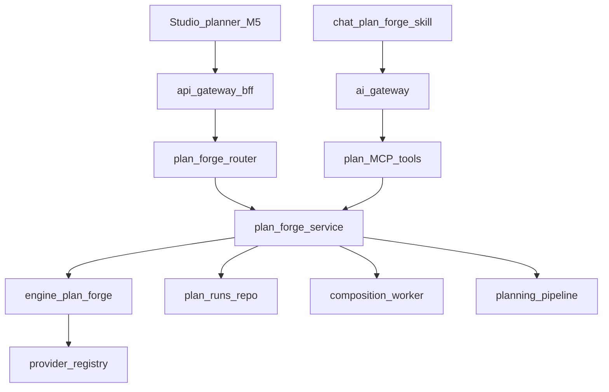

# PlanForge — Implement plan (composition-service)

> **Date:** 2026-07-01 · **Status:** IMPLEMENT · **SSOT architecture:** [`09_PLANFORGE_BLUEPRINT.md`](../specs/2026-07-01-plan-forge/09_PLANFORGE_BLUEPRINT.md) · **Contract:** [`contracts/api/composition-service/plan-forge.v1.yaml`](../../contracts/api/composition-service/plan-forge.v1.yaml) · **POC:** frozen at [`scripts/plan-forge-poc/`](../../scripts/plan-forge-poc/)

## Goal

Port PlanForge engine from POC into [`services/composition-service/app/engine/plan_forge/`](../../services/composition-service/app/engine/plan_forge/), BYOK LLM via **provider-registry** (`model_ref` required), async worker for long propose/refine, persist `plan_runs` per `book_id`, MCP `plan_*` tools via ai-gateway, Studio planner dock (M5).

**Distinct from A3:** [`engine/plan.py`](../../services/composition-service/app/engine/plan.py) (scene decompose) stays; PlanForge = upstream `NovelSystemSpec` → `planning_pipeline`.

## PO decisions (locked 2026-07-01)

| Topic | Decision |
|-------|----------|
| HTTP API | `/v1/composition/books/{book_id}/plan/*` |
| Work on compile | **auto_work** — `_ensure_pending_work` when `project_id` null |
| Propose/refine LLM | **async_job** — 202 + poll `run.status` / `active_job_id` |
| Model BYOK | **explicit_only** — `model_ref` required on every LLM call |
| Confirm UX (M4) | **A** — extend `confirm_action` domain `composition` |
| Validate production v1 | **S1–S8 golden linter only**; fixture fidelity YAML = regression tests |
| Multiple runs/book | History allowed; Studio opens latest `updated_at` |
| Grants | VIEW read; EDIT create/refine/compile |
| Source storage | Inline TEXT ≤256KB; above → MinIO `plan-runs/{run_id}/source.md` |

## Architecture



## M0 — Contract-first

| Deliverable | Path |
|-------------|------|
| OpenAPI | [`contracts/api/composition-service/plan-forge.v1.yaml`](../../contracts/api/composition-service/plan-forge.v1.yaml) |
| JSON schemas | [`contracts/plan-forge/`](../../contracts/plan-forge/) — import, no fork |
| ai-gateway extra prefix | `EXTRA_PREFIX_MAP.composition = ['plan_']` |
| MCP tier policy | `plan_*` in [`tool-policy.ts`](../../services/mcp-public-gateway/src/scope/tool-policy.ts) |

**Acceptance:** PO sign-off OpenAPI + MCP list; no implementation required beyond contract files + gateway config.

## M1 — Engine port (rules + normalize)

| Task | Detail |
|------|--------|
| Copy modules | `ingest`, `propose`, `links`, `decompose`, `compile`, `validate`, `compare`, `coverage`, `json_extract`, `refine`, `elaborate`, `prompts`, `spec_index`, `interpret`, `self_check`, `apply_policy`, `eval_fidelity` |
| Skip | `llm_client.py` (replaced M2), `eval_chat_hil.py` (harness stays in scripts) |
| New | `normalize.py` — D-PF-NORMALIZE |
| Tests | Port `test_plan_forge.py` → `services/composition-service/tests/unit/test_plan_forge.py` |
| Fixtures | Package under `tests/fixtures/plan-forge/` or reference scripts POC fixtures |

**Acceptance:** `pytest services/composition-service/tests/unit/test_plan_forge.py -q` — S1–S8 PASS rules path.

## M2 — Provider-registry LLM

| Task | Detail |
|------|--------|
| Adapter | `app/engine/plan_forge/llm.py` via [`LLMClient`](../../services/composition-service/app/clients/llm_client.py) |
| Worker ops | `plan_forge_propose`, `plan_forge_refine` |
| Prompt | 7-event checklist arc_2; VN-first anchor language |
| Partial refine | `focus_paths[]` when set (D-PF-PARTIAL-REFINE) |
| IO audit | `plan_artifacts` kind=`llm_io` |

**Acceptance:** Live smoke gateway → composition → provider-registry; `ai-provider-gate.py` clean; POC regression green.

## M3 — HTTP API + persistence

**DB (`migrate.py`):** `plan_runs`, `plan_artifacts` — `owner_user_id` + `book_id` on every query.

**Router:** `app/routers/plan_forge.py` — implement OpenAPI.

| Endpoint | Notes |
|----------|-------|
| `POST .../plan/runs` | rules → 201 sync; llm → **202** + `job_id` |
| `GET .../plan/runs/{run_id}` | `active_job_id`, `job_status`, artifacts |
| `PATCH .../novel-system-spec` | checkpoint edit-merge |
| `POST .../validate` | S1–S8 (+ fidelity report artifact, non-blocking v1) |
| `POST .../refine` | `model_ref` required; async when LLM |
| `POST .../interpret` | `model_ref` required |
| `POST .../self-check` | rules only |
| `POST .../compile` | `{ arc_id }` → auto Work → `PlanningPackage` + optional pipeline job |

**Acceptance:** integration DB test + gateway E2E create→validate.

## M4 — MCP + chat

8 tools per blueprint §5: `plan_propose_spec`, `plan_review_checkpoint`, `plan_self_check`, `plan_interpret_feedback`, `plan_apply_revision`, `plan_handoff_autofix`, `plan_compile`, `plan_validate`.

| Task | Detail |
|------|--------|
| MCP | Thin wrappers in `app/mcp/server.py` → `plan_forge_service` |
| Skill | `chat-service/app/services/plan_forge_skill.py` |
| Honesty | D-PF-APPLY-HONESTY: `fidelity_delta==0` → `no_change` |

**Acceptance:** MCP list-tools smoke; chat HIL integration test.

## M5 — Writing Studio planner dock

`frontend/src/features/plan-forge/` + Studio `planner` panel; model picker required; poll run status.

**Acceptance:** Browser smoke paste fixture → propose → checkpoint → validate → compile.

## Verification

```bash
# POC regression (until M2 green)
pytest scripts/plan-forge-poc/test_plan_forge.py -q -m "not live"

# Service (post M1)
pytest services/composition-service/tests/unit/test_plan_forge.py -q

# Provider gate (post M2)
python scripts/ai-provider-gate.py
```

## Deferred

See blueprint §7: `D-PF-CONVENIENCE-EVAL`, `D-PF-MULTI-DOC`, `D-PF-MULTI-FILE`, `D-PF-AUTO-GLOSSARY`.

## Size

**L** — contract + DB + worker + MCP + FE dock.
