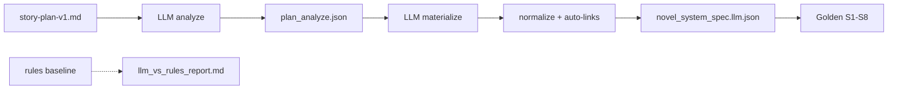

# PlanForge LLM Live POC — Evaluation

> **Date:** 2026-07-01 · **Fixture:** `scripts/plan-forge-poc/fixtures/story-plan-v1.md`  
> **Model:** `google/gemma-4-26b-a4b-qat` via LM Studio (`http://127.0.0.1:1234/v1`)

## Verdict

**PASS** — live NL → analyze → materialize → validate completes; golden S1–S8 pass on LLM spec after link normalization.

The LLM path proves the intended workflow: read full natural-language plan (no TOC/header dependency), extract intermediate `PlanAnalyze`, materialize `NovelSystemSpec`, auto-link planner notes, compile, and validate against the same golden as the rules baseline.

## Process (2-step + normalize)



| Step | Latency | Tokens (prompt / completion) |
|------|---------|------------------------------|
| 1 Analyze | ~19.6s | 7500 / 2461 |
| 2 Materialize | ~21.5s | 2870 / 2853 |
| **Total** | **~41s** | **~15.7K** |

Audit trail: `scripts/plan-forge-poc/out/llm_io/001_analyze.json`, `002_materialize.json`.

## Live criteria (L1–L5)

| ID | Criterion | Result | Evidence |
|----|-----------|--------|----------|
| L1 | LM Studio reachable | PASS | 87 models listed, HTTP 200 |
| L2 | Step 1 analyze JSON parses | PASS | `plan_analyze.json` — 4 vars, 8 events, 8 open questions |
| L3 | Step 2 spec JSON parses | PASS | `novel_system_spec.llm.json` — no repair call needed |
| L4 | Golden S1–S8 on LLM spec | PASS | `validation_report.llm.md` — all ✓ after link normalize |
| L5 | Compare report produced | PASS | `llm_vs_rules_report.md` |

## Semantic quality (LLM vs source intent)

**Strong alignment:**

- Four planner variables PA / HA / CD / THR with transition rules; PA not coupled to realm
- `arc_2.arc_kind = discovery`, theme "Discovery and Price"
- Six English consistency anchors (pragmatism, mundane happiness, dry humor, etc.)
- Seven arc_2 events matching Vietnamese titles in source (Nhập Môn → Quyết Định Tiếp Tục)
- Eight open questions preserved
- THR foreshadowing without early exposition; forbids + style constraints captured
- `plan_analyze.json` shows LLM *understood* document structure without header regex

**Gaps / noise:**

- Event IDs differ from rules engine (`ev_2_*` vs `arc_2_event_*`) — expected; compare by **title** shows ~100% arc_2 overlap
- Anchors translated to English prose (rules keep Vietnamese phrasing) — semantic overlap high, literal string overlap lower
- Materialize emitted some `planner_notes` as strings; `_normalize_spec` + `build_links_from_events` fixes traceability
- Premise shorter than rules path (584 vs 747 chars) — still under 4K cap

## Rules vs LLM comparison

| Metric | Value |
|--------|-------|
| Arc 2 event count | rules 7 / LLM 7 |
| Event ID overlap | 0% (different ID scheme) |
| Event **title** overlap | 100% (same Vietnamese event names) |
| Variable codes | 100% |
| Arc 2 kind | both `discovery` |

**Interpretation:** engines disagree on IDs and anchor wording, not on story structure. Golden validates *intent*, not byte-identical spec.

## Post-run fix (link normalization)

Initial live run failed S5 (`notes_linked` ratio 0.57) because:

1. LLM returned `planner_notes` as strings on some events
2. Materialize links did not cover all note-only events

**Fix (in POC, not re-LLM):** `normalize_planner_notes`, `build_links_from_events` merge in `_normalize_spec`, validator handles string notes. Re-validate → ratio 1.00, S5 PASS.

Production should run normalize on every LLM materialize output (already wired in `propose_llm.py`).

## Commands

```bash
# Requires LM Studio :1234 with model loaded
python scripts/plan-forge-poc/run_poc_llm.py \
  --fixture scripts/plan-forge-poc/fixtures/story-plan-v1.md \
  --compare-rules

# Or via main runner
python scripts/plan-forge-poc/run_poc.py --llm --compare-rules
```

Env overrides: `PLANFORGE_LM_BASE_URL`, `PLANFORGE_LM_MODEL`.

## Recommendation

1. **Promote** 2-step analyze → materialize pattern to composition-service PlanForge engine
2. **Keep** deterministic link pass after every LLM materialize (do not trust model-emitted links alone)
3. **Next:** provider-registry path for production; citation spans for hallucination audit; checkpoint UI in Writing Studio
4. **Optional:** canonical event ID policy (LLM prompted with rules IDs or post-map by title)

## Out of scope (this POC)

- Gateway / provider-registry routing
- DB persist / glossary API
- Multi-file braindump without structure
- UI checkpoint

---

## Appendix — POST-POC eval (Phase C)

Re-run 2026-07-01 via [`eval_stability.py`](../../../scripts/plan-forge-poc/eval_stability.py):

| Run | arc_2 events | Full golden | Title overlap |
|-----|--------------|-------------|---------------|
| 1 | 6 (no Thử Nghiệm) | FAIL (S3 anchors) | 86% |
| 2 | 6 | PASS | 86% |
| 3 | 6 | PASS | 86% |

Braindump smoke (`fixtures/story-braindump-smoke.md`): 4 vars + **7/7** arc_2 titles.

See [`04_PO_REVIEW.md`](04_PO_REVIEW.md) for GO verdict. Implement: [`09_PLANFORGE_BLUEPRINT.md`](09_PLANFORGE_BLUEPRINT.md) · [`docs/plans/2026-07-01-plan-forge-promote.md`](../../plans/2026-07-01-plan-forge-promote.md).
