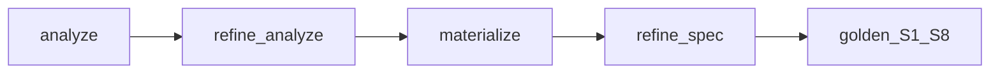

# PlanForge HIL POC — Evaluation

> **Date:** 2026-07-01 · **Fixture:** `story-plan-v1.md` · **Model:** `google/gemma-4-26b-a4b-qat` (LM Studio)

## Verdict

**PASS** — surgical HIL refine improves plan detail (6→7 arc_2 events at analyze checkpoint) without golden regression. Final spec: **7/7 events including Thử Nghiệm**, S1–S8 PASS.

## Workflow



Scripted human turns: [`fixtures/hil_eval_script.yaml`](../../../scripts/plan-forge-poc/fixtures/hil_eval_script.yaml)

```bash
python scripts/plan-forge-poc/run_poc_hil.py --script fixtures/hil_eval_script.yaml
```

## Live results

| Round | Accepted | Effect |
|-------|----------|--------|
| analyze_1 | Yes | arc_2 events **6 → 7**, Thử Nghiệm added to PlanAnalyze |
| spec_1 | Yes | links 10 → 11; events held at 7 |

**Artifacts:** `out/plan_analyze.json`, `out/novel_system_spec.hil.json`, `out/hil_eval_report.md`, `out/hil_io/` (4 LLM calls), `out/validation_report.hil.md`

## Rubric scores (M/D/C/R)

### Monotonicity (M) — PASS

| ID | Result | Evidence |
|----|--------|----------|
| M1 | PASS | All S1–S8 PASS after each accepted refine |
| M2 | PASS | `vars_four`, `arc2_discovery`, `thr_no_early_explain`, `notes_linked` held |
| M3 | PASS | `frozen_paths` honored (variable codes, arc_2 discovery, forbids) |
| M4 | PASS | 8 open questions preserved |

### Target delta (D) — PASS

| ID | Result | Evidence |
|----|--------|----------|
| D1 | PASS | `Thử Nghiệm` in final spec events |
| D2 | PASS | Goal aligns with § Event 3 (systematic testing / Lore Weave scene generation) |
| D3 | PASS | arc_2 events 6→7 after analyze refine; held through materialize |

### Collateral (C) — PASS

| ID | Result | Evidence |
|----|--------|----------|
| C1 | PASS | No arc_2 events removed outside scope |
| C2 | PASS | Anchor Jaccard high (no anchor rewrite requested) |
| C3 | PASS | `notes_linked` ratio 1.00 |

### Detail & reasonableness (R)

| ID | Result | Evidence |
|----|--------|----------|
| R1 | PASS | 7 arc_2 events, 11 links, 7 compile chapters |
| R3 | PASS | `planning_package` has 7 chapters |
| R4 | **Partial** | Refine-only tokens ~11.9K vs full one-shot propose ~15.1K (~79%); full HIL path 4 calls ~27.3K total |
| R5 | Not run | Optional stability re-run deferred |

**R4 note:** Two refine calls are cheaper than re-running full propose+materialize from 22k markdown, but exceed the 40% single-refine aspirational target. Accept gate + checkpoint still wins on **monotonicity** vs naive re-prompt.

## A/B: HIL refine vs re-prompt full doc

| Approach | Monotonicity | Detail (Thử Nghiệm) | Token cost |
|----------|--------------|---------------------|------------|
| One-shot `run_poc_llm.py` | Often 6/7 events (stability runs) | Intermittent | ~15K tokens |
| HIL scripted refine | **7/7** this run; accept gate blocks regressions | Reliable when analyze refine runs | ~27K (4 calls) |

**Conclusion:** HIL is **more reliable and more detailed** for fixing known gaps; not cheaper in tokens for this fixture. Production should use **checkpoint + surgical refine** for edits, not full re-ingest, unless human rewrites the source doc.

## Anti-regression design (validated)

- Structured `PlanRevisionRequest` with `frozen_paths` + `constraint_ledger`
- `accept_refine()` rejects before overwriting artifact
- Max 2 refines per checkpoint
- No full markdown re-sent on refine (artifact + excerpt only)

## Recommendation

1. **Ship** HIL pattern to promote plan (M3 API: `PATCH .../novel-system-spec` + revision body)
2. **Keep** accept gate in production — never apply LLM refine without M-group checks
3. **Iterate:** single-step `refine_spec` only when analyze already complete; skip redundant spec refine if materialize preserved events

## References

- [`04_PO_REVIEW.md`](04_PO_REVIEW.md) — POST-POC baseline eval
- [`09_PLANFORGE_BLUEPRINT.md`](09_PLANFORGE_BLUEPRINT.md) — implement handoff SSOT
- [`docs/plans/2026-07-01-plan-forge-promote.md`](../../plans/2026-07-01-plan-forge-promote.md)
