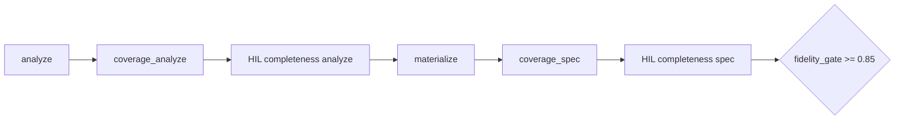

# PlanForge Fidelity POC — Evaluation

> **Date:** 2026-07-01 · **Fixture:** `story-plan-v1.md` · **Model:** `google/gemma-4-26b-a4b-qat` (LM Studio)

## Verdict

**PASS** — Phase A fidelity gate **1.0** (51/51 checks), S1–S8 PASS, 7/7 arc_2 events with VN titles and expanded synopses.

## Workflow



```bash
python scripts/plan-forge-poc/run_poc_fidelity.py --script fixtures/hil_fidelity_script.yaml
```

## Baselines

| Artifact | Fidelity score | Gate |
|----------|----------------|------|
| Rules propose (`propose.py`) | 0.86 | PASS (marginal) |
| LLM+HIL prior (`novel_system_spec.hil.json`) | ~0.4–0.6 (est.) | FAIL — thin traits/synopses |
| **Fidelity POC final** | **1.0** | **PASS** |

Rules baseline gaps (pre-HIL): `baseline_notes` short, mundane mentions missing, 3 event synopses &lt;80 chars.

## Live HIL rounds

| Round | Checkpoint | Accepted | Effect |
|-------|------------|----------|--------|
| analyze_1 | analyze | Yes | 5 traits VN + mundane anchors |
| analyze_2 | analyze | No | anchor jaccard 0.62 (rejected — no regression) |
| spec_1 | spec | Yes | `layers.characters` traits + baseline_notes |
| spec_2 | spec | Yes | mechanics rules §2–§3 |
| spec_3 | spec | Yes | 7 event synopses ≥80 chars |

**Artifacts:** `out/plan_analyze.json`, `out/novel_system_spec.fidelity.json`, `out/fidelity_report.md`, `out/fidelity_gate.json`, `out/fidelity_io/`

## Fidelity rubric

Source: [`fixtures/story-plan-v1.fidelity.yaml`](../../../scripts/plan-forge-poc/fixtures/story-plan-v1.fidelity.yaml)

- §1: 5 trait keywords VN, baseline_notes ≥200 chars, mundane mentions
- §2–§3: ≥3 mechanics, ≥2 rules each, THR/tiền kiếp secrets
- Arc 2: 7 VN titles, synopsis ≥80 chars, per-event keyword checks

## Gate

```json
{ "phase_a_pass": true, "fidelity_score": 1.0, "golden_pass": true }
```

## Next

Phase B elaboration: [`07_ELABORATION_POC_EVAL.md`](07_ELABORATION_POC_EVAL.md). Implement handoff: [`09_PLANFORGE_BLUEPRINT.md`](09_PLANFORGE_BLUEPRINT.md).
