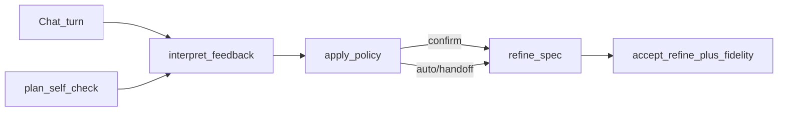

# PlanForge Chat HIL POC — Evaluation

> **Date:** 2026-07-01 · **Fixture:** `story-plan-v1.md` · **SSOT:** `novel_system_spec.fidelity.json`

## Verdict

**PASS** — vague user feedback interpreted correctly (I1–I4 @ 100%), confirm + auto-apply + handoff chain validated.

## Problem addressed

Users rarely give surgical `instruction` + `source_excerpt`. Typical inputs:

- *"mày sai chỗ Event 3 nè"*
- *"check lại phần nhân vật đi"*
- *"ừ làm đi, sửa hết gap còn lại"* (lazy handoff)

Chat session orchestrates; **planner owns SSOT** — no full 22k doc re-ingest per turn.

## Architecture



## Commands

```bash
# Prerequisite: fidelity spec from Phase A
python scripts/plan-forge-poc/run_poc_fidelity.py --script fixtures/hil_fidelity_script.yaml

# Chat HIL simulation (rules interpret — fast CI)
python scripts/plan-forge-poc/run_poc_chat_hil.py --rules-only

# Full path with LLM interpret
python scripts/plan-forge-poc/run_poc_chat_hil.py

# Interactive confirm cards
python scripts/plan-forge-poc/run_poc_chat_hil.py --interactive
```

## Live results (rules interpret + LLM refine)

| Turn | User message | Intent | Apply | I1–I4 |
|------|--------------|--------|-------|-------|
| 1 | mày sai chỗ Event 3 nè | complaint | auto | PASS |
| 2 | check lại phần nhân vật đi | recheck | confirm→apply | PASS |
| 3 | ừ làm đi, sửa hết gap còn lại | handoff | auto chain (≤3) | PASS |

**Final fidelity:** 0.9455 (gate ≥0.90) · **Golden S1–S8:** PASS

**Artifacts:** `out/novel_system_spec.chat_hil.json`, `out/chat_hil_report.md`, `out/chat_hil_transcript.json`, `out/chat_hil_io/`

## Metrics (I1–I4)

| ID | Meaning |
|----|---------|
| I1 | `focus_paths` match oracle (scope accuracy) |
| I2 | Diagnosis cites expected gap prefix |
| I3 | `accept_refine` accepted or clarify mode |
| I4 | Per-turn prompt budget (interpret slice + refine; handoff ≤55k) |

## Phase C polish (same run)

Extended rubric in `story-plan-v1.fidelity.yaml`:

- `baseline_notes_must_be_vn` (≥35% diacritics)
- `character_name_not_placeholder`
- `event_bullet_coverage` (Event 3 keywords)
- `mechanic_rules_vn_ratio` (≥50%)
- Gate raised to **≥0.90**

## Promote sketch (MCP)

| Tool | Role |
|------|------|
| `plan_self_check` | Gaps without user specifying fields |
| `plan_interpret_feedback` | Vague message → `FeedbackInterpretation` |
| `plan_apply_revision` | Confirm or auto refine |
| `plan_handoff_autofix` | Lazy handoff batch (max 3 rounds) |

Chat-service passes `run_id` + user message only — not full plan markdown.

## Known limits

- Refine prompt still sends **full spec JSON** (~15k chars/turn); partial artifact refine → `D-PF-PARTIAL-REFINE` in [`09_PLANFORGE_BLUEPRINT.md`](09_PLANFORGE_BLUEPRINT.md) §7.
- Handoff may not clear all polish gaps in 3 rounds if LLM refine returns marginal changes — human can re-send *"check lại"*.
- `fidelity_delta == 0` may still report success — `D-PF-APPLY-HONESTY` in blueprint §7.

**Artifacts:** `scripts/plan-forge-poc/out/novel_system_spec.chat_hil.json`, `chat_hil_metrics.json`, `chat_hil_transcript.json`

**Blueprint:** [`09_PLANFORGE_BLUEPRINT.md`](09_PLANFORGE_BLUEPRINT.md)
