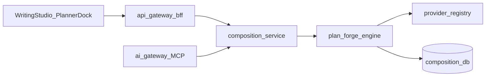

# PlanForge Blueprint — Implement Handoff

> **Date:** 2026-07-01 · **Status:** BLUEPRINT SHIPPED · **POC:** frozen at [`scripts/plan-forge-poc/`](../../../scripts/plan-forge-poc/)  
> **This document is the SSOT for the PlanForge implement session.** Do not fork schemas or re-derive architecture from chat context.

## Executive summary

PlanForge reads natural-language **planning documents** (not finished prose), proposes a typed `NovelSystemSpec`, validates invariants, compiles to LoreWeave artifacts, and supports human-in-the-loop (surgical + vague chat feedback).

| Question | Answer |
|----------|--------|
| POC sufficient for blueprint? | **Yes** — evidence chain 03–08 PASS/GO |
| What this session shipped? | **Blueprint docs** — not production code |
| Product ready for paid users? | **No** — tier A ~75% acceptable on one fixture; needs Studio dock + implement M1–M5 |
| When to implement? | **Separate session** — start at [§6 Implement milestones](#6-implement-milestones) |

**Paid positioning (tier A):** *“Đưa plan doc của bạn — chúng tôi biến thành system spec có validator, bạn duyệt vài cửa.”*  
**Not in scope:** *“Nói vài câu ý tưởng là có sách”* (tier C) — kể cả Opus 4.x cần bulk context; Sudowrite Import expects up to 120k words + validation step.

---

## 1. Acceptable bar (input tiers + convenience metrics)

### Input tiers — do not mix

| Tier | User input | Reasonable expectation | POC status |
|------|------------|------------------------|------------|
| **A — Structured plan** | Plan doc ≥5k chars with sections (e.g. `story-plan-v1.md` ~22k) | Paste 1× → propose → **1–3 checkpoints** → a few vague correction turns | **~75% acceptable** after fidelity + chat HIL |
| **B — Semi-structured braindump** | Loose notes, no TOC | Paste → **more checkpoints** → user adds structure | Analyze smoke OK; full spec path **not measured** |
| **C — Ideation only** | “Viết tiểu thuyết tu tiên…” | **Out of PlanForge scope** | — |

**Convenience** means **less effort than hand-structuring JSON/schema/invariants** — not zero context.

### Convenience metrics (product targets for tier A paid beta)

| Metric | Definition | Target | POC (fixture) |
|--------|------------|--------|---------------|
| **TTAS** | Wall-clock minutes from paste plan → user accepts spec for compile | ≤30–45 min incl. review | Not wall-clock measured; scripted HIL path ~achievable |
| **Manual-edit rate (invariants)** | % invariant fields correct without hand edit (vars, arc theme, events, S1–S8) | ≥90% | **~90%** |
| **Manual-edit rate (prose polish)** | % prose fields acceptable without edit (baseline_notes, names, mechanic rules language) | ≥70% | **~70–80%** |
| **Correction efficiency** | Vague turn (“sai Event 3”) → correct scope **and** fidelity delta > 0 | ≥60% turns | **Low** on handoff — orchestration OK, apply marginal |
| **Context per refine turn** | User pastes source once; refine uses slice only | Slice ≤~3k tokens | **Not met** — full spec JSON ~14–48k chars/turn |

### Known limits (carry into implement)

1. **Handoff honesty** — chat transcript may report “đã áp dụng” when `fidelity_delta == 0` ([`08_CHAT_HIL_POC_EVAL.md`](08_CHAT_HIL_POC_EVAL.md))
2. **Placeholder artifacts** — `Female Protagonist`, EN mechanic rules, `Untitled Project (TBD)` may persist when open questions say name TBD
3. **Model variance** — Gemma may drop Event 3 (Thử Nghiệm) on full 22k doc without HIL ([`04_PO_REVIEW.md`](04_PO_REVIEW.md))
4. **Single fixture** — generalization to braindump / EN / multi-file unproven

---

## 2. Architecture

Full spec: [`01_PLANFORGE_ARCHITECTURE.md`](01_PLANFORGE_ARCHITECTURE.md) · Market gap: [`00_MARKET_AND_GAP.md`](00_MARKET_AND_GAP.md)

```mermaid
flowchart TB
  subgraph ingest [Phase0_Ingest]
    md[NL_plan_markdown] --> doc[PlanDocument]
  end
  subgraph propose [Phase1_Propose]
    doc --> analyze[PlanAnalyze]
    analyze --> spec[NovelSystemSpec]
  end
  subgraph hil [HIL]
    vague[Chat_vague_message] --> interpret[interpret_feedback]
    interpret --> policy[apply_policy]
    policy --> refine[refine_spec]
    refine --> accept[accept_refine_plus_fidelity]
    selfcheck[plan_self_check] --> interpret
  end
  subgraph downstream [Phase2_to_7]
    spec --> graph[PlanGraph]
    graph --> compile[CompileTargets]
    compile --> pkg[PlanningPackage]
    pkg --> pipeline[planning_pipeline]
    spec --> validate[Golden_linter_S1_S8]
  end
  hil --> spec
```

### Anti-noise rules (chat orchestration — POC validated)

- **SSOT** = persisted `NovelSystemSpec` (`run_id` / DB row) — no re-ingest of 22k markdown each turn
- **Chat history** not injected into refine prompts — only `user_message` + diagnosis + surgical excerpt + ~200 char summary
- **`plan_self_check`** supplies gaps for *"check lại"* without user pointing fields
- **`spec_index`** + section excerpts bound interpret working set (partial refine **deferred** — see §7)

### Workflow phases

| Phase | Engine | Checkpoint |
|-------|--------|------------|
| 0 Ingest | Rules parser | — |
| 1 Propose | Rules + LLM analyze→materialize | Blocking: approve spec |
| 2 Decompose | Graph builder | Blocking: per-layer |
| 3 Link | Traceability | Blocking: missing links |
| 4 PlanParts | Package compiler + pipeline | Blocking per arc |
| 5 Integrate | Cross-arc threading | Advisory |
| 6 Validate | Golden linter + fidelity rubric | Fail → loop |
| 7 Commit | Glossary + outline persist | Blocking |

---

## 3. Contracts (frozen — import, do not fork)

Path: [`contracts/plan-forge/`](../../../contracts/plan-forge/)

| Schema | File | Role |
|--------|------|------|
| `PlanDocument` | `plan_document.schema.json` | Parsed source + section spans |
| `PlanAnalyze` | `plan_analyze.schema.json` | LLM step-1 analyze artifact |
| `NovelSystemSpec` | `novel_system_spec.schema.json` | Primary system design (v1.1) |
| `PlannerState` | `planner_state.schema.json` | PA/HA/CD/THR runtime |
| `PlanningPackage` | `planning_package.schema.json` | Arc input for composition pipeline |
| `PlanRevisionRequest` | `plan_revision.schema.json` | Surgical HIL edit |
| `FeedbackInterpretation` | `feedback_interpretation.schema.json` | Vague message → scoped revision |

Golden expectations: [`scripts/plan-forge-poc/fixtures/story-plan-v1.expectations.yaml`](../../../scripts/plan-forge-poc/fixtures/story-plan-v1.expectations.yaml)  
Fidelity rubric: [`scripts/plan-forge-poc/fixtures/story-plan-v1.fidelity.yaml`](../../../scripts/plan-forge-poc/fixtures/story-plan-v1.fidelity.yaml)

---

## 4. POC evidence index

| Doc | Phase | Verdict |
|-----|-------|---------|
| [`02_POC_RESULTS.md`](02_POC_RESULTS.md) | Rules path S1–S8 | PASS |
| [`03_LLM_POC_EVAL.md`](03_LLM_POC_EVAL.md) | LLM analyze→materialize | PASS |
| [`04_PO_REVIEW.md`](04_PO_REVIEW.md) | Semantic rubric + stability | **GO** (avg 4.67) |
| [`05_HIL_POC_EVAL.md`](05_HIL_POC_EVAL.md) | Scripted surgical HIL | PASS |
| [`06_FIDELITY_POC_EVAL.md`](06_FIDELITY_POC_EVAL.md) | Fidelity gate | **1.0** |
| [`07_ELABORATION_POC_EVAL.md`](07_ELABORATION_POC_EVAL.md) | Elaboration | **1.0** |
| [`08_CHAT_HIL_POC_EVAL.md`](08_CHAT_HIL_POC_EVAL.md) | Fuzzy chat HIL | I1–I4 100%, fidelity 0.9455 |

### POC artifact paths (regression reference)

| Artifact | Path |
|----------|------|
| Fidelity spec (SSOT for chat HIL) | `scripts/plan-forge-poc/out/novel_system_spec.fidelity.json` |
| Chat HIL output | `scripts/plan-forge-poc/out/novel_system_spec.chat_hil.json` |
| Fidelity gate | `scripts/plan-forge-poc/out/fidelity_gate.json` |
| Chat metrics | `scripts/plan-forge-poc/out/chat_hil_metrics.json` |
| Transcript | `scripts/plan-forge-poc/out/chat_hil_transcript.json` |
| Compile bridge | `scripts/plan-forge-poc/out/compile/planning_package.json` |

### POC engine modules → implement owner

| POC module (`plan_forge/`) | Implement milestone | Notes |
|----------------------------|---------------------|-------|
| `ingest`, `propose`, `propose_llm`, `links`, `json_extract` | M1 | Rules + normalize |
| `refine`, `prompts`, `elaborate` | M1–M2 | LLM via provider-registry in M2 |
| `decompose`, `compile`, `validate`, `compare`, `coverage` | M1 | Port unit tests |
| `eval_fidelity`, `consistency_audit` | M1 | Fidelity gate in service |
| `spec_index`, `interpret`, `self_check`, `apply_policy` | M4 | MCP + chat orchestration |
| `eval_chat_hil` | Stay in scripts | Harness only |
| `llm_client.py` (direct LM Studio) | **Replace M2** | BYOK `model_ref` only |
| `run_poc*.py` | **Stay in scripts/** | Regression harness — do not delete until M2 green |

---

## 5. MCP tools (implement M4)

Federated via ai-gateway; owned by composition-service. Chat passes **`run_id` + user_message** — not full plan markdown.

| Tool | Input | Output | Phase |
|------|-------|--------|-------|
| `plan_propose_spec` | `book_id`, `run_id`, source or `mode` | `PlanAnalyze` / `NovelSystemSpec` | 1 |
| `plan_review_checkpoint` | `run_id`, `checkpoint_id`, `approved` | status + artifact | 1–3 |
| `plan_self_check` | `run_id` | ranked gaps + fidelity score | HIL |
| `plan_interpret_feedback` | `run_id`, `user_message`, `apply_mode_hint?` | `FeedbackInterpretation` | HIL |
| `plan_apply_revision` | `run_id`, `draft_revision` | updated spec + validation | HIL |
| `plan_handoff_autofix` | `run_id`, `max_rounds=3` | batch apply top gaps | HIL |
| `plan_compile` | `run_id`, `arc_id` | `PlanningPackage` | 4 |
| `plan_validate` | `run_id` | S1–S8 + fidelity report | 6 |

Pattern reference: glossary assistant (`glossary_plan`) — chat orchestrates, domain service owns SSOT.

---

## 6. Implement milestones

Detail: [`docs/plans/2026-07-01-plan-forge-promote.md`](../../plans/2026-07-01-plan-forge-promote.md)



### M1 — Engine port (rules + normalize)

- Copy modules to `services/composition-service/app/engine/plan_forge/`
- Import schemas from `contracts/plan-forge/` — no fork
- Port `test_plan_forge.py` → `services/composition-service/tests/unit/test_plan_forge.py`
- **Acceptance:** pytest green; rules path S1–S8 on fixture

### M2 — Provider-registry LLM

- Resolve chat model via `user_model_id` / BYOK internal route
- No `PLANFORGE_LM_*` in production — `model_ref` on API
- IO audit: `plan_runs.llm_io` JSONB or MinIO `plan-runs/{id}/`
- **Acceptance:** same golden as POC; `ai-provider-gate.py` clean

### M3 — HTTP API + persistence

| Endpoint | Purpose |
|----------|---------|
| `POST /v1/books/{book_id}/plan/runs` | Start ingest→propose (`mode=rules\|llm`) |
| `GET /v1/books/{book_id}/plan/runs/{run_id}` | Status + artifacts |
| `PATCH .../novel-system-spec` | Checkpoint edit-merge |
| `POST .../validate` | Golden + fidelity linter |
| `POST .../compile` | Arc package → `planning_pipeline` |

**DB (composition):** `plan_runs`, `plan_artifacts` — tenancy: `owner_user_id` + `book_id` + E0 grants on every query.

### M4 — MCP federation

Wire tools in §5; include fuzzy HIL tools from POC `interpret` / `apply_policy` / `self_check`.

### M5 — Writing Studio planner dock (FE)

- Upload/paste plan → propose → diff review
- Checkpoint cards (confirm/auto from `apply_policy`)
- Wire Manuscript — plan events → outline nodes (Writing Studio debt #1)

**Estimated size:** L (7–12 logic changes, DB migration, MCP contracts).

### Iterate during implement (from POC eval)

1. Materialize prompt: explicit **7-event checklist** for arc_2 (Thử Nghiệm dropout)
2. Canonical event IDs — `arc_2_event_N` or title-slug map
3. Anchor language policy — VN vs EN explicit in prompts
4. Citation spans on analyze (future)

### Risk controls

| Risk | Control |
|------|---------|
| Direct provider SDK | provider-registry only |
| Tenancy leak | `book_id` + grant on all `plan_runs` |
| LLM non-determinism | normalize + validate before compile |
| Agent bypass HTTP | MCP-first for agentic propose |

---

## 7. Deferred engineering (implement session — not blueprint blockers)

| ID | Item | Gate | Target |
|----|------|------|--------|
| `D-PF-APPLY-HONESTY` | Fail or escalate when `fidelity_delta==0`; no false “đã áp dụng” | Fix-now quality | M4 / Studio |
| `D-PF-NORMALIZE` | Post-normalize placeholder name → `Nữ chính`; VN mechanics rules | Polish deterministic | M1 |
| `D-PF-PARTIAL-REFINE` | Refine sends `focus_paths` slice only | BYOK cost | M2 |
| `D-PF-CONVENIENCE-EVAL` | TTAS wall-clock + Opus vs local same context budget | Product metric | Post-M5 |
| `D-PF-MULTI-DOC` | 3 doc profiles (VN structured, EN structured, braindump) | Generalization | Post-M5 |
| `D-PF-MULTI-FILE` | Multi-file braindump ingest | Large/structural | Future |
| `D-PF-AUTO-GLOSSARY` | Auto-promote glossary/wiki without checkpoint | Conscious won't-fix v1 | Future |

---

## 8. Verification (keep POC harness until M2 green)

```bash
# Unit (no live LLM)
pytest scripts/plan-forge-poc/test_plan_forge.py -q -m "not live"

# Fidelity + HIL regression
python scripts/plan-forge-poc/run_poc_fidelity.py --script fixtures/hil_fidelity_script.yaml
python scripts/plan-forge-poc/run_poc_chat_hil.py --rules-only

# Post M1 (service)
pytest services/composition-service/tests/unit/test_plan_forge.py -q

# Post M2 live smoke
# gateway → composition → provider-registry → BYOK chat model
```

---

## 9. Implement session checklist

**Read first:** this file → [`01_PLANFORGE_ARCHITECTURE.md`](01_PLANFORGE_ARCHITECTURE.md) → [`2026-07-01-plan-forge-promote.md`](../../plans/2026-07-01-plan-forge-promote.md)

- [ ] M1: port engine + tests; S1–S8 green on fixture
- [ ] M2: provider-registry LLM; retire `PLANFORGE_LM_*`; live smoke
- [ ] M3: `plan_runs` migration + HTTP API + tenancy
- [ ] M4: MCP tools §5 + fuzzy HIL
- [ ] M5: Studio planner dock (separate Writing Studio track)
- [ ] Close `D-PF-NORMALIZE` + `D-PF-APPLY-HONESTY` before paid beta messaging
- [ ] Keep `scripts/plan-forge-poc/` regression until M2 acceptance

---

## References

- Planning pipeline: [`2026-06-30-planning-pipeline-architecture.md`](../2026-06-30-planning-pipeline-architecture.md)
- Composition plan router: [`services/composition-service/app/routers/plan.py`](../../../services/composition-service/app/routers/plan.py)
- POC README: [`scripts/plan-forge-poc/README.md`](../../../scripts/plan-forge-poc/README.md)
