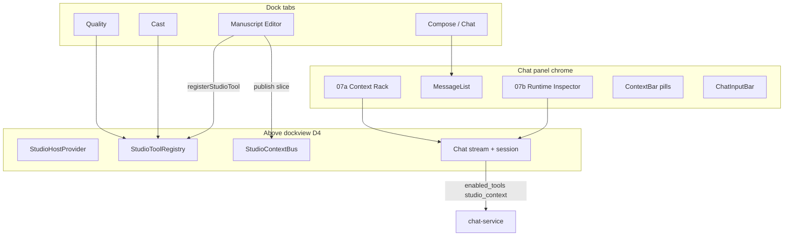

# 07 · Studio Agent Chat Upgrade

> Component of [Writing Studio (v2)](00_OVERVIEW.md). Status: 📐 specced 2026-07-01 (design only).
> Draft: [`design-drafts/screens/studio/screen-studio-agent-chat.html`](../../../design-drafts/screens/studio/screen-studio-agent-chat.html).
> State: **Tier 4** compose hoist + **D11 agent FSM** (instance of D20) — [`08_studio_state_architecture.md`](08_studio_state_architecture.md).
> Agent→GUI: [`09_agent_gui_reconciliation.md`](09_agent_gui_reconciliation.md) (3-lane model).
> Epic alignment: [`04-ai-chat-core.md`](../../2026-06-30-editor-compose-overhaul/stories/04-ai-chat-core.md) (tool curation + skills BE).

## What it is

The **control surface** for the studio's AI chat — like Copilot / Claude Code inside VS Code.
Reuses [`features/chat/Chat.tsx`](../../../frontend/src/features/chat/Chat.tsx) but adds:

1. **[#07c](07c_studio_tool_registry.md)** — incremental tool registration + inter-panel MCP bus.
2. **[#07a](07a_agent_context_rack.md)** — user pins skills + MCP tools (above input).
3. **[#07b](07b_agent_runtime_inspector.md)** — lazy-load state machine visibility (below header).

Embedded in **#03 Compose** dock panel; live chat state hoisted **above dockview** (D4 / Tier 4)
so float/split/close never drops an in-flight turn. **Streaming text** uses a volatile
subscription separate from stable `StudioHostContext` (D21).

**Not in scope (this plan):** React/BE implementation.

## PO intent

The agentic infra (MCP + `find_tools` lazy-load) already exists. This upgrade adds what users
lack today: **see and control** which skills/tools are in context, **watch** the agent discover
tools mid-turn, and **wire** dock panels together via a studio-local bus (not only `editorBridge`).

## Architecture



### Embed pattern (#03)

- `StudioHostProvider` wraps `StudioFrame` (sibling to dockview, not inside a panel).
- `StudioEffectReconcilerProvider` watches tool results ([#09](09_agent_gui_reconciliation.md) Lane B).
- Compose dock panel renders `<Chat bookId={…} studioMode surface="studio" windowingEnabled />`.
- `useStudioUiToolExecutor()` mounted in studio Chat ([#09](09_agent_gui_reconciliation.md) Lane A).
- `editorContext` derived from `Bus.getSlice().activeChapterId` when editor panel is registered.
- `composeMode` remains an orthogonal prose-only axis; **not** the default in studio v1.

### Request extensions (build phase — BE in story 04)

`POST /v1/chat/sessions/{id}/messages` body additions:

```json
{
  "studio_context": {
    "book_id": "uuid",
    "active_panel_ids": ["compose", "editor"],
    "context_revision": 42
  },
  "enabled_tools": ["book_get_chapter", "composition_list_outline"],
  "enabled_skills": ["glossary", "universal"],
  "consumer_capabilities": {
    "frontend_tools": ["ui_navigate", "ui_open_studio_panel", "ui_focus_manuscript_unit", "propose_edit", "confirm_action"],
    "reconciliation": "v1"
  }
}
```

- `enabled_tools` / `enabled_skills` empty → today's auto-discovery fallback (D12).
- `studio_context` lets BE pick studio hot-set seeds without guessing from URL alone.

### SSE extensions (build phase)

New AG-UI CUSTOM event `agentSurface` (design contract):

```json
{
  "phase": "Discovering",
  "pinned_count": 3,
  "hot_seed_count": 8,
  "activated_count": 12,
  "injected_skills": ["glossary"],
  "last_find_tools_query": "outline chapter"
}
```

Feeds [#07b](07b_agent_runtime_inspector.md). Emitted on phase transitions during a turn.

## Sub-components

| # | Spec | Role |
|---|---|---|
| 07c | [`07c_studio_tool_registry.md`](07c_studio_tool_registry.md) | `registerStudioTool`, `StudioContextBus`, 06b palette source |
| 07a | [`07a_agent_context_rack.md`](07a_agent_context_rack.md) | Pin/unpin UI above input |
| 07b | [`07b_agent_runtime_inspector.md`](07b_agent_runtime_inspector.md) | State machine strip below header |

## Relationship to existing chat

| Existing | Studio upgrade |
|---|---|
| [`ContextBar`](../../../frontend/src/features/chat/context/ContextBar.tsx) — book/chapter/glossary pills | Unchanged — turn **attachments** |
| [`ToolCallIndicator`](../../../frontend/src/features/chat/components/ToolCallIndicator.tsx) — per-message chips | Unchanged — **history** of what ran |
| [`SessionSettingsPanel`](../../../frontend/src/features/chat/components/SessionSettingsPanel.tsx) | Unchanged — model/advanced settings home |
| [`editorBridge`](../../../frontend/src/features/chat/context/editorBridge.ts) | Superseded for studio by Bus + reconciler ([#09](09_agent_gui_reconciliation.md)); legacy editor keeps bridge |
| `disable_tools` / `composeMode` | Still supported; rack hidden when prose-only |

## Dependencies

| Dep | Why |
|---|---|
| [#09](09_agent_gui_reconciliation.md) | `useStudioUiToolExecutor`, `StudioEffectReconciler`, `consumer_capabilities` |
| #03 Compose panel | Host shell for upgraded chat |
| #07c registry | Rack browser + palette panel list |
| #06b Command Palette | `listRegisteredStudioTools()` for Open Panel commands |
| Story 04 BE | `enabled_tools`, `enabled_skills`, `agentSurface` event, discovery filter |
| D4 state hoist | `StudioHostProvider` above dockview |

## Done-criteria (build phase — not this design track)

1. Compose dock tab renders chat with Inspector + Rack; ContextBar still works.
2. Registering Cast/Quality panels adds them to ⌘⇧P and rack browser.
3. Pinning a tool PATCHes session; next turn sends `enabled_tools`; BE advertises subset.
4. Inspector shows phase transitions during a live turn with tool counts.
5. `ui_open_studio_panel` navigates within studio via registry.
6. Unit tests: registry lifecycle, bus pub/sub, rack pin limits, inspector phase reducer.
7. E2E: pin tool → send message → inspector shows Curated; mock `agentSurface` → Discovering.
8. tsc + eslint clean; `/review-impl` pass.

## Out of scope

- User-defined custom skills (story 04 step 2).
- Replacing ai-gateway MCP federation.
- Mobile studio chat layout.
