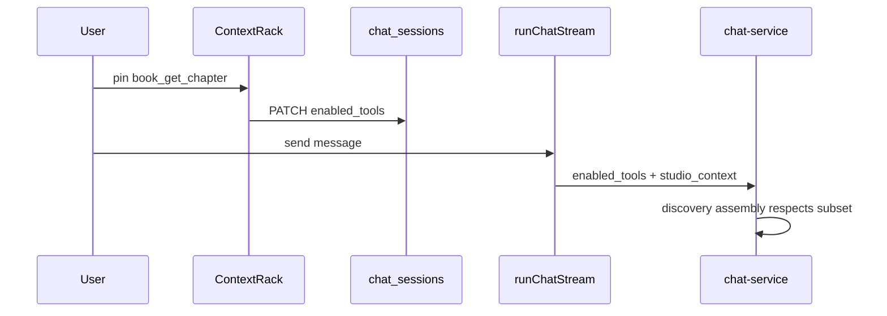

# 07a · Agent Context Rack

> Component of [Writing Studio (v2)](00_OVERVIEW.md) · parent [`07_studio_agent_chat.md`](07_studio_agent_chat.md).
> Status: 📐 specced 2026-07-01 (design only).
> Draft: [`screen-studio-agent-chat.html`](../../../design-drafts/screens/studio/screen-studio-agent-chat.html) (rack region).

## What it is

A **horizontal chip rack** placed **directly above** [`ChatInputBar`](../../../frontend/src/features/chat/components/ChatInputBar.tsx).
Users **pin and unpin** skills and MCP tools that shape the agent's capability for this chat session.

Distinct from:
- [`ContextBar`](../../../frontend/src/features/chat/context/ContextBar.tsx) — manuscript **attachments** (book/chapter/glossary pills for the current turn).
- [#07b](07b_agent_runtime_inspector.md) — **read-only** runtime / lazy-load visibility.

**Not in scope (this plan):** React implementation.

## Locked decisions

| # | Decision |
|---|---|
| A1 | Placement: **above input**, below message list / `footerSlot` |
| A2 | Pin limits: **8 MCP tools** + **4 skills** per session (soft cap — warn, don't block) |
| A3 | v1 skills: **System skills only** (selectable) — `glossary`, `universal`, `knowledge` per story 04 C6-D2 rec |
| A4 | Persist pins on `chat_sessions.enabled_tools` / `enabled_skills` (PATCH on change) |
| A5 | Empty pins ⇒ auto-discovery fallback (D12) — rack shows placeholder *"Auto tools"* chip |
| A6 | Hidden when `composeMode` / `disable_tools` — prose-only turns hide the rack |

## Chip types

| Kind | Icon | Colour | Example |
|---|---|---|---|
| `skill` | sparkles | accent | `Glossary skill` |
| `mcp_tool` | wrench | muted + tier dot | `book_get_chapter` · R |
| `panel` | layout | primary-muted | `Cast` (links to registered panel's default tool set) |

- Tier dot on MCP chips: R green · A blue · W amber · S red (from catalog metadata).
- Click `×` on chip → unpin → PATCH session.
- Click panel chip (optional v1) → open that dock panel via registry.

## Add browser modal

`+ Add` opens searchable modal (same overlay pattern as [#06a](06a_quick_open.md)):

| Group | Source |
|---|---|
| **Skills** | System skill catalog (story 04) |
| **MCP tools** | Federated catalog (domain grouped: book / composition / glossary / …) |
| **Studio panels** | [`listRegisteredStudioTools()`](07c_studio_tool_registry.md) — pinning a panel adds its `mcpTools` or prefix-expanded defaults |

- Fuzzy filter on name + description + synonyms.
- Disabled rows: already pinned, or tool tier S (credential) not allowed in rack v1.
- Multi-select + **Add** commits pins in one PATCH.

## Layout

```
┌─ Chat header ─────────────────────────────────────┐
├─ 07b Runtime Inspector (collapsible) ─────────────┤
├─ messages …                                       │
├─ footerSlot (Insert bar — optional)               │
├─ Context pills (ContextBar — if any) ─────────────┤  ← turn attachments
├─ [✦ Glossary] [⚙ book_get_chapter] [+ Add] ─────┤  ← 07a RACK
├─ ChatInputBar ────────────────────────────────────┤
└───────────────────────────────────────────────────┘
```

When no pins and auto-discovery: single muted chip `Auto tools · discovery on`.

## Data flow



## Dependencies

| Dep | Why |
|---|---|
| [#07c](07c_studio_tool_registry.md) | Panel group in add browser |
| Story 04 BE | `enabled_tools` / `enabled_skills` columns + discovery filter |
| #03 Compose | Host that mounts rack in studio chat |

## Done-criteria (build phase)

1. Rack renders above input in studio Compose panel only (feature flag or `studioMode` prop).
2. Pin/unpin PATCHes session; reload restores chips.
3. Add browser lists registry panels + MCP catalog groups.
4. Limits enforced with toast warning at 8+4.
5. Unit tests: pin state, limit guard, composeMode hides rack.
6. E2E: pin tool → send → request body includes `enabled_tools` (network assert or mock).

## Out of scope

- `@tool` inline mentions in input (story 04 C6-D1 open).
- Per-user default pin presets.
- Drag-reorder chips (v2).
