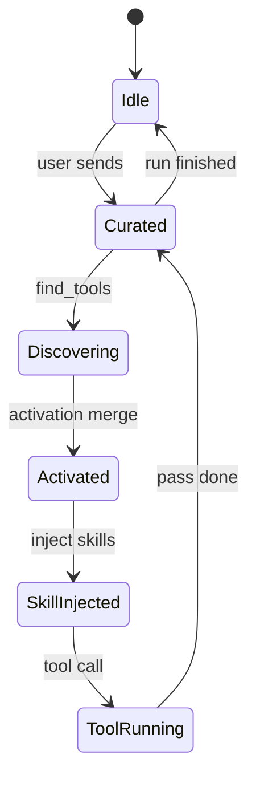

# 07b · Agent Runtime Inspector

> Component of [Writing Studio (v2)](00_OVERVIEW.md) · parent [`07_studio_agent_chat.md`](07_studio_agent_chat.md).
> Status: 📐 specced 2026-07-01 (design only).
> Draft: [`screen-studio-agent-chat.html`](../../../design-drafts/screens/studio/screen-studio-agent-chat.html) (inspector region).

## What it is

A **collapsible strip** directly **below** [`ChatHeader`](../../../frontend/src/features/chat/components/ChatHeader.tsx) showing the
agent's **tool surface state machine** during a chat session — how many tools/skills are hot,
pinned, discovered, and running. Answers: *"What can the agent see right now?"* and *"What did
lazy-load just add?"*

Read-only for v1 — users control pins in [#07a](07a_agent_context_rack.md), not here.

**Not in scope (this plan):** React implementation.

## Locked decisions

| # | Decision |
|---|---|
| B1 | Default **collapsed** in Idle — one-line summary: `8 hot · 3 pinned · ready` |
| B2 | **Auto-expands** on turn start; collapses back to summary on Idle (user can pin expanded) |
| B3 | Phases match D11 state machine exactly |
| B4 | Data from CUSTOM SSE `agentSurface` events (primary) + local pin counts from session (secondary) |
| B5 | Studio-only chrome — not shown on standalone `/chat` page until story 04 ships globally |

## State machine phases

| Phase | UI label | Meaning |
|---|---|---|
| `Idle` | Ready | No turn in flight; show last-known counts |
| `Curated` | Curating | BE assembling advertised tool set for this pass |
| `Discovering` | Discovering… | Agent called `find_tools` |
| `Activated` | Activated +N | `find_tools` merged names into session `activated_tools` |
| `SkillInjected` | Skills | System skill prompts injected |
| `ToolRunning` | Running `tool_name` | Tool call in flight |



## Collapsed view (summary bar)

```
┌─ Agent surface ──────────────────── [▼] ─┐
│ ● Curating  ·  3 pinned  ·  8 hot  ·  12 active      │
└──────────────────────────────────────────┘
```

- Leading dot colour by phase (idle=muted, discovering=info pulse, running=primary).
- Click chevron toggles expanded; preference `lw_studio_inspector_expanded` per-device OK.

## Expanded view

Three columns (stack on narrow panel width):

| Section | Content |
|---|---|
| **Pinned** | Chips from session `enabled_tools` / `enabled_skills` (read-only mirror of rack) |
| **Hot seed** | Surface defaults (studio/editor hot set) — grey chips |
| **Activated** | Tools in session `activated_tools` (find_tools escape persist on `chat_sessions`) — green `+` badge for newly added this turn. *Internal chat-service path; mcp-public-gateway uses its own Redis activation store for the public MCP edge.* |
| **Injected skills** | `glossary`, `universal`, … — read-only |

Footer row (optional v1):
- Last `find_tools` query string (truncated).
- `find_tools ×2` if multiple discovery calls this turn.

### Tier badges in expanded tool list

Each tool row: `book_get_chapter` · **R** · book domain

## SSE contract (`agentSurface`)

Documented in [`07_studio_agent_chat.md`](07_studio_agent_chat.md). FE reducer:

```ts
type AgentSurfaceState = {
  phase: 'Idle' | 'Curated' | 'Discovering' | 'Activated' | 'SkillInjected' | 'ToolRunning';
  pinnedTools: string[];
  pinnedSkills: string[];
  hotSeedTools: string[];
  activatedTools: string[];
  injectedSkills: string[];
  runningTool?: string;
  lastFindToolsQuery?: string;
  findToolsCallCount: number;
};
```

Until BE ships event: inspector shows **pinned + hot seed only** from session/registry (degraded mode).

**Shipped 2026-07-01:** `agentSurface` CUSTOM SSE + global `/chat` inspector (degraded fallback from session pins).

## Relationship to ToolCallIndicator

| Component | When | What |
|---|---|---|
| **Runtime Inspector** | Live + between turns | Advertised / discoverable surface |
| **ToolCallIndicator** | After assistant message | Tools actually invoked that turn |

## Dependencies

| Dep | Why |
|---|---|
| Story 04 BE | `agentSurface` CUSTOM SSE |
| #07a | Pinned counts source |
| #07c | Hot seed from active registered panels |
| #03 Compose | Mount point |

## Done-criteria (build phase)

1. Strip renders below header; collapsed/expanded toggle persists.
2. Phase transitions animate on mock/live `agentSurface` stream.
3. Expanded lists match event payload tool names.
4. Degraded mode works without SSE (pins + registry only).
5. Unit tests: reducer transitions, collapsed summary text.
6. E2E: send message → inspector leaves Idle → returns Idle on RUN_FINISHED.

## Out of scope

- Editing pins from inspector (use rack).
- Per-tool latency profiling.
- Admin-mode tool surface (separate surface).
