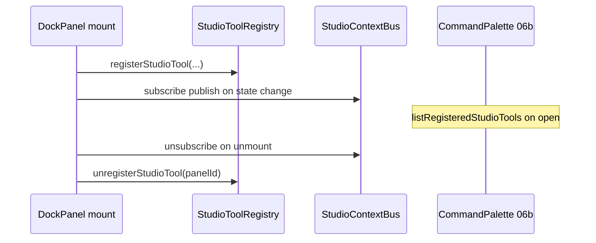

# 07c · Studio Tool Registry + MCP Bus

> Component of [Writing Studio (v2)](00_OVERVIEW.md) · parent [`07_studio_agent_chat.md`](07_studio_agent_chat.md).
> Architecture parent: [`08_studio_state_architecture.md`](08_studio_state_architecture.md) (Tier 3 host).
> Status: 📐 specced 2026-07-01 (design only).

## What it is

The **incremental registration layer** for Writing Studio dock tools — every panel that ports from
the legacy co-writer studio calls `registerStudioTool()` on mount and `unregisterStudioTool()`
on unmount. Unregistered tools do not appear in:

- [#06b](06b_command_palette.md) Command Palette **Panels** group
- [#07a](07a_agent_context_rack.md) **Studio panels** section of the add browser

Plus **`StudioContextBus`** — a FE pub/sub bus so panels exchange context (active chapter,
selection, quality issue) without prop-drilling through dockview.

**Not in scope:** ai-gateway MCP servers (unchanged). This is the **studio host** analogue to
VS Code's extension host.

## Locked decisions

| # | Decision |
|---|---|
| R1 | Registry is **in-memory per studio session** (per `bookId` mount); remount on book switch |
| R2 | `panelId` must match dockview component id / [`WorkspacePanelId`](../../../frontend/src/features/composition/workspace/types.ts) where applicable |
| R3 | Palette command label comes from registration — not hardcoded in 06b |
| R4 | Bus slices are **read-only snapshots**; panels publish, never mutate another panel's state |
| R5 | Chat is always registered implicitly as `compose` panel — even if chat UI is the only open tab |

## Registration contract

```ts
// features/studio/registry/types.ts — design contract, implement later

type StudioContextSlice = {
  activeChapterId?: string;
  activeSceneId?: string;
  selectionRange?: { from: number; to: number };
  qualityIssueRef?: { promiseId: string; chapterId?: string };
  // extensible — new keys additive only
};

type StudioToolRegistration = {
  panelId: string;                    // dock tab component id
  label: string;                      // human name
  paletteCommand: string;             // "Studio: Open Cast"
  commandId: string;                  // studio.openPanel.cast
  mcpToolPrefixes?: string[];         // e.g. ['composition_']
  mcpTools?: string[];                  // explicit allowlist (overrides prefix expansion)
  frontendTools?: string[];           // ui_* advertised when this panel is active
  skills?: string[];                  // skill ids "owned" by this surface
  contributeContext?: () => StudioContextSlice | null;
};

// API
registerStudioTool(reg: StudioToolRegistration): void;
unregisterStudioTool(panelId: string): void;
listRegisteredStudioTools(): StudioToolRegistration[];
getRegisteredTool(panelId: string): StudioToolRegistration | null;
```

### Lifecycle



- Panel **must** unregister on unmount — closed dock tabs leave the registry (user re-opens → re-register).
- Optional: keep registration while tab exists but hidden (dockview panel hidden ≠ unmounted) — match dockview lifecycle in implementation.

## StudioContextBus

```ts
type StudioBusEvent =
  | { type: 'chapter'; chapterId: string; bookId: string }
  | { type: 'scene'; sceneId: string; chapterId: string }
  | { type: 'selection'; range: { from: number; to: number }; chapterId: string }
  | { type: 'qualityIssue'; promiseId: string; chapterId?: string }
  | { type: 'panels'; activePanelIds: string[] };

type StudioBusSnapshot = {
  revision: number;
  bookId: string;
  activeChapterId?: string;
  activeSceneId?: string;
  selectionRange?: { from: number; to: number };
  qualityIssueRef?: { promiseId: string; chapterId?: string };
  activePanelIds: string[];
};

// API
publish(event: StudioBusEvent): void;
getSnapshot(): StudioBusSnapshot;
subscribe(listener: (snap: StudioBusSnapshot) => void): () => void;
```

- `revision` increments on every publish → chat includes `context_revision` in `studio_context`.
- `StudioHostProvider` owns bus + registry + [`StudioSessionOrchestrator`](08_studio_state_architecture.md); exposes via `useStudioHost()`.

## Integration with #06b Command Palette

Replace static `WorkspacePanelId` table in [`06b_command_palette.md`](06b_command_palette.md):

| Before (design) | After |
|---|---|
| Hardcoded panel open commands | `listRegisteredStudioTools().map(t => ({ id: t.commandId, label: t.paletteCommand }))` |
| C6 build trigger ≥3 panels | ≥3 **registered** panels (Compose + Editor + one tool) |

Chrome-only `View:*` commands remain static in 06b.

## Frontend MCP tools (studio route)

Lane A only ([#09](09_agent_gui_reconciliation.md)) — IDs/routes, no draft payloads. Extend
[`uiNav.ts`](../../../frontend/src/features/chat/nav/uiNav.ts) → [`studioUiNav.ts`](09_agent_gui_reconciliation.md) for `/books/:bookId/studio`:

| Tool | Effect |
|---|---|
| `ui_open_studio_panel` | `panelId` → registry lookup → `dockviewApi.addPanel` or focus |
| `ui_focus_manuscript_unit` | `chapterId` / `sceneId` → bus publish + manuscript navigator scroll (debt #1) |
| `ui_navigate` | extend to accept `studio` surface |

Executed via [`useStudioUiToolExecutor`](09_agent_gui_reconciliation.md) (wraps legacy
[`useUiToolExecutor`](../../../frontend/src/features/chat/hooks/useUiToolExecutor.ts)).

**MCP mutating tools** (`mcpToolPrefixes` on registration) do **not** update GUI directly —
[`StudioEffectReconciler`](09_agent_gui_reconciliation.md) reloads hoists after tool success.

## Example registrations (design-time)

| panelId | label | paletteCommand | mcpToolPrefixes | skills |
|---|---|---|---|---|
| `compose` | Compose | Studio: Open Compose | `composition_` | `universal` |
| `editor` | Manuscript Editor | Studio: Open Editor | `book_` | — |
| `raw` | Raw Editor | Studio: Open Raw | `book_`, `composition_` | — |
| `cast` | Cast | Studio: Open Cast | `composition_` | `glossary` |
| `quality` | Quality | Studio: Open Quality | `composition_` | — |
| `planner` | Planner | Studio: Open Planner | `composition_` | — |

MCP prefix expansion resolves against federated catalog at rack-browser time (not at register time).

## Dependencies

| Dep | Why |
|---|---|
| [`09_agent_gui_reconciliation.md`](09_agent_gui_reconciliation.md) | Lane A ui tools + Lane B effect handlers per `mcpToolPrefixes` |
| [`08_studio_state_architecture.md`](08_studio_state_architecture.md) | Tier 3 host contract, panel checklist |
| #03 Compose shell | First consumer of `StudioHostProvider` |
| [`04b_raw_editor.md`](04b_raw_editor.md) | `raw` panel registration + bus `activeChapterId` |
| dockview `apiRef` | Panel open from palette + ui tools |
| Story 04 | `enabled_tools` filter respects registered tool allowlists |

## Done-criteria (build phase)

1. Mounting a panel registers; unmounting removes from palette list.
2. Bus snapshot updates when editor changes chapter; chat receives `studio_context`.
3. `ui_open_studio_panel` opens registered panel only — unknown id returns error to agent.
4. Unit tests: register/unregister idempotency, bus revision, snapshot merge rules.

## Out of scope

- Persisting registry across reload (derived from open dock layout + component mount).
- Cross-book bus (one bus per `bookId` studio instance).
