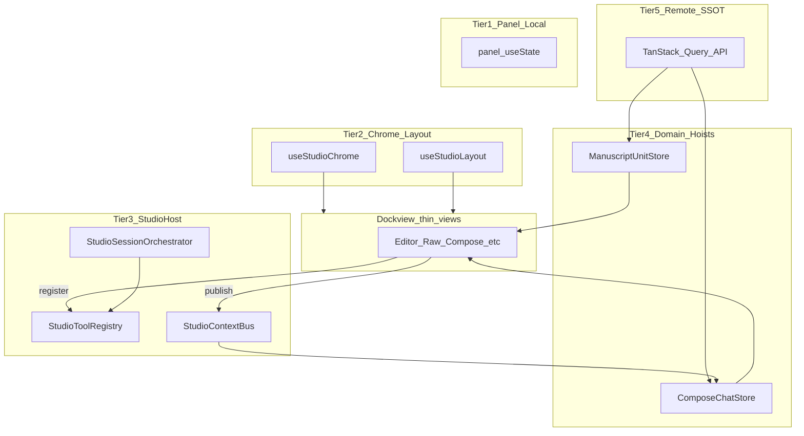
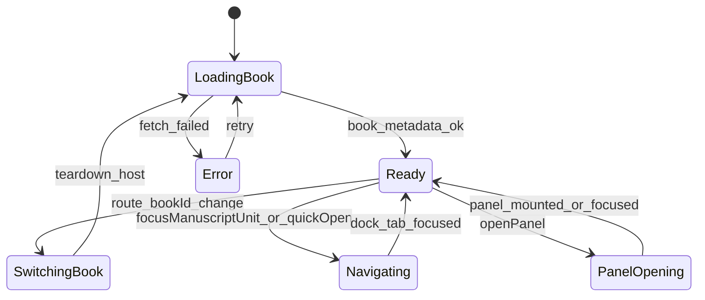

# 08 · Studio State Architecture

> Component of [Writing Studio (v2)](00_OVERVIEW.md). Status: 📐 specced 2026-07-01 (design only).
> Parent of [#07c](07c_studio_tool_registry.md) (registry + bus implementation detail).
> Draft: [`screen-studio-state-host.html`](../../../design-drafts/screens/studio/screen-studio-state-host.html).

## What it is

The **cross-panel state contract** for Writing Studio — how 25+ dock tools share data,
update the GUI in realtime, and stay maintainable as the surface grows. Not one god-store
and not one mega state machine: a **5-tier model** with clear ownership, inspired by VS Code
workbench services + extension host.

**Not in scope (this plan):** React implementation of `StudioHostProvider` (build with #03).

## Problem

Without a shared architecture, each new dock panel invents its own pattern:

- Prop-drill through `StudioDock`
- Duplicate draft copies (Rich vs Raw)
- Re-render the whole frame on every Tiptap keystroke
- Bus subscribers that mutate another panel's hoist

This spec is the **standard** every panel author follows (D22 checklist).

## Industry alignment

| Source | Pattern | LoreWeave mapping |
|--------|---------|-------------------|
| [VS Code workbench services](https://github.com/microsoft/vscode/wiki/Source-Code-Organization) (`IEditorService`, …) | Singleton DI + events (`onDidActiveEditorChange`) | `StudioHostProvider` + `StudioContextBus` |
| [VS Code webviews](https://code.visualstudio.com/api/extension-guides/webview) | Extension host holds SSOT; panels isolated → message bus only | Bus payloads JSON-serializable; no direct cross-panel reads |
| [Visual Studio extensibility DI](https://learn.microsoft.com/en-us/visualstudio/extensibility/visualstudio.extensibility/inside-the-sdk/dependency-injection) | Shared singleton services; **state scoped to document/view lifetime** | Domain hoists keyed by `chapterId` / `sessionId`; dispose on unit close |
| Modern React IDE practice | Multi-store (Zustand) + pub/sub for signals | Tier 4 hoists + Tier 3 bus; TanStack Query for server cache |

D11 agent FSM ([#07b](07b_agent_runtime_inspector.md)) is **one instance** of Tier-3 orchestration — not the whole studio.

## Locked decisions

| # | Decision |
|---|---|
| S1 | **5-tier model** — local → chrome/layout → host → domain hoists → remote SSOT (D18) |
| S2 | **Bus = read-only snapshots**; domain mutation only through hoist owner actions (D19) |
| S3 | **FSM only for orchestration domains** — session boot, save conflict, agent surface (D20) |
| S4 | **Selector-based subscriptions** — volatile (SSE, streaming) split from stable host context (D21) |
| S5 | **Panel author checklist** mandatory before merging a new dock tool (D22) |
| S6 | `StudioHostProvider` wraps `StudioFrame` content (above dockview, per `bookId` mount) |
| S7 | Closing a dock tab does **not** destroy a dirty domain hoist — prompt save-or-discard first |

## Build status (2026-07-01 — palette foundation)

The **Tier-3 host primitives shipped** (`frontend/src/features/studio/host/StudioHostProvider.tsx`),
matching the `StudioHostValue` contract below:

- ✅ Registry — `registerStudioTool` / `unregisterStudioTool` / `getRegisteredTool` /
  `listRegisteredStudioTools`; reactive `useRegisteredTools()`; `useRegisterStudioTool(reg)` lifecycle.
- ✅ Bus — `publish` / `getSnapshot` / `subscribe(listener, selector?)`; reactive `useStudioBus()`
  (whole snapshot) **and** `useStudioBusSelector(sel)` (S4/D21 slice subscription — re-renders only
  on the selected slice). Both are external stores read via `useSyncExternalStore`, not context state.
- ✅ Dock actions on the host — `openPanel(panelId, {focus?})` (focus-if-open else add; dormant
  until a built panel component exists) + `focusManuscriptUnit(chapterId)` (v1: publishes the
  `chapter` bus event; editor-dock open lands with #04). The dock api is mirrored onto the host via
  `_dockApiRef` (StudioDock populates it on `onReady`).
- ⏳ **Deferred** (still per this spec): `StudioSessionOrchestrator` FSM, `StudioEffectReconciler`
  (Lane B — [#09](09_agent_gui_reconciliation.md)), Tier-4 domain hoists (`ManuscriptUnitProvider`
  #04 / `ComposeChatProvider` #07), `contributeContext()` pull-slice wiring — all land with #03/#04/#07/#09.

## Five-tier model



### Tier 1 — Panel-local

**What:** Scroll position, toolbar expanded, inspector collapsed, code-editor gutter prefs.

**How:** `useState` inside the panel's hook. **Never** on the bus.

**Owner:** The panel hook only.

### Tier 2 — Chrome + layout

**What:** Activity view, sidebar/bottom collapse, dockview `toJSON` layout.

**How:** [`useStudioChrome`](../../../frontend/src/features/studio/hooks/useStudioChrome.ts),
[`useStudioLayout`](../../../frontend/src/features/studio/hooks/useStudioLayout.ts).

**Persist:** `lw_studio_chrome_<bookId>`, `lw_studio_layout_<bookId>` (per-device localStorage).

**Why separate keys:** Corrupt chrome state must not brick the dock (and vice versa).

Spec: [#01](01_skeleton.md).

### Tier 3 — Studio Host

**What:** Cross-panel registration, read-only context snapshots, session-level orchestration,
**agent effect reconciliation** ([#09](09_agent_gui_reconciliation.md) Lane B).

**How:** `StudioHostProvider` (one instance per `bookId` studio mount).

| Module | Role | Update pattern |
|--------|------|----------------|
| `StudioToolRegistry` | Panel `registerStudioTool` on mount | Palette/rack list rebuild |
| `StudioContextBus` | Merged read-only `StudioBusSnapshot` + `revision` | `subscribe(selector)` |
| `StudioSessionOrchestrator` | FSM for boot / navigate / panel-open flows | State transition events |
| `StudioEffectReconciler` | MCP tool success → reload hoists / invalidate queries | Per `effectRegistry` handlers |

Detail: [#07c](07c_studio_tool_registry.md).

**Hard rules:**
- Panels **publish** to the bus; they do **not** subscribe to the bus and then mutate another panel's hoist.
- Bus events and snapshots must be **JSON-serializable** (VS Code `postMessage` constraint).
- `revision` increments on every publish → chat sends `context_revision` in `studio_context`.

### Tier 4 — Domain hoists (D4)

**What:** In-flight editable state that must survive dock tab close/move/float.

**How:** One owner store/hook per domain, **above dockview**, keyed by resource:

| Domain | Key | Owner | Spec |
|--------|-----|-------|------|
| Manuscript unit | `(bookId, chapterId)` | `ManuscriptUnitProvider` | [#04](04_manuscript_editor.md) |
| Compose chat | `(bookId, sessionId)` | `ComposeChatProvider` | [#07](07_studio_agent_chat.md) |
| Quality scope (future) | `(bookId, promiseId)` | TBD | — |

Dock panels are **thin views** — they read/write via the domain hook, not local draft copies.

**Volatile split (D21):** SSE streaming text and per-chunk chat updates live in a **separate**
subscription (e.g. `useChatStream`) — not in the same React context as `bookId`, registry,
or stable bus snapshot. Consumers that need live text subscribe narrowly.

**Tech (build-time choice):** Zustand or `useSyncExternalStore` + selectors for hoists;
TanStack Query for server fetch/cache (Tier 5).

### Tier 5 — Remote SSOT

**What:** Postgres-backed truth — chapter drafts, outline nodes, chat messages.

**How:** API + TanStack Query. Hoist = working copy with `dirty` flag.

**Save path:** Optimistic PATCH; 409 → conflict FSM → reload hoist.

Server is always authoritative on conflict.

## StudioHostProvider API (design contract)

```ts
// features/studio/host/types.ts — implement with #03

type StudioHostValue = {
  bookId: string;

  // Registry (07c)
  registerStudioTool: (reg: StudioToolRegistration) => void;
  unregisterStudioTool: (panelId: string) => void;
  listRegisteredStudioTools: () => StudioToolRegistration[];

  // Bus (07c)
  publish: (event: StudioBusEvent) => void;
  getSnapshot: () => StudioBusSnapshot;
  subscribe: (
    listener: (snap: StudioBusSnapshot) => void,
    selector?: (snap: StudioBusSnapshot) => unknown,
  ) => () => void;

  // Orchestrator
  orchestrator: StudioSessionOrchestrator;

  // Dock actions (delegates to useStudioLayout apiRef)
  openPanel: (panelId: string, opts?: { focus?: boolean }) => void;
  focusManuscriptUnit: (chapterId: string, panelId?: 'editor' | 'raw') => void;
};

// Stable context — changes rarely
const StudioHostContext = createContext<StudioHostValue | null>(null);
export function useStudioHost(): StudioHostValue;
```

**Mount tree (target):**

```
StudioPage key={bookId}
  StudioHostProvider
    StudioFrame
      chrome (Tier 2)
      ManuscriptUnitProvider   // Tier 4 — when #04 lands
      ComposeChatProvider      // Tier 4 — when #03 lands
      StudioDock               // Tier 2 layout + thin panels
```

`StudioFrame` today uses `key={bookId}` on the page so Tier 2 re-inits on book switch;
`StudioHostProvider` must remount the same way.

## StudioSessionOrchestrator FSM

Session-level flows only — not keystroke-level editing.



| State | Meaning |
|-------|---------|
| `LoadingBook` | Fetch book title/lang; init chrome + layout |
| `Ready` | Host accepting panel register + bus publish |
| `SwitchingBook` | Flush dirty hoists (prompt) → dispose host |
| `Navigating` | Tree scroll + dock open in flight (Debt #1) |
| `PanelOpening` | `dockviewApi.addPanel` / focus |
| `Error` | Book load failed — frame shows error chrome |

**Library:** XState v5 when implementing orchestrator + agent surface + save FSM together;
simple hoists stay Zustand/actions without XState.

## Domain FSM instances (D20)

### Manuscript unit save

```
Clean → Dirty → Saving → Saved
                    └→ Conflict → Reloading → Clean
```

Owned by `useManuscriptUnit.save()`. Raw parse invalid blocks `Saving` ([#04b](04b_raw_editor.md)).

### Agent tool surface (D11)

Owned by compose chat reducer — see [#07b](07b_agent_runtime_inspector.md). Not duplicated here.

## Realtime GUI — three update channels

1. **Selector subscription** — `useManuscriptUnit(s => s.body)` or `host.subscribe(fn, s => s.activeChapterId)`.
2. **Domain events** — debounced Raw buffer refresh when Rich updates body ([#04b](04b_raw_editor.md)).
3. **Server push** — SSE for chat/agent only; manuscript uses optimistic PATCH + 409 reload.
   Optional: `hook_audit` / `hook_progress` SSE from lifecycle hooks ([#10](10_agent_lifecycle_hooks.md))
   — informational only; does not mutate hoists or bus (H5).

## Anti-patterns (do not ship)

| Anti-pattern | Fix |
|--------------|-----|
| God `StudioContext` with draft + chat + tree | Split tiers; one owner per domain |
| Prop-drill through `StudioDock` | `useStudioHost()` / domain hooks |
| `useEffect` reacting to user clicks | Call handler at click site (CLAUDE.md) |
| Two draft copies (Rich + Raw) | Single `useManuscriptUnit` hoist |
| Bus subscriber mutates foreign hoist | Publish intent; owner mutates |
| Streaming text in stable context | Separate volatile subscription |
| State on registry singleton | State on domain hoist with scoped key |

## Panel author checklist (D22)

Before merging a new dock panel:

1. **Tier assignment** — document which tier(s) the panel uses (usually 1 + 3 + maybe 4).
2. **`registerStudioTool`** — `panelId`, palette command, MCP prefixes ([#07c](07c_studio_tool_registry.md)).
3. **Hoist owner?** — if the panel edits in-flight data, add/extend a Tier-4 provider — do not stash in panel state.
4. **Bus slice** — implement `contributeContext()`; publish on focus/selection change only.
5. **No foreign mutation** — never import another panel's store and call `setState`.
6. **Selectors** — panel re-renders only on slices it displays.
7. **Lifecycle** — `unregisterStudioTool` on unmount; unsubscribe bus.
8. **Dirty close** — if Tier-4 hoist is dirty, tab close prompts save (dockview close handler).
9. **Tests** — unit: register, publish, selector; no snapshot of whole host.
10. **Spec row** — add component to [`00_OVERVIEW.md`](00_OVERVIEW.md) index when built.

## Folder conventions (build phase)

```
frontend/src/features/studio/
  host/           # StudioHostProvider, bus, registry, orchestrator
  manuscript/     # navigator, useManuscriptUnit (Tier 4)
  compose/        # chat hoist wrapper for studio (Tier 4)
  hooks/          # Tier 2: useStudioChrome, useStudioLayout
  components/     # Tier 1 views + frame chrome
```

## Migration: editorBridge → bus + reconciler

Legacy [`editorBridge`](../../../frontend/src/features/chat/context/editorBridge.ts) still
powers co-writer write-back. Studio path:

1. Editor panel publishes `activeChapterId` + `selectionRange` to bus.
2. Compose derives `editorContext` from `getSnapshot()` instead of bridge when `studioMode`.
3. **`propose_edit` Apply** uses `manuscript.applyProposedEdit` ([#09](09_agent_gui_reconciliation.md) Lane C) — not bridge.
4. MCP writes refresh GUI via `StudioEffectReconciler` ([#09](09_agent_gui_reconciliation.md) Lane B).
5. Bridge remains for `ChapterEditorPage` until studio parity — do not delete in this track.

## Dependencies

| Dep | Why |
|---|---|
| [#01](01_skeleton.md) | Tier 2 chrome/layout |
| [#09](09_agent_gui_reconciliation.md) | Agent→GUI three-lane model; EffectReconciler in Tier 3 |
| [#10](10_agent_lifecycle_hooks.md) | Server-side hooks; must not mutate Tier 3 bus or Tier 4 hoists via output |
| [#07c](07c_studio_tool_registry.md) | Registry + bus detail |
| [#04](04_manuscript_editor.md) | First Tier-4 hoist example |
| [#07](07_studio_agent_chat.md) | Compose Tier-4 + agent FSM instance |
| Debt #5 | Host build deferred until #03 Compose shell |

## Done-criteria (build phase)

1. `StudioHostProvider` mounts with `StudioFrame`; `useStudioHost()` available in dock panels.
2. Two panels register; palette lists both; unregister removes.
3. Editor publish `chapter` event → bus `revision` increments → compose reads `activeChapterId`.
4. `ManuscriptUnitProvider` survives dock tab close (dirty prompt).
5. Selector subscription: Tiptap keystroke does not re-render compose panel.
6. Orchestrator `LoadingBook → Ready` on studio open; `SwitchingBook` on `bookId` route change.
7. Unit tests: bus merge rules, registry idempotency, orchestrator transitions, checklist fixtures.
8. E2E: open editor + compose split → change chapter in editor → compose context updates.
9. tsc + eslint clean; `/review-impl` pass.

## Out of scope

- Server-synced layout (D6 stays localStorage).
- Cross-tab BroadcastChannel (single tab v1).
- XState for navigator tree paging.
- Replacing TanStack Query with custom cache.
