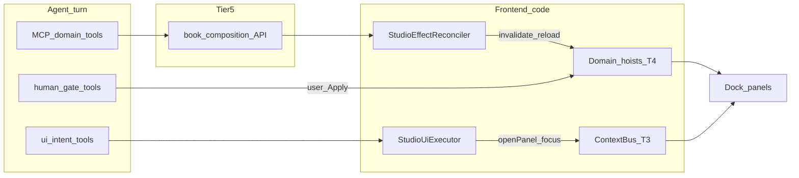
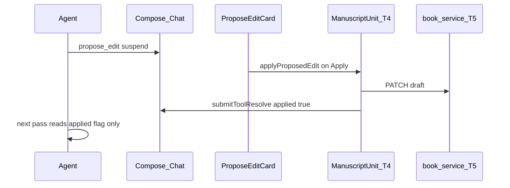

# 09 · Agent GUI Reconciliation

> Component of [Writing Studio (v2)](00_OVERVIEW.md). Status: 📐 specced 2026-07-01 (design only).
> Builds on [#08](08_studio_state_architecture.md) (5-tier state) · [#07](07_studio_agent_chat.md) (chat chrome).
> Draft: [`screen-studio-agent-gui-bridge.html`](../../../design-drafts/screens/studio/screen-studio-agent-gui-bridge.html).

## What it is

The **standard for how the AI agent affects the Writing Studio GUI** — without the agent
pushing React state directly. Three lanes:

| Lane | Mechanism | Data in tool args? |
|------|-----------|-------------------|
| **A — Intent** | `ui_*` frontend tools → `useStudioUiToolExecutor` | IDs / routes only |
| **B — Domain** | MCP backend tools → **`StudioEffectReconciler`** → reload SSOT | Server writes; FE reloads |
| **C — Human-gate** | `propose_edit` / `confirm_action` → user Apply → hoist actions | Diff / confirm_token only |

**PO rule (D23–D25):** GUI data changes come from **code** (reconcile, reload, hoist actions),
not from the LLM calling a tool with a draft JSON blob to patch the UI. Saves tokens and
keeps Tier-5 Postgres as truth.

**Not in scope (this plan):** React implementation — build with #03 Compose + #07c + #04a.

## Problem

| Exists today | Gap |
|--------------|-----|
| [`useUiToolExecutor`](../../../frontend/src/features/chat/hooks/useUiToolExecutor.ts) — legacy `ui_navigate` / `ui_open_chapter` | No studio tools (`ui_open_studio_panel`, `ui_focus_manuscript_unit`) |
| [`propose_edit`](../../../frontend/src/features/chat/components/ProposeEditCard.tsx) + [`editorBridge`](../../../frontend/src/features/chat/context/editorBridge.ts) | Studio should use `useManuscriptUnit`, not bridge singleton |
| MCP `book_*` / `composition_*` writes | No FE reconciler — editor does not refresh after agent save |
| [#07c](07c_studio_tool_registry.md) bus + registry | No contract for “after tool X, code does Y” |

## Locked decisions

| # | Decision |
|---|---|
| G1 | **Three-lane model** — intent / MCP reconcile / human-gate (D23) |
| G2 | **No data-bearing frontend tools** — never advertise `ui_set_*`, `ui_update_*`, or tools that accept Tiptap/prose blobs to patch GUI (D24) |
| G3 | **`StudioEffectReconciler`** is the sole path from MCP tool success → GUI data refresh (D25) |
| G4 | **Human-gate Apply** calls domain hoist actions; studio deprecates direct `editorBridge` write path (D26) |
| G5 | Reconciler handlers **reload** from API — never `setBody(toolResult.content)` |
| G6 | `consumer_capabilities` on chat request formalizes H12 — agent only offers executable frontend tools |

**Hook ordering ([#10](10_agent_lifecycle_hooks.md)):** User lifecycle hooks run in
chat-service around the tool loop. On MCP success, **`StudioEffectReconciler` always runs
before** user `postToolUse` hooks (H1). Hooks cannot bypass Tier-W/S human-gate (H3) or patch
GUI via hook output (H2). Lane C `postToolUse` fires after user Apply + reconciler — not at
suspend.

## Three-lane architecture



---

## Lane A — Intent / layout (`ui_*`)

Navigation and panel focus only. Suspend → resolve immediately (same as C-NAV) — **no**
human Apply gate.

### Studio frontend tools

| Tool | Executor behaviour | Args (IDs only) |
|------|-------------------|-----------------|
| `ui_navigate` | `react-router` navigate (allowlisted paths) | `path` |
| `ui_open_studio_panel` | `host.openPanel(panelId)` via registry | `panel_id` |
| `ui_focus_manuscript_unit` | `host.focusManuscriptUnit(chapterId)` + orchestrator + tree scroll | `chapter_id`, optional `scene_id`, `panel_id` |
| `ui_watch_job` | jobs route (unchanged) | `job_id` |

Legacy tools (`ui_open_book`, `ui_open_chapter`, `ui_show_panel`) remain on editor/book
surfaces; **studio surface** prefers `ui_focus_manuscript_unit` over `ui_open_chapter`.

### Implementation contract

```ts
// features/studio/agent/studioUiNav.ts — design contract
export const STUDIO_UI_TOOLS = [
  'ui_navigate',
  'ui_open_studio_panel',
  'ui_focus_manuscript_unit',
  'ui_watch_job',
] as const;

export function resolveStudioUiTool(
  tool: string,
  args: Record<string, unknown>,
  host: StudioHostValue,
): { result: Record<string, unknown>; sideEffect?: () => void };
```

```ts
// features/studio/agent/useStudioUiToolExecutor.ts
// Mount in Chat when studioMode. Extends useUiToolExecutor:
// - delegates legacy ui_* to uiNav.ts
// - handles STUDIO_UI_TOOLS via host + orchestrator
// - idempotent by toolCallId (same pattern as useUiToolExecutor)
```

**Forbidden in Lane A:** `body`, `content`, `draft`, `doc`, `synopsis` in tool args for
state sync.

---

## Lane B — Domain writes (MCP → Reconciliation)

### Flow

1. Agent calls MCP tool (e.g. `book_save_chapter_draft`, `composition_outline_node_update`).
2. chat-service executes via ai-gateway; **RESULT** appears on `ToolCallRecord` (`ok: true`).
3. `StudioEffectReconciler` matches tool name → registered handler (code, not LLM).
4. Handler: invalidate TanStack Query keys, `manuscript.reload(chapterId)`, `host.publish(…)`.
5. Dock panels re-render from Tier-4 hoist — **not** from tool result body pasted into state.

### Effect registry

```ts
// features/studio/agent/effectRegistry.ts — design contract

type EffectContext = {
  tool: string;
  result: unknown;
  bookId: string;
  host: StudioHostValue;
  manuscript: ManuscriptUnitApi;
  queryClient: QueryClient;
};

type EffectHandler = (ctx: EffectContext) => void | Promise<void>;

export function registerEffectHandler(
  pattern: string | RegExp,  // e.g. /^book_.*draft/ or 'composition_patch_node'
  handler: EffectHandler,
): void;

export function runEffectHandlers(ctx: EffectContext): Promise<void>;
```

### DIRTY-HOIST GUARD (G7 — design hole to close before Lane B build)

A blind `manuscript.reload(chapterId)` on an agent MCP-save will **clobber the user's unsaved
edits** if the active Tier-4 hoist is `dirty` (user typing while the agent writes the same chapter).
S7 only covers *tab-close* dirty; the 409 FSM only covers the *user's own* save. Reconcile-vs-dirty
is unspecified. **Rule:** a reconciler handler that reloads a hoist MUST check `hoist.dirty` first —
if dirty, do **not** blind-reload; instead surface a conflict (prompt reload-or-keep / merge, same
family as the save-conflict FSM), or no-op + toast "agent changed this chapter — reload?". The
reconciler owns the *signal*; the hoist owns the *dirty decision*. Never lose a keystroke to an
agent write.

### v1 handler table

| Pattern | Reconcile action |
|---------|------------------|
| `book_*` draft save / chapter meta update | If `chapterId` matches active unit **and hoist is clean** → `manuscript.reload()`; **dirty** → conflict prompt (G7); always invalidate `['chapter', bookId, chapterId]`; `bus.publish({ type: 'chapter', … })` |
| `book_chapter_create` | Invalidate chapter list; optional toast |
| `composition_*` outline node patch | Reload `scenes[]` slice in active manuscript unit; invalidate outline query |
| `composition_*` prose write (proxied draft) | Same as book draft save handler |
| `translation_*` job start | Toast with `job_id`; agent may separately call `ui_watch_job` |

Handlers extract **IDs + version** from structured MCP results — not full prose bodies.

### Reconciler provider

```ts
// features/studio/agent/StudioEffectReconcilerProvider.tsx
// Watches:
//   - completed tool calls in messages (historical turns)
//   - live stream toolCalls from ChatStreamContext (in-flight turn)
// Dedupes by toolCallId (handledRef pattern from useUiToolExecutor)
// Runs handlers only when ok === true && !pending
```

Mount **inside** `StudioHostProvider`, sibling to compose/manuscript providers ([#08](08_studio_state_architecture.md)).

### Forbidden tools (never advertise)

- `ui_set_*`, `ui_update_*`, `frontend_patch_draft`
- Any frontend tool accepting Tiptap JSON / prose to apply directly to GUI

---

## Lane C — Human-gate

| Tool | User action | Studio Apply path (code) |
|------|-------------|--------------------------|
| `propose_edit` | Apply / Dismiss | `manuscript.applyProposedEdit(diff)` → hoist dirty → save FSM; legacy: `editorBridge` |
| `confirm_action` | Confirm / Cancel | POST confirm endpoint → on success **reconciler** runs matching handler |
| `glossary_confirm_action` | Confirm | Legacy glossary path → reconciler on success |

Agent resumes with `{ applied: true }` or `{ dismissed: true }` — **not** with applied content.
GUI already updated by hoist/reconciler before resume.

### Studio `propose_edit` path



---

## Chat component standard

### Mount tree (studio)

```
StudioPage key={bookId}
  StudioHostProvider                    // Tier 3
    StudioEffectReconcilerProvider      // Lane B watcher
    ManuscriptUnitProvider              // Tier 4 (#04)
    ComposeChatProvider                 // Tier 4 (#07)
      Chat studioMode surface="studio"
        useStudioUiToolExecutor()       // Lane A
        ChatView + 07a rack + 07b inspector
```

### Chat props

| Prop | Meaning |
|------|---------|
| `studioMode` | Enable studio ui tools + reconciler + `studio_context` on send |
| `surface` | `'studio' \| 'editor' \| 'chat'` — tool curation + effect handler subset |
| `windowingEnabled` | SharedWorker hub (existing) |
| `bookId` | Required in studio |

### Request body extensions

```json
{
  "studio_context": {
    "book_id": "uuid",
    "active_panel_ids": ["compose", "editor"],
    "context_revision": 42
  },
  "enabled_tools": ["book_get_chapter", "composition_list_outline"],
  "enabled_skills": ["glossary", "universal"],
  "consumer_capabilities": {
    "frontend_tools": [
      "ui_navigate",
      "ui_open_studio_panel",
      "ui_focus_manuscript_unit",
      "ui_watch_job",
      "propose_edit",
      "confirm_action"
    ],
    "reconciliation": "v1"
  }
}
```

chat-service uses `consumer_capabilities.frontend_tools` to filter advertised suspend tools (H12,
[mcp-fanout](../../2026-06-20-mcp-fanout-agent-universal-control.md)). `reconciliation: "v1"`
signals FE will run effect handlers (informational for logging).

### Volatile vs stable (D21)

| Data | Channel |
|------|---------|
| SSE text, streaming tool chips | `ChatStreamContext` / worker hub |
| `studio_context`, rack pins | Session PATCH + stable host |
| GUI draft body | Tier-4 hoist only — never from tool args in stream |

---

## Anti-patterns

| Do not | Do instead |
|--------|------------|
| Agent sends full chapter JSON in `ui_*` tool | MCP save + reconciler `reload()` |
| Reconciler `setBody(result.content)` | `manuscript.reload(chapterId)` from API |
| Ad-hoc `useEffect` on messages mutating hoist | Register handler in `effectRegistry` |
| Studio `propose_edit` Apply via `editorBridge` | `manuscript.applyProposedEdit` |
| New `ui_update_manuscript` tool | Extend reconciler handler table |

---

## Panel / domain author checklist (extends D22)

When adding a dock panel whose MCP tools mutate data the GUI displays:

1. Register panel in [#07c](07c_studio_tool_registry.md).
2. Add **effect handlers** for each mutating MCP tool prefix the panel cares about.
3. Publish bus slice on focus — Lane A only for navigation.
4. Unit test: mock tool RESULT → handler calls `reload` / invalidate (no `setState` from result body).

---

## Folder conventions (build phase)

```
frontend/src/features/studio/agent/
  studioUiNav.ts
  useStudioUiToolExecutor.ts
  effectRegistry.ts
  StudioEffectReconcilerProvider.tsx
  handlers/
    bookEffects.ts
    compositionEffects.ts
```

Shared chat components stay in `features/chat/` — studio wraps, does not fork `Chat.tsx`.

---

## Dependencies

| Dep | Why |
|---|---|
| [#08](08_studio_state_architecture.md) | Tier 3 host + Tier 4 hoists |
| [#07](07_studio_agent_chat.md) | Compose mount point |
| [#07c](07c_studio_tool_registry.md) | `openPanel`, registry |
| [#04](04_manuscript_editor.md) | `applyProposedEdit`, `reload` |
| [story 04](../../2026-06-30-editor-compose-overhaul/stories/04-ai-chat-core.md) | `enabled_tools`, `consumer_capabilities` BE |
| [#10](10_agent_lifecycle_hooks.md) | User hooks run after reconciler; SSE `hook_audit` / `hook_progress` |
| Debt #5 | Build deferred until #03 Compose shell |

## Done-criteria (build phase)

1. `studioMode` Chat mounts `useStudioUiToolExecutor` + reconciler provider.
2. Agent calls `ui_focus_manuscript_unit` → editor dock opens/focuses; bus `revision` increments.
3. Agent MCP-saves draft → reconciler reloads active manuscript unit; Rich editor shows new text.
4. `propose_edit` Apply in studio uses `applyProposedEdit` — not `editorBridge`.
5. `confirm_action` success triggers reconciler for affected resource.
6. No handler calls `setBody` from tool result payload.
7. Unit tests: studio ui resolve, effect registry match/dedupe, propose_edit studio path.
8. E2E: agent saves chapter via MCP → split editor panel updates without manual refresh.
9. tsc + eslint clean; `/review-impl` pass.

## Out of scope

- Server-side `confirm_action` for headless agents (public MCP track).
- Auto-navigate on every MCP write (agent chooses `ui_*` separately).
- Replacing all legacy `ui_open_chapter` routes in non-studio surfaces.
