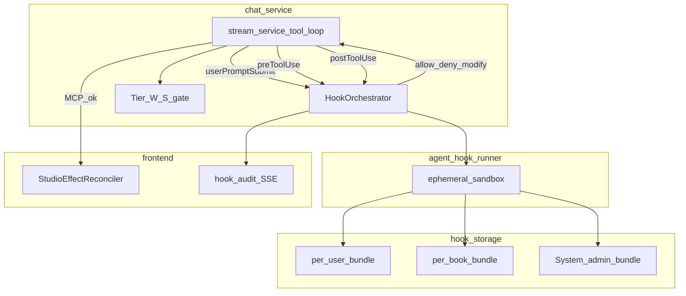

# 10 · Agent Lifecycle Hooks

> Component of [Writing Studio (v2)](00_OVERVIEW.md). Status: 📐 specced 2026-07-01 (design only).
> Builds on [#09](09_agent_gui_reconciliation.md) (GUI reconciliation) · [#08](08_studio_state_architecture.md) (host tiers).
> Draft: [`screen-studio-agent-hooks.html`](../../../design-drafts/screens/studio/screen-studio-agent-hooks.html).

## What it is

**User- and book-scoped lifecycle automation** for the chat agent — shell scripts (and later
HTTP / prompt hooks) that run at deterministic events (`preToolUse`, `postToolUse`, …) in a
**server-side sandbox**, not on the user's PC.

Analogues: [VS Code agent hooks](https://code.visualstudio.com/docs/agent-customization/hooks),
[GitHub Copilot cloud agent hooks](https://docs.github.com/en/copilot/reference/hooks-configuration),
[Cursor hooks](https://cursor.com/docs/hooks), [Kiro hooks](https://kiro.dev/docs/hooks/).

**PO rule (D27–D30):** Hooks extend the agent loop; they **do not** replace platform code.
[`StudioEffectReconciler`](09_agent_gui_reconciliation.md) (D25) remains the sole GUI data
refresh path. User hooks may audit, gate, inject **LLM context**, or call webhooks — never patch
React state with prose blobs.

**Not in scope (this plan):** `agent-hook-runner` service implementation — build P0→P2 after
#09 reconciler + story 04 BE.

## Problem

| Exists today | Gap |
|--------------|-----|
| Tier R/A/W/S + `confirm_action` in chat-service | No user-defined pre/post automation |
| `StudioEffectReconciler` (#09) — platform PostToolUse | No team policy scripts (notify, block, audit) |
| Skills rack (#07a) — capability curation | Skills ≠ procedural hooks on events |
| Dev-only [`workflow-gate.py`](../../../scripts/workflow-gate.py) | Not a product feature |

Power users want Kiro/Copilot-style hooks (“after draft save → webhook”, “block purge tools”)
without forking LoreWeave. Cloud SaaS requires **sandboxed** execution — unlike IDE hooks that
run with local OS permissions.

## Locked decisions

| # | Decision |
|---|---|
| L1 | **Hook bus in chat-service** — `HookOrchestrator` emits events; invokes `agent-hook-runner` for user scripts (D27) |
| L2 | **Manifest** `.loreweave/hooks.json` + scripts — stored per-user and/or per-book (MinIO + Postgres) (D28) |
| L3 | **Cursor v1 protocol** — JSON stdin/stdout; accept **PascalCase aliases** (`PreToolUse` = `preToolUse`) for migration from `.github/hooks` |
| L4 | **Merge order** — System admin → per-user → per-book; all matching hooks run; **most restrictive wins** (`deny` > `ask` > `allow`) (D29) |
| L5 | **Sandbox only** — no user shell in chat-service process or browser; gVisor/Firecracker ephemeral container per invocation (D30) |
| L6 | **H1–H5** boundary with #09 — reconciler always runs; hooks cannot bypass Tier-W/S or GUI patch |
| L7 | **`beforeMCPExecution`** — v1 alias firing only for MCP domain tools (before `mcp_execute_tool`) |
| L8 | **Exit codes** — `0` = read stdout JSON; `2` = block (≈ deny); other = fail-open unless `failClosed: true` |
| L9 | **Anti self-modify** — sandbox mounts bundle **read-only**; agent MCP tools cannot write hook bundles except dedicated Settings API |

## Architecture



### Execution ordering (load-bearing)

For each tool call in a turn:

1. **Platform tier check** (R/A/W/S) — not overridable by hooks (H3).
2. **`beforeMCPExecution`** hooks (MCP only) + **`preToolUse`** hooks — merge decisions.
3. Execute tool (MCP via gateway, or FE suspend/resume for frontend tools).
4. On success: **`StudioEffectReconciler`** runs (**H1** — always, before user post hooks).
5. **`postToolUse`** user hooks — audit / LLM context / webhook only (**H2**).
6. On failure: **`postToolUseFailure`** hooks.

Lane C (`propose_edit` / `confirm_action`): **`postToolUse`** fires **after** user Apply +
reconciler success — not at initial suspend.

Injection points: [`stream_service.py`](../../../services/chat-service/app/services/stream_service.py)
~633 (`is_frontend_tool` suspend) and ~764 (`mcp_execute_tool`).

---

## Hook events (v1)

| Event | When | Can block? | Runner |
|-------|------|------------|--------|
| `sessionStart` / `SessionStart` | Chat session created or studio session resumed | No | BE |
| `userPromptSubmit` / `UserPromptSubmit` | Before POST `/v1/chat/sessions/{id}/messages` | Yes | BE |
| `preToolUse` / `PreToolUse` | Before MCP or frontend tool | Yes | BE |
| `beforeMCPExecution` | Before MCP only (subset of preToolUse) | Yes | BE |
| `postToolUse` / `PostToolUse` | Tool completed `ok: true` | No* | BE |
| `postToolUseFailure` | Tool failed | No | BE |
| `stop` / `Stop` | Agent turn complete (`done`) | No | BE |

\* `postToolUse` may return `decision: block` to stop further processing in the turn (VS Code
compatible); does **not** skip reconciler (already ran).

**Deferred v1.1:** `preCompact` (when chat-service has context compaction).

**Deferred:** `subagentStart` / `subagentStop` (no Task/subagent delegation yet).

**Not applicable:** `beforeShellExecution`, `afterFileEdit` — no local FS agent loop.

### `permission: ask` mapping

| Surface | Behaviour |
|---------|-----------|
| Studio with UI | Map to existing human-gate card where tier allows; else treat as `deny` |
| Headless / API-only | `ask` → `deny` (Copilot cloud agent pattern) |

### `stop` follow-up loops

Default `loop_limit: 5` per hook entry (Cursor-compatible). Hooks may return
`followup_message` to inject one more user-visible system nudge — bounded by loop limit.

---

## Manifest format

Stored at `.loreweave/hooks.json` (logical path; physical = MinIO object + DB row).

```json
{
  "version": 1,
  "hooks": {
    "preToolUse": [
      {
        "name": "block-purge",
        "description": "Deny chapter purge unless admin",
        "enabled": true,
        "command": ".loreweave/hooks/block-purge.sh",
        "matcher": "book_.*_purge",
        "timeout": 10,
        "failClosed": true,
        "allow_network": false
      }
    ],
    "beforeMCPExecution": [
      {
        "name": "mcp-audit",
        "enabled": true,
        "command": ".loreweave/hooks/log-mcp.sh",
        "matcher": "@mcp"
      }
    ],
    "postToolUse": [
      {
        "name": "notify-draft",
        "enabled": true,
        "command": ".loreweave/hooks/notify-draft-save.sh",
        "matcher": "^book_chapter_save_draft"
      }
    ]
  }
}
```

### Hook entry fields

| Field | Type | Default | Description |
|-------|------|---------|-------------|
| `name` | string | required | Telemetry + UI label (Kiro-compatible) |
| `description` | string | — | Documentation only |
| `enabled` | boolean | `true` | Skip without deleting |
| `type` | `"command"` \| `"http"` \| `"prompt"` | `"command"` | v1: `command` only; `http` P2b; `prompt` P3 |
| `command` | string | required* | Script path relative to bundle root |
| `matcher` | string (regex) | match all | Tool name filter; `@mcp` = all MCP tools |
| `timeout` | number (seconds) | `30` | Max 120 |
| `failClosed` | boolean | `false` | Hook crash/timeout → deny if true |
| `allow_network` | boolean | `false` | Egress from sandbox; requires admin allowlist |
| `loop_limit` | number \| null | `5` for `stop` only | Follow-up cap |
| `surface` | string | — | Optional: `studio` \| `editor` \| `chat` — surface-scoped bundle |

**PascalCase event keys** in manifest are accepted and normalized to camelCase internally.

### Matcher conventions

| Pattern | Matches |
|---------|---------|
| `^book_.*` | book-service MCP tools |
| `^composition_.*` | composition-service tools |
| `@mcp` | All federated MCP tools |
| `^ui_.*` | Frontend tools |
| `propose_edit` | Single tool |

---

## stdin / stdout contract

### Input (all events)

```json
{
  "hook_event_name": "preToolUse",
  "session_id": "uuid",
  "user_id": "uuid",
  "book_id": "uuid|null",
  "surface": "studio",
  "tool_name": "book_chapter_save_draft",
  "tool_args": { "chapter_id": "uuid", "draft_version": 3 },
  "tool_result": null,
  "tool_ok": null,
  "tier": "A",
  "iteration": 2,
  "timestamp": "2026-07-01T12:00:00Z"
}
```

**Redaction:** `tool_args` / `tool_result` strip provider secrets, JWTs, credential blobs.
Pass `secret_fields_redacted: true` flag when redaction applied.

### Output — `preToolUse` / `beforeMCPExecution`

Cursor-compatible:

```json
{
  "permission": "allow",
  "modified_args": { "chapter_id": "uuid" }
}
```

VS Code-compatible (also accepted):

```json
{
  "hookSpecificOutput": {
    "hookEventName": "PreToolUse",
    "permissionDecision": "deny",
    "permissionDecisionReason": "Purge blocked by book policy"
  }
}
```

| `permission` / `permissionDecision` | Effect |
|-------------------------------------|--------|
| `allow` | Proceed (after merge) |
| `deny` | Block tool; return error to agent |
| `ask` | Human card or deny on headless (see above) |

### Output — `userPromptSubmit`

```json
{
  "continue": true,
  "modified_prompt": "optional rewritten user text",
  "additional_context": "optional system slice for this turn"
}
```

`continue: false` → reject message with `stopReason`.

### Output — `postToolUse`

```json
{
  "additional_context": "Log: draft saved v4",
  "modified_tool_result": { "chapter_id": "uuid", "draft_version": 4 }
}
```

**Forbidden output fields (H2):** `body`, `content`, `draft`, `gui_state`, `set_panel`,
`gui_patch`, `open_panel` — GUI changes remain Lane A (#09) or reconciler.

`modified_tool_result` affects **agent loop tool message only** — not React hoists.

### Output — `postToolUseFailure`

```json
{
  "additional_context": "Retry with lower token limit"
}
```

Exit code `2` + stderr → append to failure shown to agent (Copilot-compatible).

### Progress (long hooks)

Stdout line: `{"type":"progress","message":"Checking policy…","temporary":true}`

→ chat-service emits SSE `hook_progress` to Runtime Inspector (#07b).

### Exit codes

| Code | Meaning |
|------|---------|
| `0` | Success — parse stdout JSON |
| `2` | Block (equivalent to `permission: deny` on pre hooks) |
| Other | Fail-open unless `failClosed: true` |

---

## Merge semantics (D29)

When multiple bundles match the same event:

1. Collect hooks from **System admin** → **per-user** → **per-book** (in that order).
2. Run all matching entries (respect `enabled: false`).
3. Aggregate decisions: **`deny` beats `ask` beats `allow`**.
4. `modified_args` / `modified_tool_result`: **last writer wins** within same permission level; deny aborts before apply.

Platform tier W/S human-gate is **orthogonal** — hooks cannot downgrade W to A (H3).

---

## Tenancy & storage

| Scope | `owner_user_id` | `book_id` | WRITE |
|-------|-----------------|-----------|-------|
| **System** | — | — | admin only |
| **Per-user** | required | NULL | owner |
| **Per-book** | owner | required | owner + EDIT grantees |

Table `agent_hook_bundles`:

- `bundle_id`, `scope`, `owner_user_id`, `book_id`, `revision`, `manifest_json`, `created_at`
- Objects: `s3://…/hooks/{bundle_id}/{revision}/…`

Book export may include `.loreweave/hooks.json` + scripts for portability (import via Settings UI).

**H9 anti self-modify:** MCP catalog must not expose generic write to `agent_hook_bundles`.
Only `POST /v1/me/agent-hooks` (and book-scoped variant) via gateway — never agent tool in v1.

---

## Sandbox (`agent-hook-runner`)

Internal service — Python/FastAPI recommended.

| Constraint | Value |
|------------|-------|
| Isolation | gVisor or Firecracker microVM per invoke |
| Timeout | Default 30s; manifest override ≤ 120s |
| Network | Deny default; `allow_network: true` + tenant egress allowlist |
| FS | Bundle RO mount + `/tmp` only |
| Env | Allowlist `LW_SESSION_ID`, `LW_BOOK_ID`, `LW_USER_ID`, `LW_SURFACE` |
| Interpreters | `#!/bin/bash`, `#!/usr/bin/env python3` — no `curl \| sh` |
| Concurrency | Per-user queue; max 3 parallel |
| Audit | Every invoke → structured log + usage metering |

API (internal):

```
POST /internal/hooks/invoke
X-Internal-Token: …
{ "bundle_id", "revision", "entry_name", "event", "payload", "script_path" }
→ { "exit_code", "stdout", "stderr", "duration_ms" }
```

**Policy hooks (G16):** System-tier bundles ship like Copilot `policy.d` — users see audit
trail but cannot disable.

---

## Boundary with #09 (H1–H5)

| ID | Rule |
|----|------|
| H1 | `runEffectHandlers` **always** after MCP `ok: true` — user `postToolUse` runs **after** |
| H2 | User hook output **must not** contain GUI patch fields (see forbidden list) |
| H3 | Hooks **cannot** auto-approve Tier-W/S or skip `confirm_action` |
| H4 | `preToolUse` may **deny** or **modify_args** for Tier R/A only |
| H5 | Shell runs **server-side only**; FE receives `hook_audit` / `hook_progress` SSE |

[`StudioEffectReconciler`](09_agent_gui_reconciliation.md) = platform-owned typed PostToolUse.
User hooks = extensibility layer — same event, different owner.

---

## Steering vs Hooks vs Skills

| Layer | Mechanism | Question answered |
|-------|-----------|-------------------|
| **Skills / rack** (#07a, D12) | `enabled_tools`, `enabled_skills` | *What* tools can the agent use? |
| **Steering** (`.loreweave/steering/*.md`) | Prompt context injection | *How* should the agent behave? |
| **Hooks** (#10) | Event-driven scripts | *When* X happens, run procedure |

Kiro replaced manual hooks with steering for **prompt** triggers; LoreWeave keeps both —
hooks for **deterministic** policy, steering for **soft** guidance.

---

## Phased rollout

| Phase | Deliverable |
|-------|-------------|
| **P0** | `HookOrchestrator` in chat-service; platform-internal hooks only; unit tests merge/deny/exit codes |
| **P1** | `agent_hook_bundles` DB + MinIO; Settings UI; dry-run test invoke; per-user scope |
| **P2** | `agent-hook-runner` sandbox; per-book bundles; audit UI in studio |
| **P2b** | `type: "http"` hooks; admin egress allowlist UI |
| **P3** | `type: "prompt"` via provider-registry; async `postToolUse` for audit-only (RabbitMQ) |

Build **after** #09 reconciler + story 04 `consumer_capabilities`. Design (#10) does not block.

---

## Studio UI (design)

Settings → **Agent Hooks** (or book Settings → Hooks tab):

- Scope toggle: **My hooks** / **This book**
- Manifest editor + script upload
- **Test invoke** — dry-run with sample payload (no agent turn)
- **Audit log** — last N invocations (tool, decision, ms, exit code)
- Enable/disable per entry

Mockup: [`screen-studio-agent-hooks.html`](../../../design-drafts/screens/studio/screen-studio-agent-hooks.html).

Runtime Inspector (#07b) optional slice: last hook decision on current turn.

---

## SSE extensions (story 04)

| Event | Payload |
|-------|---------|
| `hook_audit` | `{ hook_name, event, tool, decision, duration_ms }` |
| `hook_progress` | `{ hook_name, message, temporary }` |

Informational — does not drive GUI state (H5).

---

## Dependencies

| Dep | Why |
|-----|-----|
| [#09](09_agent_gui_reconciliation.md) | Reconciler ordering H1; Lane C postToolUse timing |
| [#08](08_studio_state_architecture.md) | Tier 3 host; no hook-driven bus mutation |
| [#07b](07b_agent_runtime_inspector.md) | Optional hook progress in inspector |
| [mcp-fanout](../../2026-06-20-mcp-fanout-agent-universal-control.md) | Tier R/A/W/S; hooks cannot weaken W/S |
| [story 04](../../2026-06-30-editor-compose-overhaul/stories/04-ai-chat-core.md) | SSE stream; session fields |
| Debt #5 | Build deferred until #09 + story 04 BE |

## Done-criteria (build phase)

1. `HookOrchestrator` integrated in `stream_service` at MCP + frontend tool seams.
2. User uploads bundle → `preToolUse` deny on matched tool → agent receives error (unit test).
3. MCP success → reconciler runs **before** user `postToolUse` (ordering test).
4. Tier-W tool + hook returning `allow` → still suspends for human gate (H3 test).
5. Hook output with `gui_patch` field rejected / stripped (H2 test).
6. Sandbox: network denied by default; `allow_network` hits allowlist only.
7. Bundle RO in sandbox; agent cannot mutate bundle via MCP (H9 smoke).
8. PascalCase + camelCase event keys both parse.
9. `failClosed: true` + script crash → tool blocked.
10. Audit log visible in Settings UI; `hook_progress` SSE for slow hook.
11. tsc/eslint N/A (BE); Python tests green; `/review-impl` pass.

## Out of scope

- Subagent hooks (`subagentStart` / `subagentStop`) until delegation exists.
- `preCompact` until compaction ships in chat-service.
- Mapping dev [`workflow-gate.py`](../../../scripts/workflow-gate.py) to product hooks.
- Client-side (browser) shell execution.
- User hooks that replace `StudioEffectReconciler` or violate D24/D25.

## Industry alignment (2026-07 research)

| Source | LoreWeave mapping |
|--------|-------------------|
| Copilot **cloud agent** sandbox | `agent-hook-runner` ephemeral Linux |
| VS Code merge + most-restrictive | D29 merge semantics |
| Cursor `failClosed` + exit `2` | L8, manifest fields |
| Kiro `enabled`, `name`, matchers | Manifest entry fields |
| Copilot HTTP hooks | P2b deferred |
| Zylos anti hook self-modify | H9 |
