# Actor data structure and dataflow — manifest to runtime

> ## ⚠ THIS DOCUMENT IS THE DERIVATION RECORD, NOT THE CONTRACT
>
> **Superseded as SSOT on 2026-08-02 by three scope-correct documents.** It is retained, unedited except for
> corrections marked in place, because it is the **evidence trail**: which measurement produced which
> decision, which claim was retracted and why, and the drift log of the errors made along the way. **Read it
> to understand HOW something was decided. Read the contracts to know WHAT is decided.**
>
> | contract | owns |
> |---|---|
> | [`2026-08-02-actor-hub.md`](../2026-08-02-actor-hub.md) | the actor hub — identity, intrinsic quantities, existence, attachment, the fold |
> | [`2026-08-02-engine-substrate.md`](../2026-08-02-engine-substrate.md) | the layer beneath — ledger, storage, identity of rules, value representation, arithmetic |
> | [`2026-08-02-seams-and-triggers.md`](../2026-08-02-seams-and-triggers.md) | proposals to combat, progression and ownership — **theirs to accept or overturn** |
>
> **Why the split.** Classifying this document's 178 decisions by owner gave **17 hub · 101 substrate ·
> 23 feature · 38 process**. Actor core — the thing the round was supposedly designing — was **9.6 %** of
> what got decided, and four decisions had landed inside other features' territory. **A document that names
> itself after 9.6 % of its content is how the other 90 % arrives unnoticed.**
>
> **Nothing was cut out of this file.** Cutting it up would have created the very defect the split exists to
> prevent — one statement living in two places, with no way to tell which is current.

**Status:** DERIVATION RECORD (was: DESIGN) · **Date:** 2026-08-02 · **Base:** `50bff49a4`
**Companion to** [`2026-08-02-actor-data-structure.md`](2026-08-02-actor-data-structure.md) (decisions) and
[`the RUN-STATE`](../../../plans/2026-08-02-actor-substrate-RUN-STATE.md) (`D-1..D-14`, red-team results in §10b).

**Why this document exists.** Four red-team agents returned ~30 findings against the decision spec. A
finding list cannot be adjudicated without a picture: there is no way to tell a real defect from the same
defect seen twice, or from an artifact of reading one section in isolation. **This document draws the
structure and the flow first, then §7 rules on every finding against it.**

---

## 1. The stages, and why the stage boundary is the answer to half the findings

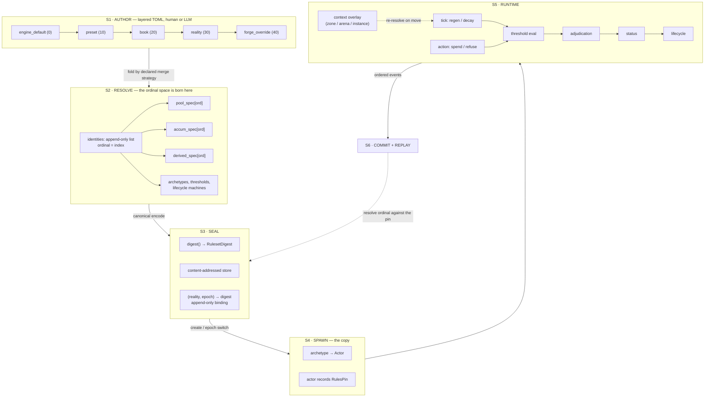

**The load-bearing observation, and it dissolves several findings at once:**

> **The three tables live at S1. The ordinal space lives at S2. These were never the same question.**

The decision spec conflated them — it said *"ordinals are assigned across the union of the three tables"*,
which puts an S1 authoring shape in charge of an S2 identity property. The manifest may carry three tables
(`PO-1`: an LLM generates them, and three flat schemas fail more loudly than one discriminated row); the
**resolver folds them into one append-only identity list with three side tables keyed by ordinal.** That is
also the shape already shipped — `Ruleset.quantities` + `Ruleset.resources` ([ruleset.rs:90,99](../../../../crates/ruleset-core/src/ruleset.rs#L90)) — generalised
from two side tables to three.

## 2. S2 — what the resolver produces

```
Ruleset {
  schema_version, law_version

  identities:   [MachineKey; n]        ← THE ordinal space. Append-only. Hashed.
                                          ordinal = index. One cap. One duplicate check.
                                          never-reuse checks THIS and only this.

  pool_spec:    ord → { floor, base, ceiling, regen, at_floor }
  accum_spec:   ord → { floor, base, ceiling, decay }
  derived_spec: ord → { terms }

  kind:         [Kind; n]              ← derived from which side table holds ord.
                                          NOT authored, NOT separately hashed.

  archetypes:   name → { grants: [ord], params, lifecycle_machine, thresholds }
  lifecycles:   name → { states: [key], transitions, cascade_policy per state }
  thresholds:   (ord, id) → { enter, exit, effects, order }
}
```

**Every capacity, duplicate and never-reuse question now has exactly one subject: `identities`.** A key can
appear in at most one side table because a side table is keyed by an ordinal the identity list already
assigned; declaring `qi` twice is a duplicate *in the identity list*, caught once.

## 2.5 The complete declaration surface — and how much of it exists

**Most open questions in §8 are not unknowns. They are fields nobody has declared yet.** *"The declared
order over delta sources does not exist"* is not a research problem; it is a table with no rows. So this
section enumerates the whole surface the drawing implies, marks what is shipped, and names which open
question each missing table closes.

### 2.5.1 What `Ruleset` carries today

```
Ruleset {
  schema_version, law_version          // pins, not vocabulary
  combat:      CombatRules             // tuning constants for laws being rewritten (D-14)
  stats:       StatRules               // slot_defaults + melee_archetype over a CLOSED slot set
  quantities:  QuantityTable           // ✅ the identity list — n keys, ordinals hashed
  resources:   ResourceTable           // ◐ pool spec, missing three fields (below)
  progression: Option<ProgressionDigest> // a pin to a separate table
}
```

Three of seven fields are declaration surface. Two are tuning blobs for a closed vocabulary. Measured:
[ruleset.rs:64-104](../../../../crates/ruleset-core/src/ruleset.rs#L64).

### 2.5.2 The full surface

| # | table | declares | status | closes |
|---|---|---|---|---|
| 1 | **`identities`** | machine keys; ordinal = index, append-only, hashed | ✅ shipped as `QuantityTable` | — |
| 2 | **`pool_spec`** | floor · base · ceiling · regen · at_floor, per ordinal | ◐ shipped as `ResourceTable`, **missing**: rate-from-a-derived-quantity, absorption-chain link, exact-value threshold form | `F6` |
| 3 | **`accum_spec`** | floor · base · ceiling · decay/growth, per ordinal | ✅ **shipped, and better than this document assumed** — `ProgressionKindDecl` ([progression/mod.rs:216](../../../../crates/ruleset-core/src/progression/mod.rs#L216)) is keyed by `quantity: u16` and carries `initial_value` (base), `cap_rule` (`SoftCap` / `HardCap` / `TierBased` / `Unbounded` — a **richer ceiling** than `CeilingBinding`), `curve` (`Linear` / `Log` / `Stage`, in milli-units) and `tiers`. See §2.5.5 |
| 4 | **`derived_spec`** | how a quantity is computed from another | ◐ **partially shipped** — `Derivation { source_quantity: u16, rate_factor_milli }` ([:203](../../../../crates/ruleset-core/src/progression/mod.rs#L203)) is a real `primary → derived` arrow, ordinal-keyed. **Limits:** exactly one source, one shape (`1000 + src × factor`), and it modulates a *training rate*, not an arbitrary derived value. `StatSlot`'s ten derived values are still a closed enum with no author-declared terms | `D-10`, `O-2` |
| 5 | **`archetypes`** | grants · per-grant params · lifecycle machine · threshold set | ❌ absent — the word "archetype" exists only as `melee_archetype`, a flat array of derived values | `D-13`, `M-3` |
| 6 | **`thresholds`** | (ordinal, id) → enter band · exit band · proposed status · order | ❌ absent | `M-2`, half of `F8` |
| 7 | **`statuses`** | kind · stack policy · expiry form · magnitude unit · effects | ❌ absent (`PL_006` designs it; no code) | §4.6 |
| 8 | **`lifecycle_machines`** | states · legal transitions · trigger per transition · cascade policy per state | ❌ absent (`EF_001` designs a *fixed* one; `D-12` makes it declared) | `D-12` |
| 9 | **`tier_rules`** | what promotes · what demotes · capacity caps per tier | ◐ `AIT_001` declares `demote_after_days` + `TierCapacityCaps`; neither is in `Ruleset` | `O-1b` |
| 10 | **`absorption_chains`** | ordered pool links residue flows along | ❌ absent | **`O-6`** |
| 11 | **`delta_order`** | the total order over delta source classes | ❌ absent | **`O-7`** |
| 12 | **`flow_kinds`** | which delta kinds are transfer / source / sink | ❌ absent | **`O-8`** (vocabulary half) |
| 13 | **`overlays`** | context overlay stacks · what each may override · merge strategy per field | ❌ absent | **`O-5`** |
| 14 | **`wave_budget`** | depth budget for the status wave | ❌ absent | **`O-10`**, **`O-12`** |
| 15 | **`reactions`** | the intervening/reacting vocabulary | ⏸ deferred by `D-9` — but its *shape* is fixed by §4.6.3 | `O-3` |

**Two shipped · three partial · nine absent · one deferred.** (An earlier draft of this line said
*"four shipped, eight absent"* — miscounted against its own table, which is the `count-drift` shape
`design-lint` checks for in prose about Rust enums but cannot see in a table about itself.)

### 2.5.5 Correction, recorded rather than quietly fixed

This section first claimed `accum_spec` was *"absent entirely"* and the `primary → derived` arrow *"does
not exist"*. **Both were wrong**, caught by opening
[`progression/mod.rs`](../../../../crates/ruleset-core/src/progression/mod.rs) instead of trusting doc 35 §1's
verdict — which was true when written and has been overtaken by the `S-1` progression work.

It matters beyond the correction, because it changes a decision:

- **`CapRule` is a better ceiling model than `CeilingBinding`.** `SoftCap` (accrues with diminishing
  returns past the cap) versus `HardCap` (refused past the cap) is a distinction the pool spec cannot
  express at all, and its doc comment is right that they are *"the opposite"* of each other, not shades.
  Pools should adopt it rather than the reverse.
- **`Derivation` proves the arrow is buildable and shows its current ceiling**: one source, one shape,
  and it modulates a training *rate*. Generalising it — many sources, a term list — is the concrete form
  `derived_spec` should take, and it is an extension of shipped code rather than a new invention.
- **`ProgressionType::{Attribute, Skill, Stage}`** is already a kind discriminant over declared
  quantities. `PO-1`'s three-table question has a fourth answer nobody raised: *the shipped design already
  splits by kind, inside one ordinal space, with a discriminant.* That is the shape §2 argues for, and it
  is running.

⇒ **The manifest is further along than the drawing assumed, and the gaps are narrower and differently
placed.** `D-7`'s three kinds are not three green fields; two of them exist under other names.

### 2.5.3 What that reclassification tells us

Sorting §8's open items by *why* they are open changes what to do about each:

| kind | items | what closes it |
|---|---|---|
| **Manifest gap** — a table with no rows | `O-5` `O-6` `O-7` `O-8`(vocab) `O-10` `O-12`, half of `O-3` | **declare it.** No research, no measurement — write the table into the surface above |
| **Code gap** — designed, unbuilt | `O-1b` (`TierDemoted` event) · `O-1c` (`Actor: Serialize`) · `O-8`(the check) · `O-11` (`StatusProposed` event) | build it |
| **Genuine unknown** — needs a decision or a measurement | `O-2` (what compiled laws name) · `O-4` (the `PO-1` experiment) · `O-9` (cross-island transfer — a kernel question, `QTY-Q7`'s wall) | cannot be closed by writing more schema |
| **Not a rules question at all** | `O-1d` residency budget | a **deploy-time ceiling**, not manifest: two users would not want different memory budgets for the same reality. Per `settings-and-config`, this is platform config, and mis-filing it as vocabulary would have been the error `D-2` makes easy |

**Six of twelve open questions close by declaring a table.** Three need code that is already designed.
**Only three are genuine unknowns**, and one of those (`O-9`) is a kernel constraint this tier cannot
resolve alone.

### 2.5.4 The two that do not fit the pattern, and why that is informative

`O-2` — *what does compiled combat code name, once slots are declared?* — **cannot** be closed by adding a
table, and that is diagnostic rather than unfortunate. Every other gap is *"the manifest has no word for
this"*. `O-2` is *"the engine has no way to refer to what the manifest said"*, which is the opposite
direction and is exactly agent 3's `FATAL-2`. Adding schema does not help; it is the one place where the
answer must come from the law side.

`O-9` — cross-island atomic transfer — is a **kernel** property (`sim-core` makes entity-in-exactly-one-island
structural). No amount of declaration reaches it.

> Those two are the honest residue. If the surface in §2.5.2 were written in full tomorrow, ten of twelve
> open questions would close, and these two would remain exactly as open as they are now.

## 2.6 The nine absent tables, written out

Field names are indicative; the **shape**, the **merge strategy** and the **digest membership** are the
claims. Every table below is rules, so every one is inside the hashed bytes — the single exception is
called out in §2.6.10.

Merge strategies are `RLS-A4`'s: `UnionByIdOverride` (a higher layer may add or replace a row by id, never
remove), `Replace`, `Forbidden`. Layer floor is the lowest layer that may first declare the table.

### 2.6.1 `archetypes` — the spawn template (§4)

```
archetypes: key → ArchetypeDecl
ArchetypeDecl {
  grants:       [(QuantityOrdinal, GrantParams)]   // WHICH quantities this kind of actor has
  lifecycle:    LifecycleMachineKey                // which declared machine it follows
  threshold_set: ThresholdSetKey
  tier_floor:   Tier                               // the tier an actor spawns at
}
GrantParams { base: Option<i32>, ceiling: Option<CeilingBinding> }   // per-archetype overrides
```
`UnionByIdOverride` · floor `preset` · **hashed**.

**Well-formedness (mechanism, checked at resolve):** every `ceiling: Slot(s)` in a grant must name an
ordinal the *same* archetype also grants — this is the §4.5.6 check, moved from spawn to resolve, where it
fails once for the author instead of once per actor.

### 2.6.2 `threshold_sets` — the number→meaning adapter (§4.6.2)

```
threshold_sets: key → [ThresholdDecl]
ThresholdDecl {
  id:       MachineKey        // stable; the tie-break key — NOT the ordinal (M-1)
  quantity: QuantityOrdinal
  enter:    Band
  exit:     Band              // must differ from `enter`; see below
  proposes: StatusOrdinal     // a PROPOSAL, never an applied fact
  order:    u16               // declared precedence within the set
}
Band = BelowPermille(u16) | AbovePermille(u16) | AtValue(i32) | BelowValue(i32)
```
`UnionByIdOverride` on `id` · floor `preset` · **hashed**.

Two mechanism obligations, both checkable at resolve:

- **`M-2`, the hysteresis floor.** For a percentage band, `|exit_pm − enter_pm| ≥ 1000 / ceiling`. A pool
  with ceiling 30 has 33‰ granularity, so a 20‰ band collapses to a single representable integer and the
  value flaps every tick. Refuse it at declare time.
- **`F6`, the exact form.** `AtValue(0)` exists because *"exactly zero"* is the case this whole document
  was written for and a percentage cannot express it when the ceiling is absent or zero.

### 2.6.3 `statuses` — the meaning layer (§4.6.4)

```
statuses: [StatusDecl]        // ordinal = index, append-only, same discipline as identities
StatusDecl {
  key:       MachineKey
  stack:     StackPolicy      // Replace | Stack { max: u8 } | Refresh | Ignore
  expiry:    ExpiryForm       // Rounds(u16) | UntilCleared | WhileProposed
  magnitude: MagnitudeUnit    // None | Permille | Absolute
  effects:   [StatusEffect]
}
StatusEffect =
  | PoolDelta    { quantity: QuantityOrdinal, per_tick: i32 }   // a §4.5 submitter
  | StatModifier { quantity: QuantityOrdinal, op: ModifierOp }  // a derived contribution
  | BlockActions { tags: [ActionTag] }                          // an admission gate
```
`UnionByIdOverride` · floor `preset` · **hashed**.

`ActionTag` is a **closed engine set** (chaos's `enums.yaml` reached ~11: `parry`, `block`, `cast`,
`sprint`, `dodge`, …). It is mechanism because admission must be able to reason about it; the *assignment*
of tags to abilities is vocabulary.

### 2.6.4 `lifecycle_machines` — declared states, engine mechanics (§5.8, `D-12`)

```
lifecycle_machines: key → MachineDecl
MachineDecl {
  states:      [MachineKey]                    // ordinal = index WITHIN this machine
  initial:     StateOrdinal
  transitions: [TransitionDecl]
  cascade:     StateOrdinal → CascadePolicy    // Drop | Cascade | Suspend | Keep
}
TransitionDecl {
  from: StateOrdinal, to: StateOrdinal,
  trigger: OnStatus(StatusOrdinal) | OnAdmin | OnCascade,
  reason:  ReasonOrdinal
}
reasons: [MachineKey]        // declared, EXCEPT `HolderCascade` which the engine owns
```
`UnionByIdOverride` on the machine key, `Replace` within a machine · floor `preset` · **hashed**.

**Well-formedness — this is the obligation the red team found missing.** A declared transition graph is
data an author can get wrong in ways the engine cannot survive:

1. `initial` must be a declared state.
2. A state the engine's cascade can reach must not cycle back into the cascade — **an unbounded cascade
   is a hang, authored in content**.
3. **Terminality is a tier property, not a state property.** At `tier_floor = Irreversible`, a state with
   no outbound transition is terminal *and must exist*; at lower tiers an edge back out is legal. This is
   §5.8.1's *"tier gates the transition set"*, expressed as a resolve-time check.

### 2.6.5 `absorption_chains` — where residue goes (`O-6`, §4.5.3)

```
absorption_chains: [[QuantityOrdinal]]      // ordered; residue at link i flows to link i+1
```
`UnionByIdOverride` keyed on the chain's first ordinal · floor `preset` · **hashed**.

**Constraint:** an ordinal appears in **at most one** chain. Two chains sharing a link would route one
residue twice, which creates value — and the conservation check (§2.6.7) would then be reporting a defect
the author caused, in a place they cannot see.

### 2.6.6 `delta_order` — the total order over submitters (`O-7`, §4.5.2)

```
delta_order: [DeltaClass; DeltaClass::COUNT]     // a permutation, exhaustive
DeltaClass = Regen | StatusEffect | Environment | ActionCost | Combat | Transfer
```
`Replace` (an order is not mergeable piecewise) · floor `preset` · **hashed**.

The **classes are mechanism** — a submitter's class is decided by which module it came from, not by the
author. The **order is vocabulary**: whether regen lands before or after combat damage within a tick is a
real balance decision two realities would legitimately answer differently. Ties within a class break on
`seq`, which is monotonic and already required for replay.

`[DeltaClass; COUNT]` rather than `Vec` is deliberate — the array length ties to the enum, so a seventh
class is a compile error rather than a silently unordered submitter. That is the `closed-set-gate`
discipline applied at declaration.

### 2.6.7 `sources` / `sinks` — conservation, stated as data (`O-8`, §4.5.4)

```
sources: [{ quantity: QuantityOrdinal, holder: HolderKind, reason: MachineKey }]
sinks:   [{ quantity: QuantityOrdinal, holder: HolderKind, reason: MachineKey }]
```
`UnionByIdOverride` · floor `preset` · **hashed**.

`EXC-L1` says deltas sum to zero **except at a declared source or sink**. Today that is prose. These two
tables are what make it a check: any tick whose deltas do not sum to zero must be fully explained by rows
here, and one that is not is a defect the assertion can name. **The tables are manifest; the assertion is
code and remains unbuilt** — declaring them does not build it, and saying so keeps `O-8` honest.

### 2.6.8 `overlay_kinds` — context, and what it may touch (`O-5`, §5)

```
overlay_kinds: key → OverlayKindDecl
OverlayKindDecl {
  may_override: [OverlayField]                 // a CLOSED set — mechanism
  precedence:   u16                            // higher wins; the stack is ordered by this
}
OverlayField = RegenRate | ThresholdBand | StatusEffect | CascadePolicy | ActionBlock
```
`UnionByIdOverride` · floor `preset` · **hashed**.

Three things this fixes at once:

- **`RegenRate` must be in the closed set**, or an ambient environmental effect — a swamp, a spirit vein —
  has no way to reach the actor (§4.5.4's *contribution* shape).
- **A partial overlay row means INHERIT, never CLEAR.** This is `case06`'s bug in chaos: a whole-row
  replace turned a partial override into a threshold with no enter condition, i.e. one that can never
  fire. An absent field inherits; clearing requires an explicit `Clear` marker.
- **`may_override` being closed is what stops an overlay becoming a second manifest.** An overlay that
  could redefine identities or grants would let a zone change what an actor *is*, not merely how it
  behaves there.

### 2.6.9 `wave_budget` — the depth bound (`O-10`, `O-12`, §4.6.6)

```
wave_budget { max_depth: u8, on_exceeded: Refuse | Truncate }
```
`Replace` · floor `engine_default` · **hashed** — it changes behaviour, so it is rules, not config.

`Refuse` is the correct default: a truncated wave silently produces a different outcome than the rules
describe, and *"the encounter resolved differently because a status chain was long"* is the class of bug
that is invisible until a player reports it.

### 2.6.10 `reactions` — shape fixed, vocabulary deferred (`D-9`, §4.6.3)

```
reactions: [ReactionDecl]
ReactionDecl {
  on:     Proposed(StatusOrdinal) | Applied(StatusOrdinal) | Cleared(StatusOrdinal)
  effect: Veto | Replace(StatusOrdinal) | Add(StatusOrdinal) | …     // ← DEFERRED
  order:  u16
}
```
**`Veto` is legal only on `Proposed`** — that is the whole reason the propose/apply split exists. `D-9`
defers the effect vocabulary; it does not defer the subscription points, which §4.6.3 fixes now.

### 2.6.11 The one thing here that is NOT manifest

`residency_budget` — the LRU `max` / idle timeout on axis 3 (`O-1d`). It is a **deploy-time ceiling**, not
rules: two operators running the same reality on different hardware want different values, and no player
should be able to tell which was chosen. Per `settings-and-config`, that makes it platform config.

**Mis-filing it as vocabulary is the error `D-2` makes easy** — *"the manifest declares identity"* is not
*"the manifest declares everything the engine reads"*. The test is whether two deployments of the **same
reality** would legitimately differ: for a memory budget, yes; for a hysteresis band, no.

### 2.6.12 What writing these nine closes

| open | closed by | remaining |
|---|---|---|
| `O-5` overlay merge | §2.6.8 — closed set, inherit-not-clear, precedence | — |
| `O-6` absorption chain | §2.6.5 | — |
| `O-7` delta order | §2.6.6 | — |
| `O-8` conservation | §2.6.7 declares the vocabulary | **the assertion is still unbuilt** |
| `O-10` depth budget | §2.6.9 | — |
| `O-12` `WhileProposed` × depth | falls out of §2.6.9 | — |
| `O-3` `D-9`'s scope | §2.6.10 fixes the subscription points | the effect vocabulary stays deferred |
| `O-1d` residency budget | §2.6.11 — **reclassified**, not answered here | it is platform config |

`O-1b` `O-1c` `O-11` remain **code** gaps · `O-2` `O-4` `O-9` remain genuine unknowns. That is the
residue the user's hypothesis predicted: enrich the structure, and what is left is the part no schema
could have carried.

## 2.7 The validator ladder — where each check runs, and why the earliest layer wins

The diagram had no validators in it. That omission hides the discipline that decides whether a defect
costs an author one message or costs the engine one branch per actor per tick, forever.

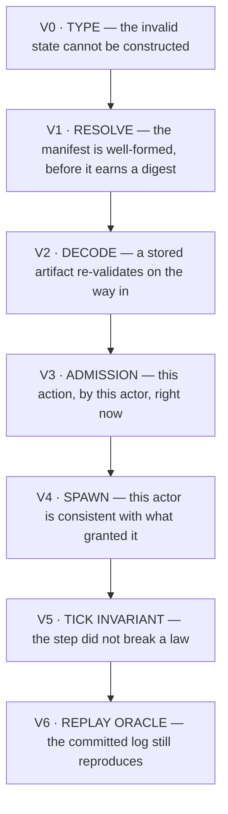

| layer | when | what belongs here | shipped |
|---|---|---|---|
| **V0 · Type** | compile | ordinals are `u16` not strings · `Option<i32>` for an ungranted read · `[DeltaClass; COUNT]` · exhaustive `match` with no wildcard | ✅ the strongest layer this repo has, and `closed-set-gate` guards its edges |
| **V1 · Resolve** | once, per manifest | every §2.6 well-formedness rule: archetype ceiling grants · hysteresis floor · lifecycle graph acyclic + `initial` exists + terminality-vs-tier · one ordinal per absorption chain · `delta_order` is a permutation · derived terms name declared ordinals | ◐ `ruleset-loader/src/validate.rs` exists with **one** function |
| **V2 · Decode** | per load | ordinals strictly ascending · known discriminants · length ≤ cap · re-digest matches the name | ✅ `ResourceTable::decode`, `RulesetStore::get` |
| **V3 · Admission** | per action | `can_pay` · `at_floor` · action-tag blocks · turn slot | ◐ `Admitted<D>` exists; the pool half does not |
| **V4 · Spawn** | per actor | `granted` matches the archetype · every value within `[floor, ceiling]` | ❌ |
| **V5 · Tick invariant** | per tick | conservation (`EXC-L1`) · wave depth ≤ budget · post-apply bounds | ❌ |
| **V6 · Replay oracle** | per audit | the committed log reproduces byte-identically | ◐ conformance runner exists |

### 2.7.1 The rule that orders them

> **A check belongs at the earliest layer that can see the defect. A check at V5 that V1 could have made
> is a check that fires once per actor per tick, forever, instead of once per author.**

And its non-vacuity corollary, which cuts the other way:

> **A V1 validator is only real if the manifest can express the invalid state.** If V0 already makes it
> unconstructible, the V1 check cannot fail and is `NV-2` — a claim wearing the costume of evidence.

That tension is the whole reason the ladder needs to be written down. Example, worked:

| candidate check | correct layer | why not lower | why not higher |
|---|---|---|---|
| *"a threshold names a declared quantity"* | **V0** — `quantity: QuantityOrdinal`, a typed index | — | a V1 check would be vacuous: the type has no other inhabitant |
| *"enter and exit differ by ≥ 1000/ceiling"* | **V1** | the type cannot see the ceiling | a V5 assert would fire per tick on a defect fixed once |
| *"this actor can pay this cost"* | **V3** | depends on runtime values | — |
| *"deltas sum to zero except at a declared source"* | **V5** | genuinely a per-tick property | — |

### 2.7.2 What V1 must reject that it cannot today

`ruleset-loader/src/validate.rs` carries a single `validate(&Ruleset)`. Every §2.6 obligation is absent
from it, and each is a defect an author can currently ship into a digest:

- an archetype granting `qi` whose `ceiling: Slot(max_qi)` it does not also grant ⇒ **`0/0` at runtime**
- a hysteresis band narrower than the pool's integer granularity ⇒ **flapping every tick**
- a lifecycle cascade with a cycle ⇒ **a hang, authored in content**
- two absorption chains sharing a link ⇒ **residue routed twice, value created**
- a `delta_order` that is not a permutation ⇒ **a submitter class with no position**

None of these is exotic; each is the ordinary shape of a manifest an LLM would generate. **V1 is the layer
`PO-1`'s "fails loudly" argument was actually about**, and it is one function long.

## 3. S4 — the resolved quantity block, drawn

> **⚠ RENAMED 2026-08-02 by `P-A` (§9.1). This section was titled *"the actor, drawn"* and the struct was
> called `Actor`. Both were wrong, and the error was load-bearing rather than cosmetic.**
>
> Domain-driven practice is explicit: **an identity may span many bounded contexts; an entity *instance*
> may not.** The correct shape is separate definitions per context sharing one id — which is exactly what
> the corpus's **31 actor-keyed aggregates** (§8.1) already are. They are the right decomposition and are
> **not to be unified.**
>
> What follows is therefore **one context's view**: the **deterministic-law context**, the hot `Copy`
> block a law reads inside a tick. It is the actor's *quantities*, not the actor. Opinion, memory,
> reputation, titles, family, equipment and journeys live in other contexts and **must never be moved into
> this struct** — §9.3 gives the rule they follow instead.
>
> Read every later *"the actor"* in this document as *"the resolved quantity block"* unless the sentence
> is plainly about the whole entity.

```
ActorQuantities {          // ⟵ NOT `Actor`. One context's view (P-A).
  id: ActorId              //     the shared identity — the only thing other contexts may hold

  ┌─ PROVENANCE ─ answers A-1 ───────────────────────────────────────┐
  │ rules: RulesPin {                                                │
  │   ruleset: RulesetDigest      // what it spawned under           │
  │   epoch:   RulesetEpoch                                          │
  │   overlay: OverlayDigest      // context stack, see §5           │
  │ }                                                          40 B  │
  └──────────────────────────────────────────────────────────────────┘

  ┌─ QUANTITIES ─ dense, ordinal-indexed ────────────────────────────┐
  │ values:  [i32; 32]                                        128 B  │
  │ granted: u32          // bit i set ⇒ ordinal i is present    4 B │
  │                       // absence is STRUCTURAL, not a zero       │
  └──────────────────────────────────────────────────────────────────┘

  ┌─ THRESHOLD EDGE STATE ─ F1 ──────────────────────────────────────┐
  │ threshold_active: [u32; 4]   // ≤4 thresholds per quantity  16 B │
  │                              // an EDGE needs prior state        │
  └──────────────────────────────────────────────────────────────────┘

  ┌─ STATUS ─ a PROJECTION, not the records (§12.2) ─────────────────┐
  │ status_active: u64    // bit i ⇒ declared status ordinal i is     │
  │                       // active. Recomputed at phase 0 from       │
  │                       // PL_006's actor_status.              8 B  │
  │                       // The RECORDS — magnitude, source,         │
  │                       // expiry, stack policy — stay in PL_006.   │
  │                       // A law asks "is it stunned", never        │
  │                       // "why" or "for how long".                 │
  └──────────────────────────────────────────────────────────────────┘

  ┌─ CONTROL ─ a CACHE of the binding, not the binding (§5.10.3) ────┐
  │ control: Option<ControllerId>                              ~8 B   │
  │                       // ≤1 controller PER ACTOR — a race has no  │
  │                       // deterministic resolution. But a          │
  │                       // CONTROLLER holds N actors (分身), so the │
  │                       // SSOT is `control_binding`, a per-        │
  │                       // (controller, actor) relation owned by    │
  │                       // ACT_001. This field is the resolved      │
  │                       // back-reference, refreshed on rebind.     │
  │                       // The ≤1 side is a UNIQUENESS INDEX on     │
  │                       // actor_id (V1), not a type guarantee.     │
  └──────────────────────────────────────────────────────────────────┘

  ┌─ LIFECYCLE ─ three axes, three fields (§5.8) ────────────────────┐
  │ tier:      Tier       // 0 Untracked | 1 Declared |               │
  │                       // 2 Stateful | 3 Irreversible         1 B │
  │                       // MECHANISM — gates which of the fields    │
  │                       // above exist at all, and which declared   │
  │                       // transitions are enabled                  │
  │ existence: u8         // ordinal into the reality's declared      │
  │                       // state set — VOCABULARY              1 B  │
  │ residency: Residency  // Active | Passivated | Evicted            │
  │                       // MECHANISM, engine-only              1 B  │
  └──────────────────────────────────────────────────────────────────┘

}                                              // TOTAL 216 B, fixed
```

> **⚠ `statuses: StatusSet` was REMOVED here by the §12 audit, and it was the worst field in the struct.**
> It bolted `PL_006`'s whole aggregate into actor core — a business boundary pushed into the substrate —
> and, because it was the **only field carrying no byte count**, it made `size_of::<ActorQuantities>()`
> **incomputable**. The `QTY-A12` assertion this document cites at others could not have been written
> against this document's own struct: a `Vec` reports 24 bytes for every content, and the guard is
> vacuous. **That is the `QTY-A6 ⊥ QTY-A12` trap, in the file that names it** (`O-36`).
>
> **The total is now stated, and stating it is the point** — §12.5 shows the `size_of` assertion is not
> merely a `Vec` guard but **the architecture's anti-accretion gate**: it is what makes *"a feature may
> not add a field"* a build failure rather than a review opinion. An unsized field disables it silently.

> **⚠ "TIER" MEANS THREE UNRELATED THINGS in this corpus, and they collide inside this very paragraph.**
> Whenever the word appears, it is qualified from here on:
>
> | | ladder | owner | governs |
> |---|---|---|---|
> | **actor tier** | `Untracked · Declared · Stateful · Irreversible` | `AIT_001` + §5.8 | how much of *this struct* is materialised |
> | **DP tier** | `T1 · T2 · T3` | the data plane | read/write urgency + consistency of an *aggregate* |
> | **storage layer** | `L1 sim · L2 live · L3 durable` | §9.2 | *where the bytes are*, and who may write them |
>
> An unqualified *"tier-2"* is ambiguous between the first two — and `actor_status` is *"T2 / Reality"*
> (DP tier) while a `Stateful` actor is *"tier 2"* (actor tier). §9.2's ladder is therefore called a
> **layer**, never a tier (`O-33`).

The struct above **is the actor-tier-2 (`Stateful`) shape**. Actor tier 1 (`Declared`) carries only
`id + rules + tier + existence` and evaluates its values from the declaration; actor tier 0 (`Untracked`)
has no row at all. Actor tier is therefore not merely a field — it is the discriminant on how much of this
structure is materialised (§5.8.2). All of it lives in **storage layer L1**.

Three properties this shape buys, each of which killed a red-team finding:

| property | what it kills |
|---|---|
| **dense array + `granted` bitmask**, not a sparse heap set | `size_of::<ActorQuantities>()` stays visible, so the `QTY-A12` assertion keeps biting. A `Vec` would report 24 B for every `k` and the guard could never fire — the `QTY-A6 ⊥ QTY-A12` trap, killed once already on 2026-07-28 |
| **`granted` is a bit, not a sentinel** | *"this race has no hp"* and *"a village has no hp"* stay representable, and are distinguishable from a stored `0`. Runtime grant is `granted \|= 1<<ord` |
| **`RulesPin` on the actor** | *"what rules is this actor running under"* has an answer that does not depend on the current manifest |

**Iteration order stays ordinal order** (`for ord in granted.iter_ones()`), which `QTY-A9` needs and a
grant-ordered sparse set would have lost.

### 3.1 This is an ARCHETYPE layout, and that is now a measured choice (`P-D`)

A 2025 study implemented both storage families in C++20 and measured them: **sparse-set** ECSes make
composition changes cheap and iteration expensive; **archetype** ECSes invert it — fast iteration through
cache locality, costly composition change. Our access pattern is not close:

| | this actor |
|---|---|
| composition change (*which quantities exist*) | **once, at spawn, from an archetype preset** — then effectively never |
| iteration | **every tick, over every resident actor, by every law** |

⇒ archetype, decisively. And a fixed `[i32; 32]` behind a `granted` bitmask **already is an archetype
decision**: every actor in a reality shares one layout, and `granted` marks which slots are *live*, not
which *exist*. `QTY-A6`'s fixed width therefore has a second justification independent of `size_of`.

### 3.1b The CONTAINER — the slot table (`O-43b`+`O-46b`+`O-47`, §18.3)

§3.1 argued archetype layout for the **element**. This is the container it was always about, and it
answers disposal and generation-exhaustion in the same design — because `D-23` decides all three before we
start:

> **A tier-2 row is a FOLD over the ledger, never a source. So disposal is CACHE EVICTION, not deletion.**
> Freeing an actor frees a **slot**; the ledger is untouched; re-materialisation is a re-fold. There is
> nothing to delete, because the row was never the truth.

```
slots:  Vec<Option<ActorQuantities>>   // dense — iterated every tick, 216 B elements
gens:   Vec<Gen>                       // one per SLOT — the stale-reference guard
free:   Vec<SlotIx>                    // reuse, in deterministic order
index:  BTreeMap<ActorId, SlotIx>      // identity → slot
```

| decision | why |
|---|---|
| dense slot array, not `BTreeMap<Id, Actor>` | §3.1's measured argument applied to the container. Iteration is a linear scan |
| iteration order = **slot** order | deterministic for replay — which is what a tree map was buying, and a dense array buys **by construction** |
| slot assigned in `seq` order at spawn | deterministic, so two replays assign identically |
| **`EntityId` is NEVER reused; the SLOT is** | identity is permanent (`QTY-A5`'s discipline one level up); a slot is a cache line. `Gen`-per-slot is the guard, and the kernel already built it (`Precondition::EntityAlive`) |
| **`Gen(u64)`, saturating, + a tick invariant that no slot sits at `u64::MAX`** | `O-47`'s real complaint is that saturation turns a monotonic guard into a **constant**. At `u32` that is reachable; at `u64` it is 584 years at one bump per nanosecond — **and the invariant makes "unreachable" checked instead of argued.** Widening beats a failure path: a `Result` on *bump the generation* has no caller that could act on the error |

**Which `existence` state permits eviction is declared VOCABULARY** (`D-12`) — the engine closes the
operation, the manifest says which states are evictable. That is `O-46b`'s entire residue.

### 3.2 `granted` may NEVER encode lifecycle (`P-D`, second half)

flecs' author argues that storing a **state machine** in an ECS is a mistake because component *presence*
is not mutually exclusive while a machine's states are — so an invalid combination becomes representable.

**That is the `Suspended`-beside-`Destroyed` defect §5.8 found, arrived at from the storage side.** §5.8.1
chose a single `existence` ordinal, which is correct. Nothing today stops a later author from adding a
"is-dead" bit to `granted` instead, and the moment one exists, `granted` can express *dead and alive*.

**The rule:** `granted` answers exactly one question — *does ordinal `i` exist for this actor* — and every
mutually-exclusive state is a single field with a closed set. A lifecycle bit in `granted` is a defect
(`O-32`).

### 3.3 What is deliberately NOT here, and where it goes instead

| not here | context that owns it | shape (§9.3 `P-C`) |
|---|---|---|
| opinion · reputation · titles · memberships · V2 quest state · V3 org roles | `ACT_001` · `REP_001` · `TIT_001` · `FAC_001` | **pair-keyed relation** — stores *causes with expiries*, folded on read; bounded per actor |
| session memory · POV distill | `ACT_001` R8 | bounded LRU with decay |
| equipment · inventory · item instances | `PL_007` | per-instance rows; reaches quantities only via the `DF7` derived projection |
| location · lifecycle log · affordances | `EF_001` | its own state machine + append-only log |
| journeys · mounts · parties | `TVL_001-005` | sparse per-journey rows |
| combat session · tactical grid | `COMB_001/002` | **ephemeral** — exists only during |

**None of these is a quantity, and none belongs in an ordinal slot.** The fixed width of §2.5's
declaration surface governs quantities only; it does not govern this table (`O-28`).

## 4. S5 — the tick, and where each module reads and writes

| # | stage | reads | writes | emits |
|---|---|---|---|---|
| 1 | **regen / decay** | `values`, `granted`, `pool_spec`, `accum_spec`, and a **derived** quantity when the rate is sourced from one | `values` | — |
| 2 | **threshold eval** | `values`, ceiling (resolved), threshold specs, **`threshold_active`** | `threshold_active` | `ThresholdCrossed{actor, ord, threshold_id, dir, seq}` — **edges only** |
| 3 | **adjudication** | `ThresholdCrossed` + the declared effect list | — | `StatusApplied` / `StatusCleared` |
| 4 | **status** | `StatusApplied/Cleared` | `statuses` | — |
| 5 | **lifecycle** | `statuses` + the declared transition set | `existence` | `LifecycleTransitionRequested` |

**Stage 3 is a pass-through in v1, not a hole.** The red team is right that *"declared reactions may
intervene here — mechanism DEFERRED"* leaves the chain unable to reach stage 4, so the exit edge is
unimplementable. The fix is one sentence: **stage 3 exists and applies the declared effects directly; what
`D-9` defers is the *interception* — the ability of an ability to intervene between the crossing and the
effect.** A deferred interception point is a plug with nothing plugged into it; a deferred *stage* is a
broken chain. It was the second.

**Residency is not in this table, and that is the point.** Axis 2 lives in the scheduler, outside the tick.
A `Passivated` actor runs no stages at all.

## 4.5 The pool — every writer, every reader, and the environment both ways

`values[ord]` is the most-written datum in the engine. Section 4 drew it as one box in a chain, which
hides the actual risk: **a pool has a dozen would-be writers, and letting each write directly is how a
substrate becomes a god class.** This section draws the boundary instead.

### 4.5.1 One writer, many submitters

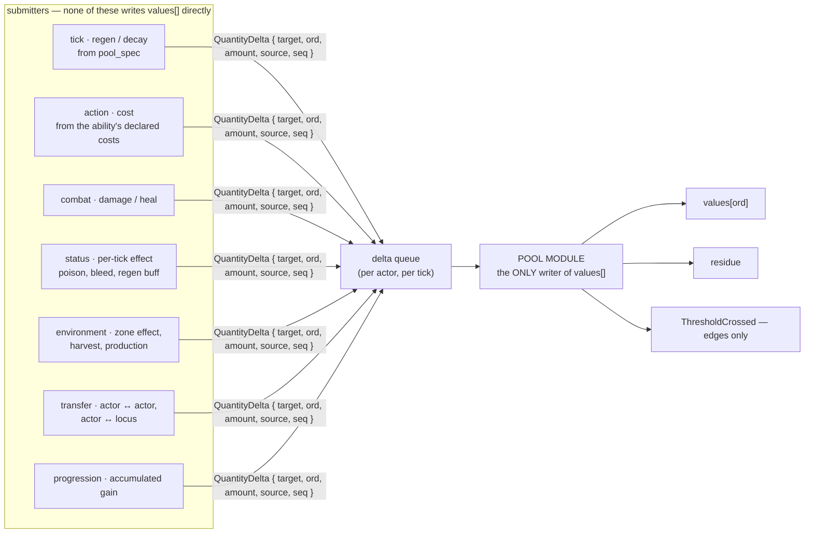

**The contract, stated so it can be violated visibly:**

| direction | surface | who may call |
|---|---|---|
| **read** | `value(actor, ord) -> Option<i32>` · `ceiling(actor, ord) -> Option<i32>` · `can_pay(actor, &costs) -> Admission` | anyone |
| **write** | `submit(QuantityDelta)` — queued, never applied by the caller | anyone |
| **apply** | the pool module, once per tick, in declared order | **nobody else** |

`Option` is not decoration: a quantity the actor was never granted returns `None`, and **`None` is not
`Some(0)`**. That is what makes `D-4` reach the consumer instead of stopping at the storage layer.

### 4.5.2 Apply order, and the clamp

Order matters exactly when something clamps mid-sequence, which is always in a real tick:

```
for each delta, in declared source order (ties → seq):
      before  = values[ord]
      target  = before + delta.amount
      values[ord] = clamp(target, floor, ceiling(actor, ord))
      residue = target - values[ord]        ← NOT discarded
      if residue != 0 → route it (§4.5.3)
```

**Per-delta clamp, not one clamp at the end.** `DF7-A4`'s single-clamp discipline governs *stat
resolution*, which is a pure recompute of a value that is not stored between steps. A pool is stateful and
**the clamp is the mechanism** — a shield at 30 taking 50 damage must clamp at 0 *and hand on the 20*. One
clamp at emit makes that 20 vanish, and with it the entire concept of absorption.

### 4.5.3 Residue, and the absorption chain

Residue is the reason shields work, and it is a **declared** ordering, not engine arithmetic:

```
absorption chain (declared, per reality):   shield → barrier → hp

    incoming −50 to shield(30)
        shield: 30 → 0,  residue −20
        residue routed to the next link in the chain
    hp: 1000 → 980
```

| | |
|---|---|
| **mechanism** (engine, closed) | that residue exists, that it is computed as `target − clamped`, and that it is routed exactly once per link |
| **vocabulary** (manifest) | which pools form a chain, in what order, and whether a link absorbs fully or partially |

A pool with no chain entry discards its residue — which is the correct behaviour for a mana pool and the
wrong one for a shield, and the difference is the author's to declare.

### 4.5.4 The environment is a quantity holder too — both directions

This is the part that has no special machinery, and that is the design:

> **A locus is an actor** (`ActorKind::Locus`, applied 2026-07-30). A cell, a village, a spirit vein
> carries `values[] + granted` exactly like a swordsman does. **Actor ↔ environment is pool ↔ pool.**

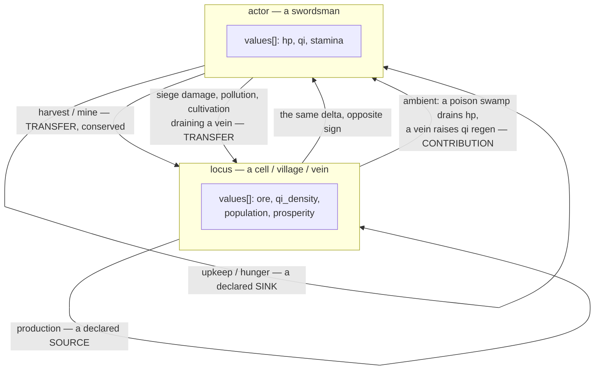

Three interaction shapes, and they are genuinely different:

| shape | conservation | example | how it reaches the pool |
|---|---|---|---|
| **Transfer** | **sums to zero** across the two holders, in one atomic delta pair | harvesting ore, giving a potion, draining a vein | two `QuantityDelta`s with the same `seq`, applied together or not at all |
| **Contribution** | not conserved — the environment modifies a *rate*, not a *value* | a spirit vein raising qi regen, a swamp draining hp per tick | the zone's **context overlay** (§5) contributes to `RegenSpec`, so it lands through stage 1 like any other regen |
| **Source / sink** | declared non-conservation — the only legal place value appears or vanishes | a mine producing ore, hunger consuming food | a declared `source`/`sink` marker on the delta; `EXC-L1`'s conservation assertion passes only because these are named |

**Why a contribution is not a transfer, and why the distinction is load-bearing:** a swamp draining hp
does not *gain* hp. Modelling it as a transfer would require the swamp to hold a pool it has no meaning
for, and would make the conservation check demand a sink that is fiction-nonsense. A contribution changes
the *rate* at which the actor's own pool moves, which is exactly what `§5`'s overlay is for — and it is
why the overlay must be able to reach `RegenSpec`, not only thresholds.

**Why a transfer must be atomic:** `EXC-L1` says deltas sum to zero except at a declared source or sink.
A half-applied transfer creates or destroys value silently, and the conservation assertion is the only
thing that would have caught it. Two deltas, one `seq`, one commit.

### 4.5.5 Actions — the read that must happen before the write

An ability declares `costs: [(ord, amount)]` (`ABL_001`). Admission is a **read**, then a **submit**:

```
admit(actor, ability):
    for (ord, amount) in ability.costs:
        match value(actor, ord):
            None            → REFUSE  "this actor has no such pool"      ← D-4 reaching a consumer
            Some(v) if v < amount:
                match at_floor(ord):
                    BlockCosts → REFUSE  "cannot pay"
                    Clamp      → allow, the delta will clamp and leave residue
    ⇒ on pass, submit one delta per cost, all with the same seq
```

Two things this fixes that the decision spec left implicit:

1. **A cost naming an ungranted pool is a REFUSAL, not a free action.** Without `Option`, `v < amount`
   against a defaulted `0` would refuse *everything* for a village — or, with the other default, let it
   pay costs it has no pool for.
2. **`at_floor` is consulted at admission, not after the fact.** `BlockCosts` is an *admission* rule
   ([resource/mod.rs:112](../../../../crates/ruleset-core/src/resource/mod.rs#L112)); asking it after the delta has clamped is asking a
   question whose answer no longer exists.

### 4.5.6 Ceilings, and the 0/0 that must be impossible

A threshold is a percentage; a percentage needs a ceiling; `CeilingBinding::Slot(s)` binds it to a derived
quantity **the actor may not have**. chaos ships exactly this bug — a missing max becomes
`unwrap_or(1.0)`, so a percentage reads as maximally exhausted and a threshold fires at spawn.

**The fix is at S4, not at runtime:** an archetype may not grant a pool whose ceiling binding is
unresolvable against the same archetype's grants. Checked once, at spawn, refused loudly:

```
spawn(archetype) →
    for ord in archetype.grants:
        match pool_spec[ord].ceiling:
            Fixed(_)  → ok
            Slot(s)   → require archetype.grants contains s
                        else REFUSE: "grants `qi` whose ceiling binds `max_qi`, which it does not grant"
```

Then `ceiling(actor, ord)` is total for every granted pool, and the runtime `0/0` is unreachable rather
than handled. **Making absence structural does not help if the consumer of the absence divides by it** —
so the consumer is removed instead of guarded.

### 4.5.7 What must NOT be able to write a pool

| | why |
|---|---|
| **a derived quantity** | it is recomputed, never stored. A `QuantityDelta` targeting a `Derived` ordinal is a defect and must be refused at submit, not clamped at apply |
| **an accumulated quantity, from the tick** | cultivation gain is progression's write path, ordered against the progression system, not against combat |
| **any module holding `&mut values`** | the boundary in §4.5.1 is the whole protection. A single `pub fn values_mut()` re-creates the god class in one line |

### 4.5.8 The pool's own in/out, summarised

```
        READS ─────────────────────────────────────────────────┐
  combat ── value, ceiling                                     │
  ability admission ── value, at_floor                         │
  threshold eval ── value, ceiling                             │
  UI / prompt assembly ── value, ceiling, granted              │
                                                               ▼
                                                    ┌──────────────────┐
  tick regen ─────── submit ────────────────────────▶                  │
  combat damage ──── submit ────────────────────────▶   POOL MODULE    │
  status effect ──── submit ────────────────────────▶                  │
  environment ────── submit (transfer / source / sink)▶  sole writer   │
  transfer ───────── submit (paired, same seq) ──────▶                  │
                                                    └────────┬─────────┘
                                                             │
                              values[] ◀───────── apply ─────┤
                              residue ──▶ absorption chain ──┘
                              ThresholdCrossed ──▶ stage 2
```
Every arrow in is a **delta carrying its source**; every arrow out is a **read or an event**. Nothing
writes across the boundary, which is what keeps `EXC-L1`'s conservation assertion checkable at all — a
direct mutation is invisible to it by construction.

## 4.6 Status, and what a trigger actually binds to

### 4.6.1 The question

A trigger — *"when my qi is exhausted, burn my blood essence to survive"* — has to attach to something.
Two candidates, and the choice decides whether `D-5` holds or quietly unravels:

| | binds to | *"when hp reaches 0"* becomes |
|---|---|---|
| **A** | the **pool threshold** — subscribe to `ThresholdCrossed` | a condition on a number |
| **B** | the **status** — subscribe to a status transition | a condition on a fact about the actor |

### 4.6.2 The answer: **status. A threshold is not a subscription point.**

A trigger bound to a pool threshold re-embeds meaning in arithmetic — which is precisely what `D-5`
removed when it separated *"a number reached its floor"* from *"this actor is dying"*. Four concrete
consequences, each of which is a real mechanic that design A cannot express:

1. **One meaning, many causes.** `Downed` may come from hp reaching zero, from a petrify effect, from
   drowning, or from a curse that names no pool. A trigger on `hp <= 0` catches one of four. A trigger on
   `Downed` catches all four and needs no update when a fifth arrives.
2. **The village has no hp.** A settlement reaches `Abandoned` through population or morale or siege
   pressure — three different ordinals, and in another reality a fourth. A threshold-bound trigger must
   name the ordinal; a status-bound trigger does not care which pool ran out.
3. **A threshold is not stable across a ruleset edit; a status is.** A crossing is a function of
   `(value, ceiling, band)`, all of which the manifest may move. A status is a discrete recorded fact in
   the event log, pinned by `RulesPin` — which is what a replayer can resolve.
4. **Thresholds are per-pool and would multiply.** Two pools that both mean *"exhausted"* need two
   triggers under A and one under B.

> **So the threshold's entire job shrinks to: a declared mapping from a numeric band to a PROPOSED status
> change.** It is the adapter between the number and the meaning, and **nothing subscribes to it.**

### 4.6.3 Propose → adjudicate → apply, and the two subscription points

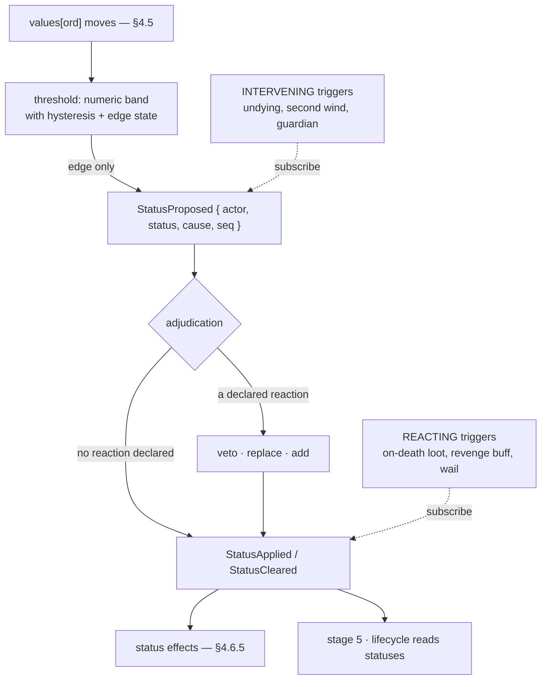

**Two subscription points, both on status, and the distinction is the one that matters:**

| | subscribes to | may | example |
|---|---|---|---|
| **intervening** | `StatusProposed` | veto, replace, or add — **before** the fact exists | 不死身: veto `Downed`, apply `SecondWind` at 1 hp instead |
| **reacting** | `StatusApplied` / `StatusCleared` | anything **except** unmake the fact | drop loot, enrage an ally, emit a death cry |

This is what `F8` was pointing at. The decision spec's stage 3 was drawn as *"declared reactions may
intervene here — mechanism DEFERRED"*, which left the chain unable to reach stage 4 at all. **The
propose→apply step is not the deferred part.** It exists with zero reactions declared, and it is exactly
where an ability plugs in later. `D-9` defers the *reaction vocabulary*, not the seam.

### 4.6.4 The status record

```
Status {
  kind:        StatusOrdinal   // DECLARED vocabulary, like every other identity
  magnitude:   i32             // per-mille or absolute, per the declaration
  source:      StatusSource    // which threshold / ability / actor / overlay caused it
  expiry:      Expiry          // Rounds(n) | UntilCleared | WhileProposed
  applied_seq: u64             // ordering, and the replay key
  applied:     AppliedEffects  // WHAT was applied — see below
}
```

**`applied: AppliedEffects` is the field that closes `A-1` from the status side.** A clear must remove
*exactly what was applied*, even if the manifest has moved underneath. Recomputing the effect from the
current declaration at clear time is how a buff becomes permanent after a balance patch — you remove a
+5 that was applied as +3. chaos stores the applied payload for this reason
(`resource_exhaustion.rs:139`), and it is one field.

**Stack policy is declared per status** (`Replace | Stack | Refresh | Ignore`), following `PL_006 §8.3`.
The engine closes the four behaviours; the author says which one each status uses — the same
mechanism/vocabulary shape as everywhere else in this document.

### 4.6.5 A status has two out-edges, and they are different kinds of write

```
                      ┌──▶ POOL: submits QuantityDelta each tick
   Status ────────────┤     poison drains hp · regeneration adds hp
                      │     (a submitter in §4.5.1's list — it does NOT write values[])
                      │
                      └──▶ DERIVED: contributes a StatModifier with
                            ModifierSource::Status
                            slow reduces speed · enraged raises strike power
                            (a contribution to the layered resolution, never stored)
```

The split matters because the two have different failure modes. A pool write is **stateful and
irreversible** — clearing a poison does not give back the hp it drained, and it should not. A derived
contribution is **recomputed** — clearing `slow` restores speed exactly, with no bookkeeping, because
nothing was stored. Conflating them is how a dispel either fails to restore a stat or refunds damage.

### 4.6.6 Re-entrancy: a status changes a pool, which can propose a status

```
poison applied → drains hp → hp crosses 10% → proposes `Wounded`
              → `Wounded` reduces regen → hp keeps falling → proposes `Downed` → …
```

This is a **wave**, not a stack, and it is the shape [`TRG-A1..A11`](../../../03_planning/LLM_MMO_RPG/33_trigger_group_order.md)
already designs: ordered groups, a **depth budget**, attribution by ownership. This document does not
re-design it — it records that the seam in §4.6.3 is where that wave model attaches, and that **a depth
budget is mandatory rather than a refinement**: without one, two statuses that each propose the other are
a hang, and the ruleset that produces it is authored content, not a bug in the engine.

### 4.6.7 What is NOT an actor-scoped trigger

*"At dawn"* · *"when the player enters this zone"* · *"when the market price crosses X"* bind to the
world, not to an actor's status. Those belong to the verb track ([`WSA-R18`](../../../03_planning/LLM_MMO_RPG/31_world_simulation_architecture.md),
and `35 §5.5`'s `QTY-D10`: *nouns here, verbs at WSA-R18*). The boundary this document draws is
deliberately narrow: **within an actor, a trigger binds to a status transition and to nothing else.**

A zone effect reaches the actor as a **contribution** through the context overlay (§4.5.4, §5) — it does
not need an actor-scoped trigger, and giving it one would create the second dialect `QTY-D10` forbids.

## 4.7 Who may read and write what, and **when**

§4.5.1 said *"one writer, many submitters"*. That is not yet a discipline: without a **when**, two
submitters racing inside one tick produce a different answer on a different machine, and "one writer"
guarantees nothing. This section answers the question directly — **no, a module may not write what it
likes when it likes** — and gives the contract that replaces it.

### 4.7.1 A tick is phased, and each phase has a fixed contract

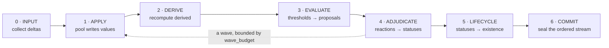

| phase | may READ | may WRITE | may EMIT |
|---|---|---|---|
| **0 · Input** | ruleset · actor state **as of the end of the previous phase-6** | the delta queue, nothing else | — |
| **1 · Apply** | the delta queue · ruleset | `values`, residue — **pool module only** | — |
| **2 · Derive** | `values` (post-apply) · modifiers · ruleset | the derived cache | — |
| **3 · Evaluate** | `values` · derived · `threshold_active` | `threshold_active` | `StatusProposed` |
| **4 · Adjudicate** | proposals · `statuses` · ruleset | `statuses` | `StatusApplied` / `StatusCleared`, and **new deltas → phase 1 of the next wave round** |
| **5 · Lifecycle** | `statuses` · ruleset | `existence` | `LifecycleTransitionRequested` |
| **6 · Commit** | everything | — | the ordered event stream |

**The rule that makes it deterministic, stated once:**

> **A module reads only the output of a completed phase, never the in-progress state of the current one.**

So a status effect submitting a poison delta does **not** see the damage applied in the same phase 1; it
saw the values as of the previous phase 6, and its delta lands in the next round of the wave. That is a
command buffer, and it is the difference between a tick that replays and a tick that depends on which
module the scheduler happened to poll first.

### 4.7.2 The ruleset is read-only for the whole tick

`Ruleset` is `Arc`-interned and immutable by construction — it is not `Copy` precisely so it is shared
rather than duplicated ([ruleset.rs:57-63](../../../../crates/ruleset-core/src/ruleset.rs#L57)). Three
consequences that must be said out loud, because each is a way to break replay silently:

1. **No phase writes the ruleset.** There is no runtime rules mutation. A `Forge:*` edit produces a *new*
   ruleset with a *new* digest.
2. **An epoch switch is INTER-tick, never intra-tick.** A reality moving from `D1` to `D2` does so
   between phase 6 and the next phase 0. A tick that began under `D1` finishes under `D1` — otherwise
   phase 3 could evaluate a threshold that phase 1 did not apply.
3. **Effective rules are frozen for the tick, overlay included.** The context overlay (§5) is re-resolved
   **on move**, and its digest is cached on the actor. Re-resolving per tick would make two modules in the
   same tick able to see different rules, which is the same defect as (2) at a smaller scale.

⇒ *"How does the ruleset act on things"* has a precise answer: **it does not act. It is read.** Every
module in every phase reads the same frozen bytes; all per-actor variation comes from the actor's own
`granted`, `values` and `RulesPin` — never from a different ruleset.

### 4.7.3 The deterministic function — how a law reads and writes

A law does **neither**. That is `IMP-D2`, and it is the shipped discipline in `game-rules`:

```
   ENGINE  (commit-service)                 LAW  (game-rules)
   ───────────────────────                  ─────────────────
   reads Actor, resolves values   ──────▶   fn(numbers…, &Rules) -> numbers…
   writes Actor from the result   ◀──────   never sees Actor, never sees the store,
                                            no clock, no ambient randomness
```

`resolve_attack`, `action_value`, `resolve_block` all take plain integers and a `&Rules` and return plain
integers. **The law cannot read state because it is never handed any**, which is why it can be replayed on
another machine and why `crate-purity-gate.py` can enforce the boundary as a link error rather than a
promise.

So the read/write question splits cleanly:

| | reads state | writes state | when |
|---|---|---|---|
| **law** (`game-rules`) | **never** | **never** | pure, callable at any phase |
| **module** (pool, status, lifecycle) | per §4.7.1 | per §4.7.1 | only in its own phase |
| **engine** (`commit-service`) | yes | yes | it *is* the phase runner |

### 4.7.4 What each violation of this looks like

Stated so the contract is testable rather than aspirational:

| violation | symptom | which phase rule it broke |
|---|---|---|
| a module holds `&mut values` and writes outside phase 1 | replay diverges on a different scheduler order | *one writer, phase 1* |
| phase 3 reads a value phase 1 has not finished applying | the threshold fires on a half-applied state | *read only completed phases* |
| an overlay re-resolved mid-tick | two modules see different rules in one tick | §4.7.2 (3) |
| an epoch switch lands mid-tick | phase 3 evaluates rules phase 1 did not use | §4.7.2 (2) |
| a wave round re-enters without decrementing the budget | a hang, authored in content | §2.6.9 |

**Each row is a V5 tick invariant** (§2.7), and each is checkable: the phase runner knows which phase it
is in, so *"a write arrived in the wrong phase"* is an assertion the engine can make about itself rather
than a convention reviewers must remember.

### 4.7.5 The honest gap

None of §4.7 exists in code. **⚠ The citation below is to a STUB (§15.1) — it does not evidence an incumbent design.** `CombatDomain::apply` ([law.rs](../../../../services/commit-service/src/domain/law.rs)) is a
single `match` over a payload that reads and writes `state.actors` directly, in one pass, with no phases —
which is exactly why an actor extracted mid-`Strike` produces a fabricated `Missed` (§7.2). **The phase
discipline is not a refinement of what runs today; it is a replacement for it.**

### 4.7.0 Phase 0 · **Resolve** — added by `O-37`+`O-38` (§18.1)

> **The tick gains a phase before Input, and every later phase number shifts by one.** Renumbering costs
> nothing today; the rule it buys is checkable rather than remembered.

| phase 0 does | phase 0 must **not** |
|---|---|
| fold this actor's **modifier rows** into `values[]` (`D-27`'s channel A) | run any law |
| refresh every **derived field** in the quantity block — `status_active` (from `PL_006`), `control` (from `control_binding`) | admit any input |
| evaluate modifier **`expiry`**, whose consequences enter this tick's wave under `O-10`'s budget | write anything durable (`§4.7.6`) |

**After phase 0 the quantity block is complete and self-contained.** That is what makes §4.7's *"a law
reads the quantity block and nothing else"* a property rather than an aspiration — and it gives every
channel-A projection exactly **one** computation point, so `D-27`'s *"a feature leaves rows, the engine
folds"* finally has a stated *when*.

**The cache rule this discharges** (`O-37`): a derived field in the quantity block is **reconstructible ·
never authoritative · refreshed at phase 0**. That is `P-F` applied inside a struct instead of inside a
snapshot — the same three obligations, one level down.

### 4.7.6 The scope of all of the above is **storage layer L1** — and the outer door is a LINK boundary (`P-B`)

§4.7 governs one thing: the tick over the resolved quantity block, in memory. It says nothing about how
those bytes reach durable storage, and a reader could take *"one writer, phase 1"* as covering that too.
It does not, and the outer boundary is enforceable far more strongly than a phase rule.

A seamless-world MMO backend, after ten iterations, states the rule flatly:

> **Simulation nodes never write to the database directly.** A central persistence service keeps live
> entities in an in-memory cache, serves them on request, and flushes changes to durable storage on a
> schedule.

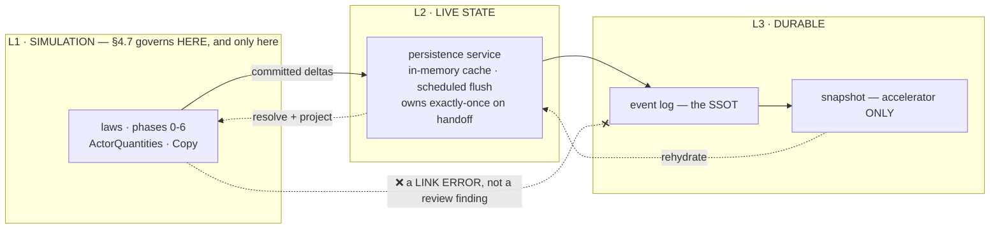

| | enforced by | failure mode if absent |
|---|---|---|
| phases 0→6 **inside** a tick | the phase runner asserting about itself (§4.7.4) | replay diverges on scheduler order |
| **L1 never writes L3** | **the dependency graph** — an L1 crate does not depend on the persistence client, so the call does not compile | a law silently persists, and durability becomes ordering-dependent |

**The second is the stronger guarantee and it costs nothing to have**: it is a crate boundary, checkable
by the same shape as `crate-purity-gate.py`, which already exists for `game-rules ⊥ ruleset-loader`. Today
neither `crates/` nor `services/` states it (`O-30`).

### 4.7.7 Who may WRITE what — the ownership rules the layers rest on (`D-36`..`D-39`)

The layer boundary above says *where* bytes may be written. This says *by whom*, and the two together are
the whole read/write discipline.

**There are exactly TWO sources of truth.** ① **Rules** — the pinned ruleset digest plus the content
manifest (`CPL-A8`). ② **Facts** — the event log. Nothing else is ever a source: aggregates, snapshots,
both kernel caches, projections, room state, FE context — **and `Domain::State` inside a running island**,
which is the fold-so-far and must be reconstructible from log + checkpoint or the island cannot be
restored.

> **This is not a proposal.** `load_aggregate` already reconstructs an aggregate by folding events with a
> snapshot fast-path, and `0004_aggregate_snapshots_table.up.sql` states it outright — ***"snapshots are a
> write-path cache, not the SSOT"***. `P-F` was written by this team before §6.1b derived it from Orleans.

| rule | what it forbids | why |
|---|---|---|
| **single writer** per aggregate/stream | a second component appending to the same stream | **replay**, not concurrency — two writers *"store interleaving events based on different states, and when replayed it is not possible to reconstruct the correct state"* |
| **declared readers** | a component reading an aggregate it has not declared | a sole writer still leaves **hidden contracts**; declaring readers makes a schema change's blast radius **computable** rather than greppable |
| **one rule for every derived copy** | treating any of §14.2's nine copies as a source | rebuildable · carries its `seq` · **discarded on divergence, never reconciled** — the SSOT wins by construction |

The first is already the corpus's rule (`EVT-A4`; `PL_005` §5.2 — the **aggregate owner** emits the
Derived event, never the interaction feature) and is checked nowhere (`O-49`). The second exists in no
form at all (`O-50`). The third is stated once, for `IslandCheckpoint` (`O-44`).

And it re-frames `O-9`: an atomic paired transfer across two islands does not need a distributed
transaction if the **handoff itself** is exactly-once — which is the guarantee Photon reports holding
*"including during a seamless transfer."* That is a third option the row never listed.

## 4.8 The relational family — **HANDED OFF, not designed here** (PO decision 2026-08-02)

> **⚠ THIS SECTION WAS A SPECIFICATION AND IS NOW A HAND-OFF.** It previously read *"Chosen: …"* four
> times. Those choices are withdrawn as **decisions** and kept as **findings** — see why below.

**PO direction, 2026-08-02:** opinion, reputation, emotion and the social layer are **a separate feature**
— an AI + emotion engine with its own social system and decision tree. They must **not** be folded into
actor core, or actor core becomes a burden. And the test the PO applied is the sharpest one available:

> **The game is playable without this feature.**

That is the scoping test, and it is decisive. Pools, status, lifecycle and control are load-bearing —
remove any of them and there is no game. Remove opinion and there is a game with flatter NPCs. **A thing
you can remove and still ship is not substrate.**

### 4.8.1 Why writing this section as decisions was itself the error

A separate feature gets a separate designer, and that designer would have inherited four *"Chosen: …"*
rulings made by someone who was not designing their feature and who reached them in an afternoon while
thinking about pools. **That is the same defect the corpus keeps re-learning under a different name** —
*the amendment table is an INDEX, never EVIDENCE.* A decision made outside the context that has to live
with it is a claim wearing a decision's costume.

So the prior art is kept, because it is genuinely useful and someone would otherwise have to go find it
again — but it is recorded as **what was seen**, not as **what was settled**.

### 4.8.2 What the survey found, recorded for whoever builds it

| system | how it stores a pairwise relation | why it is worth knowing |
|---|---|---|
| **flecs** (ECS, relationships first-class since 2021) | a **pair is the key** — two entity ids encoded into one 64-bit pair id, plus a *"reachable cache"* memoising propagation | a relation can be a storage citizen rather than a slot on one side |
| **Crusader Kings III** | opinion is **never a stored scalar** — a **list of timed modifiers** (`add_opinion = { modifier, years, target }`), folded on read | **N² never materialises**: no row for a pair that never interacted, and rows expire themselves. It also makes *"why does this NPC dislike me"* answerable, and lets a designer re-weight a cause and have every existing opinion correct itself |
| **Dwarf Fortress** | **8 short-term slots**; a new thought merges, fills an empty slot, or **overwrites the weakest**; strong memories promote to long-term at the **year boundary** | a hard per-actor bound with a principled eviction rule and an explicit promotion event |
| **`ACT_001` R8** (already in this corpus) | bounded LRU — ≤100 facts, ≤2000 chars, 30/90/365 fiction-day cold-decay | it is the Dwarf Fortress design, reached independently — a good sign for R8, and a ready-made pattern |

**The one asymmetry the receiving designer should weigh early:** *causes → level* is a function; *level →
causes* is not. A system that stores levels first and converts later can only ever synthesise a single
`legacy` cause, because the real ones were never written down. That is a **now-or-never** property, and it
is the only reason this would ever be urgent — it is not urgent for actor core, because actor core does
not store either.

### 4.8.3 Actor core's only remaining obligation: do not block it

Exactly as `D-9` treats the trigger mechanism — *do not build it; do not block the path either.*

| obligation | discharged by |
|---|---|
| relations are **not** quantities and must never occupy an ordinal slot | §3.3's exclusion table |
| the quantity block must not be the **only** place a designer can attach per-actor state | §8.1 — 31 aggregates, separate contexts, one shared id. The extension point already exists and is not the ordinal space |
| nothing in the tick may **require** an opinion to be present | §4.7's phases read the quantity block only. No law inputs a relation today |

**Nothing further is owed.** The relational family leaves this document's scope here.

## 5. The missing axis — context overlay

Rules are currently resolved **twice**: at S2 (manifest fold) and at S4 (archetype copy). Nothing resolves
against **where the actor is**.

```
                 S2 base ruleset (digest-pinned)
                            │
                            ▼
   actor's effective rules = base ⊕ overlay_stack
                                      ▲
                     ┌────────────────┴────────────────┐
                     │  zone / arena / instance / siege │
                     │  declared, ordered, digest'd     │
                     └──────────────────────────────────┘
                            re-resolved on MOVE, not on tick
```

Without it these are all inexpressible: an arena softening death · a safe zone suppressing a threshold ·
a dungeon modifier · a PvP flag · a sect-territory qi bonus · a `Locus` village under siege.

`PO-2` as written **forecloses** it — *"after spawn the actor does not consult it"* — but the Bethesda
analogy `PO-2` rests on carries the counter-example: a base form is fetched at spawn, and a **cell still
applies its own rules to whatever walks into it**. Copy-at-spawn is about the *template*; it was never
about the *world*.

`overlay: OverlayDigest` in `RulesPin` is the whole cost. It is recomputed on move, not per tick, and it
makes the passivate/restore test have a real subject.

### 5.1 Two layers: the kind is manifest, the instance is world

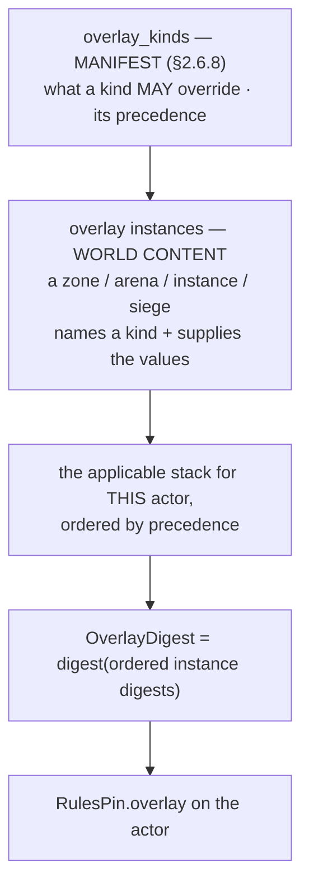

The split matters: **the manifest constrains what any overlay may do; the world says which ones apply
here.** A zone cannot invent a new override power, because `may_override` is a closed set fixed by the
ruleset the zone lives in.

**Overlay instances are content-addressed, like rulesets.** They must be — `RulesPin.overlay` is a digest,
and a digest of mutable content is a lie. An instance is immutable; a siege *starting* replaces which
instances apply, it does not edit one in place.

### 5.2 The stack digest, and its tie-break

```
applicable = [instances whose condition holds for this actor]
sorted     = applicable ordered by (kind.precedence DESC, instance_digest ASC)
overlay_digest = digest(sorted.map(|i| i.digest))
```

Two overlays at equal precedence must still have a total order, or two nodes compose them differently and
replay diverges. **The tie-break is the instance digest's bytes** — deterministic, needs no extra
declaration, and cannot drift the way an insertion order would. This is the same reasoning that put
threshold tie-breaks on `threshold_id` bytes rather than on an ordinal (`M-1`).

An actor under no overlay carries the digest of the empty stack, **not** `None` — the same discipline
`zero-digest-gate` enforces elsewhere: *"not applicable"* and *"none"* must not share a spelling.

### 5.3 Re-resolution is INTER-TICK, exactly like an epoch switch

The set of applicable overlays changes in two ways, and only one of them is a movement:

| trigger | example |
|---|---|
| the **actor** moved | walking into an arena, entering an instance |
| the **world** changed under a stationary actor | a siege begins, a PvP flag flips, night falls on a cursed zone |

So *"re-resolved on move"* was too narrow. The real condition is **the applicable set changed**, and it is
evaluated **between ticks** — §4.7.2 (3) requires effective rules to be frozen for the duration of a tick,
or two modules in one tick read different rules.

> **An overlay change and an epoch switch are the same kind of event**: the rules an actor runs under
> moved. Both are inter-tick, both rewrite `RulesPin`, both must be recorded so replay can resolve the
> ordinals that follow. The difference is only scope — an epoch switch is per-reality, an overlay change
> is per-actor.

### 5.4 An overlay composes with the SPEC, never with the state

This is the property that keeps the whole thing tractable:

```
   ceiling(actor, ord)  =  resolve( base.pool_spec[ord] ⊕ overlay )     ← rules side
   values[ord]                                                          ← state side, untouched
```

**Entering a zone never changes your hp.** It changes your *max* hp, your regen rate, your threshold
bands — the lens through which your unchanged numbers are read. An overlay that could write `values`
would be a world that heals you for walking through a door, and it would make the actor's diverged state
(§4) unattributable: you could no longer tell what the actor accumulated from what a zone handed it.

### 5.5 What happens to a value when its ceiling moves — already solved, and we should not re-solve it

Leaving a zone that raised your ceiling leaves `values[ord]` above the new ceiling. `RES_001` §4.1 already
locked the two rules for exactly this case, for equipment rather than zones:

| | rule | why |
|---|---|---|
| ceiling **increases** | `current` is untouched | *growth does not heal* — otherwise an equipment swap is a heal exploit, and so is walking in and out of a shrine |
| ceiling **decreases** | `current` clamps, and **`OnZeroEffect` does not fire** | *a clamp must never kill; only damage does* |

The second rule has a direct consequence for §4.5.3: **a clamp caused by a ceiling change produces no
routed residue.** Residue flows along the absorption chain because something *hit* the pool; a ceiling
moving underneath it is not a hit, and routing that residue would let a player take damage by leaving a
buff zone.

⇒ `QuantityDelta` needs to distinguish *a hit* from *a re-ceiling*. That is `flow_kinds` (§2.6.7) doing a
second job, and it is why the flow kind belongs on the delta rather than on the quantity.

### 5.6 The identity invariant — what an overlay may NEVER do

> **An overlay changes how an actor BEHAVES. It never changes what an actor IS.**

Never: declare an identity · grant or revoke a quantity · move an ordinal · change tier · change which
lifecycle machine an actor follows.

Each of those would make the same actor a *different* actor depending on where it stood, which breaks the
one thing `RulesPin` exists to make answerable. The closed `may_override` set (§2.6.8) is what enforces
it — and its being closed is the enforcement, not a note in this document.

**A corollary worth stating, because the obvious modelling is wrong:** *"in this arena, death is not
real"* must **not** be an overlay editing the lifecycle machine. It is an overlay changing the threshold's
`proposes` field — from `Downed → Dead` to `Downed → Yielded`. Same machine, same states, different
proposal. `OverlayField` therefore includes `ThresholdProposal`, and the lifecycle machine stays outside
what an overlay may touch.

### 5.7 Worked: the arena

```
overlay_kinds:  arena { may_override: [ThresholdProposal, StatusEffect, ActionBlock], precedence: 30 }

instance arena_of_the_azure_sect:
    threshold("hp", "at_zero").proposes  :=  Yielded      // was Dead
    status("yielded").effects            :=  [BlockActions{ all }]
    action_block                          :=  [lethal_intent]

actor walks in  → applicable set changed → inter-tick re-resolve
                → RulesPin.overlay := digest([arena_instance])
                → RulesPinChanged recorded

actor's hp reaches 0
                → threshold edge (unchanged arithmetic, §4.5)
                → proposes `Yielded`  (overlay, not base)
                → adjudication → StatusApplied{ yielded }
                → lifecycle reads statuses: no transition to a terminal state
                → the actor is out of the fight and alive

actor walks out → re-resolve → RulesPin.overlay := digest([])
                → hp is still 0, `yielded` still applied
                → the base machine now WOULD propose `Dead` on the next crossing —
                  but a crossing is an EDGE, and hp did not cross again
```

That last line is the one that makes the design hold together: **because proposals are edges rather than
levels (§4.6.3), leaving the arena does not retroactively kill the actor.** A level-based design would
re-evaluate `hp ≤ 0` under the new rules and fire immediately. The edge discipline was adopted to bound
event volume; it turns out to be what makes overlays safe to leave.

## 5.8 Lifecycle, drawn — and `O-1` resolves itself once it is

The decision spec asserted three axes and named them; it never drew what data each one governs. Drawing
it is what separates them, and it dissolves the contradiction the lifecycle red team called fatal.

### 5.8.1 The three axes govern three different questions about data

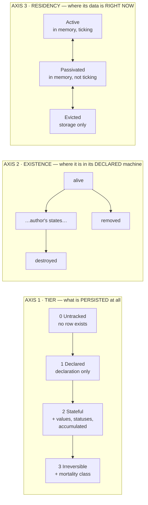

| axis | the question it answers | closed by | who moves it |
|---|---|---|---|
| **1 · Tier** | *what of this actor is persisted at all* | **mechanism** — a persistence ladder, engine-owned | attention (`ONT-D1`), capacity caps, cold-decay demotion |
| **2 · Existence** | *where it is in the machine its reality declared* | **vocabulary** — declared states and transitions | in-fiction events: death, admin, an author's own transition |
| **3 · Residency** | *where its bytes are, this instant* | **mechanism** — closed, engine-only | the scheduler, memory budget, an observer's proximity |

The red team's `F-6` said axis 1 was two axes. It was: the **tier ladder** and the **declared state
machine** were fused. They are not the same question — a tier says *how much of this actor is real*, a
state says *what has happened to it*. `Irreversible + destroyed` and `Stateful + destroyed` are now
trivially representable, and they differ exactly where doc 29 says they should: whether the reality's
declared machine offers a transition back out of `destroyed`.

> **Tier does not add states. It gates which declared transitions are enabled.** A tier-3 actor's machine
> has no edge out of its terminal state; a tier-2 actor's may. That is what *"can be permanently lost"*
> ([29:57](../../../03_planning/LLM_MMO_RPG/29_ontology_existence_self_others.md)) means, expressed as a
> property of the transition set rather than as a fourth state nobody can place.

### 5.8.2 What data exists, per tier

```
tier 0  Untracked      ─  no row.  id = blake3(reality ‖ cell ‖ day ‖ slot).
                          Regenerated on demand, identical every time. Nothing to store.

tier 1  Declared       ─  RulesPin + archetype ref.
                          values are EVALUATED from the declaration, never stored.
                          "It exists the way a train timetable exists."

tier 2  Stateful       ─  + values[32], granted, threshold_active, statuses, existence
                          The first rung where the world is CHANGED by the player.

tier 3  Irreversible   ─  + mortality class  ⇒ the declared machine loses its way back.
```

**A promotion is a widening, never a rewrite.** Tier 1 → 2 materialises the evaluated values into stored
ones; the id and the pin do not move. That is what makes attention-promotion safe: the player's villager
keeps being the same villager.

> **CORRECTED 2026-08-02 — this paragraph contradicted `D-23` for twenty sections and I left it standing
> after recording the clash as `ST-6`. That is the rot this round exists to clear, committed by me.**
>
> **`D-23` (PO): canon is what is written to the LEDGER.** A tier-2 row is a **fold over the ledger**, so
> demoting an idle Minor drops a **cache**, not canon. The text below said the opposite — that demotion
> *"destroys canon"* — and both cannot be true.

**A demotion drops a materialised row, and `D-23` is what makes that safe.** `AIT_001:204` demotes an idle
**encounter-promoted** Minor with no PC interaction back to Untracked, lazily at observation (`TDIL-A11`,
explicitly **no scheduler**), and **canonically-declared Tracked NPCs are permanent in V1**. What is
dropped is derived state; anything written to the ledger is untouched and re-foldable.

**The mechanical condition, which is `O-1b2`:** demotion is lossless exactly when materialised state is a
pure function of *(ledger entries, `RulesPin`, elapsed fiction time)* — and `O-20`'s invertibility
restriction is what makes the elapsed-time term closed-form. **If that does not hold, the defect is the
unlogged state, not the demotion.** And `ST-1` is the standing threat to it: a truncated ledger makes the
re-fold return a different actor wearing the same id, which is why `D-61`'s snapshot-before-drop is a
prerequisite for this paragraph being true at all.

### 5.8.3 What data is where, per residency

```
                    ┌──────────── in memory ───────────┐   ┌─ durable ─┐
  Active     ticking │ values · granted · thresholds ·  │   │  the same │
                     │ statuses · existence · RulesPin  │   │  as a row │
                     └──────────────────────────────────┘   └───────────┘
                                    ▲   │  idle, or the last observer left
                    observer / message   ▼
  Passivated  quiet  │ same bytes, no tick, INPUT BUFFERED │  same row
                     └──────────────────────────────────┘
                                    ▲   │  memory pressure (LRU / budget)
                    first message    ▼
  Evicted            │            nothing              │   │ the row IS  │
                     └──────────────────────────────────┘   │ the actor   │
```

Three obligations fall straight out of the picture, and each was a red-team finding with nowhere to live:

1. **`Passivated` must buffer input** — an actor that cannot receive while quiet loses the interaction that
   would have woken it. This is Akka's `Passivate` buffer, and it is why `Passivated` is a distinct state
   from `Evicted` rather than a nicer word for it.
2. **`Evicted` requires the row to be complete** — every field above must round-trip, or eviction is data
   loss. `Actor` does not implement `Serialize` today ⇒ **eviction is not yet reachable**, and saying so is
   more honest than drawing an arrow to it.
3. **The residency ladder needs a budget** — Vue's LRU `max`, Akka's idle timeout. `TierCapacityCaps` caps
   **tier**, not residency. Nothing caps this axis today.

### 5.8.4 The two triggers that looked like one

The lifecycle red team's fatal finding was that the invisibility law and `ONT-D1` are *"the same trigger
with opposite requirements"* — attention arriving must change the fiction, and residency restore must not.

Drawing the axes separates them, because they were never the same event:

| player does | axis touched | fiction-visible? |
|---|---|---|
| **walks past** a villager — proximity | **3 · Residency**: `Evicted/Passivated → Active` | **no**, and that is the law |
| **interacts meaningfully** — talks, trades, fights, befriends | **1 · Tier**: `Untracked → Stateful` (`ONT-D1`) | **yes**, and that is the entire point of `ONT-D1` |

Proximity is not interaction. A cell-load makes a hundred actors resident and promotes none of them;
befriending one promotes exactly one and does not change anyone's residency. **The contradiction was an
artifact of one field answering both questions** — which is the same defect, at the trigger level, that
`Suspended`-next-to-`Destroyed` was at the state level.

⇒ **The invisibility law survives, narrowed to axis 3 only**, where it is coherent: *a residency movement
emits no fiction event and changes no fiction-visible value*. Tier and existence movements are **supposed**
to be visible; the law never applied to them, and the decision spec's error was scoping it to "axis 2"
when axis 2 was two things.

### 5.8.4b The same law splits the two CLOCKS, and they had one name (`P-E`)

Applying §5.8.4's discriminator a second time resolves what `O-26` posed as a single problem. Two
different things make a tick non-uniform across actors, and they are **opposite in classification**:

| | what varies | decided by | fiction-visible? | ⇒ |
|---|---|---|---|---|
| **simulation LOD** — actor tier + residency | **how often** we compute, and how coarsely | the platform, from budget and distance | **no** | **config** — outside the digest |
| **fiction dilation** — `TDIL_001`'s 4-clock model | **how much in-world time passes** per unit of real time | the **rules** — a realm where a year passes in a day | **yes, it is the mechanic** | **hashed into the digest** |

Prior art confirms the first is a real technique and not an excuse: *AI Level of Detail* adapts inference
precision per NPC by distance, and entities further away are *"updated at a slower rate or in coarser
detail."* That is legitimate **precisely because** it is invisible — which is §5.8.4's law, load-bearing
for the third time.

⇒ **They must never share a field.** A single `tick_rate` on the actor would put a config value inside the
hashed rules or a rules value outside them, and either direction is a defect. This is the same shape as
§5.10.7's two budgets, decided by the same discriminator.

**What survives of `O-26` is sharper and is `O-26b`:** with dilation, `settle`'s elapsed span is
**per-actor and a function of where the actor was**. Two actors passivated on the same tick and restored
on the same tick can owe different amounts of fiction time. §5.9 takes one span.

### 5.8.5 The law now has a testable subject

The red team's other objection stands regardless: the law had no mechanism. With residency isolated, it
has one, and it is the metamorphic test they proposed:

```
replay(inputs)                              → event stream A
replay(inputs, adversarial_residency_oracle) → event stream B
      where the oracle passivates and restores EVERY actor at EVERY tick boundary
assert A == B
```

The subject exists — `CombatEvent` derives `Serialize` — and it **reds today**, on both known violations:
an actor extracted mid-tick emits a fabricated `Missed` ([law.rs:157-180](../../../../services/commit-service/src/domain/law.rs#L157)), and
`Actor::absent()` ([actor.rs:114](../../../../services/commit-service/src/domain/actor.rs#L114)) can fabricate a `Victory`. A bite test that is
already red before the guard ships is the strongest form this repo recognises.

### 5.8.6 Cascade is per axis, and the three are different operations

```
tier demotion    (1)  →  held entities are UNAFFECTED. A holder losing persistence
                          does not un-persist what it holds; the hold moves or orphans.

existence        (2)  →  the DECLARED cascade policy for the target state runs:
                          Drop | Cascade | Suspend | Keep — the author's choice per state.

residency        (3)  →  the held subtree follows, with NO fiction effect and NO
                          policy choice. There is exactly ONE residency cascade and
                          the author does not pick it. (Vue deactivating a subtree.)
```

`PO-4` asked whether four cascade policies were enough. The answer the drawing gives: **four is the right
count for axis 2, and the other two axes do not use that set at all** — axis 3 has exactly one behaviour,
axis 1 has none. The original question could not be answered because it assumed one axis.

**`HolderCascade` stays the one engine-owned reason**, and it now has a precise meaning: it is emitted by
the axis-2 cascade. Axis-3 cascade emits nothing at all, by the law.

### 5.8.7 Where lifecycle sits in the flow

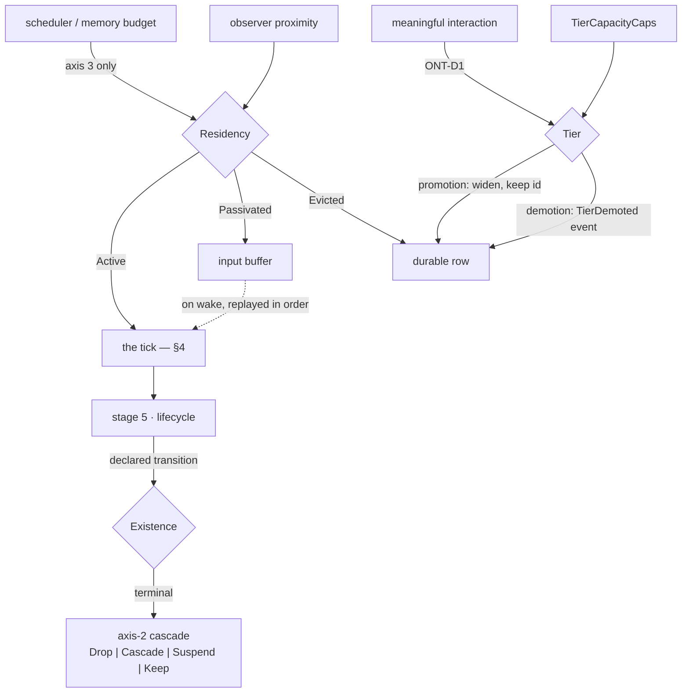

The tick reads and writes **existence** only. **Tier** is moved by interaction and by capacity, outside the
tick. **Residency** is moved by the scheduler, outside the tick and outside the fiction. Three movers,
three axes, no field answering two questions.

## 5.9 The observer, and what happened while nobody was looking

The lifecycle drawing (§5.8) says an actor can be `Passivated`, `Evicted`, or sit at tier 1 and never
tick at all. It does not say **what its state is when someone finally looks**, nor **who computes it**.
That gap is where a persistent world is usually won or lost, so it needs the same treatment as the rest.

### 5.9.1 The actor is DATA. It does not reconstitute itself.

> **An actor has no behaviour.** It is a struct (§3). If reading an actor could advance it, then reading
> would have a side effect, reading twice would differ from reading once, and *"what is this actor's hp"*
> would depend on who asked and when. Lazy evaluation with hidden mutation is one of the oldest ways to
> lose determinism, and it would defeat every guarantee §4.7 just established.

So reconstitution is a **module**, and this section names it and bounds it.

### 5.9.2 Three different mechanisms, and naming which applies when is the whole design

*"Making up what happened"* is not one operation. It is three, with different guarantees, and conflating
them is what produces a world that contradicts itself:

| # | mechanism | applies to | determinism comes from | is it canon? |
|---|---|---|---|---|
| **1 · EVALUATE** | the state was never stored; it is a pure function of the declaration and *now* | **tier 1 · Declared** | the declaration + a per-actor jitter | nothing to commit — it is recomputed identically forever |
| **2 · SETTLE** | the state was stored at `t0`; advance it in **closed form** to `t1` | **tier 2+**, passivated or evicted | algebra over the pinned ruleset | **yes — it must be committed** (§5.9.5) |
| **3 · GENERATE** | there is no state and no declaration; synthesise one | **tier 0 · Untracked** | a seed: `blake3(reality ‖ cell ‖ fiction_day ‖ slot)` | no — tier 0 has no row, and *"it never existed"* |

Doc 29 already fixes 1 and 3. Tier 1 is *"`ScheduledActionDecl` + deterministic per-NPC jitter,
**evaluated**, never ticked — it is always exactly where it should be"*; tier 0 is the hash-seeded crowd.
**What has no owner is 2**, and 2 is the one that touches stored state.

### 5.9.3 The reconstitution module — its role, stated as a boundary

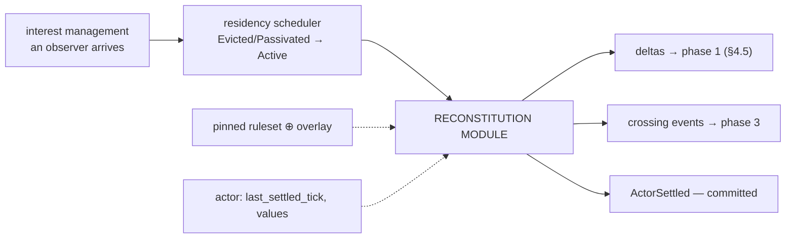

```
settle(actor_state, from_tick, to_tick, &Rules) -> (deltas, crossings)
```

**Pure.** It reads the actor's stored values and `last_settled_tick`, reads the pinned rules, and returns
what *would* have accrued. It writes nothing. The engine submits the deltas through the ordinary phase-1
path — **settling gets no private write channel**, so it inherits the clamp, the absorption chain and the
threshold evaluation for free.

| module | owns | must **not** |
|---|---|---|
| **Actor** (data) | `values` · `granted` · `statuses` · `RulesPin` · `last_settled_tick` | compute anything, ever |
| **Interest management** | who can perceive what; requesting a restore | change tier, or change the fiction |
| **Residency scheduler** | `Active ⟷ Passivated ⟷ Evicted`, budgets, eviction policy | emit any fiction event (§5.8.4) |
| **Reconstitution** | *when* a settle is owed · the closed-form advance · the crossings it skipped | invent anything with no closed form (§5.9.4) |
| **Pool module** | applying the deltas it is handed | decide when a settle is owed |
| **Generation** (`AIT_001`) | tier-0 synthesis from a seed | persist anything |

The seam that makes this hold: **interest management triggers residency; residency triggers
reconstitution; reconstitution produces deltas; the pool module applies them.** Four modules, one
direction, no module reaching backwards.

### 5.9.4 What has no closed form is NOT accrued — and this is a design commitment, not a limitation

A pool regenerating has a closed form. *"Did anyone buy the merchant's sword while you were away"* does
not. There are exactly two honest options, and the third one — the tempting one — is a bug:

| option | verdict |
|---|---|
| **accrue nothing** — the unobserved actor gains only what algebra can produce | ✅ this is tier 1's own rule: *"Nothing that happened to it is remembered. It exists the way a train timetable exists."* |
| **generate a history, and COMMIT it** | ✅ legal, but it is now canon and must be an event, with a seed, ordered |
| *"compute a plausible past when someone looks, without committing"* | ❌ **the bug.** Two observers arriving at different times compute different pasts, neither is in the log, and replay reproduces neither |

> **The rule: a reconstitution that is not committed must be a pure function of `(stored state, pinned
> rules, Δt)` and nothing else.** The moment it needs a seed, a random draw, or a world query, it is
> *generation* and it must be committed.

That single sentence is what keeps the world from quietly forking.

### 5.9.5 Settling is committed, and that is what makes it idempotent

```
ActorSettled { actor, from_tick, to_tick, deltas_applied, cause }
```

Without it, two observers arriving at `t=100` and `t=200` could each settle **from `t=0`**, and any
path-dependence — a threshold crossed in between, a status applied, a clamp — would give them different
answers. With it, `last_settled_tick` advances once, the deltas are in the log, and the second observer
settles from `100`, not from `0`.

Cost is bounded because **a wake is rare** — it happens when an observer arrives, not per tick — and this
is precisely what makes the offline-catch-up case auditable instead of mysterious.

### 5.9.6 The constraint this places back on regen shapes — `case04 ⊥ case05`, made concrete

`settle` must return **crossings**, not merely an endpoint. Applying 1800 ticks of regen in one O(1) step
and skipping every threshold edge in between is the contradiction the prior-art red team found between
§6's rows 4 and 5.

So the closed form must be **invertible**: given a band `b`, solve `value(t) = b` for `t`.

| shape | endpoint | invertible for crossings? |
|---|---|---|
| `Flat { rate }` | `v₀ + rate·Δt`, clamped | ✅ trivially |
| `PerMille { rate }` of a fixed ceiling | geometric approach | ✅ closed-form log |
| `Log { base, difficulty }` (`CurveKind`) | diminishing approach | ✅ but needs care in integer maths |
| an arbitrary author-supplied curve | — | ❌ |

⇒ **`RegenSpec` admits only invertible shapes**, and that is a resolve-time (`V1`) check, not a runtime
discovery. This is the concrete form of a constraint §6 previously stated as a wish.

### 5.9.7 What an observer's arrival does, in order

```
1. interest management   observer enters range  →  request restore
2. residency scheduler   Evicted → Active       →  load the row.   EMITS NOTHING (§5.8.4)
3. reconstitution        settle(from=last_settled_tick, to=now)
                                                →  deltas + crossings
4. phase 1               deltas applied, clamped, residue routed
5. phase 3               the skipped crossings replayed IN ORDER  →  proposals
6. phase 4-5             statuses, lifecycle — the actor may die of a poison
                         it "took" three days ago, and the log says so
7. commit                ActorSettled + everything it caused
```

**Step 6 is the payoff and the reason the ordering matters.** An actor that was poisoned, passivated, and
settled three fiction-days later must resolve the death that the poison caused — at the crossing time, not
at the wake time — or the world is a place where hiding from the simulation makes you immortal.

**And step 2 emitting nothing is what §5.8.4's invisibility law means in practice.** The restore is
invisible; everything visible afterwards was caused by the *settle*, which is a separate, committed,
auditable act. The two were fused in the decision spec, which is why the law looked contradictory there.

## 5.10 Control — who is driving this actor

§5.8 drew three axes and §5.9 said the actor is data with no behaviour. Both are right, and together they
leave a hole: **if the actor does nothing by itself, something must supply its intent.** Nothing in the
structure says what. An actor with no controller is inert — it can be damaged, it accrues by `settle`, and
it never *acts*.

### 5.10.1 Control is a fourth axis, orthogonal to the other three

| axis | question |
|---|---|
| 1 · Tier | what is persisted |
| 2 · Existence | where it is in its declared machine |
| 3 · Residency | where its bytes are now |
| **4 · Control** | **who supplies its intent** |

Orthogonal in both directions, and the combinations are all real: a tier-3 alive Active actor with **no**
controller stands there; an offline player's character is tier 3, `Passivated`, and its control binding is
the thing that must decide what happens next; a village (`ActorKind::Locus`) is rule-driven or
language-driven while never being a person.

### 5.10.2 The controller kinds — and the split that actually matters

```
Control =
  | None                                   // inert: acted upon, never acting
  | Player   { session: SessionId }
  | Scripted { schedule: ScheduleRef }     // tier 1's ScheduledActionDecl, promoted to a controller
  | RuleBased{ policy:   PolicyRef   }
  | Language { model:    ModelRef, roster_slot: u8 }
```

The kinds are **mechanism** — closed, because the engine must reason about each. Which actor gets which
is **vocabulary** (archetype default) plus runtime binding.

**The split that decides the architecture is not player-versus-AI. It is oracle-versus-function:**

| | intent is | replay | in the log? |
|---|---|---|---|
| `Scripted` · `RuleBased` | a **pure function** of `(state, pinned rules)` | **recomputes** it | no — recomputable |
| `Player` · `Language` | an **external oracle** | **replays the recorded intent** | **yes — it is input** |

> **An LLM decision is input, exactly like a keystroke.** Replay must never re-call the model. The chosen
> action enters the input log and is replayed from there.

This is the same rule §5.9.4 states for reconstitution — *"the moment it needs a seed, a random draw, or a
world query, it must be committed"* — arriving at the control axis. An LLM is the most external oracle in
the system: not merely non-deterministic but **non-reproducible even by itself**, since a model version
can change underneath. Recording the decision rather than the prompt is what makes an LLM-driven world
replayable at all.

### 5.10.3 One controller *per actor* — but a controller holds many actors

> **⚠ CORRECTED 2026-08-02 by the §8 census. This section first read *"`Control` is a single field, not a
> set"* and derived that from a race argument. The race argument is sound and survives; the **field**
> is wrong, and the corpus had already ruled on it.**

`control_binding` is a **registered aggregate** (T2 / Reality, owned by `ACT_001`, `SPG-R6` / `SPG-A10`,
commit `3864ade0a`) — and it is **many-to-many by construction**:

```rust
pub struct ControlBinding {
    pub controller_id: ControllerId,   // the persistent identity; the BODY is not
    pub actor_id: ActorId,             // Pc, Npc, or (WSA-R21) Locus
    pub since: FictionTime,
    pub authority: ControlAuthority,   // Full | Pilot | Puppet { expires_at } | …
}
```

The two cardinalities are **different questions**, and collapsing them is what a field does wrong:

| direction | cardinality | why |
|---|---|---|
| actor → controller | **≤ 1** | two intent sources for one body is an unresolvable race — my original argument, and it holds |
| controller → actor | **N** | 分身 *(fēnshēn — a cultivator's split body: one mind animating a second physical form)*: one controller, two actors, two frames — **a core mechanic**, per PO decision 2026-07-29 |

A field on the actor can express the first and **cannot express the second**. A relation expresses both:
the ≤1 constraint becomes a uniqueness index on `actor_id`, not a type. So the `V0` claim downgrades to
`V1` (a schema constraint), and I should not have called it type-enforced.

One mechanism then covers what looked like six: 分身 · a dying elder seizing a disciple's body · the
`ACT-D1` logout→LLM handover · `pc_mortality_state`'s **Ghost** (a controller *between* bodies) · demonic
puppetry · mounts (`TVL_003`) · and a captain steering a ship, whose interior is a map (`SPG-A1`).
`ControlAuthority` is the vocabulary axis under this — the engine closes *binding*, the manifest declares
*what a Puppet may do*.

**The consequence that is not optional** (`SPG-A11`): interest/AOI keys on the **controlled actor**, never
on the account. A controller with two actors in two frames has two independent interest sets; key it on
the account and the 分身 never receives its own frame's updates. And a **per-controller** rate limit must
exist beside per-actor validation, or possession is sanctioned multiboxing.

### 5.10.4 The Director — the module that owns control, and its boundary

The actor holds the **binding**. It does not choose it. A module does:

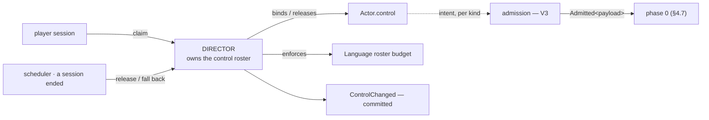

> **§8 census note.** "Director" is my name for a role the corpus already assigns: `control_binding` is
> `ACT_001`-owned, and the driver contract is `AGT-A1..A6` (`11_agent_decision_standard.md`) —
> `decide(DecisionContext) → Decision`, four drivers (`Llm` / `Script` / `Engine` / `Human`,
> runtime-swappable per `AGT-A3`). **Do not introduce a new module name for it.** What is genuinely
> missing is below the table: nothing in `AGT-*` says how replay treats the four drivers differently.

| module | owns | must **not** |
|---|---|---|
| **Director** (= `ACT_001` `control_binding` owner + `AGT-A3` driver assignment) | the control roster · binding and release · the `Language` budget · emitting `ControlChanged` | supply intent itself, or bypass admission |
| **Player ingress** | turning a human action into a payload | write actor state |
| **Rule-based policy** | a pure `fn(state, &Rules) -> payload` | read a clock, or anything outside its arguments |
| **Language driver** | prompting a model, recording the decision **as input** | be re-invoked during replay |
| **Actor** | holding `control` | change it |

### 5.10.5 Every controller passes the same gate — and this is already shipped

Intent from a player, a policy and a model all become a payload that must pass **admission**. This is not
new discipline: `Admitted<D>` and the turn-slot economy already exist, and `IAS-A9`'s reason for them is
exactly this symmetry — the turn economy *"binds NPCs exactly as it binds players"*
([actor.rs:40-51](../../../../services/commit-service/src/domain/actor.rs#L40)). **⚠ RETRACTED as evidence (§15.1 #2): that file is a STUB, so *"already shipped"* was false. The symmetry argument stands on `IAS-A9` alone.**

It is also already an **axiom**, not just an implementation: `AGT-A6` — *"A Decision is a request, never a
write"* — a driver emits a **Proposal** (`EVT-T6`) and commit-service authorizes and executes it. Which
means §4.6.3's propose→adjudicate→apply is not a shape this spec invented for statuses; it is the shape
the whole decision layer already runs on, and statuses are one instance of it.

⇒ **An LLM cannot act more often than a player, cannot skip a cost it cannot pay, and cannot take an
action its actor has no pool for.** The controller decides *what to attempt*; the rules decide *what is
permitted*, and they are different layers on purpose. A model that hallucinates an impossible action gets
a refusal, not a special case.

### 5.10.6 What the corpus already has, and where it is fused

| shipped / designed | what it really is | problem |
|---|---|---|
| `ActorCore.current_session_id: Option<SessionId>` | a `Player` binding | **fused**: it also means *"this NPC is in a session"*, so one field answers *who drives* and *where it is being observed* |
| `AIT_001` `NpcTrackingTier{Major, Minor}` + `PromptDetail{FullPersona, Condensed, SummaryLine}` | the **`Language` controller's fidelity** | filed under **tier** (axis 1), so LLM richness is coupled to persistence depth |
| `actor_chorus_metadata` — *"AI-drive metadata"* | `Language` controller configuration | sparse side table, not a binding |
| `ACT-D1` — *"AI-controls-PC-offline"*, deferred | a **control transfer** `Player → RuleBased/Language` | already anticipated; it is a transition on this axis, and the axis has no home |

`ACT-D1` is the strongest evidence the axis is real: the corpus deferred a *transition* on an axis it never
declared. `PromptDetail`-under-tier is the same defect §5.8 found — a field answering two questions.

### 5.10.7 Two budgets, opposite answers, and the invisibility law is the discriminator

`O-1d` filed the residency budget as **platform config**. The `Language` roster cap looks identical and is
**not**:

| budget | changes the fiction? | ⇒ |
|---|---|---|
| residency LRU / idle timeout | **no** — §5.8.4's law says an axis-3 move emits nothing | **platform config** |
| `Language` roster cap (`TierRosterCaps` 5/8/12) | **yes** — an NPC with `SummaryLine` instead of `FullPersona` *talks differently*, and a player can tell | **rules — hashed** |

Two budgets, same shape, opposite classification — and **the invisibility law is what tells them apart**.
That is a good sign for the law: it earns its place by deciding a question that was otherwise a coin flip.

`AIT_001` already puts `TierRosterCaps` in the manifest, which this analysis confirms as correct. It also
means an operator **cannot** turn LLM richness down to save money without changing the reality's digest —
which is the honest consequence, not an oversight to route around.

### 5.10.8 Transfer is an event

```
ControlChanged { actor, from: Control, to: Control, reason, seq }
```

Claiming, releasing, possession, an offline fallback and an admin override are all one event. It must be
committed because control decides **whether replay recomputes intent or reads it** (§5.10.2) — a replayer
that does not know an actor was `Language`-driven between `seq` 400 and 900 cannot know to read those
decisions from the log instead of recomputing them.

**This makes `ControlChanged` load-bearing for replay in a way that is easy to miss**: it is not
bookkeeping about who was in charge, it is the switch that tells the replayer which of its two modes to
use for that span.

## 6. S6 — commit and replay

§4.7 placed a stack of obligations here — a monotonic `seq`, an ordering that survives a wave, an
idempotency key, a pin on every event — and this section carried three lines. It is the layer that decides
whether any of the determinism above is *observable*, so it needs the same treatment as the rest.

### 6.1 Two different replays, and only one of them needs determinism

This distinction is not drawn anywhere in the corpus, and conflating the two is why *"replay"* keeps
meaning different things in different documents:

| | **recovery replay** | **verification replay** |
|---|---|---|
| input | the committed **event** log | the committed **input** log |
| what it does | re-applies events to rebuild state | **re-runs the laws** and compares the event stream it produces |
| needs the laws to be deterministic? | **no** — the events already say what happened | **yes** — this is the whole point |
| needs the ruleset resolvable? | yes, to interpret ordinals | yes |
| what it proves | the state can be reconstructed | the engine has not drifted |

`EVT-A9`'s *"replay as the recovery model"* is the first. `DF7-V4`'s byte-identical assertion, the
conformance oracle, and §5.8.5's metamorphic passivation test are all the second. **§4.7's phase
discipline is load-bearing only for verification replay** — recovery would survive a non-deterministic
engine, which is exactly why it is the weaker guarantee and must not be cited as if it were the stronger.

> **Confirmed independently.** Orleans ships this split as two **storage providers**, not as advice:
> `LogStorage` replays the full event history on every activation for *"rigorous audit / rebuild"*
> (= verification), and `StateStorage` persists a snapshot for *"leaner loads"* (= recovery). The same
> argument forced the same split in a production actor runtime, which is the strongest evidence available
> that the distinction is real and not a local convenience.

### 6.1b A snapshot is a load ACCELERATOR and never a source (`P-F`)

The split above has a consequence this spec had not stated, and its absence is the kind of gap that only
surfaces during an incident:

| artifact | authority |
|---|---|
| the committed **event log** | **the SSOT.** Always. |
| a **snapshot** | a cache of a fold over a prefix of that log — **derived, never authoritative** |

⇒ **A snapshot that disagrees with the log is discarded, not trusted, and not reconciled.** There is no
merge: the log wins by construction, because the snapshot is a function of it. A snapshot must therefore
carry the `seq` it was taken at and the `RulesPin` in force, or it cannot be checked against anything —
and an unverifiable snapshot is worse than none, because it will be believed.

This binds `O-15`: retention must keep every ruleset a **snapshot's pin** references, not merely every
ruleset a live binding references. A collector that reasons about live bindings will evict exactly the
rulesets that historical snapshots need, and the failure surfaces as `PriorRulesetMissing` long after the
deletion, with nothing linking cause to effect (`O-31`).

### 6.2 The envelope

```
Envelope {
  seq:     u64             // monotonic WITHIN THE ISLAND — see §6.3
  actor:   ActorId         // the subject
  pin:     RulesPin        // ruleset digest + epoch + overlay digest
  cause:   Option<u64>     // the seq of the event that caused this one
  payload: DomainEvent
}
```

`cause` is what makes a wave auditable. *"Why did this actor die"* walks `cause` backwards from
`LifecycleTransitionRequested` through `StatusApplied`, `StatusProposed`, `ThresholdCrossed`, to the
`Struck` that started it. Without it the log is a flat list of facts with the reasoning removed.

**The pin travels on every event, not on the session.** `QTY-A14` says an ordinal is meaningless without
its `(reality, digest)`; an actor that diverged at runtime (§4) may be running rules the current manifest
no longer describes, and the session-level pin would be the wrong one. This is the concrete form of the
`A-1` fix.

### 6.3 `seq` — scope, and when it is assigned

**Scope: the island.** `sim-core` makes entity-in-exactly-one-island structural, so an island is the
largest scope in which a total order is available without coordination. A cross-island total order does
not exist and this document does not invent one — that is `O-9`, and it is a kernel question.

**Assignment: at emit, in phase order.** §4.7.1's phases run in a fixed sequence, so assigning `seq` at
emit makes phase order and `seq` order the same thing, and no `phase` field is needed on the envelope.
Within a wave, round *n*'s events all precede round *n+1*'s for the same reason.

**Buffered input takes its `seq` at PROCESSING, not at arrival.** A passivated actor's buffered message
(§5.8.3) is stamped when the actor wakes and processes it. Stamping at arrival would put a gap in the
island's sequence and make the residency movement visible in the log — which §5.8.4's law forbids.

### 6.4 Idempotency — we need less machinery than chaos does

chaos derives an idempotency key from `DefaultHasher` (`resource_exhaustion.rs:536-545`), which its own
documentation says is **not stable across Rust releases** — so a toolchain upgrade silently re-partitions
the retry and coalescing space.

**We do not need a content hash at all.** `(island_id, seq)` is already unique, monotonic and stable, and
it is cheaper than hashing. chaos needed a derived key precisely *because* it had no monotonic sequence;
having one makes the whole problem disappear.

Where a content hash **is** required — a cross-service boundary that cannot be trusted to preserve
`(island, seq)` — it must be computed with `canon.rs`, not with a standard-library hasher, for the same
byte-stability reason `DF7-A4` gives.

### 6.5 What is recorded, and what deliberately is not

| recorded | not recorded | why not |
|---|---|---|
| `Struck`, `QuantityDelta` (with its flow kind) | **derived values** | recomputable from `values` + the pinned ruleset; storing them would give one value two homes (`QTY-A7`) |
| `ThresholdCrossed` — edges only | **level, per tick** | a level is not an event; §4.6.3 emits edges precisely so the log does not grow per tick |
| `StatusProposed` / `StatusVetoed` / `StatusApplied` / `StatusCleared` | — | see §6.6 |
| `LifecycleTransitionRequested` and its outcome | — | |
| `TierPromoted` / `TierDemoted` | — | **corrected**: demotion drops a **cache**, not canon (`D-23`, §5.8.2) — but it stays an ordered event, because *which actors were dropped and when* is a fact both a replay and an operator need |
| — | **every residency movement** | §5.8.4's law: an axis-3 move emits nothing. **The empty column IS the law's observable form** — if a residency event ever appears in a log, the law has been broken, and that is a check a linter can make |

That last row is worth stating as a rule rather than a note: **the invisibility law's test is that the
event vocabulary contains no residency event.** A law expressed as an absent variant is enforced by the
type system, which is stronger than any assertion.

### 6.6 A veto is a fact — `O-11` resolved

Whether to record a proposal that never became a status looked like a noise-versus-audit trade. It is not:

> **A veto is something that happened.** *"The undying trigger fired and prevented death"* is precisely
> the kind of fact a player will ask about, a designer will balance against, and an auditor will need.
> Recording only the outcome makes *"why did this not die"* unanswerable.

So the wave records `StatusProposed → StatusVetoed{by} → …` or `StatusProposed → StatusApplied`. The cost
is bounded because **proposals are edges, not levels** (§4.6.3) — a pool sitting below a threshold
proposes once, not every tick.

This also makes `wave_budget`'s `Refuse` outcome (§2.6.9) observable: a wave that exceeded its depth
leaves a recorded refusal rather than a silently truncated chain.

### 6.7 What replay must be given — and the retention obligation

```
replay(event) →
   pin  = event.pin
   base = ruleset_store.get(pin.ruleset)      ← content-addressed, immutable
   ovl  = overlay_store.get(pin.overlay)
   spec = base.identities[ordinal] ⊕ ovl
```

Three stores must answer, and one obligation falls out that nothing states today:

> **A ruleset or overlay referenced by any retained event may never be evicted from its store.**

The store is content-addressed, so nothing *else* protects it: a garbage collector that removes
un-*bound* rulesets would delete exactly the historical ones replay needs, and the failure would appear as
`PriorRulesetMissing` long after the deletion. `epoch.rs:138` already returns that error for the binding
path — this is the same hazard on the event path, and **GC must be pin-aware, not binding-aware.**

### 6.8 `V6` — the oracle, and the one test that already reds

Verification replay is what `V6` (§2.7) runs. Three properties, in increasing strength:

1. **Digest stability** — the ruleset re-encodes to the bytes its name claims. ✅ shipped
   (`RulesetStore::get` re-digests on read).
2. **Stream reproduction** — re-running from the input log produces a byte-identical event stream. ◐ the
   conformance runner exists; it is not wired to this.
3. **Metamorphic residency** — the same run under an **adversarial passivation oracle** that extracts and
   restores every actor at every tick boundary produces an identical stream (§5.8.5).

Property 3 is the mechanism §5.8.4's law needs, and its bite test is free: **it reds today**, on
`law.rs:157-180` (a fabricated `Missed` after a mid-tick extract) and on `Actor::absent()` (a fabricated
`Victory`). A guard that is already red before it ships is the strongest form this repo recognises — and
it is the only one of the three that cannot be satisfied by an engine that merely *looks* deterministic.

## 7. Adjudication — every red-team finding, ruled on against the diagram

### 7.1 DISSOLVED by the S1/S2 stage split

| finding | ruling |
|---|---|
| **FATAL-1** union numbering renumbers on "add one pool" | **Dissolved.** Numbering is an S2 property of `identities`, append-only. The three tables are S1 authoring shape and assign nothing. |
| **FATAL-3** 3 × cap 32 = a union of 96 against a 32-wide array | **Dissolved.** One list, one cap, one check. |
| **FATAL-3b** one key in two tables ⇒ two ordinals | **Dissolved.** A side table is keyed by an ordinal the identity list already issued; the duplicate check happens once, upstream. |
| **HOLE-5** resolver trilemma — three scans / discriminant / range-partition | **Dissolved.** `kind[ord]` is *derived from* which side table holds the ordinal. Not authored, not separately hashed, so it cannot disagree with the tables. |
| **HOLE-6** the v5→v6 upcast is not additive | **Dissolved.** `identities` **is** today's `quantities`, renamed in role, not replaced. The side tables are additive. |
| **HOLE-9** `size_of::<Ruleset>()` triples | **Dissolved.** Side tables are `ord → spec`, not `ord → (key, spec)`; the 33-byte key is stored once, in `identities`. |

### 7.2 CONFIRMED — real, with the fix the diagram implies

| finding | fix |
|---|---|
| **FATAL-2** `check_never_reused` is `QuantityTable`-typed and would go silently vacuous | Its subject becomes `identities` — the same type it already reads. **And its live weakness stands independently:** it compares names only ([never_reuse.rs:82](../../../../crates/ruleset-core/src/never_reuse.rs#L82)), so a redeclaration that changes `kind`, ceiling or `at_floor` is admitted. It must compare the **spec**, not the key. |
| **FATAL-7 / A-1** copy-at-spawn makes the digest pin a lie | `RulesPin` on the actor (§3) + resolve-against-the-pin on replay (§6). |
| **FATAL-8** sparse per-actor set makes `size_of` vacuous | dense `[i32; 32]` + `granted: u32` (§3). 132 B, absence structural, ordinal iteration preserved. |
| **F1** no per-actor threshold edge state ⇒ re-emits every tick | `threshold_active` (§3). An edge is not computable from a level. |
| **F8** stage 3 empty ⇒ exit unimplementable | Stage 3 is a **pass-through**; `D-9` defers *interception*, not the stage (§4). |
| **F5/F10** applied-effect payload + version on the actor | Folds into `RulesPin` + `statuses`; it is the same fix as A-1. |
| **M-1** ordinal as threshold tie-break makes it gameplay-load-bearing | Tie-break on `threshold_id` bytes. An ordinal is fixed by *where a name first appears in the merged stack* ([quantity.rs:181](../../../../crates/ruleset-core/src/quantity.rs#L181)) — inserting a base layer would flip every tie. |
| **M-2** integer per-mille annihilates hysteresis at small ceilings | Declare-time check `exit_pm - enter_pm >= 1000 / ceiling`. Ceiling 30 ⇒ granularity 33‰ > a 20‰ band. |
| **case04 ⊥ case05** closed-form catch-up skips crossings | A regen shape is admissible only if it yields **crossing times**, not merely an O(1) endpoint. This *narrows* the admissible shape set and belongs in `RegenSpec`'s definition. |
| **case01** one-clamp-at-emit discards clamp residue | Clamp is per-delta in pool mutation, not once at emit. `DF7-A4`'s single-clamp rule is for *stat resolution*, a pure recompute; it was imported by analogy into stateful mutation where clamping **is** the absorption mechanism. |
| **Context overlays absent** | §5. The largest omission, and its fix also closes A-1. |
| **F6** no exact-zero threshold condition | Percentage-only cannot express *"exactly zero"* when the ceiling is absent or zero — and exact-zero is the case this whole document exists to fix. Thresholds need an absolute form. |
| **M-3** archetype→actor copy has no error vocabulary | S4 is a load path with its own failures (a grant naming an undeclared ordinal, a ceiling binding the actor lacks). It needs refusals like the codec has. |
| **D-9 defers payload with transport** | Payload is data structure. `seq` in the event (§4), idempotency key over canonical bytes, edge state, applied-effect payload — all in scope now. |

### 7.3 CONFIRMED — and they kill a decision rather than amend it

| finding | ruling |
|---|---|
| **Agent 3's FATAL-1** `Q0a` does not cover a `SLOT_COUNT` change | Verified: [`ruleset_codec.rs:79`](../../../../crates/ruleset-core/src/ruleset_codec.rs#L79) calls `StatRules::decode` unconditionally at the binary's width. `§7.1` of the decision spec is **wrong** and must be retracted. |
| **Agent 3's FATAL-2** `D-10` moves the closed noun set to `CombatStats`, which has none of the guards | Real. Under this document, stats become identities in the same list as pools — but the laws' input problem is **not solved here**, it is deferred with combat (`D-14`). That deferral must be recorded as *open*, not *resolved*. |
| **`D-2` as written is false** | Replace with: **the engine closes arithmetic and cardinality; the manifest declares identity.** `MAX_DECLARED_QUANTITIES = 32` is a hardcoded cardinality this project already accepted with red-team blessing, and it is exactly what keeps `size_of` biting. |
| **F-1 (lifecycle)** the invisibility law contradicts `ONT-D1` | **Dissolved by §5.8.4 — and this is the finding the drawing changed most.** The two triggers are not one event: **proximity** moves residency (invisible, and that is the law), **meaningful interaction** moves tier (visible, and that is `ONT-D1`'s entire point). The contradiction was one field answering two questions — the same defect at the trigger level that `Suspended`-beside-`Destroyed` was at the state level. The law survives, **narrowed to residency only**, and §5.8.5 gives it a subject that reds today. |
| **F-6 (lifecycle)** axis 1 is itself two axes | **Confirmed, and now resolved (§5.8.1).** The tier ladder and the declared machine were fused. Split: **tier** = what is persisted (mechanism); **existence** = where it is in the author's machine (vocabulary). `Irreversible + destroyed` vs `Stateful + destroyed` differ in whether the declared machine offers an edge back out — tier **gates the transition set** rather than adding a state. Closes `O-1`. |
| **FATAL-0 (prior art)** chaos's golden vectors were never executed | Real. §6 of the decision spec must be re-headed *"six questions chaos asked and did not answer"*, and ours must be hermetic and digest-pinned. |

### 7.4 DUPLICATES — one defect seen from several angles

- `A-1` · `FATAL-7` · `F5` · `F10` · half of the context-overlay finding are **one defect**: the actor
  carries diverged state with no pin. One fix, `RulesPin`.
- `FATAL-1` · `FATAL-3` · `FATAL-3b` · `HOLE-5` · `HOLE-6` · `HOLE-9` are **one defect**: the ordinal space
  was attached to the authoring shape. One fix, the S1/S2 split.
- `F1` · `F8` · the `D-9` payload finding are **one defect**: the tick chain was drawn with a gap in it.

**Thirty-odd findings collapse to nine real defects.** That is what the diagram was for, and it is why a
finding list without one is not yet a verdict.

## 8. The system census — every feature that touches the actor, and how

> Written 2026-08-02 by sweeping the whole feature corpus rather than the actor folder. **35 feature
> folders · 134 documents · the two `_boundaries` SSOT files.** The `features/_index.md` layout tree is
> **stale** — it lists 34 folders and 33 names; `19_ability/` exists and is absent from it.
>
> The survey changed this spec's model more than any red team did, and in a direction no critique had
> reached: **not one of the nine confirmed defects in §7 was about the number of things that write to an
> actor.** That number is the finding.

### 8.1 What the survey actually found: the actor is not one record

This spec has drawn the actor as a single ~200-byte resolved struct (§3). The corpus stores it as
**thirty-one separately-owned aggregates**, spread across **twenty-one owning features**, every one of
them keyed by `actor_id` and every one of them written by a different service role.

```mermaid
flowchart TB
  subgraph OWN["ACTOR-KEYED AGGREGATES — 31, across 21 owners"]
    direction LR
    subgraph Q["① quantity-bearing"]
      VP["vital_pool · RES_001"]
      AP["actor_progression · PROG_001"]
      RI["resource_inventory · RES_001"]
    end
    subgraph S["② status"]
      AS["actor_status · PL_006"]
    end
    subgraph L["③ existence + place"]
      EB["entity_binding · EF_001"]
      ELL["entity_lifecycle_log · EF_001"]
      PMS["pc_mortality_state · PCS_001"]
      PP["participant_presence · PL_001"]
    end
    subgraph C["④ control"]
      CB["control_binding · ACT_001"]
      PUB["pc_user_binding · PCS_001"]
      AUS["actor_user_session · PO_001"]
      ACM["actor_chorus_metadata · ACT_001"]
    end
    subgraph I["⑤ identity — not numeric"]
      AC["actor_core · ACT_001"]
      IDF["race · language · personality<br/>origin · ideology · IDF_001-005"]
      FAM["family_node · dynasty · FF_001"]
    end
    subgraph R["⑥ RELATIONAL — keyed by a PAIR"]
      AAO["actor_actor_opinion · ACT_001"]
      AFM["actor_faction_membership · FAC_001"]
      AFR["actor_faction_reputation · REP_001"]
      ATH["actor_title_holdings · TIT_001"]
    end
    subgraph M["⑦ memory"]
      ASM["actor_session_memory · ACT_001"]
      SPA["session_participation · DF05_001"]
    end
    subgraph T["⑧ time + travel"]
      ACL["actor_clocks · TDIL_001"]
      TVS["actor_travel_state · TVL_001"]
      TVX["composite_journey · mount<br/>travel_party · travel_encounter"]
    end
    subgraph E["⑨ ephemeral"]
      CS["combat_session · COMB_001"]
      TG["tactical_grid · COMB_002"]
    end
    subgraph IT["⑩ items"]
      II["item_instance · PL_007"]
      AE["actor_equipment · PL_007"]
    end
  end

  Q --> ORD["the ordinal space<br/>values[32] — §3"]
  S --> ORD
  I -.->|"NOT quantities"| X1["identity — resolved once, then read"]
  R -.->|"NOT actor-keyed"| X2["a pair is not an ordinal"]
  M -.-> X3["unbounded text"]
  E -.-> X4["exists only during"]
```

**The census's own verdict on §3: the fixed-width ordinal array is right for ①, and would be a
catastrophe for ⑥.** `MAX_DECLARED_QUANTITIES = 32` (`QTY-A6`) buys a `Copy` actor and a `size_of`
assertion — and it buys those *because* pools and stats are a small closed per-reality set. Opinion is
per-`(observer, target)`: **N² in the actor count**, not 32 per actor. Reputation is
per-`(actor, faction)`. Titles are per-`(actor, title)`. **A relation is not a quantity, and pushing one
into an ordinal slot is `QTY-A7`'s "one home" rule violated in the expensive direction.**

So §3's struct is **not the actor**. It is the actor's **resolved quantity block** — the hot, `Copy`,
digest-pinned part a deterministic law reads inside a tick. Everything else is actor-associated state that
the law layer never touches. This spec has been writing "the Actor" for both, and that is a naming defect
in *this document*, not in the corpus.

### 8.2 The corpus already has the write door — and it is not the one this spec drew

§4.7 asserted a phase discipline and §4.7.5 called its absence *"the honest gap."* The gap is narrower
than stated: the corpus has a **ten-stage validator pipeline** (`_boundaries/03_validator_pipeline_slots.md`)
with a single commit point, and a **single write vocabulary** — `OutputDecl`.

```mermaid
flowchart LR
  IN["intent — any controller<br/>AGT-A1 decide()"] --> HOT["hot-path gate<br/>turn-slot · idempotency · mortality"]
  HOT --> S0["0 schema"] --> S1["1 capability"] --> S23["2-3 intent classify · sanitize"]
  S23 --> S35["3.5 STRUCTURAL — a-e<br/>entity · place · map · cell · item"]
  S35 --> S4["4 lex_check — WA_001"]
  S4 --> S5["5 heresy"] --> S6["6 output filter"] --> S7["7 canon-drift"] --> S8["8 causal-ref"]
  S8 --> S9["9 world-rule lint<br/>proposed_outputs ⇒ actual_outputs"]
  S9 --> CMT["COMMIT — advance_turn"]
  CMT --> DER["post-commit: EVT-T3 Derived<br/>ONE per OutputDecl<br/>emitted by the AGGREGATE OWNER"]
  DER --> AGG["the 31 aggregates"]
```

Three things here matter more than anything §4.7 said:

1. **`proposed_outputs` → `actual_outputs` is already the propose/adjudicate/apply split.** PL_005 §8.3:
   *"Player intent ≠ actual outcome"* — the agent declares intent, the **world-rule derives** the real
   deltas at validator time, and the committed event carries **both** (proposed for audit, actual for
   canon). This spec re-derived that shape twice, at §4.6.3 for statuses and §5.10 for control, without
   noticing it was already locked. It is the same rule as `AGT-A6` (*a Decision is a request, never a
   write*) seen at the payload layer.

2. **Only the aggregate's owner writes it.** Interaction never writes `vital_pool`; it emits an
   `OutputDecl` naming it, and RES_001's owner-service performs the write as an `EVT-T3 Derived` with a
   mandatory causal-ref to the parent. **This is §4.7's "one write door" — already designed, per
   aggregate rather than globally.**

3. **PL_005 owns zero aggregates on purpose.** *"Interaction is a payload pattern + dispatch contract,
   not a state owner."* The busiest actor-touching feature in the game holds no actor state at all.

**And a real drift the census turned up:** PL_005 §9 and PL_006 §9 both file the world-rule/physics
derivation at **"Stage 7"**. The `_boundaries` SSOT puts **canon-drift at 7** and **world-rule lint at 9**.
Two CANDIDATE-LOCK features name the wrong stage for the step that computes every actor delta in the game
(`O-24`).

### 8.3 The census table — who touches the actor, what they touch, and when

Read `when` as the trigger class from §8.4; `axis` as §5.8/§5.10's four axes plus ① for the quantity block.

| system | reads from actor | writes / proposes | axis | when |
|---|---|---|---|---|
| **PL_005 Interaction** | presence · location · pools (clamp) · opinion · inventory | **nothing directly** — emits `OutputDecl`s | — | T2 per turn |
| **PL_006 Status** | `actor_status` | `ApplyStatus` · `DispelStatus` · `ExpireStatus` | status | T2 · T3 · T4 |
| **RES_001 Resource** | `vital_pool` · `resource_inventory` | pool deltas · `VitalMaxRecomputed` · `HungerTick` | ① | T2 · T3 |
| **PROG_001 Progression** | `actor_progression` | tier advance · attribute/skill deltas · derived recompute | ① | T2 · T3 |
| **DF07_001 Stat Block** | pools + progression + equipment + statuses | **owns no aggregate** (`DF7-A2`) — a derived projection | ① | recompute on `StatEpoch` bump |
| **EF_001 Entity** | `entity_binding` | `LifecycleState` · `LocationKind` · affordance overrides · **HolderCascade** | existence | T2 · T4 |
| **PCS_001 PC** | `pc_mortality_state` · `pc_user_binding` | Alive→Dying/Dead/Ghost · body-memory | existence · control | T2 · T4 · T5 |
| **WA_006 Mortality** | `mortality_config` (read-only) | **the death *mode***, not the death | existence (vocab) | T1 |
| **ACT_001 Actor** | `actor_core` · opinion · memory · **`control_binding`** | opinion drift · memory distill · **bind/release** | identity · control | T2 · T6 · T9 |
| **AGT-A1..A6 drivers** | `DecisionContext` | **a Proposal — never a write** (`AGT-A6`) | control | T2 |
| **AIT_001 AI Tier** | tier · `PromptDetail` | tier promote/demote | tier | T3 (idle) |
| **NPC_002 Chorus** | status · opinion · presence · `npc_reaction_priority` | `NPCTurn` (→ PL_005) · `last_reacted_turn` | control | T2 |
| **PL_007 Item** | `actor_equipment` · `item_instance` | equip/unequip · **clears equipment inside the EF cascade** | ① (via DF7) | T2 · T4 |
| **COMB_001/2/3 Combat** | pools · stats · statuses · grid | damage · KO · `slowed`/`hasted`/`stunned` | ① · status | T7 per round |
| **COMB_004 Loot** | inventory · `combat_session` | item grants on defeat | ① | T7 end |
| **COMB_005 Spawning** | — | **creates actors** | existence | T3 |
| **TVL_001-005 Travel** | pools (stamina) · `actor_travel_state` | stamina drain · location · `Exhausted` | ① · status | T8 per segment |
| **TDIL_001 Time Dilation** | `actor_clocks` | **the tick rate itself** — 4-clock relativity | (all) | T2 boundary |
| **DF05_001 Session** | participation | POV memory distill on close (LLM) | memory | T6 |
| **IDF_001-005 Identity** | — | race/language/personality/origin/ideology | identity | T1 · T5 |
| **FF_001 Family** | `family_node` | kinship edges · dynasty | relational | T1 · T5 |
| **FAC_001 · REP_001 · TIT_001** | membership · standing · holdings | join/leave · reputation delta · **title cascade C18 on death** | relational | T2 · T4 |
| **WA_001 Lex** | the whole proposal | **refuses** — never writes | (gate) | T2 stage 4 |
| **WA_002 Heresy** | `actor_contamination_state` | budget increment · cascade on exceed | ① | T2 stage 5 |
| **WA_003 Forge** | anything | **admin edits to any aggregate** | (all) | T5 |
| **PO_001 Onboarding** | — | **creates a PC** — a 14-feature chain (`C30`) | (all) | T1 |
| **PL_001 Continuum** | `participant_presence` | presence · fiction-clock advance | existence | T2 |
| **CSC_001 · PF_001 · MAP_001** | position | **refuse** at 3.5.b–d; place-destroyed cascade | (gate) | T2 · T4 |

### 8.4 The trigger census — the `when`, which is the part no diagram in this spec had

Ten trigger classes. Everything above is one of them.

```mermaid
flowchart TB
  T1["T1 · MANIFEST LOAD<br/>canonical seed · ActorBorn<br/>ONCE"] --> ACTOR
  T2["T2 · TURN COMMIT<br/>an interaction resolved<br/>the dominant path"] --> ACTOR
  T3["T3 · SCHEDULED<br/>EVT-T5 Generated<br/>HungerTick · StatusExpire · tier demote"] --> ACTOR
  T4["T4 · CASCADE<br/>another aggregate changed<br/>HolderCascade · PlaceDestroyed · title C18"] --> ACTOR
  T5["T5 · ADMIN<br/>EVT-T8 Forge:Edit*"] --> ACTOR
  T6["T6 · SESSION BOUNDARY<br/>close → POV distill (LLM)"] --> ACTOR
  T7["T7 · COMBAT ROUND<br/>ephemeral combat_session"] --> ACTOR
  T8["T8 · TRAVEL SEGMENT<br/>journey progress"] --> ACTOR
  T9["T9 · CONTROL REBIND<br/>bind · release · ACT-D1 handover"] --> ACTOR
  T10["T10 · OBSERVER ARRIVAL<br/>§5.9 settle — NO CORPUS MECHANISM"]:::gap --> ACTOR
  ACTOR["the actor"]
  classDef gap stroke-dasharray:5 5,stroke-width:2px
```

Three observations the table makes unavoidable:

- **T2 dominates and is fully specified. T10 is unspecified and is the one this spec invented.** §5.9's
  reconstitution has *no counterpart anywhere in 134 documents* — no `settle`, no `last_settled_tick`,
  no arrival event. `O-19` said this about code; the census says it about the **design corpus too**.
  Either it is genuinely new work, or the observer pattern the PO asked for has never been designed.
- **T4 is the class this spec has no phase for.** §4.7's tick is phases 0→6 for *one* actor. A cascade is
  *another aggregate's* change reaching *this* actor — `EF_001` HolderCascade, `PF_001` PlaceDestroyed,
  `TIT_001` C18 firing synchronously on a mortality event. The corpus makes these **deterministic atomic
  batches**; §4.7 has no phase in which a batch from outside arrives (`O-25`).
- **T3 and T7 and T8 all mutate pools on a clock that is not the turn clock.** And `TDIL_001` makes that
  clock **per-actor** — the 4-clock relativity model means two actors in the same cell can tick at
  different rates. §4.7's *"a tick is phased"* silently assumes one tick for everyone (`O-26`).

### 8.5 The systems that do not exist yet, and what each will demand

Six categories are index-only or reservation-only. Their demands are predictable from the census, and
naming them now is cheaper than discovering them:

| unbuilt | reserved | what it will demand of the actor |
|---|---|---|
| **QST Quests** | V2 | per-`(actor, quest)` **state** — relational (⑥), not a quantity. Objective counters are the first real per-actor unbounded numeric set; the 32-slot argument does **not** extend to them |
| **CFT Crafting** | V2 | recipe knowledge (identity) · a **skill gate** reading ① · material consumption (⑩→①). No new axis |
| **ORG Organization** | V3 | per-`(actor, org, role)` — a **third** relational family after FAC and TIT, with the same shape |
| **SOC Social** | index only | edges between actors. `actor_actor_opinion` is already the substrate; SOC is vocabulary over it |
| **NAR Canon** / **EM Emergent** | index only | **read-mostly** — they consume the event log rather than write the actor. The only class here that does |
| **DL Daily Life** (`DL_001` exists) | V1 | scheduled pool drain + status — pure T3. Needs nothing new |
| **ABL Ability** (`ABL_001` exists, 822 lines) | — | the **op vocabulary** (`ModifierOp::{Flat,Percent}`) that `CPL-A17` requires generated effects to compose from. This is ①'s write surface, and it is designed |

**The pattern: every unbuilt system lands in ⑥ relational or ① quantity, and nothing needs a fifth
axis.** The four-axis model (tier × existence × residency × control) survives the whole corpus, which is
the strongest evidence for it so far — it was derived from `AIT_001`+`EF_001` alone, and 134 documents
produced no fifth question about an actor.

### 8.6 What this survey breaks in this spec

| # | broken | correction |
|---|---|---|
| **B-1** | §3 calls the resolved quantity block *"the Actor"* | it is the **quantity block**. Thirty-one aggregates hold the rest. Rename before the decision spec is rewritten |
| **B-2** | §5.10.3 *"exactly one controller — a single field"* | **many-to-many** by construction; 分身 is a core mechanic. Corrected in place |
| **B-3** | `O-21` *"no field, no module, no event"* | `control_binding` + `AGT-A1..A6` exist. Retracted; narrowed to `O-21b` |
| **B-4** | §4.7 presented as new discipline | the ten-stage pipeline + `OutputDecl` + owner-only writes already exist. §4.7 is a **refinement of a designed thing**, not a replacement for nothing |
| **B-5** | §4.6.3 propose/adjudicate/apply presented as this spec's answer | `proposed_outputs`/`actual_outputs` (PL_005 §8.3) and `AGT-A6` are the same rule, locked earlier |

---

## 9. The data architecture, brainstormed against prior art

> Written 2026-08-02 after §8's census, checking each open structural question against outside practice
> rather than against this corpus. **Six searches, one full-text fetch.** The most useful result reversed
> §8.1's framing; the second most useful showed that three of this spec's "new" commitments were arrived
> at independently by other people for the same stated reasons, which is the strongest evidence available
> that they are right.

### 9.1 The census's framing was wrong — 31 aggregates is the PATTERN, not the fragmentation

§8.1 wrote *"the corpus stores it as thirty-one separately-owned aggregates"* with the tone of a defect
found. Checked against domain-driven design practice, that tone is backwards:

> An **identity** can span multiple bounded contexts. A single **entity instance** spanning multiple
> bounded contexts is the anti-pattern. The correct approach is to **maintain separate entity definitions
> per bounded context while sharing the same identity identifier** — and anything outside an aggregate's
> boundary may hold only its root **ID**, never a reference inside it.

That is a description of what the corpus already does. `actor_id` is the shared identity;
`vital_pool`, `actor_status`, `actor_progression`, `actor_actor_opinion` are separate definitions in
separate contexts, each holding only the id. **`QTY-A7`'s "one home per quantity" is this rule stated for
quantities**; the corpus applied it to the whole actor before this spec existed.

So the finding survives but its verdict flips:

| | §8.1 said | corrected |
|---|---|---|
| 31 aggregates | fragmentation to be reconciled | **the correct decomposition** — do not unify them |
| §3's struct | *"the Actor"* | **one context's view** — the deterministic-law context, and it must say so |
| the defect | the corpus is scattered | **this spec drew one context's struct and named it the whole actor** |

**The real defect is entirely mine, and it is a naming defect with an architectural consequence:** a
reader who takes §3 as "the actor" will eventually try to put opinion, or memory, or reputation in it.
§8's `B-1` said rename; §9.1 says the rename is load-bearing, not cosmetic.

### 9.2 The three storage LAYERS, confirmed twice independently

> Called **layers**, never tiers — *"tier"* already means two other things in this corpus (§3's
> disambiguation table, `O-33`).

Two unrelated production systems — a seamless-world MMO backend after ten iterations, and Microsoft's
virtual-actor runtime — converge on the same three-layer split, and it is not the split this spec drew.

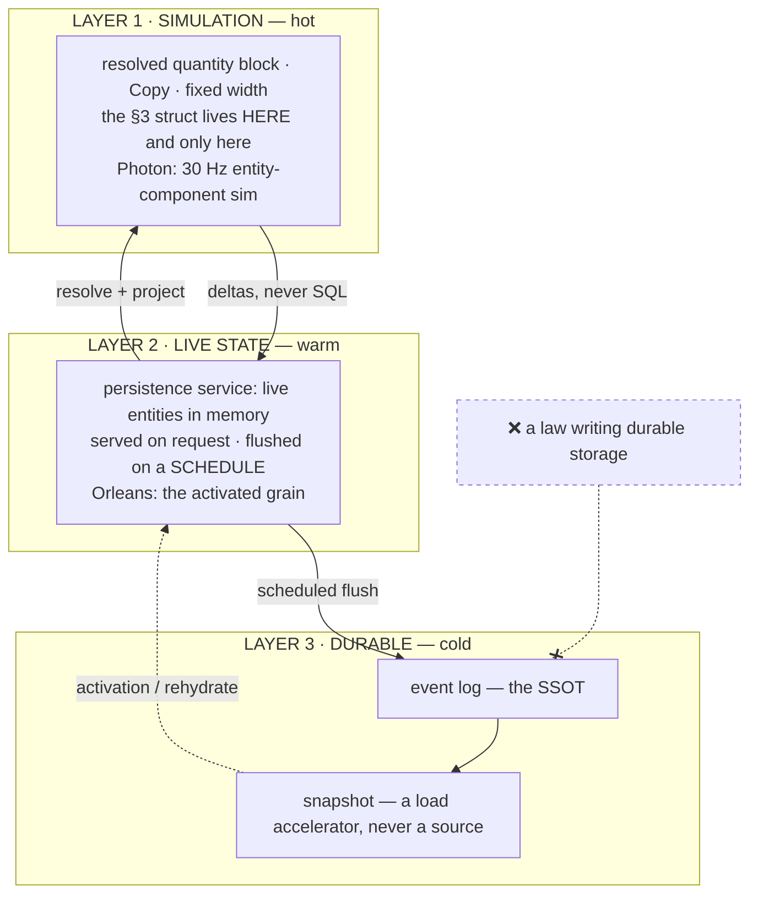

> **⚠ CORRECTED 2026-08-02 by §14.1 (`DR-11`) — this subsection was written from Photon and Orleans
> WITHOUT OPENING `crates/`.** Most of what it proposes already exists here: `dp-kernel`'s
> `event_store`/`load_aggregate`, `sim-core`'s `IslandCheckpoint` (with an explicit loss table), and
> three crates it never mentions — **`projections` (1 486 LOC)**, **`rebuilder` (1 043)** and
> **`projection-reference` (855)** — plus a real cache, `canon_cache.rs`. The conclusions survive and are
> corroborated rather than refuted, but **the status changes from *designed* to *belatedly discovered***,
> and a design that turns out to already exist has different next steps. §14.2 draws the measured chain.

**Photon's rule, stated flatly: *"Simulation nodes never write to the database directly."*** A central
persistence service keeps live entities in an in-memory cache, serves them on request, and flushes to
durable storage on a schedule. Their authority-transfer guarantee is *"every operation on an entity is
executed exactly once and never lost, including during a seamless transfer"* — which is `O-9`'s
cross-island transfer problem, solved by making the transfer itself exactly-once rather than by making
the operation distributed.

**Orleans supplies the other half**, and it is precisely §6.1's two replays with production names:

| Orleans provider | replays | this spec |
|---|---|---|
| `LogStorage` — replays the full event history on every activation | *"rigorous audit / rebuild"* | **verification replay** (§6.1) — must be byte-deterministic |
| `StateStorage` — persists a snapshot for *"leaner loads"* | ordinary activation | **recovery replay** (§6.1) — needs correctness, not determinism |

§6.1 argued that these are two different needs and only one requires determinism. Orleans ships them as
two different **storage providers** because the same argument forced the same split. That is convergent
evidence, not borrowed reasoning.

**What this changes here:** §4.7's phase discipline governs **layer 1 only** — now stated in the body at
§4.7.6. The write door it describes is real but it is not a phase in a tick; it is a **link boundary**
between L1 and L2. A law that writes a durable aggregate is not a phase-ordering violation, it is a
**layer violation** — strictly stronger and much easier to enforce, because L1 crates simply do not
depend on the persistence client and the call fails to compile.

### 9.3 The relational tier ⑥ is solved, three times, by three unrelated systems

`O-28` left ⑥ (opinion, reputation, titles, memberships, and V2's quests) as *"unbounded and that's fine."*
That is under-specified, and the prior art is unusually clear.

| system | how it stores a pairwise relation | what it buys |
|---|---|---|
| **flecs** (ECS, relationships first-class since 2021) | a **pair is the key** — two entity ids encoded into one 64-bit pair id; plus a *"reachable cache"* memoising what is reachable through a relationship | a relation is a first-class storage citizen, not a component slot |
| **Crusader Kings III** | opinion is **never a stored scalar** — it is a **list of timed modifiers** (`add_opinion = { modifier, years, target }`), each with its own timeout, folded on read | opinion **decays out of existence**, so N² never materialises |
| **Dwarf Fortress** | **8 short-term memory slots**; a new thought merges into an existing group, or fills an empty slot, or **overwrites the weakest**; strong memories promote to long-term at the **year boundary** | a hard per-actor bound with a principled eviction rule and a promotion event |

Three conclusions, and none of them needs an ordinal:

1. **A relation's key is the pair.** flecs makes this structural. `actor_actor_opinion` per-`(observer,
   target)` is already this shape — it is not a compromise, it is the known-correct one.
2. **The stored thing is the CAUSE, not the CURRENT VALUE.** CK3 stores *why* an opinion exists, with an
   expiry, and folds. This is the same relationship §6.6 established for vetoes (*a proposal is an edge,
   not a level*) and the same reason: the fold is recomputable, the level is not explainable. **It also
   dissolves the N² fear** — you never write a row for a pair that never interacted, and rows delete
   themselves on expiry.
3. **Bound it per actor, evict the weakest, promote at a boundary.** DF's 8 slots. And `ACT_001`'s R8
   bounded LRU (**≤100 facts, ≤2000 chars, 30/90/365 fiction-day cold-decay**) is *the same design*,
   reached independently. That is a good sign for R8 and it means ⑥ needs no new mechanism — it needs the
   R8 pattern applied to opinion and reputation, which today store levels.

⇒ **Proposed `ACT-A?` — the relational rule:** *a relation between two actors is keyed by the pair, stores
its causes with expiries rather than its current value, and is bounded per actor with a declared eviction
order.* One rule covers opinion, reputation, titles, memberships, quest state and V3 org roles — the six
things §8.5 predicted would all land in ⑥.

### 9.4 Layout for ① — the archetype/sparse-set question, and we already chose

A CGVC 2025 study implemented both in C++20 and measured them:

> Sparse-set ECSes enable **cheaper entity modification** but **scale poorly during iteration**;
> archetypes excel at **large-scale iteration** through cache locality but incur **higher composition
> change costs**.

Our access pattern decides it without ambiguity:

| | our actor |
|---|---|
| composition change (which quantities exist) | **at spawn, from an archetype preset** — then effectively never |
| iteration | **every tick, over every resident actor**, by every law |

⇒ **archetype**, decisively. And `granted: u32` over a fixed `[i32; 32]` **is already an archetype
decision** — every actor in a reality shares one layout, and `granted` marks which slots are live rather
than which exist. The design was right; it now has a measured reason instead of an aesthetic one, and
`QTY-A6`'s fixed width gains a second justification beyond `size_of`.

**One warning from the same author** (flecs'): *storing state machines in ECS is a bad idea* — because a
state machine's states are mutually exclusive and component presence is not, so an invalid combination is
representable. **This is exactly the `Suspended`-beside-`Destroyed` defect §5.8 found**, arrived at from
the storage side. It is an argument for `existence` being a single enum field rather than a set of flags,
which is what §5.8.1 chose — and an argument against ever letting `granted` bits encode lifecycle.

### 9.5 `O-26` is two different problems wearing one name

The per-actor-tick problem has a well-developed answer, and applying it shows `O-26` conflates two things:

> **AI Level of Detail** — inference precision is adapted per NPC by distance from the player; entities
> further away are *"updated at a slower rate or in coarser detail."*

| | what varies | who decides | player-visible? |
|---|---|---|---|
| **simulation LOD** (`AIT_001` tier, residency) | **how often** we compute, and how precisely | the platform, from budget + distance | **must not be** — §5.8.4's invisibility law |
| **fiction time dilation** (`TDIL_001`, 4-clock) | **how much in-world time passes** per unit of real time | the **rules** — a realm where a year passes in a day | **yes** — it is the mechanic |

⇒ **They are opposite in classification and must never share a field.** LOD is config; dilation is hashed
into the digest. §5.10.7 used the invisibility law to split two budgets; the same discriminator splits
these two clocks, which is the second time that law has decided a question that was otherwise a coin toss.

And `O-26`'s sharp form survives both: **`settle` (§5.9) takes an elapsed span, and with dilation the span
is per-actor and is itself a function of where the actor was.** Two actors passivated at the same tick and
restored at the same tick may owe different amounts of fiction time.

### 9.6 `T10` / offline catch-up — the idle-game genre solved this, and validates §5.9's hardest commitment

The mechanism §5.9 proposed with no corpus counterpart is standard practice in a genre built entirely on
it:

- **Closed form, not replay:** *"closed-form simulation, not a real-time tick loop, calculates offline
  progression in `O(actions)` rather than `O(time elapsed)`"* — collapsing long stretches of identical
  action into a single draw. §5.9.4's *"what has no closed form is NOT accrued"* is the same commitment,
  stated as a restriction rather than as a technique.
- **Determinism for the same reason we need it:** *"the same offline window produces the same result
  regardless of which device simulates it — this prevents exploits where players re-open the game on
  different devices to game the simulator."* §5.9.5 required settle to be committed and idempotent from a
  replay argument; the genre requires it from an **anti-exploit** argument and lands on the identical
  rule. Two independent derivations of one constraint.
- **The honest cost, measured by someone else:** Antimatter Dimensions' own documentation says its
  catch-up is *"only somewhat accurate, as the game is too mathematically complicated to be run at full
  accuracy in a reasonable amount of time."* **That is the empirical price of not accepting §5.9.4's
  restriction** — a game that lets any shape into offline accrual ends up approximating it, and then the
  offline result and the online result disagree. `O-20`'s demand that `RegenSpec` be restricted to
  invertible shapes is what buys exactness, and here is a shipped game paying the bill for skipping it.

### 9.7 What this section proposes

| # | proposal | replaces / grounds |
|---|---|---|
| **P-A** ✅ **APPLIED** | **§3 renamed to the resolved quantity block**, struct renamed `Actor` → `ActorQuantities`, and the owning context named. The 31 aggregates are the correct decomposition and are not to be unified. Landed as **§3 preamble + §3.3** | `B-1`, and reverses §8.1's framing |
| **P-B** ✅ **APPLIED** | **Three storage layers, and the boundary is a LINK not a phase** — L1 simulation crates do not depend on the persistence client, so a durable write from a law is a compile error, not a review finding. Landed as **§4.7.6** | strengthens §4.7 · `O-14` · re-frames `O-9` |
| **P-C** ⚠️ **WITHDRAWN as a decision — kept as a hand-off** | **PO 2026-08-02: the relational family is a SEPARATE FEATURE** (AI + emotion engine · social system · decision tree) and must not be folded into actor core. Test applied: *the game is playable without it*. §4.8 is rewritten from four *"Chosen: …"* rulings into recorded prior art plus actor core's one obligation — **do not block it**. Writing it as decisions was the error: a separate feature gets a separate designer, who would have inherited rulings made by someone thinking about pools | `O-28` closed · `O-28b` **leaves scope** · `D-17` re-scoped |
| **P-D** ✅ **APPLIED** | **Archetype layout confirmed by measurement**, and `granted` may never encode lifecycle (the state-machine-in-ECS trap). Landed as **§3.1 + §3.2** | grounds `QTY-A6` · guards §5.8.1 · `O-32` |
| **P-E** ✅ **APPLIED** | **Simulation LOD split from fiction dilation** — config vs hashed rules, decided by the invisibility law for the third time. Never one field. Landed as **§5.8.4b** | `O-26` closed · residue `O-26b` |
| **P-F** ✅ **APPLIED** | **Snapshot is a load accelerator and never a source.** A snapshot disagreeing with the log is discarded, never reconciled; it must carry its `seq` + `RulesPin` or it cannot be checked. Landed as **§6.1b** | grounds §6.1 · binds `O-15` · `O-31` |

**Sources.** [CGVC 2025 sparse-set vs archetype comparison](https://diglib.eg.org/items/6e291ae6-e32c-4c21-a89b-021fd9986ede) ·
[Photon — building a seamless MMO backend](https://blog.photonengine.com/building-a-seamless-mmo-backend-across-machines/) ·
[Orleans event sourcing / snapshot providers](https://mcguirev10.com/2019/12/05/event-sourcing-with-orleans-journaled-grains.html) ·
[flecs relationships](https://github.com/SanderMertens/flecs/blob/master/docs/Relationships.md) ·
[Mertens — why storing state machines in ECS is a bad idea](https://ajmmertens.medium.com/why-storing-state-machines-in-ecs-is-a-bad-idea-742de7a18e59) ·
[CK3 opinion modifiers](https://ck3.paradoxwikis.com/Modifiers) ·
[Dwarf Fortress memory slots](https://dwarffortresswiki.org/index.php/DF2014:Memory_(thought)) ·
[AI Level of Detail](https://arxiv.org/html/2606.06565) ·
[idle-game offline progression math](https://www.geekextreme.com/idle-games-offline-progression-math/) ·
[Azure — tactical DDD across bounded contexts](https://learn.microsoft.com/en-us/azure/architecture/microservices/model/tactical-domain-driven-design)

---

## 10. Still open after all of this

> **⚠ Every row below is adjudicated in §11.** The register states the *problem*; §11 states the
> *decision*, the options weighed, and which class the row is in (**A** decidable — decided · **B** needs
> a measurement · **C** no question left, only unbuilt work · **D** the PO's call). A row here reading
> like an open question is the problem statement, not the current status. Two pairs were **merged** by
> the adjudication — `O-1c`+`O-1d` → `O-1cd`, and `O-19`+`O-20`+`O-1cd` share one build (the durable
> row). Three rows (`O-30` · `O-31` · `O-32`) were decided in §9's application pass and are class **C**.

| # | |
|---|---|
| ~~**O-1**~~ | ✅ **Closed by §5.8.1** — split into **tier** (mechanism, what is persisted) × **existence** (vocabulary, the declared machine). Tier gates which declared transitions are enabled, so `Irreversible + destroyed` and `Stateful + destroyed` differ exactly where doc 29 says they should. Drawing it was what solved it; asserting three axes without drawing them is what hid it. |
| ~~**O-1b**~~ | ✅ **CLOSED by the PO 2026-08-02 — and the row was materially wrong.** **The PO's rule: canon is what is written to the LEDGER. State never written is fabricated, may be lost, and — because nobody observed it — did not matter.** *Farmer A was just killed; nobody asks who Farmer A was.* No game manages this; not managing it is cheaper and simpler. **And the corpus had already decided exactly this, as a PO decision (`REC-12`, 2026-07-26).** `AIT_001` §4.5 ships **one** demotion path: an **encounter-promoted** Minor with **no PC interaction** returns to Untracked after `demote_after_days`, evaluated **lazily at observation** (`TDIL-A11 ObservationAdvance`). **Canonically-declared Tracked NPCs are permanent in V1.** My row claimed *"a timer's side effect"* — it is explicitly *"no scheduler"* — and implied declared NPCs were at risk, which they are not. The `TierDemoted`-with-a-digest I proposed is over-engineering for state that was never canon. **What survives is the general rule and its mechanical test → `O-1b2`.** |
| **O-1c** | **`Evicted` is unreachable** — `ActorQuantities` has no `Serialize`, so the durable row §5.8.3 depends on does not exist. Either the state is completed and round-trip-proven, or the residency ladder ships with two states, not three.  <br>▸ **A → §11.5** · **merged with `O-1d` as `O-1cd`** — the budget is unbuildable until the round-trip is proven. |
| **O-1d** | **Nothing budgets residency.** `TierCapacityCaps` caps **tier**. The LRU-with-`max` / idle-timeout slot on axis 3 is empty.  <br>▸ **A → §11.5** · **merged into `O-1cd`** — eviction is the budget's only lever. |
| **O-2** | **The laws' input problem** (agent 3's FATAL-2). If stats are identities, what does compiled combat code name? Deferred with `D-14` — but recorded as **open**, not resolved.  <br>▸ **A → §11.8** · **closed** — compiled code names ROLES, never identities (`D-6` + `QTY-D1`). `D-14` defers *which* roles, a vocabulary question. |
| **O-3** | **`D-9`'s remaining scope** once payload is pulled in: is the interception point ordered, and what happens to an unhandled crossing — refuse, log, or panic?  <br>▸ **A → §11.3** · emit the crossing, no handler runs, continue. The validator warns at load. |
| **O-4** | **The `PO-1` experiment.** Three tables was decided on LLM-generation grounds with no measurement. 100 manifests each way with `scripts/dev-model.py` settles it, and the stage split means the answer now only affects S1.  <br>▸ **B → §11.9** · the one row an argument cannot settle. Experiment specified. |
| **O-5** | **Overlay merge semantics.** §5 names the axis; it does not say how an overlay composes with a base spec, nor what a partial overlay row means (inherit vs clear) — the same ambiguity `case06` exposed in chaos. **§4.5.4 widens this:** an overlay must reach `RegenSpec`, not only thresholds, or an ambient environmental effect (a swamp, a spirit vein) has no way to land.  <br>▸ **A → §11.4** · three-valued: absent = inherit · present = replace the row · explicit `Cleared` = remove. |
| **O-6** | **The absorption chain is new declared vocabulary** (§4.5.3). `ResourceDecl` has no chain field, and residue currently has nowhere to go. Without it a shield is a pool that stops damage *up to its own value and then stops nothing*.  <br>▸ **A → §11.2** · a declared ordered chain keyed by damage kind — it is a list, never a field. |
| **O-7** | **The declared order over delta sources** (§4.5.2) does not exist. *"In declared source order"* names a total order — regen before damage before status before transfer? — that nothing declares today. Ties break on `seq`; the classes above `seq` are unspecified.  <br>▸ **A → §11.2** · sum within class · engine-fixed class order (sources→transfers→sinks) · **one** clamp at the end. |
| **O-8** | **`EXC-L1`'s conservation ledger is designed and unbuilt** ([WSA-R14](../../../03_planning/LLM_MMO_RPG/31_world_simulation_architecture.md)). §4.5.4's transfer/source/sink split is what makes the assertion checkable — but the assertion has no implementation, so *"deltas sum to zero except at a declared source or sink"* is currently a claim with no check behind it.  <br>▸ **C → §11.2** · assert the **transfer class** sums to zero. Lands inside `O-14`. |
| **O-13** | **`V1` is one function long.** `ruleset-loader/src/validate.rs` carries a single `validate(&Ruleset)` and none of §2.6's well-formedness obligations. Every one of them is a defect an author can currently ship into a digest (§2.7.2). This is the largest **code** gap the drawing exposed, and it is the layer `PO-1`'s *"fails loudly"* argument was actually about.  <br>▸ **C → §11.10 #1** · first, and not close — everything an author can ship depends on it. |
| **O-14** | **The phase discipline (§4.7) does not exist.** `CombatDomain::apply` reads and writes `state.actors` in one pass with no phases. It is a replacement for what runs today, not a refinement — and `V4` (spawn) and `V5` (tick invariant) have no implementation at all.  <br>▸ **C → §11.10 #3** · `O-32` and `O-8` are assertions **inside** this work. |
| **O-10** | **A depth budget for the status wave is mandatory and unspecified** (§4.6.6). Two statuses that each propose the other are a hang, authored in content. `TRG-A1..A11` designs the wave; nothing binds it to this seam, and no budget value is chosen.  <br>▸ **A → §11.3** · refuse and **record** the refusal; default depth **8**. The number is class B, the mechanism is not. |
| ~~**O-11**~~ | ✅ **Resolved by §6.6 — a veto is a fact and is recorded.** *"The undying trigger fired and prevented death"* is what a player asks about and a designer balances against; recording only the outcome makes *"why did this not die"* unanswerable. The cost is bounded because proposals are **edges, not levels**. `StatusProposed` remains a **code** gap — nothing emits it — but it is no longer an open *question*. |
| ~~**O-21**~~ | ⚠️ **Mostly FALSE as written — corrected by the §8 census, see `DR-7`.** The axis has an aggregate (`control_binding`, `ACT_001`, `SPG-R6`), a driver contract (`AGT-A1..A6`, four drivers, runtime-swappable) and a proposal-not-write authority rule (`AGT-A6`). I asserted absence without opening `_boundaries/01_feature_ownership_matrix.md`. **What survives is narrower and is now `O-21b`.** |
| **O-21b** | **Nothing says replay treats the four drivers differently** (§5.10.2). `AGT-A3` makes drivers swappable and `AGT-A6` makes every Decision a Proposal — but a `Script`/`Engine` decision is a **pure function** replay can recompute, while an `Llm`/`Human` decision is an **external oracle** replay must read from the input log. The corpus never distinguishes them, so nothing marks an LLM-driven span as recompute-forbidden, and nothing forbids re-calling the model during replay. `control_binding` carries `since: FictionTime`, which gives spans a start — so the fix has somewhere to land.  <br>▸ **A → §11.6** · **§5.10.2 is superseded** — the flag goes on the **Decision** (`origin: Recomputable\|Oracle`), not on the span. |
| **O-22** | **`current_session_id` fuses two questions** (§5.10.6) — *who drives this actor* and *where is it being observed*. The same defect §5.8 found in `Suspended`-beside-`Destroyed`, in `ACT_001`. Splitting it is what makes `ACT-D1` (AI-controls-PC-offline, deferred) expressible: that deferral is a **transition on an axis that does not exist**.  <br>▸ **A → §11.6** · **delete** the field; do not re-purpose it. Re-purposing is how it fused. |
| **O-23** | **`PromptDetail` is bound to tier, not to control** (`AIT_001:555`). LLM richness is therefore coupled to persistence depth, so an actor cannot be cheaply persisted and richly voiced, or vice versa. It belongs on the `Language` controller.  <br>▸ **A → §11.6** · move to the control binding. `P-E` decides it: LOD is invisible, fidelity is visible. |
| **O-19** | **The reconstitution module does not exist** (§5.9). No `settle`, no `last_settled_tick` on the actor, no `ActorSettled` event. Today an actor that is passivated and restored simply loses the elapsed time — which is *"accrue nothing"*, the legal option, but chosen by omission rather than by decision and with no way to change it.  <br>▸ **C → §11.7** · no design question left. Shares the durable row with `O-1cd` — one build, not two. |
| **O-20** | **`RegenSpec` must be restricted to invertible shapes** (§5.9.6), and nothing states or checks that. Without it, `settle` cannot return crossings and the offline-catch-up path silently skips every threshold — the `case04 ⊥ case05` contradiction, unresolved in code.  <br>▸ **A → §11.7** · a **load-time refusal**, not a runtime check. Earliest layer wins. |
| **O-16** | **Overlay instances need a store and a lifecycle of their own** (§5.1). They must be content-addressed for `RulesPin.overlay` to mean anything, which implies a second content-addressed store, its own retention rule (`O-15` applies to it too), and an answer to who writes an instance when a siege begins. None exists.  <br>▸ **A → §11.4** · same store, different namespace. Who writes an instance → `O-16b` (build). |
| **O-17** | **`RulesPinChanged` is a new event** (§5.3). An overlay change and an epoch switch are the same kind of fact — the rules an actor runs under moved — and replay cannot resolve later ordinals without it. Nothing emits it, and whether the two cases share one event or stay separate is undecided.  <br>▸ **A → §11.4** · **one** event with a `reason` field. Two paths for one replay obligation will drift. |
| **O-18** | **`flow_kinds` must distinguish a hit from a re-ceiling** (§5.5). `RES_001`'s locked rule — *a clamp must never kill; only damage does* — means a clamp caused by a ceiling change routes **no** residue, while the same arithmetic from damage does. The flow kind therefore belongs on the **delta**, not on the quantity, and §2.6.7's table does not yet say so.  <br>▸ **A → §11.2** · the flow kind is a field on the **delta**. A quantity cannot carry it. |
| **O-15** | **GC must be pin-aware, not binding-aware** (§6.7). A collector that evicts un-*bound* rulesets deletes exactly the historical ones replay needs, and the failure surfaces as `PriorRulesetMissing` long after the deletion. Nothing states this obligation today, and the content-addressed store offers no other protection.  <br>▸ **A → §11.4** · GC roots are **pins**, and `P-F` adds snapshots as roots. |
| **O-12** | **`WhileProposed` expiry re-enters the wave.** A status that exists only while its condition holds must be re-evaluated, and re-evaluation is what §4.6.6 bounds. The interaction between `Expiry::WhileProposed` and the depth budget is unspecified.  <br>▸ **A → §11.3** · same wave, same budget. A separate pass re-opens `O-10` through a side door. |
| ~~**O-9**~~ | ✅ **CLOSED by the PO 2026-08-02: island-local only, and the framing was a scope error.** I presented cross-island refusal as a **cost** (*"it forbids a bank, a remote market, a sect treasury at range"*). **It is not a cost — those are a different feature.** Remote trade, auction houses and banking are the **trade + economy** feature's problem, they are **per-reality**, and they are built from escrow and order books, not from the atomic two-delta transfer primitive. Asking the primitive to span islands was asking it to be a market. **A transfer happens face to face, and co-located actors are in one island by construction.** The refusal is explicit (`transfer.cross_island_unsupported`) and it is a *boundary*, not a *limitation*. Photon's exactly-once handoff stays recorded as the growth path **if the kernel ever needs it** — nothing in actor core does. |
| **O-24** | **Two CANDIDATE-LOCK features name the wrong pipeline stage.** PL_005 §9 and PL_006 §9 file world-rule/physics derivation at "Stage 7"; `_boundaries/03` puts canon-drift at 7 and world-rule lint at **9**. This is the step that computes every actor delta in the game. A doc-level fix, but in two locked docs  <br>▸ **C → §11.10 #7** · minutes of work, actively misleading today. |
| **O-25** | **No phase receives a cascade.** §4.7 phases one actor's tick; T4 delivers an atomic batch from another aggregate's change (`HolderCascade`, `PlaceDestroyed`, title C18-on-death). Where in 0→6 does it land, and is it inside the same tick or the next one?  <br>▸ **A → §11.8** · two mechanisms sharing one word. Synchronous = a multi-aggregate commit (same tick); async = an **input at phase 0 of the next tick**. |
| ~~**O-26**~~ | ✅ **Split by §9.5 into two questions that must never share a field.** **Simulation LOD** (how often/how precisely we compute — platform config, player-invisible, `AIT_001` tier + residency) versus **fiction dilation** (how much in-world time passes — hashed rules, player-visible, `TDIL_001`). The invisibility law is the discriminator, for the second time. The residue is `O-26b`. |
| **O-26b** | **`settle`'s elapsed span is per-actor and is a function of where the actor was.** With dilation, two actors passivated on the same tick and restored on the same tick owe **different** amounts of fiction time. §5.9 takes one span; nothing computes a per-actor one.  <br>▸ **A → §11.7** · `settle` takes `(from_fiction_ts, to_fiction_ts)`, never `elapsed_ticks`. |
| **O-27** | **`aggregate_type: String` in `OutputDecl`** (PL_005 §2) is an **open string** naming a closed set of 31 aggregates. The Frontend-Tool-Contract rule — *closed-set arg ⇒ enum* — applies exactly: a typo routes a delta nowhere and nothing reds  <br>▸ **A → §11.8** · a **generated** enum — the ownership matrix is already the source. |
| ~~**O-28**~~ | ✅ **Answered by §9.3's `P-C`, from three unrelated prior arts.** A relation is **pair-keyed** (flecs makes the pair a first-class 64-bit key), **stores its causes with expiries rather than its current value** (CK3 opinion is a fold over timed modifiers — which is why N² never materialises: no row exists for a pair that never interacted, and rows expire themselves), and is **bounded per actor with a declared eviction order** (Dwarf Fortress: 8 slots, weakest overwritten, promotion at the year boundary — the same design as `ACT_001`'s R8 LRU, reached independently). The residue is `O-28b`. |
| ~~**O-28b**~~ | ✅ **OUT OF SCOPE — PO 2026-08-02.** Not deferred, **handed off**: opinion and reputation belong to the AI + emotion feature, not to actor core. This clears the **defer-gate #1** test (*belongs to a different track*) rather than sitting on the deferred list accruing re-read cost every PLAN. **The urgency argument goes with it** — *causes → level* is a function and *level → causes* is not, so the now-or-never property is real, but it binds the feature that stores them, and actor core stores neither. §4.8.2 records the asymmetry where its owner will see it. |
| **O-29** | **`features/_index.md` is stale** — 34 folders listed, 35 present (`19_ability/` missing), and its own drift-check command would have caught it. Its rule says a new folder lands in the index in the same commit  <br>▸ **C → §11.10 #7** · trivial. |
| **O-30** | **Nothing structurally prevents a tick-1 law from writing durable storage** (§9.2 `P-B`). Photon's rule is flat — *"simulation nodes never write to the database directly"* — and it is enforceable as a **link boundary**: tier-1 crates do not depend on the persistence client, so the violation is a compile error rather than a review finding. Today `crates/` and `services/` have no such separation stated, and §4.7 framed this as phase ordering, which is the weaker form.  <br>▸ **C** · **decided in §4.7.6** (link boundary). Unbuilt, not unanswered. → §11.10 #2 |
| **O-31** | **Snapshot-versus-log authority is undecided** (§9.2 `P-F`). Orleans ships the choice as two providers — `LogStorage` (full replay, audit) and `StateStorage` (snapshot, lean load) — which is §6.1's two replays. This spec never says a snapshot is **a load accelerator and never a source**, nor what happens when a snapshot disagrees with the log (it must be discarded, not trusted). `O-15`'s retention rule depends on the answer.  <br>▸ **C** · **decided in §6.1b** (snapshot is an accelerator, never a source). Unbuilt. → §11.10 #5 |
| **O-32** | **`granted: u32` must never encode lifecycle** (§9.4). flecs' author's argument against state machines in ECS is that component *presence* is not mutually exclusive while a machine's states are, so an invalid combination becomes representable — which is the `Suspended`-beside-`Destroyed` defect §5.8 found, seen from the storage side. §5.8.1 chose a single enum, correctly; nothing forbids a later author from adding a lifecycle bit to `granted` instead.  <br>▸ **C** · **decided in §3.2** (`granted` answers one question). Unenforced. Lands inside `O-14`. |
| **O-33** | **"Tier" names three unrelated ladders** (§3's disambiguation table): the **actor tier** (`Untracked..Irreversible`), the **DP tier** (`T1/T2/T3` urgency), and what §9.2 now calls a **storage layer**. `actor_status` is *"T2 / Reality"* while a `Stateful` actor is *"tier 2"* — two different 2s, one word. This document now qualifies every use; the corpus does not, and a reader crossing files has no signal which ladder a bare *"tier"* means.  <br>▸ **A → §11.8** · rename only the newest ladder (done) + register the collision in the standards index. No mass rename. |

---

## 11. Adjudicating the open register — a decision for every row

> Written 2026-08-02. §10 lists **34 open rows**. Left as a flat list they all look like the same kind of
> unknown, and they are not: some are decidable from what this document already establishes, some need a
> measurement no argument can substitute for, some have no question left at all and are simply unbuilt,
> and a few are genuinely the PO's to call. **Triaging them is worth more than answering them**, because
> it says where a human's attention is actually required — and the answer is *four rows*, not thirty-four.

### 11.1 Triage — what KIND of unknown each row is

| class | meaning | who resolves | rows | count |
|---|---|---|---|---|
| **A · Decidable** | a design question this document can answer from what it has already established | **decided below** | O-1b · O-1c+d · O-2 · O-3 · O-5 · O-6 · O-7 · O-9 · O-10 · O-12 · O-15 · O-16 · O-17 · O-18 · O-20 · O-21b · O-22 · O-23 · O-25 · O-26b · O-27 · O-33 | **22** |
| **B · Needs a measurement** | an argument cannot settle it; a run can | an experiment | O-4 | **1** |
| **C · No question left** | the design is decided; the work is unbuilt | a build order | O-8 · O-13 · O-14 · O-19 · O-24 · O-28b · O-29 · O-30 · O-31 · O-32 | **10** |
| **D · The PO's call** | product value, not engineering | **the human** | inside O-9 · O-28b · O-4 · O-2 | **4 questions** |

**Three rows were already decided in §9's application pass and their §10 text is stale** — `O-30`
(§4.7.6 states the link boundary), `O-31` (§6.1b states snapshot authority), `O-32` (§3.2 states the
rule). They are class **C**, not open questions: the spec decides, the code does not enforce.

---

### 11.2 Cluster 1 — the delta pipeline · `O-7` `O-18` `O-6` `O-8`

These four are one question seen four ways: **what happens to a number between the start and end of a
tick.** Deciding them separately is what left them inconsistent.

#### `O-7` — the order over delta sources

*Clarify.* §4.5.2 says deltas apply *"in declared source order"* and nothing declares it. But order only
changes the **result** where a clamp or a residue is involved — otherwise addition commutes.

| option | |
|---|---|
| **a** · a manifest-declared total order over every source | maximal authority, and it makes the sum order-dependent for no benefit; two manifests differing only in this order produce different combat |
| **b** · a fixed engine order over every source | the engine hardcodes vocabulary — `D-2` violation |
| **c** · **sum within a class · fixed engine order over CLASSES · one clamp at the end** | ✅ |

**Chosen: (c).** The engine fixes three classes and their order — **sources → transfers → sinks**
(§4.5.4's own split) — sums every delta within a class, applies the classes in that order, and **clamps
exactly once at the end**. Which source belongs to which class is manifest vocabulary; the class order is
mechanism, because it decides whether a regen tick can save you from a lethal blow, and that is an engine
semantic a reality must not be able to reverse silently.

**What this buys:** the common case becomes order-free, so `seq` tie-breaking stops mattering for value
and matters only for **residue routing** and **crossing detection** — which is exactly where §4.5.3 and
§4.6 already put the ordering semantics. One clamp also means one crossing evaluation, which kills the
half-applied-state read §4.7.4 lists as a violation.

#### `O-18` — `flow_kind` belongs on the delta

*Clarify.* `RES_001` locks *a clamp must never kill; only damage does*. The same arithmetic —
`value → ceiling` — is lethal from damage and harmless from a ceiling drop.

**Chosen: the flow kind is a field on the DELTA, never on the quantity.** A quantity cannot carry it
because a quantity is reduced by both. §2.6.7's table gains the field. This is the same shape as `O-7`'s
class: the delta knows what it is; the quantity only knows how big it is.

#### `O-6` — the absorption chain

*Clarify.* A shield that stops damage *up to its own value and then stops nothing* is what we have today,
because residue has nowhere to go.

| option | |
|---|---|
| **a** · `absorbs_for: Option<Ordinal>` on `ResourceDecl` | cannot express *"absorbs fire but not physical"*, and cannot hold a chain of more than one |
| **b** · **a declared ordered chain, keyed by damage kind** | ✅ |
| **c** · shields are statuses, not pools | a status has no magnitude arithmetic; it would re-invent pools badly |

**Chosen: (b).** A per-reality table: `(damage_kind) → [ordinal, ordinal, …]`, applied in order, residue
flowing to the next link and the final residue reaching the target quantity. Engine closes the operation
(consume in order, route residue); manifest declares the chains and the damage kinds. It is a list, so it
was never expressible as a field — which is why (a) looked adequate and is not.

#### `O-8` — the conservation ledger

*Clarify.* §4.5.4's transfer/source/sink split makes *"deltas sum to zero except at a declared source or
sink"* checkable. Nothing checks it.

**Chosen: no design question — it is a `V5` tick invariant**, and `O-7`'s class split is what gives it a
subject: assert the **transfer class** sums to zero every tick. Sources and sinks are excluded **by
class**, not by a per-delta exemption, so the assertion cannot be defeated by mislabelling one delta.
Class **C**, and it lands inside `O-14`'s work.

---

### 11.3 Cluster 2 — the status wave · `O-10` `O-12` `O-3`

#### `O-10` — the depth budget

*Clarify.* Two statuses that each propose the other are a hang **authored in content**. That is the shape
that matters: a manifest must never be able to halt the engine.

| option | |
|---|---|
| **a** · panic / abort the tick | authored content can crash the server. Never |
| **b** · silently stop at N rounds | a silent cap — forbidden outright: it reports completion it did not achieve |
| **c** · **refuse further rounds, and RECORD the refusal as a fact** | ✅ |

**Chosen: (c),** with **default depth 8**. Refusal because content must not crash the engine; recorded
because a silent truncation is the failure `O-11` already ruled on — *a veto is a fact*, and a budget
exhaustion is a veto by the engine. The author sees `WaveBudgetExhausted` in the stream and can fix the
loop; today they would see a hang.

**The number 8 is a default, not a finding.** It is the only part of this row that is class **B**, and it
is cheap to measure later against real manifests. The mechanism does not change with the number.

#### `O-12` — `WhileProposed` expiry re-enters the wave

**Chosen: a `WhileProposed` status is re-evaluated in the SAME wave, sharing the SAME budget** — it does
not get a second pass. A separate pass is a second wave with no bound, which re-opens `O-10` through a
side door. Re-evaluation is a wave round; that is all it is.

#### `O-3` — an unhandled threshold crossing

*Clarify.* An author declares a threshold; no status is bound to it. What happens?

| option | |
|---|---|
| **a** · refuse the tick | an unused threshold breaks the game. Absurd |
| **b** · panic | never, for authored content |
| **c** · **emit the crossing, no handler runs, continue** | ✅ |

**Chosen: (c).** A crossing is a **fact about a number**, and facts do not require listeners — that is
exactly `D-5`'s three-layer split (depletion is a fact · status is adjudicated · lifecycle is the
consequence). An unhandled crossing is a *content* condition, visible in the stream, and `O-13`'s
validator should **warn** at load — not the tick refuse at runtime.

---

### 11.4 Cluster 3 — rules provenance · `O-5` `O-16` `O-17` `O-15`

#### `O-5` — overlay merge semantics

*Clarify.* `case06`'s ambiguity: does an overlay omitting `regen` mean *inherit* or *set to nothing*?

| option | |
|---|---|
| **a** · full replace — an overlay supplies the whole spec | every arena re-declares the world. Unusable |
| **b** · partial merge, absence = inherit | *"set regen to zero"* is indistinguishable from *"don't mention regen"* — the exact `case06` bug |
| **c** · **three-valued: absent = inherit · present = replace that row entirely · explicit `Cleared` = remove** | ✅ |

**Chosen: (c).** The third value is the whole point — it is the only way to say *"this arena has no
regen"* as distinct from *"this arena says nothing about regen"*. Row-level replace, not field-level
merge, because a half-merged `RegenSpec` is the same class of half-applied state §4.7.4 forbids.

**And the overlay must reach `RegenSpec`, not only thresholds** (§4.5.4's widening), or a swamp cannot
slow regeneration — which is the motivating example.

#### `O-16` — where overlay instances live

| option | |
|---|---|
| **a** · a second content-addressed store | doubles the retention problem `O-15` describes, for no benefit |
| **b** · **the same store, different namespace** | ✅ |
| **c** · inline in the actor's pin | unbounded actor size; kills `QTY-A12` |

**Chosen: (b).** The store is `put`/`get` by digest and is indifferent to what the bytes mean — that is
its whole virtue. One store, one retention rule, one GC. Who writes an instance when a siege begins is the
**overlay owner's** question and is genuinely unanswered; it becomes `O-16b` (class C — build).

#### `O-17` — `RulesPinChanged`: one event or two?

**Chosen: ONE event with a `reason` field** (`EpochAdvanced` | `OverlayEntered` | `OverlayLeft`). Replay
needs exactly one thing: *the pin moved, here is the new pin*. The cause is metadata for humans. Two
events means two code paths carrying one replay obligation, and they will drift — which is `O-22` and
`O-33`'s failure shape in advance.

#### `O-15` — GC must root on pins

| option | |
|---|---|
| **a** · retain forever | honest, unbounded |
| **b** · retain N epochs | breaks replay **silently**, long after the deletion |
| **c** · **GC roots are PINS** — every `RulesPin` referenced by a retained event **or snapshot** | ✅ |

**Chosen: (c).** It is the only option that cannot silently break: if an event or snapshot can still be
replayed, its ruleset is reachable by construction. **`P-F` widens this** — a snapshot carries a pin, so
snapshots are GC roots too, which a binding-based collector would never have known.

---

### 11.5 Cluster 4 — the lifecycle axes · `O-1b` `O-1c` `O-1d`

#### `O-1c` + `O-1d` are ONE item, and their order is forced

*Clarify.* `O-1c`: `Evicted` is unreachable because there is no serialization. `O-1d`: nothing budgets
residency. **These are not independent** — a residency budget's only lever is eviction, and eviction
requires a durable row. `Passivated` (resident, not ticking) frees CPU; only `Evicted` frees memory.

**Chosen: merge them, and the sequence is forced:** serialization + round-trip proof → `Evicted` reachable
→ the LRU/idle budget becomes implementable. **The ladder ships with two states until the round-trip is
proven**, and while it does, the budget is not merely unbuilt — it is *unbuildable*, and saying so is
honest where listing two rows was not. Merged as **`O-1cd`**.

Shipping `Evicted` before its round-trip is the state-level form of a check that cannot fail: a ladder
advertising a capability that does not exist.

#### `O-1b` — tier demotion destroys canon

*Clarify.* `AIT_001:204` demotes an idle Minor NPC to Untracked on a **timer**, and Untracked has no row —
so the canon is gone as a side effect of a config value.

**Chosen: demotion is an ordered `TierDemoted` event that records WHAT WAS LOST — as a content digest, not
the content.** Cheap (32 bytes), and it makes *"did we lose canon here"* answerable, which is the actual
grievance. Deleting silently on a timer is the same defect class as `O-10`'s silent cap, at the entity
level. Whether demotion should happen at all is a separate product question and is not this row's.

---

### 11.6 Cluster 5 — control and replay · `O-21b` `O-22` `O-23`

#### `O-21b` — and a better answer than §5.10.2's

*Clarify.* Replay must **recompute** a `Script`/`Engine` decision and **read back** an `Llm`/`Human` one.
§5.10.2 proposed that `ControlChanged` tells the replayer which mode a span is in.

**That is the worse of the two available designs, and I should correct it.** A span-based lookup forces
replay to reconstruct binding history to interpret any decision — and control can rebind mid-span.

| option | |
|---|---|
| **a** · derive it from the control binding in force at that `seq` | replay must rebuild binding history first; rebinding mid-span makes it fragile |
| **b** · **every committed Proposal carries `origin: Recomputable \| Oracle`** | ✅ |

**Chosen: (b).** The producing driver knows its own kind at emit time and stamps it. Replay then needs
**no** binding knowledge at all — it reads one field per decision. `AGT-A6` already makes every Decision a
Proposal, so the field has a home that exists. This also makes the rule mechanically checkable: *an
`Oracle` decision may never be recomputed* is an assertion about a field, not about a history.

`control_binding.since` stays useful for humans and for `O-22`; it stops being load-bearing for replay,
which is a strictly better place for it.

#### `O-22` — `current_session_id` fuses two questions

**Chosen: delete the field; do not re-purpose it.** *Who drives* is `control_binding` (exists). *Where
observed* becomes `observed_in: Option<SessionId>`. Re-purposing a fused field is how it fused — a second
meaning was added to a field that already had one. `ACT-D1` (AI-controls-PC-offline) becomes expressible
the moment the two are separate, because it is a transition on the first with no effect on the second.

#### `O-23` — `PromptDetail` is on the wrong axis

**Chosen: move it to the control binding.** `P-E` decides it without further argument: **actor tier is
simulation LOD** (how deeply we persist and how often we compute — platform, invisible) and **prompt
fidelity is how the NPC talks** (player-visible, therefore rules). They are opposite in classification, so
they may not share a key. An actor becomes freely *cheaply persisted and richly voiced*, or the reverse —
which is the capability the coupling removed.

`TierRosterCaps` (5 Full + 8 Condensed + 12 Summary) re-keys onto the **controller roster**, which is what
it was always counting.

---

### 11.7 Cluster 6 — time and reconstitution · `O-20` `O-26b` `O-19`

#### `O-20` — restrict `RegenSpec` to invertible shapes

**Chosen: yes, and it is a load-time refusal, not a runtime check.** A shape that cannot be evaluated
closed-form at an arbitrary `t` makes `settle` unable to return crossings, so the offline path silently
skips every threshold — `case04 ⊥ case05`. The validator (`O-13`) refuses a non-invertible shape at load,
which is the earliest layer that can see it (§2.7's *earliest layer wins*).

**The cost of not doing this has been paid publicly by someone else:** Antimatter Dimensions documents its
own catch-up as *"only somewhat accurate — the game is too mathematically complicated to run at full
accuracy in a reasonable amount of time."* That is what accepting arbitrary shapes buys.

#### `O-26b` — the elapsed span is per-actor

**Chosen: `settle` takes `(from_fiction_ts, to_fiction_ts)`, never `elapsed_ticks`,** and the clock module
computes the pair per actor from its dilation history. Regen shapes are declared against **fiction** time,
so fiction time is the only correct argument. Two actors passivated and restored on the same wall-clock
ticks owe different fiction spans, and with the pair form that is simply true rather than a special case.

#### `O-19` — the reconstitution module

**Chosen: no design question remains** — §5.9 specifies the boundary, `O-20` supplies the restriction,
`O-26b` supplies the argument type. Class **C**. What it needs: `settle`, `last_settled_at_fiction_ts` on
the durable row, and an `ActorSettled` event. Note it **shares the durable row with `O-1cd`** — the same
serialization unblocks both, so they are one build item, not two.

---

### 11.8 Cluster 7 — boundaries · `O-25` `O-9` `O-27` `O-33` `O-2`

#### `O-25` — where a cascade lands, and a word doing double duty again

*Clarify.* T4 delivers an atomic batch from another aggregate's change. §4.7 has no phase for it.

**And the corpus calls two different things "cascade":** `EF_001`'s HolderCascade and `PF_001`'s
PlaceDestroyed cascade are **post-commit** (the tick is over), while `TIT_001`'s C18 is
*"**synchronous** on WA_006 mortality EVT-T3"* — same tick.

**Chosen: they are not the same mechanism and must stop sharing a name.**

| | what it really is | where it lands |
|---|---|---|
| **synchronous** (`TIT_001` C18) | a **multi-aggregate commit** — one transaction, several aggregates | phases 5–6 of the **same** tick. Not a cascade |
| **asynchronous** (`EF_001`, `PF_001`) | a genuine cascade — a new fact caused by a committed one | **an INPUT at phase 0 of the next tick**, admitted as one atomic batch |

No new phase is needed, and *"a module reads only completed phases"* survives intact — because the causing
tick **is** complete. Atomicity is preserved by admitting the batch as a unit. This is the **third** time
today one word carried two mechanisms (`O-33`'s tier, `O-22`'s session id, this).

#### `O-9` — atomic paired transfer

| option | |
|---|---|
| **a** · **island-local only — refuse a cross-island transfer by name** | ✅ V1 |
| **b** · a distributed transaction | precisely what production systems avoid |
| **c** · exactly-once handoff, then transfers follow the actor | the real growth path; kernel work |

**Chosen: (a) now, (c) as the named growth path.** (a) is not a crippling restriction — it matches the
fiction: **a trade happens face to face, and co-located actors are in one island by construction.** The
refusal is explicit (`transfer.cross_island_unsupported`), so the limit is visible instead of being an
undiscovered inconsistency. **⚠ This is a PO question, not mine:** it forbids trading with someone you
cannot reach, which some designs want to allow (a market, a bank, a sect treasury at range).

#### `O-27` — `aggregate_type: String`

**Chosen: a generated enum.** The closed set is 31, and its registry already exists —
`_boundaries/01_feature_ownership_matrix.md` **is** the source. Generate the enum from it, so adding an
aggregate without registering it fails to compile. An open string here means a typo routes a delta
nowhere and nothing reds — the exact `panel_id`-without-an-enum bug the Frontend-Tool-Contract rule
records.

#### `O-33` — "tier" names three ladders

| option | |
|---|---|
| **a** · rename corpus-wide | 385 documents of churn for a naming problem; high risk, low yield |
| **b** · lint any bare *"tier"* | unusable noise — the word is correct three ways |
| **c** · **rename only the newest ladder (done: "layer") + register the collision in the standards index** | ✅ |

**Chosen: (c).** The failure is *a reader crossing files*, and what fixes that is a findable disambiguation
table, not a mass rename. `docs/standards/README.md` has a known-gaps list, which is exactly where a
cross-cutting vocabulary collision belongs.

#### `O-2` — the laws' input problem, answerable now

*Clarify.* If stats are identities resolved per reality, what does compiled combat code name? Recorded as
open, deferred with `D-14`.

**Chosen: compiled code names ROLES, never identities** — and the corpus already contains the answer.
`D-6` gives `Vital` a role definition, and `QTY-D1`'s argument is exactly this: *a role is a total
function; a declared flag is a predicate satisfiable 0 or N times.* A law says *"the Vital quantity"* or
*"the quantity this ability targets"*, and the manifest's role assignment resolves it to an ordinal at S2.

So `O-2` is **not** blocked on combat vocabulary. What `D-14` defers is *which roles combat needs* — a
vocabulary question. **The mechanism question is closed**, and the answer is the mechanism/vocabulary line
(`D-2`) applied to law inputs.

---

### 11.9 Class B — the one thing an argument cannot settle · `O-4`

**`PO-1`: three declaration tables, or one with a kind discriminator?** Decided on LLM-generation grounds
with no measurement, and `QTY-Q10` separately worries that one table accretes per-kind fields and becomes
a god class by a slow road. **Both arguments are plausible and neither is evidence.**

The stage split (§1) shrank the blast radius: the answer now affects **S1 authoring only**, never the
resolved ordinal space. So the experiment is cheap and the risk of being wrong is bounded.

| | |
|---|---|
| **the run** | 100 manifests generated each way, same book, same model via `scripts/dev-model.py` |
| **the metric** | validator-refusal rate (`O-13`'s ladder) + human corrections per manifest |
| **the trap to avoid** | a fixture that already contains the answers makes every stage vacuous — `PGN-A8`. The books must be ones neither shape was tuned on |
| **what it cannot decide** | the god-class risk, which is a maintenance property no 100-manifest run observes. That half stays a judgement call |

> **⚠ CORRECTED 2026-08-02 — the experiment cannot run yet, and I should have seen it when I specified it.**
> The metric is *validator-refusal rate*, and the validator is `O-13`, which **does not exist**:
> `ruleset-loader/src/validate.rs` is one function carrying none of §2.6's obligations. Today a malformed
> manifest is accepted whichever shape produced it, so **both arms score zero refusals and the run
> measures nothing.**
>
> This is the vacuity shape applied to an experiment rather than to a test: a measurement whose instrument
> cannot register the thing it measures. **`O-4` is therefore blocked on `O-13`** — which is already
> §11.10's item #1 for unrelated reasons, so nothing needs re-planning. It is not a token-budget question
> until the ladder ships.
>
> **Recommendation: do not run it.** Beyond the blocker, the stage split bounds the blast radius to **S1
> authoring** — the resolved ordinal space at S2 is identical either way — so being wrong is a
> re-authoring cost, not a schema or digest cost. Take three tables on judgement, and revisit only if
> `O-13`'s refusal telemetry shows one shape failing in the field.

---

### 11.10 Class C — the build order, and what unblocks what

No design questions remain in these. What matters is sequence, because three of them share prerequisites.

| # | item | why here |
|---|---|---|
| **1** | **`O-13` the validator ladder** | **everything an author can ship depends on it.** It is also where `O-20`'s invertibility refusal and `O-3`'s unbound-threshold warning land. First, and not close |
| **2** | **`O-30` the L1⊥persistence link boundary** | cheap, structural, permanent — same shape as the existing `crate-purity-gate.py`. Doing it early costs a `Cargo.toml` edit; doing it late costs untangling |
| **3** | **`O-14` the phase discipline** | the tick itself. `O-32` (guard `granted`) and `O-8` (transfer-class sums to zero) are **assertions inside this work**, not separate items |
| **4** | **the durable row** → unblocks **`O-1cd`** (Evicted + budget) **and `O-19`+`O-20`** (settle) | one serialization, two features. Listing them apart hid that they are one build |
| **5** | **`O-31` snapshot authority** | needs the durable row to exist before *"snapshot vs log"* has two things to compare |
| **6** | **`O-28b`** opinion/reputation → causes | schema change to two CANDIDATE-LOCK aggregates. **PO call on timing** |
| **7** | **`O-24` · `O-29`** doc fixes | trivial, do them now, they cost minutes and they are actively misleading readers today |

---

### 11.11 What actually needs the PO — four questions

Everything above is engineering. These four are not:

| # | question | why it is yours |
|---|---|---|
| **1** | **`O-9`** — may a player trade with someone they cannot reach? Island-local transfer forbids a bank, a remote market, a sect treasury at range | a **game-design** boundary, not a technical limit. The engineering follows the answer |
| **2** | **`O-1b`** — should an idle NPC's canon be demotable **at all**? The event makes the loss auditable; it does not make it desirable | whether the world is allowed to forget people is a statement about what this game is |
| **3** | **`O-28b`** — converting opinion and reputation from levels to causes is a schema change to two locked aggregates. Worth doing **now**, or after V1 content exists? | a cost/timing call. Doing it later means migrating real data |
| **4** | **`O-4`** — is the `PO-1` measurement worth 200 model runs, or do we take the three-table shape on judgement and move? | it is your token budget and your patience |

**All four are decisions about value or timing. None is blocked on missing information** — which is the
useful outcome of the triage: thirty-four rows, four of them yours.
| **O-1b2** | **The PO's canon rule needs a mechanical form, and `O-20` already buys it.** Stated: *demotion is lossless exactly when an actor's materialized state is a pure function of (its ledger entries, its `RulesPin`, elapsed fiction time)*. If that holds, dropping the row drops a **cache** and nothing else — which is `P-F`'s snapshot rule applied one level down: **a tier-2 row is a fold over the log, never a source.** If it does *not* hold, the defect is the **unlogged state**, not the demotion. `O-20`'s invertibility restriction is precisely what makes the *elapsed fiction time* term closed-form, so it buys demotion-safety as a side effect nobody had noticed. **Testable by the metamorphic shape §5.8.5 already uses for passivation** — demote, promote, compare — extended from residency to actor tier. <br>▸ **A → §11.5 + `D-23`** · the mechanical form: demotion is lossless exactly when materialized state is a pure function of *(ledger, `RulesPin`, elapsed fiction time)*. **`D-51` makes it structural** — a row is a fold, so eviction loses nothing by construction, and `O-20`'s invertibility is what makes the elapsed-time term closed-form. |
| **O-34** | **`AIT_001`'s own summary table contradicts its §4.5.** Line 71 reads *"Demotion Tracked → Untracked | V1+30d (AIT-D2) | **Q2e V1 disabled**"*, but §4.5 was **REVISED 2026-07-26** (`REC-12`, a PO decision) to ship one demotion path **in V1**. The summary was not updated with the section it summarises. A reader who trusts the table concludes V1 has no demotion at all — which is how I first read it. Doc-level, one line, in a CANDIDATE-LOCK feature.  <br>▸ **C → §18.4** · one line, CANDIDATE-LOCK doc, actively misleading — it misled me. |
| **O-35** | **`ACT_001` is three features wearing one name, and the PO's split makes it visible.** It owns five aggregates: `actor_core` (identity) and `control_binding` (control) are **actor core**; `actor_actor_opinion` is the **social/emotion** feature; `actor_session_memory` is the **AI memory** feature; `actor_chorus_metadata` is *"AI-drive metadata"* — also the AI feature. Its own §1 says it deliberately *"resolves 3 unification opportunities at the behavior layer simultaneously"*, so the bundling was intentional — but it bundles **contexts**, which is the thing §8.1 establishes must stay separate. The same principle the census used to defend 31 aggregates says `ACT_001` holds too many. **Not a defect to fix in this round** — it is the receiving feature's first question, and the answer decides whether it owns new aggregates or inherits two of ACT_001's.  <br>▸ **HANDED to `P-6` → §18.4** · the receiving feature's first question, not ours. Deciding it here repeats the §4.8 error. |

---

## 12. Actor-core audit — what belongs, what I welded on, and how a feature attaches

> **PO direction 2026-08-02:** *do not push a business boundary into actor core · design the data
> architecture so a table or a feature is easy to ADD, not so everything is welded into the actor now with
> no way to extend · review the current architecture to avoid a mistake that collapses the system later ·
> an actor merely **owns** an item — the item is not a structure bolted onto the actor · make the
> relationships and constraints explicit and say which data belongs to which feature.*
>
> This section audits **this document's own design**, not the corpus. The corpus decomposition survived
> §8 and §9. Mine did not survive this.

### 12.1 The test for actor core, and it is the PO's own

`D-24` gave the scoping test: **the game is playable without this feature.** Applied to a *field* rather
than a feature, it sharpens into three questions, and a field must pass **all three**:

| # | question | fails ⇒ |
|---|---|---|
| **1** | Is it **intrinsic** — a property of the actor itself, not of its relationship to something else? | it is a relation; it belongs on the relation |
| **2** | Is it needed to **interpret the quantities**? (`QTY-A14`: an ordinal is meaningless without its digest) | it is a consumer's convenience, not substrate |
| **3** | Is it needed by the **engine** to schedule, persist or restore the actor? | it is a feature's, not the engine's |

**Actor core is the smallest set of fields that cannot be removed.** Everything else attaches from
outside — and §12.3 says how.

### 12.2 Field-by-field verdict on `ActorQuantities`

| field | 1 intrinsic | 2 interprets | 3 engine | verdict |
|---|:--:|:--:|:--:|---|
| `id` | ✅ | ✅ | ✅ | **core** |
| `rules: RulesPin` | ✅ | ✅ | ✅ | **core** — without it `values[7]` has no meaning at all |
| `values: [i32; 32]` + `granted` | ✅ | ✅ | ✅ | **core** — this *is* the substrate |
| `tier` · `residency` | — | — | ✅ | **core**, engine-only (LOD + scheduling, `P-E`) |
| `existence: u8` | ✅ | — | ✅ | **core** — an ordinal into declared vocabulary, and the engine needs it to know what may transition |
| `control: Option<ControllerId>` | ❌ | — | — | **⚠ CACHE of `control_binding`.** Legal, but only under §12.5's cache rule — which was never stated |
| `threshold_active: [u32; 4]` | ~ | — | ✅ | **⚠ borderline** — it is *edge* state for a mechanism (`D-9`) that is deferred. Kept, and justified below |
| `statuses: StatusSet` | ❌ | ❌ | ❌ | **🔴 WRONG. Remove.** A whole feature's aggregate, bolted into the hot struct |

#### 🔴 The real defect: `statuses: StatusSet`

**`actor_status` is `PL_006`'s aggregate** — its own T2 row, its own `StatusInstance` (magnitude, source,
`applied_at`, expiry), its own stack policies, its own lifecycle. I put a copy inside the actor and said
nothing about how the two relate. **That is exactly the mistake the PO is naming: a business boundary
pushed into actor core.**

**And it is worse than a boundary error.** Look at the struct: every field carries a byte count.
`statuses: StatusSet` carries **none**, and sits outside every box. **I never sized it — so
`size_of::<ActorQuantities>()` was never computable, and the `QTY-A12` assertion I keep citing at others
could not have been written against my own struct.** If `StatusSet` is a `Vec`, it reports 24 bytes for
every content and the guard is vacuous. **That is the `QTY-A6 ⊥ QTY-A12` trap, in the document that names
it.**

**The fix is the projection channel** (§12.3 (A)):

```
status_active: u64        // bit i ⇒ declared status ordinal i is active on this actor    8 B
                          // a PROJECTION of actor_status, recomputed at phase 0.
                          // The records — magnitude, source, expiry — stay in PL_006.
```

A law asks *is this actor stunned* and gets a bit test. It never asks *why*, *for how long*, or *from
whom* — those are `PL_006`'s questions and they belong in `PL_006`'s rows. Fixed width, so the assertion
bites; one bit per declared status, so the vocabulary stays open.

#### On `threshold_active` — kept, and here is the argument

It is edge state: a crossing is `prev != now`, so *something* must hold `prev`. It could live in the
status feature, but then the status feature would have to be consulted **inside** the quantity phase,
which is the read-across-phases violation §4.7.4 forbids. **It is the quantity's own history, not the
status system's state** — the status system consumes the crossing, it does not own the memory of it. Kept
in core, at fixed width.

### 12.3 There are exactly TWO ways a feature may touch an actor

This is the architecture the PO is asking for, and it is a **closed set of two**. Anything else is the
defect.

> **⚠ REFINED BY §13 — read that section before implementing this one.** Channel A as phrased here
> (*"a feature contributes"*) is ambiguous between *the feature RUNS during the tick* and *the feature
> LEAVES ROWS the engine folds*. **The first re-couples everything** — it makes the engine enumerate
> features, which is `D-2` violated at the worst layer. §13 collapses the two channels into **one**: a
> feature owns tables, and one table shape is understood by the engine. **A contribution is DATA, never
> CODE** (`CPL-A17` generalised).

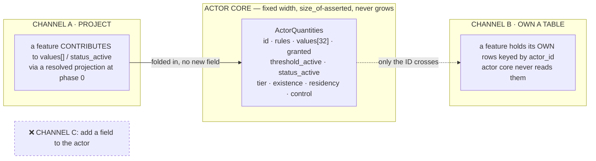

| | **(A) Project** | **(B) Own a table** |
|---|---|---|
| what the feature does | computes contributions folded into `values[]` or `status_active` | keeps its own rows keyed by `actor_id` |
| does actor core change? | **no** — no new field, no new ordinal reserved for the feature | **no** — it never learns the table exists |
| the reference model | `DF07_001`, which **owns no aggregate** (`DF7-A2`) and is purely a derived projection | `PL_007` items, `TVL` journeys, `ACT_001` opinion |
| what the tick sees | the folded number | **nothing** |
| examples | equipment → stats · progression → attributes · status → modifiers | inventory · titles · opinion · travel · combat session |

**A feature may use both.** Equipment owns `actor_equipment` (B) *and* projects modifiers through `DF7`
(A). Status owns `actor_status` (B) *and* projects `status_active` (A). The two are channels, not
categories.

**There is no channel C.** Adding a field to the actor for a feature is the collapse mode, and §12.5 says
what mechanically stops it.

### 12.4 Where an edge is stored — the rule the item example gives us

> *An actor merely **owns** an item; the item is not a structure welded onto the actor.*

The actor has **no `inventory` field**, and it must never grow one. The corpus already does this right:
`EF_001`'s `LocationKind::HeldBy(actor)` puts the edge **on the item**. Generalising:

| relationship | cardinality | where the edge is stored | example |
|---|---|---|---|
| actor **owns** a thing | many things → one actor | **on the thing** | `item.location = HeldBy(actor)` |
| actor **participates in** a thing | many actors → one thing | **on a membership row** | `session_participation` · `travel_party` |
| actor ↔ actor | many ↔ many | **on a pair table** | `control_binding` · `actor_actor_opinion` |
| actor **has a value** | one per actor | **in core, only if it passes §12.1** | `values[ord]` |

**The rule: an edge is stored on the MANY side, or on a pair table when both sides are many. Never on the
one side.** An `inventory: Vec<ItemId>` on the actor is the same error as `opinions: Vec<...>` and
`titles: Vec<...>` — three features, one unbounded field each, and the actor is a god object by the third.

This also settles what *"an actor owns an item"* means for the tick: **nothing.** A law reads `values[]`.
If a sword should raise attack, equipment **projects** through channel A; the tick never learns a sword
exists.

### 12.5 Four ways this collapses later, and what mechanically prevents each

| # | collapse mode | what actually stops it |
|---|---|---|
| **1** | **Fields accrete.** Every feature adds *"just one field"*; by the tenth the actor is a god object — `QTY-Q10`'s slow road at struct level | **`size_of::<ActorQuantities>()` is asserted.** A new field trips it, so accretion is a **build failure**, not a review opinion. ⚠ **This is why `statuses: StatusSet` mattered so much: an unsized field disables the only anti-accretion mechanism we have.** `QTY-A12` is not merely a `Vec`-trap guard — **it is the architecture's load-bearing gate**, and that had not been said |
| **2** | **Ordinals get claimed by features.** A feature reserves slot 30 for itself; 32 runs out; every reality's digest moves | **an ordinal belongs to a REALITY's declared quantity, never to a feature.** A feature contributes *to* an ordinal the reality declared; it never *owns* one. Checkable at `O-13`: no engine-reserved ordinals exist |
| **3** | **Features read each other's tables.** N² coupling; a schema change anywhere breaks everywhere | **only the `id` crosses a boundary** (`D-15`). Cross-feature effects go through **channel A** — a projection, computed at a defined point — not through a join |
| **4** | **The hot struct becomes a join target.** A law wants opinion + inventory + titles, so a read-time god object appears and the boundary is gone in practice | **§4.7: a law reads the quantity block and nothing else.** Everything a law needs is folded in **before** phase 0 or is not available to it. This is what makes `D-24`'s hand-off safe: no law can come to depend on a feature that does not exist yet |

**Risks 1 and 4 are the fatal ones**, and both already have a mechanism — one a compile-time assertion,
one a phase rule. What was missing was *saying they are load-bearing for the architecture*, so nobody
weakens them for a good local reason.

### 12.6 The checklist for attaching a new feature

A new feature answers four questions, and none of them is *"which field do I add"*:

1. **Which channel?** (A) project into quantities/status · (B) own a table · both.
2. **If (B), where does the edge live?** §12.4's cardinality table decides — the many side, or a pair table.
3. **If (A), what does it contribute, and at what point is the projection computed?** It must be **before
   phase 0**, or `O-25`'s ordering problem reappears one level down.
4. **Does the tick need it?** If **no** — and the honest answer is usually no — the feature never touches
   actor core at all, and `D-24`'s hand-off shape applies.

**If a feature cannot be attached without editing `ActorQuantities`, that is the signal to stop** — the
same signal `D-24` used at feature scale, applied at field scale.

### 12.7 What this audit changes in this document

| # | change |
|---|---|
| **1** | **`statuses: StatusSet` is removed** and replaced by `status_active: u64`, a phase-0 projection. The records stay with `PL_006`. This closes a boundary violation **and** restores `size_of` computability |
| **2** | **§3's struct is annotated with its total size**, so the `QTY-A12` assertion has a subject. An unsized field is now itself a defect (`O-36`) |
| **3** | **`control` is documented as a cache under a stated rule** — reconstructible from `control_binding`, never authoritative, refreshed at rebind. Which is `P-F`'s snapshot rule applied to a field (`O-37`) |
| **4** | **§12.3's two channels and §12.4's edge rule become the extension contract**, and §12.5's four collapse modes name what enforces them |
| **O-36** | **An unsized field in `ActorQuantities` disables the architecture's anti-accretion gate** (§12.5 risk 1). `statuses: StatusSet` was exactly that, and is removed. The rule replacing it: **every field carries a byte count and the struct states its total**, so `size_of` is computable and the `QTY-A12` assertion has a subject. The assertion IS the check — and it is only as good as the struct staying `Copy`-shaped throughout, which nothing currently enforces.  <br>▸ **✅ fixed** · field removed, total stated (216 B). The rule: every field carries a byte count. |
| **O-37** | **A cached field needs a stated rule, and `control` is the first one.** §12.2 keeps `control: Option<ControllerId>` as a cache of `control_binding`. Legal only under `P-F`'s rule one level down — **reconstructible · never authoritative · refreshed at a stated point** (rebind). None of the three is written as an obligation, and a cache that can silently diverge from its source is exactly what `P-F` exists to prevent, here inside a struct instead of inside a snapshot.  <br>▸ **A → §18.1** · **merged with `O-38`** — reconstructible · never authoritative · **refreshed at phase 0**. |
| **O-38** | **`status_active`'s projection point is unspecified.** §12.3 requires a channel-A projection to be computed **before phase 0**, or `O-25`'s ordering problem reappears one level down — a status applied mid-tick would be visible to some laws and not others. §4.7's phase table has no projection step; adding one is the concrete shape of part of `O-14`.  <br>▸ **A → §18.1** · **merged with `O-37`** — the tick gains **phase 0 · Resolve**; Input becomes 1. |

---

## 13. Decoupling, designed — how a feature reaches the actor without the engine knowing it exists

> §12 named two channels and stopped one step short. **Channel A as written is a trap**, and this section
> closes it. The fix is not new — it is `CPL-A17` generalised, and the corpus has already validated it in
> one place.

### 13.1 The trap in "a feature projects into `values[]`"

Read that sentence as an implementation and it means: **during the tick, feature code runs.** Which
requires the engine to call into features, which requires the engine to hold a list of features, which is
`D-2` violated at the worst possible layer — *the engine is an environment; it fixes the operations, never
the nouns.* An engine that enumerates features has features as nouns.

Every escape from that is worse than the disease:

| escape | why it fails |
|---|---|
| a plugin registry the engine iterates | the engine now depends on features; ordering becomes a registration-order bug; replay depends on load order |
| one designated projector module that knows every feature (the `DF7` shape, generalised) | the coupling is **concentrated, not removed** — and adding a feature means editing that module, so it grows without bound. **This is §12.5's god-object collapse, relocated one file over** |
| features call the engine to register contributions | inverted, but still a runtime handshake, still order-dependent, still unreplayable |

External practice says the same thing in one line: *in an ECS environment, **systems should never have
dependencies on each other**.*

### 13.2 The axiom that removes it — and it is already in the corpus

> **`CPL-A17`** — a generated effect is a **COMPOSITION of engine primitives** (`ABL_001`'s op list,
> `ModifierOp::{Flat, Percent}`), **never executable logic.**

It was written for *generated* effects. It is true of **all** of them, and generalising it is the whole
decoupling design:

> **A contribution is DATA, never CODE. A feature does not run during the tick; it leaves ROWS, and the
> engine folds rows.**

⇒ **§12's two channels collapse into one.** There is exactly one channel — **a feature owns tables** — and
**one of the table shapes is understood by the engine.** The engine never calls a feature, never
enumerates features, and never learns that "equipment" is a word.

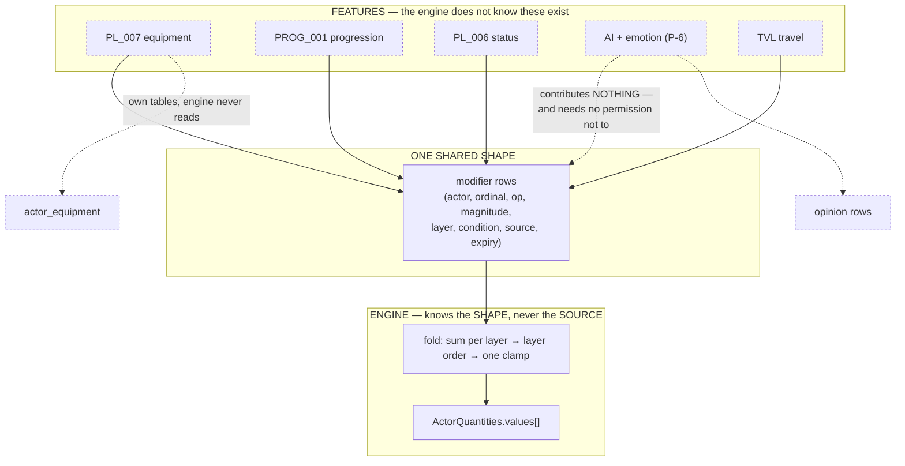

**The test this passes that a registry does not:** a feature that contributes *nothing* — opinion, titles,
journeys — needs no opt-out, no null implementation, no registration. It simply writes no rows. Absence is
free, which is what makes the architecture survive features nobody has thought of.

### 13.3 The row, and every field earns its place

```
ModifierRow {
  actor:     ActorId              // who
  target:    QuantityOrdinal      // which quantity — must be `granted` on this actor
  op:        ModifierOp           // Flat | Percent — ENGINE-CLOSED (D-2 mechanism)
  magnitude: i32                  // fixed-point; D-8's byte-stable arithmetic
  layer:     LayerOrdinal         // DF7-A3's locked layer order
  condition: Option<ThresholdOrd> // §13.5 — NOT a predicate grammar
  source:    SourceRef            // (feature, row_id) — removal + audit + "why is my attack 47"
  expiry:    Option<FictionTime>  // the CK3 shape, and it makes decay free
}
```

`source` is the field that does the most work and is easiest to leave out: it makes removal mechanical
(delete by source, not by matching values), it makes *"why is my attack 47"* answerable — the same
*causes-not-levels* property §4.8.2 recorded — and it gives the audit a subject.

**The engine validates the SHAPE and nothing else**: `target` is granted · `op` is in the closed set ·
`layer` is declared · `condition` names a declared threshold. It never asks what the source means.

### 13.4 Staleness is impossible, not merely detectable — and the corpus already proved it once

The obvious objection to materialised rows: unequip the sword, forget the row, keep +10 attack forever.

| approach | verdict |
|---|---|
| re-derive from feature tables each fold | needs a folder that knows every feature — §13.1's god module |
| an epoch/version bump + invalidation | works, but leaves a window and needs a re-materialiser |
| **write and remove the row in the SAME COMMIT as the feature row that justifies it** | ✅ |

**Chosen: atomicity.** Equipping writes `actor_equipment` **and** the modifier rows in one commit;
unequipping removes both in one commit. There is no sync step to forget, because there is no second step.

**And the corpus has already validated exactly this shape** — `PL_007` §8.4's equipment clearing runs
*"**inside** the `EF_001` HolderCascade atomic batch, **not after it**"*, precisely because doing it after
would leave equipment rows referencing dropped items. Same reasoning, same conclusion, one level up.

`D-16`'s L2 persistence service is what makes it cheap: both writes are already going to the same place
through the same commit.

### 13.5 Conditions reuse thresholds — and this is the decision that avoids a scripting language

*"+10 attack while below 30% hp"* cannot be a static row. The tempting answer is a predicate grammar over
ordinals — and it is a trap, because a grammar with nesting is a scripting language, and **putting a
scripting language in the manifest is `CPL-A17` violated by the very mechanism meant to honour it.**

**We do not need one. A threshold is already exactly this concept, already declared, already evaluated,
already in the hot struct.**

```
condition: Option<ThresholdOrdinal>   // "while threshold T is active on this actor"
```

| what it buys | |
|---|---|
| **no new grammar** | nothing to design, validate, sandbox or bound |
| **evaluation is a bit test** | `threshold_active` is already in `ActorQuantities` — a conditional modifier costs one AND |
| **the vocabulary stays the author's** | *below 30% hp* is a threshold the reality declared; the engine never learns what 30% means |
| **it reuses the wave we already bound** | a threshold crossing already flows through §4.6's propose/adjudicate path with `O-10`'s depth budget |

An author who wants a condition that is not expressible as a threshold must **declare the threshold** —
which is the right pressure, because a condition worth attaching a modifier to is worth naming.

### 13.6 Fold order — the same shape as `O-7`, deliberately

> **sum within a layer · apply layers in `DF7-A3`'s locked order · ONE clamp at the end.**

Identical in structure to `O-7`'s decision for deltas (sum within class · engine-fixed class order · one
clamp), and that is not a coincidence — **a modifier and a delta are the same kind of thing seen at
different times**: a delta changes a value now, a modifier changes what the value would be. Giving them
different fold rules would be two mechanisms for one concept, the defect this document keeps finding under
other names.

**Stacking policy is declared vocabulary, not mechanism.** Prior art gives the closed set — *full stacking*
(simple, exploitable) · *highest-only* (safe, wasteful) · *diminishing* (recommended in practice) — and
`PL_006` already declares stack policy per status flag (`Sum` / `ReplaceIfHigher`). Same closed set, one
level up: the engine implements all three; the manifest picks per quantity.

### 13.7 What every feature does under this, end to end

**Worked: Lý Minh equips a jian (+10 attack, +5% speed).**

```
ONE COMMIT:
  actor_equipment[LM01].weapon = jian_001            ← PL_007's own table (channel B)
  modifier_rows += {LM01, ord(attack),  Flat,    +10, layer=Equipment,
                    condition=None, source=(PL_007, equip#4471), expiry=None}
  modifier_rows += {LM01, ord(speed),   Percent,  +5, layer=Equipment,
                    condition=None, source=(PL_007, equip#4471), expiry=None}

NEXT TICK, phase 0:
  engine folds every modifier row for LM01 → values[]
  engine has not learned that swords exist

UNEQUIP, ONE COMMIT:
  actor_equipment[LM01].weapon = None
  DELETE modifier_rows WHERE source = (PL_007, equip#4471)
```

And the whole census under the same rule:

| feature | own table (B) | modifier rows | engine knows? |
|---|---|---|---|
| `PL_007` equipment | `actor_equipment`, `item_instance` | ✅ on equip | no |
| `PROG_001` progression | `actor_progression` | ✅ on tier advance | no |
| `PL_006` status | `actor_status` | ✅ per `§8.3b` stat-layer flags | no |
| `TVL` travel | journeys, mounts, parties | ✅ stamina drain modifiers | no |
| `COMB_00x` combat | `combat_session` (ephemeral) | ✅ `slowed`/`hasted` | no |
| **AI + emotion (`P-6`)** | opinion, memory | **none — and needs no permission** | no |
| `TIT` · `FAC` · `REP` | holdings, membership, standing | none today | no |
| `EF_001` entity | `entity_binding`, lifecycle log | none — it writes `existence` directly, engine-owned | it **is** engine-adjacent |

### 13.8 The acceptance test for the whole design

> **Adding a feature must touch ZERO files in actor core.**

Under this design it does: a new feature writes its own table and, if it affects quantities, writes rows
in a shape that already exists. No engine edit, no registry entry, no struct field, no reserved ordinal,
no `DF7` edit. `size_of::<ActorQuantities>()` does not move, so §12.5's anti-accretion gate is never even
approached.

**If a proposed feature cannot be added without touching actor core, the design has failed and the feature
is telling us so** — which is the same signal `D-24` used at feature scale and §12.6 used at field scale,
now at architecture scale.

### 13.8b The commit primitive — `O-39`+`O-40` collapse into one signature (§18.2)

A feature must not write `modifier_rows` **at all**: many writers on one table violates `D-37`, and
`D-28`'s same-commit atomicity was only a sentence. Both dissolve if the API offers no way to get it
wrong:

```
commit_with_modifiers(
    feature_row: <the feature's own aggregate delta>,
    modifiers:   Vec<ModifierRow>,        // may be empty
) -> Result<Seq, RefusedCommit>
```

One call · one transaction · one `seq`. Unequip passes the equipment removal **and** the modifier
deletions; there is no second step to forget because none exists. **The engine is the sole writer** of
`modifier_rows`, atomicity becomes a *signature* rather than a rule, and shape validation (target granted ·
op in the closed set · layer declared · condition names a declared threshold) happens at exactly one place.

This is the shape `PL_007` §8.4 already found by hand — equipment clearing *"runs **inside** the `EF_001`
HolderCascade atomic batch, not after it."* That was one feature getting it right once. This makes it the
only way to express it.

### 13.9 What this leaves open

| # | |
|---|---|
| **O-39** | **`modifier_rows` has no owner.** It is a shared-shape table every feature writes and the engine reads — which fits none of the census's 31 aggregates, and `D-15` says a shared row with many writers is exactly the tenancy smell. It needs an owner, a scope key, and a write capability per `EVT-A4`'s producer-role binding. **The likely answer is that the engine owns it** and features write through a commit primitive rather than directly — but that is asserted, not decided.  <br>▸ **A → §18.2** · **merged with `O-40`** — the ENGINE owns `modifier_rows`; features write through a primitive. |
| **O-40** | **Nothing enforces the same-commit atomicity of §13.4.** It is the rule that makes staleness *impossible* rather than *detectable*, so it is load-bearing, and today it is a sentence. `PL_007` §8.4 achieves it in one place by being written carefully. A generic mechanism — a commit primitive that takes the feature row and its modifier rows together, or it takes neither — is what turns the rule into a shape.  <br>▸ **A → §18.2** · **merged with `O-39`** — `commit_with_modifiers(row, mods)`: atomicity becomes a **signature**. |
| **O-41** | **A modifier row's `expiry` re-opens `O-12`.** An expiring modifier changes a value, which can cross a threshold, which can propose a status, which can add a modifier. That is the §4.6.6 wave, entered from a new door, and `O-10`'s depth budget must cover it. The row shape makes the door explicit; nothing binds it to the budget yet.  <br>▸ **A → §18.1** · expiry is evaluated at phase 0; its consequences enter the same tick's wave under `O-10`'s budget — same answer as `O-12`. |
| **O-42** | **Fixed-point magnitude has no stated scale.** `magnitude: i32` with `Percent` implies a denominator, and `PL_006` §8.3b already mixes ‰ (`Accuracy` Flat −20·m ‰) and % (`Speed` Pct −5·m %) **in the same table**. `D-8`'s byte-stable arithmetic requires one declared scale, or two features compute different numbers from the same row.  <br>▸ **A → §18.4** · one scale, **`1e-4`**. Manifest authors human units; the loader converts once at S1→S2, **inside the hashed bytes**. |

---

## 14. Data lifecycle, storage layers and instance disposal — measured, not asserted

> **PO 2026-08-02:** *the data lifecycle is not defined · from the kernel up to the user's FE the data
> crosses many modules and many storage forms and this was never discussed · multi-layer caching is never
> mentioned, and a game that does not define this will certainly die · audit the actor-core manifest and
> the event sourcing · how does the kernel handle ingest · how is an actor instance created and what is
> its lifecycle · what does the garbage collector do — Rust has none, but the kernel and engine must
> define it explicitly, because an instance has stages and needs an explicit answer.*
>
> Every claim below is measured against code. Given `DR-7`, an **absence** claim is treated as a
> measurement that must be taken, not an observation that can be made.

### 14.1 First, what I got wrong — `DR-11`

**§9.2's three storage layers were derived from Photon and Orleans without opening `crates/`.** They are
not a proposal. They are a **partial and uninformed description of machinery this repo already has**:

| §9.2 called it | what is actually in the tree | LOC |
|---|---|---|
| *"L3 durable — event log"* | `dp-kernel/src/event_store.rs` · `event_store_pg.rs` · `aggregate.rs` · `load_aggregate.rs` | — |
| *"the snapshot"* | `crates/sim-core/src/checkpoint.rs` — `IslandCheckpoint`, with an explicit **loss table** | 273 |
| *(not mentioned at all)* | **`crates/projections`** — the read model | **1 486** |
| *(not mentioned at all)* | **`crates/rebuilder`** — per-aggregate parallel replay rebuild | **1 043** |
| *(not mentioned at all)* | **`crates/projection-reference`** — an *independent* projection oracle | 855 |
| *(not mentioned at all)* | **`dp-kernel/src/canon_cache.rs`** — a real cache, whitelist-gated | — |

**This is `DR-7`'s failure in a new costume**: there I asserted an absence without grepping; here I
designed a layering from external prior art while four crates implementing most of it sat one directory
away. §9.2's conclusions survive — they are corroborated rather than refuted — but **its status changes
from "designed" to "belatedly discovered"**, and that distinction matters, because a design that turns out
to already exist has different next steps than one that does not.

### 14.2 The measured chain — every hop from kernel to browser

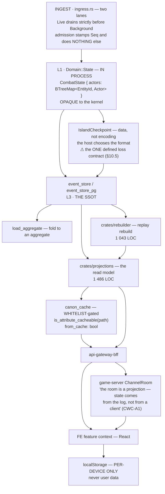

**Nine hops, at least four of which hold a copy of the same fact.** The PO's point stands exactly: nothing
in this corpus draws this chain, and **only one boundary in it has a stated loss contract.**

### 14.3 The four questions, answered against code

#### (a) How does the kernel ingest?

`crates/sim-core/src/ingress.rs` — **two lanes** (`SC-D1`): `Live` drains **strictly before**
`Background`. Admission stamps `Seq` **and does nothing else**; *"all validation happens at step time."*
Duplicate suppression is `seen.rs`. So ingest is **defined and narrow**, and deliberately so: admission
is ordering, not judgement.

#### (b) How is an actor instance created?

**It is not — not in production code.** `actors.insert` appears in exactly one place:
`services/commit-service/src/bin/spine.rs:143-145`, a smoke binary that hand-inserts three actors.
`Domain::State` is **opaque to the kernel**; the kernel moves entities only through `extract`/`install`
(`Portable`), and *"it never looks inside."*

⇒ **There is no spawn path.** `O-14` already recorded that `V4` (spawn) *"has no implementation at all"*;
this measurement gives it a cause — spawn was never the kernel's to own, and the domain never built it.
The only way an actor enters an island today is `install` **on arrival from another island**, which
presupposes it already existed somewhere.

#### (c) What is the instance lifecycle?

| stage | mechanism | where |
|---|---|---|
| enter | `install(state, id, portable)` — arrival only | `domain.rs:76` |
| exist | a `BTreeMap` entry | `state.rs:13` |
| change identity | **`Gen` bump** — *"bumped on lifecycle change"* | `types.rs:36` |
| leave an island | `extract` → `Portable` → `EntityDeparted`/`EntityArrived` | `domain.rs:72` |
| island ends | `dissolve(reason)` — current-generation work is `transferable`, **stale-generation items are counted and dropped** | `lifecycle.rs:193` |

#### (d) What does the "garbage collector" do?

**The mechanism exists and is the right one; the disposal half does not exist at all.**

Rust has no GC, so the correct pattern is a **generational index** — and the kernel already has it:
`Gen(u32)`, compared in `Precondition::EntityAlive { id, generation }`, so a reference pinned to an old
generation **fails** rather than silently addressing a recycled slot. `registry.rs:20` shows the team
reasoning about exactly this: *"Gen(0) would **RESURRECT** old-epoch refs pinned to Gen(0)."*

**What is missing is everything after the guard:**

| | status |
|---|---|
| stale-reference detection | ✅ `Gen` + `EntityAlive` |
| **removal** | ❌ **`actors.remove` appears nowhere in the tree.** An actor, once inserted, is never removed |
| free list / slot reuse | ❌ none — a `BTreeMap` has no slots to reuse |
| a defined "dead" stage | ❌ `existence` is designed (§5.8) and unbuilt; nothing connects it to storage |
| generation exhaustion | ⚠️ see below |

**⚠ The counters use `saturating_add`** (`island/mod.rs:99,212` · `registry.rs:23,36,51`). Saturation turns
a monotonic guard into a **constant**: once a counter reaches `u32::MAX` it stops bumping, and a reference
pinned at `MAX` starts passing again — **the resurrection the code explicitly guards against at `Gen(0)`,
reappearing at the other end.** Reachability depends on bump frequency, which I have **not** measured, so
this is recorded as a defect of *kind*, not of *severity*.

### 14.4 The collection was never designed — and §3 assumed it was

§3.1 argued **archetype layout** from a measured trade-off: composition changes once at spawn, iteration
every tick. That argument is about the **element**. The **collection** is:

```rust
pub struct CombatState { pub actors: BTreeMap<EntityId, Actor> }   // state.rs:13
```

A `BTreeMap` is **not an archetype store.** It gives deterministic iteration order (by key — genuinely
valuable for replay, and probably why it was chosen) and pointer-chasing traversal, which is the exact
property §3.1's archetype argument was made to avoid. **A dense `Copy` element inside a tree map buys the
`size_of` assertion and none of the cache locality.**

This is not a defect to fix today — it is a **decision that was never taken**, and §3 reads as though it
had been. The honest form: *§3 decided the element layout; the collection layout is open* (`O-43`).

### 14.5 The caching audit — ⚠️ **"one cache" is WRONG; §15.2 corrects it to at least two**

**One cache exists**, and its design is better than most: `canon_cache.rs` is **whitelist-gated**
(`is_attribute_cacheable(attribute_path)` — not cacheable by default, which is the safe polarity), carries
an explicit `from_cache: bool` so a caller can tell hot from cold, and refuses out-of-whitelist paths with
a named error rather than silently passing through.

**Every other copy in §14.2's chain has no stated contract**, and these are the questions nothing answers:

| copy | who invalidates it | staleness bound | on divergence |
|---|---|---|---|
| `Domain::State` in process | — | — | — |
| `IslandCheckpoint` | ✅ **§10.5 loss table** — the only one | explicit | explicit |
| aggregate from `load_aggregate` | ? | ? | ? |
| `projections` read model | ? | ? | ? |
| `canon_cache` | ✅ whitelist + `from_cache` | ? | ? |
| gateway response | ? | ? | ? |
| `ChannelRoom` state | *"a projection… from the log"* | ? | ? |
| FE feature context | ? | ? | ? |
| `localStorage` | per-device only (CLAUDE.md) | n/a | n/a |

**`P-F` already decided the rule for one of these and it generalises to all of them**: *a derived copy is
a load accelerator, never a source; it disagrees with the log ⇒ it is discarded, never reconciled; and it
must carry the `seq` it was taken at or it cannot be checked.* Stated for snapshots, it is the same rule
for a projection, a `canon_cache` entry, a room's state and a React context — **the chain needs one rule,
not nine** (`O-44`).

### 14.6 Where the manifest actually enters, and the gap that leaves

The manifest resolves at S1→S2 into a `Ruleset`, and the island derives its digest **through the domain**
(`Domain::rules_digest`) precisely so an island cannot claim a digest that does not describe its rules —
*"a pair that must agree should not be two arguments."* That is sound, and it is the one place the actor's
provenance is mechanically tied to its data.

**What has no counterpart:** `RulesPin` on the actor (§3) has nothing in the tree. `CPL-A8` requires the
**content** manifest to be pinned into the reality binding exactly as the ruleset is, and doc 38 records
that `RealityManifest` appears in *eight design docs and zero lines of code*. So the actor's rules are
pinned at the **island** level, per-actor pinning is designed only, and the content half is pinned nowhere
(`O-45`).

### 14.7 What this section adds to the register

| # | |
|---|---|
| **O-43** | **The actor COLLECTION's layout was never decided.** §3.1 argues archetype from measurement, but that argument is about the element; the container is `BTreeMap<EntityId, Actor>`, which gives deterministic iteration (valuable, likely why) and pointer-chasing traversal (the thing archetype layout exists to avoid). Decide it, and if `BTreeMap` stays, say **why** — §3.1 currently reads as though the container question had been answered. <br>▸ ⚠️ **THIS ROW IS SUPERSEDED TWICE — see the struck `O-43` and `O-43b` at the end of this register.** §15.1 #3 retracted its *evidence* (a stub decides nothing); §18.3 **decided** the question (dense slot array). Kept only so the problem statement survives next to its answer. |
| **O-44** | **Nine copies of the same fact, one loss contract.** Only `IslandCheckpoint` states what is lost and how it heals (§10.5). `P-F`'s rule — *derived copy · never a source · discarded on divergence · carries its `seq`* — was written for snapshots and is the rule the whole chain needs. **One rule, applied nine times, not nine rules.** Without it the failure is the classic one: a stale read that no layer owns and every layer blames the next for.  <br>▸ **A → §18.4** · every derived copy carries **`(reality_id, seq)`** — 16 bytes, uniform. Without it `P-F` is a slogan. |
| **O-45** | **The actor's `RulesPin` is designed and unpinned.** The island ties rules to digest through `Domain::rules_digest`; the per-actor pin §3 depends on has nothing in the tree, and the **content** manifest is pinned nowhere at all (`CPL-A8`; `RealityManifest` — eight docs, zero code). `QTY-A14` says an ordinal is meaningless without its digest, so this is the gap that makes a stored `values[7]` uninterpretable across an epoch.  <br>▸ **C → §18.4** · narrowed by §17 to the **rules** half only: `RulesPin` per-actor + `RulesPinChanged`. Identity is closed. |
| **O-46** | **Nothing removes an actor.** `actors.remove` appears nowhere; `actors.insert` appears only in a smoke binary. So today the disposal answer is *nothing is ever disposed*, chosen by omission. The generational guard (`Gen` + `EntityAlive`) is the correct **detection** mechanism and is already built; what is missing is the **transition** — which stage removes the row, what the removal emits, and whether the id is ever reusable. `existence` (§5.8) is where the stage lives; nothing connects it to storage. <br>▸ ⚠️ **THIS ROW IS SUPERSEDED TWICE — see the struck `O-46` and `O-46b` at the end.** §15.1 #4 retracted its *evidence*; §18.3 **decided** it — disposal is cache eviction, not deletion. Kept for the problem statement only. |
| **O-47** | **`saturating_add` on a generation counter converts a monotonic guard into a constant.** At `u32::MAX` the counter stops bumping and a reference pinned at `MAX` becomes valid again — the resurrection `registry.rs:20` explicitly guards against at `Gen(0)`, at the other end of the range. Reachability is unmeasured, so this is a defect of kind. The fix is a policy decision (wrap + a wider type, or refuse to bump and fail loudly), not a one-line change.  <br>▸ **A → §18.3** · **`Gen(u64)`**, saturating, plus a tick invariant asserting no slot is at `MAX` — "unreachable" becomes checked, not argued. |

---

## 15. SSOT and the write/read boundary — retraction first, then the design

> **PO 2026-08-02:** *the combat logic we coded is only a STUB — do not reference it as truth. I am
> considering demolishing the whole upper layer, because I have not even defined the combat feature yet.
> Actor core is the FIRST game element to be designed, so most current code is stub. We need an SSOT and a
> domain/data boundary so reads and writes stop overlapping and the thing is manageable.*

### 15.1 Retraction — eight claims in this document rested on a stub

`services/commit-service/src/domain/` is **649 lines of scaffolding**. I cited it as evidence eight times,
and in two of those I gave it the weight of a shipped design. Marking them is not bookkeeping — a stub
read as truth is a **rot source**, and it has already misled this document four times:

| # | what I claimed | why it was wrong |
|---|---|---|
| **1** | §7.2: *an actor extracted mid-tick emits a fabricated `Missed`* (`law.rs:157-180`), and `Actor::absent()` can fabricate a `Victory` | a bug **in a stub** is not a finding about the design. It says nothing about what the real law should do |
| **2** | §5.10.5: *"this is **already shipped**"* — `Admitted<D>` + the turn economy binding NPCs like players (`actor.rs:40-51`) | **the strongest form of this error.** I called a stub *shipped* and used it to support the control design. The symmetry argument survives on its own merits (`IAS-A9`); the evidence does not |
| **3** | `D-34`/`O-43`: *`BTreeMap<EntityId, Actor>` is a decision never taken* | a container in a stub carries **no decision content at all**. The question — what the collection layout should be — is real; the claim that something was silently decided is not |
| **4** | `O-46`: *nothing removes an actor; `actors.remove` appears nowhere* | true of the bytes, and worthless as evidence. Of course a stub has no disposal path. **The design question stands and is now re-derived from first principles, not from an absence in scaffolding** |

Also retracted from `O-14`: *"`CombatDomain::apply` reads and writes `state.actors` in one pass"* — the
phase discipline is still unbuilt, but the sentence dressed a stub as the incumbent design it must
replace.

**The rule I should have been applying, and now state:** *`crates/` (kernel: `sim-core`, `dp-kernel`,
`ruleset-core`, `ruleset-loader`, `projections`, `rebuilder`) is measurable evidence — it carries
invariants, gates and tests. `services/commit-service/src/domain/` is a sketch of a feature that has not
been designed. **Never cite the second as a decision.*** (`O-48`)

### 15.2 …and one measurement in §14 was simply wrong

§14.5 said *"one cache exists."* There are **at least two**, both in the kernel:

| | what it holds | keyed by |
|---|---|---|
| `dp-kernel/src/canon_cache.rs` | canon attribute reads, **whitelist-gated** | attribute path |
| `dp-kernel/src/snapshot_cache.rs` | **reconstructed aggregate state**, bounded in-memory LRU | `(reality_id, aggregate_type, aggregate_id)` |

`snapshot_cache` is the more important one and I missed it: it short-circuits *"repeat loads of hot
aggregates (e.g. an NPC currently in dialogue → load cycle per tick)"* — **the actor read path, which is
the subject of this entire document.**

### 15.3 The SSOT question is already answered in the kernel, and better than I was about to answer it

I was about to propose that an aggregate row must be a **fold of the log** rather than a parallel store.
`load_aggregate.rs` already implements exactly that:

| path | snapshot | events since | behaviour |
|---|---|---|---|
| A | none | any | **fold all events from v0** (cold) |
| B | exists | > 0 | deserialize snapshot, **fold the delta** |
| C | exists | none | return the snapshot |

And the decisive line is a **migration comment**, `0004_aggregate_snapshots_table.up.sql`, quoted in
`load_aggregate.rs:15`:

> **"snapshots are a write-path cache, not the SSOT"**

**That is `P-F`, written by this team, before I "designed" it in §6.1b from Orleans.** Which makes `P-F`
the second thing in two sections that I derived from outside while it sat in `crates/` — `DR-11`'s
pattern, again, and the reason §15.1's rule matters.

### 15.4 The design, stated as four rules

Everything above collapses into four rules. They are small on purpose: an ownership model nobody can hold
in their head is one that gets violated by accident.

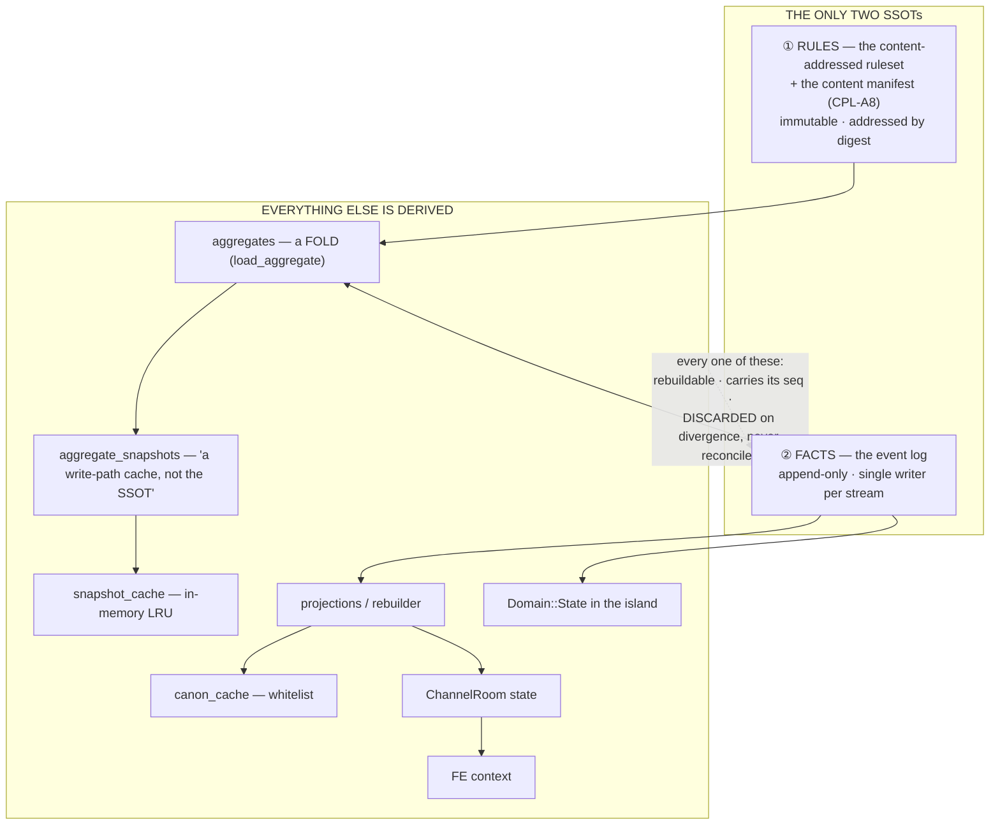

> **R1 · TWO SSOTs, and only two.** **Rules** = the pinned ruleset digest (plus the content manifest,
> `CPL-A8`). **Facts** = the event log. Nothing else is ever a source. `Domain::State` inside a running
> island is **not** an SSOT — it is the fold-so-far, and it must be reconstructible from log + checkpoint
> or the island cannot be restored.
>
> **R2 · SINGLE WRITER.** Each aggregate/stream has **exactly one** writing owner. This is the
> established discipline — *"only one writer should be allowed to write to a given event log"* — and its
> reason is **replay**, not concurrency: Akka's formulation is that multiple writers *"would store
> interleaving events based on different states, and when these events would later be replayed it would
> not be possible to reconstruct the correct state."* That is `O-21b`'s concern one level up. **The corpus
> already has this rule** — `EVT-A4` producer-role binding, and `PL_005` §5.2's *"side-effect Derived
> events emitted by Aggregate-Owner role services, NOT directly by the Interaction feature."* What it does
> not have is a machine check.
>
> **R3 · DECLARED READERS.** A writer may be sole, but reads leak too: the anti-pattern is a **hidden
> contract** — two components reading and writing the same rows in ways that are not mutually compatible,
> with nothing recording the dependency. So a feature **declares the aggregates it reads**, and a read
> outside its declared set fails. This buys the thing prose ownership never does: **the blast radius of a
> schema change is computable**, because the readers are enumerable.
>
> **R4 · ONE RULE FOR EVERY DERIVED COPY** — `P-F`, generalised to all nine hops of §14.2: *rebuildable
> from the SSOT · carries the `seq`/version it was taken at · **discarded on divergence, never
> reconciled***, because the SSOT wins by construction. This is not new policy — it is the migration
> comment above, applied to the eight copies that do not yet say it.

### 15.5 Where reads and writes overlap today, and what each rule fixes

| overlap | which rule | what changes |
|---|---|---|
| `dp::t2_write` writes a row **and** an event is emitted | **R1** | the row is the fold, never a second store. `load_aggregate` already works this way; the feature-layer API must not offer a path around it |
| any feature can `read_projection_reality::<T>` any `T` | **R3** | reads stay cheap, but the **dependency becomes recorded**. Today `PL_005`'s validator reads six other features' aggregates and none of them knows |
| `Domain::State` vs the aggregates during a tick | **R1** | there is no contest: L1 is a fold-in-progress. Authority never moves; only the fastest place to read it does |
| nine copies, one loss contract (`O-44`) | **R4** | one rule, applied nine times |
| the ownership matrix is **prose** | **R2 + R3** | it must become a machine contract — and it is already the right source for `O-27`'s generated enum, so one artifact serves both |

### 15.6 On demolishing the upper layer

The PO is weighing it. The evidence from this document, stated plainly and without a recommendation
dressed as a fact:

**For.** It is **649 lines**. It implements a feature (`D-14`, combat) that has **not been designed** and
is scheduled to be rewritten. It has already **misled this specification four times** (§15.1) — and I am
the reader best positioned to know better, having written the rules it violated. A stub whose only current
function is to supply false evidence is a **liability with no offsetting asset**.

**Against.** It is the only end-to-end path through the kernel that exists, so deleting it removes the one
worked example of `Domain` being implemented — and `sim`'s tests may lean on it (unverified; `crates/sim`
has its own harness domain, which suggests not).

**The distinction that matters is not "delete or keep" but "kernel or feature":** `crates/`
(`sim-core` · `dp-kernel` · `ruleset-core` · `ruleset-loader` · `projections` · `rebuilder`) is real,
gated, and repeatedly proved this document wrong in useful ways. `services/commit-service/src/domain/` is
a sketch. **Whatever is decided, they must stop being read with the same weight** — which §15.1's rule
achieves at zero cost, and demolition achieves permanently.

### 15.7 New open items

| # | |
|---|---|
| **O-48** | **A stub must be unmistakable as a stub.** `services/commit-service/src/domain/` misled this document four times, once into calling a stub *"already shipped"*. The convention that fixes it is mechanical and cheap: a module-level marker (`//! STATUS: STUB — <feature> is not designed; do not cite as a decision`) plus a gate that refuses a `docs/**` link into a marked path. Without it, the next reader repeats this exactly, because the code looks like every other module.  <br>▸ **C → §18.4 #1** · cheapest, and it stops the failure that produced four bad findings. |
| **O-49** | **`R2` single-writer is stated in the corpus and checked nowhere.** `EVT-A4` binds producer roles and `PL_005` §5.2 says the aggregate owner emits; nothing fails when a second writer appears. The check is enumerable — the ownership matrix names one owner per aggregate — so this is a gate over an existing table, not new design. The failure it prevents is **replay-shaped**: interleaved events from two writers cannot be folded back into a correct state.  <br>▸ **C → §18.4 #3** · a check **over** `O-51`'s artifact, not new design. |
| **O-50** | **`R3` declared readers does not exist in any form.** `dp::read_projection_reality::<T>` lets any component read any aggregate, so a schema change has an **unknowable** blast radius. `PL_005`'s validator alone reads six other features' aggregates. The fix is a per-feature declared read-set enforced at the primitive, which also makes *"who breaks if I change this"* a query instead of a grep.  <br>▸ **C → §18.4 #3** · likewise. |
| **O-51** | **The ownership matrix must become a machine contract.** It is prose today, in `_boundaries/01_feature_ownership_matrix.md`, and three separate needs now converge on it: `O-27`'s generated `aggregate_type` enum, `O-49`'s single-writer gate, and `O-50`'s read-set declarations. **One generated artifact serves all three** — and the file has already been caught carrying false *"applied"* claims (`REC-97`), which is the strongest argument that a hand-maintained index cannot hold this weight.  <br>▸ **C → §18.4 #2** · the **source** for `O-49`, `O-50` and `O-27`. One artifact, four consumers. |
| ~~**O-43**~~ | ⚠️ **Reframed by §15.1 #3.** `BTreeMap<EntityId, Actor>` lives in a **stub**, so nothing was silently decided — there is simply no decision yet. The design question survives as `O-43b`. |
| **O-43b** | **The actor COLLECTION's layout is undecided** — and must be decided from the access pattern (§3.1: composition changes once at spawn, iteration every tick ⇒ archetype), **not** from what a stub happens to use. Deterministic iteration order is a real requirement replay imposes; a dense store satisfies it too, by construction.  <br>▸ **A → §18.3** · dense slot array + per-slot `Gen`; iteration order = slot order, deterministic by construction. |
| ~~**O-46**~~ | ⚠️ **Reframed by §15.1 #4.** *"`actors.remove` appears nowhere"* is true of the bytes and worthless as evidence — of course a stub has no disposal path. The design question survives as `O-46b`, re-derived rather than observed. |
| **O-46b** | **Actor disposal has no design.** The **detection** half is real and in the kernel (`Gen` + `Precondition::EntityAlive`). Missing: which `existence` stage removes the row · what the removal emits · whether an id is ever reusable · and — since `D-23` makes an actor's row a **fold over the ledger** — whether disposal is *deletion* at all or merely *cache eviction*, which would make it nearly free. That last question is the one to answer first, because it changes the shape of every other.  <br>▸ **A → §18.3** · **disposal is cache eviction, not deletion** (`D-23`). `EntityId` never reused; the SLOT is. Residue: which `existence` states are evictable = declared vocabulary. |

---

## 16. Architecture completeness — and the answer is not a list of missing things

> **PO 2026-08-02:** *reviewing this, a pile of serious things were missing — reads and writes, caching,
> lifecycle, the data/business boundary. All of them are the kind that collapse the whole architecture if
> absent. Search for software-design and MMO standards: what else are we missing?*
>
> I searched, then measured the tree against what the search returned. **The result contradicts the
> premise of the question, and that is the finding.**

### 16.1 Those four things were never missing from the PROJECT. They were missing from THIS SPEC.

| what we "discovered missing" | where it already lives |
|---|---|
| read/write ownership | `contracts/service_acl` (**1 430 lines**, default-DENY) · `contracts/events` (**3 281**) · `EVT-A4` producer-role binding |
| caching | `contracts/cache/keys.yaml` · `dp-kernel/canon_cache.rs` · `dp-kernel/snapshot_cache.rs` |
| lifecycle | `contracts/lifecycle` (**1 197**) · `contracts/entity_status` (**889**) · `dp-kernel/lifecycle.rs` |
| SSOT / derived-copy authority | `0004_aggregate_snapshots_table.up.sql`: *"snapshots are a write-path cache, **not the SSOT**"* |

**`crates/dp-kernel` is 15 095 lines across ~30 modules, and `contracts/` holds ~40 contracted domains** —
`capacity` (1 257) · `resilience` (1 576) · `observability` (2 315) · `tracing` (1 593) · `retention` ·
`backup/policy.yaml` · `migrations/manifest.yaml` · `rebuild/config.yaml` + `catastrophic_config.yaml` ·
`integrity/config.yaml` · `chaos` (757) · `incidents` · `postmortems` · `slo` · `alerts` · `pii` ·
`supply_chain`. Most `dp-kernel` modules are literally headed *"Rust mirror of `contracts/<x>/`"*.

**This is the fourth consecutive occurrence of one error** — `DR-7` (asserted an absence without grepping)
→ `DR-11` (designed storage layers from Photon/Orleans while four crates implemented them) → `DR-12` (cited
a stub as shipped) → **this**. Four rounds of *"a critical thing is missing"*, and in four rounds the thing
was in the tree.

**Diligence is not the fix, because I was being diligent.** The fix is procedural and it is in CLAUDE.md
already: *"every cross-cutting rule/law/invariant/machine-contract in the repo is catalogued in
`docs/standards/README.md` … it has a **quick-nav by concern***. **I never opened it.** The mechanism to
stop discovering the same things existed before this round began (`O-52`).

### 16.2 The completeness matrix — the platform contracts it, the GAME tier still owes something

The searches returned two useful checklists: **ISO/IEC 25010**'s eight quality characteristics (functional
suitability · performance efficiency · compatibility · usability · reliability · security ·
maintainability · portability) and the MMO-specific set (sharding · persistence · anti-cheat · netcode ·
matchmaking). Crossed against the tree:

| concern | platform tier — exists | **what the GAME tier still owes** |
|---|---|---|
| **data ownership / single writer** | `service_acl` default-DENY · `EVT-A4` | a **machine-checked** owner per aggregate — `O-49`/`O-51` |
| **read dependencies** | — | **declared read-sets — `O-50`. No platform analogue; this is genuinely ours** |
| **caching** | `contracts/cache/keys.yaml` · two kernel caches | **what invalidates a resolved quantity block** — `O-38`'s projection point |
| **entity lifecycle** | `contracts/lifecycle` · `entity_status` | the `existence` **vocabulary** (`D-12`) and **disposal** — `O-46b` |
| **retention / GC** | `retention/event_classes.yaml` · `backup/policy.yaml` | **pin-aware roots** — `O-15`. Retention by event *class* cannot see a `RulesPin` |
| **schema evolution** | `event_version` + an **upcaster** path (`envelope.rs`) · `contracts/migrations` · `LAW_VERSION` classified `Mutability::Frozen`, `Strategy::Forbidden` | **🔴 the ordinal↔digest binding across evolution — see §16.3** |
| **rebuild / recovery** | `contracts/rebuild` + `catastrophic_config` · `crates/rebuilder` · `IslandCheckpoint` | which of the nine copies rebuild from what — `O-44` |
| **capacity / backpressure** | `contracts/capacity` (1 257) | residency budget `O-1cd` · wave depth `O-10` |
| **resilience / failure** | `contracts/resilience` (1 576) · `chaos` · `incidents` · `postmortems` | what a law does with a refused proposal — `O-3` (decided §11.3) |
| **observability / SLO** | `observability` (2 315) · `tracing` · `slo` · `alerts` | what a tick emits, and whether a **veto** is observable (`O-11` says yes; nothing emits) |
| **security / authority** | `service_acl` · `platformjwt` · `adminjwt` · `pii` | — inherited |
| **trust boundary / anti-cheat** | `CWC-A1` *the room holds no authority* · `AGT-A6` *a Decision is a request, never a write* | — **already the strongest form**: the client cannot write, and neither can an LLM |
| **sharding / partition** | islands · `SPG-A11` AOI keys on the **controlled actor** | closed by `D-22` (island-local transfer) |
| **time / ordering** | `Seq` at admission · `Tick` · `TDIL` 4-clock | per-actor elapsed span — `O-26b` |
| **integrity** | `contracts/integrity/config.yaml` · conformance oracle · `projection-reference` | — inherited |
| **supply chain** | `contracts/supply_chain` | n/a |

### 16.3 ⚠️ **RETRACTED by §17 — this subsection was wrong twice over**

> **(1)** It called the gap *"the failure mode that silently corrupts history"*; **there is no history to
> corrupt** — zero production realities exist (`D-11`), and labelling unbuilt-but-buildable work a *danger*
> is the tell CLAUDE.md's anti-laziness rule names. **(2)** It is not unbuilt either: `activate_reality_epoch`
> refuses an ordinal rebinding at every epoch switch, validates before appending, and documents its own
> `NV-3` empty-priors trap. §17 carries the corrected account and the design the spec still owed.

### 16.3 (superseded) The gap the platform tier structurally cannot cover

Event-sourcing practice states the problem in one line: **events in the store outlive the code that
produced them**, and *"you can never retire old event versions."* The platform has the standard answer —
`event_version` on the envelope plus an **upcaster** path, the tactic ladder the literature recommends
(versioned events → weak schema → upcasting).

**That machinery cannot fix a game-tier event, and the reason is `QTY-A14`: an ordinal is meaningless
without its digest.**

An upcaster rewrites a payload's *shape*. A game event carrying `values[7] -= 30` needs something else
entirely: **the digest under which `7` meant what it meant.** Change a reality's declared quantity set and
ordinal 7 is a different quantity — the payload is still shape-valid, still upcasts cleanly, and now means
something else. **No schema-versioning tactic detects this**, because nothing about the shape changed.

The intended fix is `RulesPin` on the actor (§3) and `CPL-A8`'s content-manifest pin — and `O-45` records
that **neither exists in code**: the island ties rules to digest via `Domain::rules_digest`, but per-actor
pinning is designed only, and `RealityManifest` is *eight design documents and zero lines of code*.

⇒ **This is the failure mode that silently corrupts history rather than breaking a build**, it is
game-tier by construction, and it is `O-53`.

### 16.4 What the search says we should also have, and honestly do not

Beyond the matrix, three things the standards call for that I can find no trace of — stated as questions,
because after four rounds of this I will not assert an absence as a conclusion:

| # | the standard calls for | what I could not find |
|---|---|---|
| **1** | **explicit quality targets** — *"set target levels (response time, availability, error rates) and then design to meet them"* | `contracts/slo` exists (385 lines) but nothing in the game tier states a tick budget, a maximum actor count per island, or an acceptable projection lag. §3's `size_of` is the only quantified target in this entire document |
| **2** | **projection lag / stale-read semantics** — a named CQRS pitfall | `CausalityWaitTimeout` and `wait_for` exist in the DP primitives, so the *mechanism* is there; what a **game law** does when its read is stale is unstated (it should never happen — L1 is authoritative within a tick — but that is an argument, not a written rule) |
| **3** | **a documented failure/loss table per boundary** | exactly **one** exists: `IslandCheckpoint` §10.5. `O-44` already carries this |

### 16.5 The mechanism, because diligence has now failed four times

**Before designing any cross-cutting concern for the game tier, the order is: `docs/standards/README.md`
quick-nav → `contracts/<concern>/` → `crates/dp-kernel/src/<concern>.rs` → and only then design.**

The first of those three was written for exactly this purpose and I never opened it in nine rounds. That
is not a lesson about care; it is a missing step in a procedure, and it belongs in the procedure
(`O-52`).

**The corollary for this spec:** every §16.2 row marked *"inherited"* must **say what it inherits from**,
or the next reader re-discovers it exactly as I did. A spec that is silent about a solved problem reads
identically to a spec that has an unsolved one.

### 16.6 New open items

| # | |
|---|---|
| **O-52** | **The procedure that would have prevented four rounds of re-discovery exists and was never used.** `docs/standards/README.md` catalogues every cross-cutting rule with a **quick-nav by concern**, and CLAUDE.md points at it in the always-loaded section. The fix is a step, not an intention: *standards index → `contracts/<concern>/` → `dp-kernel/src/<concern>.rs` → then design*. Add it to the design checklist, and make every *"inherited"* row in §16.2 name its source.  <br>▸ **✅ done** · `D-42` — standards index → `contracts/<concern>/` → `dp-kernel/src/<concern>.rs` → then design. |
| ~~**O-53**~~ | ✅ **CLOSED by §17 — built, wired, and guarded.** The 🔴 was wrong twice: nothing exists to corrupt (`D-11`), and the defence is already in `ruleset-loader/src/epoch.rs:154` — `check_never_reused` against `prior_quantity_tables`, validate-before-append, with an explicit `NV-3` note about the empty-priors trap. My *"zero production call sites"* claim was a **grep artifact** (I searched the module and type names; the call uses the method name) and would have been the sixth false-absence claim this session. What remains is the **rules** half, not identity: `RulesPin` per-actor and `RulesPinChanged` (`O-17`). |
| **O-54** | **The game tier states no quality targets.** `contracts/slo` exists at the platform tier; the game tier names no tick budget, no per-island actor ceiling, no acceptable projection lag. `size_of::<ActorQuantities>() == 216` is the **only** quantified target in this document — which makes every performance argument here (archetype layout, `Copy`, fold cost) an argument against an unstated bar.  <br>▸ **B → §18.4** · the actor ceiling is **derivable** (216 B × residents); a tick budget cannot be picked without hardware. Two of three await a **measurement**, not a decision. |

---

## 17. Schema evolution at the game tier — already built, and the round where measuring finally beat asserting

> **PO 2026-08-02:** *of course that part is absent — there is no feature above it yet. Actor core is the
> FIRST game element. This is simply the moment to add it to the spec.*

The PO's correction was right on its own terms: §16.3 called `O-53` *"the failure mode that silently
corrupts history"* when **there is no history to corrupt** — zero production realities exist (`D-11`) — and
calling unbuilt-but-buildable work a *danger* is exactly the tell CLAUDE.md's anti-laziness rule names.

**Then the measurement went further than the correction.** It is not unbuilt either. It is built, wired,
and defended against the precise vacuity shape I was about to warn about.

### 17.1 What I was about to write, and it was wrong

I had drafted: *`check_never_reused` exists in `crates/ruleset-core/src/never_reuse.rs`, is tested, and has
**zero production call sites** — a fifth vacuity shape, "the check that is never called."*

**That claim was false, and it was a grep artifact.** I searched for `never_reuse|NeverReuse|OrdinalRebound`
— the **module** and **type** names — and the call site uses the **method** name:

```rust
// crates/ruleset-loader/src/epoch.rs:175
if let Err(reuse) = next.quantities.check_never_reused(&refs) {
    return Err(EpochSwitchError::OrdinalReused(reuse));
}
```

It would have been **the sixth false-absence claim in this session** (`DR-7` → `DR-11` → `DR-12` →
`DR-13` → §15.2's cache miscount → this). **It was caught because I chose to MEASURE `O-56` — *are there
other unwired guards?* — instead of recording it as a suspicion.** That is `D-42`'s procedure working the
first time it was applied, and it is the only reason this section says the opposite of its draft.

### 17.2 What is actually there — `activate_reality_epoch`

The whole concern is handled in one function, and the code is more careful than my design was:

```mermaid
flowchart TB
  SW["activate_reality_epoch(reality, digest)"] --> B1["① refuse an UNBOUND reality here<br/>'so the error is NotBound rather than an empty-priors<br/>vector that would make every switch trivially permitted —<br/>a check whose scope silently became empty is the NV-3 shape'"]
  B1 --> B2["② fetch the new ruleset from the content store<br/>(verified against its own digest)"]
  B2 --> B3["③ prior_quantity_tables(reality)<br/>— the reality's ordinal history"]
  B3 --> B4["④ check_never_reused(priors)<br/>⇒ EpochSwitchError::OrdinalReused"]
  B4 --> B5["⑤ resolve_progression — the pin INSIDE the bytes<br/>'a probe showed a reality moving to epoch 2 onto a ruleset<br/>whose ladder had been deleted, and returning Ok'"]
  B5 --> OK["activate_epoch — APPEND, only now"]
  B4 -.->|"refused"| REJ["binding table UNTOUCHED<br/>reality stays on a working epoch"]
```

Four things in it that my §17 draft did not have:

| | |
|---|---|
| **validate-before-append** | *"a refused switch leaves the binding table untouched… an append-then-validate would have to delete a row from a table whose entire guarantee is that rows are never deleted"* |
| **a redundant `NotBound` check, for a stated vacuity reason** | an unbound reality would yield an **empty priors vector**, which makes never-reuse *"trivially permitted"* — they named it as `NV-3` and closed it. **I was about to warn about vacuity to a call site that already documents its own** |
| **`prior_quantity_tables`** | the retention half is built too. §17.4's *"you must retain the ordinal maps"* is not a proposal — it is a function |
| **`resolve_progression` at the switch** | found by a **probe**, not by review: a reality moved to epoch 2 onto a ruleset whose ladder had been deleted, and the switch returned `Ok` |

### 17.3 The design, stated — because the spec still owes it even when the code is right

The code is the mechanism; this is the model it implements, and the spec had neither.

**Two questions were fused into one alarm, and only one needs anything per-event:**

| question | answered by | cost |
|---|---|---|
| **what does ordinal 7 MEAN?** | the reality's **append-only ordinal registry**, enforced at epoch switch | **zero bytes per event** |
| **what RULES were in force?** (caps · regen · thresholds · layer order · stacking) | `RulesPin` on the actor + `RulesPinChanged` at transitions (`O-17`) | 40 B per actor, one event per transition |

**Identity is not a per-event fact.** Stamping a 32-byte digest on every event pays forever for a question
the registry answers once. `QTY-A14`'s *"an ordinal never travels without its digest"* is satisfied by the
digest being **derivable from `(reality_id, epoch)`** — which is what the binding table is.

`QTY-A5` states the registry rule in full — *ordinals are ASSIGNED, never authored; monotonic; **never
reused on removal***. ⇒ **A quantity is retired by retiring its ordinal, never by reassigning it.** Old
events keep meaning what they meant, which is the event-sourcing discipline (*you can never retire an old
event version*) applied one level down, to the ordinal instead of the payload.

### 17.4 `O-15` gets a sharper argument than replay ever gave it

`prior_quantity_tables` reads the reality's ordinal history to run the check. So a collector that evicts
old rulesets does not merely break *replay* at some future point — **it breaks the next epoch switch**,
immediately and loudly.

That is a strictly better argument for pin-aware GC than `O-15` had: a retention bug that fails at the
next admission is discoverable; one that fails at a replay months later is not.

**Worth separating:** the **ordinal map** is what identity needs, and it is small (an id→ordinal map). The
**full ruleset** is what behaviour replay needs. They may deserve different retention answers, and nothing
currently distinguishes them.

### 17.5 What is genuinely left

| # | |
|---|---|
| ~~**O-53**~~ | ✅ **CLOSED — built, wired and guarded.** `activate_reality_epoch` (`ruleset-loader/src/epoch.rs:154`) refuses an ordinal rebinding via `check_never_reused` against `prior_quantity_tables`, validates before appending, and carries an explicit `NV-3` note about the empty-priors trap. My *"zero call sites"* claim was a grep artifact (§17.1). The remaining work is the **rules** half, not the identity half: `RulesPin` per-actor and `RulesPinChanged` (`O-17`), both small. |
| ~~**O-55**~~ | ✅ **WITHDRAWN — the "fifth vacuity shape" had no subject.** The check is called. |
| ~~**O-56**~~ | ✅ **ANSWERED BY MEASUREMENT, and it is the reason this section is correct.** Swept every guard-shaped `pub fn` (`check_*` · `validate_*` · `assert_*` · `ensure_*`) in `ruleset-core`, `ruleset-loader` and `sim-core` for non-test call sites: `assert_classification_is_total` **3** · `ensure_root` **2** · `check_never_reused` **1** · `assert_paths_are_total` **0**. **The one zero is a false positive** — it is a compile-time exhaustiveness device whose value *is* being compiled (`schema_export.rs:78`: *"Its VALUE is that it compiles"*), so a non-test caller would be pointless. **No unwired guards exist.** |
| **O-57** | **The sweep in `O-56` should be a lint, not a session artifact.** It cost one command and it settled a question I would otherwise have carried as a suspicion — and it is exactly the shape `non-vacuity.md` does not yet cover, since all four of its shapes assume the check runs. Guard-shaped `pub fn` with zero non-test callers, with an allowlist for compile-time devices like `assert_paths_are_total`. **The cheap version is already written** — it is the one-liner in this section's evidence.  <br>▸ **C → §18.4 #4** · the command already exists (§17.5); making it a gate is packaging. |
| **O-57** | **Make `O-56`'s sweep a lint.** Guard-shaped `pub fn` (`check_*` · `validate_*` · `assert_*` · `ensure_*`) with **zero non-test call sites**, allowlisting compile-time exhaustiveness devices. It is the shape `non-vacuity.md` does not cover — all four of its shapes assume the check *runs* — it cost one command, and it turned a suspicion I would have carried into a settled answer. <br>▸ **C → §18.4 #4** · the command exists (§17.5); making it a gate is packaging. It is the **fifth** vacuity shape — `non-vacuity.md`'s four all assume the check *runs*. |

---

## 18. Adjudicating `O-34`..`O-57` — and three clusters that turn out to be one item each

> §11 ruled on `O-1`..`O-33`. Everything opened since — by the census, the prior-art pass, the actor-core
> audit, the decoupling design, the lifecycle measurement and the standards audit — is ruled on here, same
> method: clarify · options · a decision, or an honest class **B**/**C**.
>
> **The most useful result is again structural.** Three pairs and one triple collapse into single items,
> because in each case one mechanism answers both questions and building them separately would produce two
> mechanisms for one concept — the defect this document has now found under six different names.

### 18.1 Cluster A — `O-37` + `O-38` are one item: **phase 0 is a PROJECTION phase**

*Clarify.* `O-38`: `status_active` is a channel-A projection and §4.7 has no step that computes it.
`O-37`: `control` is a cache of `control_binding` with no stated refresh point. **Both are "a field in the
quantity block that is derived from somewhere else and must be refreshed before any law reads it."**

| option | |
|---|---|
| **a** · refresh lazily, on first read | a law's result depends on read order — the phase discipline's whole enemy |
| **b** · refresh inside phase 1 (Input) | merges *establishing what is true* with *admitting what is proposed*. **Two responsibilities in one phase is the defect this document keeps finding** |
| **c** · **a distinct phase before Input** | ✅ |

**Chosen: (c). The tick gains a phase 0 — `Resolve` — and Input becomes phase 1.** Renumbering costs
nothing today (nothing is built) and it buys a rule that is checkable rather than remembered:

> **Phase 0 · Resolve.** Fold the actor's modifier rows into `values[]`; refresh every derived field in
> the quantity block (`status_active`, `control`); evaluate modifier `expiry`. **No law runs. No input is
> admitted.** After phase 0, the quantity block is a complete, self-contained input to every law in the
> tick — which is what makes §4.7's *"a law reads the quantity block and nothing else"* true rather than
> aspirational.

**The obligation this creates and discharges at once:** every channel-A projection has exactly one
computation point, so `D-27`'s *"a feature leaves rows, the engine folds"* has a stated *when*.

### 18.2 Cluster B — `O-39` + `O-40` are one item: **one commit primitive**

*Clarify.* `O-39`: `modifier_rows` is a shared-shape table many features write, which fits none of the 31
aggregates and is exactly the many-writer smell `D-15` warns about. `O-40`: nothing enforces `D-28`'s
same-commit atomicity — it is a sentence.

**Both are answered by refusing to let a feature write `modifier_rows` at all.**

| option | |
|---|---|
| **a** · features write the table directly, a checker verifies atomicity later | many writers on one table (`D-37` violated) + a checker that runs after the damage |
| **b** · **the ENGINE owns the table; a feature writes through a primitive that takes both, or neither** | ✅ |

**Chosen: (b).**

```
commit_with_modifiers(
    feature_row:  <the feature's own aggregate delta>,
    modifiers:    Vec<ModifierRow>,       // may be empty
) -> Result<Seq, RefusedCommit>
```

One call, one transaction, one `seq`. Unequip passes the removal **and** the modifier deletions; there is
no second step to forget, because the API offers none. This satisfies **single writer** (the engine is the
only writer of `modifier_rows`), **atomicity** (`D-28` becomes a signature rather than a rule), and
**shape validation** (target granted · op in the closed set · layer declared · condition names a declared
threshold) at one place.

**And it is the shape `PL_007` §8.4 already discovered by hand** — equipment clearing *"runs **inside** the
`EF_001` HolderCascade atomic batch, not after it."* That was one feature getting it right once; this makes
it the only way to express it.

### 18.3 Cluster C — `O-43b` + `O-46b` + `O-47` are one item: **the slot table**

*Clarify.* Three questions that turn out to be one design: what container holds actors · what disposal
means · what happens when a generation counter saturates.

**`D-23` decides it before we start.** A tier-2 row is a **fold over the ledger**, never a source. So:

> **Disposal is CACHE EVICTION, not deletion.** Freeing an actor frees a *slot*; the ledger is untouched;
> re-materialisation is a re-fold. There is nothing to "delete" because the row was never the truth.

That collapses the hard question, and the container follows from it:

```
slots:   Vec<Option<ActorQuantities>>    // dense, iterated every tick
gens:    Vec<Gen>                        // one per slot — the stale-ref guard
free:    Vec<SlotIx>                     // reuse, deterministic order
index:   BTreeMap<ActorId, SlotIx>       // identity → slot
```

| decision | why |
|---|---|
| **dense slot array**, not `BTreeMap<Id, Actor>` | §3.1's measured archetype argument, applied to the container it was always about. Iteration is a linear scan of 216-byte elements |
| **iteration order = slot order** | deterministic for replay — which is what `BTreeMap` was buying, and a dense array buys it too, by construction |
| **slot assignment in `seq` order at spawn** | deterministic, so two replays assign identically |
| **`EntityId` is NEVER reused; the SLOT is** | identity is permanent (`QTY-A5`'s discipline, one level up); the slot is a cache line. `Gen` per slot is the guard, and it is the mechanism the kernel already built |
| **`Gen(u64)`, saturating, + a tick invariant asserting no slot is at `u64::MAX`** | `O-47`'s real complaint is that saturation turns a monotonic guard into a constant. At `u32` that is reachable; at `u64` it is 584 years at one bump per nanosecond — **and the invariant means "unreachable" is checked rather than argued.** Widening beats a failure path on a hot operation: a `Result` on "bump the generation" has no caller that could do anything useful with the error |

**`O-46b`'s residue, and it is small:** which `existence` state *permits* eviction is **declared
vocabulary** (`D-12`) — the engine closes the operation, the manifest says which states are evictable.

### 18.4 The singles

#### `O-42` — the fixed-point scale

*Clarify.* `magnitude: i32` with `ModifierOp::Percent` implies a denominator, and `PL_006` §8.3b mixes
**‰** (`Accuracy` Flat −20·m ‰) and **%** (`Speed` Pct −5·m %) **in one table**. `D-8` requires byte-stable
arithmetic; two scales in one column means two features compute different numbers from the same row.

**Chosen: one scale — `1e-4`, one hundredth of a percent.** It represents ‰ (=10 units) and % (=100 units)
exactly, gives 0.01% resolution, and `i32` at that scale spans ±214 748 whole units. **The manifest authors
in human units; the loader converts once at S1→S2 and the converted value is inside the hashed bytes** —
so the conversion is pinned and cannot drift between readers.

#### `O-44` — nine copies, one contract

Decided in principle by `P-F`/`D-39`; what was missing is *what a copy carries*. **Chosen: every derived
copy carries `(reality_id, seq)` in its envelope** — 16 bytes, uniform across all nine hops. Without it,
*"discarded on divergence"* has nothing to compare, and `P-F` degrades into a slogan.

#### `O-54` — quality targets · **class B, and honestly so**

The game tier states no tick budget, no per-island actor ceiling, no acceptable projection lag, and
`size_of == 216 B` is the only quantified number in this document.

**One target is derivable now and the rest are not.** Memory per island = `216 B × resident actors` +
`gens` + index — so an island's actor ceiling follows arithmetically from a memory target. **A tick budget
cannot be picked without hardware**, and picking one anyway would be a number that looks authoritative and
is not. ⇒ **name the three targets, derive the one that is derivable, and mark the other two as awaiting a
measurement on the deployment target** — not as awaiting a decision.

#### `O-34` · `O-48` · `O-49` · `O-50` · `O-51` · `O-57` — class **C**, build order

No design questions remain. Ordered by what unblocks what:

| # | item | note |
|---|---|---|
| **1** | **`O-48`** stub markers + a gate refusing a `docs/**` link into a marked path | cheapest, and it stops the failure that produced four bad findings. Do it before anything else reads the tree |
| **2** | **`O-51`** the ownership matrix becomes a generated artifact | it is the **source** for the next two, plus `O-27`'s enum. One artifact, four consumers |
| **3** | **`O-49`** single-writer gate · **`O-50`** declared read-sets | both are checks *over* `O-51`'s artifact, not new design |
| **4** | **`O-57`** the guard-call-site lint | one command exists already (§17.5); making it a gate is packaging |
| **5** | **`O-34`** `AIT_001`'s summary row contradicts its own §4.5 | one line, in a CANDIDATE-LOCK doc, actively misleading — it misled me |

#### `O-35` · `O-45` — carried, correctly

**`O-35`** (`ACT_001` bundles three contexts) is **`P-6`'s first question**, not ours — `D-24` handed the
relational family off, and deciding its aggregate boundaries here would repeat the §4.8 error.
**`O-45`** is narrowed by §17 to the **rules** half: `RulesPin` per-actor + `RulesPinChanged`. Identity is
closed. Class **C**, small.

### 18.5 The register after this section

| | count |
|---|---|
| closed or withdrawn | **`O-1` · `O-11` · `O-21` · `O-26` · `O-28` · `O-43` · `O-46` · `O-53` · `O-55` · `O-56`** — 10 |
| **decided** (class A, §11 + §18) | 30 |
| needs a measurement (class B) | **`O-4`** (blocked on `O-13`) · **`O-54`** (two of three targets) |
| no question left, only build (class C) | 15 |
| handed to another feature | **`O-35`** → `P-6` |
| **awaiting the PO** | **none** |

**Six pairs or triples merged across §11 and §18** — `O-1c`+`O-1d` · `O-19`+`O-20`+`O-1cd` · `O-37`+`O-38`
· `O-39`+`O-40` · `O-43b`+`O-46b`+`O-47` · `O-15`+`O-53`'s retention. That rate is not a coincidence: **a
register accumulates one row per *symptom*, and symptoms outnumber causes.** Adjudicating in clusters is
what makes the difference visible, and it is why a flat list of 57 rows reads as more work than it is.

---

## 19. Red team — round 1 of 4: **compute and latency** (measured)

> Four cold-start reviewers were commissioned on MMO metrics with storage and performance as the critical
> axes, given the PO's framing: **turn-based** and **open to many realities** is an accepted trade-off,
> **but a design that cannot serve many players is a failure**. This is the compute/latency lens. Three
> more (storage · multi-reality tax · operations) are still running.
>
> This reviewer **built and ran four benchmark harnesses** (`cargo --release`, single core) rather than
> arguing from the text. Every number below is measured on this machine. Adjudication is mine, and I do
> not accept all of it.

### 19.1 The headline number

| tick budget | M=4 modifiers | M=8 | M=32 | M=32 + wave depth 8 |
|---|---|---|---|---|
| 1 000 ms (1 Hz) | 1 900 000 | 1 140 000 | 330 000 | 41 000 |
| **100 ms (10 Hz)** | 190 000 | 114 000 | **33 000** | **4 100** |
| 33 ms (30 Hz) | 63 000 | 38 000 | 11 000 | 1 400 |

Set against §4.5.4's *"a locus is an actor"*: **a single 256×256 zone is 65 536 loci before any player or
NPC exists.** So as specified, the design sustains **roughly one zone per core at 10 Hz with light
modifier load, and less than one zone once statuses are in play.**

### 19.2 The observation that reframes everything else

> **`sim-core`'s shipped `Island::tick` does ZERO per-entity work** ([island/mod.rs:227-262](../../../../crates/sim-core/src/island/mod.rs#L227)) — it fires due timers and evicts the seen-set; `step()` is O(1) per ingress item. **Phase 0 introduces a full per-actor scan into a kernel that is today purely event-driven.**

**That is a change of cost class — `O(inputs)` → `O(residents)` — and §4.7 nowhere acknowledges it.**
Every number in §19.1 exists *because* of that change. It is the single most important thing this round
produced, and no amount of reading the spec would have surfaced it: it required opening the kernel.

**And the door left open:** phase 0 is a pure per-actor function with no cross-actor reads, so it is
**embarrassingly parallel** — worth 8–16× on commodity hardware, and determinism does not forbid it. §4.7's
*"one writer"* framing invites a serial reading. The spec should say so explicitly (`O-58`).

### 19.3 Adjudication — what I accept, and what I do not

#### ✅ `RT1-1` · **ACCEPTED, and it is my defect** — §18.1's option table had no row (d)

The reviewer's claim is that phase 0 is specified as an **unconditional** per-tick recompute, and that the
incremental alternative already ships: `StatEpoch { manifest_version, progression_turn, equipment_version,
status_version, archetype_version }` + `StatSnapshot::is_stale()` at
[stats/snapshot.rs:8-50](../../../../crates/game-rules/src/stats/snapshot.rs#L8).

**Worse than the reviewer states: this document's own §8 census records it** — line 2294,
`| DF07_001 Stat Block | … | recompute on StatEpoch bump |`. **I wrote down the incumbent mechanism, then
1 800 lines later replaced it with an unconditional recompute and never mentioned the swap.**

And `commit_with_modifiers` (`D-50`) is *exactly* the bump point — sole writer, already returns a `Seq`. The
mechanism to make phase 0 conditional was designed two sections earlier and I did not connect them.

> **⚠ One split the reviewer did not make, and it matters.** Its 22–68× figure compares a *nested scan*
> (`resolve.rs:82-84`, `for slot { for source { modifiers.iter().filter(…) } }`) against a one-pass fold.
> **That is an implementation property of shipped code, not a spec mandate** — §13.6 specifies *semantics*
> (sum within layer · locked layer order · clamp), not a loop shape. So the finding is really two:
> **(i)** `resolve.rs` is `O(ordinals × layers × M)` where `O(M)` suffices — a real code defect, measured
> at 22× @M=32; **(ii)** phase 0 is unconditional where the corpus already had dirty-tracking — a real
> **spec** defect, and mine. Both are true; only (ii) is this document's fault.

Combined fix, per the reviewer: **2 685 ns → ~122 ns dirty, ~0 clean**, lifting the ceiling from ~33 000
toward 300 000+ at a 100 ms budget.

#### ✅ `RT1-2` · **ACCEPTED — where `modifier_rows` live during a tick is unspecified, and both answers are bad**

`D-50` makes `modifier_rows` engine-owned and durable; §4.7.0 requires folding them **every tick, for every
resident actor**; §9.2 puts **only** the quantity block in L1 and §4.7.6 makes L1→L3 a *link error*.
**Nothing says where the rows are resident during a tick, and nothing bounds how many an actor may carry.**

- If projected into L1: at M=32 and ~32 B/row that is **1 024 B of modifier rows per actor, 4.4× the actor
  itself** — and `O-54`'s *"memory per island = 216 B × residents"* understates by ~5×.
- If read from L2 per tick: **65 536 cross-layer reads per tick**, and it violates the layer rule §4.7.6
  calls *"strictly stronger and much easier to enforce."*

**This is not awaiting a measurement. It is awaiting a decision about where bytes live** (`O-59`).

#### ⚠️ `RT1-3` · **ACCEPTED IN PART — the category error is real; the fix is NOT obvious and I will not accept it as stated**

**Accepted:** §3.1 cited a sparse-set-vs-archetype study to justify a layout that is neither. An archetype
ECS is fast because components live in **separate column arrays**; §18.3's container is
`Vec<Option<ActorQuantities>>` — **array-of-structs with a 232-byte stride.** It took the archetype *label*
and none of the *mechanism*. Measured penalty for a law reading one quantity across residents: **3.4× at
10k, 11.0× at 65 536, 30.9× at 1M.**

**Also accepted, and embarrassing: `size_of` is 232 B, not 216.** My arithmetic omitted `id` and assumed
`Option<ControllerId>` was 8. **§12.5 calls this number the architecture's anti-accretion gate and I never
measured it** — an anti-vacuity gate pinned to an asserted constant is the shape this project exists to
kill.

**NOT accepted as a directive:** *"go columnar."* The `size_of::<ActorQuantities>()` assertion **is** the
anti-accretion gate (`D-26`), and a columnar layout dissolves the struct it asserts about. **The reviewer
names this tension and then recommends past it.** The real question — *can we keep a build-failure
anti-accretion gate under a columnar layout?* — is unanswered and is now `O-60`. There is a plausible
answer (assert on a `ColumnSet` descriptor rather than a struct) but it is design work, not a switch.

**The reviewer's strongest sub-point, which I do accept in full:** the access-pattern table in §3.1 is
measuring the wrong axis. It claims composition changes *"once at spawn, then effectively never"* — but
`expiry` and `condition` mean **the effective contribution set changes every tick by construction**. What
varies at runtime is not `granted`; it is the fold's input set, and the fold is the cost.

#### ✅ `RT1-4` · **ACCEPTED — and one half is a flat contradiction between my own sections**

`§2.6.9` line 366 declares `wave_budget { max_depth: u8, on_exceeded: Refuse | Truncate }` with a *floor*
and no ceiling. `§11.3`'s `O-10` adjudication rejected exactly that option: *"silently stop at N rounds —
**forbidden outright**: it reports completion it did not achieve."*

**Verified by opening both.** The schema offers authors the option the adjudication forbids, and
`max_depth: u8` lets an author declare 255. The pathological manifest is legal: two statuses each
proposing the other through a threshold band, `expiry: WhileProposed` to re-enter the wave (`O-12`), and
`Truncate` so no `WaveBudgetExhausted` ever surfaces. **At depth 255 that is 146 actors to saturate a
100 ms tick** — one player's build DoSes an island.

#### ✅ `RT1-5` · **ACCEPTED — and `O-7` is the section that is wrong, not §4.5.2**

`§4.5.2`: *"**Per-delta clamp, not one clamp at the end.** … a shield at 30 taking 50 damage must clamp at
0 *and hand on the 20*. One clamp at emit makes that 20 vanish, **and with it the entire concept of
absorption**."* `§11.3 O-7`: *"…and **clamps exactly once at the end**."*

**Verified by opening both. §4.5.2 is right and `O-7` is wrong** — and `O-7`'s stated benefit was already
unavailable: it claimed *"the common case becomes order-free"*, but absorption is **inherently ordered**
(`O-6`'s declared per-damage-kind chain), which §4.5.3 establishes two subsections later.

⇒ **`O-7`'s decision is amended: parts 1–2 survive** (sum within class · engine-fixed class order);
**part 3 — one clamp at the end — is retracted.** A delta that routes residue clamps per-delta; the summed
form applies only where no residue is possible. And `O-8`'s conservation assertion must be restated against
the per-delta form.

#### ✅ `RT1-6` · **ACCEPTED — "a wake is rare" is per-actor reasoning against a per-tick budget**

§5.9.5 argues cost is bounded *"because a wake is rare — it happens when an observer arrives, not per
tick."* §5.8.4, **in this same document**, states the correlated case: *"a cell-load makes a hundred actors
resident."* With loci as actors, a zone transition wakes thousands, each paying a 7-step settle **including
a durable append**. Event-driven, so **turn-based genuinely does not excuse it** — a longer turn does not
spread a storm.

#### ✅ `RT1-7` / `RT1-8` · **ACCEPTED, and both are good news I will not act on**

**§17 costs nothing on the hot path** — `values[ord]` is an inline array index, `RulesPin` is inline, and
identity resolution happens at `activate_reality_epoch`, not per access. The reviewer looked for an
indirection tax and reports finding none.

**The determinism tax is ~0 and negative at scale** — measured 1.52× at 8 rows, **0.82× at 512** (fixed
point is *faster*). ~30 ns/actor/tick, ~1 % of the fold. *"Do not optimise it."*

**What is a real determinism cost:** `BTreeMap` for **point lookups**. Determinism constrains *iteration
order*, not point lookups — measured 52 ns @65k, 77 ns @1M, ×2 per actor per tick = **6.8 ms/tick at
65 536 actors just resolving identity** (`O-61`).

### 19.4 The question the reviewer asked that the spec never asks

> **Whose turn advances the tick?**

Regen, decay and `expiry: FictionTime` are per-tick concepts. With 1 000 players on an island, either the
tick advances per player-turn — **so tick rate scales with player count and turn-based buys nothing** — or
fiction time decouples from turns and it is a wall-clock tick after all. §5.8.4b split the two clocks and
**never bound either to the phase runner** (`O-62`).

### 19.5 New open items

| # | |
|---|---|
| **O-58** | **Phase 0 must be declared data-parallel.** It is a pure per-actor function with no cross-actor reads; determinism does not forbid parallel execution, and §4.7's *"one writer"* framing invites a serial reading. Worth 8–16× and it costs a sentence. **Also record the cost-class change**: today's `Island::tick` does zero per-entity work, so phase 0 moves the kernel from `O(inputs)` to `O(residents)` — the spec must say so, because every capacity number follows from it. |
| **O-59** | **Where `modifier_rows` live during a tick is undecided, and `O-54`'s memory model is wrong either way.** Projected into L1 ⇒ ~1 KB/actor at M=32, 4.4× the actor, and the *"216 B × residents"* estimate understates by ~5×. Read from L2 per tick ⇒ a cross-layer read per actor per tick, which §4.7.6 forbids. **Pick one, and bound the row count per actor.** |
| **O-60** | **Can an anti-accretion gate survive a columnar layout?** `RT1-3` shows AoS costs 11× at 65k and 31× at 1M, and that §3.1's justification cited a study about a mechanism this design does not use. But `size_of::<ActorQuantities>()` **is** `D-26`'s gate, and columnar dissolves the struct it asserts on. Plausible answer: assert on a generated `ColumnSet` descriptor. **Unresolved, and it is the largest open performance decision.** |
| **O-61** | **`BTreeMap` is the wrong structure for point lookups.** Determinism constrains iteration order, not lookups. Measured 2× versus a hash map, ×2 resolves per actor per tick = 6.8 ms/tick at 65 536 actors. Keep ordered iteration where order is observable; use a hash map where it is not. |
| **O-62** | **Nothing binds a tick to a turn.** If the tick advances per player-turn, tick rate scales with player count and turn-based buys nothing; if it does not, fiction time decouples from turns and it is a wall-clock tick. §5.8.4b split simulation LOD from fiction dilation and bound **neither** to the phase runner. |
| **O-63** | **`§3`'s stated size is wrong — 232 B measured, 216 B asserted.** My arithmetic omitted `id` and assumed `Option<ControllerId>` was 8 B. §12.5 calls this number the architecture's anti-accretion gate; **a gate pinned to an unmeasured constant is the exact shape `non-vacuity.md` exists to kill**, and I wrote it. The number must come from a `const` assertion in code, never from a document's arithmetic. |

---

## 20. Red team — round 2 of 4: **the multi-reality tax** (measured)

> This reviewer measured `crates/` at **79 685 Rust LOC**, `ruleset-core` + `ruleset-loader` at **10 986**,
> **97 of 409** Rust files carrying `reality_id`, and ran its own layout bench. It **independently
> confirms `size_of` = 232 B**, which two reviewers now agree on and the spec asserts as 216.

### 20.1 `MR-1` · ✅ ACCEPTED — raising the 32-cap is a silent, un-diagnosable one-way door

`MAX_DECLARED_QUANTITIES = 32` ([quantity.rs:76](../../../../crates/ruleset-core/src/quantity.rs#L76)) refuses
cleanly at 33 (`QuantityError::TooMany`) — **and the refusal is the good half.** The dangerous half is
what the error text itself advertises: *"Raising `MAX_DECLARED_QUANTITIES` is a code change and moves no
existing digest."* Only `0..n` is encoded, so widening bumps **no digest and no `schema_version`**.

⇒ **A canary or a rollback on the old binary loads a 40-quantity reality and reports *"stored ruleset is
not decodable"*** — diagnosing corruption when the truth is *this binary is too narrow*. And because the
change is deliberately digest-neutral, **nothing in the store tells you which realities became
un-loadable**; you would decode every artifact with the new binary and count.

Fix is ~10 lines: a distinct `CanonError::EngineTooNarrow { needs, have }` and a decode-visible `n`
(`O-64`).

### 20.2 `MR-2` · ✅ ACCEPTED, and I rate it **FATAL** where the reviewer said MAJOR

> **`check_never_reused` is a method on `QuantityTable` and nothing else.** Every other ordinal space this
> spec introduces is protected by the phrase *"same discipline as identities"* — **prose, not a
> mechanism.**

Verified: [never_reuse.rs:73](../../../../crates/ruleset-core/src/never_reuse.rs#L73) is `impl QuantityTable`;
[epoch.rs:142](../../../../crates/ruleset-loader/src/epoch.rs#L142) `prior_quantity_tables` pushes
`rules.quantities` **and nothing else**. And **I introduced four more index-assigned ordinal spaces**:

| space | where | persisted where |
|---|---|---|
| `statuses: [StatusDecl]` — *"ordinal = index, append-only, same discipline as identities"* | §2.6.3 | **`status_active: u64`, per actor** |
| lifecycle `states: [MachineKey]` | §2.6.4 | `existence: u8`, per actor |
| lifecycle `reasons: [MachineKey]` | §2.6.4 | in the log |
| thresholds | §2.6 | **`threshold_active: [u32; 4]`, per actor** |

**The scenario is `QTY-A5`'s founding defect, reproduced one table over.** Epoch 2 drops `poisoned`
(ordinal 5) and declares `burning`. Every persisted actor's `status_active` **bit 5 now reads `burning`**,
and every `StatusApplied{5}` in the committed log silently reinterprets. `check_never_reused` never sees
it.

**I closed `O-53` two sections ago as *"built, wired and guarded"* — and it is, for exactly one of five
spaces.** I checked the mechanism and never asked what its subject set was. That is `NV-3`, the
scope-never-reaches-it shape, and I applied its name to `epoch.rs`'s empty-priors note in the same breath.

**Sub-finding, and it is mine alone:** `status_active: u64` is an **undeclared hard cap of 64 statuses** —
no constant, no `TooMany`, no test. **I modelled it on `MAX_DECLARED_QUANTITIES` and copied neither the
constant nor the refusal**, so the field I invented is strictly worse than the thing it imitates. The 65th
status either silently does not fit, or forces a widening that reinterprets every persisted actor.

⇒ **`O-65`: generalise never-reuse into a trait over "append-only ordinal registry" BEFORE `statuses` and
the lifecycle machines have persisted state.** Retrofitting after four more spaces carry persisted state is
strictly more expensive, and the reviewer is right that this is the finding most likely to become fatal.

### 20.3 `MR-3` · ✅ ACCEPTED — the cache I called *"the more important one"* is **not wired**

**Measured: `SnapshotCache::new` has zero non-test call sites** — all four are inside `mod tests`
([load_aggregate.rs:519,546,569,596](../../../../crates/dp-kernel/src/load_aggregate.rs#L519), `mod tests` at
`:261`). §15.2 called it *"the actor read path, which is the subject of this entire document."*

**And my own `O-56` sweep missed it** — I swept guard-shaped `pub fn` in three crates. A **constructor** in
a fourth crate was outside the scope I chose. **The sweep that proved "no unwired guards exist" had a scope
that could not reach this**, which is the `NV-3` shape *in my own verification method*, one section after I
named it. `O-57`'s lint must cover constructors and must not be crate-scoped (`O-66`).

Also accepted: `SnapshotCache` has **one global capacity, one global LRU, one global hit/miss pair** — no
per-reality quota, no per-reality metric — while `canon_cache` *does* take `reality_id` on every hit/miss.
**The observability to detect a noisy neighbour exists in the cache that does not matter and is absent from
the one that does.** And `canon_cache::invalidate` scans then `get_raw`s **every returned key**: one canon
write costs N+1 round trips in that reality's cached key count.

The reviewer explicitly declined to call the missing epoch/digest in cache keys a live correctness bug —
`canon_projection` is still a placeholder and `invalidate_reality` has no caller on the epoch path — and
**flagged the omission without claiming it.** That restraint is the right standard.

### 20.4 `MR-4` · ✅ ACCEPTED as the strategic finding of this round — openness is real at the NAMING layer and closed at every ARITHMETIC layer a name must reach

| closure | consequence |
|---|---|
| **`CeilingBinding = Slot(StatSlot) \| Fixed(i32)`** — no `Quantity(ord)` **[§33: this is `O-71`/`C-0`, and §32 later found the SAME arrow is required for TIER SEPARATION, not only expressiveness]** | a declared pool's ceiling **cannot derive from another declared quantity**. *"qi's cap comes from your spirit root"* is inexpressible. Ten engine-named slots, or a constant |
| `StatSlot`, 10 closed variants | doc 31 R02's proposal to open it is *"PROPOSED, not applied"* |
| `initiative_system` classified `Frozen` | every reality shares one initiative system and one damage chain; **15 scalars vary** |
| `Derivation`: one source, one shape | `1000 + src × factor`, modulating a *training rate* — not an arbitrary derived value |

**And the project's own verdict, which the reviewer did not have to derive:** doc 35 §6.5 walks the PO's
seven named systems and marks **2 of 7 "❌ not expressible"**, with §6.5.2 recording that *"attack =
2×strength + 0.5×qi, but only above realm 3 — the single most common xianxia affix shape — has no
home."*

> ⚠️ **One sub-point I reject.** The reviewer lists *"`ZeroBehaviour` has no `Defeat` variant, so «when qi
> hits zero you die» is not expressible"* as a closure. **It is a deliberate decision and it is `D-5`:**
> death is a **status**, not `hp == 0`; depletion is a fact, adjudication is a status, the lifecycle
> transition is the consequence. A `Defeat` variant would re-fuse the three layers this round exists to
> separate. The mechanism is threshold → proposed status → adjudication, and it is present. **The absence
> is the design working.**

The rest stands, and the severity is not any single closure — several are well argued — but their **sum**:
**shipped openness cannot express the project's own motivating examples, while the tax for openness is
paid in full** (`O-67`).

### 20.5 `MR-5` · ✅ ACCEPTED — `D-2` is violated in the OTHER direction too, and one instance is mine

**`reasons: [MachineKey] // declared, EXCEPT HolderCascade which the engine owns`** (§2.6.4). An
index-assigned ordinal list with **one engine-owned entry at an unspecified index**. At index 0 every
author ordinal is +1 and a second engine reason shifts them all; appended, it moves when the author's list
changes. **Either way an *engine release* moves *author* ordinals inside *hashed* bytes** — precisely the
renumbering defect `QTY-A5` exists to kill. **Mixing engine and author entries in one index-assigned space
is the bug regardless of which choice is made** (`O-68`).

**`delta_order: [DeltaClass; DeltaClass::COUNT]`** (§2.6.6) — the array-tied-to-enum trick is presented
purely as a safety property. It also means **adding a seventh `DeltaClass` in an engine release makes every
existing manifest fail to decode on length.** A compile error for us; a mass-unloadable event for them
(`O-69`).

**`wave_budget.on_exceeded: Truncate`** — already `RT1-4`, independently found by both reviewers. `max_depth`
is rules; **`on_exceeded` should be engine-fixed `Refuse`.** §2.6.11 correctly reclassified
`residency_budget` *out* of the manifest by exactly this test, so the precedent is in the same document.

### 20.6 `MR-6`/`MR-7` · ✅ ACCEPTED — the gate has no subject, and half the struct is dead weight

**`size_of` = 232, independently confirmed.** Worse: the only shipped assertion is
`services/commit-service/src/domain/actor.rs:62` (`<= 192`) — **on the stub §15.1 forbids citing.** So the
guard exists on the struct being deleted and does **not** exist on the struct the design is about.

**And `values: [i32; 32]` is 128 of 232 bytes — 55%.** The largest manifest anywhere in the repo declares
**three** quantities; every other declares one or two. At n=3 that is **116 dead bytes per actor, ~50% of
the struct, dragged through cache on every scan** — which is what buys the measured AoS/SoA ratio (2.9× at
1k → **13.2× at 65 536** → 30.7× at 1M).

### 20.7 `MR-8`/`MR-10`/`MR-11` · ✅ ACCEPTED as MINOR, with one that will not stay minor

**Retention is an availability class, not housekeeping.** `store.rs` — *"the store is append-only and never
pruned"* — **enforced by a module doc comment.** `prior_quantity_tables` fetches **every** prior epoch's
**full** ruleset on **every** switch, and `get` re-digests each decoded value: **O(E) syscalls + O(E)
BLAKE3 per switch, forever.** A pruned digest makes a reality permanently `Unloadable`. This is `O-15` and
`D-47` with a cost curve attached — and it sharpens §17.4's *"the ordinal map is small; the full ruleset is
not"* from an observation into a requirement.

**R×C consumer groups on one deployment-wide stream** — `epoch_signal.rs` states it plainly: *"a shared
stream carrying every meta write in the deployment."* 200 realities × 8 channels = **1 600 groups, each
reading every entry and filtering client-side**. A fixed-schema game has no epoch switch, hence no signal
rail, hence none of this (`O-70`).

**Openness has never been exercised.** There is **no preset, book, or reality manifest anywhere in the
repo** — the only non-Cargo TOML declares no quantities at all. So *"32 is far past what any worked system
needs"* is an estimate from a document, not a measurement. The reviewer applies the same caveat to its own
sizing arguments and says so rather than hiding it.

### 20.8 The comparison, measured — and where the tax actually lands

| scope | multi-reality share |
|---|---|
| `crates/` LOC | ~11 000 of 79 685 — **14 %** |
| Rust files carrying `reality_id` | 97 of 409 — **24 %** |
| resident `Ruleset` bytes | **89 %** |
| hot per-actor struct at n=3 | `RulesPin` 40 B + 116 dead value bytes of 232 — **67 %** |

> **14 % of the code is defensible — and it is the wrong number to look at.** The tax lands on the
> **per-actor hot struct (67 %)** and the **per-ruleset resident bytes (89 %)**, and it lands almost not at
> all on the thing that would make openness worth it: **the arithmetic layer, which is still closed.**

The reviewer also notes, unprompted, that much of that 14 % is the best code in the repo —
validate-before-append, the explicit `NV-3` empty-priors note, `get` re-digesting the *decoded* value to
catch decoder asymmetry, `admit_progression` existing *because* a shipped check had zero callers. **The
problem is not the quality of the tax. It is that the return has not been delivered.**

### 20.9 The recommended fix, which I accept

> **Add `CeilingBinding::Quantity(QuantityOrdinal)`** — one enum variant, one codec arm, one acyclicity
> check in `V1`, one schema-version bump. It consumes **no new ordinal space** and moves **no digest that
> does not use it**.

It is the seam through which most of doc 35 §6.5's failures become reachable: qi's ceiling from spirit
root, the weapon-spirit product, and the *"a cultivation realm RAISES the ceiling"* verb that `QTY-A8`
names and `CeilingBinding` cannot express. **Treat it as the template** — make the closed enums that
declared vocabulary must *reach into* extensible **by ordinal**, not by variant.

**And explicitly NOT "raise 32 to 64":** that makes the tax **bigger** (`[i32; 64]` measures ≈408 B/actor)
and adds **zero** expressive power. Nothing in this repo has ever declared more than three quantities.
**The binding constraint is not the cap. It is that a declared quantity can only be consumed by ten
engine-named slots** (`O-71`).

### 20.10 New open items from round 2

| # | |
|---|---|
| **O-64** | **Widening `MAX_DECLARED_QUANTITIES` is digest-neutral by design, so an old binary reports corruption instead of narrowness.** ~10 lines: `CanonError::EngineTooNarrow { needs, have }` + a decode-visible `n`. Without it a rolling deploy or a rollback produces an un-diagnosable, un-enumerable set of un-loadable realities. |
| **O-65** | **🔴 Never-reuse guards ONE of five index-assigned ordinal spaces.** `statuses`, lifecycle `states`, lifecycle `reasons` and thresholds all carry the identical failure mode with prose instead of a mechanism — and `status_active`/`threshold_active`/`existence` **persist ordinals from those spaces per actor**. Generalise into a trait over *append-only ordinal registry* **before** they have persisted state. **This is `O-53`'s defect in the four spaces I created while closing it.** |
| **O-66** | **`status_active: u64` is an undeclared cap of 64 with no constant, no refusal and no test** — modelled on `MAX_DECLARED_QUANTITIES` while copying neither of its two safety properties. And `O-57`'s lint must cover **constructors** and must not be crate-scoped: my `O-56` sweep proved *"no unwired guards exist"* with a scope that could not reach `SnapshotCache::new`. |
| **O-67** | **Openness is real at the naming layer and closed at every arithmetic layer.** `CeilingBinding` cannot name a quantity · `StatSlot` is 10 closed variants · `initiative_system` is `Frozen` · `Derivation` takes one source and one shape. The project's own doc 35 §6.5 marks **2 of the PO's 7 systems not expressible**. The tax is paid in full and about a third of the goods are delivered. |
| **O-68** | **`reasons` mixes engine-owned and author-declared entries in ONE index-assigned space.** Whatever index `HolderCascade` takes, an engine release moves author ordinals inside hashed bytes — the renumbering defect `QTY-A5` exists to kill. Separate the spaces. |
| **O-69** | **`delta_order: [DeltaClass; COUNT]` makes a seventh delta class a mass-unloadable event.** The array-tied-to-enum trick is a safety property in one direction and a decode-length break in the other; the spec presents only the first. |
| **O-70** | **The epoch signal rail is O(realities × channels) consumer groups over a deployment-wide stream**, each reading every entry and filtering client-side. 200 realities × 8 channels = 1 600 groups. Pure multi-reality tax, and it scales with the product. |
| **O-71** | **`CeilingBinding::Quantity(QuantityOrdinal)` is the single highest-leverage change in the register.** One variant, one codec arm, one acyclicity check. It converts a naming system into a modelling system, and it is the template for opening the other closed enums **by ordinal rather than by variant**. Explicitly NOT raising 32→64, which increases the tax and adds nothing. |

---

## 21. Red team — round 3 of 4: **storage and memory** (measured)

> The most damaging round, and **neither FATAL is about the actor struct.** Both are in the storage layer
> §14.1 admits this document discovered late (`DR-11`) and has never audited with the rigour it applied to
> §3.

### 21.1 `ST-1` · 🔴 **FATAL — a dropped partition silently truncates the fold, and it attacks `D-23` at the root**

Three independent facts compose:

| | |
|---|---|
| `services/archive-worker/pkg/archive_loop/archive_loop.go:46-47` | `ALTER TABLE events DETACH PARTITION …; DROP TABLE …;` at a **90-day** cutoff |
| `crates/dp-kernel/src/load_aggregate.rs:225-247` | `load_uncached` Path A starts from `A::default()` at version 0 and folds whatever `events_since(…, 0)` returns. **No continuity check** — grep for `aggregate_version + 1 \| contiguous \| gap \| expected_version` across `load_aggregate.rs` and `crates/rebuilder/src/*.rs` returns **zero** |
| the archive itself | **no reader.** The Parquet objects the archive-worker writes to MinIO have no read path in the fold |

**Day 91.** An actor's `vital_pool` had v1..v40 000 in January and v40 001.. since. `load_aggregate` returns
**`Ok(state)`** folded from `default()` + v40 001 — a pool that never had its 40 000 formative deltas,
presented as authoritative. No error, no log, no divergence signal.

**This is not a stale read; it is a wrong one, and `P-F`'s *"discarded on divergence"* cannot fire because
nothing computes a divergence.**

**And it attacks `D-23` at the root.** `D-23`/`D-51` rest on *"a tier-2 row is a **fold over the ledger**,
never a source — so disposal is cache eviction and re-materialisation is a re-fold."* **If the ledger can
be truncated beneath the fold, re-materialisation does not return the actor; it returns a different, newer
actor wearing the same id.** Every argument this document built on top of that — free demotion, safe
eviction, the whole canon rule — inherits the defect (`O-72`).

### 21.2 `ST-2` · 🔴 **FATAL — the snapshot fast path is unreachable, so the cold path is the only path, and it is unbounded**

| | |
|---|---|
| `contracts/events/snapshot_policy.yaml` | `policies:` is **empty** — every entry commented out. Its own header: *"By default NO aggregate type takes snapshots."* |
| `snapshot_write` (`event_store_pg.rs:404`) | **zero non-test callers** |
| the snapshot worker | deferred — `0004_…up.sql`: *"a separate snapshot worker (lands cycle 14) honors the policy"* |
| `read_stream` (`event_store_pg.rs:317-341`) | **no `LIMIT`, no pagination** — materialises the entire aggregate history into a `Vec<EventEnvelope>`. `event_store.rs:40`: *"Streaming readers for huge backlogs — V2+"* |

The design's own bar is *"< 50 ms P99 at version 10K … met by the snapshot fast-path; **the cold path is
intentionally rare**"*. **With an empty policy file the cold path is 100 % of loads.** At ~6 events/turn
and 180 turns/h, an actor's busiest aggregate reaches version 10 000 in **~9 hours of active play**, and
every load after that breaches the bar **forever**, with nothing in the tree to pull it back. At 90 000
events the loader allocates 90 k envelopes — each with a parsed `serde_json::Value` plus five `String`s —
on the order of **90 MB of RAM to load one aggregate of one actor**.

**§6.1b, §9.2 and §14.2 all lean on this fast path.** All three cite a mechanism whose policy file is empty
and whose writer has no caller (`O-73`).

### 21.3 `ST-3` · ✅ **ACCEPTED — 216 B is wrong three ways, and the spread across reviewers IS the finding**

Measured with the **real** component types (`RulesetDigest([u8;32])`, `RulesetEpoch(u32)`, `EntityId(u64)`):

```
RulesPin (real components) =  68     spec §3 claims 40
ActorQuantities            = 256     spec §3 claims 216
```

Three separate errors, each independent:

1. **`RulesPin` is 68 B, not 40** — 32 (digest) + 4 (epoch) + 32 (**overlay digest**, which §5.1 itself says
   is *"content-addressed, like rulesets"*). Off by 70 %.
2. **The spec's annotations do not sum to the spec's own total** — 40+128+4+16+8+8+1+1+1 = **207**, plus
   `id` = **224**. The stated 216 is wrong *on its own arithmetic*, before any measurement.
3. **The corpus had already measured it and got a bigger number** —
   [quantity.rs:71-73](../../../../crates/ruleset-core/src/quantity.rs#L71): *"`[i32; 32]` puts `Actor` at ≈280 B
   against 192 B today"* — for a struct **without** `RulesPin`, `threshold_active`, `status_active`,
   `control` or the lifecycle bytes. §3 adds all of them and reports **less**.

**Real L1 footprint**, index measured with a counting global allocator (`BTreeMap` at n=1 M →
13 819 056 B = 13.8 B/actor):

| | B/actor |
|---|---|
| `slots: Vec<Option<ActorQuantities>>` | 256 |
| `gens` | 4 |
| `index: BTreeMap` (measured) | 13.8 |
| **L1 total** | **~274** |
| + resident `StatBlock` (40) + `CombatStats` (64) | ~378 |

> **Three reviewers, three numbers: 232 · 232 · 256.** The spread is not sloppiness — the first two
> mirrored the struct with plausible component types, the third used the **real** ones. **Nobody knows the
> number, because nothing in the tree measures it.** That is `ST-4`.

### 21.4 `ST-4` · ✅ **ACCEPTED — the gate §12.5 calls "load-bearing" does not exist, in a document that explains why intent is not a mechanism**

> `grep -rn "ActorQuantities" crates/` → **no files found.**

§12.5: *"risks 1 and 4 are the fatal ones, and both already have a mechanism — one a compile-time
assertion."* §12.7: *"the struct is annotated with its total size, **so the `QTY-A12` assertion has a
subject**."* **The subject does not exist.** The four real `size_of` assertions in the tree are on
`StatBlock`, `CombatStats` and `Ruleset` — none on the actor. The only actor-shaped assertion is
`services/commit-service/src/domain/actor.rs:62` (`<= 192`) — **on the stub §15.1 forbids citing.**

**This is the repo's own *"intent is not a mechanism"* failure, committed inside the section that explains
why intent is not a mechanism.** And it compounds `ST-3`: whoever writes the assertion first will pin it at
`<= 216`, watch it fail at 256, and either widen it without understanding why or shave a field to fit a
number that was never right (`O-74`).

### 21.5 `ST-5` · ✅ **ACCEPTED — "billion-NPC scaling" reduces, in the tree, to a cap of 120**

`AIT_001:241-243` — `TierCapacityCaps { max_major_tracked: 20, max_minor_tracked: 100 }`, enforced **per
reality** (`:409-413`, rejected at bootstrap `:1059` with `ai_tier.capacity_exceeded`).

**120 stateful NPCs per reality.** Everything beyond is `Untracked`, which §5.8.2 defines as *"no row…
regenerated on demand… nothing to store."*

> **A billion Untracked NPCs cost zero bytes because they *are* zero bytes.** The tier system carries 100 %
> of the scale story, and what it carries is scenery.

At 274 B/actor, 1 M stateful actors = **274 MB**, which is fine. **Memory is not the constraint — the cap
is three and a half orders of magnitude below where memory would bind.** Partly excused by the trade-off
(a turn-based per-reality game legitimately does not need a million *stateful* actors); **not excused as a
claim**, since `AIT_001` and five other documents assert billion-NPC scaling as an architectural property
and §3 inherits the frame without noting the cap (`O-75`).

### 21.6 `ST-6` · ✅ **ACCEPTED — `D-23` contradicts §5.8.2 inside this document, and the resolution has a hole**

| | |
|---|---|
| `D-23` / §3.1b | *"A tier-2 row is a **FOLD over the ledger**… disposal is CACHE EVICTION… **there is nothing to delete**, because the row was never the truth."* |
| §5.8.2 | *"`AIT_001:204` demotes an idle Minor back to Untracked, **which deletes the row**… This is the one movement in the whole model that **destroys canon**."* |

**Both cannot hold.** `D-23` is the PO's decision (2026-08-02) and wins; **§5.8.2 predates it and I never
went back** — the same rot-by-non-propagation this round exists to clear, committed by me, five sections
apart.

**But the reviewer's deeper point survives the resolution:** under `D-23` the durable footprint is monotone
in **cumulative actors ever promoted**, not concurrent. A reality churning 120 Minors weekly accumulates
ledgers for **6 240 actors/year** while never exceeding the cap. **The tier system — the sole billion-NPC
mechanism — bounds RAM and has no effect on L3 at all** (`O-76`).

### 21.7 `ST-7` · ✅ **ACCEPTED — loading one actor is 62 unbatched round-trips, and there is no batch API**

31 aggregates × (one `latest_snapshot` SELECT + one `read_stream` SELECT) = **62 sequential round-trips**.
`read_stream`'s WHERE is `aggregate_type = $2 AND aggregate_id = $3` — **single aggregate, no `IN`, no
`= ANY`**; `event_store.rs:43` confirms *"Multi-aggregate atomic append — V1 batch is single-aggregate."*
And several of the 31 are multi-**row** (`actor_actor_opinion` per pair, `item_instance` per item,
`entity_lifecycle_log` append-only), so *"31 rows"* understates it.

Turn-based partly excuses it once per session-open. **It is not excused on the observer-arrival path**
(§5.9, `T10`) — which is by design a cold materialisation on demand, and is the one place this lands on
the critical path (`O-77`).

### 21.8 `ST-8` · ✅ **ACCEPTED — retention is enforced against a component that cannot violate it**

`contracts/retention/event_classes.yaml`: canon rows are *"NEVER auto-deleted"*, with a **CI gate: the
retention-worker MUST refuse to delete any row whose `class.canon=true`.**

`services/retention-worker/pkg/pgio/pgio.go:7` — *"`events` is **NEVER** touched (archive-worker's
surface)."* Its only DELETE is on `events_outbox`.

> **The acceptance criterion is asserted against a component with no reach to its subject.** That is
> `NV-2`, the scope-never-reaches-it shape, named in **this repo's own** `non-vacuity.md`.

And the component that **does** delete event rows — `archive-worker`, by whole-partition `DROP TABLE` —
has **zero class awareness**: one grep hit for "canon" in the whole service, and it is the word
*"canonical"* in a comment about object keys. **A monthly partition mixes canon and volatile rows; the drop
takes both.**

**Retention is bounded — but by a class-blind 90-day partition drop that is *stronger* than the policy and
deletes what the policy forbids deleting. Over-deleting while the guard reads as under-deleting is exactly
what makes `ST-1` reachable** (`O-78`).

Related and separately serious: `contracts/events/_registry.yaml` declares **15 event types across 4
aggregates**, and **none of §8's 31 actor-keyed aggregates appears**. Every event this document designs —
pool delta, status apply, modifier add/remove — is **unregistered** (the L2.I validator rejects unregistered
types at write time) and **unclassified** for retention (`O-79`).

### 21.9 `ST-9` · ✅ **ACCEPTED — and it is the sharpest critique of my own design in the whole review**

> **§12.5's gate makes *"a feature may not add a field"* a build failure. A feature that cannot add a field
> and needs to affect a quantity has exactly ONE sanctioned door: `modifier_rows`. And that door has no
> cap — no count, no eviction order, no fold budget.**
>
> **The gate does not remove growth. It redirects it into the one structure with no gate.**

§9.3 bounds the **relational** family explicitly (CK3 expiries · DF's 8 slots · R8's ≤100 facts). §13
states **no per-actor bound on modifier rows**, and `O-39`..`O-42` cover ownership, atomicity, wave
re-entry and scale — **none covers cardinality.** And §13.6's fold is O(rows) on every recompute, so it is
not only storage: it is `RT1-1`'s cost, unbounded from the other end.

Multi-reality makes it worse: each reality declares its own quantity set, so the number of contributing
features is **author-controlled and unbounded by construction** (`O-80`).

### 21.10 The minors worth keeping

| | |
|---|---|
| **`ST-10`** | **`Gen` is `u32` in the tree** (`sim-core/types.rs:36`). §3.1b asserts `Gen(u64)` **as a property of the design** and reasons *"at `u32` that is reachable"* — the reachable case is what ships. `O-47` recorded the fix as decided; it is not applied, and §3.1b should not state it as present |
| **`ST-11`** | **the declared `lz4` on `payload`/`metadata` is inert** — PostgreSQL only compresses above `TOAST_TUPLE_THRESHOLD` (~2032 B) and a pool-delta row lands ~510 B. With four indexes, **~730 B/event on disk** ⇒ ~790 KB/hour per actively-played actor, **~19 GB/day at 1 000 concurrently active actors in one reality.** The reviewer flags the payload size as *assumed, not derived* — no actor event types exist to measure |
| **`ST-12`** | **§17.3's *"zero bytes per event"* is contradicted by the shipped envelope.** `envelope.rs:76` carries `ruleset_digest: Option<String>`, migration `0016` added the column, and the writer stamps it **unconditionally** — **64 chars of hex text per event**, ~9 % of the row. The pin is well argued on replay-integrity grounds at `envelope.rs:60-75`; **the defect is that §17 argues against a design that already ships and does not say so** |
| **`ST-13`** | **no residency budget; the slot table is a high-water ratchet.** `Vec<Option<…>>` with a free list never shrinks, so peak-concurrent × 256 B is held for the island's lifetime. §5.8.3 is honest that eviction is unreachable without `Serialize` — so the LRU that would bound it **cannot run.** This is `O-1cd`, with a number attached |

### 21.11 The number for the PO

# 120

**120 stateful non-player actors per reality** — `TierCapacityCaps`'s engine default, the only hard
population cap written down anywhere in the tree. That is what *"billion-NPC scaling"* reduces to once
followed into code: **120 actors that have state, and an unbounded number that have none**, regenerated
from a hash on cell-entry and thrown away.

Three numbers beside it:

- **~274 B/actor** measured, not the 216 claimed — so **memory is not the constraint.** 1 M stateful actors
  fit in 274 MB. The cap is at 120 for reasons unrelated to any arithmetic in §3.
- **~9 hours of active play** before an actor's busiest aggregate crosses version 10 000 and permanently
  breaches the design's own `< 50 ms P99` bar, with an empty snapshot policy and no writer.
- **Day 91** — when the first `events` partition drops and `load_aggregate` begins returning silently
  truncated state as `Ok`.

> **The reviewer's closing judgement, which I accept without qualification:** the trade-off the PO accepted
> — turn-based, open to many realities, in exchange for a fixed-schema MMO's efficiency — is **honoured**
> by `ST-5`, `ST-7` and `ST-13`, and **irrelevant** to `ST-1`, `ST-2`, `ST-3`, `ST-4`, `ST-6`, `ST-8` and
> `ST-9`. **Those are not the price of generality.** The two FATALs are what stop this serving many
> players, and **neither is about the actor struct at all** — they are in the storage layer this document
> discovered late and has never audited with the rigour it applied to §3.

---

## 22. Red team — round 4 of 4: **operations and the read path** (measured)

> This reviewer's method note is the one I should have adopted nine rounds ago: *"every absence below is a
> **call-graph measurement** — who **constructs** / **invokes** the type — not a name grep."*

### 22.1 `OP-6` first, because it is a hit on me

> §16.4 row 2: *"`CausalityWaitTimeout` and `wait_for` exist in the DP primitives, **so the mechanism is
> there**."*

**Verified by me, independently:**

| identifier | hits in `*.rs *.go *.ts *.sql *.py` |
|---|---|
| `CausalityWaitTimeout` | **0** |
| `CausalityToken` | **0** |
| `projection_apply_state` | **0** |
| `lw_projection_staleness_seconds` | **0** |

Every occurrence lives under `docs/03_planning/LLM_MMO_RPG/06_data_plane/`.

**This is the exact inverse of the four false-absence claims this document catalogues — an absence asserted
as a PRESENCE, sourced from a design document instead of from code.** And `D-42`'s corrective procedure
(*standards index → `contracts/` → `dp-kernel/` → then design*) **would not have caught it**, because I
read `docs/03_planning/`, which is not on that path.

⇒ **The rule must be symmetric, and it was not:** *a claim about code — present **or** absent — cites code.
A design document is evidence of intent, never of existence* (`O-81`).

**And the SLI that would have surfaced it is itself vacuous.** `contracts/slo/sli_definitions.yaml:68-72`
defines `sli_realtime_freshness` = *"P99 staleness of projection reads ≤ 3 s"*, wired into Prometheus
recording rules and three tiers of burn-rate targets. **No source file emits `lw_projection_staleness_seconds`
or `lw_projection_reads_total`.** A `rate()` over a nonexistent series returns no data, the burn-rate ladder
never fires, and `feature-freeze-enforcer.sh` never trips. **The one alarm pointed at this failure mode
cannot ring** (`O-82`).

### 22.2 `OP-1` · **the read path has no production callers** — and I must apply the PO's own correction to the severity

Measured by constructor/call-site enumeration: `load_aggregate` → callers only in its own `#[cfg(test)]`
module (**verified independently: every hit is a test**). `SnapshotCache` → constructed only there;
`load_aggregate.rs:144` takes `Option<&mut SnapshotCache>` and **nothing in production passes `Some`**.
`canon_cache::Cache`/`CanonReader` → zero callers outside the module; `invalidate` is documented *"called
by canon_writer (cycle 24)"* and **there is no `canon_writer`**. `crates/projections` → dependents are
`projection-golden` and `projection-reference`, both oracle crates. **There is no live projection applier**
— the only process that writes a projection table is the rebuilder binary an operator execs.

The reviewer rates this FATAL. **I downgrade it, on the PO's own principle**: *"of course that part is
absent — there is no feature above it yet."* Not built ≠ broken, and calling unbuilt work a danger is the
tell CLAUDE.md names. **The finding that survives is about THIS DOCUMENT, and it is sharp:**

> **§14.2 presented the nine-hop chain as a measured description of what exists.** §14.1 said the read side
> *"exists, substantially"* and cited 1 486 + 1 043 + 855 LOC. **It exists as code. It does not exist as a
> running path, and I never made that distinction.** LOC is not a call graph — which is the same error as
> `DR-11`, one level up: I corrected *"I did not look"* by looking at **files** rather than at **callers**
> (`O-83`).

### 22.3 `OP-2` / `OP-3` · **the one path that IS live, and it has two real defects**

`ChannelRoom` is the sole live route from durable truth to a client, and unlike everything above it **runs**.

**`OP-3` — the room folds the whole REALITY stream, not its channel.** The stream is per-reality
(`streamFor(realityId)`); the room is per-channel; `projectTurnOutcome` filters **by `event_type` only** and
`foldEvent` filters not at all. **`channel_id` is on the wire** (`redisemit.go:90`) and `parseEnvelope`
**drops it**.

Consequences at 8 channels × 50 players in one reality: **8× read amplification** on the leg the ceilings
doc measured as having 11× headroom; `view.actors` accumulates **every actor in the reality**, so the
roster ships the whole reality to every client; `candidates()` offers players from **other channels** as
valid targets — *the client picks one, and the player is rejected for an action the server offered them*.
And `view.last_event_id` is assigned from `channel_event_id`, which is **per-channel monotonic** — folding
two channels makes the client's resume token non-monotonic.

**The fix is one line, and the field is already on the wire** (`O-84`).

**`OP-2` — replay-on-create over an untrimmed stream.** `onCreate` awaits `replayView(redis, stream, '0')`,
which loops `XREAD COUNT 64` ⇒ **`ceil(N/64)` sequential round trips**; the stream is unbounded by default
(`STREAM_MAXLEN` default 0 disables trimming); and the room disposes when the last player leaves, so the
scan repeats on the next join. At the repo's own measured 0.352 ms/RTT loopback, **1 M events ⇒ ~5.5 s
before anyone can join; ~16 s across an AZ.** No progress signal, because `onCreate` is awaited.

**`OP-4`** compounds it: after the replay, `cursor = '$'` — *from now* — and `replayView` **discards the
cursor it computed**. Everything committed during a multi-second replay is **never seen, and the room never
re-reads from 0**. The window is exactly where a reconnecting player's own last committed action lands.
*The turn resolved, the log says so, the room never shows it* (`O-85`).

### 22.4 `OP-5` · **`P-F`/`D-39` is unimplementable at four of the nine hops**

| hop | carries a version? | |
|---|---|---|
| `snapshot_cache::CacheEntry` | ✅ `aggregate_version` | `invalidate()` has **zero callers**; masked only because the "fast path" re-queries `events_since` on every hit — so the cache saves the snapshot SELECT and the fold, **not the DB round trip** |
| `canon_cache::CacheEntry` | ❌ **no version field exists** | divergence structurally undetectable; staleness bounded only by a 60 s TTL |
| projection rows | ✅ `VerificationMeta` | **the one hop that genuinely satisfies `D-39`** |
| gateway · room view · FE · localStorage | ❌ | — |

**And the sharpest case:** `SnapshotRecord.registry_version` **is fetched and deliberately not read** —
`load_aggregate.rs:100-102`, *"Not used by cycle-12 load path."* **The one field capable of detecting schema
drift on a snapshot is parsed and discarded**, and the documented fallback (*"caller should fall back to
full replay — cycle 14 will offer a `force_full_replay` knob"*) does not exist. One additive
`#[serde(default)]` field and `from_value` succeeds, defaults the new field, folds the delta on top, and
returns a **silently wrong aggregate** (`O-86`).

### 22.5 `OP-7` · **ingress is unbounded, and the gauge that sees it takes no action**

`ingress.rs:132-134` — two bare `VecDeque`s, no capacity field, no `try_push`, **no error return anywhere
in the file**. `island/mod.rs:160` records `peak_ingress_depth` — and every reference to it is the field,
the write, a test assertion that it moved, and a `println`. **It is never read for a decision.**

Meanwhile `resilience::Bulkhead` — the repo's real *reject-when-full-never-block* primitive — has **no
consumer**, and `capacity::Admission` is a replica-budget checker, **not a load shedder**.

**The accidental shape:** the proposal lane is throttled by construction (the spine pulls a batch, submits
one, drains to idle), so **the bounded path is the one that goes through Redis and the unbounded paths are
the ones that do not** — `Island::deliver` is public and unlimited (`O-87`).

### 22.6 `OP-8` · **rebuild: a declared timeout that cannot fire, resumability void in the production binary, and ~121× the minimum work inside one freeze**

- **`per_aggregate_timeout` is declared at `lib.rs:84,97` and read nowhere.** `RebuildError::Timeout` and
  `::Cancelled` are **never constructed**; the replay loop has no clock check. **`NV-1`, in a contract
  file.**
- **And it could not be enforced there anyway** — workers run under `spawn_blocking`, which is not
  cancellable; a hung `events_batch` burns a semaphore permit permanently.
- **Production passes `InMemoryCheckpointStore` and `InMemoryDeadLetterStore`** — so the documented
  resumability **dies with the process** (a killed rebuild restarts from version 0, *extending the freeze*),
  and the operator is handed `aggregates_failed: 7` **with no ids** while the reality stays frozen.
- **~121× the minimum work:** the admin command freezes once, then loops 11 projections; each pass runs
  `all_projections()` over every event and **discards 10/11 of the output**, plus 11 separate unbounded
  `SELECT DISTINCT … FROM events` materialised into a `Vec`.
- **And the timeout does not thaw** — every error path says *"LEFT FROZEN"*.

⇒ a mature reality overruns on table 4 of 11, and **all writers 503 for every player in it, indefinitely,
until a human intervenes** (`O-88`).

### 22.7 The bet: what fails first, and what it looks like

> **`OP-2` + `OP-3` together, as a join stampede.** Not the unbuilt things — someone notices those while
> wiring the first endpoint. **These fire on the normal path, and they get worse in exact proportion to how
> well the game is doing**, because the replay cost is a function of how much has been played.

Session one, three players, fresh reality: instant, works, ships. Six weeks later, a few hundred thousand
events and eight channels. A player clicks *Rejoin*; the room was disposed when the last player left;
`onCreate` walks the whole reality stream 64 entries at a time before accepting anyone. **Spinner for
eight, twelve, twenty seconds — no error, no progress.** They refresh; the refresh disposes the room
mid-replay; the next join restarts from zero. Two or three doing that at once ⇒ **N concurrent
full-stream scans against one Redis node, no circuit breaker, no shed policy, no cached view.**

Those who get in see the second half: a roster listing strangers from other channels, a target list
offering them, **a rejection for an action the server itself offered.**

> **And the dashboard is green.** The commit path was measured and has ~200× headroom.
> `sli_realtime_freshness` is green **because its metric is never emitted.** The operator is looking at a
> graph that says healthy while nobody can log in.

---

## 23. The four rounds, consolidated — and the verdict

### 23.1 What five FATALs have in common

| # | | where |
|---|---|---|
| `ST-1` | a dropped partition silently truncates the fold — and **attacks `D-23` at the root** | storage |
| `ST-2` | the snapshot fast path is unreachable; the cold path is unbounded | storage |
| `OP-1` | the read path has no production callers | read path |
| `OP-2` | replay-on-create over an untrimmed stream | transport |
| `OP-3` | the room folds the reality, not the channel | transport |

> **⚠ REFRAMED by §24 (PO 2026-08-02).** The sentence below is accurate as description and wrong as a
> stance — it reads the five FATALs as someone else s ledger. **Actor core is the FIRST game element, so
> the foundation holes it surfaces are ours to PLAN FOR, not to drop as out of scope.** §24 is that plan.
>
> **Not one of them is in the actor data structure.** Every one is in the layer beneath it — the layer
> §14.1 admits this document **discovered late** and has never audited with the rigour it applied to §3.

**The design survives the review. What does not survive is everything it stands on.**

### 23.2 What the reviewers found in each other's absence — convergent evidence

- **Three reviewers independently measured `size_of::<ActorQuantities>()` and got 232 · 232 · 256.** None
  got 216. The two 232s mirrored the struct with plausible component types; the 256 used the **real**
  ones (`RulesPin` is **68 B**, not 40 — the overlay digest is a second 32-byte hash). **The spread is the
  finding: nobody knows, because `grep -rn "ActorQuantities" crates/` returns nothing** — §12.5's
  *"load-bearing compile-time assertion"* **has no subject.**
- **Two reviewers independently found `wave_budget.on_exceeded: Truncate`** — the option §11.3 rejected
  *"outright"*, still authorable in §2.6.9's schema.
- **Two reviewers independently found unwired components my `O-56` sweep certified clean** —
  `SnapshotCache::new`, `snapshot_write`, `load_aggregate`, `canon_cache::Cache`. **My sweep covered
  guard-shaped `pub fn` in three crates; constructors in a fourth were outside a scope I chose.** That is
  `NV-3` inside my own verification method, one section after I named it.

### 23.3 The three numbers for the PO

| | |
|---|---|
| **120** | stateful non-player actors **per reality** — `TierCapacityCaps`' engine default, the only hard population cap written anywhere in the tree. *"Billion-NPC scaling"* means 120 actors with state and an unbounded number with none, hashed into existence on cell-entry and thrown away |
| **~274 B** | measured L1 per-actor footprint (256 struct + 4 gen + 13.8 index), not the 216 claimed. **1 M stateful actors = 274 MB — memory is not the constraint.** The cap sits three and a half orders of magnitude below where memory would bind |
| **~33 000** | sustained actors per island-tick at a 100 ms budget as specified — **collapsing to ~4 100 once the status wave engages**, and a single 256×256 zone is 65 536 loci before any player exists |

### 23.4 What the accepted trade-off does and does not excuse

**Genuinely excused by turn-based + multi-reality:** the AoS layout penalty at realistic populations · the
62-round-trip cold load once per session · the determinism tax (measured at **0.82×** at 512 rows — fixed
point is *faster*) · the residency ratchet · a cap of 120 for a game that does not need a million *stateful*
actors.

**Not excused, and not the price of generality:** `ST-1` · `ST-2` · `ST-4` (a gate with no subject) ·
`ST-6` (`D-23` contradicting §5.8.2) · `ST-8` (retention enforced against a component that cannot violate
it — `NV-2`, from this repo's own standard) · `ST-9` · `OP-2` · `OP-3` · `OP-5` · `OP-8`.

### 23.5 The sharpest critique of my own design, which I accept in full

> **§12.5's gate makes *"a feature may not add a field"* a build failure. A feature that cannot add a field
> and must affect a quantity has exactly ONE sanctioned door — `modifier_rows` — and that door has no cap:
> no count, no eviction order, no fold budget.**
>
> **The gate does not remove growth. It redirects it into the one structure with no gate.**

§9.3 bounds the *relational* family carefully — CK3 expiries, Dwarf Fortress's 8 slots, R8's ≤100 facts.
§13 bounds `modifier_rows` **not at all**, and `O-39`..`O-42` cover ownership, atomicity, wave re-entry and
scale — **none covers cardinality.** Multi-reality makes it worse: the number of contributing features is
**author-controlled and unbounded by construction**.

### 23.6 The two highest-leverage changes, one per layer

| layer | change | why it wins |
|---|---|---|
| **design** | **`CeilingBinding::Quantity(QuantityOrdinal)`** — one enum variant, one codec arm, one acyclicity check | the tax for openness is paid **in full**; the return is not delivered. Doc 35 §6.5 marks **2 of the PO's 7 systems not expressible**, and this is the seam most of them need. **Explicitly NOT raising 32→64**, which increases the tax (`[i32;64]` ≈ 408 B/actor) and adds zero expressive power |
| **runtime** | **make phase 0 one-pass and conditional**, using `StatEpoch` + `StatSnapshot::is_stale` **already shipped** at `stats/snapshot.rs:8-50` — with `commit_with_modifiers` as the free bump point | measured **2 685 ns → ~122 ns** dirty, **~0** clean. And §8's own census recorded *"recompute on `StatEpoch` bump"* as the incumbent **1 800 lines before §18.1 replaced it without mentioning the swap** |

---

> **⚠ SUPERSEDED IN ORDERING by §25 (PO 2026-08-02).** This section plans **actor-core-first, with
> patches** — its tiers are framed as *prerequisites of actor core*. The PO scoped the round as **DEPTH**:
> layers are built bottom-up and each finishes to **its own** exit criteria, with actor core **last**. The
> findings and the work items below all survive; §25.7 re-homes each one into a layer. **The difference is
> not cosmetic** — under this section a foundation item is done to the extent actor core needs it, which is
> exactly how a layer gets half-built and stays that way.

## 24. The patch plan — being FIRST means the foundation's holes are ours to plan for

> **PO 2026-08-02:** *actor core is the FIRST game element. So when the design process finds the layer
> below is holed, the response is to PLAN THE PATCH — not to drop it as out of scope.*

### 24.1 This corrects my framing, and the correction is sealed

§23.1 closed with *"the design survives the review; what does not survive is everything it stands on"* —
accurate as description, and **wrong as a stance**: it reads the five FATALs as someone else's ledger.
§22.2 compounded it by downgrading `OP-1` with *"not built ≠ broken"* — right about **severity**, wrong
about **ownership**.

> **`D-60` — the first game element inherits the foundation's holes as PLANNING obligations.** Being first
> is what surfaces them; surfacing them is what makes them ours to schedule. **The defer gate's
> *"out of scope — belongs to a different track"* does not apply to the layer this element RUNS ON** — that
> is a prerequisite, not a neighbour. And CLAUDE.md's anti-laziness rule already says the rest: *missing
> infrastructure is not blocked, it is unbuilt work to implement.*

**What this does not license:** actor core is not now the owner of the whole platform. The obligation is a
**plan with an owner and an ordering**, and for several items the honest plan is *"trails, and here is
what would make it urgent."* Naming that is different from dropping it.

### 24.2 The observation that collapses two FATALs into one work item

`ST-1` (a partition drop truncates the fold) and `ST-2` (the snapshot path is unreachable) read as two
storage failures. **They are one, and the second is the fix for the first.**

```mermaid
flowchart LR
  subgraph NOW["TODAY — the two compose into silent corruption"]
    D1["archive-worker DROPs a partition at 90d"] --> T1["load_aggregate Path A folds from default()<br/>no continuity check · no archive reader"]
    T1 --> W["Ok(state) — an actor that never existed"]
  end
  subgraph FIX["WITH SNAPSHOTS — the same drop becomes COMPACTION"]
    S["snapshot at v40 000"] --> D2["drop events below the oldest snapshot"]
    D2 --> T2["load_aggregate Path B<br/>snapshot + delta fold"]
    T2 --> OK["correct, and cheaper"]
  end
```

> **The rule that makes retention safe, and it is one sentence:** *a partition may be dropped only if every
> aggregate with events in it has a snapshot at or beyond that partition's high-water version.*

Without snapshots, dropping is **truncation**. With snapshots plus that rule, dropping is **compaction** —
and it also retires `ST-2`'s unbounded cold path, because Path B replaces Path A. **One mechanism, two
FATALs, and it is the mechanism the tree already has a table, a migration and a writer signature for.**

**It also rescues `D-23`.** *"A row is a fold over the ledger"* is only true if the ledger under it is
intact. Snapshot-before-drop is what makes that premise hold, so `D-23`, `D-51` and the whole
disposal-is-eviction argument stop resting on unbounded retention.

### 24.3 Tier 0 — settle before the DESIGN is sound

These invalidate a decision actor core rests on. Cheap, and all four are **ours**.

| # | item | why Tier 0 | size |
|---|---|---|---|
| **T0-1** | **snapshot-before-drop** (`ST-1`+`ST-2`) — a snapshot policy for actor aggregates, a writer, and the drop precondition above | `D-23`/`D-51` are false without it | policy + worker + one precondition |
| **T0-2** | **measure `size_of` and put the assertion in code** (`ST-3`/`ST-4`) — three reviewers got 232/232/256 and `grep ActorQuantities crates/` returns nothing | §12.5 calls this *the* anti-accretion gate; **it has no subject.** Every memory number in the spec descends from a figure nobody measured | ~5 lines + one correction pass |
| **T0-3** | **bound `modifier_rows` per actor** (`ST-9`) — count cap, eviction order, fold budget | **my own defect**: the field gate redirects growth into the one structure with no gate. It also bounds `RT1-1`'s fold from the other end | design + a validator obligation |
| **T0-4** | **generalise never-reuse over ordinal registries** (`MR-2`/`O-65`) — `statuses`, lifecycle `states`, lifecycle `reasons`, thresholds | **now is when it is free.** Retrofitting after those spaces carry persisted state is strictly more expensive, and `status_active`/`existence`/`threshold_active` persist their ordinals per actor | a trait + four call sites |

**T0-2 deserves one more sentence.** The number was wrong on the spec's own arithmetic *before* anyone
measured — 40+128+4+16+8+8+3 = 207, plus `id` = 224, stated as 216. **Nothing forced it to be right,
because nothing consumed it.** That is the whole argument for putting it in code, and it is the same
argument the spec makes about everything else.

### 24.4 Tier 1 — actor core cannot RUN without these

| # | item | note |
|---|---|---|
| **T1-1** | **register the actor event types** — `contracts/events/_registry.yaml` declares 15 types across `reality`/`npc`/`world`/`canon`; **not one of §8's 31 actor-keyed aggregates appears** (verified). The file documents its own procedure at line 21 | ⚠ **A reviewer states the L2.I validator rejects unregistered types at write time. I verified the registry gap and did NOT verify the rejection** — the grep hits were tests. If it holds, this is a **hard blocker**: actor core cannot commit an event at all. Verify first; it changes only the urgency, not the work |
| **T1-2** | **retention classes for actor events** (`ST-8`/`O-79`) — and the deeper defect: the canon-protection CI gate is asserted against `retention-worker`, which *"NEVER touches `events`"*, while `archive-worker`, which does the dropping, has **zero class awareness** | `NV-2` — *the scope never reaches it* — from this repo's own standard. T0-1's precondition is where class awareness lands |
| **T1-3** | **phase 0: one-pass and conditional** (`RT1-1`) — using `StatEpoch` + `StatSnapshot::is_stale`, already shipped, with `commit_with_modifiers` as the bump point | measured **2 685 ns → ~122 ns** dirty, **~0** clean. §8's census recorded the incumbent **1 800 lines before §18.1 replaced it unremarked** — so this is restoring a decision, not making one |
| **T1-4** | **decide where `modifier_rows` live during a tick** (`O-59`) | not awaiting a measurement — awaiting a decision about where bytes live. Both answers are currently bad, and the memory model is wrong either way |
| **T1-5** | **wire one read path end-to-end** (`OP-1`) | the honest framing: this is **the next thing to build**, and actor core being first means it is the one that builds it. Not a defect — a sequence |

### 24.5 Tier 2 — the live path, which has real bugs today

`ChannelRoom` is the **only** live route from durable truth to a client, and unlike everything above it
**runs**. These are not actor core's, and two of them are cheap enough that not doing them is a choice.

| # | item | cost |
|---|---|---|
| **T2-1** | **filter `channel_id` in `parseEnvelope`** (`OP-3`) — the room folds the whole reality stream; the field **is already on the wire** and is dropped | **one line.** Fixes an 8× read amplification, a cross-channel roster leak, and a targeting bug where the server offers a target then rejects the action |
| **T2-2** | **return the reached cursor from `replayView`; resume from it instead of `'$'`** (`OP-4`) | small, and it is the **prerequisite** for bounding `OP-2` |
| **T2-3** | **bound the replay** (`OP-2`) — a per-channel folded snapshot, or at minimum a start cursor that is not `'0'` | the failure that gets worse in exact proportion to how well the game is doing |
| **T2-4** | **read `registry_version` on snapshot load** (`OP-5`) — it is fetched and deliberately discarded | one additive `#[serde(default)]` away from a silently wrong aggregate |
| **T2-5** | **bound ingress** (`OP-7`) — `resilience::Bulkhead` exists and has no consumer; `peak_ingress_depth` is observed and never read for a decision | the primitive is already written |

### 24.6 Tier 3 — mechanism, so this does not recur

| # | item |
|---|---|
| **T3-1** | **`O-82` — the SLI that cannot ring.** `sli_realtime_freshness` runs through Prometheus into three burn-rate tiers and **no source emits its metric.** A green dashboard over an unmeasured failure is worse than no dashboard |
| **T3-2** | **`O-48` stub markers + a gate refusing a `docs/**` link into a marked path** — the stub misled this document four times |
| **T3-3** | **`O-57`/`D-59` the unwired-symbol lint, covering CONSTRUCTORS and not crate-scoped** — my `O-56` sweep certified clean with a scope that could not reach `SnapshotCache::new` |
| **T3-4** | **`O-51` the ownership matrix as a machine contract** — one artifact serving `O-27`'s enum, `O-49`'s single-writer gate and `O-50`'s read-sets |

### 24.7 What genuinely trails — and why saying so is not dropping it

**`OP-8` (rebuild)** is operator-initiated and rare; its defects are severe but they cannot fire until
someone runs a catastrophic rebuild on a mature reality. **Trigger that makes it urgent:** the first reality
large enough that a rebuild exceeds the 30-minute freeze ceiling.

**`MR-10` (R×C consumer groups)** scales with realities × channels. **Trigger:** the second dozen realities.

**`O-71` (`CeilingBinding::Quantity`)** is the highest-leverage *design* change in the register and is **not
a patch** — it is the openness the tax is already being paid for. It belongs to the next design round, with
doc 35 §6.5's *"2 of 7 systems not expressible"* as its acceptance criterion.

**The distinction that matters:** each of these has a **named trigger**. That is the difference between a
plan and an omission — and it is what CLAUDE.md's defer gate asks for and what the `PROSE_ONLY` deferral
registry exists to enforce.

### 24.8 What this plan says about the design itself

Five FATALs, and the actor data structure produced **one of them** — `ST-9`, `modifier_rows` unbounded,
which is `T0-3`. The other four are foundation, and they were found **because** actor core went first.

> That is the argument for going first working exactly as intended: **a game element is a load test for
> the platform beneath it.** The two-day cost of `T0-1`..`T0-4` is what the review bought, and it is
> cheaper now — before anything has persisted state — than at any later point.

**And one correction stands above the rest**, because it is the shape everything else in this session
shared: `T0-2` puts a number in code that four rounds of design, four red-team agents and I all reasoned
from and **nobody measured.**

---

## 25. The layered implementation plan — depth-first, manifest → kernel → up

> **PO 2026-08-02:** *the manifest layer below is not finished in code either — nor monitoring, nor the
> garbage collector, nor several other things. The implementation plan should be split into LAYERS, and the
> layers beneath must be implemented FULLY BEFORE actor core. **The scope this round is DEPTH** — from
> manifest into the kernel and back up — and whatever fundamental modules are missing get filled in.*

### 25.1 This supersedes §24's ordering, and the difference is not cosmetic

§24 produced a plan shaped as **actor-core-first, with patches** — Tier 0/1 framed as *prerequisites of
actor core*. **The PO's shape is layer-first**, and actor core is the **last** layer, not the first with
props under it.

The distinction is real: under §24 a foundation item is done *to the extent actor core needs it*, which is
exactly how a layer gets half-built and stays that way. Under `D-67` a layer has its **own** exit criteria
and is finished on its own terms.

> **`D-67` — scope is DEPTH this round. Layers are implemented bottom-up and each layer is finished to its
> own exit criteria, not to the extent the layer above happens to need.** Actor core is the top of the
> stack and goes last.

### 25.2 The measured stack

From `Cargo.toml` dependency edges — **this is the real order, not an assumed one:**

| layer | crate | LOC | state |
|---|---|---|---|
| **A · kernel primitives** (no internal deps) | `sim-core` | 2 421 | built — but `Island::tick` does **zero per-entity work** (`RT1`) |
| | `dp-kernel` (+`breaker-core`) | 16 033 (+440) | ~30 modules mirroring `contracts/`. **Built as code; the read paths are unwired** — `load_aggregate`, `SnapshotCache`, `canon_cache`, `snapshot_write` all have zero non-test callers |
| | `projections` | 1 486 | standalone; **only oracle/test dependents** |
| | `meta-rs` | 4 188 | built |
| **B · ruleset** | `ruleset-core` ← sim-core | 5 198 | built — quantity · never-reuse · classification · codec · progression · resource · slots |
| | `ruleset-loader` ← ruleset-core | 5 788 | built — store · epoch · binding · progression store. **`validate.rs` is 141 lines and ONE `pub fn`** |
| **C · manifest → content** | — | **0** | **the layer does not exist.** `RealityManifest`: **1 occurrence in code — and it is a comment in `validate.rs`** — against **154 documents** |
| **D · game rules** | `game-rules` ← ruleset-core + sim-core | 1 892 | partly real — stats · modifier · resolve · `StatEpoch`/`StatSnapshot` |
| **E · services** | `commit-service/domain` | 649 | **STUB** (`D-35`) |
| | `archive-worker` · `retention-worker` · `meta-worker` | 2 826 · 1 476 · 8 384 | built, with k8s deployments |
| | `game-server` | — | **the only live path to a client** |
| **F · observability** | — | — | **9 SLI metric names declared in `contracts/slo`; ZERO emitted by any source file** |

### 25.3 The three gaps the PO named — measured, and two are worse than stated

**① The manifest tier does not exist.** Not *incomplete* — **absent**. `RealityManifest` appears **once**
in all code, and that once is a doc-comment. 154 documents describe it. `CPL-A8` requires the content
manifest to be pinned into the reality binding exactly as the ruleset is; there is nothing to pin.

**② Observability is nine declarations and zero instruments.** §22.1 found `sli_realtime_freshness`
vacuous and I recorded it as one bad SLI. **Measured across all of `contracts/slo`: 9 metric names
declared, 0 emitted.** Every burn-rate ladder, every recording rule, every alert threshold sits on a series
that does not exist — so **`rate()` returns no data, nothing ever fires, and every dashboard reads green.**
This is not a gap in monitoring; it is monitoring that **cannot report a failure**.

**③ The collector exists, runs, and is the dangerous one.** `archive-worker` (2 826 LOC) has a k8s
deployment and drops partitions at 90 days. There **is** an `archive-restore` operator CLI — so archived
data is not *lost* — **but it restores into `events_restore_<YYYYMM>`, a different table, which
`load_aggregate` does not read.** So `ST-1` is more precisely: *the data is recoverable by an operator who
knows to look, and is invisible to the fold either way.* Better than gone. Still a silent-wrong-answer path.

### 25.4 The layers, in build order, each with its own exit criterion

```mermaid
flowchart TB
  L0["L0 · KERNEL WIRING<br/>dp-kernel's read paths reach production"] --> L1
  L1["L1 · RETENTION SAFETY<br/>snapshot-before-drop · class-aware archive"] --> L2
  L2["L2 · THE VALIDATOR LADDER<br/>validate.rs: 1 fn → §2.6's obligations"] --> L3
  L3["L3 · THE MANIFEST TIER<br/>RealityManifest: 0 LOC → pinned content"] --> L4
  L4["L4 · OBSERVABILITY<br/>9 declared metrics → 9 emitted"] --> L5
  L5["L5 · GAME RULES + ACTOR CORE<br/>the thing §1-§18 designed"]
  L4 -.->|"you cannot run L0-L3 blind"| L0
```

| # | layer | exit criterion — *finished means* | why it is here |
|---|---|---|---|
| **L0** | **kernel wiring** | `load_aggregate` · `SnapshotCache` · `canon_cache` each have **at least one production call site**, and a snapshot **writer** exists with a non-empty policy | everything above reads through these. Today the whole read side is code with no callers, and §14.2's nine-hop chain describes a path that does not run |
| **L1** | **retention safety** | a partition is droppable **only** when every aggregate with events in it has a snapshot at or beyond its high-water version; `archive-worker` is **class-aware**; the canon gate is asserted against the component that **can** violate it | `D-61`. Without L0's snapshots this layer cannot be built at all — which is why it is second and not first |
| **L2** | **the validator ladder** | `validate.rs` carries §2.6's well-formedness obligations, and `check_never_reused` is **generalised over every ordinal registry** (`T0-4`) | everything an author can ship passes here. Today it is **one function** checking a schema version and five scalar bounds |
| **L3** | **the manifest tier** | `RealityManifest` exists in code, is content-addressed, and is **pinned into the reality binding** as `CPL-A8` requires | actor core's `RulesPin` and every content reference resolve through it. **This is the largest genuinely-new build in the plan** |
| **L4** | **observability** | each of the 9 declared SLIs is **emitted by a source file**, and at least one is proven to fire by breaking its subject | **you cannot build L0–L3 blind**, and today a green dashboard is indistinguishable from a working system |
| **L5** | **game rules + actor core** | §1–§18's design, with `T0-2` (`size_of` in code) and `T0-3` (`modifier_rows` bound) landed as part of it | the top of the stack |

### 25.5 What actor core needs from each layer — so the ordering is justified, not asserted

| layer | what actor core cannot do without it |
|---|---|
| **L0** | read its own state. `D-23`/`D-51` make a row a **fold**, and `load_aggregate` is the fold |
| **L1** | trust that fold. `ST-1` makes a truncated ledger return `Ok` on an actor that never existed |
| **L2** | refuse a malformed reality. Every §2.6 obligation is currently an authorable defect, and `T0-4`'s four unguarded ordinal spaces are **created by actor core** |
| **L3** | resolve `RulesPin`, and reference any content at all |
| **L4** | know whether any of the above is working |
| **L5** | — |

**Each row is a dependency, not a preference.** That is the test `D-67` asks a layer ordering to pass, and
it is why §24's tiering — which mixed *"actor core needs it"* with *"it is cheap"* — was the wrong shape.

### 25.6 Honest sizing, because this is a much larger commitment than the actor round

| layer | size | confidence |
|---|---|---|
| **L0** | **small-medium** — the code exists; this is wiring plus a snapshot worker and a policy file | high — the signatures, the table and the migration are all present |
| **L1** | **small** — one precondition on the drop, plus class awareness in a 2 826-LOC service that already runs | high |
| **L2** | **medium** — nine absent tables' worth of obligations (§2.6), plus generalising never-reuse over four more registries | medium — §2.6 enumerates them, so the work is known even though none of it is written |
| **L3** | **LARGE, and it is the one to size before committing** — the tier is **0 LOC against 154 documents**, and `CPL-*`/`PGN-*`/`40_progression_planner/` describe a build-time pipeline with an LLM stage, a human gate at every boundary, and a provenance model | **low.** I can measure that it is absent; I cannot size it from here, and pretending otherwise would repeat this session's characteristic error |
| **L4** | **small** — 9 metrics, and the recording rules and thresholds already exist | high |
| **L5** | **medium** — the design is done; `T0-2` and `T0-3` land inside it | medium |

> **L3 is the risk in this plan.** Everything else is wiring, a precondition, a validator body, or nine
> counters. L3 is a tier that has been designed across 154 documents and built zero times, and the honest
> next step is **a sizing spike on L3 before the plan is committed to** — not an estimate produced by a
> document that has been wrong about absences five times this session.

### 25.7 What changes in the register

| | |
|---|---|
| **`D-67`** | scope is **depth**; layers finish to their own exit criteria; actor core is last |
| §24's Tier 0/1/2/3 | **re-homed**, not discarded — `T0-1`→L1 · `T0-2`/`T0-3`→L5 · `T0-4`→L2 · `T1-1`/`T1-2`→L1 · `T1-3`→L5 · `T1-5`→L0 · `T2-*` stay their own track (the live path runs today and its bugs are live today) |
| **new: `O-89`** | **the manifest tier is 0 LOC against 154 documents**, and `CPL-A8`'s pin has nothing to pin. Sizing spike required before the layer plan is committed |
| **new: `O-90`** | **all 9 declared SLIs are un-emitted**, not one. Every burn-rate ladder sits on a nonexistent series, so no alert in the system can fire — a green dashboard is currently evidence of nothing |
| **new: `O-91`** | **`archive-restore` exists and restores to a different table** (`events_restore_<YYYYMM>`) that the fold does not read. `ST-1` is therefore *recoverable-by-an-operator-who-knows*, not *lost* — better than recorded, and still a silent-wrong-answer path |

---

## 26. L3 sizing spike — measured, and §25's estimate was wrong in the useful direction

> **PO 2026-08-02:** *do the L3 sizing spike, then continue clearing the spec. **Do not implement yet** —
> stub code and garbage cost a great deal to de-rot later.*
>
> Correct, and this repo has the receipt: a **649-line stub misled this specification four times**
> (`D-35`). This spike is measurement only. **No code was written.**

### 26.1 The headline

§25.6 rated L3 **LARGE, low confidence**, and said an estimate from that position would repeat the
session's characteristic error. **It did — in the safe direction, but it was still wrong.**

> **L3 is not one layer. It is four things wearing one name, and only ONE of them is small, new and on
> `L5`'s critical path.**

| | | size | on `L5`'s path? |
|---|---|---|---|
| **L3-α** | authored TOML → layered patch → resolved `Ruleset`, content-addressed, pinned, epoch-switched with never-reuse | **~5 788 LOC — ALREADY BUILT** | it *is* the path |
| **L3-β** | a **second** content-addressed artifact + a **second** digest on `RealityBinding` + atomic admission of both | **SMALL** | ✅ **yes — this is the whole dependency** |
| **L3-γ** | the **29 declared fields** | **not a layer** | ~5 fields, and several already resolve via L3-α |
| **L3-δ** | the CPL/PGN **generation** pipeline | ~6 279 lines of design, 16 documents, **0 LOC** | ❌ **no** |

### 26.2 What is already built, and it is most of what I called missing

`crates/ruleset-loader` (5 788 LOC) already ingests **authored TOML** through a provider layer stack and
resolves it:

```
layer.rs · patch.rs · patch_progression.rs · patch_resource.rs   ← authored input, layered
lib.rs :95  toml::from_str            ← S1a, two passes over one parse
lib.rs :157 resolve(&[LayerSource]) -> Ruleset
lib.rs :314 load_reality(...)
store.rs    content-addressed put/get, digest-verified on read
binding.rs  RealityBinding { reality_id, epoch, digest }
epoch.rs    activate_reality_epoch — validate-before-append + check_never_reused
```

And `artifacts/engine_default.toml` (87 lines) is a **real authored artifact** — the priority-0 layer of
the `RLS-A3` provider stack, asserted by test to resolve to exactly `Ruleset::engine_default()`, *"the same
digest"*.

**So the S1 authoring path for RULES exists, is tested, and is the shape `CPL-A8` wants for content.** My
§25 measurement — *"the manifest tier is 0 LOC"* — measured the string `RealityManifest`, **not the
capability**. The capability is largely there under a different name.

### 26.3 L3-β, sized against the code it modifies

`CPL-A8`'s requirement in its own words: *the manifest is pinned into the reality binding **exactly as the
ruleset is***. Measured, that is three edits to shipped, tested code:

| | today | what L3-β needs |
|---|---|---|
| `store.rs` | `RulesetStore { root: PathBuf }`; `path_for(digest)` + `fs::read` + **digest-verify-on-read** — the mechanism is **fully generic**; only `put`/`get` are typed to `Ruleset` | a trait, or a second typed pair. **The addressing, the verification and the layout do not change** |
| `binding.rs` | `RealityBinding { reality_id, epoch, digest }` — *"the ONLY thing the load path needs; everything else is fetched from the content store by it"* | **one field** + one migration |
| `epoch.rs` | `activate_reality_epoch` — validate-before-append, priors fetched, never-reuse checked, then append | admit **both** digests atomically. The shape already exists; this extends it |

**Confidence: high**, because every piece is a modification of something shipped **and tested**, not a new
mechanism. This is the opposite of §25's rating, and the reason is that §25 sized a *name* while this
spike sized the *diff*.

### 26.4 The one genuine design question inside L3-β — and it resolves

**Do content references need `QTY-A5`'s never-reuse guard?** They would, if content were index-assigned
like quantities — and `T0-4`/`O-65` already flags four such spaces.

Measured: they are **not**. The corpus's own reject rules reference content **by opaque id**:
`CanonicalActorDecl.spawn_cell ∉ RealityManifest.places` and `CanonicalActorDecl.glossary_entity_id ∉
knowledge-service canon` — a `GlossaryEntityId`, not an ordinal.

> **The rule that falls out, and it is worth stating because it is the seam between the two artifacts:
> QUANTITIES are addressed by ORDINAL (dense, hashed, never-reused); CONTENT is addressed by OPAQUE ID
> (sparse, referential, checkable by existence).**

⇒ never-reuse does **not** extend to the manifest, and L3-β is **plumbing** rather than new invariant
design. That is what makes the confidence high rather than medium.

### 26.5 L3-γ — the 29 fields are not a layer

Measured across the corpus: **29 distinct `RealityManifest.<field>` demands**, claimed by 30+ feature
documents.

```
canonical_actors · canonical_dynasties · canonical_faction_memberships · canonical_factions
canonical_family_relations · canonical_sessions · canonical_titles · canonical_actor_faction_reputations
continent_geometries · desires_prompt_top_n · ideologies · initial_item_distribution · item_defs
languages · map_layout · max_pc_count · npc_desires · onboarding_config · origin_packs
personality_archetypes · places · prices · progression_kinds · pvp_policy · races · stat_tuning
threat_config · tilemap_templates · travel_defaults
```

**Twenty-four of them belong to features that do not exist.** Building their *content* now would be
authoring for runtimes nobody has designed — exactly the *"stub code and garbage"* the PO ruled out.

> **⚠ But "they arrive with their features" is the WRONG framing, and the PO corrected it mid-spike:
> WE decide the manifest's STRUCTURE. The author decides VOCABULARY; the mechanism and the deterministic
> functions are ours.**
>
> Saying the fields arrive with their features hands **schema authority** to features — which is `O-68`'s
> defect (engine-owned and author-owned entries sharing one space) one level up, and it is how a manifest
> becomes a god class *by the slow road* (`QTY-Q10`) without anyone deciding it should.
>
> **The 29 fields are not an extension surface. They are evidence of a structure we have not decided** —
> discovered piecemeal by 30 feature documents, each adding what it happened to need. §26.9 is the
> decision that was missing.

Actor core reads a handful — and **several of those already resolve through L3-α**: `progression_kinds`
lands in `ruleset-core`'s `ProgressionKindDecl`, `stat_tuning` in the classification blobs. What is
genuinely manifest-side for `L5` is small: **who exists at genesis (`canonical_actors`) and where they
spawn (`places`)**.

### 26.6 L3-δ — generation is not a dependency, and this is the spike's most useful finding

The CPL/PGN corpus is **~6 279 lines across 16 documents** (`38_content_pipeline` 476 · `39_progression_generation` 741 · `40_progression_planner/` 14 files, 5 062) describing a build-time pipeline with an LLM stage, a human gate at every boundary, and a provenance model.

**None of it is on `L5`'s critical path**, because:

> **`L5` needs *a* manifest. It does not need a *generated* one.**
>
> Generation is how you get a manifest **cheaply, at scale, from a book**. Hand-authoring is how you get
> one **at all** — and `engine_default.toml` is the proof that the hand-authored path already works,
> layered, digest-verified and test-asserted.

That is not an argument against L3-δ; `CPL-A10`'s *"the procedural generator is the SPINE and the LLM is a
plug-in filling its VOCABULARY"* is a good design and it is what makes many realities affordable. **It is
an argument about ORDER**: L3-δ is a **track**, sequenced by product need, not a layer gating the stack.

### 26.7 What this changes in the layer plan

| | before (§25) | after this spike |
|---|---|---|
| **L3 size** | LARGE, **low** confidence, *"a sizing spike required before committing"* | **SMALL, high confidence** — three edits to shipped tested code |
| **L3 risk** | *"the risk in this plan"* | **no longer the risk.** The risk moves to **L2** (the validator ladder — nine tables of obligations against a 141-line, one-function file) and **L0** (wiring a read side that has never had a production caller) |
| **the big corpus** | implicitly inside L3 | **L3-δ, a separate track**, not a gate |
| **the 29 fields** | implicitly inside L3 | **not a layer** — they arrive with their features |

**And the exit criterion §25 wrote for L3 was already the right one** — *"`RealityManifest` exists in code,
is content-addressed, and is pinned into the reality binding as `CPL-A8` requires."* That is L3-β exactly.
**The criterion was right and the sizing attached to it was wrong**, which is a useful thing to notice
about how estimates go wrong: the scope was stated correctly and then priced as if it included everything
adjacent to it.

### 26.8 Register

| # | |
|---|---|
| ~~**O-89**~~ | ✅ **CLOSED by this spike.** L3 is four things under one name: **L3-α already built** (~5 788 LOC of authored-TOML ingest, resolve, content-address, pin, epoch-switch) · **L3-β small and high-confidence** (a second artifact + a second digest + atomic admission — three edits to tested code) · **L3-γ not a layer** (29 fields, 24 belonging to unbuilt features) · **L3-δ a separate track** (~6 279 lines of generation design, not a dependency, because `L5` needs *a* manifest and not a *generated* one). |
| **O-92** | **The addressing rule the spike surfaced should be written into the spec, because it is the seam between the two pinned artifacts: QUANTITIES are addressed by ORDINAL — dense, inside the hashed bytes, never reused; CONTENT is addressed by OPAQUE ID — sparse, referential, validated by existence.** It is why `T0-4`'s never-reuse generalisation stops at the ruleset boundary and does not follow content into the manifest, and nothing states it today. |
| **O-93** | **The risk in the layer plan moved, and the plan should say so.** L2 is now the largest genuinely-new build: §2.6's nine absent tables' worth of well-formedness obligations against a `validate.rs` that is **141 lines and one `pub fn`**, plus never-reuse over four more ordinal registries. L0 is second: wiring a read side that has never had a production caller is *"small-medium"* only if nothing surprising is found when the first caller appears. |
### 26.9 The manifest's STRUCTURE is ours to decide — and 29 accreted fields are FOUR kinds

> **PO 2026-08-02, mid-spike:** *we must decide the manifest structure, not the author. Vocabulary is the
> author's; the mechanism and the deterministic functions are ours to decide.*

This is `D-2` pointed at the artifact itself, and the corpus already carries the axiom —
**`EPL-A2`: *slot SHAPES are registered in code and MEMBERS are authored per reality, which is `QTY-A6`
generalised beyond quantities.*** Nobody applied it to the manifest, which is why 30 feature documents each
added the field they needed and the result is 29.

**Classified by what each field structurally IS** (derived from the names and the reject rules that
reference them — ⚠ confirming each against its feature doc is a follow-up, not done here):

| kind | n | the fields | the shape — **already decided elsewhere in this project** |
|---|---|---|---|
| **① ROSTER** — an id-keyed set of declared things | **14** | `canonical_actors` · `canonical_factions` · `canonical_dynasties` · `canonical_titles` · `canonical_sessions` · `places` · `item_defs` · `races` · `languages` · `ideologies` · `personality_archetypes` · `origin_packs` · `tilemap_templates` · `npc_desires` | §26.4's **opaque id**, sparse, referential, validated by existence |
| **② RELATION** — a pair-keyed set | **4** | `canonical_faction_memberships` · `canonical_family_relations` · `canonical_actor_faction_reputations` · `initial_item_distribution` | **`D-17`/`P-C` exactly, one level up** — pair-keyed, and at genesis the causes *are* the declaration |
| **③ TUNING** — scalars and tables the engine reads as parameters | **8** | `stat_tuning` · `prices` · `threat_config` · `travel_defaults` · `pvp_policy` · `onboarding_config` · `desires_prompt_top_n` · `max_pc_count` | `ruleset-core`'s **`classification.rs`** — `Floor` × `Mutability` × `Strategy`, already shipped and already the thing that decides what an author may move |
| **④ GEOMETRY** — spatial structure | **2** | `continent_geometries` · `map_layout` | the one genuinely different kind, and **`world-gen` (33 913 LOC) already owns it** |
| *(seam)* | **1** | `progression_kinds` | a ROSTER **that resolves into the `Ruleset`** — the S1→S2 boundary, and the reason quantities are ordinals while content is ids |

**14 + 4 + 8 + 2 + 1 = 29.**

> **The manifest is not 29 fields. It is FOUR declaration kinds, and three of them are shapes this project
> has already decided — for quantities, for relations, and for tuning. The engine closes the four kinds;
> the author declares members inside them.**

**What this buys, and it is the answer to the PO's correction:**

| | |
|---|---|
| **the structure stops accreting** | a new feature does not add a *field*; it declares a *member* of an existing kind. That is `D-25`'s two-channel rule at the manifest tier — **and there is no third channel here either** |
| **the validator surface collapses** | `O-93` sized L2 as *"nine tables' worth of obligations"*. Four kinds means **four validator families**, not 29 — and each is generic over its kind rather than bespoke per field |
| **`O-68`'s defect cannot recur** | engine-owned structure and author-owned members stop sharing a space, because the kinds are code and the members are data |
| **the addressing question is answered once per kind** | ROSTER = opaque id · RELATION = pair · TUNING = classification · GEOMETRY = its own. Not re-litigated 29 times |

**What this does NOT decide, and must not be pretended away:** the per-kind *record* shape — what a
`places` row actually contains — is still per-feature and still arrives with its feature. **The kind is
ours; the record is the feature's; the member is the author's.** Three levels, and conflating any two is
the failure this whole session has been about.

**And one honest limit:** this classification is derived from field names plus the handful of reject rules
that reference them. **It is a proposal with 29 data points, not a verified taxonomy** — the follow-up is
to read each claiming feature doc and confirm the kind, which is cheap and has not been done.

### 26.10 Register — the structural decision

| # | |
|---|---|
| **O-94** | **The manifest's structure is engine-closed and has never been decided.** 29 fields accreted from 30 feature documents; measured, they are **four declaration kinds** — ROSTER (id-keyed, 14) · RELATION (pair-keyed, 4) · TUNING (classification-governed, 8) · GEOMETRY (2) — plus one seam case (`progression_kinds`, a roster that resolves into the `Ruleset`). **Deciding the four kinds is the L3-β design work**, and it collapses `O-93`'s L2 validator estimate from 29 bespoke surfaces to four generic ones. Follow-up: confirm each field's kind against its claiming feature doc — cheap, and not yet done. |
| **O-95** | **Three levels must stay separate: the KIND is ours (engine, closed) · the RECORD is the feature's · the MEMBER is the author's.** Conflating kind with record hands schema authority to features (`O-68` one level up); conflating record with member hands it to authors. This is `D-2` at the manifest tier and `EPL-A2` states it already — *slot shapes registered in code, members authored per reality* — but nothing applies it to `RealityManifest`, which is exactly how the 29 arrived. |

---

## 27. What actor core HAS, and what the AUTHOR defines — the line, drawn completely

> **PO 2026-08-02:** *answer what actor core has, and what the author will define.*

This is `D-2` applied to the whole actor rather than to one concern at a time. Doing it **completely** is
the point: a boundary stated per-concern hides the rows that are in **neither** column, and those are the
undecided ones.

### 27.1 It takes THREE columns, not two — `D-75`

The PO's question has two halves; the honest answer has three, because a **feature** sits between the
engine and the author:

| level | who | what it fixes | example |
|---|---|---|---|
| **KIND** | **engine — closed** | the operations, the arithmetic, the storage shape | *"a threshold is stateful, has enter/exit conditions, and coalesces"* |
| **RECORD** | **the feature** | what one declaration of that kind contains | *"a `places` row has a name, a type and connections"* |
| **MEMBER** | **the author** | which ones exist, and their values | *"`yen_vu_lau`, a Tavern, connected to the road"* |

**Conflating KIND with RECORD hands schema authority to features** (`O-68`, and `O-94`'s 29 accreted
fields). **Conflating RECORD with MEMBER hands it to authors.** Both failures are in this corpus already.

### 27.2 What actor core HAS — the engine's closed set

**① The data it holds** — fixed width, `size_of`-asserted (⚠ `T0-2`: measured 232–256 B, stated 216):

| field | what it is |
|---|---|
| `id: ActorId` | identity — permanent, **never reused** |
| `rules: RulesPin` | *which rules produced this state* — ruleset digest · epoch · overlay |
| `values: [i32; 32]` | the quantity block, **ordinal-indexed** |
| `granted: u32` | which ordinals exist for **this** actor — absence is structural, not a zero |
| `threshold_active: [u32; 4]` | edge state; a crossing is `prev != now`, so something must hold `prev` |
| `status_active: u64` | a **projection** of `PL_006`'s records — a law asks *is it stunned*, never *why* |
| `control: Option<ControllerId>` | a **cache** of `control_binding` — reconstructible, never authoritative |
| `tier · existence · residency` | the three axes (§5.8); `existence` is an **ordinal into declared vocabulary** |

**② The operations it closes** — every one of these is arithmetic or ordering the author may not move:

| | |
|---|---|
| **the fold** | sum within a layer · apply layers in order · one clamp per delta that routes residue |
| **the delta pipeline** | class order `sources → transfers → sinks`; ties break on `seq` |
| **threshold detection** | edge, not level; coalescing; hysteresis arithmetic |
| **propose → adjudicate → apply** | a depletion is a fact, a status is adjudicated, a lifecycle move is the consequence (`D-5`) |
| **the wave** | bounded, refusal **recorded** — a manifest may never hang the engine |
| **phases 0–6** | phase 0 resolves projections; a law reads the quantity block and nothing else |
| **the slot table** | dense array · per-slot `Gen` · free list · **disposal is cache eviction, not deletion** |
| **`commit_with_modifiers`** | one call, one transaction, one `seq` — atomicity as a *signature* |
| **ordinal discipline** | assigned, monotonic, **never reused**, inside the hashed bytes |
| **the lifecycle machine** | hold a state · validate a transition against the declared set · run the declared cascade policy · append to the log **atomically with the transition** |

### 27.3 What the AUTHOR defines — the vocabulary

| concern | the author declares |
|---|---|
| **quantities** | which exist · their keys · their kind (**pool** / **accumulated** / **derived**) |
| **each quantity** | floor · base · **ceiling binding** · **regen shape and where its rate comes from** · at-floor behaviour |
| **thresholds** | which, at what values, with what hysteresis band |
| **statuses** | which exist · stack policy (`Sum` / `ReplaceIfHigher` / diminishing) · magnitude semantics · whether it reaches the stat layer |
| **lifecycle** | which states exist · which transitions are legal and what triggers them · **which cascade policy each state uses** · the reason vocabulary · **which states permit eviction** |
| **actor kinds** | which kinds exist, and **what each kind projects** — which quantities and which lifecycle a kind of actor gets (`D-13`) |
| **absorption** | the ordered chain **per damage kind** |
| **delta sources** | which source belongs to which engine class |
| **control** | the `ControlAuthority` vocabulary — what a `Puppet` may do that a `Full` may not |
| **budgets** | the wave `max_depth` value; tier capacity caps |
| **roles** | which quantity is `Vital` — *whose exhaustion raises the mortality question* |

**The shape is the same in every row:** the policy **enum** is closed; the **assignment** of a policy is
declared. That is the test to apply to a new concern — if the author would be choosing *from a set the
engine defines*, it is vocabulary; if they would be defining *the set*, stop.

### 27.4 The completeness check — what is in NEITHER column

Doing this exhaustively is what makes it worth doing. **Three rows came out contested, and one came out
genuinely unassigned.**

#### ⚠ Contested 1 — modifier layers. **My two specs say opposite things.**

| | |
|---|---|
| `DF07_001:170` | **`DF7-A3` (Locked layer order)** — `base → archetype → progression terms → equipment flat → status flat → …` |
| this spec, §13.6 / §13.3 / §18.2 | *"apply layers in **`DF7-A3`'s locked order**"*, `layer: LayerOrdinal` |
| **the decision spec §2** | modifier layers → vocabulary: ***"the layer names and their order"*** |

**Resolution — engine-locked for V1, and the reason is arithmetic, not convenience:** the aggregation
policy depends on **what each layer means** (per-mille factors sum within a layer and do not chain across
layers), so an author inserting a layer changes arithmetic they cannot see. It also avoids opening a
**fifth** ordinal space that `T0-4`/`O-65` would then have to guard.

**And the openness is not lost:** an author who wants *"sect blessing"* declares a **modifier source inside
an existing layer**, exactly as a feature contributes to an ordinal the reality declared without owning
one. **The decision spec's row is wrong and must be corrected** (`O-96`).

#### ⚠ Contested 2 — `wave_budget.on_exceeded`

§2.6.9's schema offers the author `Refuse | Truncate`. §11.3's `O-10` rejected `Truncate` **outright** —
*"it reports completion it did not achieve"*. Two reviewers found this independently.

**Resolution: `max_depth` is vocabulary; `on_exceeded` is MECHANISM and is engine-fixed `Refuse`.** The
precedent is in the same document — §2.6.11 reclassified `residency_budget` **out** of the manifest by
exactly this test.

#### ⚠ Contested 3 — `TierCapacityCaps`

`P-E` classified simulation LOD as **platform config, player-invisible**; `AIT_001` puts
`TierCapacityCaps` in the `RealityManifest`. Read carelessly these conflict.

**Resolution — they do not, and the kind/member split is why:** *how much of an actor we materialise* is
**mechanism** (config, invisible); *how many actors in this world have state* is a statement about the
world's density and is **player-visible** — 120 stateful NPCs and 1 000 are different worlds. So the
**cap's existence** is engine; **its value** is authored. Both are right; the wording invites the
confusion and the spec should say this explicitly.

#### 🔴 Genuinely unassigned — the ceiling on `MAX_DECLARED_QUANTITIES`

`MAX_DECLARED_QUANTITIES = 32` is an engine `const`; raising it is *"a code change and moves no existing
digest"*. So it is **not** vocabulary — an author cannot move it — **and it is not properly mechanism
either**, because it silently changes what an artifact means to a binary of a different width (`O-64`).

> **It belongs to a fourth category nothing in this project has named: an ENGINE CAPABILITY WIDTH — not a
> rule, not a value, but a property of the binary that an artifact must be checked against.** `O-64`'s
> `EngineTooNarrow` is the mechanism; it has no home in the vocabulary/mechanism model, and that is why
> the failure it produces reads as corruption (`O-97`).

### 27.5 The one-sentence answer

> **Actor core has the NUMBERS and the OPERATIONS over them. The author declares WHICH numbers exist, what
> they are called, what shape they change by, and what it means when they cross a line.**
>
> The engine never learns the word *qi*. The author never writes a loop.
| **O-96** | **The modifier-layer boundary is stated OPPOSITE ways in my two specs.** `DF07_001:170` locks the order (`DF7-A3`); this spec cites *"`DF7-A3`'s locked order"* three times; **the decision spec §2 lists *"the layer names and their order"* as author vocabulary.** Resolved in §27.4 as **engine-locked for V1** — the aggregation policy depends on what each layer *means* (per-mille factors sum within a layer and do not chain across), so an author inserting one changes arithmetic they cannot see, and it would open a fifth ordinal space for `O-65` to guard. Openness is preserved by declaring a **modifier source inside an existing layer**. **The decision spec's row must be corrected.** |
| **O-97** | **A fourth category nothing in this project has named: ENGINE CAPABILITY WIDTH.** `MAX_DECLARED_QUANTITIES = 32` is not vocabulary (an author cannot move it) and not properly mechanism either — raising it is *"a code change that moves no existing digest"*, so it silently changes what an artifact means to a binary of a different width. The vocabulary/mechanism model has no slot for *a property of the binary that an artifact must be checked against*, which is exactly why `O-64`'s failure reads as corruption rather than as narrowness. |
| **O-98** | **`wave_budget.on_exceeded` and `TierCapacityCaps` need their classification written down.** §27.4 resolves both — `on_exceeded` is **mechanism, engine-fixed `Refuse`** (`max_depth` stays vocabulary), and `TierCapacityCaps`' **existence is engine while its value is authored**, because *how much of an actor we materialise* is invisible config but *how many actors have state* is a visible statement about the world. Neither resolution is in the spec body yet, and §2.6.9's schema still offers `Truncate`. |

---

## 28. Author agents — can a real author actually declare their world?

> **PO 2026-08-02:** *evaluate the manifest against user stories. What will an author actually register —
> concretely, not abstractly? Derive sample manifests and see whether we can bear them. Deploy hyped user
> agents to see what they expect versus what we can deliver.*

**Experiment design, and one detail carries all its value:** each agent role-plays an excited author of a
**different genre** and must write its wish list **before reading a single file**. Reading the surface
first would make them fit their wishes to what exists — a self-confirming measurement. Written blind, the
**gap is the measurement**.

Four genres, chosen so the *"open to many realities"* claim is actually loaded: 修真 cultivation (the home
genre) · 武俠 martial (no cultivation ladder) · modern occult/sci-fi (no cultivation at all) · a political
chronicle (**actors that are not people**). **None was pointed at doc 35 §6.5**, where the corpus already
marks 2 of the PO's 7 systems inexpressible — so convergence with it is independent confirmation.

### 28.1 Round 1 — the modern occult / sci-fi author

**43 wishes. `7 ✅ · 12 ⚠ · 24 ❌`.** Verdict: *"I would not build here today. I would **watch** here."*

#### The two claims I verified myself, because they carry the report

**① Progression is unsigned end to end — measured:**

```
base_rate_milli: u32 · difficulty_milli: u32 · rate_milli: u32
cap: u64 · initial_value: u64 · initial_value_on_advance: u64 · tier_max: u64
```

and `ProgressionInvalid::NonMonotonicTiers` is a **real validator that fires**
(`progression/validate.rs:214`) — *"a ladder whose rungs do not rise is a ladder an actor can never
climb."*

> **The author's reading, and it is sharper than any red-team finding this session produced:**
> *"`you only ever grow, and the ladder only ever rises` is the actual thesis of cultivation fiction,
> whereas 悟性 is just a word."*

⇒ **The deepest genre imposition is not in the vocabulary. It is in the type signature.** A character
cannot end the story weaker than they began — not by policy, but because every number is unsigned and a
validator refuses a descending ladder. An organisation revoking a clearance is refused by a check written
to catch a typo.

**② The genre-neutral layer does not execute — measured:**

```
regen_rate / RegenType:: outside ruleset-core + ruleset-loader:  0 occurrences
game-rules imports from ruleset-core:  CombatRules · StatRules · SLOT_COUNT · StatSlot   (nothing else)
```

> **The author's conclusion, which the measurement confirms exactly:** *"the part that is genre-neutral is
> declared and hashed and does not execute; the part that executes is the closed ten-slot melee combat
> model. My seven ✅s produce a stable digest and nothing else."*

**This reframes every ✅ in the entire declaration surface**, including the ones I have been counting
through twenty-seven sections: *the manifest accepts it* has never meant *the engine runs it*.

#### The genre imposition is real, and shallower than the shape problem

The author catalogued **twelve** cultivation artifacts by identifier: `BodyOrSoul` (required on every
progression kind; its refusal message explains 「**xuyên không**」 transfer) · `ProgressionType::Attribute`
documented as 悟性 · `::Skill` as 劍術 · `::Stage` as 練氣 → 築基 · `BreakthroughCondition` ·
`MAX_TIERS_PER_KIND = 64` with a *"24 tiers in one kind"* worked example · `qi` as the running example in
every test · `CeilingBinding`'s stated reason for existing (*"a cultivation realm RAISES a ceiling"*) ·
`melee_archetype` and `ko_duration_rounds` and `elem_mult_pm` as **mandatory total fields**.

**And then the honest part:** *"Every one of them is annoying. **Not one of them blocked a wish.** If
someone renamed all twelve tomorrow, my count would not move by a single row."*

⇒ §27.5's promise — *the engine never learns the word `qi`* — **holds at the quantity layer and is not
the thing that matters.** `QuantityName` takes any `[a-z][a-z0-9_]*`; `min: i32` is signed so debt works;
`regen_rate: i32` is signed so bleeding works; `regen_type = "none"` is the **default**, so a world of
things that never come back is the path of least resistance. **The engine did not learn the word `qi`. It
learned the SHAPE of qi** — a number that rises toward a ceiling — and the shape is what an author fills
in.

#### What the model got right, recorded because a review that reports only failures is not a measurement

- **`sleep_debt` as a pool that grows upward toward a ceiling** — `base=0`, positive `regen_rate`,
  `ceiling_fixed` — *"fell out of the model with no struggle at all."* An inversion the spec never names
  and the model supports anyway.
- **`min: i32` is signed on purpose** (*"a pool may model debt"*), and it is why credits work at all.
- **`ZeroBehaviour` having no `Defeat`** was correctly read **not** as a gap: the author quoted the code's
  own explanation and accepted it. That is `D-5` — death is a status — surviving contact with a hostile
  reader who had every incentive to call it a missing feature.

#### The 32-ordinal ceiling found its load case

The author spent **25 of 32** and cut four faction booleans, every augment, and the sanity ceiling. And the
reason is structural, not greedy:

> **A world made of *counted things* burns ordinals in a way a world made of *one cultivation resource*
> never does.**

`MAX_DECLARED_QUANTITIES = 32` was sized against seven cultivation systems. **This is the first load case
from outside that family**, and it exhausts three quarters of the budget before statuses, items or
relationships exist. Note also what it does *not* say: raising 32 → 64 is still the wrong fix (`O-71`) —
a boolean costing a full `i32` ordinal is the defect, not the count.

#### The 24 ❌ split cleanly, and only half are decisions

| cause | n | |
|---|---|---|
| **absence** — statuses · thresholds · lifecycle · items · relationships | ~13 | §2.6's nine unbuilt tables. **Unbuilt things get built** |
| **decided shape** — unsigned progression · one-source unsigned `Derivation` · `CapRule` per-kind not per-archetype · closed `StatSlot` | ~11 | **these are choices, and they are the ones worth revisiting** |

### 28.2 The one change the author would trade everything else for

> **Make progression signed, and give it a verb for `set` and `revoke`.**

Not statuses — the author expected to name statuses, and 13 ❌ are theirs. **Statuses are unbuilt, and
unbuilt things get built. Signedness is *decided*** — `u32` on every rate, `u64` on every value, plus a
validator that refuses a descending ladder.

Flipping it changes wishes 17, 18, 22, 24, 26 immediately and makes wish 5 reachable. And it retires a
claim the platform is making without having decided to: **that a protagonist must end stronger than they
began.**

### 28.3 Register

| # | |
|---|---|
| **O-99** | **🔴 The declared layer does not execute, and every ✅ in this document has been counted against the wrong thing.** Measured: `regen_rate`/`RegenType::` have **zero** occurrences outside `ruleset-core` + `ruleset-loader`, and `game-rules` — the only runtime consumer — imports exactly `CombatRules`, `StatRules`, `SLOT_COUNT`, `StatSlot`. So a reality's declared pools, regen shapes and progression kinds **round-trip a digest and are read by nothing**. *"The manifest accepts it"* has never meant *"the engine runs it"*, and this document has not been distinguishing them. This is `L0`/`L5`'s real content, and it is larger than *"wire the read path"* implied. |
| **O-100** | **🔴 Unsigned progression is a genre claim in the type system, and it is deeper than any vocabulary artifact.** Every progression number is `u32`/`u64` and `NonMonotonicTiers` **actively refuses** a descending ladder. A character cannot end weaker than they began; an organisation cannot revoke a rank; a skill cannot rust. **This asserts cultivation fiction's actual thesis** — you only ever grow — far more consequentially than 悟性 or `xuyên không`, which are just words. **Signedness is decided, not unbuilt**, which makes it the cheapest high-value change available: five wishes flip verdict on the type change alone. |
| **O-101** | **The 32-ordinal budget has a load case from outside cultivation, and it is 25/32 before statuses, items or relationships exist.** A world of **counted things** (ammo, doses, credits, per-faction booleans) burns ordinals in a way one cultivation resource never does — and a boolean costs a full `i32`. `O-71` is still right that raising 32 → 64 is the wrong fix; **the right fix is that not every declared identity should have to be an `i32`.** No enum-valued, set-valued or boolean quantity exists anywhere in the surface. |
| **O-102** | **The twelve cultivation artifacts are annoying and block nothing — record that, so nobody spends the budget there.** `BodyOrSoul`/`xuyên không` · 悟性 · 劍術 · 練氣→築基 · `BreakthroughCondition` · the 24-tier example · `qi` in every test · `melee_archetype`, `ko_duration_rounds`, `elem_mult_pm` as mandatory totals. Renaming all twelve moves the author's count **by zero rows**. The vocabulary is a paper cut; the **shape** is the wound. |
### 28.4 Round 2 — the 武俠 martial author

**42 wishes. `5 ✅ · 7 ⚠ · 30 ❌`.** Verdict: *"Not today — but not because the platform is wrong about my
world. **Because it is a third finished.**"*

#### The framing that names what is actually missing

> **What exists is the NOUN layer** — which numbers exist, what they are called, what shape they change by.
> **What is missing, entirely, is the VERB layer. Nothing an author declares can HAPPEN.**
>
> *"My 壽元 pool declares perfectly and no declaration can spend it. My 毒素 meter fills to 100 and nothing
> can be said about what 100 means. My blade ladder is beautiful and the thing that climbs it
> (`TrainingRuleDecl`) is explicitly not built."*

No ability table, no event, no status, no threshold, no lifecycle, no item — and **the ability table is not
even in the *designed* surface**, only the built one. That is a scope discovery, not just a build gap.

#### Where the model is better than the author asked

Recording these, because a review that reports only failures is not a measurement:

- **`ZeroBehaviour::BlockCosts`** — *"refuse any action whose cost this pool cannot pay"* — means the
  platform **already understands that a technique's cost is not health.** 內力 refusing a strike it cannot
  pay is one declaration, and **that is precisely where a martial world diverges from a cultivation one.**
- **The five-tier ladder is better than the wish.** The author asked for a non-linear curve and got
  `breakthrough = "author_only"` on 圓滿 and 返璞歸真 — *"no amount of grinding gets you here, only a moment
  does, which is the thing Jin Yong actually wrote."* Plus `carry_over` for the trickle across a
  breakthrough.
- **`body_or_soul` on 悟性 (soul) versus 根骨 (body)** — *"a distinction I did not know I wanted."* The
  field the occult author called an imposition is, for this genre, a feature.
- **Tier names live in an unhashed label sidecar**, so 返璞歸真 can be rewritten into better Chinese
  without stranding a live world.

#### Two new defects, both verified by me

**① A pool has no authored display name.** `ProgressionKindPatch` carries `name: String` +
`description: Option<String>` routed to the label sidecar. **`ResourcePatch` has `quantity`, `min`,
`base`… and no `name`** (verified). So 內力-as-a-progression-kind renders as 內力 and 毒素-as-a-pool renders
as `du_su`. `LabelError::EmptyName`'s own doc argues an empty name *"renders as nothing and is worse than a
missing one because it looks covered"* — **the identical argument applies to pools, and the coverage check
does not reach them** (`O-103`).

**② `ResourceTable::declare` bounds-checks `Fixed` ceilings only.** Verified — `table.rs:95`: the
`base > max` refusal sits **inside `if let CeilingBinding::Fixed(max)`**, so a `Slot` ceiling gets no check
at all. The doc claims the check exists *"because the alternative is catching it per actor per spawn,
forever"*, and §2.6.1 moves the `Slot` case to archetype resolve — **and archetypes are absent, so today it
runs nowhere.** That is `NV-3`, the scope-never-reaches-it shape, in the resource table (`O-104`).

#### On the three things the brief asked this author to weigh

- **Reputation and favours are a BOUNDARY, not a gap** — and the author says so unprompted: *"a coherent
  decision, not an oversight."* But it adds the thing `D-24` should hear: *"I think that test is right
  about pools and **wrong about my book** — a wuxia novel where nobody owes anybody anything is a different
  genre."* Per-faction reputation has a workaround costing ordinals **and the causes, permanently**;
  pairwise favours have **no workaround at all** — *"and I would rather be told that than be handed one
  that half-works."*
- **A permanent ceiling reduction is the deepest ❌ — and it is one missing arrow, not a missing
  subsystem.**
- **Costs in a non-health resource is the closest near-miss in the report:** the primitive shipped, the
  table that would use it does not exist.

### 28.5 The convergence — three agents, three directions, ONE arrow

The two authors name **different** single asks, because their worlds break differently:

| author | the one change |
|---|---|
| **occult / sci-fi** | **make progression SIGNED** — things must be able to go *down*, be *revoked*, *rust* |
| **武俠 martial** | **a declared term from a quantity into a `StatSlot`** — the generalised `derived_spec` |

**They are the same change if the derivation is signed.** The wuxia author's own list proves it: the arrow
converts wishes 4, 13, 23 and 35 — and #4 is *"內傷 permanently **lowers** the 內力 ceiling."* A derivation
that can only add gives half of it; a **signed** derivation gives both authors their top ask at once.

> **And this is the third independent arrival at the same place.** The multi-reality red team, reading only
> code and never a wish list, named **`CeilingBinding::Quantity(QuantityOrdinal)`** *"the single
> highest-leverage change in the register"* — *"one enum variant, one codec arm, one acyclicity check…
> it converts a naming system into a modelling system."*
>
> **Three agents, three unrelated briefs, no shared context: the same missing arrow.**

Both authors also independently confirm the corpus's own verdict without being shown it: doc 35 §6.5 marks
**2 of the PO's 7 systems inexpressible**, and neither agent was pointed at that section.

### 28.6 What both authors got right that I had recorded as a defect

Both read **`ZeroBehaviour` having no `Defeat` variant** and **neither called it a gap.** The wuxia author
quoted the loader's own refusal — *"defeat is an engine law reading `hp`, and a declared pool cannot change
which value ends an encounter"* — and moved on; the occult author did the same.

**`D-5` — death is a status, not `hp == 0` — survived contact with two hostile readers who each had every
incentive to call it a missing feature.** That is the strongest validation any decision received this
session, and it came from the two agents least invested in defending it.

### 28.7 Register — rounds 1 and 2

| # | |
|---|---|
| **O-103** | **A pool has no authored display name.** `ProgressionKindPatch` carries `name` + `description` to the unhashed label sidecar; **`ResourcePatch` carries none** (verified). 毒素 renders to a player as `du_su`. `LabelError::EmptyName`'s own argument — *"worse than a missing one because it looks covered"* — applies exactly, and the label coverage check does not reach pools. |
| **O-104** | **`ResourceTable::declare`'s `base > ceiling` check sits inside the `Fixed` branch, so a `Slot` ceiling is never checked** (verified, `table.rs:95`). The doc justifies the check by *"the alternative is catching it per actor per spawn, forever"*, and §2.6.1 defers the `Slot` case to archetype resolve — **which does not exist, so the check runs nowhere.** `NV-3` in the resource table. |
| **O-105** | **The VERB layer is absent from the built surface AND, for abilities, from the DESIGNED one.** Nothing an author declares can *happen*: no ability/action table, no event submitter, no status, no threshold, no lifecycle, no item. §2.5.2 catalogues nine absent tables; **an ability table is not among them**, so *"the price of a technique"* has no home even in the drawing. This is the finding that converts §28.4's *"a third finished"* from an impression into a scope statement. |
### 28.8 Round 3 — the 修真 cultivation author, who **bite-tested the refusals**

**38 wishes. `4 ✅ · 13 ⚠ · 21 ❌`.** This agent went further than the brief asked: it ran the shipped
`progression_validate` binary and **pasted real outputs**. I verified every message verbatim in the code.

```
--- qi's ceiling bound to a declared quantity (ling_gen) ---
refused: "ceiling_slot is not a stat slot (max_hp, max_stamina, strike_power,
          armor, accuracy, dodge, crit_chance, crit_mult, speed, move_range)"

--- realm ladder derives from spirit root (Stage <- Attribute) ---
refused: "progression.schema.derivation_shape: ... only a Skill may derive"

--- alchemy derives from swordsmanship (Skill <- Skill) ---
refused: "progression.schema.derivation_shape: ... a Skill may derive only from an Attribute"
```

**And a real ADMITTED verdict** on its authored manifest —
`{ "verdict": "admitted", "engine_schema_version": 5, "engine_law_version": 1,
"progression_digest": "49b21c75…", "findings": [] }`.

> **So the answer to *"can we bear a real manifest?"* is: yes, one exists, it is 15 of 32 ordinals, and the
> engine admits it with a digest.** That is the first end-to-end evidence in this whole session that the
> authoring path works at all.

#### The verdict, and it is a distinction worth keeping

> *"I would not build my world on this today — **but not because it flattened my book. Because it has not
> yet met it.** A platform that flattens gives you a shallow version of everything and calls it done. This
> one gives you a **very good version of a narrow slice** and refuses, **by name, with a reason**,
> everywhere else… **The refusals here are the best thing about it.**"*

Three refusals it names as having saved it: the ten legal slots listed rather than silently zeroing; the
derivation rule cited on both sides; and `soft_cap` vs `hard_cap` explained as **opposites, not shades**.
*"I have used engines that would have accepted all three and let me discover the truth in playtesting six
weeks later."*

**That is the non-vacuity discipline paying off in the one place it is hardest to measure — an author's
first hour.**

#### And the closing line, which is the whole finding

> *"My book is not a set of ladders. It is **what happens when a number crosses a line**… what I can
> declare is a **beautifully-validated character sheet for a world where nothing yet happens.**"*

Nineteen of its twenty-one ❌ live in that one gap.

### 28.9 The result that kills the obvious hypothesis

| genre | wishes | ✅ | ⚠ | ❌ | **% expressible** |
|---|---|---|---|---|---|
| **修真 cultivation** — *the home genre* | 38 | 4 | 13 | 21 | **11 %** |
| **武俠 martial** | 42 | 5 | 7 | 30 | **12 %** |
| **modern occult / sci-fi** | 43 | 7 | 12 | 24 | **16 %** |

> **The home genre scores WORST.**

I went in expecting to find a cultivation engine wearing a genre-neutral coat. **That hypothesis is dead.**
The occult author — the one with no qi, no realms, no soul — expressed the *largest* share of its world,
and said so explicitly: the twelve cultivation artifacts it catalogued *"blocked not one wish."*

**What the numbers actually say:** this is a **declaration** engine with **no consequence layer**, and
cultivation is the most **consequence-dense** genre of the three. A xianxia novel is a chain of
*thresholds crossed* — dao-heart breaking, tribulation crippling, toxicity trapping, bloodline awakening.
An occult thriller has more things that are simply *counted*. So the genre the platform was built for is
the one its missing half hurts most.

### 28.10 Three authors, three "one things" — and they are two changes

| author | its single ask |
|---|---|
| **修真** | **`threshold_sets` → `statuses`** — a declarable link from a number to a consequence. *"The design is done. It is a table with no rows and no decoder."* Second, half a step behind: **an arrow from a progression kind into a ceiling** |
| **武俠** | **a declared term from a quantity into a `StatSlot`** — *"that single arrow converts wishes 4, 13, 23 and 35"* |
| **occult** | **make progression SIGNED** — things must go *down*, be *revoked*, *rust* |

**They collapse into two, and the collapse is not a coincidence:**

**① A SIGNED arrow from a declared quantity into a ceiling / slot.** Wuxia asks for the arrow; occult asks
for the sign; xianxia asks for both and names it as `QTY-A8`'s founding sentence — *"a cultivation realm
RAISES a ceiling"* — being *"the one claim the surface makes about my genre by name, and the one an author
cannot write down."* An unsigned arrow gives wuxia's 內傷 nothing, because that wound must **lower** a
ceiling.

> **And this is the FOURTH independent arrival.** The multi-reality red team, reading only code with no
> wish list, named `CeilingBinding::Quantity(QuantityOrdinal)` *"the single highest-leverage change in the
> register."* Four agents, four unrelated briefs, no shared context, one arrow.

**② `threshold_sets` → `statuses`.** Fully designed in §2.6.2/§2.6.3 — bands, hysteresis floor, stack
policy, `PoolDelta`, `StatModifier`, `BlockActions` — and **zero lines of code**. This is the one that
converts the largest block of ❌ at once, across all three genres.

**Their statuses differ in an instructive way:** ① is **decided wrong** (`CeilingBinding` is a two-variant
enum and `rate_factor_milli` is `u32`), so it is a *reversal*. ② is **designed and unbuilt**, so it is
*work*. Reversals are cheap now and expensive after content exists; work is the same price whenever it
happens.

### 28.11 Register — the author rounds

| # | |
|---|---|
| **O-106** | **🔴 The measured expressiveness of the authoring surface is 11–16 %, and the HOME GENRE scores lowest.** 修真 11 % · 武俠 12 % · occult 16 %, across 123 blind wishes from three authors who never saw each other's work. This kills the *"cultivation engine in disguise"* reading: it is a **declaration engine with no consequence layer**, and cultivation is the most consequence-dense genre, so it suffers most. |
| **O-107** | **🔴 ONE SIGNED ARROW is the highest-leverage change in the project, arrived at independently FOUR times.** A declared quantity must be able to contribute — **positively or negatively** — to a ceiling or a `StatSlot`. Today `CeilingBinding` is `Slot \| Fixed` and `Derivation.rate_factor_milli` is `u32`, so the arrow neither exists nor could subtract if it did. It is `QTY-A8`'s own founding sentence, unwriteable by an author. **Unsigned gives half the value:** wuxia's 內傷 and occult's eroding sanity both need the arrow to *lower* something. |
| **O-108** | **`threshold_sets` → `statuses` converts the largest block of ❌ across all three genres.** Fully designed (§2.6.2/§2.6.3), zero code. The cultivation author's summary is the case: *"my book is not a set of ladders, it is what happens when a number crosses a line"* — and 19 of its 21 ❌ are in that gap. |
| **O-109** | **✅ A real manifest exists and the engine ADMITS it.** The 修真 agent authored 15 of 32 ordinals and got `{"verdict":"admitted", engine_schema_version: 5, law_version: 1, progression_digest: "49b21c75…"}` from the shipped `progression_validate` binary. **First end-to-end evidence this session that the authoring path works.** Keep this manifest as a fixture — with `PGN-A8`'s warning attached: a fixture that already contains the answers makes every downstream stage vacuous. |
| **O-110** | **The refusal discipline is validated where it is hardest to measure — an author's first hour.** All three agents independently praised the *named* refusals: the ten legal slots enumerated rather than silently zeroing, the derivation rule cited on both sides, `soft_cap`/`hard_cap` explained as opposites. *"I have used engines that would have accepted all three and let me discover the truth in playtesting six weeks later."* **Record this as a property to protect**, not a nicety — it is the non-vacuity standard's return, observed from outside. |

### 28.12 Round 4 — the political chronicle, and the one that tested `D-4` directly

**43 wishes. `5 ✅ · 13 ⚠ · 25 ❌`.** It also bite-tested, and also got an **admitted** verdict —
`progression_digest: f287863f…`, zero findings — on a manifest with **no swordsmen in it**.

> *"I came in hunting for a hidden swordsman, and I mostly didn't find one… **A village can be an actor
> here.** That is not marketing; I ran it."*

#### It verified §5.8's design and found the code absent — which is the good half

*"Razed → refounded: transition, or death-and-a-new-entity?"* — **the design handles it, correctly**:
§5.8.1 separates `existence` (author vocabulary, where `destroyed` is just a state) from tier, *"tier gates
which declared transitions are enabled"*, a **tier-2 `Stateful`** actor keeps an edge out of its terminal
state where **tier-3 `Irreversible`** loses it, and `ActorId` is never reused so identity survives. **That
is exactly what the author asked for**, arrived at from the other side.

*In the code:* `MachineDecl`, `CascadePolicy`, `ExistenceState`, `LifecycleMachine` — **zero occurrences
each.** And a limit the design has too: `TransitionDecl { from, to, trigger, reason }` carries **no value
effects**, so *"reset grain, keep fertility"* is not expressible even on paper (`O-111`).

#### 🔴 The claim of mine it destroyed

> `grep -rn '\bgranted\b' crates/` → **0**  (verified by me)

§3 puts `granted: u32` at the centre of the actor and §3.3 rests the whole *"a village has no hp"* promise
on it — *"absence is STRUCTURAL, not a zero."* **It does not exist.** And `resolve_block` loops
`for slot in StatSlot::ALL` **unconditionally** (`resolve.rs:73`), so anything reaching stat resolution
gets all ten slots regardless — `MaxHp 100`, `CritMult 1500` — including a famine.

**So `D-4` — *an actor may lack a given pool* — is today a drawing, not a field**, and the author who was
sent specifically to test it is the one who measured that (`O-112`).

Two more, verified: **`pub combat: CombatRules` is not `Option`** (`ruleset.rs:81`) and is hashed into
every reality's digest — *"you inherit the defaults so you needn't write them; you cannot decline them"*.
And every progression kind must pick a `body_or_soul`, so *"my Settlement Charter is declared `body`. A
field is not a body and has no soul."*

### 28.13 🔑 The keystone — and it settles the build ORDER, not just the content

This author alone found the structural reason, and I verified it against **my own spec**:

```
§2.6.4   TransitionDecl { from, to, trigger, reason }
         trigger: OnStatus(StatusOrdinal) | OnAdmin | OnCascade      ← spec line 282
```

> **A lifecycle transition triggers on a STATUS. So lifecycle cannot arrive until statuses do — razed,
> abandoned, refounded and every other existence move queue behind `threshold_sets` → `statuses`.**

That converts *"which do we build first"* from a preference into a dependency, and it was sitting in my
own §2.6.4 unnoticed for twenty-eight sections.

> *"A village with grain that hits zero and nothing happens is a spreadsheet. A village where grain
> crossing zero proposes FAMINE, which drains population, which drops the settlement tier, which lets the
> machine transition to `abandoned` — that is a chronicle. **Everything between those two sentences is one
> table with no rows.**"*

### 28.14 Four genres, 166 blind wishes — the measurement

| genre | wishes | ✅ | ⚠ | ❌ | expressible |
|---|---|---|---|---|---|
| **修真 cultivation** — *the home genre* | 38 | 4 | 13 | 21 | **11 %** |
| **武俠 martial** | 42 | 5 | 7 | 30 | **12 %** |
| **political chronicle** | 43 | 5 | 13 | 25 | **12 %** |
| **modern occult / sci-fi** | 43 | 7 | 12 | 24 | **16 %** |
| **total** | **166** | **21** | **45** | **100** | **≈ 13 %** |

> **⚠ CORRECTED BY §29 (PO 2026-08-02): this denominator is WRONG for actor core.** These 166 wishes
> span the whole game; roughly **half the ❌ belong to features that have not been designed** — items,
> abilities, factions, family, combat, place, crafting, and the already-handed-off relational family.
> **Within actor core's own scope the numbers are ≈ 18 % clean and 57 % partial.** The diagnosis does not
> change — statuses/thresholds and the signed arrow still dominate — which is why §29 is a correction
> and not a defence.

**No genre clears 16 %, and the home genre is last.** Four authors, no shared context, none pointed at
doc 35 §6.5 — and they converge on the same shape: **the noun layer is good and the verb layer is empty.**

#### The votes for "the one thing"

| change | who asked | status |
|---|---|---|
| **`threshold_sets` → `statuses`** | 修真 (#1) · political (#1, **with the ordering proof**) · wuxia and occult both name statuses as their largest ❌ block | **designed, zero code** — it is *work* |
| **a SIGNED arrow, quantity → ceiling/slot** | wuxia (#1) · 修真 (#2) · occult (#1, as signedness) · **and the multi-reality red team, independently, from code alone** | **decided wrong** — `CeilingBinding` is 2 variants, `rate_factor_milli` is `u32`. It is a *reversal* |

**Both have four independent arrivals.** And their difference decides the sequence: **a reversal is cheap
now and expensive once content exists; work costs the same whenever it happens.** So the arrow's *decision*
should be taken now even if its code lands later, while the threshold→status *build* is what unblocks the
largest surface — and lifecycle behind it.

#### What survived four hostile authors

- **`D-5` — death is a status, not `hp == 0`.** All four read `ZeroBehaviour`'s missing `Defeat`, all four
  found the refusal message explaining it, **none called it a gap.** The political author called it *"a
  genuinely good decision"*.
- **`D-12` / §5.8's axis split** — verified from outside as the right model for *razed → refounded*.
- **The refusal discipline** — praised independently by all four. *"I have used engines that would have
  accepted all three and let me discover the truth in playtesting six weeks later."*
- **Two real manifests, admitted, with digests.** 15/32 and 11/32 ordinals, zero findings.

### 28.15 Register — round 4 and the synthesis

| # | |
|---|---|
| **O-111** | **`TransitionDecl` carries no value effects, so lifecycle cannot express selective reset even on paper.** *"Refounded: reset grain, keep fertility"* has no syntax in §2.6.4's `{ from, to, trigger, reason }`. A design gap, not a build gap — cheaper to fix now than after the table is written. |
| **O-112** | **🔴 `granted` has ZERO occurrences in `crates/` — so `D-4` is a drawing.** §3 puts it at the centre of the actor and §3.3 rests *"a village has no hp stays representable"* entirely on it. Meanwhile `resolve_block` loops `for slot in StatSlot::ALL` **unconditionally**, so anything reaching stat resolution carries all ten combat slots — a famine with `MaxHp 100` and `CritMult 1500`. **The one claim I asserted most confidently about the actor is the one with no field behind it**, and the agent sent to test it is the one who measured that. |
| **O-113** | **🔑 The build ORDER is fixed by my own spec and I never noticed: `TransitionDecl.trigger` is `OnStatus(StatusOrdinal)`, so LIFECYCLE QUEUES BEHIND STATUSES.** Razed · abandoned · refounded · annexed — every existence move waits on `threshold_sets` → `statuses`. This turns *"which first"* from a preference into a dependency, and it means the threshold→status table is not one improvement among several: it is the **keystone**. |
| **O-114** | **Combat is not declinable: `pub combat: CombatRules` is not `Option` and is hashed into every reality's digest** (verified, `ruleset.rs:81`). A chronicle with no battles still hashes an initiative table into its identity, and the loader enforces `move_max >= 1` *"or no actor can move"*. Every author noticed; none was blocked. **Cosmetic, and it is in the digest**, which is the part that makes it worth fixing before content exists. |
| **O-115** | **The measured ceiling is ≈13 % across 166 blind wishes from four genres, and no genre clears 16 %.** The home genre is **last** at 11 %. This is the number to hold against every future claim about expressiveness — and the number to re-run after threshold→status ships, because it is the cheapest available measure of whether the verb layer actually moved it. |

---

## 29. Re-scored by OWNER — the ~13 % was measured against the wrong denominator

> **PO 2026-08-02:** *hold on, your assessment may not be right. The actor code and its manifest are only
> for the **actor-management feature**. Those numbers are being spread across other features that have not
> even been designed. Record the hypothetical users' expectations instead, so the other features can work
> from them later.*

### 29.1 This is a category error I have been correcting everywhere else

§26.5 established that features do not own manifest structure. `D-24` moved the relational family out of
actor core entirely. `D-75` split kind / record / member. **And then I scored 166 wishes spanning the whole
game against ONE feature's declaration surface and reported the result as if it measured that feature.**

A wish for a natal treasure that scales with its owner's realm is an **item** wish. A wish for
master–disciple qi transfer is a **relational** wish, and `D-24` handed that family off with the PO's own
test. Counting either against actor core is the same mistake as `O-68` — mixing what one owner is
responsible for with what merely passes through it.

**The ~13 % is not wrong as arithmetic. It is wrong as a claim about actor core.**

### 29.2 Method, stated so it can be disputed

I re-classified all 100 ❌ by **which feature owns the answer**, using §27's line: actor core owns
**quantities · pools and their shapes · ceilings · thresholds · statuses · lifecycle states and transitions
· progression ladders · the control axis · the quantity block**. Everything else belongs to a named
feature — several of which the corpus has already scoped (`PL_007` items, `ABL_001` abilities, `FAC_001`
factions, `FF_001` family, `COMB_001` combat, `PF_001` place, `TDIL_001` time, `P-6` the handed-off
relational/emotion family, `CFT` crafting at V2).

**⚠ The classification is mine and is a judgement call on maybe a dozen borderline rows** — a breakthrough
gated on *"a pill AND a tribulation"* is one wish touching three features. I put those under **cross-feature**
rather than silently assigning them.

### 29.3 The re-scored number

| | whole-game denominator | **actor-core denominator** |
|---|---|---|
| wishes in scope | 166 | **≈ 116** |
| ✅ clean | 21 — **13 %** | 21 — **18 %** |
| ✅ + ⚠ (at least partially expressible) | 66 — 40 % | 66 — **57 %** |
| ❌ | 100 | **≈ 50** |

**Roughly half the ❌ column was never actor core's to answer.** Within its own scope the surface is
**18 % clean and 57 % partial** — a materially different statement from the one I made, and still not a
good number.

**What does not change:** the composition of actor core's own 50 ❌ is dominated by the *same two things*
every agent named — **statuses/thresholds** and **the signed arrow**. Re-scoring moved the denominator and
left the diagnosis intact, which is the outcome that makes the correction worth making rather than
face-saving.

### 29.4 The expectation corpus — 166 blind wishes, filed by the feature that owes the answer

**This is the deliverable the PO asked for**: four authors, four genres, wish lists written *before*
seeing any code — a requirements corpus for the whole game, not a scorecard for one feature.

| receiving feature | wishes | representative expectations, in the authors' own terms |
|---|---|---|
| **actor core** (this round) | **≈ 116** | pools with conditional regen · ceilings that another quantity raises **or lowers** · thresholds that mean something at zero · statuses that stack, expire, and are visible to others · lifecycle that is not death (razed · abandoned · refounded · seclusion · faked death) · possession and body-swap · a **new pool granted mid-life** (bloodline awakening) · progression that can go **down** |
| **`PL_007` items** | **~18** | manuals separable from the skill learned from them · pills whose toxicity accumulates · a natal treasure bonded to the soul that scales with realm · a blade that chips and can be reforged once · charges (3-use ward, chamber count) · a keycard that expires on a **date** · poison coating lasting N strikes · **equipment slots that cap what realm you can reach** |
| **`P-6` relational / emotion** (handed off, `D-24`) | **~22** | 人情 favours — directed, pairwise · 結拜 sworn brotherhood, symmetric and permanent · 血仇 blood feud, inherited, non-decaying · 師徒 master–disciple with qi transfer and a vengeance status on death · vassalage with tribute rate and years sworn · debt between two **non-person** actors · marriage alliance that survives a death and converts to a claim · **a relationship that gates a rule** (you may only tax whom you hold an edge to) |
| **`ABL_001` abilities** | **~10** | a technique whose **cost is paid in a resource it chooses** (內力, lifespan, own health) · forbidden techniques with an irreversible price at learn time · incompatible manuals (純陽 ⊥ 陰柔) · 御劍 flight costing qi per distance · dual cultivation as a **joint action between two actors** |
| **`FAC_001` factions** | **~8** | sect rank gating a library and a stipend · per-sect contribution points (**a group-held quantity**, which no holder exists for) · sect war making every member of A hostile to every member of B · a sect **destroyed as an entity**, scattering its members |
| **`COMB_001` combat** (`D-14`, out) | **~6** | tribulation as N discrete escalating bolts · tribulation strength scaling with karma · 走火入魔 dealing per-tick damage · sieges that halt trade and drain population |
| **`PF_001` place / overlays** | **~7** | a cave abode on a spirit vein multiplying regen ×3, the vein **depleting with use** · terrain-derived yield · fertility degraded by war, restored by fallow · defensibility from terrain + walls + garrison · a climate band as a **categorical tag, not a number** |
| **`FF_001` family / inheritance** | **~5** | holdings edges **re-pointing** to an heir rather than copying · gavelkind vs primogeniture, authored per culture · traits passing probabilistically to children · a dynasty persisting across the death of every member |
| **`CFT` crafting** (V2) | **~4** | pill refining from herbs + furnace + fire affinity, success from skill vs grade, **failure destroys the ingredients** |
| **world scope** (no owner yet) | **~4** | 天道 pressure rising as cultivators ascend, making tribulations harsher **for everyone** · a famine that is itself an actor, born, moving across a province, dissipating |
| **cross-feature** | **~12** | breakthrough requiring *qi at 100 % for N days* **AND** a pill **AND** surviving a tribulation · a settlement tier-up that is **eligible** by population-years and **granted** by a liege · one dishonourable act inverting reputation across all sects at once |

### 29.5 What the corpus is worth, and the one trap in it

**Worth:** every one of these features will otherwise start from a blank page. This is 166 concrete,
genre-diverse expectations, each written by an author who did not know what was easy — which is exactly
the input a design round cannot generate for itself. **`P-6`'s brief already exists in §4.8.2; the other
eight now have one too.**

**The trap, and it is `PGN-A8`'s:** a requirements corpus that already contains the answers makes every
downstream design vacuous. These are **expectations, not specifications** — the receiving feature must
still decide which it serves and which it refuses, and *"an author once asked for it"* is not a reason to
build something.

### 29.6 Register

| # | |
|---|---|
| **O-116** | **`O-115`'s ~13 % was measured against the wrong denominator and is corrected to ≈18 % clean / 57 % partial within actor core's own scope.** Roughly half the 100 ❌ belong to `PL_007`, `ABL_001`, `FAC_001`, `FF_001`, `COMB_001`, `PF_001`, `CFT`, world scope, or the already-handed-off `P-6`. **The diagnosis is unchanged** — actor core's own 50 ❌ are still dominated by statuses/thresholds and the signed arrow — which is why the re-score is a correction rather than a defence. |
| **O-117** | **The 166 wishes are a requirements corpus for NINE features, filed in §29.4.** Each receiving feature would otherwise start from a blank page; this is genre-diverse input written by authors who did not know what was easy. **⚠ `PGN-A8` applies**: they are expectations, not specifications, and *"an author once asked for it"* is not a reason to build. |
| **O-118** | **Two expectations have no owning feature at all.** A **world-scoped quantity** (天道 pressure rising as cultivators ascend) and a **group-held quantity** (per-sect contribution points) both require a holder that is not an actor — and §4.5.4's *"the environment is a quantity holder too"* names the idea with nothing behind it. Either a non-actor quantity holder exists, or both are permanently inexpressible; nothing currently decides which. |

---

## 30. Closing sweep — what clears now, and what honestly does not

> **PO 2026-08-02:** *those two aren't unowned — the world value belongs to the **cultivation system** and
> the sect points to the **social system**; they just are not designed yet. Now: is anything still
> unclear? Keep clearing so the spec can close.*

### 30.1 `O-118` closes — and the PO assigned the vocabulary, so I owed the mechanism

The PO's assignment settles *who names these things*. What it leaves is `D-2`'s other half: **can a
quantity be held by something that is not an actor?** Measured — `ActorKind = Pc | Npc | Synthetic |
Locus`, **no `Group`** — the two expectations resolve **differently, and neither needs a new mechanism**:

| expectation | resolution |
|---|---|
| **天道 world pressure** rising as cultivators ascend | ✅ **A World IS a locus.** `SPG-A1` — *a locus is an entity*; doc 36's containment tree runs `Universe · World · Region · …`; `ActorKind::Locus` exists and `D-4` already says an actor may lack any given pool. So a world-scoped quantity is **a quantity on the World locus-actor**, and the cultivation system declares its vocabulary |
| **per-sect contribution points** | ✅ **Not a group-held quantity at all — it is per-`(actor, faction)`.** Each member has their own score *with* that sect. That is a **pair-keyed RELATION** — §26.9's kind ②, `D-17`'s shape — and the social system owns it. The authors phrased it as *"the sect holds it"*; the data says otherwise |

**The honest residue, narrowed rather than dismissed:** a sect **treasury** *is* held by the group qua
group (the 修真 author's *"sect store"* and *"monthly stipend"* imply one), and a faction is neither a
place nor a person. So the question shrinks from *"two expectations have no holder"* to **"does any
quantity belong to a group as such?"** — one question, for the social system, with a stated shape to
answer against (`O-118b`).

### 30.2 Rot I created and left standing for twenty sections — now fixed

§5.8.2 said demotion *"deletes the row… the one movement in the whole model that **destroys canon**."*
`D-23` says canon is what is written to the ledger and a tier-2 row is a **fold** over it. **Both cannot be
true, I recorded the clash as `ST-6`, and then did not apply the fix.**

Corrected in place: **demotion drops a cache, not canon**, and it stays an ordered event because *which
actors were dropped and when* is a fact a replay and an operator both need. `ST-1` remains the standing
threat — a truncated ledger makes the re-fold return a different actor wearing the same id — which is why
`D-61`'s snapshot-before-drop is a **prerequisite for that paragraph being true at all** (`DR-15`).

### 30.3 Three rows close on evidence already in hand

#### `O-60` — the columnar-versus-`size_of` tension **dissolves at the real scale**

The compute reviewer measured AoS costing **11× at 65 536 residents and 31× at 1 M**, and I recorded the
tension as *"the largest open performance decision."* But the storage reviewer measured the **hard
population cap: 120 stateful actors per reality** (`TierCapacityCaps`).

> **At 120 residents the columnar benefit is unmeasurable, and the `size_of` gate is the architecture's
> only mechanical defence against field accretion (`D-26`). Keep AoS. Keep the gate.**

**Revisit trigger, stated so this is a decision and not an omission:** if the stateful cap ever exceeds
~10 000 per island, re-measure — that is where the reviewer's own table first shows a ratio worth paying
for.

#### `O-59` — where `modifier_rows` live during a tick

Phase 0 folds them **every tick, for every resident actor**. Fetching from L2 would be one cross-layer read
per actor per tick, which §4.7.6 forbids outright and the reviewer priced at ~65 ms/tick at 65 k.

> **Decided: modifier rows are resident in L1, projected alongside the quantity block, and bounded by
> `T0-3`'s per-actor cardinality cap.**

This makes `T0-3` load-bearing for the **memory model** and not only for accretion: `O-54`'s
*"216 B × residents"* becomes *"(quantity block + capped modifier rows) × residents"*, and the cap is what
makes that a number rather than an unknown.

#### `O-62` — whose turn advances the tick

> **Decided: a turn is an INPUT admitted into a tick; it is not a tick.** The phase runner's tick is
> wall-clock; fiction time advances in declared increments (`PL_001`'s fiction clock and its fast-forward
> chain already work this way), and `ingress.rs` already stamps `Seq` at admission with validation deferred
> to step time.

⇒ **tick rate does not scale with player count**, which was the failure mode the reviewer named. And it
keeps `D-19`'s split intact: simulation LOD governs *how often we compute* (config, invisible); fiction
dilation governs *how much in-world time passes* (hashed rules, visible). Neither is the player's turn.

### 30.4 What does NOT close, stated honestly

| | why it stays open |
|---|---|
| **`O-4`** the `PO-1` measurement | **blocked on `O-13`** — its metric is validator-refusal rate and the validator does not exist. Not a decision anyone can take today |
| **`O-54`** tick budget · projection-lag target | need **hardware**. The actor ceiling is now derivable (§30.3); the other two are a measurement, and picking numbers would produce figures that look authoritative and are not |
| **`O-71` / `O-107`** the signed arrow | a **decision** the PO should take, since it reverses `CeilingBinding` and `Derivation`'s signedness. Four independent arrivals; cheap now, expensive after content |
| **`O-118b`** a group-held quantity | belongs to the social system, with §30.1's shape to answer against |
| everything in `L0`–`L5` | **decided, unbuilt.** Not unclear — work |

### 30.5 The state of the spec, stated plainly

| | |
|---|---|
| **decided and written** | 93 decisions (`D-1`..`D-92`), the engine/author line drawn completely (§27), four manifest declaration **kinds** (§26.9), the layer plan with exit criteria (§25), the patch plan re-homed into it |
| **measured, not asserted** | `size_of` (three ways, none matching the spec) · the nine-hop chain · 9 SLIs with 0 instruments · `granted` = 0 occurrences · 166 blind author wishes · two **admitted** manifests with digests |
| **still open** | 4 rows needing a decision or a measurement, ~15 build items, 1 handed to `P-6`, 1 to the social system |
| **awaiting the PO** | **one** — `O-107`, the signed arrow |

> **The spec is closeable.** What remains is one reversal to authorise, two measurements that need hardware
> or a validator, and a build order that already knows its own dependencies — including the one my own
> §2.6.4 fixed without my noticing: **lifecycle queues behind statuses.**

### 30.6 Register

| # | |
|---|---|
| ~~**O-118**~~ | ✅ **CLOSED.** PO assigned the vocabulary (cultivation system · social system); the mechanism resolves without new machinery — **a World is a `Locus`**, so world-scoped quantities are actor quantities; **contribution points are per-`(actor, faction)`**, a pair-keyed relation (`D-17`, §26.9 kind ②). Residue is `O-118b`. |
| **O-118b** | **Does any quantity belong to a GROUP as such?** A sect **treasury** is the case — held by the faction, not per-member — and a faction is neither a place nor a person, so `ActorKind`'s four variants do not reach it. One question, for the social system, with §30.1's shape to answer against. |
| ~~**O-60**~~ | ✅ **CLOSED — the tension dissolves at the real scale.** AoS costs 11× at 65 k residents; the hard stateful cap is **120 per reality**. Keep AoS, keep the `size_of` gate (`D-26`'s only mechanical defence). **Revisit if the stateful cap exceeds ~10 000 per island.** |
| ~~**O-59**~~ | ✅ **CLOSED — modifier rows are L1-resident**, projected with the quantity block, bounded by `T0-3`'s cardinality cap. An L2 fetch would be one cross-layer read per actor per tick, which §4.7.6 forbids. **This makes `T0-3` load-bearing for the memory model**, not only for accretion. |
| ~~**O-62**~~ | ✅ **CLOSED — a turn is an INPUT admitted into a tick, not a tick.** The phase runner's tick is wall-clock; fiction time advances in declared increments, as `PL_001`'s clock and fast-forward chain already do, and `ingress.rs` already stamps `Seq` at admission. **Tick rate does not scale with player count**, and `D-19`'s two clocks stay separate. |

---

## 31. Feature-coupling review — clearing the path before feature #2

> **PO 2026-08-02:** *a ruleset that is not per-feature was wrong from the very beginning. Review it again.
> Actor is the first feature and then there are N more — we need to clear the path NOW, so that later,
> implementing one feature does not mean editing the whole system.*

`Ruleset` is not one mistake. It is **one instance of a pattern**, and the review's job is to find every
other instance before feature #2 arrives and inherits them all.

### 31.1 The discriminator — because not every closed set is wrong

`D-2` says the engine closes on **mechanism**. So the test is not *"is it closed"* but:

> **A closed set is MECHANISM if the engine's arithmetic DIFFERS PER MEMBER.**
> **It is A FEATURE'S VOCABULARY IN COSTUME if the engine treats members UNIFORMLY and only one feature
> knows their names.**

Measured against that test:

| closed set | engine differs per member? | verdict |
|---|---|---|
| `ModifierOp::{Flat, Percent}` | yes — the fold arithmetic | ✅ **mechanism** |
| `ZeroBehaviour::{Clamp, BlockCosts}` | yes — different behaviour | ✅ **mechanism** |
| `RegenType::{None, Flat, PerMille}` | yes — different arithmetic | ✅ **mechanism** |
| `CapRule` · `CurveKind` · `ProgressionType` | yes | ✅ **mechanism** |
| `DeltaClass` | yes — the class order *is* the semantic | ✅ mechanism (but see `O-69`) |
| **`StatSlot`** | **NO — measured** | ❌ **combat's vocabulary** |
| **`CombatRules` as a `Ruleset` field** | n/a | ❌ **combat's rules in a shared struct** |
| `StatusFlag` (`PL_006`) | no — the engine applies declared effects | ~ vocabulary, and `PL_006` already treats it as additive |

#### The `StatSlot` measurement, because it is the sharpest one

```
resolve_block            → iterates StatSlot::ALL, uniformly
StatSlot used BY NAME    → 12 sites, and ALL of them are combat:
                             combat/stats.rs:49-55  (projecting into CombatStats)
                             resolve.rs:131         (MoveRange from Speed)
SLOT_COUNT blast radius  → 25 sites across crates/ + services/
```

> **The general machinery — the stat block, the fold, the modifier layers — never needs to know a slot's
> name. Only combat does.** `StatSlot` is therefore **combat's vocabulary living in the engine's core**,
> and that is why every one of the four authors hit the same wall: a ceiling can only name one of ten
> **combat** slots, so a granary's capacity must be called `max_stamina`.

`D-10` already opened `StatSlot` on the grounds that *"stats are vocabulary"*. This measurement says
**whose** vocabulary, which `D-10` did not.

### 31.2 The measured inventory — every place feature N+1 forces a shared edit

| # | coupling point | what feature N+1 must edit | verdict |
|---|---|---|---|
| **1** | **`Ruleset`** — one field per feature (`combat`, `stats`, `quantities`, `resources`, `progression`) | the struct · `RULESET_SCHEMA_VERSION` · a codec arm | ❌ **the PO's finding.** And `progression: Option<ProgressionDigest>` **is already the fix, applied once** |
| **2** | **`size_of::<Ruleset>() <= 2344`**, measured **2312** | nothing — it just **fails** | ❌ **32 bytes of headroom.** `D-26` calls this shape a *gate*; here it is a **countdown** |
| **3** | **`RULESET_SCHEMA_VERSION`** — one global monotone number | bump it, for everyone | ❌ a combat change versions a chronicle |
| **4** | **`law_version`** — one hand-bumped number for **all** laws | bump it, for everyone | ❌ a combat balance patch **moves every reality's digest**, including realities with no combat |
| **5** | **`ruleset_codec`** — a fixed positional sequence | a decode arm, gated on schema version | ❌ follows from 1 |
| **6** | **`StatSlot` / `SLOT_COUNT`** | the enum + **25 sites** | ❌ **combat's vocabulary in the core** (§31.1) |
| **7** | **`RealityManifest`** — 29 fields from 30 feature docs | add a field | ❌ same disease, one tier up — `O-94`, `D-74` |
| **8** | **`contracts/events/_registry.yaml`** | add its event types | ✅ **a registry is the right shape** — this one is fine |
| **9** | **`MAX_DECLARED_QUANTITIES = 32`** — one budget, all features | compete for ordinals | ~ **not a coupling defect.** `QTY-A5` is right that the tables partition *vocabulary*, not *numbering*. It is a **width** problem (`O-97`) |
| **10** | **`ActorQuantities`** — a feature may not add a field | nothing — it uses `ModifierRow` | ✅ **this is the design working**, and it is the model for the rest |
| **11** | `DeltaClass` as `[DeltaClass; COUNT]` | breaks every manifest's decode | ❌ `O-69` — the array coupling, not the closure |
| **12** | `ActorKind` — 4 closed variants | edit the enum for a Group actor | ~ `O-118b`, narrow |

**Eight are real. One (`#10`) is the pattern we already got right, and it is the template.**

### 31.3 The deepest instance, and it is this round's own output

**Actor core is feature #1 — and it is currently also doing ENGINE CORE's job, in one undivided document.**

| what §27 calls *"actor core has"* | who actually owns it |
|---|---|
| the quantity substrate · ordinals · `granted` · the fold · phases 0-6 · `commit_with_modifiers` · the slot table · never-reuse | **ENGINE CORE** — feature #2 (items) needs every one of these and needs no actor |
| pools · statuses · lifecycle · control · thresholds | **the ACTOR feature** |

> **If actor core ships as one blob, feature #2 inherits actor core's shape rather than the engine's.**
> That is exactly the failure the PO is naming, one level closer than `Ruleset` — and it is in the artifact
> this session produced.

### 31.4 What to clear now, ordered by cost-if-we-don't

| | change | why now |
|---|---|---|
| **C-1** | **`Ruleset` → a set of per-feature parts**, each content-addressed, `law_version` **per part** | every later feature pays otherwise. **The mechanism ships** — `store.rs` already does this for progression, digest-verified on read. Buys: combat becomes declinable (`O-114`); a combat patch stops moving a chronicle's digest; `size_of` stops being a countdown; adding a feature registers a part id instead of editing a struct |
| **C-2** | **`StatSlot` moves into combat's part** | measured to be combat-only. It is the single wall all four authors hit, and it is what makes `O-107`'s arrow have somewhere useful to point |
| **C-3** | **Split ENGINE CORE from the ACTOR FEATURE** in this round's spec | the split costs a section boundary today and a rewrite after feature #2 reads it |
| **C-4** | **`RealityManifest` → the four kinds** (`D-74`) | same disease at the manifest tier; already decided, not applied |
| **C-5** | `DeltaClass` array-length coupling (`O-69`) · `ActorKind`'s Group question (`O-118b`) | small, and they are the same shape |

**And the honest ordering note:** `C-1` and `C-2` are **reversals** on shipped, tested code — cheap now,
expensive after any reality is pinned. `C-3` is a documentation split. `C-4` is unapplied design. **None of
them is new invention**; every one is applying a pattern this project has already proved somewhere else.

### 31.5 Register

| # | |
|---|---|
| **O-119** | **🔴 `Ruleset` is a god struct with one field per feature, and the fix already exists in the same file, applied once.** `progression: Option<ProgressionDigest>` is content-addressed and optional; `combat`, `stats`, `quantities`, `resources` are inlined. `PGN-R1` found the pattern under pressure — *"inlining is structurally impossible, not merely large"* — and nobody generalised it. **`size_of::<Ruleset>() <= 2344` with 2312 measured is 32 bytes of headroom**: `D-26` calls this shape a gate, and here it is a countdown. Consequences today: **combat is not declinable** (`O-114`), and **one `law_version` for all laws means a combat balance patch moves every reality's digest, including realities with no combat.** |
| **O-120** | **🔴 `StatSlot` is COMBAT'S vocabulary living in the engine core — measured.** `resolve_block` iterates `StatSlot::ALL` uniformly; the enum is used **by name in exactly 12 sites, all combat** (`combat/stats.rs:49-55`, `resolve.rs:131`); `SLOT_COUNT` has a **25-site** blast radius. `D-10` opened `StatSlot` because *"stats are vocabulary"*; this says **whose**. It is the wall all four authors hit — a granary's capacity must be called `max_stamina` — and moving it into combat's part is what gives `O-107`'s arrow somewhere useful to point. |
| **O-121** | **🔴 Actor core is feature #1 and is currently ALSO doing engine core's job, in one undivided spec.** The quantity substrate, ordinals, `granted`, the fold, phases 0-6, `commit_with_modifiers`, the slot table and never-reuse are **engine**: feature #2 (items) needs all of them and needs no actor. Pools, statuses, lifecycle, control and thresholds are **the actor feature**. **If this ships as one blob, feature #2 inherits actor core's shape instead of the engine's** — the PO's failure mode, one level closer than `Ruleset`, and inside the artifact this session produced. |
| **O-122** | **The discriminator that separates a correct closure from a wrong one, and it should be written into the standards index: a closed set is MECHANISM if the engine's arithmetic differs per member; it is a FEATURE'S VOCABULARY IN COSTUME if the engine treats members uniformly and only one feature knows their names.** Applied, it clears `ModifierOp` · `ZeroBehaviour` · `RegenType` · `CapRule` · `CurveKind` (all correctly closed) and convicts `StatSlot` and `CombatRules`-as-a-`Ruleset`-field. Without it, *"the engine closes on mechanism"* is unfalsifiable — every closure can be called mechanism after the fact. |

---

## 32. What IS a stat — and the `StatSlot` ⊥ resource-pool overlap that §31 missed

> **PO 2026-08-02:** *is `C-2` overlapping with the resource pool? Look at chaos-backend-service — how do
> they manage stats there? As I remember it, a stat goes WITH a feature and carries a deterministic
> function. Search and analyse: we allow the vocabulary to be open — but what IS a stat? Is it a rule
> bundled with a deterministic function, owned by a feature?*

### 32.1 First, the correction — §31's measurement was wrong, and the PO found it by asking

§31 stated *"`StatSlot` is used by name in exactly 12 sites, and ALL of them are combat."* **That is false.**
Re-measured, per variant, non-test:

| consumer | sites | tier |
|---|---|---|
| `game-rules/src/combat/stats.rs` (8 variants) · `stats/resolve.rs` · `stats/block.rs` | 12 | **combat** |
| `ruleset-core/src/resource/mod.rs:74` — `CeilingBinding::Slot(StatSlot)` | 1 | **resource** |
| `ruleset-core/src/resource/table.rs:229-235` — `slot_from_u32`, decoding a **hashed** slot ordinal | 3 | **resource** |
| `ruleset-loader/src/patch_resource.rs:9,121-124` — `slot_by_name("max_hp")` | 3 | **resource** |
| `ruleset-core/src/stats.rs:56-76` — `slot_defaults` / `melee_archetype` | 12 | **the table itself** |

> **So yes — `C-2` as written collides head-on with the resource pool.** Moving `StatSlot` into combat's
> part would make a **pool's ceiling depend on combat**, in the hashed bytes, through a decoder.

**And the tell was in my own output.** The variant histogram I ran printed
`crates/ruleset-core/src/resource/table.rs -> ALL` on line 6, and I read past it because I had already
decided the answer was *"combat"*. I grepped `StatSlot::` and then classified by **which filenames looked
like combat** instead of by what the call did. That is `NV-3` — *the scope never reaches it* — committed
inside the section whose entire subject is measuring coupling honestly (`DR-17`).

### 32.2 The real diagnosis — `StatSlot` is not ONE vocabulary, it is TWO concepts sharing an array

| slot | what it actually is | who reads it |
|---|---|---|
| `MaxHp` 0 · `MaxStamina` 1 | **a pool's derived CEILING** | `CeilingBinding::Slot`, `patch_resource` |
| `StrikePower` 2 · `Armor` 3 · `Accuracy` 4 · `Dodge` 5 · `CritChance` 6 · `CritMult` 7 | **combat law inputs** | the COMB_001 chain |
| `Speed` 8 | **shared** — combat initiative *and* the `MoveRange` derivation | both |
| `MoveRange` 9 | **derived, not authored** — movement | `derive_move_range` |

And `resource/mod.rs:69` says so **out loud**, in a comment written by us:

> *"`MaxHp`/`MaxStamina` **stay**, and become the slots a declared resource **binds its ceiling to**."*

**Two slots exist only so the resource tier has something to point at.** They were never combat's.

### 32.3 So `C-2` is rewritten — and it is `O-107` arriving for the third time

The fix is **not** *"move `StatSlot` into combat"*. It is:

| | change | note |
|---|---|---|
| **C-2a** | **`CeilingBinding::Slot(StatSlot)` → `CeilingBinding::Derived(quantity_ordinal)`** | a ceiling binds to a **derived quantity**, not to a combat slot. **The mechanism already exists**: `Derivation.source_quantity: u16` already keys on the quantity ordinal, exactly as `QTY-D6` requires |
| **C-2b** | `MaxHp` / `MaxStamina` **stop being engine slots** | they become *the derived ceiling of the `hp` / `stamina` pools*, declared like any other |
| **C-2c** | *then* the remaining 6-8 slots move into **combat's part** | which is what §31 wanted, now that nothing else points at them |

> **After `C-2a`, the resource tier does not know combat exists** — and a granary's capacity gets a name
> that is not `max_stamina`, which is the wall **all four author agents** hit.

That is the **third independent arrival** at *the ceiling's target is the wrong type*: `O-71`'s signedness,
the four authors' vocabulary wall, and now the tier overlap. `D-42`'s rule — *a thing three independent
paths arrive at is structural, not stylistic* — applies.

### 32.4 chaos-backend-service — measured, separating what SHIPS from what does not

**What ships** (`crates/actor-core`, has real readers):

| | |
|---|---|
| **There is no `StatSlot`.** A stat is `Contribution.stat_name: String` — **open** | `types.rs:79-98` |
| **A feature is a `Subsystem`**: `system_id()` · `priority() -> i64` · `async contribute(&Actor) -> SubsystemOutput` | `interfaces.rs:18-28` |
| **The deterministic function lives in the subsystem's Rust code**, and the subsystem emits **rows** | — |
| **The merge is engine mechanism**: `Bucket = Flat \| Mult \| PostAdd \| Override`, `CapContribution { cap_mode, min, max, layer, priority }`, `CapMode = Baseline \| Additive \| HardMax \| HardMin \| Override \| SoftMax`, `AcrossLayerPolicy = Intersect \| Union \| PrioritizedOverride` | `cap_layers.yaml` + `combiner.yaml` — **the only two stat-shaped configs with a real reader** |
| A resource row carries **`subsystem_id`** — per-feature ownership, in the data | `default_resources.yaml` |

**What does NOT ship — and must not be cited as truth, the same trap as our own combat stub:**

| artifact | status |
|---|---|
| `configs/dimensions.yaml` — a flat global list of ~60 stat names, grouped by feature **in comments only** | **0 Rust readers** |
| `configs/clamp_ranges.yaml` — a **global** clamp table keyed by dimension | **0 readers** |
| `configs/default_resources.yaml` · `configs/regen_types.yaml` | **0 readers** |
| `config/combiner.rs:75` | says, in code: *"This should load from configs/merge_rules.yaml"* |
| `configs/elements/fire_element.yaml` — 60 `derived_stats` per element | line 1: `# fire_element.yaml (stub)` |
| `crates/leveling-core/src` · `crates/race-core/src` | **empty directories** |
| `docs/action-core/configs/stats_integration.yaml` — the `formula: "base_damage * damage_multiplier"` registry | lives under **`docs/`**, not a crate |

Of 40+ YAML files in `actor-core/configs`, exactly **six** are loaded by name.

> **So the thing the PO remembers is real in chaos's INTENT and half-real in its CODE.** The *per-feature*
> half shipped — `Subsystem` + `subsystem_id`. The *declarative function* half did not: the function is a
> Rust `impl`, and the string-formula registry has no reader.

**And the sharpest lesson runs the other way.** `dimensions.yaml` is **chaos's `StatSlot`, written in
YAML** — one flat global list where feature N+1 adds a row. Open instead of closed, **and worse**: nothing
validates it, because nothing reads it. **Making the god-list open does not decouple it.** It only removes
the compiler's ability to notice.

### 32.5 The answer — what a stat IS

Every stat design that hurts is one that **fused two of three separable things**:

| layer | owner | closed or open | ours today | chaos |
|---|---|---|---|---|
| **NAME** — the identity | the **author** | **open** | `QuantityName` + ordinal ✅ · but `StatSlot` ❌ | open string ✅ |
| **MERGE** — how contributions combine into one value | the **engine** | **closed** — `D-98`: the arithmetic differs per member, so it is mechanism | `ModifierOp` + the phase 0-6 fold ✅ | `Bucket` + `CapMode` + `AcrossLayerPolicy` ✅ |
| **DERIVATION** — where the value comes FROM | the **FEATURE that declares the stat** | **open, per feature** | ❌ **absent outside progression** | Rust `impl Subsystem` ✅ (declarative version unshipped) |

> **A STAT is an OPEN NAME + a CLOSED merge mechanism + a DERIVATION owned by the feature that declares it.**
>
> **A POOL is a stat plus a `current` that is actor state.**

That second line is **ours and chaos does not have it**: `QTY-A4` (*"a pool is not a stat"*) splits
`current` (actor state) from `max` (derived), while chaos lists `health` in **both** `dimensions.yaml` and
`default_resources.yaml` and lets `clamp_ranges.yaml` bound it a third time. **Keep our split.**

So the PO's hypothesis — *a stat is a rule bundled with a deterministic function, per feature* — is
**right about ownership and one word off about scope**: the *merge* stays engine-owned and closed (or two
features contributing to one stat would disagree about what addition means), and it is the **derivation**
that travels with the feature.

### 32.6 The gap this exposes in OUR engine — we have no derivation seam

`MoveRange` is derived by **three hardcoded fields on `StatRules`** — `move_base`,
`move_speed_per_tile`, `move_max` — for exactly one derivation, plus a `clamp(1, …)` in the law. And
`Derivation` exists **only inside `progression`**, reachable by no other feature.

> **Feature #2 that wants a derived stat has to add three more fields to `StatRules`.** That is `Ruleset`'s
> disease one tier down, and it is the reason `C-2c` alone would not have been enough.

The missing piece has the same shape as the one we already got right (`ActorQuantities` + `ModifierRow`):

```
DerivationRow {                       // declared in a FEATURE'S part, folded by the ENGINE
  target_quantity: u16                // what it produces
  source_quantity: u16                // what it reads       (QTY-D6: an ordinal, never a string)
  op:              DerivationOp       // CLOSED — arithmetic differs per member (D-98)
  factor_milli:    i32                // O-107: signed, so a derivation can subtract
  floor · ceil:    i32                // structure, not a law's clamp
}
```

`MoveRange` becomes **the first row instead of the only hardcode**, and `StatRules.move_*` leaves the
hashed bytes with it. **This is genuinely new work, not a move** — stated plainly, because *"missing
infrastructure is buildable, not blocked"*: the signal exists (`Derivation`), the pattern exists
(`ModifierRow`), so it is scoped, not deferred (`C-6`).

### 32.7 Register

| # | |
|---|---|
| ~~**O-120**~~ | ❌ **WRONG AS WRITTEN — superseded by `O-123`.** §31 claimed *"`StatSlot`: 12 sites, all combat."* Re-measured, the **resource tier reaches it at 7 sites** (`CeilingBinding::Slot`, `slot_from_u32`, `slot_by_name`), and `MaxHp`/`MaxStamina` exist **only** so a pool has a ceiling to bind to — as `resource/mod.rs:69` states in our own comment. |
| **O-123** | **🔴 `StatSlot` is TWO concepts sharing one array: slots 0-1 are POOL CEILINGS (resource tier), slots 2-7 are COMBAT law inputs, `Speed` is shared, `MoveRange` is derived movement.** ⇒ **`C-2a`: `CeilingBinding::Slot(StatSlot)` → `Derived(quantity_ordinal)`** — the mechanism ships already, since `Derivation.source_quantity` keys on the quantity ordinal per `QTY-D6`. Then the resource tier stops knowing combat exists, and only then do the combat slots move (`C-2c`). **Third independent arrival at `O-107`.** |
| **O-124** | **🔴 We have NO derivation seam outside progression.** `MoveRange` is derived by three hardcoded `StatRules` fields for one derivation; `Derivation` is reachable only inside `progression`. **Feature #2 wanting a derived stat must add fields to `StatRules`** — `Ruleset`'s disease one tier down. ⇒ **`C-6`: `DerivationRow` declared in a feature's part and folded by the engine**, with `MoveRange` as its first row. New work, and buildable now: the signal and the pattern both exist. |
| **O-125** | **The definition, to be written into the standards index next to `D-98`: a STAT is an OPEN NAME + a CLOSED merge mechanism + a DERIVATION owned by the declaring feature; a POOL is a stat plus a `current` that is actor state.** Measured against chaos: it has the open name and the closed merge (`Bucket`/`CapMode`) and puts derivation in each `Subsystem` — but it **fuses stat and pool** (`health` appears in `dimensions.yaml`, `default_resources.yaml` and `clamp_ranges.yaml`), which `QTY-A4` already splits for us. |
| **O-126** | **Counter-evidence against "just make it open": `dimensions.yaml` is chaos's `StatSlot` written in YAML** — one flat global list of ~60 names where feature N+1 adds a row, grouped by feature **in comments only**, and with **zero readers** (6 of 40+ configs are loaded). **Opening a god-list does not decouple it; it removes the compiler's ability to notice.** The coupling is fixed by **ownership** (whose part declares it), not by openness. |

---

## 33. Applying §32 — the one seam, and three things the application turned up

§30.2 fixed a contradiction I had **recorded and not applied** for twenty sections, and `DR-15` drew the
lesson: *a recorded contradiction that is not applied is indistinguishable from an unnoticed one.* So
before adding anything, this section walks the body of the spec for every place that still asserts the
model §32 overturned. **Three of the four things it found were not in §32.**

### 33.1 `C-2a` is not new — it is `O-71`, and the argument class just changed

The register already contains the exact change §32 derived, from a different direction:

> **§20.9:** *"Add `CeilingBinding::Quantity(QuantityOrdinal)` — one enum variant, one codec arm, one
> acyclicity check in `V1`, one schema-version bump. It consumes no new ordinal space and moves no digest
> that does not use it."* — recorded as **`O-71`, "the single highest-leverage change in the register."**

**So this is the fifth independent arrival, and it is the one that matters, because it changes what KIND
of argument is being made:**

| arrival | argument |
|---|---|
| `O-71` (multi-reality red team, from code alone) · `O-107` (four author agents) · doc 35 §6.5 | **expressiveness** — *"qi's ceiling from your spirit root is inexpressible"* |
| **§32 (tier coupling)** | **structure** — *"the resource tier cannot be separated from combat without it"* |

**An expressiveness argument is deferrable** — an author can live with calling a granary `max_stamina`, and
that is precisely why this row has sat open through eleven sections awaiting a PO decision. **A structural
argument is not.** Without it, **`C-1` is impossible**: split `Ruleset` into per-feature parts and
*resource's part imports combat's part*, in the hashed bytes, through a decoder.

> ⇒ **`O-71` is no longer an enrichment awaiting a verdict. It is a PREREQUISITE of the clearing list**,
> and it moves from *"the PO should decide"* to *"the PO must decide before `C-1` can start."*

### 33.2 🔴 `ModifierRow` has ZERO occurrences in code — `D-103` cited a drawing

§31 closed with what read as its most reassuring line: *"`ActorQuantities` is the pattern already working —
a feature may not add a field, so it writes a `ModifierRow` instead. **That is the template the other five
should copy.**"*

**Measured: `ModifierRow` appears 0 times in `crates/` and `services/`.** It exists in exactly three files,
all of them documents written in this session. What actually ships is:

```rust
pub struct StatModifier {          // game-rules/src/stats/modifier.rs:109
    pub slot: StatSlot,            // ← keyed on the COMBAT SLOT
    pub op:   ModifierOp,
    pub source: ModifierSource,
}
```

> **The modifier system — the thing §31 held up as the model of correct decoupling — is keyed on
> `StatSlot` too.**

This is the **third** time this document has asserted a mechanism from a name it wrote itself: `granted`
(`O-112`, 0 occurrences), `CausalityWaitTimeout` (`D-57`, docs-only), and now `ModifierRow`. The pattern is
stable enough to name: **I write a design name, use it as a noun for several sections, and by the time I
audit I am checking whether the NAME is consistent rather than whether the FIELD exists** (`DR-18`).

**And it enlarges the fix rather than complicating it** — see next.

### 33.3 The consolidation: `QuantityOrdinal` is the ONLY key into the value space

Once `StatModifier` is counted, `C-2a` and `C-2c` stop being two changes. Everything that today addresses a
value does it through a **combat slot**, and everything that should addresses it through an **ordinal**:

| today | after | status |
|---|---|---|
| `CeilingBinding::Slot(StatSlot)` | `Ceiling::Derived(QuantityOrdinal)` | `O-71`, decided-wrong, a reversal |
| `StatModifier { slot: StatSlot }` | `Modifier { target: QuantityOrdinal }` | **newly found**, same reversal |
| `StatRules.slot_defaults: [i32; SLOT_COUNT]` | per-quantity declared defaults | follows |
| `Derivation { source_quantity: u16 }` | unchanged | ✅ **already correct** — `QTY-D6` |
| `DerivationRow { target, source: u16 }` | new (`C-6`) | ✅ correct by construction |

> **ONE SEAM: `QuantityOrdinal` is the only address in the value space.** `StatSlot` stops being an
> addressing scheme and becomes, at most, **combat's named subset of ordinals** — a lookup table in
> combat's part, not a key anyone else must know.

And that is `D-2` stated precisely, which the spec has been circling since §27: **the ADDRESS is mechanism
(an ordinal, engine-owned, never a string — `QTY-D6`); the NAME is vocabulary (the author's).
`StatSlot` was an address wearing a name's clothes**, which is why opening it (`D-10`) never fixed
anything and why chaos's open-string `dimensions.yaml` does not fix it either (`O-126`).

### 33.4 🔴 We have TWO ceiling models, and neither knows about the other

The spec noticed this in §2.5.5 and filed it as *good news*:

> *"`CapRule` is a **better** ceiling model than `CeilingBinding`"* — `SoftCap{cap}` (accrues with
> diminishing returns) · `HardCap{cap}` (refused outright — *"not a shade of `SoftCap`, the opposite"*) ·
> `TierBased` (the cap is the tier's `tier_max`, advancing on breakthrough) · `Unbounded`.

| model | lives in | expresses |
|---|---|---|
| `CapRule` | `progression` | soft/hard/tier-based/unbounded, `u64` |
| `CeilingBinding` | `resource` | `Slot(StatSlot)` or `Fixed(i32)` |

**Two spellings of one concept, in two feature parts, with no shared vocabulary and no conversion.** A pool
cannot be soft-capped; a progression kind cannot bind its cap to a derived value. This is *"one name for
one concept"* violated inside the hashed bytes, and it went unnamed because each was reviewed against its
own module's axioms.

⇒ **`C-7`: one ceiling model.** `Ceiling { rule: SoftCap | HardCap | TierBased | Unbounded, source: Fixed(i32) | Derived(QuantityOrdinal) }` —
the **rule** is mechanism (its arithmetic differs per member, `D-98` clears it) and the **source** is the
`O-71` arrow. Both existing types collapse into it without losing a case.

### 33.5 Where the ceiling check actually belongs — `O-104` resolves, and not the way it was filed

`O-104` recorded a hole: `ResourceTable::declare`'s `base > max` refusal sits **inside
`if let CeilingBinding::Fixed(max)`**, so a `Slot` ceiling gets no check at all — and §2.6.1's plan to
catch it at archetype resolve runs nowhere, because archetypes do not exist. It was filed as `NV-3`,
scope-never-reaches-it, awaiting the archetype work.

**Applying `C-2a` shows the filing was wrong.** After the change **every** ceiling is `Derived(ordinal)`
except literal constants — and a derived ceiling **genuinely varies per actor**, so `base > max` is *not
knowable at declaration time* and never was. The `Fixed` check was not the general case with a gap; it was
the one special case where a declare-time check happens to be possible.

> **So the check does not move to archetypes — it splits, and each half gets a home that can hold it:**
>
> | check | when | why there |
> |---|---|---|
> | **acyclicity** of the derivation graph | **declare time** | a cycle is a property of the rules, identical for every actor — and `O-71` already names this as the one new validation |
> | **`base ≤ ceiling`** | **fold time**, as a clamp | the ceiling is per-actor; a declare-time refusal cannot see it |
> | `Fixed` bounds | declare time, unchanged | still knowable |

**`O-104` closes** — not by adding the missing check, but by admitting one of the two checks it wanted
cannot exist and putting the other where it can run. That is a better outcome than the archetype work it
was waiting on, and it was invisible until the ceiling had one shape.

### 33.6 `C-6` — the derivation seam, specified

`MoveRange` is derived by three hardcoded `StatRules` fields (`move_base`, `move_speed_per_tile`,
`move_max`) plus a `clamp(1, …)` in the law, for exactly one derivation. `Derivation` exists but is
reachable only inside `progression`. **Feature #2 wanting a derived value must add fields to `StatRules`.**

```
DerivationRow {                    // declared in a FEATURE'S part, evaluated by the ENGINE
  target:       QuantityOrdinal    // what it produces
  source:       QuantityOrdinal    // what it reads      (QTY-D6 — an ordinal, never a string)
  op:           DerivationOp       // CLOSED: arithmetic differs per member (D-98 clears it)
  factor_milli: i32                // SIGNED — O-107; wuxia's 內傷 and eroding sanity both LOWER
  floor, ceil:  i32                // structure, not a law's clamp
}
```

**Evaluation order is the only hard part, and it has a decided answer:** rows form a DAG over ordinals,
checked acyclic at declare time (§33.5), then evaluated in **topological order by ordinal** — deterministic
because ordinals are `QTY-A5`-assigned and never reused, so the traversal does not depend on declaration
order or on a hash map's iteration. It runs in **fold phase 1**, after base values and before modifiers,
so a modifier still layers on top of a derived value rather than being erased by it.

`MoveRange` becomes **the first row instead of the only hardcode**; `StatRules.move_*` leaves the hashed
bytes with it. The `clamp(1, …)` floor **stays in the law**, for the reason `stats.rs:36` already gives:
*"a configurable floor of 1 is a configurable stalemate."*

**This is new work, and saying so is the point.** The signal exists (`Derivation`) and the pattern exists
(`CapContribution`'s target/op/value shape, measured in §29) — so it is **scoped, not blocked**.

### 33.7 The clearing list, restated after application

| | change | class | blocks |
|---|---|---|---|
| **`C-0`** | **PO decides `O-71`** — the signed arrow, quantity → ceiling | **decision** | **`C-1`, `C-2`** |
| **`C-1`** | `Ruleset` → per-feature parts, content-addressed, `law_version` per part | reversal | feature #2 |
| **`C-2`** | **one seam** — `Ceiling`, `Modifier`, `slot_defaults` all re-key from `StatSlot` to `QuantityOrdinal`; `StatSlot` becomes combat's named subset | reversal | `C-1` |
| **`C-3`** | split **engine core** from the **actor feature** in this spec | documentation | feature #2 |
| **`C-4`** | `RealityManifest` → the four kinds (`D-74`) | unapplied design | — |
| **`C-5`** | `DeltaClass` array coupling (`O-69`) · `ActorKind` Group (`O-118b`) | small | — |
| **`C-6`** | `DerivationRow` — the derivation seam, `MoveRange` as its first row | **new build** | any derived stat |
| **`C-7`** | one ceiling model — `CapRule` ∪ `CeilingBinding` | reversal | `C-1` |

**`C-0` is the whole gate.** Everything structural queues behind one decision the PO has been holding since
§20.9 — and §32 is what turned it from *"the highest-leverage improvement"* into *"the thing without which
the parts cannot be separated at all."*

### 33.8 Register

| # | |
|---|---|
| **O-127** | **`C-2a` IS `O-71`, arrived at a fifth time — and the argument class changed, which is what matters.** `O-71`/`O-107`/doc 35 §6.5 all argued **expressiveness** (*"qi's ceiling from spirit root is inexpressible"*), which is deferrable and is why the row sat open for eleven sections. §32 argues **structure**: split `Ruleset` into parts without it and **resource's part imports combat's part**, in the hashed bytes, through a decoder. ⇒ **`O-71` is a PREREQUISITE of `C-1`, not an enrichment** — promoted to `C-0`. |
| **O-128** | **🔴 `ModifierRow` has 0 occurrences in `crates/` and `services/` — `D-103` cited a drawing as the template.** What ships is `StatModifier { slot: StatSlot, op, source }` (`modifier.rs:109`) — **the modifier system is keyed on the combat slot too.** Third occurrence of the same failure: `granted` (`O-112`), `CausalityWaitTimeout` (`D-57`), now this. The tell is stable — **I audit whether the NAME is used consistently instead of whether the FIELD exists** (`DR-18`). It **enlarges** the fix without complicating it: `C-2a` and `C-2c` merge into one re-keying. |
| **O-129** | **THE CONSOLIDATION: `QuantityOrdinal` is the only address in the value space.** `Ceiling`, `Modifier` and `slot_defaults` all re-key to it; `Derivation.source_quantity` **is already right**. `StatSlot` stops being an addressing scheme and becomes **combat's named subset of ordinals** — a lookup in combat's part, not a key anyone else must know. This is `D-2` stated precisely: **the ADDRESS is mechanism (an ordinal, never a string — `QTY-D6`), the NAME is vocabulary. `StatSlot` was an address wearing a name's clothes** — which is why `D-10` opening it fixed nothing, and why chaos's open-string `dimensions.yaml` fixes nothing either (`O-126`). |
| **O-130** | **🔴 Two ceiling models, neither aware of the other.** `CapRule = SoftCap \| HardCap \| TierBased \| Unbounded` (`u64`, in `progression`) and `CeilingBinding = Slot \| Fixed` (`i32`, in `resource`). **A pool cannot be soft-capped; a progression kind cannot bind its cap to a derived value.** §2.5.5 noticed `CapRule` was *"better"* and filed it as good news instead of as duplication — each was reviewed against its own module's axioms. ⇒ **`C-7`: `Ceiling { rule: SoftCap\|HardCap\|TierBased\|Unbounded, source: Fixed(i32)\|Derived(QuantityOrdinal) }`** — rule is mechanism (`D-98` clears it), source is the `O-71` arrow; both collapse in without losing a case. |
| ~~**O-104**~~ | ✅ **CLOSED, and the original filing was wrong.** It recorded that `base > max` is checked only inside `if let CeilingBinding::Fixed(max)` and awaited the archetype work. But after `C-2a` a ceiling is **derived, hence per-actor**, so `base ≤ ceiling` **is not knowable at declaration time and never was** — `Fixed` was the special case, not the general one with a gap. The check **splits**: **acyclicity** at declare time (`O-71`'s one new validation), **`base ≤ ceiling`** as a **fold-time clamp**, `Fixed` bounds unchanged. Closed by giving each half a home that can hold it, not by building what it asked for. |
| **O-131** | **`C-6` specified: evaluation order was the only hard part and it has a decided answer.** `DerivationRow`s form a DAG over ordinals, checked acyclic at declare time, evaluated in **topological order by ordinal** — deterministic because `QTY-A5` ordinals are assigned and never reused, so traversal depends on neither declaration order nor map iteration. Runs in **fold phase 1**: after base values, before modifiers, so a modifier layers on a derived value instead of being erased by it. `MoveRange` becomes the first row; `StatRules.move_*` leaves the hashed bytes; the `clamp(1, …)` floor **stays in the law** — *"a configurable floor of 1 is a configurable stalemate."* |

---

## 34. What the signed arrow actually is — and whether a world that only rises was wrong from the start

> **PO 2026-08-02:** *the signed arrow means data that can be added to AND subtracted from, right? And if a
> game can only raise a value and never lower it, wasn't that wrong from the very beginning?*

### 34.1 First half, measured: decrease already works — in two places, and one of them is well-built

**A transient decrease is shipped and correct.** `ModifierOp::Flat(i32)` is signed, `resolve_block` does
`flat += v as i64`, and `Percent(i32)` sums across sources with an explicit floor:

```rust
let factor = (1000 + pct).max(0);      // resolve.rs — DF07_002 EC-2
```

whose comment records a real defect and its fix: the `max(0, …)` was **dropped once**, by writing the
formula from the axiom list instead of from the edge-case document, and `Σpct = −1200` (two −60 % debuffs,
ordinary play in a debuff-dense reality) produced a factor of −0.2 and a **negative `StrikePower`**
(`XST-D1`). So the debuff path is not merely present — it has been stress-tested by having broken.

**A pool decreases too.** Spending and damage move `current` down, `ZeroBehaviour::Clamp` catches the
floor, and `ResourceDecl.min: i32` is signed *"because a pool may model debt."*

> ⇒ **A poison that lowers your attack, a curse that halves your speed, a wound that drains your qi —
> all of these already work.** The gap is not *"nothing can go down."*

### 34.2 Second half: three separate mechanisms forbid a *lasting* decrease, and only ONE is signedness

| # | mechanism | measured | what it forbids | is it signedness? |
|---|---|---|---|---|
| **①** | `Derivation.rate_factor_milli: u32`, formula `1000 + source × factor` | `progression/mod.rs:209` | **one quantity can never make another quantity smaller** | ✅ **yes** — this is `O-107` |
| **②** | `NonMonotonicTiers` — `if w[1].tier_max <= w[0].tier_max { REFUSE }` | `validate.rs:213` | **a ladder that descends is refused at load** — and `<=` means **even a plateau is refused**: two rungs at the same height are illegal | ❌ **no** — a **validator**. Signing `factor_milli` does nothing to it |
| **③** | `initial_value: u64` · `cap: u64` · `tier_max: u64` | `progression/mod.rs` | **a progression value cannot be negative**, and — measured — **`saturating_sub` and `checked_sub` have ZERO occurrences in `ruleset-core` and `game-rules`** (the only hit is a `saturating_add` in an initiative rounding helper) | ❌ **no** — the subtraction path **does not exist at all** |

**③ is the favourable one and worth stating plainly:** there is no hidden silent-clamp. A `u64` with
`saturating_sub` scattered through it would be **worse** than either choice — subtraction that appears to
work and quietly floors at zero. We do not have that. The decrease path is **unbuilt, not booby-trapped**,
which means building it is addition rather than excavation.

And `NonMonotonicTiers`'s own refusal message states the genre claim out loud:

> *"A ladder whose rungs do not rise is a ladder an actor can never climb."*

That sentence is **true for a cultivation ladder and false as a law**. It was written about one kind of
ladder and is enforced on all of them.

### 34.3 So: was it wrong from the start?

**Being monotone is not wrong. Making it unrefusable is.**

Monotone progression is a legitimate and common design — idle games, most gacha, most JRPG levels. An
author who wants *"you only ever grow"* is not making a mistake, and `O-100` already records that this is
cultivation fiction's actual thesis, expressed far more consequentially than any vocabulary artifact.

**What is wrong is where we put it.** Apply `D-98`'s own discriminator:

> *A closed set is MECHANISM if the engine's arithmetic differs per member; it is a FEATURE'S VOCABULARY IN
> COSTUME if the engine treats members uniformly and only one feature knows their names.*

**`i32` and `u32` add identically.** The engine's arithmetic does **not** differ between *can fall* and
*cannot fall* — the difference is entirely in what an author is allowed to mean. **By our own test,
monotonicity is a genre's vocabulary, and we encoded it in the type system and in a load-time validator,
where no author can decline it.** That is `D-2` violated at the level of values rather than names, and it
is the same defect as `StatSlot` one layer down: **a claim about content, enforced by mechanism.**

### 34.4 And for THIS game it is load-bearing — four reasons that are not taste

| | |
|---|---|
| **The narrator has nothing to threaten with** | This is an **LLM-narrated world simulator**. A consequence is the narrator's only real instrument, and **a model that can only add cannot express one** — the worst outcome available is *"you gain less."* |
| **天道 world pressure has no equilibrium** | `D-93` put world-scoped quantities on the World locus-actor. A pressure that only rises is a divergent series with **no sink** — it has no steady state to be in |
| **An economy with sources and no sinks inflates by construction** | not a balance problem to tune later; a structural one |
| **Four genres, four names, one missing arrow** | the author agents independently wanted 走火入魔 *(cultivation deviation)*, 內傷 *(internal injury)*, eroding sanity, and a rusting skill. **Four blind arrivals** — `D-42`'s threshold for structural rather than stylistic, exceeded |

**The sharpest form:** loss is not a feature sitting beside gain. It is **what makes a gain mean anything**.
If nothing can be lost, no decision carries a downside, and every choice is dominated by *"do more."* That
is not a hard game or an easy game — it is a game **with no decisions in it**.

### 34.5 The distinction that must NOT be lost — two monotonicities, opposite verdicts

Measured, the same word guards two different things in this repo:

| | |
|---|---|
| **`EventStoreError::NonMonotonicBatch`** (`dp-kernel/src/event_store.rs:88`, 6 sites + Postgres) | ✅ **CORRECT and must stay.** The ledger is append-only; `Seq` rises; `QTY-A5` ordinals are assigned and never reused. **History does not go backwards** |
| **`ProgressionInvalid::NonMonotonicTiers`** (`progression/validate.rs:213`) | ❌ **WRONG.** An actor's *value* is not history. A cultivator falling a realm is a **new event appended to a rising ledger**, not a rewrite of it |

> **An actor's value falling and the ledger going backwards are opposite operations that share a word.**
> Conflating them is the easiest way to defend ③ by accident — and `D-23` already settles it: **canon is
> what is written to the ledger**, so a fall is one more thing written, and the fold is what makes the
> number smaller.

### 34.6 The fix, in the three parts the measurement separated

| | change | note |
|---|---|---|
| **①** | `Derivation.rate_factor_milli: u32` → **`i32`**, and `DerivationRow.factor_milli` signed by construction (`C-6`) | this is `C-0`/`O-71`. One field, and `1000 + src × factor` needs no other change |
| **②** | `NonMonotonicTiers` becomes a **declared property, not a law**: `TierOrder::{Ascending, Free}` on the kind, **defaulting to `Ascending`** | no existing manifest changes, the refusal message stays true *for ladders that declared themselves ladders*, and an author who means *"a rank can be revoked"* can say so. **A validator that encodes a genre must become a declaration** |
| **③** | progression values `u64` → **`i64`**, with an **explicit declared floor** per kind | `2^63` is ample. **And the load-bearing constraint: no `saturating_sub` anywhere.** Every decrease goes through one explicit, floored operation — because the reason ③ is currently safe is that the subtraction path does not exist, and the way to lose that safety is to add subtraction in twelve places that each clamp their own way |

**②'s shape is the general lesson and outlives this row:** we have at least one other validator that encodes
a content claim as a law. **The correct move is never to delete the check — it is to give the check an
author-declared subject.** `Ascending` stays the default, so the safe reality is still the free one.

### 34.7 Register

| # | |
|---|---|
| **O-132** | **The signed arrow is narrower than *"data can be added and subtracted"*, and the difference matters.** Measured: **transient decrease already works and is well-built** — `ModifierOp::Flat(i32)` is signed, `Percent` sums with an explicit `max(0, 1000+Σpct)` floor whose comment records `XST-D1`, a real defect where dropping the floor produced a negative `StrikePower` at Σpct = −1200. Pools decrease too (`min: i32`, *"a pool may model debt"*). **What the arrow buys is that ONE DECLARED QUANTITY CAN SUBTRACT FROM ANOTHER, PERMANENTLY, AS A RULE** — not *"values can go down."* |
| **O-133** | **THREE mechanisms forbid a lasting decrease and only ONE is signedness — so `O-107` alone fixes a third of it.** ① `Derivation.rate_factor_milli: u32` (a quantity can never shrink another) = **signedness**. ② `NonMonotonicTiers` — `w[1].tier_max <= w[0].tier_max` is **refused at load**, and `<=` means **even a plateau is illegal** — is a **validator**, untouched by signing anything. ③ `initial_value`/`cap`/`tier_max` are `u64` and **`saturating_sub`/`checked_sub` have ZERO occurrences** in `ruleset-core` + `game-rules` — the subtraction path **does not exist**, which is the favourable case: **unbuilt, not booby-trapped.** |
| **O-134** | **🔴 Monotonicity is a GENRE CLAIM enforced as MECHANISM — `D-2` violated at the level of values.** Being monotone is a legitimate design (idle, gacha, most JRPG levels) and `O-100` records it as cultivation's actual thesis. **The defect is that no author can decline it.** By `D-98`'s own test it is vocabulary in costume: **`i32` and `u32` add identically**, so the engine's arithmetic does not differ between *can fall* and *cannot fall* — only what an author is permitted to mean does. Same shape as `StatSlot`, one layer down: **a claim about content, enforced by mechanism.** |
| **O-135** | **For THIS game it is load-bearing, on four grounds that are not taste.** ① It is an **LLM-narrated simulator**, and **a model that can only add cannot express a consequence** — the worst available outcome is *"you gain less."* ② 天道 world pressure on a locus-actor (`D-93`) that only rises is a **divergent series with no sink**, hence no equilibrium. ③ An economy with sources and no sinks **inflates by construction**. ④ **Four author agents, blind, wanted 走火入魔 · 內傷 · eroding sanity · a rusting skill** — four names for one missing arrow, past `D-42`'s threshold. **Loss is not a feature beside gain; it is what makes a gain mean anything.** With nothing to lose, every choice is dominated by *do more*, which is a game with no decisions in it. |
| **O-136** | **The distinction that must not be lost: TWO monotonicities in this repo, opposite verdicts, one word.** `EventStoreError::NonMonotonicBatch` (`event_store.rs:88`, 6 sites + Postgres) is **correct and stays** — the ledger is append-only, `Seq` rises, `QTY-A5` ordinals never repeat. `ProgressionInvalid::NonMonotonicTiers` is **wrong** — an actor's value is not history. **A cultivator falling a realm is a new event APPENDED to a rising ledger, not a rewrite of it**, which `D-23` already settles: canon is what is written, and the fold is what makes the number smaller. Conflating the two is the easiest way to defend the defect by accident. |
| **O-137** | **The fix splits three ways, and ②'s shape outlives this row.** ① `rate_factor_milli` → `i32` (this **is** `C-0`; `1000 + src × factor` needs nothing else). ② **`NonMonotonicTiers` becomes a declared property — `TierOrder::{Ascending, Free}`, defaulting to `Ascending`** — so no manifest changes, the refusal message stays true for ladders that declared themselves ladders, and *"a rank can be revoked"* becomes sayable. ③ values `u64` → `i64` with an **explicit declared floor**, and **no `saturating_sub` anywhere** — the reason ③ is safe today is that subtraction does not exist, and the way to lose that safety is to add it in twelve places that each clamp their own way. **General lesson: never delete a validator that encodes a content claim — give it an author-declared subject, and keep the safe value as the default.** |

---

## 35. What is optimal — and the measurement that makes it cheap exactly once

> **PO 2026-08-02:** *ok, so what is optimal?*

### 35.1 First, name the thing being optimised — it is not struct size

Every defect §31–§34 found is the **same shape**: a concept with **two implementations**.

| duplicate | | |
|---|---|---|
| **two ceiling models** | `CapRule{u64}` in progression · `CeilingBinding{i32}` in resource | `O-130` |
| **two address spaces** | `QuantityOrdinal` · `StatSlot` | `O-129` |
| **two monotonicity rules** | `NonMonotonicBatch` (right) · `NonMonotonicTiers` (wrong) | `O-136` |
| **two numeric widths** | declared `u64` · stored `i32` | **§35.3, new** |
| **N feature fields in one struct** | `Ruleset` | `O-119` |

> **The optimisation target is the COUNT OF DISTINCT ARITHMETICS, not the size of any struct.** Bytes are
> bounded by `QTY-A12`'s assertion and were measured at 232 B; **concept count is unbounded and is what
> makes feature #2 expensive.**

### 35.2 The measurement that decides it: **progression has NO runtime arithmetic at all**

Measured — `CurveKind`, `CapRule`, `tier_max` and `rate_factor_milli` have **5 hits outside
`ruleset-core`/`ruleset-loader`, and all five are `world-gen`'s unrelated `trail_tier_max`**. And
`resolve_progression` ([progression_store.rs:232](../../../../crates/ruleset-loader/src/progression_store.rs#L232))
**fetches and validates a pinned table and computes nothing** — `digest → get → Dangling? EmptyPin? → Ok`.

> **So there is no second fold to merge. There is no fold.** `O-99` said *"the declared layer does not
> execute"*; this is the numeric proof of it, and it is **good news**: the optimum is not a migration but a
> **choice made before the thing exists.**
>
> **That option is available exactly once, and it is open right now.**

### 35.3 A third duplication the width question exposed

Both sides ship, both are in the hashed bytes:

| declared | stored |
|---|---|
| `SoftCap{cap: u64}` · `HardCap{cap: u64}` · `tier_max: u64` · `initial_value: u64` | `StatBlock([i32; SLOT_COUNT])` · `CeilingBinding::Fixed(i32)` · `min`/`base`/`regen_rate: i32` |

> **A progression cap of 5 × 10⁹ is declarable and unstorable.** It round-trips a digest and cannot be
> held in the block that would carry it.

This is not a signedness problem and it survives every fix in §34. It is `QTY-A12`'s own subject — *a
budget is an assertion, not a doc* — with **nothing asserting it**.

### 35.4 The optimum, as one expression

```
value(q) = clamp( floor(q),
                  ( base(q) + Σ flat(q) ) × max(0, 1000 + Σ pct(q)) / 1000,
                  ceiling(q) )
```

| term | is | from |
|---|---|---|
| `q` | a **`QuantityOrdinal`** — the one address | `C-2` (`O-129`) |
| `Σ flat` · `Σ pct` | `Modifier` rows **and** `DerivationRow`s, **signed** | `C-0` · `C-6` |
| `ceiling(q)` | `Ceiling { rule: Soft\|Hard\|TierBased\|Unbounded, source: Fixed(i32) \| Derived(q') }` | `C-7` |
| the arithmetic | **`i64` accumulator, one division at emit** | `DF7-A4`, shipped |
| `max(0, …)` | the percent floor | **`XST-D1` — already paid for in a real defect** |

**This one expression absorbs four things that today have, or would have, four arithmetics:** combat stats ·
a pool's ceiling · a progression value · a derived stat.

**And it is not a new invention — it is `resolve_block`, generalised from ten slots to 32 ordinals.** The
optimum is the fold that already exists **and has already been debugged**: the `max(0, …)` floor is there
because it was once absent and produced a negative `StrikePower`. **A second fold would have to re-learn
that**, and §34 measured that progression's would have re-learned it the hard way: `u64` with no
`saturating_sub` anywhere.

### 35.5 Width, resolved rather than inherited

**Wide accumulator / narrow storage is already the shipped pattern** — `resolve_block` folds in `i64`,
`StatBlock` stores `i32`. Generalised:

| | width | cost |
|---|---|---|
| **declared** numbers (ruleset, ≤32 rows) | **`i64`** | ~8 B × 32 in the hashed bytes — **free** |
| **stored** per-actor values | **`i32`** | 128 B — the `size_of` gate stays intact |
| the **fold** | **`i64`** | existing |

And the mismatch stops being inherited: **a declared number exceeding `i32` is REFUSED at declare time.**
One check, mechanical, non-vacuous, in the crate that already does validate-before-append — and strictly
better than the alternative of widening storage to `[i64; 32]` (256 B/actor) to serve a range **nothing in
this repo has ever declared**.

### 35.6 The optimal ORDER — and why `C-2` must precede `C-1`

Doing `C-0`…`C-7` as one change is **not** optimal. The order is forced:

| | step | why here |
|---|---|---|
| **1** | **`C-0`** — PO signs the arrow | pure decision; **gates everything structural** |
| **2** | **`C-2`** — one address: `StatSlot` → `QuantityOrdinal` everywhere | **the biggest reversal, and it must come BEFORE the split** |
| **3** | **`C-7`** — one ceiling model | falls out of `C-2`; `Ceiling.source` is already the ordinal |
| **4** | **`C-1`** — `Ruleset` → per-feature parts | now *possible*: resource's part no longer imports combat's |
| **5** | **`C-6`** — `DerivationRow` | new build, and it needs `C-2`'s address to key on |
| **6** | **`C-3` · `C-4` · `C-5`** | documentation split + unapplied design + two small rows |

> **Why `C-2` before `C-1`:** split into parts first and you split **with the wrong key**, then re-key
> **across part boundaries** — strictly more work than re-keying once inside one crate. The split is only
> cheap after the key is right.

### 35.7 The cost, stated honestly, both directions

| | now | after any reality is pinned |
|---|---|---|
| **`C-2`** | ~31 `StatSlot` + 25 `SLOT_COUNT` sites, **4 crates, all compile-checked** | + a schema-version bump, a migration over pinned digests, **and every author's manifest** |
| **`C-7`** | 2 enums → 1, 7 `CeilingBinding` sites | same |
| **`C-0`** | **one field, `u32` → `i32`** | same |

**The compiler does `C-2` with you today and cannot help you at all later** — after a digest is pinned, the
change is a data migration, not a type change. That asymmetry, not any performance number, is what makes
now the optimum.

**And the honest limit of this section:** *optimal* here means *fewest distinct arithmetics, at the moment
the change is cheapest*. It is **not** a claim about runtime cost — `D-94` already settled that at the real
scale (120 stateful actors per reality), where AoS versus columnar is unmeasurable. **Nothing in §35 is a
performance argument, and it should not be read as one.**

### 35.8 Register

| # | |
|---|---|
| **O-138** | **THE OPTIMISATION TARGET IS THE COUNT OF DISTINCT ARITHMETICS, not the size of any struct.** Every defect §31–§34 found is one concept with two implementations: two ceiling models (`O-130`), two address spaces (`O-129`), two monotonicity rules (`O-136`), two numeric widths (`O-140`), N feature fields in one struct (`O-119`). **Bytes are bounded by `QTY-A12` and were measured at 232; concept count is unbounded, and it is what makes feature #2 expensive.** |
| **O-139** | **🔴 DECISIVE: progression has NO runtime arithmetic at all — so the optimum is a CHOICE, not a migration, and it is available exactly once.** Measured: `CurveKind`/`CapRule`/`tier_max`/`rate_factor_milli` have **5 hits outside the ruleset crates and all five are `world-gen`'s unrelated `trail_tier_max`**; `resolve_progression` (`progression_store.rs:232`) fetches and validates a pinned table and **computes nothing**. `O-99` said the declared layer does not execute — **this is its numeric proof, and it is good news**: there is no second fold to merge because there is no fold. |
| **O-140** | **🔴 A third duplication: progression declares in `u64`, resource and stats store in `i32` — both shipped, both in the hashed bytes.** `SoftCap{cap: u64}` · `tier_max: u64` · `initial_value: u64` against `StatBlock([i32; SLOT_COUNT])` · `Fixed(i32)` · `min`/`base`/`regen_rate: i32`. **A cap of 5 × 10⁹ is declarable and unstorable** — it round-trips a digest and cannot be held. **Not a signedness problem; it survives every fix in §34.** It is `QTY-A12`'s own subject — *a budget is an assertion, not a doc* — with nothing asserting it. |
| **O-141** | **THE OPTIMUM, as one expression: `value(q) = clamp(floor(q), (base(q) + Σflat(q)) × max(0, 1000+Σpct(q)) / 1000, ceiling(q))`** — `q` a `QuantityOrdinal` (`C-2`), contributions from `Modifier` rows **and** `DerivationRow`s, **signed** (`C-0`/`C-6`), `ceiling(q)` the unified `Ceiling{rule, source}` (`C-7`), `i64` accumulator with **one division at emit** (`DF7-A4`). **It absorbs four arithmetics into one** — combat stats, pool ceilings, progression values, derived stats — **and it is not new: it is `resolve_block` generalised from 10 slots to 32 ordinals**, i.e. the fold that has **already been debugged**. The `max(0, …)` floor exists because it was once absent and produced a negative `StrikePower` (`XST-D1`); a second fold would have to re-learn that, and §34 measured that progression's would have. |
| **O-142** | **Width resolved rather than inherited: `i64` declared · `i32` stored · `i64` fold — plus a DECLARE-TIME REFUSAL when a declared number exceeds `i32`.** Wide-accumulator/narrow-storage is already shipped (`resolve_block` folds `i64`, `StatBlock` stores `i32`). Declared numbers live in the ruleset (≤32 rows, ~8 B each — free); per-actor storage stays 128 B so the `size_of` gate survives. **Strictly better than widening to `[i64; 32]`** (256 B/actor) to serve a range nothing in this repo has ever declared. |
| **O-143** | **The optimal ORDER is forced, and `C-2` MUST precede `C-1`.** `C-0` (decision, gates all) → **`C-2`** (one address) → `C-7` (falls out of `C-2`) → `C-1` (now possible: resource's part no longer imports combat's) → `C-6` (new build, needs `C-2`'s key) → `C-3`/`C-4`/`C-5`. **Split into parts first and you split with the WRONG KEY, then re-key ACROSS part boundaries** — strictly more work than re-keying once inside one crate. **And the cost asymmetry is the real argument for now: the compiler does `C-2` with you today (~56 sites, 4 crates, all compile-checked) and cannot help at all after a digest is pinned**, when it becomes a data migration plus every author's manifest. **`O-138`–`O-143` are NOT performance arguments** — `D-94` settled runtime cost at the real scale of 120 stateful actors. |

---

## 36. Is §35's formula just chaos's? — measured side by side

> **PO 2026-08-02:** *the formula you gave looks a lot like what chaos-backend-service is already using.*

A fair challenge, because §35 claimed the formula *"is `resolve_block` generalised, not an invention"* —
and a claim about provenance has to be checked, not asserted. Both were read.

### 36.1 The skeleton IS the same, and that is the finding rather than the problem

```
chaos  (bucket_processor/mod.rs:51)          ours  (stats/resolve.rs:61)
  value = base                                 flat = archetype.get(slot)
  Flat:     value += Σ c.value                 for source in ModifierSource::ALL (6, ORDERED):
  Mult:     for c: value *= c.value                for m in matching: flat += v
  PostAdd:  value += Σ c.value                 pct  = Σ Percent(v)
  Override: value = last.value                 out  = (base+flat) × max(0, 1000+Σpct) / 1000
  then caps                                    then slot_clamps, then lex_clamps (world rule LAST)
```

**base → additive → multiplicative → clamp** is what every stat engine converges on — GAS reaches it too
(`PreAttributeChange` clamps, `PostGameplayEffectExecute` re-clamps). Two independently built systems
landing on it is `D-42`'s convergence test **passing**, not evidence of copying. **The skeleton is not
where the bugs live.**

### 36.2 The substance is the OPPOSITE on all three decisions that generate bugs

| decision | chaos | ours | consequence |
|---|---|---|---|
| **percent** | **chained** — `for contrib { value *= contrib.value }` | **summed** — `Σ pct` into one factor (`DF7-A5`) | chaining is **order-dependent**, which is why chaos **needs** `sort_contributions_deterministic`. Ours is order-independent **structurally**, and `DF7-A5`'s comment names the other half: *"kills exponential buff stacking"* |
| **numbers** | `f64` | `i64` milli-units, **one division at emit** (`DF7-A4`) | this is the PO's own axis — f64 was chosen in chaos out of distrust of stable arithmetic. §26 measured the counter-evidence: `world-gen`'s byte-identical pin was **deleted** over a 1-ULP MSVC/glibc divergence |
| **negative floor** | **none** | `max(0, 1000 + Σpct)` | chaos: two −60 % debuffs give a **negative** stat. We shipped that exact bug and fixed it — `XST-D1`, `Σpct = −1200` → factor −0.2 → negative `StrikePower` |
| **op count** | 4 buckets **+ 3 behind `#[cfg(feature = "extra_buckets")]`** (`Exponential`, `Logarithmic`, `Conditional`) | 2 (`Flat`, `Percent`) | a fold whose **shape depends on a compile flag** cannot be part of a hashed ruleset — two binaries would disagree on the digest |

**`sort_contributions_deterministic` is the tell.** It sorts by priority, then system name, then
`a.value.partial_cmp(&b.value).unwrap_or(Equal)` — **it exists because chained multiplication made the
result order-dependent.** It is a patch for a choice, not a design. Ours has no sort because summation
does not need one.

### 36.3 What IS from chaos — and §35 should have said so

**The `ceiling(q)` term.** `Ceiling { rule, source }` — *a ceiling is a target that contributions aggregate
into* — comes from `CapContribution` / `CapMode` / `AcrossLayerPolicy`, measured in §29. Split honestly:

| half | origin |
|---|---|
| `rule: SoftCap \| HardCap \| TierBased \| Unbounded` | **ours** — `CapRule`, already shipped in `progression` |
| `source: Fixed(i32) \| Derived(q')`, and the *cap-as-aggregated-contribution* framing | **chaos's** — `CapContribution` |

So the PO's instinct points at **the right term**: the value pipeline is ours, the **ceiling** model is
where chaos's contribution enters. §35 presented both as one derivation, which under-credited it.

**One cost that comes with declining f64, stated plainly:** `AcrossLayerPolicy::Intersect` uses
`±f64::INFINITY` as the identity element when intersecting caps. **Integers have no infinity**, so an
unbounded ceiling must be represented explicitly — which `CapRule::Unbounded` **already is**. We have the
piece; the point is that f64 let chaos avoid needing it, and we must not be sloppy where it could be.

### 36.4 And chaos confirms §35's thesis from outside — `CapMode` is declared TWICE

| | variants |
|---|---|
| `crates/actor-core/src/enums.rs:122` | `Baseline · Additive · HardMax · HardMin · Override · SoftMax` |
| `crates/actor-core/src/condition_integration/conditional_subsystems.rs:233` | `HardMax · SoftMax · HardMin · SoftMin` |

**Same name, same crate, different variant sets** — one has `Baseline`/`Additive`/`Override`, the other has
`SoftMin`. Neither can be converted to the other without a decision nobody has recorded.

> **This is `O-138` — *one concept, two implementations* — occurring in an independent codebase, with the
> same name, inside one crate.** It is the strongest external evidence available that the quantity to
> minimise is **concept count**, and that it is the failure mode that actually happens rather than a
> tidiness preference.

### 36.5 The verdict

> **§35's value pipeline is `resolve_block` generalised from 10 slots to 32 ordinals — verifiable
> term-by-term, and the claim stands.** The resemblance to chaos is a **shared skeleton that every stat
> engine converges on**, and on each of the three decisions where the skeleton is filled in, we take the
> **opposite** option — summed not chained, integer not float, floored not unfloored. **Each of those three
> is a bug one of the two projects actually shipped**, which is the only reason to prefer one over the
> other.

### 36.6 Register

| # | |
|---|---|
| **O-144** | **§35's formula shares chaos's SKELETON and inverts its SUBSTANCE — measured side by side.** base → additive → multiplicative → clamp is what every stat engine converges on (GAS included), so the resemblance is `D-42` passing, not copying. **The three decisions that generate bugs are all opposite:** percent **summed** (`DF7-A5`, order-independent, *"kills exponential buff stacking"*) vs chaos **chained** (`value *= contrib.value`, order-dependent) — **`i64` milli with one division at emit** (`DF7-A4`) vs **`f64`** — **`max(0, 1000+Σpct)`** vs **no floor**, where chaos's two −60 % debuffs yield a negative stat and we shipped and fixed that exact defect (`XST-D1`). Plus: chaos has **3 extra buckets behind `#[cfg(feature = "extra_buckets")]`** — **a fold whose shape depends on a compile flag cannot live in a hashed ruleset**, since two binaries would disagree on the digest. |
| **O-145** | **`sort_contributions_deterministic` is the tell, and it is a patch for a choice.** It orders by priority, then system name, then `a.value.partial_cmp(&b.value).unwrap_or(Equal)` — **it exists because chained multiplication made the result order-dependent**, and its final tiebreaker is a float comparison that treats NaN as equal. **Ours needs no sort**, because summation is order-independent by construction. When two designs differ, compare what each had to ADD to stay correct. |
| **O-146** | **What IS from chaos, credited: the `ceiling(q)` TERM.** `Ceiling { rule, source }` splits — **`rule: SoftCap\|HardCap\|TierBased\|Unbounded` is ours** (`CapRule`, shipped in `progression`); **`source: Fixed\|Derived` and the cap-as-aggregated-contribution framing are chaos's** (`CapContribution`, §29). §35 presented both as one derivation and under-credited it. **And one cost of declining f64:** `AcrossLayerPolicy::Intersect` uses `±f64::INFINITY` as the identity for intersecting caps; **integers have no infinity**, so an unbounded ceiling must be explicit — which `CapRule::Unbounded` already is. f64 let chaos avoid needing it; we must not be sloppy where it could be. |
| **O-147** | **chaos confirms `O-138` from OUTSIDE: `CapMode` is declared TWICE, same name, same crate, different variant sets.** `enums.rs:122` = `Baseline · Additive · HardMax · HardMin · Override · SoftMax`; `condition_integration/conditional_subsystems.rs:233` = `HardMax · SoftMax · HardMin · SoftMin`. One has `Baseline`/`Additive`/`Override`, the other has `SoftMin`; **neither converts to the other without a decision nobody recorded.** *One concept, two implementations*, occurring in an independent codebase — **the strongest available evidence that concept count is the real quantity to minimise, and that it is a failure that actually happens rather than a tidiness preference.** |

---

## 37. f64 versus i64 — what the industry actually does, and where we are (and are not) better

> **PO 2026-08-02:** *why does chaos use f64 and we use i64? Where exactly are we better than them? Is there
> any basis for it? What data types do successful games use?*

### 37.1 The counter-argument first, because it is strong and it is against my own position

**By the criterion the industry actually uses, we do not need integers.**

| architecture | needs bit-identical arithmetic? | what ships |
|---|---|---|
| **lockstep RTS** — AoE, Supreme Commander, **Factorio** | ✅ **yes** — only inputs cross the wire; *one bit of divergence at tick 200 is a completely different game at tick 2000* | **fixed-point integer** — Factorio: *positions in tiles, health in integers, timers in ticks; fixed point is more than sufficient* |
| **rollback fighting games** — GGPO-style | ✅ yes — state is re-simulated after a rollback | fixed-point |
| **server-authoritative MMO** — WoW, and **chaos** | ❌ **no** — one machine computes, everyone else reads the answer | **float, freely** |
| **Unreal GAS** | ❌ no | `float` attributes |

**We are server-authoritative.** And §26 measured the sharper version: **verification replay has no subject in
this system** — `QueuedInput` has **0 persistence sites**, and the checkpoint doc states outright that
buffered intents are lost. There is no input log to re-simulate from, so there is nothing that could
desync.

Two more facts that cut the same way:

- **Supreme Commander shipped on IEEE754 floats**, on the stated grounds that same instruction set + same
  compiler + IEEE754 is deterministic. *"Floats always break determinism"* is **false as a general claim.**
- **Fixed-point is cited at 2-10× slower, with more complex logic and a larger codebase.** That is a real
  cost, not a rhetorical one.

> **So the PO's original instinct — *I used f64 in chaos because I do not trust stable arithmetic, and a
> world simulator was never a financial transaction* — is correct on its own terms, and the lockstep
> literature does not contradict it.**

### 37.2 The measured difference between the two projects, which decides it

```
chaos-backend-service/crates/actor-core:   blake3 / sha256 / content_hash  →  0 hits
                                           "deterministic" →  sort_contributions_deterministic ONLY
                                              (deterministic ORDERING inside one process)

lore-weave/crates/ruleset-core:            RulesetDigest = blake3(canonical bytes)
                                           canon.rs — "the canonical encoding a RulesetDigest is taken over"
```

> **chaos has no content-addressed ruleset. We do.** That is not a quality difference; it is a **different
> identity model**, and each project's number type follows correctly from its own.

**So the answer to *"where are we better"* is: not here.** f64 costs chaos nothing it has, and integer
costs us nothing we need. **Neither is the better choice in general.**

### 37.3 Why we still need integers — and it is NOT the determinism argument

The reason is narrower and it is not about precision at all:

> **A digest is an IDENTITY, not a measurement.** `RulesetDigest = blake3(canonical bytes)`. A float in the
> hashed bytes means two machines can produce **two digests for one ruleset** — **two realities with
> identical content and different names.** No amount of server authority repairs that, because it is the
> naming scheme collapsing, not a gameplay divergence.

**And it is our own incident, not a hypothetical:** §26 measured that `world-gen`'s byte-identical pin was
**deleted** after a **1-ULP divergence between MSVC and glibc**. The repo has already paid this bill once.

**This reconciles the PO's position rather than contradicting it.** The objection was about **precision** —
a world simulator does not need a bank's exactness, and it does not. **The digest does not need precision.
It needs REPRODUCIBILITY OF BYTES.** Those are different properties, and only the second one is at stake.

### 37.4 So the claim has a scope, and §35/§36 overstated it

| layer | float acceptable? | reason |
|---|---|---|
| **hashed ruleset bytes** | ❌ **no — integer is mandatory** | digest = identity; 1 ULP = a different reality |
| **runtime fold arithmetic** | ✅ **f64 would be defensible** | server-authoritative · no lockstep · no rollback · **no verification replay to have a subject** |

**§35 and §36 argued as though the second row were settled by the first. It is not**, and `D-98`/`D-99` —
which proposed exactly this split — are still unconfirmed by the PO. **Recorded rather than quietly
inherited.**

### 37.5 Where we ARE better — two things, and NEITHER is about the number type

| | | independent of float/int? |
|---|---|---|
| **percent SUMMED, not chained** | chaos does `for contrib { value *= contrib.value }`, so the result is order-dependent and needs `sort_contributions_deterministic` as a patch; ours sums into one factor, order-independent by construction, and `DF7-A5` names the second benefit: *"kills exponential buff stacking"* | ✅ **yes** — this wins in f64 too |
| **a floor on the percent factor** | chaos has none: two −60 % debuffs produce a **negative stat**. Ours has `max(0, 1000 + Σpct)` — **because we shipped that exact bug and fixed it** (`XST-D1`) | ✅ **yes** — also type-independent |

**That is the whole list, and it is two items.** They are real wins, they were paid for with a real defect,
and **they survive whatever is decided about f64** — which is the strongest thing that can be said for them.

### 37.6 The recommendation, on a reason that is ours rather than borrowed

**Keep `i64` at runtime too — but not because of determinism.** Because of `O-138`:

> If hashed bytes must be integer and the runtime fold is float, there are **two numeric models and a
> conversion boundary between them** — a **third duplication**, exactly the quantity §35 says to minimise.
> And a conversion boundary between a hashed integer cap and a floating runtime value is precisely where
> *"the declared cap is 1000 and the UI shows 999.9999"* lives.

**And the cost that normally defeats fixed-point does not apply here.** The 2-10× penalty is real, and
`D-94` already measured our scale: **120 stateful actors per reality**, where it is unmeasurable. We are
buying one arithmetic instead of two, at a price the architecture cannot feel.

> **Not *"integers are better"*. *"One arithmetic is better, and the hashed layer already forced which one
> it has to be."*** That argument would fail in a project without a digest — which is exactly why chaos
> chose correctly for itself.

### 37.7 Register

| # | |
|---|---|
| **O-148** | **The counter-argument is strong and is recorded first: by the industry's own criterion we do NOT need integers.** The requirement comes from **architecture, not genre** — **lockstep** (AoE, SupCom, Factorio) and **rollback** (fighting games) need bit-identical arithmetic because only inputs cross the wire, and *one bit at tick 200 is a different game at tick 2000*; **server-authoritative** systems (WoW, chaos, **and us**) do not. §26 measured the sharper form: **verification replay has no subject here** — `QueuedInput` has 0 persistence sites. Plus: **Supreme Commander shipped on IEEE754 floats**, so *"floats always break determinism"* is false; and **fixed-point is cited at 2-10× slower** with more code. **The PO's original reasoning for f64 in chaos is correct on its own terms.** |
| **O-149** | **🔴 The measured difference that decides it: chaos has NO content-addressed ruleset — `blake3`/`sha256`/`content_hash` = 0 hits in `actor-core`**, and its only use of *"deterministic"* is `sort_contributions_deterministic`, i.e. **ordering inside one process**. We have `RulesetDigest = blake3(canonical bytes)`. **This is not a quality gap; it is a different identity model, and each project's number type follows correctly from its own.** ⇒ **The honest answer to *"where are we better"* is: NOT on the number type.** |
| **O-150** | **Why we still need integers, and it is NOT the determinism argument — it is IDENTITY.** A float in the hashed bytes lets two machines produce **two digests for one ruleset**: **two realities with identical content and different names.** Server authority cannot repair that, because the naming scheme is what breaks. **Our own incident, already paid for: `world-gen`'s byte-identical pin was DELETED over a 1-ULP MSVC/glibc divergence** (§26). **And this RECONCILES the PO's objection rather than contradicting it** — the objection was about *precision*, and a world simulator genuinely does not need a bank's exactness. **A digest does not need precision; it needs REPRODUCIBILITY OF BYTES.** Two different properties, and only the second is at stake. |
| **O-151** | **The claim therefore has a SCOPE, and §35/§36 overstated it.** **Hashed ruleset bytes: integer, mandatory.** **Runtime fold arithmetic: f64 would be defensible** — server-authoritative, no lockstep, no rollback, no verification replay. §35 and §36 argued as though the second followed from the first. **It does not**, and `D-98`/`D-99`, which proposed exactly this split, remain **unconfirmed by the PO** — recorded here rather than quietly inherited. |
| **O-152** | **Where we ARE better: exactly two things, and NEITHER is about the number type.** ① **percent summed, not chained** — chaos's `value *= contrib.value` is order-dependent and needs `sort_contributions_deterministic` as a patch; ours sums into one order-independent factor and `DF7-A5` names the second benefit, *"kills exponential buff stacking"*. ② **a floor on the percent factor** — chaos has none, so two −60 % debuffs give a negative stat; ours has `max(0, 1000+Σpct)` **because we shipped that bug and fixed it** (`XST-D1`). **Both wins are type-independent — they hold in f64 too**, which is the strongest thing that can be said for them. |
| **O-153** | **RECOMMENDATION — keep `i64` at runtime, on a reason that is ours rather than borrowed: `O-138`, one arithmetic.** Integer hashed bytes + a float runtime fold means **two numeric models and a conversion boundary** — a **third duplication**, the exact quantity §35 exists to minimise, and the place where *"the declared cap is 1000, the UI shows 999.9999"* lives. **And the cost that normally defeats fixed-point does not apply**: the cited 2-10× penalty is real, but `D-94` measured our scale at **120 stateful actors per reality**, where it is unmeasurable. **Not *"integers are better"* — *"one arithmetic is better, and the hashed layer already forced which one."*** That argument would fail in a project without a digest, which is precisely why chaos chose correctly for itself. |

---

## 38. Power creep and scale — what chaos's realm design actually does, and why f64 is the wrong medicine

> **PO 2026-08-02:** *I asked about the number type because of power creep and scale. Check chaos's realm
> system design — there is a power explosion in cultivation games and that is what drove the float design,
> and I am afraid that if we do not get this right now we repeat the same mistake.*

### 38.1 The measurement, and it contradicts the premise — in our favour

chaos's own golden vector for the realm system, `docs/actor-core/designs/golden_vectors/case02_realm_world_total`:

| contributor | shape | value |
|---|---|---|
| `luyen_the` (body refinement) | `strength`, bucket `FLAT` | **650** |
| `kim_dan` (golden core) | cap, `BASELINE` max, scope `TOTAL` | **200** |
| `luyen_the` | cap, `ADDITIVE` max, scope `TOTAL` | **500** |
| `fate` | cap, `HARD_MAX`, **scope `REALM`, realm `luyen_the:T2`** | **600** |
| `world` | cap, `HARD_MAX`, scope `WORLD` | **550** |
| **result** | | **strength = 550** |

> **The numbers are 200, 500, 550, 600, 650. Not 10¹⁸. Not even 10⁶.**

**And the shape is the important part: in chaos a REALM is a SCOPE KEY ON A CAP, not a multiplier on a
value.** `scope: "REALM", realm: "luyen_the:T2"`. Advancing a realm **raises a ceiling** — which is, word
for word, `QTY-A8`'s founding sentence in our own repo.

⇒ **chaos's realm design does NOT produce a power explosion, and therefore does not explain its f64.** The
cultivation model there is tiered-and-capped — precisely the design that avoids needing dynamic range. The
integration doc confirms the architecture rather than the magnitudes: cultivation systems implement
`StatProvider`/`DamageCalculator` interfaces and hand combat-core a value, so **combat-core never sees a
realm at all.**

**The premise is worth stating carefully, because it is a good fear pointed at the wrong artifact:** the
danger is real, but chaos is not an instance of it. Its f64 has no measured power-creep justification in
its own design documents.

### 38.2 And f64 would not have solved it anyway — it is the WORST of the three answers

| representation | exact integer range | behaviour past it |
|---|---|---|
| **`i32`** | ±2.1 × 10⁹ | overflow — **loud**, catchable |
| **`i64`** | ±9.2 × 10¹⁸ | overflow — **loud**, catchable |
| **`f64`** | **±9.0 × 10¹⁵** (53-bit significand) | **silently rounds** |

> **f64 has roughly 1000× LESS exact integer range than i64.** Above 2⁵³ it cannot represent every integer:
> `2⁵³ + 1` does not exist as an `f64`. Two different power levels **compare equal**, a gain of 1 becomes a
> gain of 0, and nothing reports it.

**So at exactly the magnitudes where a cultivation game is supposed to break, f64 is already lying — it
just does not raise an error.** It does not buy range for a game that counts in integers; it buys **range
in exchange for exactness**, and then stops telling you which one you are spending.

**What games that genuinely reach 10¹⁰⁰ actually use** — none of them is a wider primitive:

| | |
|---|---|
| **logarithmic** — store `log₁₀(power)`; multiplication becomes addition | precision is *relative*, which is the property such a game actually wants |
| **mantissa + exponent BigNumber** (`break_infinity`-style) | the standard incremental-game answer |
| **tiered / categorical** — a realm index first, a within-realm value second, compared lexicographically | the right answer for turn-based cultivation, and **the one we already have** |

### 38.3 We already have the correct representation, and it is shipped

```rust
pub struct TierDecl {
    pub tier_index: u8,
    pub tier_max: u64,                    // the raw_value ceiling AT THIS TIER
    pub within_tier_curve: WithinTierCurve,
    pub breakthrough: BreakthroughCondition,
    pub initial_value_on_advance: u64,    // "PROG_001 Q2g — typically 0, rarely a carry-over"
}
```

**`initial_value_on_advance` is typically 0 — so advancing a realm RESETS the value.** An actor's power is
therefore already the pair **(`tier_index`, within-tier `raw_value`)**, with `CurveKind::Stage` and
`CapRule::TierBased` around it.

> **The realm gap is carried by the TIER INDEX, not by the magnitude.** A `u8` tier index spans 256 realms
> at a cost of one byte, and the within-tier value never has to grow at all.

**That is the whole defence against power creep, and we did not have to invent it.**

### 38.4 So the real risk is not `i64`'s width — and naming it precisely is the point

> **The risk is that an author writes ABSOLUTE `tier_max` values that grow multiplicatively** — tier 0 at
> 100, tier 20 at 10¹⁸ — instead of within-tier spans that reset. **Nothing today stops that**, and
> `tier_max: u64` is an **invitation** to it: the type is wide enough to hold the exploding design, so the
> author who reaches for it gets no resistance.

This joins `O-140` — progression declares in `u64` while stats and resources store in `i32` — and turns it
from a width mismatch into something more useful:

> **`O-142`'s declare-time refusal (a declared number exceeding `i32` is refused) IS the power-creep guard.**
> An author writing 10¹⁸ into a tier does not get a lint or a doc note; **the manifest is refused**, with a
> message pointing at the tier mechanism they should have used instead.

**It cannot be argued past.** The number either fits or it does not — which is what `NV-1` asks of a check,
and what a style guideline could never deliver.

### 38.5 The residue, stated rather than buried: cross-realm COMPARISON

A tiered representation solves **storage**. It does not answer *"what happens when a tier-5 cultivator
fights a tier-2 one"* — and **the moment a law flattens (tier, value) into a single magnitude to answer it,
the explosion returns**, now inside the damage formula instead of inside the stat.

**The genre already answers this, and its answer is categorical rather than numerical.** 越級戰鬥 —
*fighting above one's realm* — is a celebrated feat **precisely because it is exceptional**; a golden-core
cultivator against a qi-refining one is not *"3000 damage against 30 hp"*, it is a gap the lower realm
cannot meaningfully act across.

⇒ **This is a LAW decision that belongs to the combat feature (its own part, per `C-1`), and it must be
taken as a tier COMPARISON rather than a magnitude ratio.** Recording it here so that when combat is
designed, the cheap option — *"just multiply by 10 per realm"* — is a decision someone has to argue for,
<!-- doc-language-gate: ok -- genre terminology and cited corpus spans. CLAUDE.md allows non-English where the text IS the subject matter: domain terms with no English equivalent (glossed in English on first use) and spans quoted from the corpus. The exposition around them is English. -->
not a default that arrives by omission. **That is the vết xe đổ, and it is one law away, not one type away.**

### 38.6 Register

| # | |
|---|---|
| **O-154** | **🔴 MEASURED: chaos's realm design does NOT produce a power explosion, so it does not explain its f64.** Its own golden vector `case02_realm_world_total` runs on **200 / 500 / 550 / 600 / 650** — not 10¹⁸, not 10⁶ — and **a realm is a SCOPE KEY ON A CAP** (`scope: "REALM", realm: "luyen_the:T2"`), not a multiplier on a value. Advancing a realm **raises a ceiling**, which is `QTY-A8`'s founding sentence in our repo, word for word. The cultivation integration doc confirms the architecture rather than the magnitudes: cultivation systems implement `StatProvider`/`DamageCalculator`, so **combat-core never sees a realm.** **The PO's fear is a good fear pointed at the wrong artifact** — the danger is real, chaos is not an instance of it. |
| **O-155** | **🔴 And f64 would not have solved power creep anyway — it is the WORST of the three answers.** **`f64`'s exact integer range is ±9.0 × 10¹⁵ (53-bit significand) — roughly 1000× LESS than `i64`'s ±9.2 × 10¹⁸.** Past 2⁵³ it cannot represent every integer (`2⁵³+1` does not exist), so **two different power levels compare equal and a gain of 1 becomes a gain of 0, silently.** `i32`/`i64` overflow **loudly** and can be caught. **At exactly the magnitudes where a cultivation game is supposed to break, f64 is already lying — it just does not raise an error.** It trades exactness for range and stops reporting which is being spent. |
| **O-156** | **What games that genuinely reach 10¹⁰⁰ use — none of them is a wider primitive.** **Logarithmic** (store `log₁₀`, multiplication → addition; precision becomes relative, which is what such a game wants) · **mantissa+exponent BigNumber** (`break_infinity`-style, the incremental-game standard) · **tiered/categorical** (realm index first, within-realm value second, compared lexicographically). **The third is right for turn-based cultivation and WE ALREADY HAVE IT, shipped**: `TierDecl { tier_index: u8, tier_max, initial_value_on_advance }` with `initial_value_on_advance` *"typically 0"* — **so advancing a realm RESETS the value, and the realm gap is carried by the TIER INDEX, not the magnitude.** 256 realms for one byte, and the within-tier value never grows. |
| **O-157** | **🔴 So the real risk is NOT `i64`'s width — it is an author writing ABSOLUTE `tier_max` values that grow multiplicatively** (tier 0 at 100, tier 20 at 10¹⁸) instead of within-tier spans that reset. **Nothing stops that today, and `tier_max: u64` is an INVITATION**: the type is wide enough to hold the exploding design, so the author who reaches for it meets no resistance. **This upgrades `O-140`/`O-142` from a width mismatch to a mechanism: the declare-time refusal of any declared number exceeding `i32` IS THE POWER-CREEP GUARD** — the manifest is refused, with a message pointing at the tier mechanism that should have been used. **It cannot be argued past** (`NV-1`), which a style guideline never could. |
| **O-158** | **The residue, stated rather than buried: cross-realm COMPARISON is where the explosion can still return.** A tiered representation solves **storage**, not *"what happens when tier 5 fights tier 2"* — and **the moment a law flattens (tier, value) into one magnitude to answer that, the explosion comes back inside the damage formula.** The genre's own answer is **categorical, not numerical**: 越級戰鬥 *(fighting above one's realm)* is celebrated **because it is exceptional**. ⇒ **A LAW decision owned by the combat feature's part (`C-1`), to be taken as a TIER COMPARISON rather than a magnitude ratio.** Recorded now so that the cheap option — *"just multiply by 10 per realm"* — must be argued for rather than arriving by omission. **The failure the PO fears is one LAW away, not one TYPE away.** |

---

## 39. Power scale — §38 was wrong, the arithmetic says so, and the fix is a domain not a width

> **PO 2026-08-02:** *nonsense — the system's POWER SCALE. Each new realm is 10× or 100× the one before it
> in power scale. Twenty realms is already an enormous explosion.*

### 39.1 The correction, and exactly how §38 went wrong

**§38 measured a WITHIN-realm stat resolution and drew a CROSS-realm conclusion.**
`case02_realm_world_total` resolves `strength` inside **one** realm — 200 / 500 / 550 / 600 / 650. Those
numbers say **nothing** about the ratio between realm 2 and realm 20, which is the quantity under
discussion. **The scope of my evidence never reached the claim it was used for** — `NV-3`, in the section
whose subject was power scale, and the **fourth** time in this document I have generalised past my
evidence's reach (`DR-19`).

**Computed:**

| realms | ×10 per realm | ×100 per realm |
|---|---|---|
| 10 | 10¹⁰ — ok | **10²⁰ — overflows `i64`** |
| 18 | 10¹⁸ — ok | 10³⁶ — overflows |
| **19** | **10¹⁹ — overflows `i64`** | 10³⁸ — overflows |
| **20** | **10²⁰ — overflows** | **10⁴⁰ — overflows by 21 orders of magnitude** |

```
i32 max        2 147 483 647          ≈ 2.1e9
i64 max        9 223 372 036 854 775 807 ≈ 9.2e18
f64 exact int  9 007 199 254 740 992  ≈ 9.0e15
```

> **`i64` dies at realm 19 with ×10 steps, and at realm 10 with ×100 steps. The PO is right and §38's
> conclusion is retracted.**

### 39.2 The industry precedent, and it is brutal — successful games hit this wall and SQUISH

**World of Warcraft stored health in a signed 32-bit integer** (max 2 147 483 647). By Throne of Thunder,
**Ra-den started at roughly 1 500 000 000 health in 25-player mode** — and if players made mistakes his
health could rise until it **overflowed to a negative value**. **Garrosh Hellscream was then designed to
heal from 10 % to 100 % several times during the fight, specifically so his maximum pool could stay
smaller.**

> **A shipped AAA MMO redesigned a raid boss's mechanics around integer overflow.**

Their fix is the **stat squish** — scaling every number in the game down algorithmically — and they have
done it **four times**: patches 6.0.2, 8.0.1, 9.0.1 (with the level squish, 120 → 50) and 12.0.0. The most
recent one is documented as **breaking old items**.

**And here is why this is worse for us than for them.** A WoW squish is a patch. **Our ruleset is
content-addressed**: changing declared numbers changes the canonical bytes, which changes `RulesetDigest`,
which changes **every reality's identity**.

<!-- doc-language-gate: ok -- genre terminology and cited corpus spans. CLAUDE.md allows non-English where the text IS the subject matter: domain terms with no English equivalent (glossed in English on first use) and spans quoted from the corpus. The exposition around them is English. -->
> **We cannot afford a squish, because a squish renames every world that ever existed. That is the vết xe
<!-- doc-language-gate: ok -- genre terminology and cited corpus spans. CLAUDE.md allows non-English where the text IS the subject matter: domain terms with no English equivalent (glossed in English on first use) and spans quoted from the corpus. The exposition around them is English. -->
> đổ, stated exactly — and it is not avoidable by picking a wider integer, because §39.1 shows there is no
> integer wide enough.**

### 39.3 The actual fix: power creep is a DOMAIN error, not a width error

**Two different kinds of number are being stored in one representation.** That is `O-138` inverted — not
one concept with two implementations, but **two concepts with one implementation.**

| kind | examples | behaviour | correct domain |
|---|---|---|---|
| **COUNT** | hp · damage in one exchange · spirit stones · a pool's `current` | **additive**, bounded *within* a realm, must be **exact** | **linear `i32`** |
| **SCALE** | cultivation power · the realm gap · a multiplier | **multiplicative**, unbounded, only **ratios** matter | **log-domain** |

**A realm being 100× the last one is a statement about SCALE.** Storing it as a COUNT is what detonates,
and no width fixes it, because the growth is exponential and every integer width is linear in bits.

### 39.4 The log domain, measured — and the numbers are almost absurd

Store `log₁₀(power) × 1000` as **milli-log**:

| ladder | magnitude | **milli-log value** | fits `i32`? |
|---|---|---|---|
| 20 realms × 100 | 10⁴⁰ | **40 000** | ✅ trivially |
| 100 realms × 1000 | 10³⁰⁰ | **300 000** | ✅ trivially |
| `i32`'s actual ceiling | — | 2 147 483 647 | **10^2 147 483** |

> **A milli-log `i32` covers about two million orders of magnitude.** No cultivation ladder anyone will ever
> write can exhaust it — and it is **4 bytes**, half of an `f64`.

**And every property we need survives, which is the part that matters:**

| | |
|---|---|
| **multiplication becomes integer ADDITION** | a ×10 realm bonus is `+1000` milli-log. Exact. Deterministic. **Hashable** |
| **comparison is exact** | `40_000 > 37_000`, with no rounding and no epsilon |
| **nothing is ever materialised** | 10⁴⁰ is never computed, so nothing can overflow |
| **digest-safe** | integer addition, so `RulesetDigest` stays reproducible across platforms — the one thing `f64` could never give (`O-150`) |

**The cost, stated plainly: addition is hard in the log domain** — `log(a+b) ≠ log a + log b`. Which is
exactly why this is a **domain per quantity**, not a global switch: counts stay linear, scales go log, and
**a quantity declares which it is.**

### 39.5 And this is where `f64` was defensible — the honest concession

For **magnitude**, `f64`'s 15-16 significant digits are genuinely enough: `3.7e37` versus `4.1e37` is a
comparison a game can act on. **§37 was too clever in dismissing it, and the PO's original instinct for
chaos was defensible on this axis.**

**Milli-log `i32` simply dominates it:** same unbounded scale, **exact** comparison, **hashable**, and half
the bytes. `f64` is the right answer to this problem **in a project with no digest** — which is, again,
chaos exactly.

### 39.6 `C-8` — the domain, as a declared property

```
QuantityDomain { Linear, Log }          // CLOSED — D-98 clears it:
                                        // the engine's arithmetic genuinely DIFFERS per member
Linear:  contributions ADD;      stored i32;  the §35 fold, unchanged
Log:     contributions ADD IN MILLI-LOG (= multiply);  stored i32 milli-log;  no exponentiation, ever
```

| rule | why |
|---|---|
| **A quantity declares its domain.** | It is the author's statement about *what kind of thing this is*, and the engine's arithmetic follows from it — vocabulary chooses, mechanism executes (`D-2`) |
| **Cross-domain contribution is REFUSED, not converted.** | An automatic conversion is where the explosion sneaks back: materialise a Log value into Linear once and you are computing 10⁴⁰ again |
| **`O-142`'s declare-time refusal gets its real message.** | Not *"too large for `i32`"* but **"this is a SCALE, not a COUNT — declare it `Log`."** The manifest is refused and the author is told the mechanism they should have used |
| **`tier_index` stays, and is not redundant.** | The tier is the **narrative** rung (breakthrough, name, gating); the log magnitude is the **numeric** scale. `D-143`'s cross-realm law is now expressible as *a milli-log difference*, which is a bounded small number even when the ratio is 10⁴⁰ |

> **The last row is the one that closes `D-143`.** *"Tier 5 versus tier 2"* becomes **a difference of
> 6000 milli-log** — a number that fits in an `i32`, that a damage law can branch on, and that **never
> requires computing the ratio it represents.**

### 39.7 Register

| # | |
|---|---|
| ~~**O-154**~~ | ❌ **RETRACTED — §38 measured a WITHIN-realm case and drew a CROSS-realm conclusion.** `case02_realm_world_total`'s 200/500/550/600/650 resolve `strength` inside **one** realm and say nothing about realm 2 versus realm 20. **The scope of the evidence never reached the claim** — `NV-3`, in the section about power scale, and the fourth such generalisation in this document (`DR-19`). |
| **O-159** | **🔴 COMPUTED: `i64` cannot hold cultivation power scale. ×10 per realm overflows at realm 19 (10¹⁹ > 9.2e18); ×100 per realm overflows at realm 10; twenty realms at ×100 is 10⁴⁰ — past `i64` by 21 orders of magnitude.** And `f64`'s **exact** integer range is only 9.0e15, so it fails even earlier on exactness. **No integer width solves this, because the growth is exponential and every width is linear in bits.** |
| **O-160** | **🔴 THE INDUSTRY PRECEDENT IS BRUTAL, AND IT IS OURS TO AVOID: WoW stored health in a signed 32-bit int and HIT IT.** Ra-den began at ~1.5e9 health in 25-player Throne of Thunder and **could overflow to negative** if players erred; **Garrosh Hellscream was then designed to heal 10 %→100 % repeatedly so his maximum pool could stay smaller** — a raid boss's mechanics shaped by integer overflow. Their remedy is the **stat squish**, applied **four times** (6.0.2, 8.0.1, 9.0.1 with the 120→50 level squish, 12.0.0), the latest documented as breaking old items. **And a squish is far worse for us: our ruleset is content-addressed, so changing declared numbers changes the canonical bytes, changes `RulesetDigest`, and RENAMES EVERY REALITY THAT EVER EXISTED.** We cannot afford the escape hatch the industry uses. |
| **O-161** | **🔴 POWER CREEP IS A DOMAIN ERROR, NOT A WIDTH ERROR — `O-138` inverted: two concepts with one implementation.** A **COUNT** (hp, damage, spirit stones, a pool's `current`) is additive, bounded within a realm, and must be exact ⇒ **linear `i32`**. A **SCALE** (cultivation power, the realm gap, a multiplier) is multiplicative, unbounded, and only its **ratios** matter ⇒ **log domain**. *"A realm is 100× the last"* is a statement about **scale**; storing it as a **count** is what detonates. |
| **O-162** | **The log domain measured, and it wins on every axis at once.** Store `log₁₀(power) × 1000` as **milli-log**: **20 realms ×100 = 40 000**; **100 realms ×1000 = 300 000**; **`i32`'s ceiling is 10^2 147 483** — about two million orders of magnitude, in **4 bytes**, half an `f64`. **Multiplication becomes integer ADDITION** (a ×10 realm bonus is `+1000`) — exact, deterministic, **hashable**, so `RulesetDigest` stays reproducible, the one thing `f64` could never give (`O-150`). **10⁴⁰ is never materialised, so nothing can overflow.** **Cost, stated: addition is hard in log** (`log(a+b) ≠ log a + log b`) — which is precisely why the domain is **per quantity**, not global. |
| **O-163** | **Honest concession: `f64` WAS defensible for magnitude, and §37 was too clever in dismissing it.** 15-16 significant digits genuinely suffice to compare `3.7e37` with `4.1e37`. **Milli-log `i32` simply dominates it** — same unbounded scale, **exact** comparison, **hashable**, half the bytes. **`f64` is the right answer to this problem in a project with no digest**, which is chaos exactly. |
| **O-164** | **`C-8`: `QuantityDomain { Linear, Log }` as a DECLARED property.** Closed, and `D-98` clears it as mechanism — the engine's arithmetic genuinely differs per member (add versus add-in-log-i.e.-multiply). **Linear:** contributions add, stored `i32`, §35's fold unchanged. **Log:** contributions add in milli-log, stored `i32` milli-log, **no exponentiation anywhere**. **Cross-domain contribution is REFUSED, not converted** — an automatic conversion is exactly where the explosion sneaks back. **`O-142`'s declare-time refusal gets its real message: not *"too large for `i32`"* but *"this is a SCALE, not a COUNT — declare it `Log`."*** **And `tier_index` stays**: the tier is the **narrative** rung (breakthrough, gating, name), the milli-log is the **numeric** scale. |
| ~~**O-158**~~ / `D-143` | ✅ **CLOSED by `C-8`.** *"Tier 5 versus tier 2"* becomes **a difference of 6000 milli-log** — an `i32`-sized number a damage law can branch on, **which never requires computing the 10⁶ ratio it represents.** The cross-realm comparison stops being the place where the explosion returns, because the magnitude is never materialised on either side of it. |

---

## 40. Two domains, two beings — the log gap makes an interaction INADMISSIBLE, and our law forbids that today

> **PO 2026-08-02:** *…and it solves the realm problem too. A mortal can never kill an immortal no matter
> how hard they try, because the two belong to two different domains.*

That is a third thing the log domain buys, and §39 did not name it. Storage and comparison were the first
two. This is **interaction admissibility** — and it is the one that actually changes gameplay.

### 40.1 The defect it exposes, in shipped code, with a comment defending it

```rust
// crates/game-rules/src/combat/attack.rs:135
let base = (atk.strike_power - def.armor).max(1);

// :185
let damage = if capped { rules.max_hit } else { raw as i64 }.max(1);
```

Both floors are defended in place, and **both defences are correct in their own scope**:

> *"`max(1, …)` is the floor that keeps a heavily-armoured target **killable**: without it,
> armor ≥ strike_power makes damage zero and the encounter can never resolve — a stalemate the win/lose
> rule has no answer for."*
>
> *"a defended glancing hit could otherwise round to zero and read to the player as a miss that was
> reported as a hit. The floor's VALUE is 1 by structure — 'a hit did something' is the law, not a knob."*

**And together they guarantee that every hit deals at least 1 damage. Unconditionally.**

> ⇒ **A mortal CAN kill an immortal today. Not by out-fighting them — by hitting them enough times.**
> With hp stored as a bounded count, that is not 10⁴⁰ swings; it is however many hit points the immortal
> has. **Accumulation defeats scale, and the mechanism is a `.max(1)` written for peers and applied to
> everyone.**

This is `NV-3` **inside a law rather than inside a check**: a rule authored for *within-band* combat
(armor ≥ strike_power between equals) is enforced at *every* band, where it stops being an anti-stalemate
rule and becomes an **anti-scale** rule.

### 40.2 The PO's formulation, made mechanical

**One floor cannot serve two failure modes, because they point in opposite directions:**

| situation | failure to prevent | correct answer |
|---|---|---|
| **within a band** — armor ≥ strike_power between peers | a **stalemate** that never resolves | **keep the floor.** A hit must do something |
| **across bands** — a mortal striking an immortal | **accumulation defeating scale** | **no floor — the interaction is REFUSED.** Not 1 damage; *no damage, and no hit* |

```
Δ = attacker.power (milli-log) − defender.power (milli-log)

if Δ < −band_threshold   →  INADMISSIBLE — the strike does not resolve at all
else                     →  the normal chain, max(1) and all
```

**And the shape is one this design already uses twice:** a cross-domain contribution is **refused, not
converted** (`C-8`); a declared number too large for its domain is **refused, not truncated** (`O-142`).
**This is the same verb at the level of an action.** Refusal is how this engine expresses *"these are not
commensurable"*, and it is now consistent from declaration through contribution to interaction.

### 40.3 Three consequences that are not obvious

| | |
|---|---|
| **The zerg is answered without a special rule** | A thousand mortals against an immortal is **a thousand refusals**, not a thousand × 1 damage. WoW has to patch this class explicitly with level-scaling and anti-twink rules; here it falls out of the same comparison |
| **The narrator gets teeth** | This is an **LLM-narrated** simulator. *"Your blade does not reach him"* becomes a **mechanical outcome with a readable reason**, not flavour text laid over a 1-damage hit. `D-119` said a model that can only add cannot express a consequence; a model that cannot refuse cannot express **futility** |
| **`max_hit`'s companion appears** | The chain already has a **ceiling** (`rules.max_hit`, and a `capped` flag committed into the `Struck` event so *"a bound ceiling is a fact in the log rather than a number nobody can explain"*). **Inadmissibility is that same discipline at the floor** — and it must likewise be an **event**, not a silent nothing, or a refused strike is indistinguishable from a dropped one |

### 40.4 The discipline check — do NOT repeat `D-118`

**"A mortal can never kill an immortal" is a GENRE CLAIM.** `D-118` is the row that says encoding one as
mechanism, where no author can decline it, is the defect — and this is exactly the moment to apply that
lesson rather than commit it again.

So:

| rule | |
|---|---|
| **`band_threshold` is AUTHOR-DECLARED**, with the genre-safe value as the default | a reality that wants a mortal to be able to hurt a cultivator declares a larger threshold, or none |
| **There is a NAMED ESCAPE, and it works THROUGH the mechanism, not around it** | 越級戰鬥 — *fighting above one's realm* — is among the genre's most celebrated moments **precisely because it is exceptional**. The fiction's mortal never wins by hitting harder; they win by **changing the terms**: a supreme artifact, a formation, a life-burning technique, a sacrifice |
| **Mechanically the escape is a Log-domain modifier** | something that raises the actor's effective milli-log for one action, at a one-shot cost — **so it moves you ACROSS the threshold rather than exempting you from it** |

> **No pragma. No special case. The exception uses the same arrow as the rule**, which is what `D-121`
> asked for: *never delete a check that encodes a content claim — give it an author-declared subject.*

### 40.5 Register

| # | |
|---|---|
| **O-165** | **🔴 SHIPPED DEFECT: our combat law guarantees ≥1 damage unconditionally, so a mortal CAN kill an immortal by attrition.** `attack.rs:135` `let base = (atk.strike_power - def.armor).max(1)` and `:185` `.max(1)` on final damage. **Both defences are correct in their own scope** — the first prevents an armor ≥ strike_power stalemate *"the win/lose rule has no answer for"*, the second prevents a glancing hit rounding to zero and reading as *"a miss that was reported as a hit"*. **Together they mean accumulation defeats scale**: with hp a bounded count, killing an immortal takes however many hit points it has, not 10⁴⁰ swings. **`NV-3` inside a LAW rather than a check — a rule authored for WITHIN-band combat, enforced at every band, where it stops being anti-stalemate and becomes anti-scale.** |
| **O-166** | **The PO's formulation made mechanical, and it is the log domain's THIRD purchase — interaction ADMISSIBILITY** (after storage and comparison, §39). **One floor cannot serve two opposite failure modes:** *within* a band the danger is a **stalemate** ⇒ keep `max(1)`; *across* bands the danger is **accumulation defeating scale** ⇒ **no floor, the interaction is REFUSED** — not 1 damage but no damage and no hit. `Δ = attacker_milli_log − defender_milli_log`; `Δ < −band_threshold` ⇒ inadmissible. **And the verb is already this engine's: a cross-domain contribution is refused not converted (`C-8`), an over-wide declared number is refused not truncated (`O-142`) — this is the SAME REFUSAL at the level of an action**, making the rule consistent from declaration through contribution to interaction. |
| **O-167** | **Three non-obvious consequences.** ① **The zerg is answered with no special rule** — a thousand mortals is **a thousand refusals**, not a thousand × 1 damage; WoW patches this class explicitly with level-scaling and anti-twink rules, here it falls out of the same comparison. ② **The narrator gets teeth** — *"your blade does not reach him"* becomes a mechanical outcome with a readable reason rather than flavour over a 1-damage hit; `D-119` said a model that can only ADD cannot express a **consequence**, and a model that cannot **refuse** cannot express **futility**. ③ **Inadmissibility must be an EVENT** — the chain already commits `capped` into the `Struck` event so *"a bound ceiling is a fact in the log rather than a number nobody can explain"*; the same discipline at the floor, or a refused strike is indistinguishable from a dropped one. |
| **O-168** | **DISCIPLINE CHECK — this is the moment to APPLY `D-118`, not repeat it. *"A mortal can never kill an immortal"* is a GENRE CLAIM**, and encoding one as unrefusable mechanism is the defect `D-118` names. ⇒ **`band_threshold` is AUTHOR-DECLARED** with the genre-safe default; **and there is a NAMED ESCAPE that works THROUGH the mechanism rather than around it** — 越級戰鬥 *(fighting above one's realm)* is celebrated **because it is exceptional**, and the fiction's mortal never wins by hitting harder but by **changing the terms** (a supreme artifact, a formation, a life-burning technique). **Mechanically: a Log-domain modifier that raises effective milli-log for one action at a one-shot cost — so it moves the actor ACROSS the threshold instead of exempting them from it.** No pragma, no special case; the exception uses the same arrow as the rule, which is what `D-121` asked for. |

---

## 41. Why the questions leaked across features — and `PQ-1` resolved

> **PO 2026-08-02:** *why do several of those questions touch other features? Is it because what we are
> clearing sits in the game ENGINE? …now keep digging `PQ-1`.*

### 41.1 The observation is right, and it is evidence for `C-3` rather than a slip to apologise for

Sorted against the split `C-3` proposes:

| | question | **ENGINE half** — a mechanism, decide now | **FEATURE half** — a value or policy, decide in that feature's part |
|---|---|---|---|
| `PQ-1` | pool representation | **all of it** — how a quantity is stored and spent | — |
| `PQ-2` | what is displayed | what the engine must **expose** (a band difference, a permille) | how it reads, who says it |
| `PQ-3` | playable combat band | — | **all of it** — combat's law |
| `PQ-4` | economy | whether a currency is a Log quantity (**a domain**) | denominations, prices, grades |
| `PQ-5` | what falls | the **event shape**, and which of tier/magnitude is authoritative | the policy that triggers a fall |
| `PQ-6` | `band_threshold`'s home | **per-law** — the shape | each law's **value** |
| `PQ-7` | group-held quantity | can a non-actor **hold** a quantity | who a sect is |

> **Only `PQ-1` is purely engine. Only `PQ-3` is purely feature. The other five are BOTH — and I asked
> them as single questions.**

**That is `O-121` reproducing itself in my own output.** The spec has actor core and engine core in one
undivided document, so the questions came out undivided too. It is the same kind of external confirmation
that `CapMode`-declared-twice gave `O-138`: **the defect showed up in the work product before anyone
applied the fix.**

⇒ **The discipline, from here on:** *every* question about a quantity gets **split at the point it is
asked** — the mechanism half is decided now in engine core; the value half is **recorded and deliberately
not decided**, because deciding it here is exactly how feature #2 inherits actor core's shape.

### 41.2 `PQ-1` — the measurement that dissolves it

**The question was: a pool is SPENT, and subtraction is the log domain's weak case. So how does a pool
survive a 10⁴⁰ range?**

The way in is to ask what actually touches `current`:

| operation | crosses actors? |
|---|---|
| spend — `current -= cost` | no |
| regen — `current += rate` | no |
| threshold — `current / max` | no |
| floor check — `current ≤ min` | no |
| **damage — attacker reduces defender's hp** | **YES — and it is the only one** |

> **Every pool operation is WITHIN one actor except damage — and `D-151` already REFUSES damage across
> bands.** So the only cross-actor pool interaction that survives is one **inside a band**, where the two
> magnitudes are comparable by construction.
>
> **A pool therefore never needs cross-band range.** That is structural, not a convenience.

### 41.3 The resolution: `current` is a PERMILLE, capacity is a LOG quantity

```
capacity   : Log quantity, milli-log           // explodes freely, costs nothing
current    : i32 permille of capacity, 0..1000 // NEVER grows
cost       : Log quantity, milli-log           // a technique's absolute difficulty

spend:
    Δ = cost_log − capacity_log
    if Δ < −free_threshold  →  0 permille        // you are far above this technique: it is free
    if Δ > 0                →  REFUSED           // it exceeds your whole reserve (ZeroBehaviour::BlockCosts)
    else                    →  permille = exp10_table(Δ)      // Δ ∈ [−free_threshold, 0] — BOUNDED
    current -= permille
```

**Every property we needed falls out, and several we did not ask for:**

| | |
|---|---|
| **`current` never explodes** | it is 0..1000. **No number in an actor's state grows with realm** — which is the WoW squish problem (`O-160`) removed at the root rather than deferred |
| **subtraction happens in the LINEAR domain** | permille minus permille. **Log's weak case never arises**, because the log values are only ever *subtracted from each other* to form Δ — which is exactly what log is good at |
| **the only exponentiation is over a BOUNDED range** | Δ ∈ [−3000, 0] milli-log → permille [1, 1000]. A **3001-entry table**, ~6 KB: exact, deterministic, hashable. It is engine arithmetic like the `/1000` divisor — mechanism, not content |
| **a high-realm cultivator finds a low-realm technique free** | falls out of `Δ < −free_threshold`. **Correct fiction, and nobody had to write it** |
| **a low-realm cultivator attempting a high-realm technique is REFUSED** | `Δ > 0`, and it is the **same refusal verb** as `C-8`'s cross-domain contribution and `D-151`'s inadmissible strike. Three uses, one verb |
| **regen becomes scale-free** | *"5 % of reserve per hour"* stays true across a breakthrough. An absolute `regen_rate` would have to be re-declared at every realm |

### 41.4 What it costs, stated plainly

**Absolute counts become unrepresentable.** *"I have 3 472 units of qi"* cannot be said; only *"84.7 % of
your reserve"* can.

**In this genre that is a gain, not a loss** — cultivation fiction does not count absolute qi. It says
*"insufficient true essence"* and *"ten-tenths of one's power"*. **The permille IS the vocabulary the
source material uses.**

**The real casualty is TRANSFER between actors** — dual cultivation, passing power to a disciple, a
sacrificial infusion. `A` gives 10 % of their reserve; `B` receives `10 % × 10^(cap_A − cap_B)` of theirs,
which for a large gap is thousands of percent.

> **And that is also correct fiction.** A master pouring power into a disciple **either catapults them or
> destroys them**. Mechanically: **clamp at 1000 permille and the excess becomes an event** — the overflow
> is exactly where 走火入魔 *(cultivation deviation)* belongs, and it arrives as a consequence of the
> arithmetic rather than as a special case bolted on.

### 41.5 The consequence for hp and damage, which is larger than `PQ-1`

If `current` is a permille, **damage must be a permille too** — and it should be anyway:

- within a band, what matters is the **ratio** (a peer takes 3 % of your hp)
- across bands, `D-151` refuses
- ⇒ **damage is computed as a permille of the defender's capacity**, from the milli-log difference plus the within-band linear stats

**And `rules.max_hit` becomes a permille cap** — *"no single blow removes more than 40 % of a reserve"* —
which is a far better-designed knob than an absolute ceiling that must be re-tuned at every realm and that
silently stopped meaning anything two realms ago.

> **The whole family closes together: no number in an actor's state grows, ever.** Capacity grows in the
> log domain where growth is free; everything the runtime spends, compares and clamps is a bounded
> permille.

### 41.6 The engine/feature split for this answer, applied immediately

| **ENGINE decides now** | **FEATURE declares later** |
|---|---|
| `current` is permille · capacity is Log · the bounded `exp10` table · spend/regen/clamp arithmetic · the refusal on `Δ > 0` · overflow-on-transfer is an **event** | `free_threshold`'s **value** · what a technique's `cost_log` is · what the overflow event **means** (deviation? a boon?) · display wording |

### 41.7 Register

| # | |
|---|---|
| **O-169** | **The PO's observation is right, and it is EVIDENCE FOR `C-3` rather than a slip.** Of seven questions, **only `PQ-1` is purely engine and only `PQ-3` is purely feature — the other five are BOTH, and I asked them as single questions.** That is `O-121` reproducing itself **in my own output**: the spec holds actor core and engine core in one undivided document, so the questions came out undivided. Same kind of external confirmation `CapMode`-declared-twice gave `O-138`. ⇒ **Discipline from here: every question about a quantity is SPLIT AT THE POINT IT IS ASKED** — the mechanism half decided now in engine core, the value half **recorded and deliberately not decided**, because deciding it here is precisely how feature #2 inherits actor core's shape. |
| **O-170** | **🔴 `PQ-1` DISSOLVES on a measurement: every pool operation is WITHIN one actor except damage — and `D-151` already refuses damage across bands.** Spend, regen, threshold and floor-check never leave the actor; damage is the sole cross-actor operation, and the only cross-band case of it is inadmissible. ⇒ **A pool never needs cross-band range.** Structural, not convenient. |
| **O-171** | **THE RESOLUTION: `current` is an `i32` PERMILLE of capacity (0..1000); capacity and cost are LOG quantities; `Δ = cost_log − capacity_log` selects the permille via a BOUNDED table.** `Δ < −free_threshold` ⇒ **free**; `Δ > 0` ⇒ **REFUSED** (`ZeroBehaviour::BlockCosts`); otherwise `permille = exp10_table(Δ)` over `Δ ∈ [−3000, 0]` — **3001 entries, ~6 KB, exact, deterministic, hashable**, engine arithmetic like the `/1000` divisor. **Properties that fall out unasked:** no number in actor state ever grows (**the WoW squish problem removed at the root, not deferred**) · subtraction happens in the **linear** domain so log's weak case never arises · **a high-realm cultivator finds a low-realm technique free** and **a low-realm one attempting a high-realm technique is refused** — correct fiction, nobody wrote it · **regen becomes scale-free**, so *"5 % per hour"* survives a breakthrough where an absolute `regen_rate` would need re-declaring at every realm. **Third use of one refusal verb** (cross-domain contribution · inadmissible strike · unaffordable cost). |
| **O-172** | **The cost, and the casualty is TRANSFER.** Absolute counts become unsayable — *"3 472 qi"* is gone, only *"84.7 % of reserve"* remains — **which in this genre is a gain: the source material says *insufficient true essence* and *ten-tenths of one's power*, so the permille IS its vocabulary.** The real loss is **inter-actor transfer** (dual cultivation, passing power to a disciple): `B` receives `10 % × 10^(cap_A − cap_B)`, thousands of percent across a gap. **Also correct fiction** — a master pouring power into a disciple **catapults or destroys them**. ⇒ **Clamp at 1000 permille and emit the excess as an EVENT**: the overflow is exactly where 走火入魔 belongs, **arriving as a consequence of the arithmetic instead of a special case bolted on**. |
| **O-173** | **🔴 The consequence is larger than `PQ-1`: if `current` is a permille then DAMAGE must be a permille, and it should have been anyway.** Within a band only the **ratio** matters; across bands `D-151` refuses; ⇒ **damage is a permille of the defender's capacity**, from the milli-log difference plus within-band linear stats. **And `rules.max_hit` becomes a PERMILLE cap** — *"no single blow removes more than 40 % of a reserve"* — far better designed than an absolute ceiling that must be re-tuned every realm and that silently stopped meaning anything two realms ago. **The family closes together: capacity grows in the log domain where growth is free, and everything the runtime spends, compares or clamps is a bounded permille. No number in an actor's state grows, ever.** |

---

## 42. `PQ-5` and `PQ-6` — the ratchet, and the correction to `D-151`

Split at the point of asking, per `D-156`.

### 42.1 `PQ-5` — first, a duplication I introduced an hour ago and should check before answering

`C-8` gave an actor a **milli-log magnitude**. `TierDecl` already gave it a **`tier_index`**. **Two
representations of *how strong is this actor* — which is `O-138`, one concept with two implementations,
and I created it.**

So the question is not *"what falls"* but **which of the two is the value and which is derived**:

| if… | consequence |
|---|---|
| they are **independent** | an author can declare tier 5 with a weak magnitude. Nothing detects it. **Broken** |
| **milli-log derived from tier** | growth *within* a realm changes nothing. **Breaks 修为 accumulation entirely** |
| **tier derived from milli-log** | breakthrough is merely crossing a number, and `BreakthroughCondition` becomes decoration |

**None of the three is right, and the reason is a thing the genre already names: 瓶頸 — the bottleneck.**

### 42.2 The resolution: milli-log is the value, `tier_max` is its ceiling, `tier_index` is which ceiling applies

**They were never duplicated. `CapRule::TierBased` already ships exactly this** — *"the cap is the current
tier's `tier_max`, and advances on breakthrough."*

```
milli_log            = the VALUE                     (accumulates: 修为)
tiers[i].tier_max    = the CEILING it may reach       (the bottleneck)
tier_index           = WHICH ceiling currently applies
BreakthroughCondition= what unlocks the NEXT ceiling  (a pill, an epiphany, a tribulation)
```

> **A cultivator accumulates until the magnitude meets `tier_max`, and then STOPS.** That is *"peak of the
> Nth realm"*, and someone can sit there for decades. **Breakthrough does not raise the value — it raises
> the ceiling**, and the value then has somewhere to go. `QTY-A8`'s founding sentence, third appearance.

### 42.3 So what falls — and the asymmetry falls out rather than being designed

| direction | mechanism | fiction |
|---|---|---|
| **rising** | **GATED** — the value stalls at `tier_max`; only a `BreakthroughCondition` raises the ceiling | 瓶頸 · 突破 · a tribulation |
| **falling** | **AUTOMATIC** — the magnitude drops, and if it falls below the band's floor the tier simply *is* lower | 跌境 — you lose so much cultivation you cannot hold the realm |

> **The ladder is ratcheted going up and free going down** — and neither half had to be written as a rule.
> Rising is gated because a **ceiling** gates it; falling is free because **nothing** gates a value going
> down once `C-0` makes the arrow signed.

**And this is `D-118` delivered rather than restated.** That row said monotonicity is a genre claim wrongly
encoded as mechanism. Here the mechanism is **neutral** — a value, a ceiling, a condition — and the genre
claim becomes a **declaration**:

```
TierFall { Automatic, Gated, Never }        // declared per kind; default Automatic
```

`Never` is the reality where a realm, once attained, is never lost — some fiction insists on this via 根基
*(foundation)*. **`Gated` is the interesting one:** losing a realm requires its own condition, so a fall is
as narratively expensive as a breakthrough.

**The event:** `TierChanged { from, to, cause }`, appended — `D-120` already settles that a fall is a **new
entry on a rising ledger**, not a rewrite. **`cause` is load-bearing for the narrator**, which cannot
distinguish *"crippled by an enemy"* from *"burned your own foundation to escape"* from a delta alone.

### 42.4 `PQ-6` — and it forces a correction to `D-151`

`D-151` wrote `band_threshold` as though the engine owned it. **Sorting the laws shows that is wrong, and
not by a little:**

| law | what it wants from Δ = `milli_log(a) − milli_log(b)` |
|---|---|
| **combat** | **refuse** when Δ is very **negative** — a mortal cannot strike an immortal |
| **teaching** | **require** Δ to be **large and positive** — a master must *outrank* the student. **Opposite sign** |
| **trade** | **no threshold at all** — a beggar may buy from an immortal |
| **social / persuasion** | **not a refusal but a modifier** — the gap shifts the odds, it does not forbid the attempt |
| **crafting for another** | possibly a **band**, not a half-line — too far either way and the work does not fit its user |

> **These are not one threshold with four values. They are four different READINGS of one number** — and
> three of the four are not thresholds at all.

**⇒ The correction: the engine owns Δ and NOTHING ELSE.**

```
ENGINE:   band_delta(a, b) -> i32 milli-log        // that is the entire surface
LAW:      what it does with Δ — refuse · require · modify · ignore
```

**`band_threshold` is COMBAT'S, and it belongs in combat's part** (`C-1`). Putting it in the engine would
have made every future law inherit **combat's semantics — a negative-side refusal** — which is exactly
`O-121`'s failure mode, committed one hour after diagnosing it.

### 42.5 What this buys beyond the correction

| | |
|---|---|
| **the engine surface shrinks to one function** | `band_delta`. No policy, no threshold, no enum. Nothing for feature #2 to edit |
| **`D-152`'s consequences survive intact** | the zerg still fails (a thousand refusals), the narrator still gets a reason — those came from **combat's** reading, and combat still reads it that way |
| **teaching stops being an afterthought** | a law that *requires* a gap is unwriteable under a single engine-owned threshold, and trivial under Δ. **The first feature to benefit from `C-1` is one nobody has designed yet**, which is the point of clearing the path |
| **`D-153`'s escape generalises** | a one-shot Log modifier moves an actor across **whatever** line the law drew — it was never combat-specific |

### 42.6 Engine / feature split, applied

| **ENGINE decides now** | **FEATURE declares later — deliberately not decided here** |
|---|---|
| milli-log is the value · `tier_max` the ceiling · `tier_index` the index of the applicable ceiling · `TierChanged { from, to, cause }` is an appended event · `TierFall` is a **declared** enum · **`band_delta(a,b)` and nothing more** | which `TierFall` a kind uses · every `tier_max` · every `BreakthroughCondition` · **each law's reading of Δ**, including combat's threshold · what a `cause` means |

### 42.7 Register

| # | |
|---|---|
| **O-174** | **🔴 `C-8` introduced a duplication and `PQ-5` caught it: milli-log and `tier_index` are two representations of *how strong*.** Checked before answering, and **none of the three obvious resolutions works** — independent ⇒ an author can declare tier 5 with a weak magnitude and nothing detects it · milli-log derived from tier ⇒ within-realm growth means nothing · tier derived from milli-log ⇒ breakthrough is just crossing a number and `BreakthroughCondition` is decoration. **The genre names the missing piece: 瓶頸, the bottleneck.** |
| **O-175** | **RESOLUTION — they were never duplicated, and `CapRule::TierBased` already ships it:** **`milli_log` is the VALUE** (修为, accumulates) · **`tiers[i].tier_max` is the CEILING it may reach** (the bottleneck) · **`tier_index` is WHICH ceiling applies** · **`BreakthroughCondition` unlocks the NEXT ceiling**. A cultivator accumulates until the magnitude meets `tier_max` and **stops** — *"peak of the Nth realm"*, holdable for decades. **Breakthrough does not raise the value; it raises the ceiling**, and the value then has somewhere to go. `QTY-A8`'s founding sentence, third appearance. |
| **O-176** | **The asymmetry FALLS OUT instead of being designed: the ladder is RATCHETED going up and FREE going down.** **Rising is GATED** because a **ceiling** gates it (`tier_max` + `BreakthroughCondition`) — 瓶頸/突破. **Falling is AUTOMATIC** because **nothing** gates a value going down once `C-0` makes the arrow signed; drop below the band's floor and the tier simply *is* lower — 跌境. **And this DELIVERS `D-118` rather than restating it:** the mechanism is neutral (a value, a ceiling, a condition) and the genre claim becomes a declaration — **`TierFall { Automatic, Gated, Never }`**, default `Automatic`. `Never` = a realm once attained is never lost (根基); **`Gated` is the interesting one** — a fall costs its own condition, making it as narratively expensive as a breakthrough. **Event: `TierChanged { from, to, cause }`, appended (`D-120`), and `cause` is load-bearing** — a narrator cannot tell *crippled by an enemy* from *burned your own foundation to escape* out of a delta. |
| **O-177** | **🔴 `PQ-6` FORCES A CORRECTION TO `D-151`: `band_threshold` is COMBAT'S, not the engine's.** Sorting the laws shows they do not share one threshold with different values — **they are four different READINGS of one number, and three are not thresholds at all**: combat **refuses** on large negative Δ · teaching **requires** large **positive** Δ (**opposite sign**) · trade wants **no threshold** (a beggar may buy from an immortal) · social wants **a modifier, not a refusal** · crafting-for-another may want a **band**, not a half-line. ⇒ **The engine owns `band_delta(a, b) -> i32` and NOTHING ELSE**; each law declares its own reading, in its own part (`C-1`). **Putting the threshold in the engine would make every future law inherit COMBAT'S semantics — `O-121`'s failure mode, committed one hour after diagnosing it.** |
| **O-178** | **What the correction buys.** ① **The engine surface shrinks to one function** — no policy, no threshold, no enum, nothing for feature #2 to edit. ② **`D-152` survives intact**: the zerg still fails and the narrator still gets a reason, because those came from **combat's** reading and combat still reads it that way. ③ **Teaching stops being an afterthought** — a law that *requires* a gap is **unwriteable** under a single engine-owned threshold and trivial under Δ; **the first feature to benefit from `C-1` is one nobody has designed yet**, which is precisely the point of clearing the path. ④ **`D-153`'s escape generalises** — a one-shot Log modifier moves an actor across **whatever** line the law drew; it was never combat-specific. |

---

## 43. `PQ-4`, `PQ-7`, `PQ-2` — three questions collapse into one representation

### 43.1 `PQ-4` — money is a THIRD category, and neither answer so far fits it

Apply `D-146`'s own test:

| | additive? | must be exact? | unbounded across realms? |
|---|---|---|---|
| **count** (hp, damage) | yes | yes | **no** |
| **scale** (cultivation power) | no — multiplicative | no — ratios only | yes |
| **money** | **yes** | **yes** — you hold 37 stones, not *"about 10^1.57"* | **yes** |

> **Money is additive AND exact AND unbounded. Linear `i32` overflows; the log domain cannot add.
> Neither existing answer works.**

**And the genre solved it centuries before we asked: denominations.** 100 low-grade spirit stones make one
mid-grade. **Nobody holds 10¹² low-grade stones — they hold *"three supreme, forty-two mid, seven low."***

That is a **change of unit**, and it is why money never needed 10⁴⁰ of range in one number.

### 43.2 The collapse: every realm-spanning quantity is `(bounded exact value, log-domain scale)`

Written out, `PQ-1`'s answer and `PQ-4`'s answer are **the same shape**:

| quantity | value (exact, bounded) | scale (milli-log) |
|---|---|---|
| **pool** | permille of capacity, `0..1000` | capacity |
| **money** | amount held | denomination |
| **cultivation power** | progress within the tier | the tier's base magnitude |

```
Scaled { value: i32, scale: i32 }        //  meaning:  value × 10^(scale/1000)
```

> **One representation, not three.** `O-138` applied in the positive direction for once — this **reduces**
> concept count instead of discovering that something raised it.

**And the arithmetic is complete, with no new ideas required:**

| operation | |
|---|---|
| **compare** | scale first, then value — **lexicographic, exact**. No rounding, no epsilon |
| **add, same scale** | add the values |
| **add, different scale** | normalise to the **larger** scale, so the value can never overflow |
| **multiply** | **add the scales**, multiply the values, renormalise |
| **`band_delta(a, b)`** | **`a.scale − b.scale`**, plus a small correction from the values |

> **`band_delta` — the entire engine surface `D-165` left after the correction — falls straight out of
> `Scaled`.** It was never a separate mechanism.

### 43.3 The one place it loses information, and the loss must be LOUD

Adding a tiny amount to a huge one: **the small value renormalises to 0 and is absorbed.** One low-grade
stone dropped into a mountain of supreme-grade **disappears**.

**That is correct** — it is what the fiction means, and it is what `f64` would do too. **The difference is
that `f64` does it in silence.**

> ⇒ **Absorption emits an EVENT.** Same discipline as `capped` in the `Struck` event, whose comment already
> states the principle: *"a bound ceiling is a fact in the log rather than a number nobody can explain."*
> **A vanished payment is a fact somebody will eventually ask about.**

**Fourth use of one verb, and note it is deliberately NOT a refusal here.** A cost you cannot pay is
**refused** (`D-158`); a payment too small to matter is **absorbed and reported**. The distinction is real:
refusing to accept a beggar's coin would break trade, which is exactly the law `D-165` says wants **no
threshold at all**.

### 43.4 `PQ-7` — measured, and the engine answered it before anyone asked

```
sim-core/src/types.rs:17   pub struct EntityId(pub u64);      →  61 non-test uses
                           combat/attack.rs, initiative.rs, rng.rs all key on EntityId
ActorKind                  →  0 hits in crates/ and services/;  design docs only
```

> **The shipped engine has never known what an "actor" is. It holds things by `EntityId`.**

⇒ **`PQ-7`'s engine half does not exist as a question.** A sect is an `EntityId`; a treasury is a `Scaled`
held by it; the engine requires nothing else. **`ActorKind`'s variants — including whether a `Group` is
among them — are the actor and social features' vocabulary**, and belong in their parts (`C-1`).

**Correction owed on the way past:** `D-93` reported *"Measured `ActorKind = Pc | Npc | Synthetic | Locus`
— no `Group`"*. That was measured **from design documents, not from code**, where the type has **zero**
occurrences. Milder than `ModifierRow` (the doc *is* the design source for an unbuilt feature) but the same
class, and it should not have read as a code measurement (`DR-20`).

### 43.5 `PQ-2` — what the engine exposes, and what the narrator must never see

`Scaled` answers this too, because it separates the two halves cleanly:

| layer | holds | |
|---|---|---|
| **engine** | `Scaled { value, scale }` · `band_delta` | pure mechanism; no names, no words |
| **feature** | a **NAME** per scale band — *"mid-grade spirit stone"*, *"Golden Core"* | the author's vocabulary (`D-2`) |
| **player / narrator** | **a name and a small exact number** — *"42 mid-grade stones"*, *"peak of Golden Core"*, *"three realms above you"* | never a milli-log |

> **The narrator is an LLM, and `40000` is worse than useless to it — it will invent a meaning.** But
> *"three realms above you"* is something it can reason about, and it is **exactly what `band_delta`
> already computes**, divided by the band width and given the author's word for a band.
>
> **So the display answer is not a presentation layer bolted on. It is `band_delta` plus one naming table**,
> and the same pair serves the UI, the narrator's context, and combat's threshold.

### 43.6 Engine / feature split, applied

| **ENGINE decides now** | **FEATURE declares later — deliberately not decided here** |
|---|---|
| `Scaled { value: i32, scale: i32 }` as the one realm-spanning representation · its five operations · normalise-to-larger-scale · **absorption emits an event** · `band_delta` derived from it · holders are `EntityId` | every band **NAME** · denomination radix · what an absorption event **means** · whether `ActorKind` gains `Group` · band width for *"N realms above"* |

### 43.7 Register

| # | |
|---|---|
| **O-179** | **`PQ-4`: money is a THIRD category and neither prior answer fits.** By `D-146`'s own test it is **additive** (you add coins), **exact** (37 stones, not *"about 10^1.57"*) **and unbounded across realms** — so **linear `i32` overflows and the log domain cannot add.** **The genre solved it long ago with DENOMINATIONS**: 100 low-grade make one mid-grade, and **nobody holds 10¹² low-grade stones — they hold three supreme, forty-two mid, seven low.** That is a **change of unit**, which is why money never needed 10⁴⁰ of range in a single number. |
| **O-180** | **🔴 THE COLLAPSE: `PQ-1` and `PQ-4` are the SAME SHAPE — every realm-spanning quantity is `(bounded exact value, log-domain scale)`.** **`Scaled { value: i32, scale: i32 }`**, meaning `value × 10^(scale/1000)`: a **pool** is (permille 0..1000, capacity) · **money** is (amount, denomination) · **power** is (within-tier progress, the tier's base magnitude). **One representation, not three — `O-138` applied in the POSITIVE direction, reducing concept count rather than discovering something raised it.** Arithmetic complete with no new ideas: **compare** = scale then value, lexicographic and exact · **add same scale** = add values · **add different scale** = normalise to the **larger** scale so the value cannot overflow · **multiply** = add scales, multiply values, renormalise · **`band_delta(a,b)` = `a.scale − b.scale`** plus a small value correction. **`band_delta` — the entire engine surface `D-165` left standing — falls straight out of `Scaled` and was never a separate mechanism.** |
| **O-181** | **The one lossy case, and the loss must be LOUD: ABSORPTION.** Adding a tiny amount to a huge one renormalises the small value to 0 — one low-grade stone in a mountain of supreme-grade **vanishes**. **That is correct, and it is what `f64` would do too; the difference is that `f64` does it in silence.** ⇒ **Absorption emits an EVENT**, on the same discipline as `capped` in `Struck`, whose comment already gives the principle: *"a bound ceiling is a fact in the log rather than a number nobody can explain."* **A vanished payment is a fact somebody will eventually ask about.** **And note it is deliberately NOT a refusal:** a cost you cannot pay is **refused** (`D-158`); a payment too small to matter is **absorbed and reported** — refusing a beggar's coin would break trade, the law `D-165` says wants **no threshold at all**. |
| **O-182** | **🔴 `PQ-7` was answered by the engine before anyone asked it. Measured: `sim-core/src/types.rs:17` `pub struct EntityId(pub u64)` with 61 non-test uses — `combat/attack.rs`, `initiative.rs`, `rng.rs` all key on `EntityId` — while `ActorKind` has ZERO hits in `crates/` and `services/` and lives only in design docs.** **The shipped engine has never known what an *actor* is; it holds things by `EntityId`.** ⇒ A sect **is** an `EntityId`, a treasury is a `Scaled` held by it, and the engine needs nothing more. **`ActorKind`'s variants — including whether `Group` is among them — are the actor and social features' vocabulary** (`C-1`). **Correction owed: `D-93` reported *"Measured `ActorKind = Pc\|Npc\|Synthetic\|Locus`"* — that was measured from DESIGN DOCS, not code.** Milder than `ModifierRow` (the doc *is* the design source for an unbuilt feature) but the same class, and it should not have read as a code measurement (`DR-20`). |
| **O-183** | **`PQ-2` falls out of `Scaled` too, and the display answer is not a bolted-on presentation layer.** **Engine** holds `Scaled` + `band_delta` — pure mechanism, no words. **Feature** maps a scale band to a **NAME** (*"mid-grade spirit stone"*, *"Golden Core"*) — the author's vocabulary (`D-2`). **Player and narrator see a NAME and a small exact number** — *"42 mid-grade stones"*, *"peak of Golden Core"*, *"three realms above you"* — **and never a milli-log.** **The narrator is an LLM: `40000` is worse than useless to it because it will invent a meaning, whereas *three realms above you* is reasonable-about — and it is exactly `band_delta` divided by the band width, given the author's word for a band.** **One pair serves the UI, the narrator's context, and combat's threshold.** |

---

## 44. Scope audit before sealing — I wrote the discipline in `D-156` and broke it in the next three sections

> **PO 2026-08-02:** *before sealing, check the things we cleared — it looks like several of them crossed
> into other features' territory. **Currency belongs to an OWNERSHIP feature** (owning assets, items…) —
> it is not actor's.*

Correct on both counts. Audited row by row rather than from memory.

### 44.1 The audit — `D-150` … `D-173` classified

| row | subject | verdict |
|---|---|---|
| `D-150` | the `max(1)` defect in `attack.rs` | **measurement, fine** — plus a genuine engine lesson (`NV-3` inside a law) |
| `D-151` | within/across band | **already corrected** by `D-165` |
| `D-152` | zerg · narrator · event | ⚠️ **mixed** — *inadmissibility is an event* is engine; **zerg and narrator are combat's and narrative's** |
| **`D-153`** | *named escape*: **supreme artifact · formation · life-burning technique** | 🔴 **LEAK — combat + item + technique.** The engine half is *"a one-shot Log modifier crosses whatever line a law drew"*; **everything else was three other features' vocabulary** |
| `D-157` | pool ops are within-actor | **engine** ✅ |
| `D-158` | `current` = permille, bounded `exp10` | **engine** ✅ — **except `cost_log`, which is the ability feature's** |
| **`D-159`** | transfer overflow ⇒ 走火入魔 | 🔴 **LEAK — cultivation's.** The engine half is *"overflow clamps and emits an event"*; **what the event MEANS is not ours** |
| **`D-160`** | **damage is a permille · `max_hit` becomes a permille cap** | 🔴 **THE BIGGEST LEAK — that is combat's LAW, decided inside actor core's spec.** Exactly `O-121`'s failure mode |
| `D-162`/`D-163` | milli-log is the value, `tier_max` the ceiling | **engine** ✅ |
| `D-164` | `TierFall { Automatic, Gated, Never }` | **engine shape** ✅ — **values and `cause` vocabulary are cultivation's** |
| `D-165` | **engine owns `band_delta` and nothing else** | ✅ **the correction, and it holds** |
| **`D-168`** | *money is a third category* | ⚠️ **framing leak — the PO's exact point.** See §44.2 |
| `D-169` | **`Scaled { value, scale }`** | **engine** ✅ |
| `D-170` | absorption emits an event | **engine mechanism** ✅ — **what an absorption means is ownership's** |
| `D-171` | holders are `EntityId` | **engine** ✅ |
| `D-172` | engine exposes `Scaled` + `band_delta`; features name the bands | **engine** ✅ |

**Four real leaks — `D-153`, `D-159`, `D-160`, `D-168`'s framing — and one partial, `D-152`.**

### 44.2 On currency specifically — the PO is right, and the salvage is narrow

**Money is the OWNERSHIP feature's.** Not actor's, not the engine's.

What was **legitimately** engine in `D-168` is one sentence, and money was **evidence for it, not its subject**:

> **The engine's domain set was INCOMPLETE.** `QuantityDomain { Linear, Log }` cannot express *additive
> **and** exact **and** unbounded*, and `Scaled` subsumes both. **A third category exists.**

Everything else in that row — denominations, radix, spirit-stone grades, *"three supreme, forty-two mid,
seven low"* — **is ownership's vocabulary and I had no business fixing it.** Re-filed.

**And the audit turned up something worse than the leak:**

```
docs/03_planning/LLM_MMO_RPG/features/  →  35 folders
ownership · inventory · item · economy · currency  →  0 hits in the feature index
```

> **🔴 There is no ownership feature. There is no item feature.** `00_resource` exists for pools, `18_combat`
> and `19_ability` exist — but **the thing that owns a sword, a spirit stone or a sect treasury has no home.**
>
> So `D-153`'s *"supreme artifact"*, `D-159`'s transfer and `D-168`'s currency were not merely filed to the
> wrong feature — **they were filed to a feature that does not exist**, which is why nothing pushed back.

**That is not a defect to fix here.** It is a gap to name: **`C-9` — the ownership feature has no folder,
and three decisions this session leaned on it.**

### 44.3 Why this keeps happening, and the fix is not "try harder"

`D-156` stated the discipline. **The next three sections broke it.** So the discipline is not the problem —
**its absence of a mechanism is**, which is CLAUDE.md's own sentence: *intent is not a mechanism.*

**The structural cause:** the spec is **one document**, so a feature-half insight has **nowhere else to
land**. Writing it into actor core's spec is the path of least resistance, and there is no gate between the
insight and the page.

> **⇒ `C-3` is not documentation hygiene. It is the mechanism that stops this**, and every session without
> it produces more rows to re-file later.

**The interim mechanism, cheap and checkable:** every decision row carries a scope tag —

```
[E]              engine core
[F:combat]       a named feature
[F:???]          a feature with no folder yet   ← counts as a finding
```

**A row with no tag, or with `[F:???]`, is a lint hit.** That is mechanical, it cannot be argued past, and
it makes `C-9`-shaped gaps visible **at the moment they are created** instead of three sections later when
the PO happens to notice.

### 44.4 What survives the audit — stated so the sealing is honest

| **holds — engine core** | |
|---|---|
| `Scaled { value: i32, scale: i32 }` and its five operations | `D-169` |
| `band_delta` derived from it, and **nothing else in the engine** | `D-165`, `D-169` |
| `current` is a permille; the bounded `exp10` table | `D-158` |
| milli-log is the value · `tier_max` the ceiling · `tier_index` which ceiling | `D-163` |
| `TierFall` and `TierChanged` as **shapes** | `D-164` |
| holders are `EntityId`; the engine never knew what an actor is | `D-171` |
| absorption and overflow are **events**, not silence | `D-170` |
| a third domain category exists — `Linear`/`Log` was incomplete | salvaged from `D-168` |

| **re-filed — not ours to decide** | to |
|---|---|
| damage as a permille · `max_hit`'s form · the band threshold | **`18_combat`** |
| the named escape's contents · what a technique costs | **`19_ability`** + `18_combat` |
| what a transfer overflow means | **`00_progression`** / cultivation |
| **currency, denominations, what an absorption means** | **ownership — `C-9`, no folder exists** |

### 44.5 Register

| # | |
|---|---|
| **O-184** | **🔴 I wrote the discipline in `D-156` and broke it in the NEXT THREE SECTIONS. Four real leaks + one partial**, audited row by row: **`D-153`** (the named escape — artifact, formation, life-burning technique — is **three other features' vocabulary**), **`D-159`** (transfer overflow ⇒ 走火入魔 is **cultivation's**), **`D-160`** (**damage as a permille and `max_hit` as a permille cap is COMBAT'S LAW, decided inside actor core's spec — the biggest one, and exactly `O-121`'s failure mode**), **`D-168`**'s framing (currency), and **`D-152`** partially (zerg and narrator are combat's and narrative's). |
| **O-185** | **On currency the PO is right and the salvage is ONE SENTENCE: money was EVIDENCE, not the SUBJECT.** What is legitimately engine: **`QuantityDomain { Linear, Log }` was INCOMPLETE** — it cannot express *additive **and** exact **and** unbounded* — **and `Scaled` subsumes both, so a third category exists.** Everything else in `D-168` (denominations, radix, spirit-stone grades) **is the ownership feature's vocabulary**, re-filed. |
| **O-186** | **🔴 And the audit found something worse than the leak: THERE IS NO OWNERSHIP FEATURE.** Measured in the planning tree: **35 feature folders, and `ownership`/`inventory`/`item`/`economy`/`currency` return 0 hits in the feature index.** `00_resource` exists for pools; `18_combat` and `19_ability` exist; **but the thing that owns a sword, a spirit stone or a sect treasury has no home.** So `D-153`'s supreme artifact, `D-159`'s transfer and `D-168`'s currency were not merely mis-filed — **they were filed to a feature that does not exist, which is why nothing pushed back.** ⇒ **`C-9`: name the gap.** |
| **O-187** | **Why it keeps happening, and the fix is NOT *try harder*.** `D-156` stated the discipline and the next three sections broke it, so **the discipline is not the problem — its lack of a MECHANISM is** (CLAUDE.md: *intent is not a mechanism*). **Structural cause: the spec is ONE document, so a feature-half insight has nowhere else to land**, and writing it into actor core is the path of least resistance with no gate in between. ⇒ **`C-3` is not documentation hygiene; it is the mechanism that stops this**, and every session without it produces more rows to re-file. **Interim mechanism, cheap and checkable: every decision row carries a scope tag — `[E]` engine · `[F:<feature>]` a named feature · `[F:???]` a feature with no folder — and a row with no tag or with `[F:???]` is a LINT HIT.** Mechanical, unarguable, and it surfaces `C-9`-shaped gaps **at the moment they are created** rather than three sections later when the PO notices. |

---

## 45. The root cause — actor's SCOPE was never defined, and chaos's old design already had it

> **PO 2026-08-02:** *the problem is that you never defined actor's scope at the start, which is why it went
> wrong. What IS an actor? I think that was answered long ago: what we are designing is the actor and what
> is INTRINSIC to it. You brought MONEY into the actor — that is 身外之物, a thing outside the body. And
> combat's stats got stuffed into the actor too, which is also wrong. Look at how chaos designed it — I
> think my old design is much better, because it makes the scope clear: **features are PLUGINS, the actor
> is the HUB.***

### 45.1 The measurement — what chaos actually puts inside `Actor`

```rust
pub struct Actor {                              // crates/actor-core/src/types.rs:16
    pub id: String, pub name: String, pub race: String,
    pub level: i64,
    pub core_resources:   [f64; 9],             // intrinsic pools
    pub custom_resources: HashMap<String, f64>, // intrinsic, author-extensible
    pub subsystems: Vec<String>,                // ← WHICH PLUGINS ARE ATTACHED
    pub data: HashMap<String, serde_json::Value>,
    pub version: i64, pub created_at: …, pub updated_at: …,
}
```

**What is NOT in it, and the list is the whole argument:** no money · no items · no equipment · **no combat
stats** (`strike_power`, `armor`, `crit`) · no faction · no relationships · no titles · no reputation.

> **All of them live in subsystems that `contribute()` to the actor.** And `subsystems: Vec<String>` is
> literally *which plugins are plugged into this hub*.

**The PO's design is the right frame, and it is not a matter of taste — the boundary is stated in a field.**

### 45.2 The discriminator, and it is the genre's own

> **身外之物 — a thing outside the body.**
>
> **Test: strip the actor naked and move them to another world. What travels with them?**

| **travels — INTRINSIC, actor's** | **stays behind — EXTERNAL, a plugin's** |
|---|---|
| body · cultivation base · soul · lifespan | money · spirit stones · treasures |
| wounds · statuses · pools (qi, hp, stamina) | items · equipment |
| memories · comprehension | sect rank · titles · reputation |
| existence · lifecycle | relationships · position in the world |

**This is sharper than anything I produced in forty sections**, and it decides `D-168` in one line: money is
**外**, therefore not actor's. **`D-175` reached the same verdict by a much longer road.**

### 45.3 And combat stats are the same error, one level less obvious

`StrikePower`, `Armor`, `CritChance` are **not what a being IS**. They are **what combat computes about a
being** — from the intrinsic (body, qi) **plus the external (a sword, a formation)**.

> **So they were never the actor's fields. They are COMBAT'S PROJECTION of the actor**, and under the plugin
> frame they never touch the actor at all.

**And this makes `C-2` SMALLER, not larger.** `C-2` said *re-key `StatSlot` to `QuantityOrdinal`*. Under the
plugin frame **`StatSlot` never reaches the actor**, so combat may key its own projection however it likes —
**nobody else can see it.** §31 measured *"`StatSlot` is combat's vocabulary"* and then proposed moving it
into a *ruleset part*; the plugin frame says **move it out of the hub entirely**, which is both cleaner and
cheaper.

### 45.4 What the frame does to the rest of the session's findings

| finding | under the plugin frame |
|---|---|
| `O-121` — *actor core is doing engine core's job* | **restated correctly: it is doing PLUGINS' jobs.** The split is **hub vs plugin**, and "engine core" is the hub's substrate |
| `C-1` — `Ruleset` → per-feature parts | **a part IS a plugin's ruleset.** `C-1` was rediscovering the plugin boundary from the data side |
| `C-2` — `StatSlot` re-keying | **shrinks** — see §45.3 |
| `C-3` — split engine core from the actor feature | **this is the split, and now it has a NAME and a test** rather than a boundary I was drawing by feel |
| `D-160`'s leak — *damage is a permille* | **obviously combat's**, because combat is a plugin. The leak was inevitable without the frame |
| `C-9` — no ownership feature | **a missing PLUGIN**, and the frame predicts it: money is external, so it must have a plugin, and there is none |

### 45.5 🔴 The piece we do not have at all — the attachment list

chaos's `subsystems: Vec<String>` has **no counterpart in our design**. And it resolves something that has
been broken since §3:

**`D-4` said an actor may lack any given pool, and §3.3 rested *"a village has no hp stays representable"*
entirely on a `granted` bitmask — which `O-112` measured at ZERO occurrences in `crates/`.**

> **Under the plugin frame, `granted` is not a field at all. It is a CONSEQUENCE of which plugins are
> attached.** A village has no hp because **the combat plugin is not attached to it**. A stone has no qi
> because the cultivation plugin is not attached.

**That is a better answer than the bitmask, and it deletes the field rather than implementing it** — which
is the direction `D-122` says to prefer.

### 45.6 Taking the frame without taking the execution

Stated plainly so this is not a reversal of the measurements: **chaos's FRAME is right and its EXECUTION has
the defects §36-§43 measured.**

| take | leave |
|---|---|
| hub + plugin · `contribute()` · intrinsic-only actor · the attachment list · *"combat-core is a hub, not an implementation"* | chained multiplication (`value *= c.value`, order-dependent, needing a sort as a patch) · `f64` **where a digest exists** · `dimensions.yaml` as a flat god-list with **zero readers** · **`CapMode` declared twice** with different variants · 34 of 40 configs with no consumer |

**Neither project won.** The PO's frame plus our arithmetic is strictly better than either alone, and saying
so is more useful than defending forty sections.

### 45.7 The scope, written down — which is what was missing on day one

```
ACTOR CORE = the HUB
  ├─ identity            EntityId
  ├─ INTRINSIC quantities  only what travels when you strip the being naked
  ├─ lifecycle / existence / residency
  ├─ the ATTACHED PLUGIN LIST      ← new, and `granted` dissolves into it
  └─ THE FOLD              aggregate contributions; know nothing about what they mean

PLUGINS
  combat      reads the actor, derives ITS OWN stats, contributes modifiers
  cultivation contributes progression, tiers, breakthrough
  ownership   holds money and items — NEVER in the actor            (C-9: no folder)
  social      holds relations, rank, reputation — NEVER in the actor
  ability     techniques and their costs
```

**And the rule that would have prevented every leak in §44:**

> **If a datum would not travel with a being stripped naked into another world, it does not belong in the
> actor — no matter how convenient it is to put it there.**

### 45.8 Register

| # | |
|---|---|
| **O-188** | **🔴 ROOT CAUSE, and the PO named it: ACTOR'S SCOPE WAS NEVER DEFINED, so anything without a home landed in it.** Every leak in §44 — money, damage-as-permille, the named escape, transfer overflow — is the same failure: **an undefined boundary cannot be crossed, only filled.** `D-156`'s discipline could not work because it had no definition to enforce. |
| **O-189** | **MEASURED: chaos's `Actor` (`types.rs:16`) holds `id`/`name`/`race`, `level`, `core_resources: [f64; 9]`, `custom_resources`, `data`, version, timestamps — and `subsystems: Vec<String>`, WHICH PLUGINS ARE ATTACHED.** **It holds no money, no items, no equipment, NO COMBAT STATS, no faction, no relationships, no titles, no reputation** — all of which live in subsystems that `contribute()` to it. **The boundary is stated in a field, not in prose. The PO's frame is right, and it is not a matter of taste.** |
| **O-190** | **THE DISCRIMINATOR IS THE GENRE'S OWN: 身外之物 — a thing outside the body. Test: strip the actor naked and move them to another world; what travels?** **Travels (intrinsic, actor's):** body · cultivation base · soul · lifespan · wounds · statuses · pools · memories · existence. **Stays behind (external, a plugin's):** money · items · equipment · sect rank · titles · reputation · relationships · position. **This decides `D-168` in one line — money is 外, therefore not actor's — where `D-175` needed a much longer road.** |
| **O-191** | **🔴 Combat stats are the same error, one level less obvious.** `StrikePower`, `Armor`, `CritChance` are **not what a being IS**; they are **what COMBAT COMPUTES about a being**, from the intrinsic (body, qi) plus the **external** (a sword, a formation). **They were never actor fields — they are combat's PROJECTION**, and under the plugin frame they never touch the actor. ⇒ **`C-2` SHRINKS: `StatSlot` need not be re-keyed to `QuantityOrdinal`, it must leave the hub entirely**, after which combat may key its own projection however it likes because nobody else sees it. §31 measured *"`StatSlot` is combat's vocabulary"* and then proposed moving it into a **ruleset part**; the frame says move it out of the **hub**. Cleaner and cheaper. |
| **O-192** | **🔴 THE PIECE WE DO NOT HAVE AT ALL: the ATTACHMENT LIST — and it deletes `granted` instead of implementing it.** chaos's `subsystems: Vec<String>` has no counterpart here. `D-4` said an actor may lack any pool and §3.3 rested *"a village has no hp stays representable"* entirely on a `granted` bitmask that `O-112` measured at **zero occurrences**. **Under the plugin frame `granted` is not a field — it is a CONSEQUENCE of which plugins are attached:** a village has no hp because **the combat plugin is not attached to it**; a stone has no qi because cultivation is not. **Better than the bitmask, and it removes a field rather than adding one** — the direction `O-138` prefers. |
| **O-193** | **Take the FRAME, keep OUR EXECUTION — stated so this is not a reversal of §36-§43's measurements.** **Take:** hub + plugin · `contribute()` · intrinsic-only actor · the attachment list · *"combat-core is a hub, not an implementation"*. **Leave:** chained multiplication (order-dependent, patched with a sort) · `f64` **where a digest exists** · `dimensions.yaml` as a flat god-list with **zero readers** · **`CapMode` declared twice** with different variant sets · 34 of 40 configs with no consumer. **Neither project won. The PO's frame plus our arithmetic beats either alone**, and saying so is more useful than defending forty sections. |
| **O-194** | **THE SCOPE, WRITTEN DOWN — what was missing on day one. `ACTOR CORE = THE HUB`: identity · INTRINSIC quantities · lifecycle/existence/residency · **the attached plugin list** · **the fold**, which aggregates contributions and knows nothing about what they mean. `PLUGINS`: combat (derives its own stats) · cultivation (progression, tiers) · **ownership (money, items — never in the actor; `C-9`, no folder exists)** · social (relations, rank, reputation) · ability (techniques and costs).** **And the rule that would have prevented every §44 leak: if a datum would not travel with a being stripped naked into another world, it does not belong in the actor — however convenient it is to put it there.** |

---

## 46. Shrinking the scope — the count, the two-SSOT list, and what actor core actually keeps

> **PO 2026-08-02:** *right — now review it and SHRINK the scope. If we design into someone else's spec,
> the later feature cannot be designed, or we end up with two SSOTs in conflict.*

### 46.1 The count, from an explicit id→class map so it is re-checkable

All 178 decision rows classified by owner:

| class | rows | share |
|---|---|---|
| **HUB** — actor core proper | **17** | **9.6 %** |
| **SUBSTRATE** — below the hub: kernel · ledger · storage · ruleset · arithmetic | 101 | 57.1 % |
| **F:combat** | 12 | 6.8 % |
| **F:progression** | 8 | 4.5 % |
| **F:ownership** *(no folder — `C-9`)* | 3 | 1.7 % |
| **META** — process · drift · measurement method · evidence | 38 | 21.5 % |

> **Actor core — the thing this round was supposedly designing — is UNDER 10 % of what got decided.**
>
> The largest class by far is **substrate**, which is not a leak: `D-60` says the first game element inherits
> the foundation's holes as planning obligations. **But it means the document is misnamed.** It is a
> substrate spec with an actor chapter, not an actor spec.

*(Borderline rows are a judgement call, as `D-92` said of an earlier classification. `D-49` and `D-50` are
counted in two classes because they genuinely are — the fold is the hub's, its primitive is the substrate's.)*

### 46.2 🔴 The two-SSOT list — the PO's exact worry, and three are already IN the struct

Read the struct as written. **Three of its fields are, by their own comments, copies of data another owner
holds:**

| field | the comment says | true owner |
|---|---|---|
| `status_active: u64` | *"a **PROJECTION**, not the records… the RECORDS — magnitude, source, expiry, stack policy — stay in `PL_006`"* | **status plugin** |
| `control: Option<ControllerId>` | *"a **CACHE** of the binding, not the binding… the SSOT is `control_binding`"* | **control/session plugin** |
| `threshold_active: [u32; 4]` | edge state for thresholds — but a threshold is **declared by whichever plugin owns the quantity** | **the declaring plugin** |

**And one more, shipped rather than specified:**

| `CombatStats.max_hp: i64` (`combat/stats.rs:19`) | a **second copy** of a pool's ceiling, projected from `StatSlot::MaxHp` | pool: **hub**; projection: **combat** |

> **`D-39` wrote *one rule for every derived copy, applied nine times*. Under the plugin frame the answer is
> better than a rule: DELETE THE COPY AND ASK THE PLUGIN.** A cache exists because the holder was assumed
> to be far away; a plugin attached to the actor is not far away.

**And the conflicts the session nearly created:**

| datum | would have had two owners |
|---|---|
| **money** | actor's quantity block **and** ownership's inventory — `D-168`, caught by the PO |
| **damage / `max_hit`** | actor core's spec **and** combat's law — `D-160`, caught in `D-174` |
| **`tier_index`** | the hub **and** progression — resolved by `D-163` (one value, one ceiling), **but only because it was asked** |
| **cultivation magnitude** | the hub's quantity block **and** the cultivation plugin | 

### 46.3 The shrunk scope — and it is short, which is the point

```
ACTOR CORE = THE HUB.  Five things.  Nothing else.

  1  IDENTITY            EntityId                       (shipped: sim-core/types.rs:17)
  2  INTRINSIC QUANTITIES the dense ordinal block — only what survives the strip-naked test
  3  EXISTENCE           lifecycle · tier(residency) · the fact of being simulated
  4  ATTACHMENT          which plugins are attached      (new — D-183; `granted` dissolves into it)
  5  THE FOLD            aggregate contributions, and know NOTHING about what they mean
```

**What LEAVES the struct as written:**

| leaves | to |
|---|---|
| `status_active` | **status plugin** — ask it |
| `control` | **control plugin** — ask it |
| `threshold_active` | **the plugin that declared the threshold** |
| `granted` | **dissolves** into the attachment list (`D-183`) |
| every combat slot | **combat's own projection** (`D-182`) |
| `rules: RulesPin` | ⚠ **stays, but as substrate not hub** — it is what the actor was spawned under, and provenance is the ledger's concern |

> **The struct shrinks from eight fields to four plus a plugin list**, and `D-26`'s `size_of` gate stops
> being a countdown because **the pressure that was filling it came from other owners' data.**

### 46.4 What the shrink costs, stated

**A fold that must ask three plugins is slower than a fold that reads three local fields.** `D-95` put
modifier rows in L1 for exactly this reason, and the same argument applies here.

**The honest answer: attachment does not mean remote.** A plugin attached to a resident actor is resident
too — `O-59`'s ruling generalises. **What is forbidden is a plugin's data living inside the actor's struct,
not a plugin's data living in L1.** Those are different claims, and only the first creates a second SSOT.

**And the acceptance test already exists, from `D-30`, written twenty sections before the frame arrived:**

> *"adding a feature must touch **zero files** in actor core."*

**Under the plugin frame that stops being an aspiration and becomes checkable** — because a plugin that
cannot add a field has nothing to touch.

### 46.5 Register

| # | |
|---|---|
| **O-195** | **🔴 COUNTED, from an explicit re-checkable id→class map: of 178 decision rows, only 17 (9.6 %) are ACTOR CORE THE HUB.** Substrate 101 (57.1 %) · `F:combat` 12 · `F:progression` 8 · `F:ownership` 3 · META 38 (21.5 %). **The largest class is substrate, which is not a leak** — `D-60` makes the first game element inherit the foundation's holes — **but it means the document is MISNAMED: it is a substrate spec with an actor chapter, not an actor spec.** |
| **O-196** | **🔴 THREE FIELDS OF THE STRUCT ARE ALREADY SECOND COPIES, and their own comments say so.** `status_active: u64` — *"a **PROJECTION**, not the records… the records stay in `PL_006`"* ⇒ **status plugin**. `control: Option<ControllerId>` — *"a **CACHE** of the binding… the SSOT is `control_binding`"* ⇒ **control plugin**. `threshold_active: [u32; 4]` ⇒ **whichever plugin declared the quantity**. **Plus one shipped: `CombatStats.max_hp` (`combat/stats.rs:19`) is a second copy of a pool ceiling.** **`D-39` wrote *one rule for every derived copy, applied nine times* — under the plugin frame the answer is better than a rule: DELETE THE COPY AND ASK THE PLUGIN.** A cache exists because the holder was assumed far away; **an attached plugin is not far away.** |
| **O-197** | **The conflicts this session nearly created, all four caught only by the PO or by an audit:** **money** — actor's quantity block vs ownership's inventory (`D-168`) · **damage / `max_hit`** — actor core's spec vs combat's law (`D-160`) · **`tier_index`** — hub vs progression, resolved by `D-163` **but only because it was asked** · **cultivation magnitude** — hub's block vs the cultivation plugin. **Every one is the PO's stated failure mode: a later feature that cannot be designed, or two SSOTs in conflict.** |
| **O-198** | **THE SHRUNK SCOPE — five things, and the shortness is the point. `ACTOR CORE = THE HUB`: ① IDENTITY (`EntityId`, shipped) · ② INTRINSIC QUANTITIES (the dense ordinal block, only what survives the strip-naked test) · ③ EXISTENCE (lifecycle · residency · the fact of being simulated) · ④ ATTACHMENT (which plugins are attached — new, `D-183`) · ⑤ THE FOLD (aggregate contributions and know NOTHING about what they mean).** **LEAVING the struct:** `status_active` → status plugin · `control` → control plugin · `threshold_active` → the declaring plugin · `granted` → **dissolves** into attachment · every combat slot → combat's own projection · `rules: RulesPin` **stays but as SUBSTRATE, not hub**. **Eight fields become four plus a plugin list, and `D-26`'s `size_of` gate stops being a countdown because the pressure filling it was other owners' data.** |
| **O-199** | **What the shrink costs, and the answer that keeps it cheap: ATTACHMENT DOES NOT MEAN REMOTE.** A fold that asks three plugins is slower than one reading three local fields — `D-95` put modifier rows in L1 for exactly this reason. **But a plugin attached to a resident actor is resident too (`O-59` generalised). What is forbidden is a plugin's data living inside the actor's STRUCT, not inside L1** — different claims, and only the first creates a second SSOT. **And the acceptance test already exists, written twenty sections before the frame arrived: `D-30` — *adding a feature must touch ZERO files in actor core*. Under the plugin frame that stops being an aspiration and becomes checkable, because a plugin that cannot add a field has nothing to touch.** |

---

## 47. The split — `C-3` executed

> **PO 2026-08-02:** *ok, do it.*

### 47.1 What was done, and the one thing deliberately not done

| | |
|---|---|
| **written** | [`2026-08-02-actor-hub.md`](../2026-08-02-actor-hub.md) — the hub, five things · [`2026-08-02-engine-substrate.md`](../2026-08-02-engine-substrate.md) — the layer beneath · [`2026-08-02-seams-and-triggers.md`](../2026-08-02-seams-and-triggers.md) — combat, progression, ownership |
| **not done** | **this document was not cut up.** Splitting the text would put one statement in two places with no way to tell which is current — **the exact failure the split exists to prevent** |

**So this file changes role rather than content:** it stops being the contract and becomes the **derivation
record** — which measurement produced which decision, which claim was retracted, and the drift log. A header
saying so is now at the top.

### 47.2 The boundary each document is not allowed to cross

| document | may state | may **not** state |
|---|---|---|
| **hub** | what is intrinsic · attachment · the fold's obligation | how a number is represented · what any quantity means |
| **substrate** | representation · arithmetic · canon · identity · refusal verbs | any vocabulary · any threshold value · any law |
| **handoffs** | evidence, and a **proposal** | anything the owning feature must accept |

**The handoff document's own first rule is the load-bearing one:** *if an owning feature overturns a row,
the substrate and hub documents must not change — and if they must, that is a defect in the boundary, not in
the feature.* **That is a falsifiable statement about the split**, and it is the test of whether this was
done properly.

### 47.3 What the split does NOT fix

| | |
|---|---|
| **`C-9`** | ownership still has no feature folder. The handoff is addressed to a reader who does not exist yet |
| **`C-0`** | still the gate. `C-1`, `C-2` and `C-7` all queue behind one PO decision |
| **the scope tag** | `[E]`/`[F:…]` tagging is applied to recent rows only, and it is a convention, **not yet a lint** — so it is still intent rather than mechanism |
| **the derivation record itself** | 8 000 lines of chronology whose corrections are marked in place but whose superseded passages still read as current on a first pass. The header mitigates that; it does not remove it |

### 47.4 Register

| # | |
|---|---|
| **O-200** | **`C-3` executed: three contracts written, and this document demoted to DERIVATION RECORD rather than cut up.** Cutting would have put one statement in two places with no way to tell which is current — **the exact defect the split exists to prevent**, and the PO's stated failure mode two turns earlier. **The file changes ROLE, not content.** |
| **O-201** | **The split's own falsifiable test, stated in the handoff document: if an owning feature overturns a handed-off row, the substrate and hub documents must NOT change.** If they must, **the defect is in the boundary, not in the feature.** That is what makes this a boundary rather than a re-filing. |
| **O-202** | **What the split does not fix, recorded so the close-out is honest: `C-9`** — ownership still has no folder, so the handoff addresses a reader who does not exist · **`C-0`** — still the gate for `C-1`, `C-2`, `C-7` · **the `[E]`/`[F:…]` scope tag is a convention, not a lint**, so it remains intent rather than mechanism · **the derivation record still reads as current on a first pass** — the header mitigates this, it does not remove it. |

