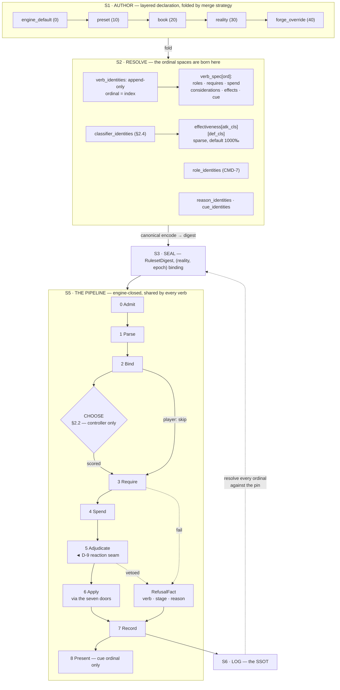

# Command and interaction dataflow — submission to committed fact

**Status:** DESIGN · **Date:** 2026-08-02 · **Base:** `50bff49a4`
**Companion to** [`2026-08-02-command-interaction-structure.md`](2026-08-02-command-interaction-structure.md) (decisions) and [`the RUN-STATE`](../plans/2026-08-02-command-interaction-RUN-STATE.md) (`CMD-1..CMD-8`, PO decisions in §4c).
**Inherits** the actor round's `D-1..D-75` without re-opening them.

**Why this document exists.** The PO declined to seal `CMD-1`..`CMD-6` at the DESIGN checkpoint and
directed a prior-art pass first, naming three things the structure spec has no slot for: **how a
tactical AI weights a decision**, **cost / reward / penalty**, and **rock-paper-scissors**. The
refusal was correct — §2 below shows the three are not one gap but three, with three different
homes, and one of them is structurally homeless in the design as written.

---

## 1. The flow, drawn



**The one structural difference from the actor round's flow:** a **CHOOSE** step that exists only
for a controller-driven submission. A player already chose; a controller must be told how. §2.2 is
what goes in that box, and it did not exist before the PO's question.

## 2. `PO-5` — the decision layer, and it is three gaps, not one

### 2.1 Three things, three homes — and separating them is most of the work

| | what it is | where it belongs | in the spec as written |
|---|---|---|---|
| **①** | **the chooser's weight** — how good is this verb, here, now | **a column on the verb** (`considerations`) | absent; `RequirementRow` is boolean, and boolean has no gradient |
| **②** | **cost / reward / penalty** — an outcome that might not happen | **a column on the effect** (`gate` + a chance spec) | absent; `EffectRow` states what an effect *does*, never that it might not |
| **③** | **the counter relation** — *A beats B* | **a PAIR TABLE**, and this is the only one that is structurally homeless | absent, and there is nowhere to put it |

**Conflating any two of these would be the next defect.** ① is about *choosing*, ② about
*resolving*, ③ about *matching up* — three different questions asked at three different stages.
The temptation is to call all three *"balance"* and give them one table; `D-21` retired the word
*"tier"* for exactly that reason after it named three unrelated ladders.

### 2.2 ① The chooser — and the aggregation must be engine-closed

**Prior art: Dave Mark's Infinite Axis Utility System** (2012, shipped across many titles). An
action carries a list of **considerations**; each is an input run through a **response curve** to a
normalised score; the scores are **multiplied**. And the detail that decides our design:

> multiplying consideration scores drives the total toward 0 as more are added, so a
> **compensation factor** is applied to counteract it.

That is not a footnote. It means **the aggregation arithmetic is non-obvious and depends on how many
considerations there are** — so an author adding a consideration changes the arithmetic of every
other consideration on that verb, invisibly.

> **This is `O-96` exactly, one layer up.** The modifier-layer set was kept engine-closed because
> per-mille factors sum within a layer and do not chain across one, so *"an author inserting a layer
> changes arithmetic they cannot see."* The identical argument applies here, and it produces the
> identical split.

```
ConsiderationRow {
  input:  InputKind          // ENGINE-CLOSED — see below
  subject: RoleOrdinal       // whose value? the agent's, the target's
  ref:    Ordinal            // which declared quantity / threshold / classifier
  curve:  CurveKind          // Linear | Quadratic | Logistic | Step   ENGINE-CLOSED
  params: [i32; 4]           // fixed point 1e-4 (D-52), one scale everywhere
  weight: i32
}
```

`InputKind` is closed for the same reason `RequirementKind` is: every member must be readable from
`ActorQuantities` in phase 0, or the chooser reads across a phase boundary and §4.7.4's violation
reappears at the decision layer.

| engine, closed | author, declared |
|---|---|
| the curve set, the multiply, **the compensation factor**, the argmax | which considerations, on which input, with which curve, at what weight |

**What this buys that a behaviour tree does not:** adding a verb adds its own considerations and
**changes no other verb's score computation**. A tree would need a new branch, placed by hand, at a
priority relative to every existing branch — the `§13.1` god-module collapse in tree form.

### 2.3 ② Risk — and the door already exists, which is why this one is cheap

`EffectRow` as written is certain. The PO's *cost / reward / penalty* needs an outcome that may not
land, and a penalty branch when it does not.

**The door is built.** [`combat/rng.rs`](../../crates/game-rules/src/combat/rng.rs) supplies
`role_rng(session_seed, actor, action_idx, SeedRole)` — a per-roll derived stream, already keyed by
an **action index**, with `SeedRole` discriminants *"pinned rather than derived from declaration
order: reordering the enum must not change any historical roll."* That is ordinal never-reuse
discipline, already applied, to the exact coordinate a declared verb needs.

So risk goes through door 8, and unlike `EdgeMove` and `Oracle` (structure spec §6, `A-1`) it is an
**operation**, not a rule or a classification.

```
EffectRow {
  … as before …
  gate: Always | OnSuccess | OnFailure     // ENGINE-CLOSED, flat
}

verb_spec {
  … as before …
  success: Option<ChanceSpec>   // derived from declared quantities, never a literal
}
```

**`gate` is flat on purpose.** The tempting shape is `on_fail: EffectRowRef` — a pointer to another
row, which is a branch, which nests, which is `D-29`'s scripting language arriving through the door
`D-29` was written to lock. A flat `gate` over **one roll per verb submission** gives
reward-and-penalty with no nesting: rows gated `OnSuccess` are the reward, rows gated `OnFailure`
are the penalty, rows gated `Always` are the cost of trying.

> **What this does NOT cover, said rather than discovered later:** a verb needing **two independent
> rolls** (*hit, then a separate crit*) cannot express the second. Today's engine does exactly that
> — `SeedRole::Hit` and `SeedRole::Crit` are separate streams inside one attack. **One roll per verb
> is a real narrowing of shipped behaviour**, and it is `O-CI-3` in §6, not a decision.

### 2.4 ③ The counter relation — and the matrix is over CLASSIFIERS, never over verbs

This is the gap with no home, and the prior art answers it with unusual unanimity.

| system | the matrix | its size | where it lives |
|---|---|---|---|
| **Pokémon** | attacking type × defending type → `2× · 1× · ½× · 0×` | **18 × 18 = 324 cells**, covering ~1,000 species | data |
| **Warcraft III** | attack type × armour type → a multiplier | ~6 × 7 = **42 cells**, covering every unit in the game | **Gameplay Constants** — editable data, not code |

> **The load-bearing observation: neither game builds an instance × instance matrix.** Pokémon does
> not relate 1,000 species to 1,000 species; it relates **18 classifiers to 18 classifiers** and
> gives every species a classifier. **The N² problem is solved by making N small and putting the
> instances outside it.**

Applied here — and it lands exactly where `D-25` says an edge with *many* on both sides lands, on a
**pair table**:

```
classifiers    [ key ]                                   // an ordinal space, per reality
effectiveness  [ (attack_cls, defend_cls) → multiplier_milli ]   // SPARSE; absent ⇒ 1000‰
```

A verb declares the classifier it attacks as; an actor (or its archetype) declares the classifier it
defends as. The engine's whole job is **look up the pair, multiply, default to 1× when absent**.

| engine, closed | author, declared |
|---|---|
| that a classifier pair yields a multiplier · that absence means neutral · that multipliers **compose multiplicatively** (Pokémon's dual-type 2× × 2× = 4×) · that the lookup happens at stage 6 | which classifiers exist · which cells are not neutral · which classifier each verb and each archetype carries |

**Sparse-with-a-neutral-default is what makes it authorable.** 18×18 is 324 cells but only the
exceptions are written; a reality with 6 classifiers and 4 interesting matchups writes **4 rows**.

**And it is genuinely intransitive by construction** — the property the PO named. *"No single type
combination is super effective against all 18 types"* is not enforced by the engine and must not be:
it is a *balance* property of the authored cells, and an engine that enforced it would be closing on
vocabulary.

### 2.5 The naming defect this research exposed — two costs, one word

**GOAP** (Orkin, F.E.A.R. 2005, from STRIPS 1971) models an action as **preconditions · effects ·
cost**. The structure spec's verb row is that shape already — `requires` · `effects` · `costs` — and
the resemblance is confirming.

**But GOAP's `cost` and our `costs` are different things wearing one name:**

| | what it is | who reads it | when |
|---|---|---|---|
| **spend** | what the verb takes from the actor — 20 qi, a turn slot | the engine | stage 4, committed |
| **weight** | what the verb costs the *planner* — how expensive this option is to prefer | the chooser | stage 2.5, never committed |

A verb can be free to spend and expensive to prefer (*fleeing costs nothing and should rarely be
chosen*), or cheap to prefer and ruinous to spend. **One field cannot carry both.**

> **`CMD-9` (proposed): rename `costs` → `spend`, and keep the chooser's weight in
> `considerations`.** This is `D-21`'s discipline — the word *"tier"* was retired for naming three
> ladders — applied before the collision ships rather than after.

The cost of not splitting them is concrete: GAS commits cost at `CommitAbility()` and that is a
**spend**; IAUS's weight never touches the actor at all. A single `costs` column would have had the
chooser subtracting qi.

## 3. `CMD-7` — author-declared roles, and how the engine still knows who pays

The PO decided `C-5` **against** this document's recommendation: **roles are author-declared.** Per
§2 rule 6 that is not re-litigated. What it is, is a design obligation — the structure spec raised
the objection itself (*"the engine must know which role pays the cost"*), so it owes the answer.

**The answer is that my recommendation conflated two things, and only one of them needed closing.**

| | | |
|---|---|---|
<!-- doc-language-gate: ok -- genre terminology and cited corpus spans. CLAUDE.md allows non-English where the text IS the subject matter: domain terms with no English equivalent (glossed in English on first use) and spans quoted from the corpus. The exposition around them is English. -->
| the role **SET** and its **NAMES** | *which roles exist; `sư phụ` (master), `đạo lữ` (dao-companion), `chứng nhân` (witness)* | **the author's** — this is what the PO opened, and it is vocabulary by every test in `D-2` |
| a role's **ENGINE-VISIBLE SEMANTICS** | *does the engine take the spend from this one; does an effect land on it; must it have been offered* | **the engine's** — a closed flag set, because stage 4 and stage 6 read them |

```
role_declarations [
  key:             MachineKey     // ordinal — the AUTHOR's word
  pays_spend:      bool           // engine reads at stage 4
  receives_effect: bool           // engine reads at stage 6
  must_be_offered: bool           // THR-A4 — generalised off the "strike" arm
  admits:          RefKindMask
]
```

**This is `§27.1`'s three columns and nothing else:** KIND = the flag set (engine) · RECORD = what a
<!-- doc-language-gate: ok -- genre terminology and cited corpus spans. CLAUDE.md allows non-English where the text IS the subject matter: domain terms with no English equivalent (glossed in English on first use) and spans quoted from the corpus. The exposition around them is English. -->
`role_declarations` row contains (feature) · MEMBER = `sư phụ` (author). The PO's choice is
implementable at full openness, and the objection dissolves because it was never an objection to
open **names** — only to open **semantics**, which stay closed.

**Recorded plainly: the recommendation was wrong, and interestingly wrong.** It read *"the engine
depends on role meaning"* and concluded *"therefore the role set is mechanism"* — the same
inference `O-96` makes correctly for modifier layers and that is **invalid here**, because a modifier
layer's arithmetic depends on the layer's *position*, while a role's engine behaviour depends only on
*flags the row carries*. Position is not declarable; a flag is. **`A-4` is resolved by the PO's
decision, not merely overruled by it.**

### 3.1 What this costs, stated rather than hidden

🔴 **CORRECTED — I wrote "a sixth ordinal space" and the honest count is TEN.** Two independent
reviewers reached it separately, and §13's authoring exercise had to maintain all ten by hand:
`quantities` (guarded) · `statuses` · lifecycle `states` · lifecycle `reasons` · `thresholds`
(**four already unguarded — `O-65`, 🔴 open**) · plus this round's `verbs` · `roles` · `classifiers` ·
`refusal_reasons` · `cues`. **I counted my five additions against quantities alone and silently
dropped the four `O-65` names**, which is the same undercount `O-65` exists to flag.
`§27.4` refused a *fifth* space for modifier layers on the grounds that `O-65`/`T0-4` would have to
guard it. **The cost is real, it is larger than I stated, and the PO accepted the understated
version.**

> ⚠️ **CORRECTED after review — the mitigation this section offered was FALSE, and the correction
> cuts both ways.** It read: *"`check_never_reused` is one routine applied to a new SUBJECT, not a
> new MECHANISM."* [`never_reuse.rs:45`](../../crates/ruleset-core/src/never_reuse.rs#L45) is
> `impl QuantityTable` — an inherent method on one concrete type, taking a slice of that same type.
> **A verb table cannot be passed to it.** The PO accepted a cost against a mitigation that did not
> exist, and that is my error.
>
> **But the sizing is smaller than the correction implies**: the extraction is a trait over
> `(len, name_of)` — **~20 lines plus one line per space** at `epoch.rs:175`, which already runs
> validate-before-append with the empty-priors trap documented. `O-CI-5` was right that the
> obligation is real and **wrong that it is heavy**.
>
> **And a shipped precedent argues FOR the spaces, from evidence neither document found**:
> [`resource/mod.rs:21`](../../crates/ruleset-core/src/resource/mod.rs#L21) refuses a second ordinal
> space for resources — *"a resource does not get an ordinal of its own"* — and the reason it records
> is **actor-array width**, not guard cost. Verbs, roles, classifiers, reasons and cues are **not
> per-actor arrays**, so the reason that killed that space does not reach them.

---

## 9. The classification test, rebuilt — because the original could not fail (`F-8`)

> **The single deepest finding of the review round, and it is against the rule that licenses
> everything else in these two documents.**

Structure §2 and `§27.1` state the test as: *"if the author would be choosing **from a set the engine
defines**, it is vocabulary; if they would be defining the set, stop."*

Apply it to the thing this round exists to demolish. An author writing `CommandKind::Sleep` **is
choosing from a set the engine defines.** ⇒ By its own test, `CommandKind` is **vocabulary and needs
no change.** The test passes the defect. It cannot fail in the direction the round requires — `NV-1`,
in a repo whose LOCKED standard exists for exactly this shape.

### 9.1 The replacement — three questions, and a concern is VOCABULARY only if all three hold

The discriminator is not *who picks a member*. It is **who may ADD one, and what adding one costs.**

| # | question | fails ⇒ |
|---|---|---|
| **V1 · Extension** | Can a new member be added by writing a **manifest row**, with no engine edit and no new rung on the digest re-encode ladder? | **mechanism** — or, if the concern *ought* to be open, **a defect** |
| **V2 · Non-interference** | Does adding a member leave the behaviour of **existing** members unchanged? | **mechanism.** An author must never change arithmetic they cannot see |
| **V3 · Identity-blindness** | Is the engine's arithmetic independent of the member's **identity** — reading only its declared parameters? | **mechanism.** If the engine must know *which* member this is, it owns the set |
| **V4 · Operand, not predicate** | Does every authored field enter the engine as an **OPERAND** — a value the engine's own fixed rule then judges — or can a field **BE the judgement**? | **mechanism.** Added by `CMD-10` (§9.4) after `R4-16` showed V1–V3 measure extension *mechanics* only, so a flag set turns any closed set into vocabulary |

> **All four are asked about ADDING A MEMBER to the concern**, never about referencing one.
> `effects[]` naming `EffectPrimitive::Delta` is a reference; minting a new primitive is a member.
> `§27.1`'s three levels are the same distinction: **KIND** (engine) → **RECORD** (feature) →
> **MEMBER** (author).

### 9.2 It fails on real cases, including two of my own — which is the point

| concern | V1 | V2 | V3 | verdict |
|---|:--:|:--:|:--:|---|
| `CommandKind` / `InteractionKind` / `CombatPayload` | ❌ | ✅ | ✅ | **mechanism by the test — and it SHOULD be vocabulary, so the test now NAMES the defect instead of blessing it.** This is what the old test could not do |
| `verb_declarations` rows | ✅ | ✅ | ✅ | **vocabulary.** Correct |
| modifier layers | ✅ | ❌ | ❌ | mechanism — **independently reproducing `O-96`'s answer**, which is the strongest evidence the test is calibrated |
| `EffectPrimitive` | ❌ | ✅ | ❌ | mechanism. Correct |
| 🔴 **`considerations` — the COUNT** | ✅ | ❌ | ✅ | **FAILS V2.** IAUS's compensation factor is `1 − 1/n` over the author-declared row count, so **adding a consideration changes every other score on that verb.** §2.2's whole argument was that engine-closing the aggregation prevents exactly this. **The test catches `R1-8` — my own defect** |
| 🔴 **`effectiveness` cells** | ✅ | ❌ | ✅ | **FAILS V2.** An absent cell means neutral; filling it **rewrites every historical adjudication under that pair**, and no ordinal guard can see it because the hazard is *cell-shaped*. **The test catches `R1-7` — also mine** |

**Two of the six failures are proposals from this round, found by a test written to judge them.** A
classification rule that only ever exonerates its author is not a rule.

### 9.3 The obligation the test carries

Per the repo's non-vacuity standard, a classification is a claim and needs a mechanism:

> **For every concern classified as VOCABULARY: add a member in a fixture, and assert that nothing
> else moved** — no other member's resolved output changes, and the digest moves only by the
> addition. **Break it, watch it go red, put it back, paste the output.** A concern that cannot be
> bite-tested this way has not been classified; it has been asserted.

### 9.4 `CMD-10` — the fourth question, and two boundaries the first three lacked

> **DRAFT, awaiting the PO.** Answers `O-CI-22`. Numbered `CMD-10` because `CMD-1`..`CMD-9` are
> live on this same subject and a colliding id is what the 08-05 round produced.

**The trap to avoid first, because it is the third time.** `R4-16` phrases the gap as *"can a member
the author writes VIOLATE AN ENGINE INVARIANT?"* — and that is **not yet a test**. It is `F-8`'s
shape again. `F-8` failed because *"is the author choosing from a set the engine defines"* had no
operational content; a question naming *"an engine invariant"* without a list of them is answerable
either way by whoever wants the answer. **A fourth question that cannot fail would be the same
defect a third time**, in the section written to fix it the second time. So V4 is phrased
structurally, and needs no enumeration:

> **V4 · Does every authored field enter the engine as an OPERAND — a value the engine's own fixed
> rule then judges — or can a field BE the judgement?**

**This is `D-29` generalised, not an invention.** `D-29` is sealed: *"a condition is a declared
**threshold**, never a **predicate grammar**"* — operand, not predicate, at the condition layer,
and both the item round and the story-seed round already apply it. V4 is that same cut asked of
every authored field instead of one.

| concern | V4 | why |
|---|:--:|---|
| `cue` ordinal | ✅ | there is no invariant-bearing judgement in the path at all; it is consumed past the authority boundary — `CWC-A1`, *the room is a lens* |
| `spend: [{resource, amount}]` | ✅ | the engine owns *you must have it · it is deducted once · it is conserved*. The author supplies the amount and nothing else |
| `submitter_class` + `may_submit_engine_verbs` | ❌ | the author supplies **the verdict of the authorisation rule**. `R4-16`'s construction dies exactly here |
| role `victim` + `pays_spend: true` | ❌ | redirects **whom** conservation applies to. That is the rule, not an operand |
| the ref-kind set | ❌ | the engine dispatches on kind to take a spend, so minting a kind changes what it can dispatch. **This resolves a contradiction `R4` found: rot row `C-6` rules it vocabulary in this same document** |

**And V4 supplies the boundary V3 was missing.** `R4` records that V3 has no stated line between
*reads identity as a lookup key* (`effectiveness` ✅) and *must know which member this is*
(`EffectPrimitive` ❌) — *"structurally the same dispatch"*. It is one line: `effectiveness` looks
identity up **to fetch an operand**; `EffectPrimitive` uses identity **to select which engine
operation runs**. A cut that resolves a contradiction raised against a *different* question was
probably made in the right place.

#### The two boundaries V1 and V2 lacked — and both attacks dissolve

**`R4-4` — V1 must name its artifact.** As applied it asks *"is this already a table?"*, so every
unbuilt concern fails and every proposal passes. **V1 is asked of the DESIGN UNDER JUDGEMENT, never
of the shipped code.** §9.2's `CommandKind` ❌ beside `verb_declarations` ✅ then stops being one
concern scored twice — they are two *proposals*: keep the compiled enum, or declare the table. And
`R4-16`'s counterfactual stops being a paradox: **a `CommandKind` with a flag set and a manifest row
IS `verb_declarations` under another name**, and scoring it ✅ is correct rather than embarrassing.

**`R4-5` — V2 is about SCORE, not RANK.** §2.2 installs an argmax, so adding a verb can make a
former winner lose. Read literally, V2 fails `verb_declarations` — and then **no extensible choice
set can ever be vocabulary**, which is absurd, because a new verb being able to win is what an open
verb set is FOR. The boundary: *does adding a member change an existing member's **score**, or only
its **rank**?*

| | | |
|---|:--:|---|
| `considerations` — the count | ❌ | every other consideration's score moves by `1 − 1/n`. **The catch survives** |
| `effectiveness` cells | ❌ | the value used for a pair changes. **Survives** |
| `verb_declarations` | ✅ | no existing verb's score moves; one may be outranked. **`R4-5` dissolves** |

Both of §9.2's self-caught defects are still caught. That is the test to apply: a repair that also
dissolves the round's own findings would be a repair that stopped measuring.

#### The bite V4 owes, recorded as OWED

Per §9.3's own standard a classification is a claim and needs a mechanism. V4's is: **for a concern
classified vocabulary, author a member that sets an authority-bearing field and assert the build or
the engine REFUSES it.** If no such member can be constructed, V4 was not applied — it was asserted.
`8b` makes this session design-only, so this is **owed to BUILD and recorded as owed**, not done.

#### What `CMD-10` does NOT claim

- It does not repair `R4-6` (§10's out-of-fiction test admits the Forge) or the `origin`/`arity`
  findings. Those are separate rows.
- V4 is structural, so it needs no invariant catalogue — but *reading* a field's path to decide
  operand-or-judgement is a code question, and for the six unbuilt tables there is **no code to
  read**. On a proposal, V4 is answered from the design's own text, and that is weaker evidence
  than the shipped cases (`cue`, ref-kind) where it can be checked.

---

## 10. Is this ONE table? — `M-16` answered, and the answer is TWO, not five

Review found the verb row's **normal state is mostly inert** — `/help` 7/9 · `/undo` 7/9 · `/sleep`
4/9 · `give` 3/9 · `strike` 1/9 — and named five kinds. `O-94`'s diagnostic (*"29 accreted fields are
FOUR kinds"*) is the one to turn on ourselves here.

**But four of the five kinds are not kinds.** Splitting on them would freeze a *missing capability*
into a *schema decision* — which is exactly the error `LifecycleState` made when it put residency
beside existence because that was the shape the code had.

| the proposed kind | verdict |
|---|---|
| **self-directed act** (`/sleep`) vs **opposed act** (`strike`) | **not a split.** They differ by whether `success` and `attack_class` are populated. `Option` being `None` is ordinary optionality |
<!-- doc-language-gate: ok -- genre terminology and cited corpus spans. CLAUDE.md allows non-English where the text IS the subject matter: domain terms with no English equivalent (glossed in English on first use) and spans quoted from the corpus. The exposition around them is English. -->
| **relational act** (`bái_sư`, `bribe`) — 0 % expressible | **not a split — a missing capability.** §11 |
| **parameterized act** (`cast`, `craft`) — 0 % expressible | **not a split — a missing capability.** `F-3` |
| 🔑 **out-of-fiction control** (`/help`, `/undo`, `/leave`) | **A REAL SPLIT, and it leaves the ruleset entirely.** |

### 10.1 The out-of-fiction control is not a verb, and there is a clean test for it

`/help` has no roles, no effects, no spend, no risk, no classifier, and **appends no fiction fact**.
It is a transport and session concern. Giving it a hashed verb ordinal in a never-reuse space, a cue
ordinal and a `submitter_class` is paying the full price of the fiction machinery for something that
never enters the fiction.

> **The test: does it append a fact to the log that a replay must fold?** If no, it is not a verb, it
> does not get an ordinal, it is not in the hashed bytes, and it is not this design's problem.

This removes the worst inert-column offenders — and `/help` and `/leave` are precisely the two
commands `PL_002`'s own amendment history shows being bolted on (rot row `C-4`).

**`/undo` is the interesting boundary and it is decided against undo:** in an event-sourced world the
log *"wins by construction"* (`D-36`), so an undo is a **compensating fact**, not a retraction. If a
reality wants one, it declares a compensating verb — which is an ordinary in-fiction act — and the
out-of-fiction `/undo` does not exist.

⇒ **`verb_declarations` is one table for in-fiction acts.** The 0 %-expressible kinds are the subject
of §11.

---

## 11. 🔑 The synthesis — twelve findings are ONE missing capability

Laying the review round's gaps side by side, from three reviewers and three blind authors who could
not see each other:

| finding | what it asked for |
|---|---|
| `F-4` (FATAL) | `bribe` needs the **target's disposition toward the agent** |
| `AF-3` | an opposed check needs to compare **one role's value against another's** |
| `AF-5` | *"there is no pair table whose codomain is an effect"* |
<!-- doc-language-gate: ok -- genre terminology and cited corpus spans. CLAUDE.md allows non-English where the text IS the subject matter: domain terms with no English equivalent (glossed in English on first use) and spans quoted from the corpus. The exposition around them is English. -->
| `AF-7` / `F-5` | `bái_sư`, `結拜`, `recruit` need to **create** an edge, not re-point one |
| **Arrow B** — political #1, occult #1 | *"who believes what, and who they think did it"* |
| occult `W21` | reading progress per **(reader, tome)** |
| occult `W33` | a cover story = *"which NPCs believe it"* |
| wuxia #43 / occult `W11` | a **favour balance with this contact** |
| wuxia #13 / #52 | a **life-debt** with a creditor and a magnitude |
| political `W17` | a claim's **per-recogniser** recognition |
| political — the AI note | *"two banks differ only by their quantities — **there is no per-actor agenda**"* |

> **Every one of these is a VALUE ON A PAIR.** disposition(A,B) · believes(A,P) · progress(reader,
> tome) · owes(debtor, creditor) · recognises(house, claim) · weight(archetype, verb).
>
> **The design has exactly one pair table — `effectiveness` — and it is RULESET-level with a scalar
> codomain.** There is **no instance-level pair state anywhere**, and that single absence accounts
> for twelve findings and for both 0 %-expressible verb kinds.

### 11.1 The corpus already named the pattern — and then made it structurally unreadable

Actor `§12.4` is explicit: `actor ↔ actor | many ↔ many | **on a pair table**`, and it names
`control_binding` and `actor_actor_opinion` as ~~the shipped examples~~ 🔴 **EXAMPLES — NOT SHIPPED.
`grep` across `crates/`, `services/` and `migrations/` returns ZERO hits for both; they exist only in
`docs/`.** Actor §12.4's column heading is *"example"*, and §12.3 calls the same names *"the
reference model"*, i.e. design documents. **This is `O-CI-9`'s error class — citing a document as
code — committed one section after I convicted myself of it, on the single word carrying the claim
that dissolves twelve findings.** So the *storage* question is
answered.

Then two other rules close it: `§12.3` — *"actor core never reads them"* — and §2.2's
`InputKind` constraint, *"every member must be readable from `ActorQuantities` in phase 0."*

⇒ **The design says where pair state lives and forbids the tick from reading it.** That is the whole
crux, and neither document noticed it because each rule is individually correct.

### 11.2 The resolution — a bind-time projection, and it is not a new mechanism

The obstacle looks like a query problem (*"read the pairs"* implies enumerating rows, which
`§12.5` collapse-3 forbids). **It is not, and the reason is that stage 2 has already done the work.**

After Bind, the roles are bound to **concrete refs**, and `arity` is **declared and bounded**. So the
set of relevant pairs is known, small, and needs no search:

```
STAGE 2   Bind        roles → concrete refs
STAGE 2·5 PROJECT     for each declared pair-quantity ordinal p,
                      for each ordered pair (i,j) of BOUND refs:
                          pair_block[i][j][p] ← <the owning feature's value>
STAGE 3+  Require · Spend · Adjudicate · Apply
                      read pair_block alongside ActorQuantities
```

| what it costs | |
|---|---|
| **size** | `O(arity² × declared pair quantities)` — bounded by declaration, not by world size. For a 2-role verb with 4 pair quantities that is **16 values** |
| **actor core** | **unchanged.** Nothing is added to `ActorQuantities`; `size_of` does not move, so `§12.5`'s anti-accretion gate is untouched |
| **`D-15`** | **unchanged.** The pair table stays its feature's aggregate; only the ID crosses, exactly as `§12.3` requires |
| **new mechanism?** | **none.** This is `D-49`'s phase-0 projection — the shape that already turns `PL_006`'s status records into `status_active: u64` — applied to the pairs a submission has already named |

**And it composes with everything the review asked for**, which is the test that it is the right
primitive rather than a patch:

- `RequirementRow.subject` may name a **pair** ⇒ `AF-3`'s opposed check, `F-4`'s `bribe`
- `ConsiderationRow.input` may read a pair ⇒ per-actor agenda, the political author's bank problem
- `ChanceSpec` may derive from a pair ⇒ *"works only if the denier's credibility exceeds the accuser's"*
<!-- doc-language-gate: ok -- genre terminology and cited corpus spans. CLAUDE.md allows non-English where the text IS the subject matter: domain terms with no English equivalent (glossed in English on first use) and spans quoted from the corpus. The exposition around them is English. -->
- `EffectRow` may **write** a pair ⇒ life-debts, favours, recognition, `bái_sư`'s edge — and a pair
  whose value is *existence* **is** an edge, so `F-5`'s missing `Grant`/`Revoke` becomes a `Delta` on
  a pair quantity rather than a ninth primitive
- **Arrow B** ⇒ `believes(observer, proposition)` is a pair quantity. The occult author reached this
  independently: *"declared statuses already give me boolean propositions for free — I need **one more
  coordinate** on facts I can already write."*

### 11.3 What it does NOT solve, said plainly

| | |
|---|---|
| **`F-3`** — no verb parameter (`cast fireball`) | untouched. A pair is state, not a content argument |
| **`F-6`** — multi-target / area effects | untouched. Bounded arity is exactly what makes §11.2 cheap, and *"everyone in the room"* is unbounded by construction |
| **Arrow A** — a world-owned record with a stored condition | untouched, and see §11.4 |
| **`F-2`/`O-71`** — a derived magnitude | ~~**required by this.** A pair value is useless if `magnitude` cannot read it. §11.2 is *blocked on `O-71`*~~ → 🔵 **MEASURED 2026-08-06 and the "blocked" is WRONG. See §11.6.** The arrow this needs is **shipped**; what is missing is a *different* arrow that this does not need |
| triples | `believes(A, "B did X")` is arity 3. Two-role verbs cover most cases; **the arity of the projection is an open question**, not a solved one |

### 11.6 🔵 `O-71` is TWO arrows, and one of them shipped — measured at HEAD

Three rows in this document say they are *blocked on `O-71`*. The claim was carried from the actor
round's register and never re-measured against code. Measured:

| the arrow | status at HEAD |
|---|---|
| quantity → another quantity's **VALUE**, signed | ✅ **SHIPPED.** `DerivationRow { target: QuantityOrdinal, source_quantity: QuantityOrdinal, op, factor_milli: i32, divisor, bound }` — [rows.rs:121-135](../../crates/actor-hub/src/rows.rs#L121). `factor_milli` is **`i32`**, so the *signed* half of `C-0` is already in the type. Consumed by a real three-pass fold — [fold.rs:62-64](../../crates/actor-hub/src/fold.rs#L62) |
| quantity → another quantity's **CEILING** | ❌ **MISSING.** `CeilingBinding` is exactly two variants, `Slot(StatSlot) \| Fixed(i32)` — [resource/mod.rs:66-81](../../crates/ruleset-core/src/resource/mod.rs#L66). No `Quantity(ord)`. This is the `O-71` that is genuinely unbuilt |

**So the three rows resolve differently from one another, and none is blocked by the missing arrow:**

- **`O-CI-10`** — §11.2 projects pair values into a scratch block, then needs *a magnitude that can
  read a projected value.* That is `DerivationRow`, which exists and is signed. **Not blocked.**
- **`O-CI-12`** — per-archetype weighting *"needs a derived magnitude"*. The derived magnitude
  **exists.**
- **`F-2`/`AF-6`** — *"`EffectRow` is static in EVERY field."* `EffectRow` is **this round's own
  unbuilt table**. Giving it the shape `DerivationRow` already ships is a design choice, not a
  dependency. CLAUDE.md names this exactly: *"missing infrastructure is NOT blocked — it is unbuilt
  work to implement"*, and *"saying 'blocked' when you mean 'I'd have to build it' is the lazy
  tell."*

**Three caveats, because the correction must not overshoot the way the claim it corrects did:**

1. **Nothing in production constructs a `DerivationRow`** — outside tests, the only construction is
   `crates/actor-hub/examples/two_plugins_fold.rs`. Per `D-11` (*zero production realities exist*)
   that is expected, but *"shipped"* here means **the engine can**, not **a reality does**.
2. **Derivations read pass-1 values only** — pass 1 resolves modifier rows, pass 2 turns derivations
   into contributions from *pass-1* values, pass 3 re-resolves and emits. **There is no derivation
   chain.** If §11.2's projected pair value must itself be derived, it cannot then feed another
   derivation. That is a real constraint on where the projection lands — and it is a **different
   question** from `O-71`, which is the point of this section.
3. **Only `factor_milli`'s signedness was measured.** `C-0`'s wider programme — `C-1`, `C-2`, the
   re-key of the slot table to `QuantityOrdinal` — was **not** measured here, and nothing above
   should be read as saying `C-0` is discharged.

### 11.4 Arrow A is smaller than it looked, and may not violate `D-29` at all

The wuxia author asked for a world-owned record carrying a **condition the engine re-checks with
nobody submitting**. That reads like the stored predicate `D-29` forbids — but `D-29`'s own escape
applies: **a condition is a declared THRESHOLD**, and a threshold ordinal stored on a record is flat,
unnested, and already evaluated machinery.

⇒ **Arrow A = `D-9`'s deferred trigger mechanism + a declared record kind + `condition:
ThresholdOrdinal`.** It is not a new refusal to overturn; it is a **deferral whose cost is now
measured** — 14 of one author's 29 ❌. That is the number `D-9` never had when it was taken.

### 11.5 Register

| # | |
|---|---|
| **O-CI-10** | **Instance-level pair state is the round's central absence** (§11). Resolution proposed: a bind-time projection (§11.2). ~~**Blocked on `O-71`**~~ → 🔵 **NOT blocked — measured at HEAD, §11.6.** `DerivationRow` reads another quantity's resolved value with a **signed** `factor_milli`, so the magnitude this row needs exists. **What replaces the blocker is a narrower, real constraint:** derivations read **pass-1** values, and there is no derivation chain — so *where the projection lands in the fold* is the open question, not whether a magnitude can read it |
| **O-CI-11** | **The projection's ARITY is open.** Pairs cover most findings; `believes(A, "B did X")` is a triple. Bounded-arity projection generalises to n-tuples at `O(arity^n)`, which stops being cheap fast |
| **O-CI-12** | 🔺 **RE-HOMED 2026-08-06 by `SCOPE-2`** — the chooser is a FEATURE, not a column, so this is the decision layer's question and not the substrate's. Kept as a pointer rather than deleted, because the question is real. | ~~**`considerations` on the verb means every actor scores every verb identically** — a coward and a hero weigh `flee` the same. ~~Per-archetype weighting needs a derived magnitude (`O-71`)~~ → 🔵 **the derived magnitude EXISTS** (§11.6); the open part is only the per-archetype overlay. Found by the political author, not by any reviewer |
| **O-CI-13** | **Out-of-fiction controls leave the ruleset** (§10.1). Where they go — transport, session, a non-hashed table — is undesigned |

## 4. The verb row, revised

Everything above, folded in. Changes from the structure spec §4 are marked.

```
verb_declarations [
  key:             MachineKey
  roles:           [RoleRef]              ⚠ CHANGED — refs into role_declarations (CMD-7)
  requires:        [RequirementRow]         boolean — legality
  considerations:  [ConsiderationRow]     ✚ NEW    — gradient, for the chooser (§2.2)
  spend:           [EffectRow]            ⚠ RENAMED from `costs` (§2.5, CMD-9)
  success:         Option<ChanceSpec>     ✚ NEW    — §2.3
  effects:         [EffectRow]              each now carries `gate`
  attack_class:    Option<ClassifierOrd>  ✚ NEW    — §2.4
  cue:             CueOrdinal
  submitter_class: Player | Controller | Engine
]
```

**Every added field is a column or a ref, and not one of them is a pointer to another row.** That is
the property that keeps this declarative rather than executable, and it is the line `D-29` draws.

<!-- doc-language-gate: ok -- genre terminology and cited corpus spans. CLAUDE.md allows non-English where the text IS the subject matter: domain terms with no English equivalent (glossed in English on first use) and spans quoted from the corpus. The exposition around them is English. -->
**The acceptance test is unchanged and now covers more:** adding `bái_sư` — with its own roles, its
own scoring, its own risk and its own classifier — is rows in six tables and **zero files** in
command core.

## 5. Adjudicating `A-1`..`A-7` against the drawing

The structure spec's seven self-authored attack surfaces, ruled on now that §2 and §3 exist.

| # | verdict |
|---|---|
| **A-1** | **CONFIRMED and narrowed.** §2.3 removes one of the two exceptions — risk goes through `rng.rs`, a real operation. **`EdgeMove` and `Oracle` remain**, and the closure rule *"a primitive exists iff the substrate built the door"* is still strained by exactly two of eight. Not dissolved. `O-CI-1`. |
| **A-2** | **OPEN, unchanged.** Nothing in this round touched the two-replays question. Carried as `O-CI-2`. |
| **A-3** | **CONFIRMED, and §2.2 makes it worse.** The classifier is outside the digest, and now a *chooser* is too: two submissions with identical inputs can pick different verbs if the scoring model changes. §2.2's considerations are **in** the digest, which helps — but *which* consideration set ran is only pinned if `RulesPin` covers the verb table, and nobody has checked that it does. `O-CI-6`. |
| **A-4** | **RESOLVED by `CMD-7` + §3** — and resolved with an argument, not by fiat. The inference *"engine depends on it ⇒ engine closes it"* is invalid when the dependency is on a **flag the row carries** rather than on the row's **position**. |
| **A-5** | **CONFIRMED and now larger.** §4.2 recommended a fifth ordinal space; this document adds a sixth. `§27.4`'s objection stands and the PO has accepted the cost. `O-CI-5`. |
| **A-6** | **STILL THE SHARPEST, and §2.3 sharpens it further.** Stage 4 spends before stage 5 adjudicates. Now that a verb also has a `success` roll, there are **three** points where a verb can fail after paying: a reaction veto, a failed roll, and a stage-6 refusal. GAS avoids this by refusing at `CanActivateAbility` *before* `CommitAbility`; we have a reaction seam after. Unresolved. `O-CI-4`. |
| **A-7** | **CONFIRMED, and it is the one the PO's question strengthens.** `/sleep` has no `attack_class`, no `success` roll, no considerations worth scoring and no meaningful roles — **four of the six new columns are inert for it.** A row where most columns are inert is the *"29 accreted fields are FOUR kinds"* signal (`O-94`). Out-of-fiction controls and in-fiction acts may be two tables. `O-CI-7`. |

**Two of seven resolved, five confirmed.** A design round that dissolved most of its own attack list
would be the suspicious outcome; this one did not.

## 6. The open register

| # | |
|---|---|
| **O-CI-1** | **The closure rule is strained by 2 of 8 primitives** (`EdgeMove`, `Oracle`). Either build the two doors, or weaken the rule and lose its power to close the set. No test distinguishes *missing door* from *missing primitive*. |
| **O-CI-2** | ✅ **DECIDED 2026-08-02** — [RUN-STATE §9.6](../plans/2026-08-02-command-interaction-RUN-STATE.md#L652). Recording an Oracle result **serves recovery replay and breaks verification replay**: every Oracle effect is a guaranteed false positive forever, and an oracle that always reports drift is one an operator learns to ignore. **`origin` belongs on the Decision (event-side), not on `EffectRow` (ruleset-side)** — structure §6.2 moved it one level down onto an artifact the event vocabulary carries no id for, inverting the property that made `§11.6` correct. **Corollary: there is no input log** (`grep` → empty), so this row could never have been closed by argument in the first place. |
| **O-CI-3** | **One roll per verb is a NARROWING of shipped behaviour.** `attack.rs` uses `SeedRole::Hit` *and* `SeedRole::Crit` inside one attack; §2.3's flat `gate` expresses one. Either the roll is per **effect group** (and a group is a new concept), or the design refuses a shape the engine currently has. |
| **O-CI-4** | ✅ **DECIDED 2026-08-02** — [RUN-STATE §9.6](../plans/2026-08-02-command-interaction-RUN-STATE.md#L632). *"Both readings break something"* was the error: **they are not symmetric.** Rolling the spend back forces the reaction inside `apply`, fusing stages 4/5/6 and breaking **two SEALED inherited decisions** (`D-5`, `D-9`); not rolling it back breaks **one shape proposed this round**. ⇒ **the spend does not roll back**, and `RefusalFact` gains `spend_committed` — otherwise a replay reconstructing pools from refusals over-credits every vetoed verb. **The vocabulary was already present:** §2.3's `gate: Always` *is* the non-refundable spend. **And the ambiguity already ships** — `law.rs` emits an indistinguishable `CombatEvent::Missed` down four control paths, exactly one of which advanced the RNG cursor. |
| **O-CI-5** | **A sixth ordinal space**, against `§27.4`'s stated objection. Accepted by the PO; the guard obligation is real and unassigned. |
| **O-CI-6** | 🔵 **MEASURED 2026-08-06, and the row named a thing that does not exist.** `RulesPin` has **zero occurrences in code** — 68 hits, all in `docs/` (48 of them in the actor dataflow alone). **This is `R4-7`'s error class again**, committed in the register a second time: a design noun cited as if it were shipped machinery. The real machinery is `ruleset_digest` via `impl CanonEncode for Ruleset` at [ruleset.rs:259-279](../../crates/ruleset-core/src/ruleset.rs#L259), which destructures **exhaustively with no `..`** — so a new field of `Ruleset` cannot silently stay out of the digest, and **the source carries the receipt** at [ruleset.rs:265-268](../../crates/ruleset-core/src/ruleset.rs#L265): *"Adding `law_version` broke this line until it was named here, which is the mechanism doing its job."* ⇒ **the question as asked is answered by a compile error (E0027) that has already fired once on a real field.** **What survives, and it is smaller and sharper than the original row:** the mechanism guards a container's *contents*, never the choice of *container*. Nothing forces the verb table to be a field of `Ruleset` rather than to live somewhere unhashed. That residue is `O-CI-6`. |
| **O-CI-7** | **`/sleep` leaves four of six new columns inert.** Out-of-fiction control versus in-fiction act may be two tables, and forcing them into one is `A-7`. |
| **O-CI-8** | **`SeedRole` is a closed enum of combat nouns** — `Damage · Crit · Hit · Position · Loot` ([rng.rs:14](../../crates/game-rules/src/combat/rng.rs#L14)). A declared verb needing a new roll kind has no seed role, and the pinned-discriminant discipline in that file is exactly the ordinal discipline a declared set would need. **The rot is one level below where this round has been looking.** |
| **O-CI-23** | 🔺 **RE-HOMED 2026-08-06 by `SCOPE-3`** — the substrate resolves actions, it does not build rulesets. **Is the merge-strategy set COMPLETE?** `CMD-13` names five members — `identity · merge-by-key · append · append-ordered · exclusive`. That is a **closed engine set**, so it owes the `§27.1` question this round applies to every other closed set, and `CMD-10`'s V1–V4. It has not been asked of this one. Folded in from the 2026-08-05 conflict-resolution proposal, where it was left open on purpose |
| **O-CI-24** | 🔺 **RE-HOMED by `SCOPE-3`.** **WHERE is a `conflict_resolutions` row authored?** A resolution is content, so it lives in a bundle — but *whose*? A third reconciling bundle (Skyrim's compatibility patch, made first-class), or **the reality layer that assembled the conflicting pair**. The second is more likely right, because the reality is what chose to include both — but *"more likely right"* is not a decision, and the wrong answer re-creates the patch economy `CMD-13` §4 exists to avoid |
| **O-CI-25** | 🔺 **RE-HOMED by `SCOPE-3`.** **Does `strict` earn a place in the closed set?** Android's `tools:node="strict"` fails on *any* difference at all, which is a useful thing to be able to demand of a dependency. Unclear whether it earns a member here, and adding it later is cheap while removing it is not — so it is a decision to take deliberately, not by omission |
| ~~**O-CI-9**~~ | 🔴 **WITHDRAWN 2026-08-02 — I cited a STALE DOCSTRING as if it were the code.** The literals `clamp(0.5 + acc − dodge, 0.05, 0.95)` live only at [attack.rs:9-10](../../crates/game-rules/src/combat/attack.rs#L9); the function itself reads `rules.hit_base_pm`, `rules.hit_floor_pm` and `rules.hit_ceiling_pm` — **all ruleset-declared and hashed**. Its own comment states the split this round argues for: *"**That the clamps EXIST is the law; their values are the ruleset's** (IMP-D1)."* **The row was backwards: that function is a positive example, not rot.** Recorded rather than deleted, because citing a comment as a measurement is the exact error class this round exists to name — and I committed it in the register. |

## 7. Rot ledger — additions

| id | site | action |
|---|---|---|
| C-13 | [`rng.rs:14`](../../crates/game-rules/src/combat/rng.rs#L14) — `SeedRole` closed enum of combat nouns | **U** — a declared roll-kind ordinal. **Keep the pinned-discriminant comment verbatim**; it states the never-reuse rule better than most of this corpus does |
| C-14 | [`attack.rs:16`](../../crates/game-rules/src/combat/attack.rs#L16) — `hit_chance_pm` over `accuracy_pm` / `dodge_pm` | **defer to `D-14`** (combat redesign) — recorded so the sweep is complete, not to be fixed here |

## 8. What this round still owes

> ⚠️ **STALE HEADER, corrected 2026-08-06.** This section read *"the red-team rounds and the
> author-agent rounds have **not** run"* for four days **after both had run** — four red teams
> (`R1`/`R2`/`R3`/`R4`, 17 FATAL) and four blind authors, all reported in
> [RUN-STATE §9.4–§9.8](../plans/2026-08-02-command-interaction-RUN-STATE.md#L424). A checklist that
> describes the round as earlier than it is understates the open count of everything downstream of
> it, which is the cheapest possible way to look finished.

Per the PO's *"full companion"*: both rounds **have** run. This document is the drawing plus the
decision layer the PO's question exposed; the review results live in the RUN-STATE.

| | |
|---|---|
| ~~**next**~~ | ✅ **DONE.** Red team ran four times, and `O-CI-4` — nominated here as *"the finding most likely to be fatal"* — **was in fact the one that got decided** (`R1`, §9.6). The nomination was right |
| ~~**then**~~ | ✅ **DONE, blind as demanded** — and the blindness paid: the home genre scored **worst** of four, falsifying this document's own prediction (see the struck `note` row below) |
| **now** | `O-CI-22` — the classification test's fourth question. **Nothing in this round can be sealed above it:** `F-8` said the original test *could not fail*; `R4-4`/`O-CI-22` say the replacement **passes anything given a flag set**. Opposite signs, one defect — a test that does not discriminate |
| ~~**note**~~ | 🔴 **FALSIFIED 2026-08-02.** This row read: *"the cultivation genre is the wrong one to start with — it is the home genre and **will fit by construction**."* It was run last, blind and unprimed, and scored **`3 ✅ · 27 ⚠ · 22 ❌`** — **the lowest ✅ rate of all four genres** (5.8 %, against wuxia's 19 % and the chronicle's 15 %). It hit the same four walls. The prediction is deleted rather than annotated, per the round's own rot rule — and the author's closing line is the one worth keeping: *"a design that hands an author the language to falsify its own optimism is a design I want to build on."* |

---

## 12. Four genres, run blind — the measurement, and it RE-RANKS the openings

`10 ✅ · 32 ⚠ · 8 ❌` for modern occult is **excluded from comparison** — its re-run was primed by my
own correction message (`DR-4`).

| genre | ✅ | ⚠ | ❌ | ✅ rate | its **ONE thing** |
|---|--:|--:|--:|--:|---|
| 武俠 wuxia | 12 | 21 | 29 | 19 % | **Arrow A** — *"14 of my 29 ❌ are one capability wearing fourteen costumes"* |
| political chronicle | 8 | 27 | 20 | 15 % | **Arrow B / pair state** — 12 dead, 4 crippled |
| 修真 **cultivation — the HOME genre** | **3** | 27 | 22 | **5.8 %** | **Arrow A** — *"13 of my 22 ❌"* |
| *modern occult (primed — excluded)* | *10* | *32* | *8* | — | *Arrow B* |

### 12.1 The re-ranking, and it is by measurement rather than by argument

§11 concluded that instance-level pair state (`O-CI-10`) was the round's central absence, on a count
of twelve findings. **Two blind authors have since put a number on Arrow A instead, and the numbers
agree with each other:**

> wuxia: **14 / 29 ❌** · cultivation: **13 / 22 ❌** — *"two blind authors, two genres, the same
> fraction. That is not a wish-list item any more; it is a measurement with two independent
> readings."*

⇒ **Arrow A is #1 and `O-CI-10` is #2.** Both remain real; the order changes what to build first.

### 12.2 The four walls, with each genre's attribution

| wall | what it is | who hit it |
|---|---|---|
| **① Arrow A** | a world-owned record carrying a **stored condition** that fires with **nobody submitting** — `D-9`'s deferred trigger + a declared record kind + `condition: ThresholdOrdinal` (§11.4) | **wuxia #1 · cultivation #1** · political runner-up · occult `W13` |
| **② `O-CI-10`** | instance-level **pair state** — §11.2's bind-time projection, **blocked on `O-71`** | **political #1 · occult #1** · cultivation 18 ⚠ + 4 ❌ |
| **③ `O-71`/`F-2` + `O-CI-3`** | a magnitude that is a **constant an author guessed**, and **one roll per verb** | **all four** |
| **④ `F-6`** | **unbounded target sets** — witnesses, auras, audiences | cultivation **7 ❌** · wuxia's `當眾打臉` · political's *"every other agent watching"* |

**Wall ④ is the one §11.3 explicitly says the pair projection does NOT reach**, because bounded arity
is precisely what makes that projection cheap. And *being seen* is load-bearing in two of the four
genres: `當眾打臉` public face-striking, `殺人滅口` killing the witnesses, `揚名` making a name, an
insult before witnesses. **A verb whose entire payload is who observed it has no expression, and no
proposal on the table reaches it.**

### 12.3 What the home genre proves that the others could not

The three ✅ are `打坐` meditation, `淬體` body-tempering, `服丹` taking a pill — *"one actor, one
arithmetic quantity, one submission, no witnesses, no future."*

> **The author's verdict, which is the sharpest sentence produced in either review round:**
> *"That is not a xianxia engine with gaps. That is a combat engine with 打坐 in it."*

And the diagnosis is precise about **what did NOT go wrong**: *"I did not have to fight the engine
once about a **name**."* `CMD-7`'s author-declared roles delivered exactly what they promised —
師父, 徒兒, 道侶, 證人 are rows. **The openness this round built is real; what is missing is not
vocabulary at all.** Every wall above is a *mechanism* the engine does not have, which is `D-2`'s
line landing on the other side from where this round spent its effort.

### 12.4 One concrete escalation of `O-CI-4` from the author side

> `突破` (breakthrough) **spends everything accumulated**. If a reaction can veto it at stage 5 after
> the qi is already gone, and `D-50`'s one-transaction shape cannot roll it back, then **the genre's
> single most important verb is the one that exposes the bug.**

`O-CI-4` was an engineering worry. It is now a content one, in the home genre, on its keystone verb.

---

## 13. Can an LLM actually AUTHOR this? — the uncovered modality, and it produced the round's only hard numbers

> **Why this had to be run.** The sibling round's `PO-1` chose its three-table layout **specifically
> because "the manifest is generated by an LLM"** and because a generated row that is *plausible and
> wrong* is the worst failure mode. **The command layer inherited that constraint and never tested
> against it.** All four author agents measured *expressiveness*; none measured **generability**.
>
> Method: write a real reality — one wuxia roadhouse, six actors, **eight verbs** — as actual rows,
> not as a description. What follows are the numbers, which nobody had.

### 13.1 The cost of eight verbs

| | |
|---|---|
| **295 rows** | 104 top-level + 191 sub-rows. **148 command-layer, 147 actor-substrate prerequisite** — the substrate you must finish before the *first verb resolves* is the same size again as all eight verbs |
| **~18.5 command-layer rows per verb** | |
| **90 ordinals across TEN spaces** | and §3.1 priced **six** |
| **15 of the 32 quantity budget — for ONE INN** | and 3 of those 15 are pair quantities that cannot live in `values: [i32; 32]` at all. *"A reality with a crafting system, an economy and a reputation web is over 32 before it has a second building"* |
| **50 of 295 rows (17 %) are archetype GRANT rows** | pure *"which of the 15 quantities does an innkeeper have"* bookkeeping — `O(archetypes × quantities)`, **growing quadratically with the reality while the verbs do not** |
| **10 tables must be complete before the first verb row can be written** | and both command documents present the verb table **first** |

### 13.2 🔴 The proof — `PO-1`'s failure mode arrived anyway, through a door three tables do not cover

> **This manifest satisfies every well-formedness rule the design states, and `strike` cannot kill
> anyone.**

The `mortal` machine's only route to `dead` is `OnStatus(slain)`. **No verb, no threshold, no status
effect in the manifest produces `slain`.** An actor reduced to zero blood parks in `felled` forever.
Initial state exists · the graph is acyclic · no cascade cycle — every stated check passes.

**There is no reachability check.** *"Every `OnStatus(s)` trigger in a lifecycle machine must have at
least one producer"* is the validator that would have caught the one authored defect in this manifest
that actually breaks the game, and it does not exist. This is exactly *plausible and wrong*, which is
the thing `PO-1` picked its table layout to prevent.

### 13.3 The 28 guesses — and six are TYPES that do not exist in either document

A guess is a place where **a second generator reading the same two documents emits a different and
equally plausible manifest.**

| the six missing types | what rests on it |
|---|---|
| **`ChanceSpec` is named and never defined** | **all 5 `success` rows.** `AF-3` records it *"has no contested form"* — so the contested form the author invented may be the shape the design refuses |
| **`InputKind` members are never enumerated** | **all 17 consideration rows** — and the invented `PairQuantity` directly violates §2.2's own stated constraint |
| **arity has no home** | structure §4.1 put it on `RoleSpec`; `CMD-7` moved roles to `role_declarations` and **arity did not survive the move** — and it cannot live on the role (`opponent` is `Exactly(1)` for `strike`, `AtLeast(1)` for `flee`) |
| **a pair `subject` / a two-role `EffectRow`** | §11.2 requires both and neither is a column. **And the DIRECTION is unstated** — does `owes_favour(0→3)` mean 0 owes 3, or 3 owes 0? *"A coin flip that inverts the fiction"* |
| **pair quantities have no declaration table** | not `Pool`, not `Accumulated`, not `Derived`; `granted: u32` cannot mark them; `values: [i32;32]` cannot hold them |
| **`RefKindMask` bits are never enumerated** | `AF-8`, confirmed from the authoring side |

**Four things could not be written at all** — `QuantityAtLeast` (the column has one `ref` and no
magnitude, so *"at least 8 vigor"* is unwritable and every quantity gate had to be routed through a
declared threshold, **costing a threshold ordinal and a manufactured status per gate**) ·
`StatusClear` (no primitive rescinds; a negative-magnitude `StatusPropose` was invented) · a spatial
move (**`flee` does not flee** — rewritten three times, ending as a status that means nothing to any
other row) · `Oracle` prose.

> **Each of these a generator will ROUTE AROUND rather than fail on — producing a manifest that
> loads and does not work.**

**And the role space varies 3× between two correct readings**: `master`/`guest`/`patient`/`wounded`
have **byte-identical flag rows**, so one generator collapses them to 6 roles and another declares one
role per (verb, position) and emits **19**. Same semantics, 3× the ordinal space in an append-only
never-reused table, **and the engine cannot tell which was intended.**

### 13.4 What the inert-column count actually shows

`verb_declarations` is **only 12.5 % empty** (10 of 80 cells) — *"better than the review's
measurement, **because §10.1 already removed the out-of-fiction controls**. That decision is doing
real work, and the number proves it."*

**The inert columns are on `EffectRow` instead:**

| column | inert |
|---|---|
| `condition: Option<ThresholdOrd>` | **34 of 35** (97 %) |
| 🔴 `origin: Recomputable \| Oracle` | **35 of 35 — the column never varies** |
| `params: [i32;4]` | **34 of 68 slots zero**, and zero-because-unused is byte-identical to zero-because-intended |

> **`origin` is the sharpest of these.** §6.2 argued for putting it on the row rather than the verb
> **because `speak` emits an Oracle narration alongside a deterministic delta** — and `speak` **cannot
> be authored at all** (`Oracle` has no door; §6.3 forbids a verb emitting prose). **The column that
> justified its own placement has zero varying values in a manifest for a tavern**, where *"the
> innkeeper says something"* is the most ordinary act in the reality.

Four of eight primitives went unused — and `EdgeMove` is the confirming one: **§11.2 replaced it with
a `Delta` on a pair quantity, and all four relational writes took that path.** The primitive `A-1`
strained hardest to justify is now dead in practice.

### 13.5 🔑 The single change, and it is a generalisation of shipped design

> **Every cross-table reference is authored as a `MachineKey` and resolved to an ordinal by the
> loader. Ordinals appear only in the resolved `Ruleset`, never in the manifest.**

**Nine reference fields are ordinal-typed** (`QuantityOrdinal`, `StatusOrdinal`, `RoleOrdinal`,
`ClassifierOrd`, `ThresholdOrd`, `ReasonOrdinal`, `CueOrdinal`, `StateOrdinal`, `RoleRef`) — so **the
author is writing the loader's output into the loader's input.** Exactly two references already work
the right way, and they are shipped design: `ArchetypeDecl.lifecycle: LifecycleMachineKey` and
`threshold_set: ThresholdSetKey` ([actor-dataflow §2.6.1](2026-08-02-actor-hub/analysis/2026-08-02-actor-dataflow.md#L212)).
**Nothing says why those two and not the other nine.**

| what the rule buys | |
|---|---|
| **forward references disappear** | the rigid ten-table authoring order stops being a *correctness* requirement |
| **a mid-draft renumber becomes free** | the exercise had to renumber the role space mid-draft; in an append-only never-reused space that is **a corruption, not an edit** |
| 🔑 **90 plausible-and-wrong numbers become 90 names a validator can fail on** | `target: 7` cannot be checked against anything. `target: bleeding` **either resolves or reds** — the same *fail loudly, not plausibly* property `PO-1` bought at the table level, applied to the references |
| **costs nothing at S2** | the resolver already builds `identities` and already assigns ordinals. This moves **where the number is written**, not who assigns it — never-reuse, the digest and the hashed bytes are untouched |

**Second, if there is room for two:** make `ThresholdDecl.proposes` an `Option` (four thresholds were
wanted as pure gates and all had to name a status, so **one status in the manifest exists for no
fictional reason**), and add §13.2's reachability check.

### 13.6 Register

| # | |
|---|---|
| **O-CI-14** | 🔴 **No reachability validator.** A manifest can satisfy every stated well-formedness rule and be unplayable (§13.2). `V1` needs: every `OnStatus(s)` trigger has a producer; every declared status is proposable by something; every verb is reachable by some submitter class |
| **O-CI-15** | 🔑 **Ordinals in the manifest.** Nine reference fields are ordinal-typed against two that are key-typed. §13.5 |
| **O-CI-16** | ⚠ **SHRUNK to FIVE 2026-08-06**: `InputKind` leaves with the chooser (`SCOPE-2`) — it is `ConsiderationRow`'s input field. `ChanceSpec`, arity's home, a pair's `subject`, the two-role `EffectRow` and `RefKindMask` all remain undefined. | ~~**Six types are named and never defined** — `ChanceSpec`, `InputKind`, arity's home, pair `subject`, two-role `EffectRow`, `RefKindMask`. Every consideration and every `success` row in a real manifest rests on an invented shape |
| **O-CI-17** | **The role space varies 3× between two correct readings** (6 vs 19), in an append-only never-reused space, undetectably |
| **O-CI-18** | **`origin` never varies** (35/35), and the verb that justified its placement cannot be authored |
| **O-CI-19** | **Archetype grants are `O(archetypes × quantities)`** — 17 % of all rows, growing quadratically while verbs do not |
| **O-CI-20** | **One inn spends 15 of 32 quantity ordinals**, 3 of which are pair quantities with no home in `values: [i32;32]` |
| **O-CI-21** | **The dependency graph is acyclic BY ACCIDENT.** `StatusEffect` names quantities and engine tags only; the moment an author wants *"while `blood_low` is active, lose 3 blood per tick"*, `statuses ⟷ thresholds` **is a real, unbreakable cycle.** It is acyclic because a capability is missing, not because it was designed to be |

---

## 14. Adjudicating round 2's red team — §9, §10 and §11 were written today and did not survive

> **Six FATALs, every one against material written after the first review round.** Where I accept, I
> say so plainly. **§11.2 does not survive as an ARGUMENT — though its diagnosis does.**

### 14.1 🔴 §11.2's argument is broken three independent ways

**`R4-1` · It solves the wrong obstacle.** §11.2 says the difficulty *"looks like a query problem …
**it is not**"* and then makes the read cheap. But actor `§12.5` collapse-3 is **not a cost rule** —
*"only the `id` crosses a boundary (`D-15`); cross-feature effects go through **channel A** — a
projection — **not through a join**."* **The prohibition is on the DIRECTION of the read, not its
cardinality.** Shrinking a scan to sixteen point-lookups changes nothing about which boundary is
crossed. And both compliant paths are shut:

| path | why it is closed |
|---|---|
| **channel A** | `ModifierRow` is keyed by **one actor and one quantity ordinal**. There is **no pair-keyed row shape**, so channel A structurally cannot carry `disposition(A,B)` |
| **the feature computes it at bind time** | requires feature code to run during the tick — actor §12.3's own ⚠ box forbids it in bold: *"it makes the engine enumerate features, which is `D-2` violated at the worst layer"* |

> ⇒ **§11.2 takes a third path — the engine reading a feature's aggregate — without naming it as a
> third path.** Accepted in full. **Re-design, not re-cost.**

**`R4-2` · The bound rests on a column `CMD-7` deleted — and THIS DOCUMENT SAYS SO THREE SECTIONS
LATER.** §11.2's cost argument is *"`arity` is declared and bounded"*. But §3's `role_declarations`
has **no `arity`**, structure §4.1's `RoleSpec` is withdrawn **by this document's own header**, and
`RoleRef` is undefined. **§13.3 already records it** — *"arity has no home … arity did not survive
the move"* — found independently by the manifest exercise. **I wrote the claim and its refutation
into one document on one day and did not connect them.** And even the withdrawn `RoleSpec` gave no
bound: **`AtLeast(n)` is explicitly unbounded**, so §11.2 and §11.3 disagree about whether the
bounding field can be unbounded.

**`R4-3` · A pair write violates `D-37`, and `D-50` has no signature for it.** *"The pair table stays
its feature's aggregate"* and, four lines later, *"`EffectRow` may **write** a pair."* Same table ⇒
the pipeline is a **second writer**, which is `D-37`'s stated failure. The escape would be `D-50`,
but `commit_with_modifiers(feature_row, modifiers)` takes **one singular** `feature_row`, and a
<!-- doc-language-gate: ok -- genre terminology and cited corpus spans. CLAUDE.md allows non-English where the text IS the subject matter: domain terms with no English equivalent (glossed in English on first use) and spans quoted from the corpus. The exposition around them is English. -->
`bái_sư` submission spans ≥2 feature aggregates. **There is no compliant write path today.**

### 14.2 🔴 §9's test is still broken — and one way is `NV-1` again

**`R4-4` · V1 returns opposite verdicts for one concern.** §9.2 scores `CommandKind` ❌ and
`verb_declarations` ✅ — **one concern, verb identity, scored twice.** Factually, `verb_declarations`
is also ❌ (structure §1 measures *zero hits*). Counterfactually, `CommandKind` is ✅✅✅ = vocabulary,
which is the round's whole thesis. ⇒ **V1 as applied asks "is this already a table?"**, so every
unbuilt concern fails and every proposal here passes. **`NV-1`, in the section written to fix
`NV-1`.** Accepted.

**`R4-5` · `verb_declarations` fails V2.** §2.2 installs an **argmax**; adding a verb adds a
competitor, so **a verb that used to win now loses** — existing members' *behaviour* changes. §2.2's
defence is about **computation**; V2 is written about **behaviour** — the exact distinction used to
score `effectiveness` ❌. Applied consistently, **`CMD-1` is mechanism by my own test.**

**`R4-16` · 🔑 The deepest finding: `A-4`'s resolution proves too much.** §3 resolved `A-4` by arguing
*"a role's engine behaviour depends only on **flags the row carries**"* — **which is V3.** Apply it to
`submitter_class`: a declarations table with `may_submit_engine_verbs: bool` scores **V1 ✅ V2 ✅ V3 ✅
⇒ vocabulary**, and an author has minted a class that submits `EndTurn` — the one thing the shipped
comment protects (*"no driver can mint itself another action by asking for one"*). Same construction
gives role `victim` with `pays_spend: true` ⇒ **the target pays for the agent's action.**

> **Give `CommandKind` a flag set and V1-V3 make it vocabulary too.** The three questions measure
> extension *mechanics* — uniformity, non-interference, parametricity. **None asks: can a member the
> author writes VIOLATE AN ENGINE INVARIANT?** That is what separates `cue` (safe to open) from
> `submitter_class` (not). **A fourth question is required** — `O-CI-22`.

**Also accepted as MAJOR:** V3 has no stated boundary between *reads identity as a lookup key*
(`effectiveness` ✅) and *must know which member this is* (`EffectPrimitive` ❌) — structurally the
same dispatch · **the ref-kind set fails V3** (the engine must know a ref is an Actor to take a
spend) while rot row `C-6` rules it vocabulary, **in the same document** · §9.3's bite obligation
restates **V2 only** · and §9.2 row 3's *"independent reproduction of `O-96`"* is **circular** — V2 is
`O-96`'s conclusion promoted to a criterion, then used to re-derive `O-96`.

### 14.3 🔴 §10's test admits the Forge and evicts `examine`

**`R4-6`** · `ruleset.epoch_activated` is out-of-fiction by any reading, and **`foldEvent` folds it**
⇒ the test answers *yes* ⇒ **the mechanism that WRITES rulesets is inside the ruleset.** Reductio —
and it is the same event whose mishandling *"killed the channel's whole projection, for every client,
permanently"*, the incident structure §1.2 cites. **The test would have blessed the routing that
caused it.**

**Also accepted:** §10.1 changes predicate mid-paragraph (*"no **fiction** fact"* → *"**a fact** a
replay must fold"*), and a malformed `/help` **does** append a folded `proposal.rejected` · the
`/undo` ruling **ignores a shipped third category** — `wire.rs` has `Resolved | Discarded | Rejected`
and `DiscardReason::Superseded`, so **the kernel already annuls an admitted-but-unstepped intent with
no compensating fact** · and **`examine` is genuinely in-fiction and appends nothing**, so the test
evicts the verb §4.1's central argument is built on.

### 14.4 Corrections to my own claims

| | |
|---|---|
| **`R4-7`** | 🔴 I wrote *"the **shipped** examples"* for `control_binding` / `actor_actor_opinion`. **Zero hits in code.** Verified, corrected in §11.1. `O-CI-9`'s error class **one section after I convicted myself of it**, on the word carrying the claim that dissolves twelve findings |
| **`R4-12`** | **The count is NINE, not twelve** — Arrow B's own wish is arity **3** (*"and who they think did it"*), `W17`/`W33` quantify over **unbound** refs, `weight(archetype, verb)` is **ruleset-level** (already expressible), `progress(reader, tome)` is actor↔**item** which §12.4 routes onto the item. **And the count is the argument** |
<!-- doc-language-gate: ok -- genre terminology and cited corpus spans. CLAUDE.md allows non-English where the text IS the subject matter: domain terms with no English equivalent (glossed in English on first use) and spans quoted from the corpus. The exposition around them is English. -->
| **`R4-14`** | *"A pair whose value is existence is an edge"* **loses three things** — **cardinality** (`EdgeMove` re-points, preserving exactly one; a pair `Delta` cannot say *"at most one master"*, and `bái_sư` is my own example) · **cascade on delete** (`owes(dead_debtor, creditor)` never clears) · **ordering**: §4.8.2's own survey found CK3 stores opinion as *"a **list of timed modifiers** folded on read"* with *causes → level is a function, level → causes is not… a **now-or-never** property.* **I chose the lossy direction silently**, and it breaks the cost model: `arity² × p × modifiers-per-pair` **plus fiction-time expiry at bind time**, against an unspecified clock |
| **`R4-8`** | **Pair quantities are another ordinal space** with **no cap analogous to `MAX_DECLARED_QUANTITIES`**, and cost `arity² × p` ⇒ **the more openly a reality authors, the more expensive every submission becomes** — the inverse of §2.4's authorability argument |
<!-- doc-language-gate: ok -- genre terminology and cited corpus spans. CLAUDE.md allows non-English where the text IS the subject matter: domain terms with no English equivalent (glossed in English on first use) and spans quoted from the corpus. The exposition around them is English. -->
| **`R4-13`** | 🔴 **§11.2 spends the relational hand-off's ONLY stated constraint.** Actor §4.8.3's third discharged obligation is *"**nothing in the tick may require an opinion to be present**."* A stage-3 requirement naming `disposition(target, agent)` is exactly that. **If pair state is load-bearing for `bribe`/`bái_sư`/`結拜`/`recruit`, `D-24`'s test (*"the game is playable without this feature"*) now returns the opposite answer and the deferral needs re-opening — a PO question** |
| **`R4-10`** | **No `seq` envelope on the projection.** `§4.7.2` freezes the *ruleset*, not other aggregates — so the value read depends on **inter-aggregate commit interleaving** no rule constrains, and `bribe` succeeds on one replay and refuses on another. `D-39`/`D-53` already state the fix. **Intra-tick it is worse**: §4.7.1 supplies a command buffer for deltas; §11.2 states no equivalent |
| **`R4-11`** | **An unbound-side pair under-reads SILENTLY**, and §11.2 **never defines absence for a pair quantity** (§2.4 defined it for `effectiveness`). The `RefusalFact` is recorded as gameplay and is **byte-identical to a genuine zero** |
| **`R4-18`** | The scratch block **dodges** the anti-accretion gate — and per `ST-4` the gate has no subject anyway. *"`size_of` is untouched"* is true and **vacuous**: it cannot vary with `arity² × p`. And §3.1's own precedent cuts the other way — `resource/mod.rs` refused a space for **actor-array width**, and `pair_block` **is** an array |
| **`R4-15`** | **`CMD-7` un-did §4.1's `ExamineTarget` dissolution** — `admits`/`must_be_offered` moved per-verb → per-role-global, so *"wider for this verb only"* is inexpressible. **Third independent find** |
| **`R4-21`** | §10 claims it removes the inert-column problem while `O-CI-7` stands: **`/sleep` is in-fiction and keeps four of six inert.** The header *"TWO, not five"* counts a table §10 calls *"not this design's problem"* — the answer defended is **one table plus a hand-off** |

### 14.5 What survived — an absent finding is evidence

**§11's diagnosis holds**: *"I tried to find one of the findings that is not a value on a pair and
could only find over-counting, never a miscategorisation of the core nine."* · **"Bind has already
done the work" is a genuine insight** independent of the bound — *"whatever the pair mechanism turns
out to be, computing it against refs the submission NAMED rather than by search is correct"* ·
naming `O-71` as its own blocker verified · `ConsiderationRow` reading a pair genuinely solves
`O-CI-12` for the bounded case · **§9's demolition of the old test** — *"finding that against the rule
licensing your own document is the review round's single best result"* · **V2 is a real
discriminator** and `R4-5` **extends** it rather than refuting it, and *"§9.2's willingness to score
its own proposals ❌ is genuine, not performative"* · **§10's split verified in code** —
`ChannelRoom.onLeave` appends nothing · and **refusing to split on self-directed vs opposed** is
right.

### 14.6 Register

| # | |
|---|---|
| **O-CI-22** | 🔑 **The test needs a FOURTH question: *can a member the author writes violate an engine invariant?*** V1-V3 measure extension mechanics only, and `A-4`'s flag-set argument — the same as V3 — **dissolves every closed set including `CommandKind`**. → **PROPOSAL `CMD-10` in §9.4, awaiting the PO.** V4 is *operand, not predicate* — `D-29` generalised from the condition layer to every authored field — phrased structurally on purpose, because `R4-16`'s own wording (*"violate an engine invariant"*) needs a list of invariants to be answerable and would have been `F-8` a third time. It also supplies V3's missing boundary and dissolves `R4-4` and `R4-5` without dissolving the two defects §9.2 caught in itself. **The bite it owes is recorded as OWED, not done** (`8b`: design-only) |
| **O-CI-23** | 🔴 **§11.2 must be RE-DESIGNED, not re-costed** — it reads a feature aggregate from the engine, a path neither channel permits, and its bound rests on a deleted column. **The diagnosis survives; the mechanism does not** |
| **O-CI-24** | **`arity` has no home**, found twice independently (`R4-2`, `G1`) |
| **O-CI-25** | **A pair value is a FOLD over timed modifiers, not a scalar** — §4.8.2's own CK3 finding, *now-or-never* |
| **O-CI-26** | **`D-24`'s scoping test may now return the opposite answer.** If pair state is load-bearing for the relational verbs, the hand-off needs re-opening. **PO question** |
| **O-CI-27** | **§10's test admits the Forge and evicts `examine`** — it must be about a fact's **kind**, not its existence |
| **O-CI-28** | **The kernel already has an annul path** (`DiscardReason::Superseded`) that §10.1's `/undo` ruling did not know about |
