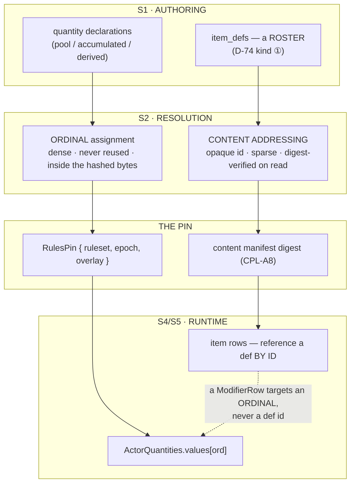
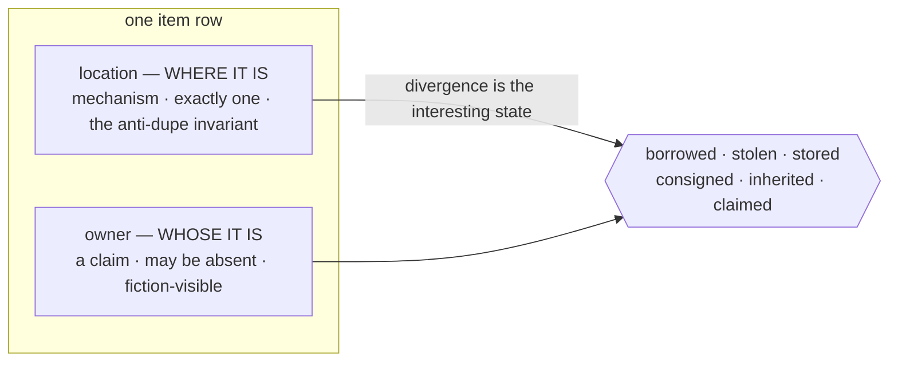
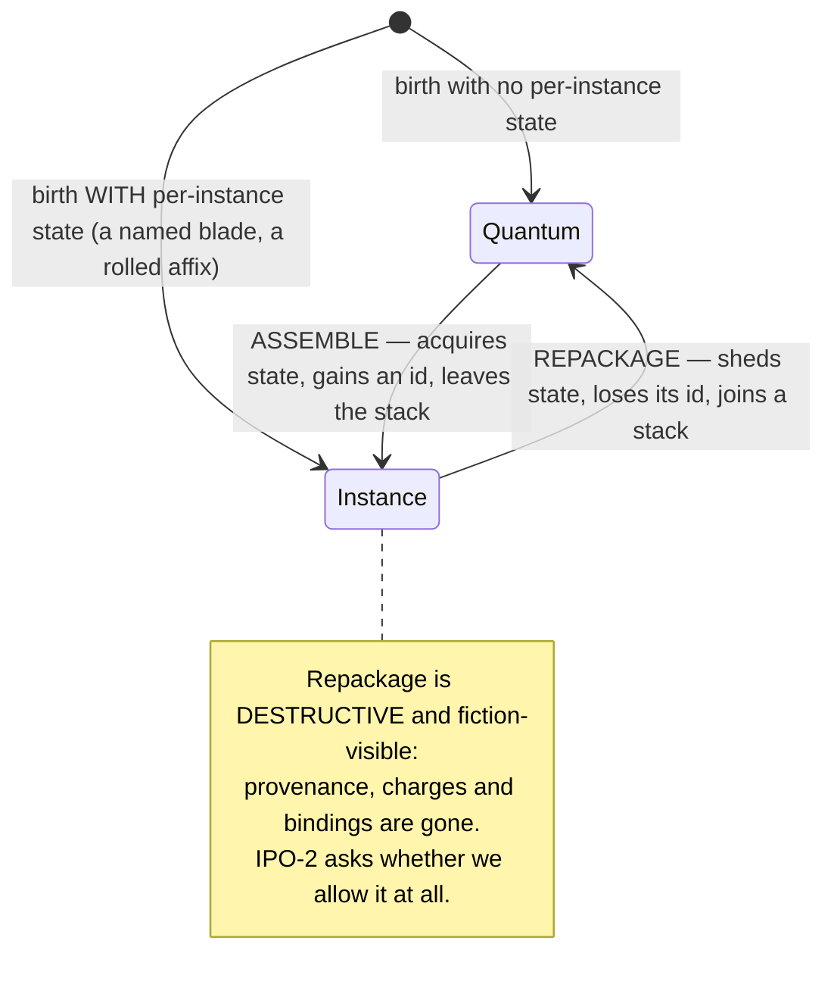
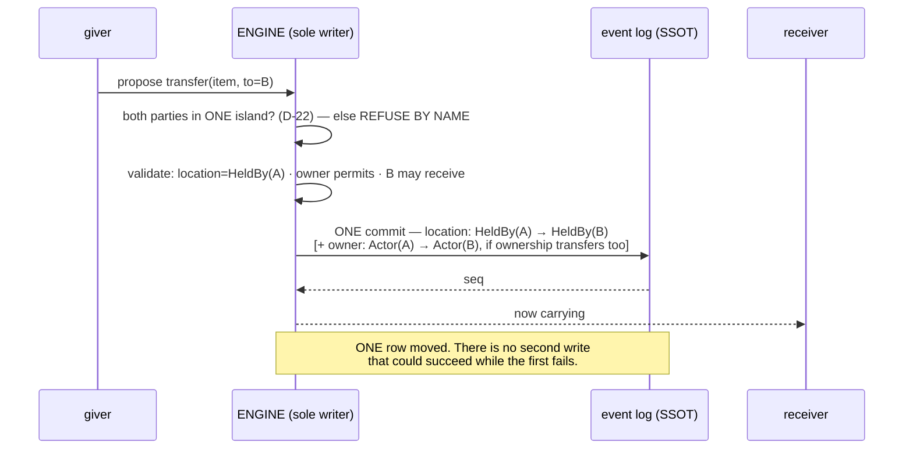

# Item data structure and dataflow — manifest to runtime

**Status:** DESIGN · **Date:** 2026-08-02 · **Base:** `50bff49a4`
**Decision record:** [`2026-08-02-item-data-structure.md`](2026-08-02-item-data-structure.md) — `ITD-1`..`ITD-9`.
**Run state:** [`../plans/2026-08-02-item-substrate-RUN-STATE.md`](../plans/2026-08-02-item-substrate-RUN-STATE.md)
**Inherits:** the actor round — [decisions](2026-08-02-actor-hub/analysis/2026-08-02-actor-data-structure.md) ·
[dataflow](2026-08-02-actor-hub/analysis/2026-08-02-actor-dataflow.md) · `D-1`..`D-109`.

> **Two parts.** **PART I (§0–§13)** is the **reasoning and the evidence** — what is wrong today, what the
> measurement and the prior art say, and what was decided against them. **PART II (§14–§19)** is the
> **specification** — the declaration surface, the runtime shapes, the closed operation set, the validator
> ladder, the events, and the acceptance criteria with their bite-tests.
>
> The decision record is the conclusion. Where it and this file disagree, **this file wins** — it is where
> each claim was checked against code or against a cited source.

---

## 0. Method, and the two rules it is running under

The actor round's characteristic failure was declaring a thing missing or present **without grepping for
it** — four consecutive rounds (`D-41`), then the inverse (`D-57`), then the sharpest instance: the claim
asserted most confidently, `granted`, had **zero occurrences in `crates/`** (`D-85`). So:

1. **A presence claim about code cites code**, with a path and a line, or it is not made.
2. **A prior-art claim cites the source.** §10 lists every external source with what it did and did not
   settle. *"An author once asked for it"* is not a reason to build (`PGN-A8`); neither is *"a big game
   does it."*

And the procedural step `D-42` added, applied before designing rather than after: **standards index →
`contracts/<concern>/` → `dp-kernel/src/<concern>.rs` → then design.** §11 is that step's output.

---

## 1. The stage boundary — and for items it runs down a DIFFERENT road than for quantities

This is the most important structural fact in the round, and it is a direct consequence of `D-76`.



**The seam, stated:** *quantities are addressed by ordinal; content is addressed by opaque id* (`D-76`).
The two roads meet at exactly one place — a `ModifierRow` whose `target` is an **ordinal** and whose
`source` names a **row in a feature's table**. Nothing else crosses.

**What this buys, and it is the finding a second feature was needed to produce:**

> **Item creates ZERO new ordinal spaces.** `T0-4` set out to generalise never-reuse over the four ordinal
> spaces actor core creates, *"now, because retrofitting after they carry state is strictly more
> expensive."* A naive reading would expect feature #2 to add a fifth. It adds none — because an item def
> is content. **`D-76` predicted this and this is the first independent confirmation of it**, from the only
> place such confirmation was ever going to come.

The corollary is a constraint, not a freedom: **an item def may never be given an ordinal**, however
convenient. That is §12.5 risk 2 of the actor round (*"ordinals get claimed by features; 32 runs out; every
reality's digest moves"*) arriving with a plausible-looking excuse.

---

## 2. The two axes, drawn — and all twenty cells enumerated

`ITD-1` splits ownership from location. `IA-2` says I owe the enumeration rather than six illustrative
rows. Here it is.



**Location** is `InCell(cell)` · `HeldBy(actor)` · `InContainer(item)` · `Embedded(parent)` — `EF_001`'s
existing four, unchanged. **Owner** is `Actor` · `Place` · `Item` · `Group` · `None` — `EF_001`'s existing
`EntityRef`, promoted (`IR-23`).

| owner ↓ / location → | `InCell` | `HeldBy(actor)` | `InContainer(item)` | `Embedded(parent)` |
|---|---|---|---|---|
| **`Actor`** | dropped, still yours — the bag you set down | **the ordinary case** | your goods in a chest, a bank, a shop | your gem set into your sword |
| **`Place`** | the inn's furniture; a village's well | ⚠ **odd but legal** — the innkeeper carrying the inn's ledger | the temple's offerings in the temple's chest | a fixture in a building |
| **`Item`** | ⚠ **suspicious** — see below | a container's contents while the container is carried… **no**: the contents' *location* is `InContainer`, so this cell means an item owned by an item but held loose. **Legal, and it is a lost-part**: a scabbard's blade, dropped | contents of a container that owns them — an artefact set with its own bound components | a component owned by the assembly it sits in |
| **`Group`** | the sect's boundary stones | a member carrying sect property — **the case the treasury question is really about** | **the treasury**: group-owned, in a group container | a faction banner mounted on a faction hall |
| **`None`** | wilderness ore; a coin in the mud; **a corpse's gear** | ⚠ **the theft-in-progress cell** — held by someone, owned by nobody: this is what *picking up unclaimed loot* looks like **before** the claim is written | unclaimed goods in an abandoned vault | a fixture in a ruin |

**Three findings from doing this rather than asserting it:**

1. **No cell is empty.** Every one of the twenty has a fiction. That is evidence the two axes are genuinely
   orthogonal and not a bundle — the test the actor round's §5.3 applied to its own four axes.
2. **`owner=Item, location=InCell` is where an invariant is needed.** An item owning an item, while lying
   loose in a cell, is legal *and* it is the cycle risk: A owns B owns A. `SPG-A4` guarantees
   **containment** is a strict acyclic tree — but this is an **ownership** edge, not a containment edge,
   and `SPG-A5b` already warns that *a reference edge is not a parent edge and escapes that guard
   entirely*. ⇒ **`IO-2`: the ownership graph needs its own acyclicity guard, and the corpus has already
   recorded that the containment guard will not cover it.**
3. **`owner=None, location=HeldBy` is a state, not an error** — and naming it is what makes *claiming* an
   operation instead of an implicit side effect of pickup. Which is the whole reason `ITD-1` exists.

### 2.1 What replaces `HeldBy`'s second job

`PL_007b` §3's `ActorInventoryView` reads *"`entity_binding` WHERE `location = HeldBy(a)`"*. Under `ITD-1`
that query is still correct — **for the panel**, which shows what you are carrying. The queries it could
never express, and now can:

| question | query |
|---|---|
| what am I carrying? | `location = HeldBy(me)` — unchanged |
| what do I own? | `owner = Actor(me)` |
| what am I carrying that is not mine? | `location = HeldBy(me) AND owner ≠ Actor(me)` — **the theft/debt surface** |
| what is in the sect treasury? | `owner = Group(sect) AND location = InContainer(vault)` |
| what is unclaimed here? | `location = InCell(c) AND owner = None` |

Row 3 did not have a query before this round. It is the one the *entire* social layer of a cultivation or
political fiction runs on.

---

## 3. Quantum and instance — the shapes, and the transition

### 3.1 The two rows

```
quantum   [ owner, location, def_id, count ]            // NO id. The key IS (owner, location, def_id).
instance  [ item_id, owner, location, def_id,           // an id, never reused (D-51)
            per-instance state… ]                        // charges · durability · bindings · interior
```

**What makes a thing an instance is that the second row's tail is non-empty.** That is not a rule imposed
on top; it is the definition, and it is why the classification cannot drift from reality the way an
author-declared flag can.

### 3.2 The transition, and its two directions



**EVE ships both directions and accepts the loss** — repackaging a damaged module restores it to
as-new-and-anonymous, which is a real in-fiction laundering vector that the game tolerates deliberately.
Whether we do is `IPO-2`, and it is a game-design call.

**`IA-1` stands and I have no answer for it.** A single authored operation whose row-count delta is
unbounded — repackage 50 daggers, assemble them again — is a DoS seam. `D-56` accepted exactly this
critique about `modifier_rows` (*"no cap, no eviction order, no fold budget"*) and I have reproduced the
shape one feature later. The honest options are a per-operation count bound or a per-actor instance cap;
neither is decided here.

### 3.3 Why this is not `ITM-A2` with better words

`ITM-A2` and `ITD-2` both end with two shapes. The difference is **who decides, and when**:

| | `ITM-A2` | `ITD-2` |
|---|---|---|
| decided by | the **author**, at declaration | the **data**, continuously |
| when | once, forever | at every acquisition of state |
| the merchant's 50 daggers | *"the awkward middle"* — `ITM-Q3`/`ITM-D1`, deferred | packaged: **one row, count 50**. A buyer assembles one and it becomes theirs |
| enforcement | a cross-table collision check at seed (`ITM-V10`) | none needed — there is no boundary to police |
| failure mode | the author guesses wrong and needs a schema-shaped migration | none: a thing that needs identity **acquires** it |

The enforcement row is the tell. `ITM-V10`/`ITM-C2` exist to stop the author's two vocabularies from
colliding. **A validator whose entire job is to police a boundary you invented is evidence the boundary
should not exist** — the same argument `D-27` used to delete the plugin registry and `D-29` used to delete
the predicate grammar.

---

## 4. The transfer primitive, drawn



**Giving is two operations, not one, and `ITD-1` is what lets us say so.** *Handing* something over moves
`location`. *Giving* it moves `location` **and** `owner`. *Lending* moves only `location`. Under the old
single-field model all three were the same write and the fiction had to live in the narration.

### 4.1 Why there is no reservation protocol here, and why that is `D-22` earning its keep

The event-sourcing literature is unambiguous that a transfer spanning two aggregates in **different**
consistency boundaries cannot be done by locking both: measured at **18 of 50** transfers succeeding at
**1.24 req/s**, against **50 of 50 at 48 req/s** for a three-step reserve → deposit → cancel-and-withdraw
pattern. The reservation pattern is correct — *for that problem.*

**We do not have that problem, and the reason is a decision already sealed for an unrelated motive.**
`D-22`: *"a transfer is face to face; co-located actors are in one island by construction."* One island is
one consistency boundary. Both edges are in it. The write is atomic because there is only one write.

> This is worth stating in both documents because it changes what `D-22` **is**. It was sealed as a
> **scope** decision — remote trade belongs to trade+economy. It is also, independently, the reason the
> transfer primitive needs no two-phase protocol. **A decision that keeps paying in domains it was not
> argued from is load-bearing**, and `D-22` should not be re-opened casually on scope grounds alone.

### 4.2 Duplication — the failure class, and what actually prevents it

| the mechanism | ours |
|---|---|
| *"design ALL item movements (spawn, loot, trade, shops) to use atomic, durable transactions"* | `commit_with_modifiers` is the only writer (`D-50`); one call, one transaction, one `seq` |
| *"each item has its own row identifiable by a GUID… there can only be one item with the same Id and only assigned to one account"* | `EF_001`:180 — *"an entity is in EXACTLY one place at a time"*, on a primary-keyed row. **Identical mechanism, and ours predates the search** |
| *"every duplication trick I know depends on the **timing of saving** item data"* — memory/DB desync, *"no optimistic or pessimistic lock strategies"* | **there is no save step.** `D-36`: the event log is the SSOT; `D-23`: a row is a fold over it. The desync class needs two writable copies of the truth |
| *"one account can only be connected to one server at the same time"* | `D-37` single writer per aggregate — and the actor round records that **it is checked nowhere** (`O-49`) |

**Three of the four are structural in our design; the fourth is a gap someone else already found.** And
`IA-3` remains true: nothing in `crates/` implements item movement, so *"there is no save step"* is a claim
about the model that no test can currently falsify. Per `non-vacuity`, that is the shape of a claim that
gets believed and never checked. **Its bite-test is writable the day the first item write lands** — attempt
a second location write in a different transaction and require a refusal — and it should be written then,
not asserted now.

---

## 5. Equipment, re-derived as rows — the worked example that replaces `PL_007` §6.3

**Old (PL_007:437-455) — feature code the engine calls, every resolution:**

```
impl EquipmentStats for World {
    fn equipped_modifiers(&self, actor) -> Vec<StatModifier> {
        actor_equipment(actor).slots.iter()
            .filter(|a| !a.blocked_by_primary)     // ← the double-count guard
            .flat_map(|a| item_def(a.instance).equip.modifiers …)
    }
    fn equipment_version(&self, actor) -> u64 { … } // ← the cache-invalidation input
}
```

**New — rows, written once at commit:**

```
EQUIP jian_001 into main_hand:   ONE commit (D-50)
  actor_equipment[LM01].main_hand  = jian_001          ← the item feature's own table (D-25 channel)
  actor_equipment[LM01].off_hand   = jian_001 (blocked_by_primary)
  modifier_rows += { LM01, ord(attack), Flat,    +10, layer=Equipment,
                     condition=None, source=(ITM, equip#4471), expiry=None }
  modifier_rows += { LM01, ord(speed),  Percent,  +5, layer=Equipment,
                     condition=None, source=(ITM, equip#4471), expiry=None }

NEXT TICK, phase 0:  the engine folds LM01's rows into values[].
                     It has not learned that swords exist.

UNEQUIP / DESTROY / HOLDER DIES:   ONE commit
  <the feature-table change>
  DELETE modifier_rows WHERE source = (ITM, equip#4471)
```

**Read the two side by side and the deletions are the argument:**

| gone | why |
|---|---|
| the `blocked_by_primary` **filter** | the rows are written once, at commit. There is no iteration, so nothing double-counts. The *field* survives — it makes unequip a single-key operation, which is its honest job |
| `equipment_version` | nothing is derived at read time, so nothing needs invalidating |
| `StatEpoch`'s equipment input | same |
| `ITM-Q1` (*"a same-turn equip→unequip→equip would not bump `last_modified_at_turn`… V1 is safe because one action per turn"*) | **a correctness argument resting on a turn-economy accident.** It does not merely get fixed — the question stops existing |
| §8.4's item-side cascade rule (review finding 3) | destroying the item removes its rows in the same commit, **by signature** (`D-50`), not by a rule an implementer must remember |

**The acceptance test passes.** `D-30`: adding item touches **zero files** in actor core — no struct field,
no reserved ordinal, no registry entry, no projector edit. `size_of::<ActorQuantities>()` does not move.

### 5.1 The distinction the rewrite must keep

`EquipDecl.requirements` (PL_007:387-393) and a modifier's `condition` (`D-29`) look alike:

| | requirement | condition |
|---|---|---|
| checked | **once**, at the equip commit | **every tick**, at phase 0 |
| on failure | the equip is **refused** | the modifier simply does not apply |
| expressed as | a validator over progression state | a **declared threshold ordinal** — one bit test in `threshold_active` |
| example | *"needs 築基 to wield"* | *"+10 attack while below 30% hp"* |

Collapsing them would either make requirements a per-tick cost or make conditions a scripting language.
`D-29` refused the second explicitly; this records the first.

---

## 6. Item lifecycle across the axes — and the axis that is empty

| axis | actor | item |
|---|---|---|
| **1 · Tier** | `Untracked · Declared · Stateful · Irreversible` | **same** — a generic coin in a crowd's pocket is `Untracked` until someone looks. This is `ONT-D1`'s attention-promotes, and it is what makes an unbounded world affordable |
| **2 · Existence** | declared vocabulary (`alive`, `destroyed`, a settlement's `razed`) | declared vocabulary — `intact`, `broken`, `consumed`, `destroyed`, `lost`. **The author's set, not ours** (`D-12`) |
| **3 · Residency** | `Active · Passivated · Evicted`, engine, **fiction-invisible** | **same, and this is where `ITM-C4` goes** |
| **4 · Control** | `control_binding`, many-to-many | **EMPTY** — nothing drives an item |

### 6.1 `ITM-C4` dissolves — the contradiction was an axis error

`PL_007` §4.2's `ITM-C4` requires an equipped item's lifecycle to move *"in lockstep with the holder, not
always `Existing`"*, and §8.1 corrects an earlier draft that had claimed items never suspend. The
correction is careful and the reasoning is sound **given a single-axis lifecycle**. It cites both halves of
`EF_001` §6 accurately and concludes with the conjunction.

Split the axes and there is nothing to reconcile. `Suspended` is **residency** — axis 3, engine-owned,
governed by the law that *a movement on this axis must be invisible in the fiction.* Of course a
passivated actor's gear passivates with it; that is the residency cascade, and it must change **no**
fiction-visible byte, which is exactly what §8.1 concluded by hand (*"the slot survives untouched"*).

> **The general shape, because this is the third time this project has hit it:** a document spends its
> most careful paragraphs reconciling two rules that contradict each other, and the contradiction is
> **one field answering two questions**. `LifecycleState` did it for actors (`Suspended` beside
> `Destroyed`). `HeldBy` does it for ownership (`ITD-1`). `StatSlot` does it for stats (`D-105` — pool
> ceilings beside combat law inputs). **The tell is identical every time: a correction that is right,
> careful, and load-bearing for a distinction that should not have existed.**

### 6.2 The empty axis is evidence, not an omission

Four axes were derived from one subject. If they were a bundle, the second subject would need all four.
It needs three — and `IA-4` records honestly that I concluded *"nothing drives an item"* from the absence
of a current requirement, which is the weakest evidence this project recognises. A cursed sword that acts,
a spirit bound into a blade, `TVL_003`'s mounts and an autonomous construct are all realities away from
that conclusion.

**What makes it safe to leave empty rather than reserved:** control is a **relation** (`D-77` — axis 4 is
`control_binding`, a pair table, *not a field*), so an item gaining a controller later adds **rows**, not a
schema change. The absence costs nothing and reserving it would cost a field.

---

## 7. Containers — and the one place item core touches an unsettled seam

A container is not a fifth kind of thing. `SPG-A1`: *"an entity may **hold an interior**, via
`SpaceNode.holder` — a chest, a house, a ship, a planet and a cultivator at 神境 are then one construct,
not five special cases."*

⇒ **`InContainer(item)` is the location whose target holds an interior**, and the depth-≤1 restriction
`ITM-A6` imposes (*"V1 holder graphs are depth ≤ 1… which is why `entity.cyclic_holder_graph` is
structurally unreachable in V1 rather than merely untested"*) is a V1 scope choice that **buys its safety
from a restriction rather than from a mechanism** — the `NV-2` shape (*the scope never reaches it*). The
mechanism exists: `SPG-A4` guarantees containment is a **strict acyclic tree**, enforced by `DP-Ch1`'s
depth + referential-integrity guard on the **parent** relation.

**And the gap is already recorded by someone else.** `SPG-A5b`: *"a **reference** edge — a node whose
interior comes from a shared definition — is not a parent edge and escapes that guard entirely. Reference
cycles need their own detection; USD raises exactly this error class."*

⇒ **`IO-2`**: the **ownership** edge is a reference edge, not a parent edge. It escapes `DP-Ch1`. A owns B
owns A is representable today and nothing detects it. Item core creates this edge, so item core owes the
guard — `D-60`: *being first is what surfaces them; surfacing them is what makes them ours to schedule.*

---

## 8. The three columns, applied to items (`D-77`)

| | **KIND** — engine, closed | **RECORD** — the item feature | **MEMBER** — the author |
|---|---|---|---|
| identity | that an id is never reused; the slot table | what an `item_def` contains | which defs exist |
| ownership | that owner and location are separate fields, and their two vocabularies | — | which groups/places may own |
| storage | quantum vs instance, and the fold arithmetic that differs between them | which state makes a def instanceable | — |
| movement | one edge, one write, atomic | what an equip writes | — |
| contribution | `ModifierRow`'s shape + the fold | which items yield which rows | the magnitudes |
| lifecycle | holding a state · validating a transition · the cascade · the append-only log | — | which states, which transitions, which cascade policy |
| classification | **nothing** | that items are classified at all | **`ItemClass`'s members** (`IR-4`) |

**The last row is the one that moved.** `ItemClass` sits in the KIND column today (`06_item_contract.md`:64
— *"engine-fixed, 8 variants. A reality cannot add a 9th"*) and fails `D-98`'s discriminator: the engine's
arithmetic does not differ per member — it never reads the class at all. Only the item feature does, for
default affordances and digest grouping. **A closed set the engine treats uniformly, whose names only one
feature knows, is that feature's vocabulary in costume.**

`D-81`'s one-sentence form, restated for this feature:

> **Item core has the THINGS and the OPERATIONS over them — identity, one place, one owner, move, merge,
> split, and the rows a thing contributes. The author declares which things exist, what they are called,
> who may own them, and what it means when one breaks. The engine never learns the word *sword*.**

---

## 9. What item inherits from the layer plan, and what it adds

`D-70` fixed six layers with exit criteria. Item's dependencies, measured against them:

| layer | what item needs from it | status |
|---|---|---|
| **L0 kernel wiring** | `load_aggregate` with a production caller — **an item row is a fold** (`D-23`), and this is the fold | ⚠ `D-54`/`OP-1`: the read path has **no production callers** |
| **L1 retention safety** | snapshot-before-drop. **An item is the longest-lived thing in the fiction** — an heirloom outlives every actor who held it, so a truncated ledger returns a *different sword wearing the same id* | ⚠ `ST-1`/`ST-2`, `T0-1` |
| **L2 validator ladder** | the shape checks: owner is a legal holder · location target exists · the acyclicity guard (`IO-2`) | ⚠ `validate.rs` is 141 lines and one `pub fn` (`D-68`) |
| **L3 manifest tier** | `item_defs` as a **ROSTER** in the content manifest, content-addressed and pinned (`CPL-A8`) | `D-72`: L3-α largely built under another name; L3-β is three small edits |
| **L4 observability** | — | 9 SLIs declared, 0 emitted (`D-69`) |
| **L5 game rules** | the fold, `commit_with_modifiers`, the slot table | entangled with the actor feature (`C-3`) |

**Item adds exactly one new Tier-0-shaped item and it is `IPO-3`.** Everything else it needs is already on
the board. That is a good sign for `D-66`'s claim that going first surfaced the foundation's holes: **the
second feature found almost no new ones.**

### 9.1 The one place inheriting the actor's answer would be wrong

`D-94` closed the columnar-vs-`size_of` question: *"AoS was measured at **11× penalty at 65 536
residents**; the hard stateful population cap is **120 per reality** (`TierCapacityCaps`). At 120 the
columnar benefit is unmeasurable… **Revisit trigger: a stateful cap above ~10 000 per island.**"*

**Items are not capped by `TierCapacityCaps`, and no item ceiling exists anywhere in the corpus.** A
reality with 120 stateful actors carrying twenty things each, in a world with containers, shops and
centuries of accumulated heirlooms, is not at 120 — and `D-94`'s own revisit trigger is written in item-like
numbers, not actor-like ones. **The measurement that dissolved the question for actors does not transfer,
and taking the actor's answer because it is the neighbouring answer is precisely `D-101`'s failure mode**
— *"feature #2 inherits actor core's shape instead of the engine's"* — arriving with evidence instead of as
a warning. Escalated as `IPO-3` rather than decided, because it needs a number nobody has (`O-54`, one tier
down).

---

## 10. Prior art — what each source settled, and what it did not

| source | what it settled | what it did NOT settle for us |
|---|---|---|
| **EVE Online — packaged vs assembled** ([EVE Uni](https://wiki.eveuniversity.org/Assembling_and_repackaging)) | `ITD-2`. *"Packaged items only have 3 attributes: location, item type and quantity — there is not a database record for each unit in a stack"*; an assembled ship *"can no longer be stacked, because it is no longer identical."* Market rule falls out: only packaged items are sellable | the **cost bound** on the transition (`IA-1`). EVE has an economy team and two decades of tuning; we have neither |
| **EVE Online — corporation hangars** ([EVE Uni](https://wiki.eveuniversity.org/Corporation_logistics), [roles](https://support.eveonline.com/hc/en-us/articles/203217712-Roles-Listing)) | `ITD-9`'s rights vocabulary — up to **7 divisions**, per-division roles, and the split that matters: **Query** (view) is separate from **Take**. Also records the axis confusion from the other side: *"who owns the contents — the pilot or the corporation — has been noted as a design complexity issue"* | whether divisions belong in our substrate. They look like **containers with an owner**, which is `ITD-3` + `ITD-9`, not new machinery |
| **WoW guild banks** ([Wowpedia](https://wowpedia.fandom.com/wiki/Guild_bank)) | the permission shape: *"per tab, per guild rank"*, deposit/withdraw separately grantable, **withdrawal limits**, and an **access log** of the latest deposits/withdrawals | that permissions are item core's. They are not (`ITD-9`) |
| **Bethesda Creation Engine** ([CK wiki](https://ck.uesp.net/wiki/Reference)) | `ITD-1`, from outside. *"The owner of the object **overrides** ownership by the container or actor… owned by an NPC **or a faction**… taking it is considered **theft**."* Ownership is a separate field, a faction may own, and divergence **is** the mechanic | the group-permission half — Bethesda uses faction **rank** as the gate, which is `ITD-9` again |
| **OpenMU / MU Online duping** ([munique.net](https://munique.net/item-duplication-exploits/)) | `ITD-5`'s mechanism and its failure class. *"There can only be one item with the same Id and only assigned to one account"*; *"every duplication trick which I know depends on the **timing of saving** item data"*; *"no optimistic or pessimistic lock strategies"* | that our model is *implemented* safely. `IA-3` — nothing in `crates/` moves an item |
| **Duping, general** ([Wikipedia](https://en.wikipedia.org/wiki/Duping_(video_games))) | why it matters: *"can vastly destabilize a virtual economy or even the gameplay itself"* — the New World gold dupe halted transfers game-wide | — |
| **Event-sourcing cross-aggregate transfer** ([Zilverline](https://tech.zilverline.com/2017/04/21/event-sourcing-invariants-spanning-multiple-aggregates)) | §4.1. Two-aggregate locking: **18/50 at 1.24 req/s**; reservation: **50/50 at 48 req/s**, 800/800 at 90 req/s. ⇒ our single-island transfer is correct **because of `D-22`**, and would be wrong without it | anything about cross-island trade — which is `D-22`'s handoff to trade+economy, and **will** need the reservation pattern |
| **Aggregate consistency boundaries** ([eventsourcing.dev](https://www.eventsourcing.dev/best-practices/designing-aggregates)) | the framing: *"if a rule must be checked atomically, the related data belongs in the same boundary"* — which is `D-15` arriving from outside | — |
| **Lightweight vs heavyweight items** ([GameDev.net](https://gamedev.net/forums/topic/519486-item-system/4373654/)) | the classical split — a pointer to an immutable template vs a fully unique mutable thing, *"consuming a lot of memory… and problems with how quickly items can be loaded and persisted"* | **⚠ it points the opposite way from the actor round.** See §10.1 |
| **Soulbound / bind-on-pickup** ([GameDev.net](https://www.gamedev.net/forums/topic/678343-soulbound-items-in-mmorpgs/5290363/)) | `bound_to` (PL_007:149, *"V1: ALWAYS None"*) is an **ownership constraint**, not a flag: *"ownership is essentially written into the character's profile, turning it from a tradable resource into a personal asset"* ⇒ it belongs on the **owner axis** as a non-transferability predicate, not as a loose `Option<ActorId>` | whether we want it. It is a monetisation/economy lever, and `D-22` says that is trade+economy's call |

### 10.0 The sandbox survey — seven games, and the question was whether anyone else splits the axes

The MMO sources above are all **themepark or economy** games. Sandboxes are the harder test: they hand the
player construction, theft and organisation, so an ownership model that is merely adequate fails visibly.
Surveyed with one question — *do they separate WHOSE from WHERE, and what do they do with the gap?*

| game | separates owner from location? | what it does |
|---|---|---|
| **Wurm Online** | **yes, explicitly** | *"All items in the game are linked to the player who **last dropped it** on the ground, or into a container."* Ownership is a link **on the item**. It then computes rules from the **gap**: on PvE, *"items within 2 tiles away from you that belong to you cannot be picked up by another player"* — a predicate over `(owner, location, distance)`, which is only expressible because the two are separate fields. Containers have their own owner (*"the person who dropped it, planted it, or unloaded it, and **only the owner may attach or replace a lock**"*) |
| **Space Engineers** | **yes, and independent of position** | every block with Computer components carries an **owner** plus a **share setting** — `Nobody · Me · Faction · All`. Ownership is assigned at construction (hand welder ⇒ the player; welder block ⇒ *that block's* owner — **ownership propagates through the tool**). `Nobody` means *"anyone can transfer ownership to themselves"* — our `owner = None` plus **claim**. Composite rule: a grid's owner is *"whoever owns the **majority** of blocks"* |
| **ARK** | **yes, per structure** | each placed structure is **Tribe-owned** or **Personally-owned**, chosen at placement, and the choice **survives departure**: tribe-owned *"remains in the tribe"* if you leave, personally-owned *"will continue to be yours."* That is `ITD-3`'s `Owner ∈ {Actor, Group}` as a live per-thing field. Rights go **finer than any MMO here**: a 0–10 rank slider **per structure and per creature** — *"this vault is rank 7+"* |
| **Dual Universe** | **yes — and it is a first-class subsystem** | **RDMS**: **Tags** (anchor points applied to constructs, elements, territories) × **Actors** (players, organizations, presets like `Friends`/`All`) × **Policies** granting **Rights**. A full attribute-based access-control engine shipped as a game feature, *"to handle organizational property rights and actions for in-game assets"* |
| **Eco** | **yes, plus a layer above it** | a **Deed** is *"a collection of objects or land plots belonging to a player"*; the owner grants permissions on the deed. Then **law overrides ownership**: *"you have to set permissions **or** setup a government to setup laws that allows everyone to ignore permissions"*, with districts as the government-scoped alternative to per-deed grants |
| **Ultima Online** | **yes, as access tiers on the container** | **lockdown** vs **secure**: a locked-down item *"cannot be moved by anyone **and does not decay**"*; a secure container permits take. Access defaults to **Owner Only** and steps out to co-owner / friend / anyone |
| **Rust** | **NO — and deliberately** | there is no owner field. A tool cupboard carries an **authorization list**, and *"any player may remove locks applied and left unlocked."* Possession plus physical access **is** the whole model, because in Rust **theft is the game** rather than a violation of it |

**Six of seven separate the two axes.** The seventh is the informative one: Rust omits ownership on
purpose, and it is the only game here where taking your neighbour's things is the intended loop rather
than a transgression the fiction must be able to name. **⇒ `ITD-1` is not a nicety — it is the field that
makes *theft* a concept rather than an event.** A fiction with sects, inheritance, debts and betrayal is at
the opposite end of that axis from Rust.

#### `ITD-2`, and Minecraft turned it into a schema rule

Minecraft has always had `ITD-2`'s behaviour emergently: *"items not stacking means that they're somehow
different… any differences in NBT data will prevent items from stacking"* — damage, enchantments, a custom
name, lore. **Stackability is a consequence of the data, and there has never been a `stackable: bool`.**

**In 1.20.5 they made it structural.** Unstructured NBT became *"structured **components**… parsed and
**validated when the item is loaded**"*, and the validation includes:

> `minecraft:max_stack_size` — *"If it has a value greater than 1, it **cannot be combined with**
> `minecraft:max_damage`."*

**That is `ITD-2` as a load-time validator in a shipping engine**: a thing that can carry per-instance state
may not declare itself stackable. Two independent arrivals — EVE by data shape, Minecraft by schema rule —
and the second gives our L2 validator ladder a **named check to implement** rather than a principle to
uphold. (It also mirrors our own S1→S2 move: unstructured authored data resolved and validated once at
load.)

#### Provenance: Wurm found something the ledger cannot give you

`IR-7` says the ledger already holds an item's history (`D-23`), so the `Provenance` row is a derived copy.
**Wurm supplies the counter-case, and it is a good one.** Items of at least 20 quality carry the
**signature** of their creator — and the signature is **lossy in proportion to the item's own quality**:
*"higher QL has a tendency toward giving a clearer signature, while unclear signatures have some letters of
the name replaced by a dot."*

That is not a cache of the ledger. It is a **fiction-visible, deliberately degraded view** whose fidelity
is itself a game mechanic — good enough to identify a master smith's work, not good enough to be proof. The
ledger knows exactly who made it; the *item* only half-remembers. ⇒ `IR-7` stands as written (the row is
derived), **with the amendment that a derived view may be intentionally lossy, and that lossiness may be
content.** ARK does the plain version — crafter name plus the crafting skill baked into the item's stats.

#### Three questions this survey opens that the design had not asked

| | |
|---|---|
| **`IO-11`** | **Composite ownership.** Space Engineers derives a grid's owner from *"who owns the **majority** of blocks"*. Does a container's owner derive from its contents — or the reverse, do contents inherit the container's owner on insert? Our twenty-cell table (§2) allows `owner=Actor, location=InContainer(someone else's chest)` and says nothing about whether inserting **changes** the owner. **Silence here is how goods get laundered by being put in a box.** |
| **`IO-12`** | **An ownership state that pins against eviction.** UO's lockdown makes an item *"not movable by anyone and it does not decay"* — an authored reason for a thing to be **exempt from disposal**. `ITD-8` says disposal is cache eviction (`D-51`), which is invisible and always safe; a *decay* rule is fiction-visible and is not. The two must not be confused, and today one word could cover both. |
| **`IO-13`** | **Permission granularity is finer than `ITD-9` assumed.** I filed the relation as `(group, container, rank) → rights`, modelled on EVE divisions and WoW tabs. **ARK and Dual Universe both go per-item** — a rank slider on a single vault, a Tag on a single element. If the social feature needs per-item, the key is `(actor-or-group, ANY entity) → rights` and the container is merely the common case. Cheap to get right at handoff; expensive after it ships. |

### 10.1 The one place prior art and this project's own decision point in opposite directions

The actor round chose **copy-at-spawn** — `PO-2`/`D-4`, Bethesda's base-form/reference split, with the PO's
reasoning: *"the actor is the snapshot and the data actually used… close the actor completely and you close
gameplay completely."* That is the **heavyweight** answer.

For items the corpus chose **lightweight** — `def_id` plus a handful of instance fields — and the MMO
literature agrees emphatically, on memory and load/persist cost.

**These are not in conflict, and stating why is the point.** The discriminator is **how much a thing
diverges from its template over its life**:

| | actors | items |
|---|---|---|
| diverges at runtime | **arbitrarily** — a learned technique grants a new pool | narrowly — charges, wear, a name, a binding |
| how many | capped at **120** stateful per reality (`TierCapacityCaps`) | uncapped, and the long tail is enormous |
| cost of copying | small × 120 | small × **unbounded** |

⇒ **heavyweight for the bounded, divergent thing; lightweight for the unbounded, conformant thing.** Had
this round inherited the actor's answer by analogy, it would have paid copy cost on the unbounded side —
and that is `IPO-3`'s question in a different dress, which is why the two arrive together.

---

## 11. The measured code census — `D-42`'s procedure, run

Method: `Grep` over `crates/`, `contracts/`, `migrations/` at `50bff49a4`.

| symbol | occurrences | note |
|---|---|---|
| `LocationKind` · `HeldBy` · `entity_binding` | **0** | |
| `item_instance` · `item_def` · `ItemDefId` · `actor_equipment` | **0** | |
| `resource_inventory` · `cell_owner` · `inventory_cap` | **0** | |
| `ModifierRow` · `commit_with_modifiers` · `ActorQuantities` | **0** | consistent with `D-55`/`D-85` — the actor design is also unbuilt |
| `EntityRef` | **21**, all in [`crates/dp-kernel/src/entity_status.rs:126`](../../crates/dp-kernel/src/entity_status.rs#L126) | ⚠ **a DIFFERENT `EntityRef`** — `{ entity_id: String, aggregate_type: AggregateType, reality_id: String }`, a platform status-lookup ref, doc-commented *"Mirrors `EntityRef` in Go"*. Unrelated to `EF_001`'s `{ Actor \| Cell \| Item \| Faction }` |
| item/inventory/equip types in `contracts/events/_registry.yaml` | **0 of 113** | the same gap `D-63`/`T1-1` measured for the actor's 31 aggregates. **Not one game-tier aggregate is registered** |
| `migrations/` | contains only `meta` | there is no game-tier schema at all |

**Findings:**

- **`IO-1` — one name, two tiers, unrelated meanings.** `EntityRef` is taken. `EF_001`'s owner
  discriminator needs a different name (`OwnerRef`), or the platform one does. Cheap now; a rename after
  either has call sites is not. This is `D-21`'s *"tier"* problem (*three unrelated ladders, one word*) in
  a second vocabulary, and it is exactly the class `D-21` retired by qualifying every use.
- **The registry gap is not actor-specific.** `T1-1` was filed as *"register the actor event types."*
  Measured, **no game-tier aggregate of any feature is registered**. The work item is one size larger than
  it was written, and finding that out is what a second feature is for.
- **Every claim `ITD-1`..`ITD-9` makes about existing structure is a claim about DOCUMENTS**, because
  there is no code to claim about. Recorded plainly so no reader mistakes this spec for a description of a
  running system — the mistake `D-35` cost the actor round four times.

---

## 12. Open register

| # | |
|---|---|
| **`IO-1`** | **`EntityRef` collides across tiers** — `dp-kernel/src/entity_status.rs:126` vs `EF_001`:162. Rename one before either has call sites. §11. |
| **`IO-2`** | **🔴 The ownership edge is a REFERENCE edge and escapes the containment guard.** `SPG-A4` makes containment a strict acyclic tree via `DP-Ch1`'s parent-relation guard; `SPG-A5b` already warns that *"a reference edge is not a parent edge and escapes that guard entirely."* Ownership is a reference edge, item core creates it, and **A owns B owns A is representable with nothing to detect it.** Needs its own guard. §2, §7. |
| **`IO-3`** | **`ITD-5`'s no-save-step claim is unfalsifiable today** and must not stay that way. Its bite-test — *attempt a second location write for one item in a different transaction; require refusal* — is writable the day the first item write lands. Until then it is a claim wearing the costume of a mechanism, which is the thing `non-vacuity` exists to name. `IA-3`. |
| **`IO-4`** | **`IA-1`'s unbounded row-count delta on assemble/repackage.** `D-56` accepted the identical critique of `modifier_rows`; this reproduces its shape. Options: a per-operation count bound, or a per-actor instance cap. Undecided. §3.2. |
| **`IO-5`** | **The quantum's key `(owner, location, def_id)` merges rows that differ in provenance** and nothing says whether that loses a fact some feature needs. Probably correct — it is what *fungible* means — but asserted. `IA-5`. |
| **`IO-6`** | **A container's interior vs `SPG-A1`'s space-holder.** `InContainer(item)` and *"an entity may hold an interior"* are the same idea from two documents, and this round has not checked that every operation one defines has a home in the other. `IA-4`'s neighbour. |
| **`IO-7`** | **`ITM-A6`'s depth-≤1 buys its safety from a restriction, not a mechanism** — the `NV-2` shape. Lifting it (`IR-5`) requires `IO-2`'s guard first, so the two are one work item. |
| **`IO-8`** | **`bound_to` belongs on the owner axis**, as a non-transferability predicate, not as a loose `Option<ActorId>` field (PL_007:149, *"V1: ALWAYS None"*). Whether we want soulbinding at all is trade+economy's call under `D-22`. §10. |
| **`IO-9`** | **`ITD-9` is handed off on `D-24`'s test, and the test may not apply.** `D-24` moved *opinion* — a feature with no invariant to violate. Permissions guard one (*this member may not empty the treasury*). Whether the playability test survives that difference is not settled. `IA-6`. |
| **`IO-10`** | **No game-tier aggregate of any feature is registered** in `contracts/events/_registry.yaml` (113 types, 0 game-tier). `T1-1` is one size larger than filed. §11. |
| **`IO-11`** | **Composite ownership is undefined in both directions.** Does inserting into a container change an item's owner, and does a container's owner derive from its contents (Space Engineers' majority rule)? §2's twenty cells permit the divergent state and say nothing about the **transition**. **Silence here is how goods get laundered by being put in a box.** §10.0. |
| **`IO-12`** | **`ITD-8`'s "disposal is eviction" must not absorb an authored DECAY rule.** UO's lockdown makes an item exempt from decay *and* immovable — a fiction-visible pin. Eviction is invisible and always safe; decay is neither. One word could cover both today. §10.0. |
| **`IO-13`** | **`ITD-9`'s permission key may be too coarse.** Filed as `(group, container, rank) → rights` from EVE/WoW. **ARK and Dual Universe both go per-item.** If the social feature needs per-item, the key is `(actor-or-group, entity) → rights`. Cheap at handoff, expensive after. §10.0. |

**Status: 13 open · 4 to the PO (`IPO-1`..`IPO-4`) · 30 rot rows with actions and costs · 0 lines of code
written, as instructed.**

---

## 13. What went wrong in this round, recorded because an empty drift log is dishonest

| # | |
|---|---|
| **`IDR-1`** | **I nearly wrote `ITD-2` as *"the author declares `stackable: bool`"*** — which is `ITM-A2` with a different spelling and fails `D-98` the same way. What stopped it was reading EVE's *packaged/assembled* and noticing that the property is **earned by the data**, not declared. **A better answer arrived from prior art, not from the reasoning**, and had the search been skipped the round would have shipped the rot it was convened to remove. |
| **`IDR-2`** | **My first `bash` census timed out** and returned partial counts (`HeldBy 6`, `InContainer 100`) that were **wrong** — the loop was walking `services/` including vendored trees. I came within one sentence of writing *"`HeldBy` has 6 occurrences in code."* Re-run with `Grep` (ripgrep, gitignore-aware) it is **0**. `D-85`'s exact shape — a confident claim about a symbol's presence — caught only because the number looked implausible, **not** because the method was sound. |
| **`IDR-3`** | **I began §9 by listing what item needs from each layer, and wrote *"L1 retention: inherited"*** before noticing that an heirloom outlives every actor who held it, which makes truncation **worse** for items than for actors, not equal. *"Inherited"* is the word `D-42`'s corollary warns about: **a spec silent about a solved problem reads exactly like one with an unsolved problem** — and here it would have read as solved while being worse. |


---

# PART II — THE SPECIFICATION

> §1–§13 are the **reasoning**: what is wrong today, what the evidence says, what was decided and why.
> §14–§19 are the **specification**: the tables, the shapes, the operations, the checks and the events.
> A reader implementing this needs Part II; a reader reviewing the decisions needs Part I.
>
> **Nothing here is built** (§11 measured **0 occurrences** of every item symbol in `crates/`), so every
> shape below is a proposal. Field names are indicative; **what is load-bearing is stated as such in each
> section.**

---

## 14. The declaration surface — what the author writes

Classified by `D-74`'s four kinds. **The structure is ours; the members are the author's** (`D-75`), and a
new feature declares a *member*, never adds a *field*.

### 14.1 What item declares, and what it reuses

| table | kind | new? |
|---|---|---|
| `item_classes` | **ROSTER** | **new** — and it is a *reclassification*, not an invention: `ItemClass` exists today as an engine enum and `IR-4` moves it out |
| `item_defs` | **ROSTER** | **new** — the substantial one |
| `equip_slot_profiles` | **ROSTER** | kept from `PL_007` §6.1, cap 12 |
| `lifecycle_machines` | ROSTER | **reused** — item declares a machine in the actor round's existing table (actor dataflow §2.6.4). It needs no table of its own |
| `thresholds` · `statuses` | ROSTER | **reused, unchanged.** An item's condition-gated modifier names a threshold the *reality* declared |

> **Three tables, and one of them is a move.** The actor round needed **nine** absent tables. Feature #2
> needs **two and a half**, and reuses the rest. That ratio is the `D-30` acceptance test showing up in the
> authoring surface rather than in the code: **if feature #2 had needed nine more tables, the manifest
> would be accreting one declaration surface per feature** — `O-94`/`D-74`'s disease, which is exactly what
> `D-75` was written to stop.

### 14.2 `item_classes` — ROSTER

```
item_class {
  class_id:            OpaqueId          // author's machine key
  display_name:        I18nBundle
  default_affordances: AffordanceSet     // EF_001's closed 6-flag set — engine vocabulary, kept
  digest_group:        OpaqueId          // how the inventory digest groups it (PL_007b §5)
}
```

**Why it is declared and not engine** (`IR-4`, and this is `D-98` applied): the engine's arithmetic does
**not** differ per class — it never reads the class at all. Only the item feature does, for affordance
defaults and digest grouping. A closed set the engine treats uniformly, whose names one feature knows, is
that feature's vocabulary in costume. A reality with `talisman`, `pill`, `spirit-stone` and `manual` must
not have to spell them `Trinket`, `Consumable`, `Valuable`, `Document` — the wall all four author agents
hit one tier up (`D-82`).

### 14.3 `item_defs` — ROSTER, and the shape `ITD-2` forces

```
item_def {
  def_id:          OpaqueId              // content-addressed, D-76; NEVER an ordinal (§1)
  class_id:        OpaqueId              -> item_classes
  display_name:    I18nBundle
  description:     I18nBundle

  // -- the ITD-2 discriminator -----------------------------------------------
  instance_state:  Vec<InstanceStateSlot>  // WHICH per-instance facts this def MAY carry.
                                           // EMPTY => this def can NEVER produce an instance.
  max_stack:       u32                     // bound on a quantum's count. 1 = never stacks.

  // -- optional bodies -------------------------------------------------------
  equip:           Option<EquipDecl>       // 14.5
  container:       Option<ContainerDecl>   // 14.6 — an interior, SPG-A1
  ownership:       OwnershipDecl           // 14.7 — transferable? bindable? born owned by whom?
  use_effect:      Option<EffectOp>        // ABL_001 owns the vocabulary (ABL-Q9/Q10). Seam kept, unchanged
  lex_tags:        Vec<LexTag>
  instrument_tags: Vec<InstrumentTag>      // PL_007 6.4's finding survives; its ResourceKind spelling does not
  weight:          Option<u32>
}
```

### 14.4 The static half and the dynamic half of `ITD-2` — and they are different rules

The sandbox survey turned up **two** rules for the same idea, and they are not the same rule. Naming both
is what stops the implementation from silently picking one:

| | **Minecraft** — *capacity* | **EVE** — *actual state* |
|---|---|---|
| the rule | a thing that **can** be damaged never stacks. `max_stack_size > 1` may not combine with `max_damage` | a thing that **has** acquired state no longer stacks. A packaged ship stacks; an assembled one does not |
| checked | **statically, at load** | dynamically, per row |
| costs | a full-durability sword still occupies its own slot | an explicit `assemble` / `repackage` operation, and repackaging is lossy |

**We take EVE's dynamic rule** (`ITD-2` as written), **and Minecraft's check is its static half**:

> **`instance_state` is EMPTY ⟺ this def may never produce an instance, and `max_stack` may exceed 1.**
> **`instance_state` is NON-EMPTY ⇒ `max_stack` must be 1**, and a *packaged* row of that def is legal
> **only while every declared slot is at its default**.

The static half is a **load-time validator** (`V1-4`, §17) — the named check Minecraft gives us. The
dynamic half is an invariant on the row. Neither substitutes for the other, and the reason to write both
down is that an implementer who has read only one of them produces a system that is quietly wrong in a way
no test names.

```
InstanceStateSlot            // ENGINE-CLOSED — D-98 passes: the arithmetic differs per member
  = Charges   { max: u32 }        // decrements; reaching 0 may trigger a declared transition
  | Durability{ max: u32 }        // wears; a declared threshold may fire
  | Binding                       // blocks transfer of OWNERSHIP (IO-8's home)
  | CustomName                    // an I18n override
  | Interior                      // this row holds children (14.6)
  | Signature                     // provenance, and it may be LOSSY (IR-7, Wurm)
```

**Six variants and the engine treats none of them uniformly** — a charge decrements, wear crosses a
threshold, a binding refuses an operation, a name shadows a lookup, an interior holds an edge, a signature
degrades. That is `D-98`'s test passed, and it is why this enum may be closed while `item_classes` may not.

### 14.5 `EquipDecl` — rewritten under `ITD-4`

```
EquipDecl {
  slot:         OpaqueId              -> equip_slot_profiles
  also_blocks:  Vec<OpaqueId>
  modifiers:    Vec<ModifierTemplate> // NOT Vec<StatModifier>. IR-2 / IR-8
  requirements: Vec<EquipRequirement> // checked ONCE at commit — see 5.1
  combat:       Option<CombatProfile> // D-14: the seam only; combat owns the contents
}

ModifierTemplate {                    // a ModifierRow minus what the commit supplies
  target:    QuantityOrdinal          // a quantity THE REALITY declared. Never a StatSlot (IR-2)
  op:        ModifierOp               // Flat | Percent — engine-closed
  magnitude: i32                      // fixed point 1e-4 (D-52)
  layer:     LayerOrdinal             // DF7-A3's locked order
  condition: Option<ThresholdOrdinal> // D-29 — a declared threshold, never a predicate grammar
}
```

`actor` and `source` are **not** authored — the commit supplies them (`D-50`). That is what makes removal
mechanical (`DELETE WHERE source = …`) and *"why is my attack 47"* answerable.

### 14.6 `ContainerDecl` — a container is an item with an interior

```
ContainerDecl {
  capacity:        CapacityDecl           // slots and/or weight — see IR-27
  accepts_classes: Option<Vec<OpaqueId>>  // None = anything
  max_depth:       u32                    // 1 restores ITM-A6's V1 posture as a NUMBER
}
```

`SPG-A1`: *"a chest, a house, a ship, a planet and a cultivator at 神境 are then one construct, not five
special cases."* So `InContainer(item)` is the location whose target carries an `Interior` slot, and
`ITM-A6`'s depth-≤1 (`IR-5`) becomes an authored **number** instead of a scope restriction that made
`entity.cyclic_holder_graph` *"structurally unreachable"* — the `NV-2` shape, *the scope never reaches it*.

⚠ **This does not discharge `IO-2`.** `max_depth` bounds **containment**, which `SPG-A4` already guards as
a strict acyclic tree. **Ownership is a reference edge and escapes that guard entirely** (`SPG-A5b`). Two
graphs, two guards, and only one of them exists.

### 14.7 `OwnershipDecl` — where soulbinding actually lives

```
OwnershipDecl {
  born_owned_by:   BirthOwner          // Creator | Nobody | Declared(OwnerRef)
  transferable:    bool                // false => ownership may never move (a quest token)
  binds_on:        Option<BindTrigger> // Acquire | Equip | Use    -- IO-8's home
  claimable:       bool                // may owner=None be claimed by whoever holds it?
}
```

Three things this makes expressible that `PL_007`'s `bound_to: Option<ActorId>` (`:149`, *"V1: ALWAYS
None"*) could not: **bind-on-pickup vs bind-on-equip** as distinct triggers (the genre's actual
distinction); **unclaimable** things — a corpse's gear that stays unowned until someone claims it, which is
Space Engineers' `Nobody` where *"anyone can transfer ownership to themselves"*; and
**untransferable-but-not-bound** — sect property a member carries but can never own, which is ARK's
tribe-owned/personally-owned split as a per-thing field.

> **`IPO-2` note:** whether `binds_on` may ever be *undone* is the same question as whether `repackage` is
> allowed, one field over. They should be answered together.

---

## 15. The runtime shapes

### 15.1 Two rows, one table

```
-- QUANTUM ------------------------  no id; the KEY is (owner, location, def)
  owner:     OwnerRef        12 B
  location:  LocationRef     12 B
  def:       DefIx            4 B    // an INTERNED INDEX — see ITD-10
  count:     u32              4 B
                            -----
                             32 B

-- INSTANCE -----------------------  an id, never reused (D-51)
  item_id:   ItemId          16 B
  owner:     OwnerRef        12 B
  location:  LocationRef     12 B
  def:       DefIx            4 B
  existence: u8 · tier: u8 · residency: u8 · _pad: u8       4 B   // THREE axes, see 6
  state:     StateRef         8 B    // -> the per-instance slot block; None for a packaged instance
                            -----
                             56 B
```

> **`ITD-10` — a def reference in a ROW is an INTERNED INDEX, and that index is a CACHE.** `D-76` addresses
> content by **opaque id**, and §1 commits that item creates **zero new ordinal spaces**. A 4-byte index in
> the hot row appears to violate both. It does not, under one rule — and the rule must be written down or
> someone will persist it: **the ledger and the hashed bytes carry the opaque `def_id`; the index is
> rebuilt from the loaded content manifest, is never written to the ledger, and is not stable across
> loads.** That is `P-F` applied to a field — *reconstructible · never authoritative · refreshed at load* —
> the same shape `D-49` gave `control` and `status_active`. **The tell that it is a cache and not an
> identity: it may be renumbered freely on any load, and nothing may compare two of them across a load
> boundary.**

### 15.2 The two refs

```
OwnerRef    = None | Actor(ActorId) | Place(PlaceId) | Item(ItemId) | Group(GroupId)
LocationRef = InCell(CellId) | HeldBy(ActorId) | InContainer(ItemId) | Embedded(ItemId, SlotIx)
```

Both are **engine-closed** and both pass `D-98`: the engine's rules differ per member. `None` permits a
claim; `Group` requires a permission lookup the engine delegates (`ITD-9`); `InContainer` participates in
the containment tree `SPG-A4` guards; `HeldBy` is the only location an equip may reference.

⚠ `IO-1`: the name `EntityRef` is **taken** by `crates/dp-kernel/src/entity_status.rs:126`. `OwnerRef` is
used here deliberately.

### 15.3 What is deliberately NOT in these rows

| | where it lives | why |
|---|---|---|
| the def's fields — name, class, weight, modifiers | the **content manifest**, reached by `def_id` | lightweight, per §10.1's measured split. Copying them per row is the heavyweight model, and items are the unbounded side |
| equipped-ness | `actor_equipment`, the item feature's own table | `ITM-A5` survives (`IR-3`): equipment is a **slot assignment**, not a location. An equipped item is still `HeldBy` |
| the modifiers an equipped item contributes | `modifier_rows`, engine-owned | `ITD-4`. The item row is not consulted during the tick |
| history | the **ledger** | `D-23`. `Signature` is a lossy derived view, not the history (`IR-7`) |
| permissions | the social feature's relation | `ITD-9` |

**Nothing in these rows is read by a law.** A law reads the quantity block and nothing else (`D-26`, actor
dataflow §4.7). An item reaches a law only as a folded number, which is `D-30` holding.

### 15.4 The container question `IPO-3` asks

`ActorQuantities` is 216 B claimed / 232–256 B measured by three reviewers (`D-55`), fixed-width and
`size_of`-asserted, in a dense slot table (`D-51`) — **because the stateful actor cap is 120** (`D-94`).

At 56 B an item row is a quarter of an actor's. But **there is no item cap anywhere in the corpus**, so the
number that decides is unknown in the only dimension that matters. Three shapes, none chosen here:

| | |
|---|---|
| **A · same as actor** | dense slot table, `size_of`-gated. Inherits `D-26`'s anti-accretion gate. **Risk: `D-94`'s dissolving measurement does not transfer** |
| **B · columnar** | `owner[] · location[] · def[] · count[]`. The 11×-at-65 536 penalty `D-94` measured sits on the *other* side of its own revisit trigger (*"a stateful cap above ~10 000 per island"*) — and items are where that trigger lives |
| **C · no hot block** | an item row is materialised only when touched; otherwise it is purely a fold over the ledger (`D-23`). Cheapest, and it makes `IO-4`'s unbounded assemble/repackage delta a non-event |

**Deciding this by analogy with the actor is `D-101`'s failure mode**, which is why it is `IPO-3` and not
`ITD-11`.

---

## 16. The operation set — this is what *"item core has the OPERATIONS"* means

> **`ITD-11` — the operation set is CLOSED, and every operation either CONSERVES or is a declared
> SOURCE/SINK. A feature that needs another one is telling us something.**

> ### ⚠ AMENDED 2026-08-02 — **the set is NINE, not twelve.** Three PO exchanges removed three rows.
>
> | # | removed | by | why |
> |---|---|---|---|
> | 10 | **`repackage`** | `ITD-13` | the transition is **two directions** and they separate: `assemble` carries all the extensibility value at **+1 row**; `repackage` carries **all** the cost — deliberate loss, a laundering vector, and an **unbounded** collapse — and exists only to serve a **market**, which `D-22` handed to trade + economy. Deferred with a named trigger |
> | 7 | **`merge`** | `ITD-15` | **it is what the KEY does.** A quantum's key `(owner, location, def)` is **unique**, so two quanta with that key cannot coexist. Dropping 30 arrows where 20 of yours lie is a write to a row that exists, not an operation |
> | 8 | **`split`** | `ITD-15` | **it is `move` with a `count`.** Under a unique key, *splitting a stack* only means taking n out and putting them elsewhere. ⇒ **`move`, `give` and `lend` each carry a `count`**, defaulting to the whole row |
>
> **The surviving nine:** `birth · move · give · lend · claim · release · assemble · mutate-state ·
> destroy`. §16.1's conservation law is unchanged — all nine conserve `Σ count` per def except `birth` and
> `destroy`.
>
> **And two more amendments the same exchange forced:**
> - **`ITD-14`** — **`birth` declares the SHAPE** (quantum or instance); a def's `instance_state` declares
>   only the **capacity**. Row 1 below says *"one row"* and conflated them. Diablo's sword is **born an
>   instance** (rolled at generation); a sect's mass-produced talisman is **born a quantum**; arrows have
>   no capacity and are always quanta. Without this the design cannot express *born rolled*, which is how
>   most of the ARPG family works.
> - **`ITD-15`** — **storage and slots are different questions.** One row per key with an **unbounded
>   `count`**; **slots consumed = `ceil(count / max_stack)`**, an instance consuming 1. `max_stack` is a
>   **capacity-accounting** rule, not a storage rule — and `IR-16` of this round's own rot sweep got that
>   wrong, restating `PL_007b`'s *"one slot regardless of amount"* over a shape that now has a stack bound.
>
> Full reasoning: decision spec §7.4 · §10.0 · §10.0b. **The table below is left as authored, with the
> three removed rows struck**, because the removals are the evidence.

Read `Δ` as the change in `Σ count` over a given `def`, summed across the whole reality.

| # | operation | preconditions | writes | `Δ` | owner moves? | fiction-visible? |
|---|---|---|:---:|:---:|:---:|:---:|
| 1 | **birth** | def exists · origin is a **declared source** | one row, **quantum OR instance — the birth declares which (`ITD-14`)** | **+n** | sets it | yes |
| 2 | **move** | target location exists and accepts the class | `location` | 0 | no | yes |
| 3 | **give** | co-located (`D-22`) · receiver accepts · `transferable` | `location` **+** `owner` | 0 | **yes** | yes |
| 4 | **lend** | co-located | `location` only | 0 | **no** | yes |
| 5 | **claim** | `owner = None` · `claimable` | `owner` | 0 | **yes** | yes |
| 6 | **release** | actor is owner | `owner := None` | 0 | **yes** | yes |
| ~~7~~ | ~~**merge**~~ **STRUCTURAL, not an operation (`ITD-15`)** | same `(owner, location, def)` · both packaged · `Σcount ≤ max_stack` | one row absorbs the other | 0 | no | no |
| ~~8~~ | ~~**split**~~ **= `move` with a `count` (`ITD-15`)** | `count > n` | two rows | 0 | no | no |
| 9 | **assemble** | `instance_state` non-empty · `count ≥ 1` | quantum `−1`, one instance `+1` | 0 | inherits | yes |
| ~~10~~ | ~~**repackage**~~ **REMOVED (`ITD-13`) — deferred to trade + economy** | instance · every slot resettable | instance `−1`, quantum `+1` | 0 | inherits | **yes, and LOSSY** |
| 11 | **mutate state** | the slot is declared on the def | one slot | 0 | no | yes |
| 12 | **destroy** | — | existence transition + cascade | **−n** | — | yes |

**Equip and unequip are not on this list**, and that is the point: they write `actor_equipment` and
`modifier_rows` through `commit_with_modifiers` (`D-50`) and touch **no** item field. An equipped item is
still `HeldBy` and still owned by whoever owned it (`ITM-A5` / `IR-3`).

### 16.1 The conservation law, and it is testable

> **For every operation except `birth` and `destroy`, `Σ count` per `def` is unchanged.**
> `birth` and `destroy` are the **only** source and sink, and each is a declared, ledgered event.

This is the actor round's `sources`/`sinks` idea (actor dataflow §2.6.7) applied to items — and unlike most
invariants in this document **it is a property test that can red**: apply a random legal operation sequence
to a random world, sum counts per def before and after, compare against the ledgered source/sink totals.
**Duplication is exactly a violation of this law**, so the test's subject is the failure mode the whole of
§4.2 is about.

**`IO-3` is what it does not cover.** The law is about the *operation set*. A dupe that comes from applying
one legal operation **twice** — the desync class — is a violation of `ITD-5`'s single-place rule, and its
bite-test is the different one already recorded: attempt a second location write for one item in a
different transaction, require a refusal.

### 16.2 Two operations that need the PO before they are implementable

- **`repackage` (10)** is `IPO-2`. It is the only operation in the set that **destroys fiction-visible
  state on purpose**, and it is a laundering vector: repackage a stolen, signed, bound blade and it becomes
  anonymous stock. EVE ships it and accepts that. Whether we do is a game-design call.
- **`assemble` (9) and `repackage` (10)** together are `IO-4`'s unbounded row-count delta. **Neither is
  safe to implement without a bound**, and §15.4's shape C is the option that makes the bound cheap.

### 16.3 What is NOT an operation, recorded so nobody adds a thirteenth

| tempting | why it is not one |
|---|---|
| *"transfer between islands"* | refused by name (`D-22`). It is trade+economy's escrow, built from operations 3 + 12 + 1 with a ledgered intermediary |
| *"trade" / "sell"* | two `give`s plus an economy feature's own rows. The primitive is `give` |
| *"loot"* | `COMB_004`'s rules choosing which `birth` calls to make. Item owns the seam, not the table |
| *"craft"* | `destroy` × n + `birth`, with a recipe the crafting feature owns |
| *"repair"* | `mutate state` on a `Durability` slot |
| *"rename"* | `mutate state` on a `CustomName` slot. Wurm: *"only the owner can change an item's name"* — a **permission**, which is `ITD-9`'s, not a new operation |

**Six things a designer would reach for, all of them compositions.** That is the evidence the set is closed
in the right place — the same test `PL_005`'s five-kind interaction set passed with its closed-set proof.

---

## 17. The validator ladder — and the earliest layer wins

Following the actor round's §2.7 rule: *a check belongs at the earliest layer that can decide it*, because
a check at S1 refuses an author's mistake with a message, while the same check at commit refuses a player's
action with a shrug.

### V0 · authoring — in the tool, before the manifest is written

| id | check |
|---|---|
| `V0-1` | `def_id` unique within the roster; `class_id` resolves |
| `V0-2` | `equip.slot` and every `also_blocks` entry ∈ the referenced slot profile |
| `V0-3` | `max_stack ≥ 1`; capacity fields non-negative |
| `V0-4` | every `modifiers[].target` names a quantity **this reality declared**, and every `condition` names a **declared threshold** (`D-29`) |

### V1 · load / resolution — S1 → S2, once, into the hashed bytes

| id | check |
|---|---|
| `V1-1` | every `def_id` referenced by another table exists — content is validated **by existence** (`D-76`) |
| `V1-2` | the container-**def** graph is acyclic — *a chest whose interior may contain that chest* |
| `V1-3` | `accepts_classes` entries resolve |
| **`V1-4`** | **the static half of `ITD-2`: `instance_state` non-empty ⇒ `max_stack == 1`.** *This is Minecraft's shipped check* (`max_stack_size > 1` may not combine with `max_damage`) — the one validator in this ladder we did not have to invent |
| `V1-5` | `binds_on = Some(_)` ⇒ `transferable` is true, or the declaration contradicts itself on its face |

### V2 · commit — per operation, per tick

| id | check | guards |
|---|---|---|
| `V2-1` | the target location exists, is `Existing`, and accepts the class | dangling edges |
| `V2-2` | **exactly one location per item — the write is a replace, never an insert** | **`ITD-5`: duplication** |
| `V2-3` | the owner is a legal `OwnerRef`, and for `Group` the actor passes the social feature's relation | `ITD-3` / `ITD-9` |
| **`V2-4`** | **the ownership graph stays acyclic** | **`IO-2` — and this check exists nowhere today.** `DP-Ch1` guards the *parent* relation; ownership is a *reference* edge and escapes it (`SPG-A5b`) |
| `V2-5` | containment depth ≤ `max_depth`, and the containment tree stays acyclic | `SPG-A4`, already built |
| `V2-6` | both parties co-located for `give` / `lend` | `D-22` — **refused by name**, never a silent no-op |
| `V2-7` | `count ≤ max_stack` after `merge`; `count > 0` on both sides of `split` | |
| `V2-8` | `assemble` requires non-empty `instance_state`; `repackage` requires every slot resettable | `ITD-2` |
| `V2-9` | equip: `requirements` pass, the slot set is free after implicit unequip, the item is `HeldBy` the actor | `IR-3` |
| `V2-10` | `transferable = false` ⇒ `give` / `claim` / `release` refuse; a bound item refuses an ownership change | `IO-8` |

**`V2-4` is the one to look at.** Nine of these ten are shape checks over structures that exist in some
form. `V2-4` guards an edge **this feature creates**, against a cycle **the existing guard cannot see** —
and `D-60` says being the feature that creates it is what makes it ours to schedule.

---

## 18. Events — and what registration owes

`contracts/events/_registry.yaml` carries **113 types and not one game-tier aggregate** (§11). `T1-1` was
filed as *"register the actor event types"*; measured, it is every feature's. Item's share:

| event | emitted by | carries |
|---|---|---|
| `ItemBorn` | operation 1 | `def_id` · initial `owner` / `location` · `origin` |
| `ItemMoved` | 2, 3, 4 | from / to `location` |
| `ItemOwnerChanged` | 3, 5, 6 | from / to `owner` · reason (`give` \| `claim` \| `release` \| cascade) |
| `ItemMerged` · `ItemSplit` | 7, 8 | the counts |
| `ItemAssembled` · `ItemRepackaged` | 9, 10 | **`ItemRepackaged` must carry what was DESTROYED**, or the ledger cannot answer *"where did that signature go"* — `D-23` |
| `ItemStateChanged` | 11 | slot · before / after |
| `ItemLifecycleTransition` | 12 | reuses the actor round's shape (`D-12`) — **no new event type** |

**Two inherited rules these must satisfy:**

1. **Single writer** (`D-37`) — the engine writes item rows; features write their own tables and pass
   modifiers through `commit_with_modifiers`. The actor round already recorded that single-writer *"is
   checked nowhere"* (`O-49`).
2. **Declared readers** (`D-38`) — equipment, trade, crafting, loot and the social feature all read item
   rows. Enumerating them is what makes a schema change's blast radius **computable** rather than
   greppable.

---

## 19. Acceptance criteria — each with what makes it RED

Per [`non-vacuity`](../standards/non-vacuity.md): an AC that cannot fail is not an AC. Each row names the
**bite-test** — the thing to break to watch it go red — and whether that test is writable **today**.

| # | criterion | bite-test | writable now? |
|---|---|---|---|
| `AC-1` | **Adding item touches zero files in actor core** (`D-30`) | add a field to `ActorQuantities` for item; the `size_of` assertion reds | **no** — `ActorQuantities` does not exist (`D-55`); `T0-2` is the item that fixes that |
| `AC-2` | **Item creates no new ordinal space** (§1) | give `item_defs` an ordinal registry; `check_never_reused`'s generalisation (`T0-4`) must then cover a fifth space and the count assertion reds | **no** — `T0-4` is unbuilt |
| `AC-3` | **Conservation** (§16.1) | apply a random legal operation sequence; `Σ count` per def must equal ledgered sources − sinks. Break it by making `split` write `n` and `count` instead of `n` and `count − n` | **yes, the day operations exist** — a pure property test, no infrastructure |
| `AC-4` | **Single place** (`ITD-5`) | attempt a second location write for one item in a different transaction; require a refusal | **no** — `IO-3`; nothing writes an item |
| `AC-5` | **`V1-4` static stacking** | author a def with `instance_state = [Durability]` and `max_stack = 64`; load must refuse | **yes, the day the validator exists** — and Minecraft ships the reference implementation |
| `AC-6` | **Ownership acyclicity** (`V2-4`) | make A own B, then B own A; the commit must refuse | **yes, the day the edge exists** |
| `AC-7` | **Equip writes rows, not code** (`ITD-4`) | call into a feature from the engine during resolution; `D-16`'s **link boundary** makes it a compile error, not a review finding | **no** — the L1/L3 crate split is `D-16`, and `game-rules` is 1 892 lines of partly-real code |
| `AC-8` | **Residency is fiction-invisible for items** (`ITD-7`) | passivate an actor holding gear, restore, require every fiction-visible byte identical — the actor round's own metamorphic test, applied to the held subtree | **no** — residency is unbuilt |
| `AC-9` | **A cross-island transfer is refused BY NAME** (`D-22`) | attempt one; require a **named** refusal, not a silent no-op or a timeout | **no** |

**Three of nine are writable without new infrastructure** — and all three guard the failure modes with
real-world receipts: conservation, static stacking, ownership cycles. **The other six wait on the layer
plan** (`D-70`), and saying which is which is the difference between a plan and a wish (`D-65`: every
trailing item carries a **named trigger**).

> ⚠ **The honest reading of this table.** Six of nine acceptance criteria for feature #2 cannot be written
> because feature #1's substrate is unbuilt. **That is not a finding about item — it is `D-70`'s layer
> ordering arriving from a second direction**, and it is the strongest available argument that the layer
> plan is right: a second feature, designed independently, lands on exactly the same prerequisites.

---

## 20. Adjudicating the register — a decision for every row

> Seventeen rows were open at the end of §19: `IPO-1..IPO-4` and `IO-1..IO-13`. This section rules on all
> of them. Method is the actor round's §11: **triage by what KIND of unknown each row is**, then look for
> the rows that are one item wearing several names — *a register accrues one row per SYMPTOM, and symptoms
> outnumber causes* (`D-97`).

### 20.1 Triage

| class | meaning | count |
|---|---|---|
| **A** decidable — **decided below** | the document can answer it from what it already established | **9** |
| **B** needs a measurement | no argument settles it | **0** |
| **C** no question left — unbuilt | design decided, work outstanding | **4** |
| **D** genuinely the PO's | value or fiction, not engineering | **1** |
| **merged** | the same item under another name | **3 rows into 2 decisions** |

**One row survives to the PO, not four.** Two of the original four dissolve into an already-sealed rule,
one is reframed by a measurement, and one folds into the survivor.

### 20.2 The row that decides four others — static vs dynamic stacking

§14.4 named two rules for one idea and took EVE's. **On re-examination that choice is carrying four open
rows on its own, and the case for the other rule is stronger than the case that was made for it.**

| | **STATIC** (Minecraft) | **DYNAMIC** (EVE) — what §14.4 took |
|---|---|---|
| the rule | `instance_state` non-empty ⇒ **never stacks**, decided at load | a row stacks **while every slot is at default**; state acquisition moves it |
| operations needed | 10 | **12** — `assemble` + `repackage` |
| `IO-4` unbounded row-count delta | **does not exist** | real, unbounded, undecided |
| `IA-1` DoS seam | **does not exist** | real |
| `IO-5` quantum merges away provenance | **cannot arise** — a quantum def has no state to lose | real |
| `IPO-2` is repackage lossy/allowed? | **the question does not exist** | a laundering vector needing a PO ruling |
| what it costs | a merchant's 50 durability-bearing daggers are **50 rows**, not 1 | those 50 are one row until sold |

**The benefit the dynamic rule buys is real, and it belongs to a feature we handed away.** EVE requires
packaged items *"to be sold on the market… it needs to be identical to every other item of the type so the
buyer knows what they are getting"* — the transition exists **to serve a market**. `D-22` sealed remote
trade, auction houses and banking as **trade + economy, a different feature**, built from escrow and order
books. ⇒ **The only justification for two extra operations, a destructive lossy op, an unbounded delta and
a laundering vector is a requirement that is not ours to satisfy.**

**And the cost is small at our scale.** 50 rows × 56 B = 2.8 KB; a nation's armoury of 10 000 swords is
560 KB — and under `D-23` those rows are a fold over the ledger, materialised only when touched. **An
author who wants stackable arrows declares arrows with no `instance_state`**, which is honest: an arrow
genuinely has no per-unit identity. A def that carries durability is one whose units *will* diverge, and
declaring it stackable is a claim that becomes false the first time one is used.

> **Recommendation: take the STATIC rule.** It removes two operations, closes `IO-4`, `IO-5` and `IA-1`,
> deletes `IPO-2` entirely, and makes `V1-4` the **whole** rule rather than half of one. **If trade +
> economy later needs bulk-identical storage, it may ask for `repackage` then** — with a real requirement
> behind it and a cost model it owns, which is exactly the position `D-22` put it in.
>
> **This is `D` class and stays the PO's**, because it trades an authoring convenience against
> architectural surface and that is a value call. But it is now **one** question instead of four, and the
> recommendation has a reason rather than a preference.

⚠ **Recorded honestly: this reverses a choice I made in §14.4 eight sections ago, and nothing new arrived
between then and now except the discipline of adjudicating the rows it created.** The tell was in the
register, not in the prose — **four open rows all traceable to one optional decision** is what a wrong
default looks like from the outside.

### 20.3 `IO-2` + `IO-11` are one decision, and it removes a validator

`IO-11` asks whether inserting into a container changes an item's owner, and whether a container's owner
derives from its contents (Space Engineers' majority rule). `IO-2` asks who guards a cycle in the ownership
graph. **They are the same question**, because a cycle only *hurts* if something walks the graph — and the
only reason to walk it is **defaulting**.

> **`ITD-12` — NO OWNERSHIP DEFAULTING. The owner edge is EXPLICIT on every row; insertion never changes
> it, and ownership is never resolved transitively.** Putting something into the sect vault does **not**
> make it the sect's. Transferring it does.

| what this buys | |
|---|---|
| **the laundering hole closes by construction** | `IO-11`'s own warning — *"silence here is how goods get laundered by being put in a box"* — cannot arise, because insertion is not a transfer |
| **`IO-2` drops from 🔴 to minor** | with no transitive resolution, nothing walks the graph, so a cycle is *nonsense fiction* rather than an unbounded loop. `V2-4` becomes a **cheap sanity check**, not a load-bearing guard |
| **`owner = None` inside a group vault stays FINDABLE** | unclaimed goods in a shared store are a real state with a real query. Under defaulting they would be silently claimed by the container |
| **it is the complaint EVE's players actually make** | *"who owns the contents — the pilot or the corporation — has been noted as a design complexity issue."* The complexity is the defaulting |

**The cost, stated:** an author who wants *"everything in the sect vault belongs to the sect"* must write a
rule that transfers on insert. That is a **feature's** rule (the social feature's), expressed as an
operation, not a silent property of the substrate. Bethesda defaults; we do not — and Bethesda's defaulting
is why *"the owner of the object **overrides** ownership by the container"* needs to exist as a second rule
on top of the first.

⇒ **`IO-11` CLOSED. `IO-2` downgraded and re-scoped**: keep `V2-4` as a bounded-depth check, drop the
claim that it is load-bearing.

### 20.4 `IPO-3` reframed by a measurement — and the measurement damages a number I was about to lean on

`IPO-3` asked whether an item gets a fixed-width `size_of`-gated hot block, and said it *"needs a number
nobody has."* I went looking for the mechanism that would supply one.

**Measured at `50bff49a4`:**

| | |
|---|---|
| `TierCapacityCaps` in `crates/` | **0 occurrences** — design-only, like everything else in this tier |
| its actual shape | [`AIT_001` §4.8](../03_planning/LLM_MMO_RPG/features/16_ai_tier/00_CONCEPT_NOTES.md) — `max_major_tracked: u32` (engine default **20**), `max_minor_tracked: u32` (default **100**), and **`// Untracked unlimited`** |
| what it caps | **AI attention tier** (`Major` / `Minor` / `Untracked`, AIT_001) |
| what it does *not* cap | the **existence tier** (`Untracked · Declared · Stateful · Irreversible`, `AIT_001`/doc 29) — a different ladder |

> **🔴 `D-94`'s "hard stateful population cap is 120 per reality (`TierCapacityCaps`)" is a cap over a
> DIFFERENT LADDER.** 120 is `20 + 100` **AI-tracked NPCs**. `TierCapacityCaps` bounds how many NPCs get
> model attention; it says nothing about how many entities carry state, and it explicitly declares
> **`Untracked unlimited`**. `D-21` retired *"tier"* as an unqualified word precisely because it names
> three unrelated ladders — **and the conflation then happened anyway, inside the decision that used it to
> close a layout question.**
>
> **I am recording this, not re-opening it** (RUN-STATE invariant 6 — `D-94` is the actor round's sealed
> decision and mine to cite, not to overturn). But `IPO-3` cannot borrow the number, and now the reason is
> specific rather than *"items are not capped"*: **the number was never about state in the first place.**

**What this leaves, and it is better than the question I asked.** The *mechanism* shape exists and is
proven in this corpus: an **author-declared cap on the manifest, with engine defaults, and overflow that
DEFERS rather than DROPS** (`DL-D6`'s precedent, cited by `WSA-R06`). `D-79` already ruled on its
classification: **the cap's existence is engine and its value is authored**, because *how many things in
this world have state* is player-visible.

⇒ **`IPO-3` becomes: adopt that shape for items, and let the authored value select the layout.** `D-94`'s
own revisit trigger — *"a stateful cap above ~10 000 per island"* — stops being a coin toss and becomes the
**decision rule**: at or below it, AoS + the `size_of` gate (and `D-26`'s anti-accretion defence is kept);
above it, §15.4's shape B or C. **A layout question answered by a declared number is a different kind of
open row from one answered by a guess**, and this one now has a mechanism to hang on.

### 20.5 `IPO-1` and `IPO-4` are already decided — by a rule this project sealed

`IPO-1` asked whether the ownership axis ships now or is reserved. **`D-84` answers it**, and the answer was
sealed for an unrelated reason:

> *"**A reversal is cheap now and expensive once content exists; work costs the same whenever it happens.**
> So take the reversal's decision now even if its code lands later."*

The ownership split is a **reversal** — it changes what an existing field means — not new work. `D-11`
supplies the window (*zero production realities exist, so schema movement is free today and will not be
later*), and `C-1`/`C-2` are the precedent for taking exactly this kind of decision early on shipped code.
⇒ **`IPO-1` closed: decide now, implement whenever.**

**`IPO-4` folds into it.** *"Does item core take the `Group` owner variant now"* is not a separate question
once the axis is decided — the variant is one line, `EF_001`'s `EntityRef::Faction` already reserves it,
and `ITD-3` established that a group is **only ever the subject of an owner edge**, so it needs no
`ActorKind` change. ⇒ **closed with `IPO-1`.**

> ⚠ **One thing shipping the axis must not do**, and it is a named bug class in this repo: a field that is
> **stored but never read** is a defect, not a feature (CLAUDE.md's *write-only behaviour* rule). The
> minimum consumer that makes `owner` non-vacuous is already specified and must land with it: `V2-3` (the
> owner is a legal holder), operations 3 · 5 · 6 (`give` · `claim` · `release`), and §2.1's query *what am
> I carrying that is not mine?* **Without those it is a column, not an axis.**

### 20.6 The singles

| # | ruling |
|---|---|
| **`IO-1`** | ✅ **CLOSED.** Ours renames to `OwnerRef`; `crates/dp-kernel`'s `EntityRef` keeps the name it already has call sites for. Applied in §15.2 and in `EF_001` (`IR-23`) |
| **`IO-3`** | **C — unbuilt, with a dated bite-test.** *"There is no save step to mis-time"* stays unfalsifiable until something writes an item. **Trigger: the first item write.** Test: attempt a second location write in a different transaction, require refusal |
| **`IO-6`** | **C — unbuilt.** `InContainer(item)` and `SPG-A1`'s `SpaceNode.holder` are one edge from two sides. The check owed is that every operation one defines has a home in the other; it is a reading pass, not a decision |
| **`IO-7`** | ✅ **CLOSED by `ContainerDecl.max_depth`** (§14.6). The `NV-2` restriction becomes an authored number, so the guard becomes reachable the moment an author sets 2. Implementation remains |
| **`IO-8`** | ✅ **CLOSED by `OwnershipDecl.binds_on`** (§14.7). Soulbinding is a **non-transferability predicate on the owner axis**, not a loose `Option<ActorId>`. Whether a reality *wants* it is trade + economy's under `D-22` |
| **`IO-9`** | ✅ **CLOSED — `D-24`'s test does apply.** The doubt was that permissions guard an invariant while *opinion* guarded nothing. Measured against the test's actual wording — *the game is playable without this feature* — a treasury without permissions is **a shared chest**: the substrate does not break, the fiction is flatter. That is the same shape as flatter NPCs. **What item core owes the receiving feature is one hook, and it is already in the ladder**: `V2-3` delegates the group check at commit, so the owner edge is queryable at the moment a permission must be enforced |
| **`IO-10`** | **C — and it belongs to `T1-1`, not here.** Measured: **0 of 113** registry types are game-tier, for **any** feature. Handed back to the actor round's work item, one size larger than it was filed |
| **`IO-12`** | ✅ **CLOSED — they are different axes and must never share a word.** **Eviction** is residency (axis 3): engine-owned, fiction-**invisible**, always safe. **Decay** is an existence transition (axis 2): declared vocabulary, fiction-**visible**, and a real event. UO's *"locked down items do not decay"* is therefore **an owner-side flag that a declared transition's precondition reads** — no new mechanism, and no risk of an eviction quietly performing a decay. The discriminator is the invisibility law, for the fourth time in this project |
| **`IO-13`** | ✅ **CLOSED — the key is `(actor-or-group, entity) → rights`.** ARK's per-structure rank slider and Dual Universe's per-element Tags both go finer than a container, so the container is **the common case, not the schema**. Handed to the social feature with that key, plus the measured rights vocabulary: `view` / `deposit` / `withdraw`, with a **rate limit on withdraw** — a lesson EVE and WoW both learned expensively |

### 20.7 The register after this section

| | before | after |
|---|---|---|
| to the PO | 4 | **1** (§20.2's stacking rule) |
| open register rows | 13 | **3 unbuilt** (`IO-3` · `IO-6` · `IO-10`) **+ 1 downgraded** (`IO-2`, minor) |
| new decisions | — | `ITD-12` (no ownership defaulting) + the rulings above |
| attack surface | `IA-1..IA-6` | `IA-1` · `IA-5` **die with the dynamic rule if §20.2 is taken**; `IA-2` answered by §2's twenty cells; `IA-3` = `IO-3`; `IA-4` · `IA-6` closed above |

**Two merges, and the pattern is the actor round's.** `IO-2`+`IO-11` were one decision seen from two
sides; `IPO-2`+`IO-4`+`IO-5`+`IA-1` were **one optional choice and its three consequences.** `D-97`'s
observation holds: *symptoms outnumber causes*, and adjudicating in clusters is what makes seventeen rows
read as the four decisions they actually were.

**And the round's most useful output is the one that cost the most to admit** — §20.2 reverses my own §14.4
on the strength of nothing but *counting how many open rows it was carrying*.

---

## 21. Scored against the blind wish corpus — the acceptance test that predates the design

> **Why this is worth more than a fresh author round.** `D-90` filed **~18 item expectations** into
> [actor dataflow §29.4](2026-08-02-actor-hub/analysis/2026-08-02-actor-dataflow.md), written by four authors in four genres **before any
> of them read a file** — the wish lists were deliberately written blind, *"because reading the surface
> first would make them fit their wishes to what exists, a self-confirming measurement."* They predate
> `ITD-1..ITD-12` by a day and were filed by someone scoring a different feature.
>
> **⇒ Scoring against them cannot be accused of being fitted to the design.** And `PGN-A8` still applies:
> **these are expectations, not specifications** — *"an author once asked for it"* is not a reason to
> build. What a ❌ measures is *inexpressible*, not *wrong to omit*.

### 21.1 The eight representative expectations, scored

| # | the wish, in the author's words | verdict | against what |
|---|---|---|---|
| 1 | *"manuals separable from the skill learned from them"* | ✅ | the manual is an item row, the skill is progression's. **Separability is free** because they were never one thing — `D-15`'s bounded contexts |
| 2 | *"pills whose toxicity accumulates"* | ⚠ | accumulation belongs on the **actor** as an `Accumulated` quantity (`D-7`), which exists. But the item's reach into it is `use_effect: EffectOp`, and **`ABL_001` owns that vocabulary** — nothing here establishes it can target an accumulated quantity. A seam, not a hole |
| 3 | *"a natal treasure bonded to the soul that **scales with realm**"* | ❌ | **bonded** is `OwnershipDecl.binds_on` ✅. **Scales with realm** is not: `ModifierTemplate.magnitude` is a **constant `i32`**. A magnitude that derives from a quantity is `O-107`'s signed arrow, one level over |
| 4 | *"a blade that chips and can be **reforged once**"* | ❌ | **chips** is `Durability` ✅. **Once** needs a bounded counter of reforges — and `InstanceStateSlot` is a **closed set of six** with no room for it. See §21.3 |
| 5 | *"charges — a 3-use ward, a chamber count"* | ✅ | `Charges { max }`, exactly |
| 6 | *"a keycard that expires on a **date**"* | ❌ | an item expiring is an existence transition, and `TransitionDecl.trigger` is `OnStatus \| OnAdmin \| OnCascade` — **there is no `OnTime`**. `D-83`'s keystone again: lifecycle queues behind statuses, and nothing fires on time |
| 7 | *"poison coating lasting N strikes"* | ❌ | a **runtime-applied, temporary** state on an item that already has its own. Our slots are **declared per def**, so a coating is not grantable at runtime — and **items have no status axis** (`status_active` is the actor's). §21.3 |
| 8 | *"equipment slots that **cap** what realm you can reach"* | ⚠ | a *cap* is neither `Flat` nor `Percent`, and a ceiling that another quantity moves is `C-2a`. **Blocked on an actor-round item, not on this design** |

**✅ 2 · ⚠ 2 · ❌ 4 of 8.** Roughly **25 % clean, 50 % partial-or-better** — and the *shape* of the
failures matters far more than the ratio.

### 21.2 The four failures are THREE causes, and two are already on the board

| cause | wishes | status |
|---|---|---|
| **a magnitude that DERIVES from a quantity** | 3, 8 | **`O-107`, arriving for the FIFTH time.** Wuxia author's #1, 修真's #2, occult's #1, the multi-reality red team from code alone (`CeilingBinding::Quantity`), and `D-105`'s `C-2a`. It is the actor round's **one remaining PO question**, and item just supplied two more independent arrivals from a corpus that had never seen the question |
| **TIME as a trigger** | 6 | `TransitionDecl.trigger` has no `OnTime`. `D-83` established that lifecycle queues behind **statuses**; a time-expiry therefore needs a status that fires on time, and **nothing in the corpus fires on time**. This is a gap in the *actor round's* declaration surface that only an item wish exposes — a keycard expires, an actor rarely does |
| **the closed `InstanceStateSlot` set** | 4, 7 | **mine, and made in §14.4 of this document.** See below |

### 21.3 🔴 The finding that is about MY OWN design — the closed six-slot set fails two ordinary requests

§14.4 closed `InstanceStateSlot` at six — `Charges · Durability · Binding · CustomName · Interior ·
Signature` — and justified it with `D-98`: *"six variants and the engine treats none of them uniformly."*

**Two blind authors broke it with requests neither of them thought was exotic:**

- **a reforge counter** (#4) is *"a bounded counter that decrements"* — **arithmetically identical to
  `Charges`**. So `D-98`'s own test does **not** separate them: the engine would treat a seventh variant
  `ReforgeCount` **exactly** as it treats `Charges`. ⇒ by the discriminator I invoked, the set is
  **already** carrying vocabulary in costume.
- **a poison coating** (#7) is a *temporary, runtime-granted* state on a def that never declared it. That
  is not a missing variant — it is a **missing axis**. An actor has `status_active` for exactly this shape
  (temporary, stackable, source-tagged, expiring). **Items have none**, and `ITD-7` recorded that item uses
  three of four axes as *evidence the axes are orthogonal*. **This wish says the fourth absence may be the
  wrong one to have celebrated.**

> **The honest reading.** `D-109` warned against the reflex fix: chaos's `dimensions.yaml` is *"one flat
> global list of ~60 stat names… with zero readers — opening a god-list does not decouple it, it removes
> the compiler's ability to notice."* So **the answer is not simply to open the enum.** The correct shape
> is the one this project has used twice: **a small closed set of *storage kinds* (how the engine stores
> and updates it) with a declared *member roster* on top** — `Counter` is a kind; `charges`, `reforges`
> and `chamber` are members an author declares. That is `D-75`'s three columns (`KIND` / `RECORD` /
> `MEMBER`) applied one level down, and I applied it to `item_classes` in the same section while missing
> it here.
>
> **Recorded as `IO-14` and `IO-15`. Neither is a PO question — both are design work this round created.**

### 21.4 What this exercise cost, and what it says about running a fresh author round

**Cost: reading one table.** No agents, no tokens beyond this section. The corpus already existed because
the actor round paid for it, and `D-90` filed it *by receiving feature* precisely so this could happen.

⇒ **A fresh four-genre author round for items would be poor value right now.** The existing 18 already
found three causes, two of which are known and one of which is about this design's own closure. A new
round would mostly re-derive the same arrow. **The trigger for re-running it is `D-87`'s**: *re-run the
blind wish lists after the thing they all asked for ships.*

### 21.5 Register

| # | |
|---|---|
| **`IO-14`** | **🔴 `InstanceStateSlot` is closed at six and fails `D-98`'s own test.** A reforge counter is arithmetically identical to `Charges`, so a seventh variant would be treated uniformly — which is the definition of *a feature's vocabulary in costume*. **Fix shape (not the reflex one, per `D-109`):** a closed set of storage **KINDS** (`Counter` · `Wear` · `Flag` · `Text` · `Interior` · `Signature`) with an author-declared **member roster** on top — `D-75`'s three columns one level down. **I applied that pattern to `item_classes` in the same section and missed it here.** |
| **`IO-15`** | **Items have no STATUS axis, and a blind author needed one.** A poison coating is temporary, runtime-granted, expiring and source-tagged — the exact shape `status_active` has on the actor. `ITD-7` recorded the empty fourth axis (control) as *evidence of orthogonality*; this suggests **the absence I should have examined was a different one**. Options: reuse the actor's status machinery on an item id, or model a coating as a `ModifierRow` whose target is the wielder and whose `source` is the weapon — the second is free and may be the whole answer. Undecided. |
| **`IO-16`** | **`TransitionDecl.trigger` has no `OnTime`, and only an item exposes it.** A keycard expires on a date; an actor rarely does. `D-83` established lifecycle queues behind statuses, so this needs a status that fires on time — and nothing in the corpus does. **This is a gap in the ACTOR round's declaration surface**, found by scoring item wishes against it. Handed back with its evidence. |
| **`O-107` ×2** | Two further independent arrivals for the **signed/derived arrow**, from a corpus that had never seen the question. It is now at **five**, and `D-42`'s rule applies: repeated independent arrival means structural, not stylistic. |
