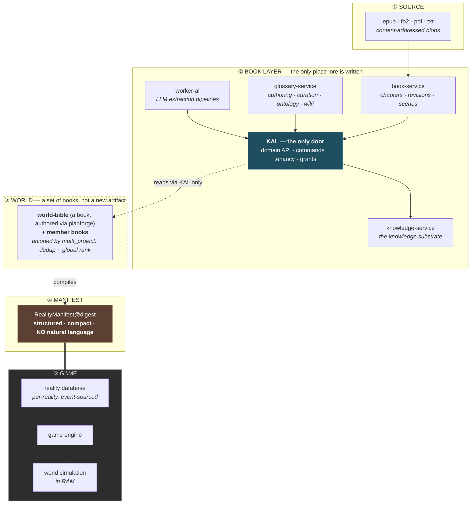
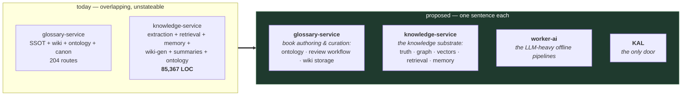
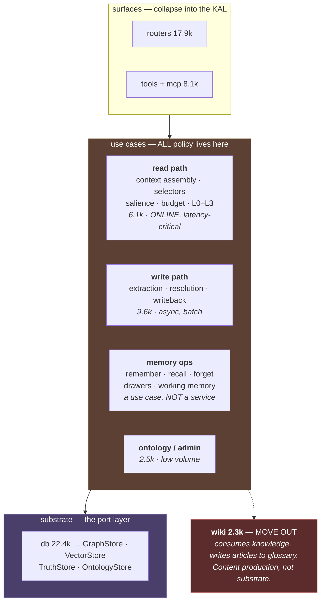
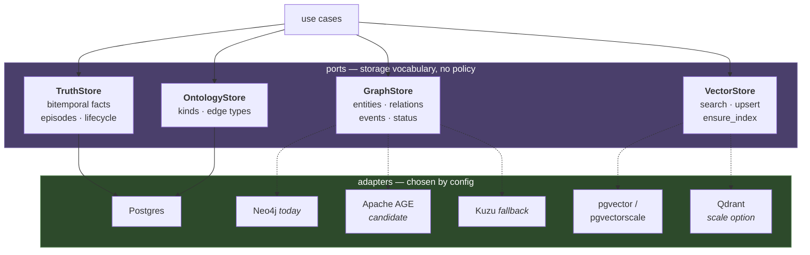
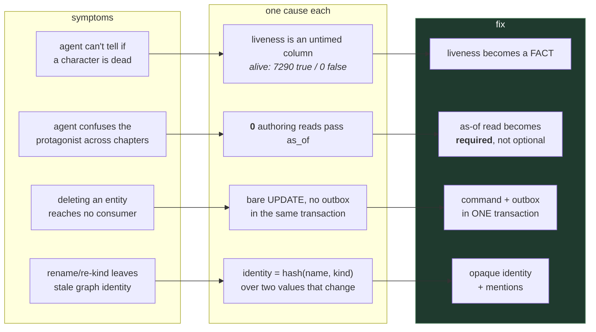
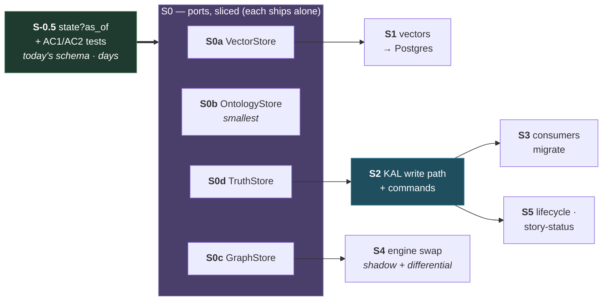

# Knowledge architecture — overview

**Reconciles:** **Reading/writing entity or KG knowledge** · **Two-layer glossary↔knowledge** · **Module/service boundaries** · **Per-service DB ownership / no cross-DB FK** — this document is the knowledge tier's overview and states how those four rows compose there; it does not introduce a fifth.

**Status:** 🔒 **SEALED 2026-08-09** — the *reasoning* is closed and must not be re-litigated from memory; re-read it. **All 30 opened questions are closed.** No code has changed. Decision register: **§9 below**. **Opened:** 2026-08-09 · **Branch:** `refactor/entity-lifecycle`
**Verified against:** `df18e9049`
**This is the entry point.** Detail lives in
[DIAGRAM](2026-08-09-knowledge-architecture-DIAGRAM.md) (boundaries, write/read paths, gates) ·
[MIGRATION PLAN](2026-08-09-kg-storage-migration-PLAN.md) (port → engine) ·
[BOOK-LAYER PROPOSAL](2026-08-09-lore-pipeline-architecture-PROPOSAL.md) (lifecycle, story-time) ·
[BLAST RADIUS](2026-08-09-current-architecture-blast-radius.md) (what exists today).

---

## 1 · The whole system, one picture

**Three rules this encodes:**

| rule | why |
|---|---|
| **Lore is written only in the book layer, only through the KAL** | one door means tenancy, grants, evidence and outbox emission happen in one place instead of 204 |
| **There is no "lore bible" layer — a world is a set of books** ✅ *sealed 2026-08-09* | the vocabulary already exists in the code: `multi_project.py` unions *"SEVERAL knowledge graphs (worlds/books)"* and collapses *"the **world-bible** entity that also appears in a **member book**"* to one row by salience. So the world-bible is **a book**, member books are **books**, and the union is **already built**. The work is to **extend planforge** to author game-focused lore books — not to invent an artifact type |
| **The manifest is a HARD boundary — nothing below reads back up** | the reality DB must not reach the KAL: latency, and the knowledge layer is natural-language and large-context, which nothing in the engine or the in-game agent is built to read. **The manifest is a compiler output, not a cache.** It is compiled from the **world** (the composed book set), not from a separate bible |

---

## 2 · Four services, four sentences

The cure for "god service" is that each one can be described in a single sentence. Today none of them can be.

> If those four sentences are true, the confusion disappears **without adding a single deployable** —
> which matters for an open-source platform where every new service is a tax on self-hosters.

---

## 3 · Inside knowledge-service — modules, not new services

85,367 LOC with no internal boundaries. The fix is **module boundaries enforced by gates**, not a
service split. Splitting into services to obtain boundaries uses deployment topology to enforce
architecture — expensive, and it does not work without discipline. The proof is local: **the KAL is
already a service boundary and everyone bypasses it.**

**Why memory is a module, not a service.** Memory and book knowledge share nearly all machinery —
extraction, entity resolution, temporal facts, retrieval, embeddings, salience. Only *scope*
(project/global vs book) and *source* (chat turns vs chapters) differ. **Splitting on scope is exactly
what produced the duplication we are already paying for**: `glossary.canonical_snapshot` and
`knowledge.entity_canonical_snapshots` — one concept, two identity spaces, two watermark types, two
status vocabularies that do not even share values. Do not recreate that at a new seam.

---

## 4 · Storage — ports and adapters

**Two decisions this encodes.**

**`VectorStore` is its own port.** The only *hard* ceiling in the current design lives here:
`summary_index_name(project_id, embedding_model_uuid, level)` creates **one HNSW index per tenant**
→ ~30,000 at 10k projects, plus ~63 M passage vectors ≈ **390–780 GB**. Neo4j cannot pre-filter a
vector search by tenant, which is *why* the per-tenant index exists — and that workaround is the thing
that does not scale. Splitting the port lets the vector layer move independently of any graph decision.

**The graph engine is deliberately undecided.** Once the port exists it is chosen by **shadow
comparison** — two adapters, same call, diff results and latency on real traffic — not by argument.
Neo4j Community's disqualifier is not topology: it is that **its only scale path is a commercial
licence**, which an open-source platform cannot hand its users.

---

## 5 · What is actually broken, and where each fix lands

> **The finding that sizes this work:** the book layer *already stores* story-time truth and never
> reads it. `entity_facts` is a working bitemporal SSOT — `emitChapterFacts` writes every extracted
> attribute at its chapter ordinal with evidence, `maintain_chain` maintains pin-aware supersession,
> and the as-of predicate is correct and index-served. **`composition-service` contains zero
> occurrences of `as_of`.** So this is largely *routing reads through machinery that exists*, not
> building version control.

---

## 6 · Order — **revised 2026-08-09 after [RED TEAM](2026-08-09-architecture-RED-TEAM.md)**

> ## 🔴 RE-ORDERED 2026-08-11 (PO) — **the graph engine is LAYER 1, not the tail**
>
> **PO ruling, verbatim:** *"in my architecture, it is the first layer that needs to refactor, not
> defer to the latest one"* — and *"we have avoided it almost all of the time."*
>
> **S4 (engine swap) moves to the FRONT.** The diagram below still shows it last; that ordering is
> superseded and the diagram is kept for the red team's reasoning, not its sequence.
>
> **Why the old order was wrong.** Putting the substrate swap last means every slice above it is
> built and verified against **one** engine, and the swap then re-opens all of them at the moment
> the plan has the least remaining capacity. That is maximum risk at the point of minimum slack.
> Doing it first inverts the property: everything built afterwards is engine-agnostic **because it
> was built against two engines from the start**, and the shadow comparison (T43) has real traffic
> to compare instead of a retrofit.
>
> **The precondition is already met.** The old ordering had a genuine dependency — a shadow
> comparison needs the port to exist. **`GraphStore` shipped in T18** (10 methods, domain-shaped,
> zero query language in the signature). Nothing blocks a second adapter today. The engine work was
> not waiting on a dependency; it was being deferred because it is large.
>
> **This ruling is also a correction of my own conduct.** Across several sessions T42 was reported
> ABSENT and then routed around — parked in *"Group B, needs a dedicated session"*, and when the
> RESUME pointer was rewritten it was aimed at **T38** (9 files) rather than the engine.
> Repeatedly avoiding the largest item has the same effect as deleting it.
>
> **Consequence worth naming:** if the engine lands in **AGE**, the graph lives in Postgres — so
> **T41** (*rebuild-from-Postgres*, which does not exist and which three claims depend on) changes
> shape entirely rather than needing to be built as specified. The old order could not see that,
> because it decided the engine after building the rebuild path for a different topology.

> **What the red team changed.** The original order put the PO's two acceptance cases in the **last**
> slice, behind ~22k LOC of substrate work (**RT-1**), and made S0 a single all-or-nothing refactor of
> the kind this repo has already stalled on once — **the KAL reached 18 of 204 routes** (**RT-12**).
> Both are fixed below.

- **S-0.5 ships the reported defect fix first** *(RT-1)*. The substrate for AC2 already works —
  `entity_facts` is bitemporal, `emitChapterFacts` writes at chapter ordinals, `maintain_chain`
  maintains pin-aware supersession, and the as-of predicate is correct and index-served.
  `composition-service` simply never passes `as_of` (**zero occurrences**). A `state?as_of` read over
  today's tables plus one migrated caller is **days**, and no port work touches it. It also de-risks
  everything after it by proving the read shape on real data *before* 22k LOC move.
- **S0 is sliced per-port, each independently shippable** *(RT-12)*. `VectorStore` first because it
  carries the only hard ceiling; `OntologyStore` second because it is smallest (2.5k) and proves the
  pattern cheaply. **An all-or-nothing S0 is the failure mode this repo has already demonstrated.**
- **S4 is parallel** — the engine swap does not block the KAL work.
- **S3 is incremental**: each consumer moves, its allowlist entry is deleted, the gate keeps it moved.
  ⚠️ The zero-allowlist precedent is **proven in miniature, not at scale** *(RT-13)* — it covered only
  the bi-temporal reads, and S3 faces the remaining 186 routes.
- **S5 gets cheaper by waiting**: `as_of` on the port is one interface change instead of 67.

---

## 6.1 · Gates that must pass before the next slice commits

Each is a **blocking measurement or decision**, not a task. From the red team's §7.

| before | gate | why | source |
|---|---|---|---|
| **S1** | **O2 verified** — does pgvectorscale support PG18? And what does owning a 3-extension Postgres image cost? | if it lags PG18, **the whole platform's Postgres pins to an older major** — every service, Patroni and backups, not just knowledge | RT-4 |
| **S1** | **Embedding durability decided** — vectors are either backed-up primary data, or recomputable with a **stated cost and time budget** | "derived, therefore free to rebuild" is true for the graph and **false for embeddings**: rebuilding ~63 M passages is an LLM budget event, not a recovery procedure. Three claims lean on this — graph HA, swap rollback, DR | RT-3 |
| **S2** | **`state@as_of` ceiling measured**, doc-21 style: rig stated, durability stated, **ratios not absolutes**, with a bite | D2 makes this read **required rather than optional**, so it runs *more* than what it replaces — and it crosses composition → KAL (Node) → glossary (Go) → Postgres. **The measurement most likely to invalidate the design** | RT-7 |
| **S2** | **KAL given an `SR06` dependency tier + a documented degraded mode** | it becomes a write-path single point of failure and currently has **no tier at all** | RT-5 |
| any producer move | **`D-GLOSSARY-EVENTS-NO-SOT` closed** | event types are a Go `const` block **hand-mirrored by five consumers, no generator, no drift gate**. Moving a producer under that is silent breakage by construction | RT-10 |
| **S4** | **property-based differential suite + shadow-coverage floor** — no cutover while any port operation has zero shadow observations | shadow comparison only sees *executed* paths; merge/split/restore/coref/triage diverge silently, and the graph feeds **canon checks** — divergence there becomes wrong prose, not an error | RT-9 |

---

## 7 · Open decisions this overview does not make

| # | question | blocks |
|---|---|---|
| ~~**O1**~~ | ✅ **SEALED 2026-08-09 — CONSOLIDATE.** One physical truth store is the destination. `D-SUBSTRATE-HOME` and SCOPE-3's two-layer row are **rewritten as part of this refactor** (they are inputs, not blockers). Sequence is fixed: **identity (D3) → `TruthStore` port → merge.** Three preconditions carry forward: (a) identity unified, or the merged store inherits two identity spaces and solves nothing; (b) **valid-time becomes a scope-dependent axis** — `story_ordinal` for books, `wall_clock` for memory — the only piece that must be *designed* rather than ported; (c) the mature bitemporal machinery (`maintain_chain`, content-addressed natural key, anchor+delta fold) **moves and keeps working**, Go → Python, rather than being rewritten from the weaker side. ⚠️ **Ordering constraint:** `D-GLOSSARY-EVENTS-NO-SOT` closes **before** outbox ownership moves (RT-10) | now a **work item**, not a question |
| ~~**O2**~~ | ✅ **RESOLVED 2026-08-09.** pgvectorscale **supports PG18** (`--pg18 pg_config` build flag) and is **PostgreSQL-OSS licensed**. ⚠️ Residual: no documented dimension ceiling for StreamingDiskANN — **2560/3072 still needs verifying** (pgvector's own HNSW caps at 2000 for `vector`, 4000 for `halfvec`) | S1 — mostly clear |
| ~~**O3**~~ | ⛔ **RESOLVED 2026-08-09 — AGE ELIMINATED.** Construct audit: **`datetime()` unsupported (152 uses)** and **`MERGE … ON CREATE/ON MATCH SET` unsupported (131/19/14 uses)** — the latter *is* the core entity-anchoring pattern. AGE requires a full rewrite, so its only advantage over other candidates is gone. Choice is now **Postgres-relational vs Kuzu** — see [PLAN §4](2026-08-09-kg-storage-migration-PLAN.md) | S4 — target changed |
| ~~**O4**~~ | ✅ **RESOLVED 2026-08-09 → [DIAGRAM §11](2026-08-09-knowledge-architecture-DIAGRAM.md).** **17 existing + 2 new** (`assert_role` from Q2, `assert_order` from D8). The key finding: **37 `*Core` functions already are the command layer**, documented as the shared SSOT for HTTP + MCP — what is missing is *outbox-in-the-same-transaction as part of their contract*, not the layer itself. **Delete, restore AND purge are all silent**, so a design emitting only `entity_deleted` fixes one third. *(orig)* **What is the command vocabulary?** The list of entity state transitions — the input S2 needs, and it decides whether plan-authored data (roles) is in scope | S2 |
| ~~**O5**~~ | ✅ **RESOLVED 2026-08-09 — YES, it is committed.** `projects.embedding_model TEXT`, user-settable via `project_tools.py`/`build_tools.py`, and `D-RERANK-NOT-BYOK` adds a **per-project BYOK rerank model** mirroring it. ⇒ the 30k-index problem is real and **tenant-filtered ANN is required, not optional** | S1 sizing — confirmed |
| ~~**O6**~~ | 🔴 **RESOLVED 2026-08-09 — WORSE THAN FEARED.** There is **no rebuild-from-Postgres path at all.** The only sweepers are `reconcile_evidence_count` (a counter reconciler) and `stats_updater`. So it is not *"never exercised"* — **it does not exist.** Three claims depend on it: graph HA is unnecessary, engine-swap rollback, and DR | **S1 + S4 — must be BUILT, not just run** |
| ~~**O7**~~ | ✅ **SEALED 2026-08-09 — the premise was wrong.** There is no missing artifact: **a lore bible is just a book.** A *world* is a **world-bible book + member books**, and `multi_project` already unions them with cross-project dedup and global salience ranking. The work is to **extend planforge** to author game-focused lore books. RT-2 therefore dissolves rather than resolving — `D-CANON-CHECK-BLIND-TO-ROLE` is closed by **Q2** (roles as relation facts), which **is** in scope | dissolved |
| ~~**Q2**~~ | ✅ **SEALED 2026-08-09 — a ROLE is a relation fact with a story interval.** `entity_facts` row, `fact_kind='relation'`, story interval, evidence — reusing supersession, as-of and invalidation for free. Two consequences: **(a)** the closed `entity_facts_kind_chk` CHECK set widens; **(b)** roles are **plan-authored, not extracted**, so **composition-service enters the KAL command surface** — which pulls O4's command vocabulary wider than entity CRUD | S3 scope |
| ~~**O8**~~ | ✅ **RESOLVED 2026-08-09 → PLAN M7 — two numeric tripwires.** Re-open when **p50 entity degree ≥ 3** (it is **0** today) **OR** any production query needs variable-length `RELATES_TO` beyond depth 2 (today: **zero**). Both are one query and belong in CI beside the other gates. *(orig)* **What is the trigger to re-open the graph-engine choice?** AGE is accepted partly because the workload is shallow — but that workload is shallow *because relationship extraction is immature* (3 of 8 edges defensible). State the assumption and a numeric trigger (e.g. *"if median entity degree exceeds N, re-open"*) rather than leaving it implicit | S4 (RT-8) |

---

## 8 · What the red team did not break

Recorded so the surviving structure is explicit rather than assumed. Full analysis:
[RED TEAM](2026-08-09-architecture-RED-TEAM.md) — 14 findings, 5 survive, 3 change the plan.

- **The two-boundary model (KAL + ports).** No perspective produced an attack on the *shape* — every
  surviving finding was about **sequencing, measurement or operability**.
- **Memory as a module, not a service.** The scope-split argument held under attack.
- **`VectorStore` as its own port.** Attacked from three directions; strengthened each time.
- **Neo4j's disqualification.** The strongest available counter — *"you are building for a load nobody
  has"* — **failed**: the licence ceiling and the per-tenant index pattern are **structural, not
  load-dependent**, and an architecture whose only growth path is a commercial licence is a defect you
  ship to *other people*. It converted into a sequencing argument (RT-1), not a reason to stay.

---

## 9 · 🔒 SEALED — decision register

**Sealed 2026-08-09.** Following this repo's convention (`ONT` doc 29): **SEALED means the *reasoning*
is closed and must not be re-litigated from memory — re-read it.** It does *not* mean every downstream
detail is decided, and it does not mean any code changed. **All 30 opened questions are closed.**

**ID prefixes are distinct from the open-question registers on purpose** — `B` boundaries · `SH` service shape · `T` storage · `MD` model · `SQ` sequencing. A bare `M5`/`Q1` elsewhere in this folder refers to a *question*, not a decision.

Each row states its **basis**: `measured` (a number from this repo), `audited` (a construct/vendor
check), or `PO` (a product decision). Rows without a basis do not exist — that was the rule.

### A · Boundaries

| # | decision | basis |
|---|---|---|
| **B1** | **Two boundaries, both required** — KAL (cross-service door) + Ports (intra-service substitutability). The repo has the first and not the second | measured: 128 imports / 67 modules bind `neo4j_repos` |
| **B2** | **KAL is a GATEWAY ONLY** — transport, authn/authz, routing, contract validation. **No domain logic.** All logic in the Python module | PO |
| **B3** | **Other services enter over HTTP/gRPC. No direct code calls, no privileged internal path** — a shadow path is the softness that broke the architecture | PO |
| **B4** | **All external reads go through the KAL.** knowledge-service's own composition is *behind* the door, not crossing it — so it needs no exception | PO |
| **B5** | **Route writes, never federate.** The owning service keeps the transaction; a cross-store operation is refused in v1 rather than made distributed | PO (F4) |
| **B6** | **Policy leaks are symmetric** — logic in an adapter and logic in the gateway are the same defect. `kal/temporal.ts` is a live instance and moves to Python | audited: 646-line gateway, 31 lines of policy |

### B · Service shape

| # | decision | basis |
|---|---|---|
| **SH1** | **Modules, not new services.** Deployment topology is the wrong tool for boundaries — the KAL is already a service boundary and is bypassed | measured: 85,367 LOC, no internal boundary |
| **SH2** | **Memory is a module, not a service.** Splitting on *scope* is what produced the duplication already being paid for | measured: two canonical-snapshot tables, two identity spaces, two watermark types |
| **SH3** | **`wiki` (2.3k) moves out** — it consumes knowledge and writes articles to glossary; content production, not substrate | measured |
| **SH4** | **Four services, four sentences** — glossary = authoring/curation · knowledge = the substrate · worker-ai = LLM pipelines · KAL = the door | PO framing |

### C · Storage

| # | decision | basis |
|---|---|---|
| ~~**T1**~~ | ~~**⛔ Apache AGE eliminated** — `datetime()` (152 uses) and `MERGE … ON CREATE/ON MATCH SET` (164) unsupported; the latter is the core anchoring pattern~~ ⚠️ **RE-OPENED 2026-08-11 (PO) — the premise is refuted.** The elimination rested on a **documentation** check (basis `audited`). Re-tested against a running **AGE 1.7.0 / PostgreSQL 18.1**, every construct is expressible in AGE's own idiom: `ON CREATE SET` → `SET x = coalesce(x, v)` · `ON MATCH SET` → unconditional `SET` · `datetime()` → **`timestamp()`** · `CALL { … }` → SQL `CTE`/`LATERAL`. Even `__was_created` is exact via a pre-`MATCH` count in the same transaction. ⚠️ **The first re-test was ALSO wrong** — it ran *Neo4j* Cypher against AGE and read the syntax errors as missing capability, which measures **portability, not capability**. Evidence: `docs/measurements/2026-08-11-age-construct-probe.md`. **What survives:** AGE needs a query-layer rewrite (~33 anchoring sites + 157 renames + 14 `CALL{}`). **What does not:** *"so its only advantage evaporates"* — that assumed the advantage was Cypher portability; the real advantage is **colocation** with the vectors T3 already sends to pgvector, and it was never priced | ~~audited~~ **measured** |
| ~~**T2**~~ | ~~**Target is Postgres-relational (recommended) vs Kuzu, decided by P2 shadow comparison.**~~ ⚠️ **AMENDED 2026-08-11 (PO).** The candidate set was narrowed on T1's refuted premise, so it is restored: **AGE · Kuzu · Postgres-relational**, still decided by shadow comparison (**T43**) rather than by argument, per **X1**. Kuzu's dialect cost is smaller (~14 `CALL{}` + 152 renames); AGE's operational story is better (one engine for graph + vectors + truth, one backup, one ops surface). That is a real trade and the design's own method is to measure it | **measured** |
| **T3** | **Vectors leave the graph**, to pgvector / pgvectorscale (StreamingDiskANN, PG18 ✅, Postgres-OSS licensed) | measured: ~30k per-tenant HNSW indexes at 10k projects; 390–780 GB |
| **T4** | **Vectors are durable primary data, backed up — never recomputed.** Embedding models are per-project **BYOK**, so re-embedding on DR spends the *user's* budget without consent | measured + PO |
| **T5** | **Publish a prebuilt Postgres image; own the extension matrix** — the alternative destroys the operability argument for leaving Neo4j | PO |
| **T6** | **Engine re-open tripwires:** p50 entity degree ≥ 3 (today **0**) **OR** any query needing variable-length `RELATES_TO` beyond depth 2 (today **zero**) | measured |
| **T7** | **`TruthStore` consolidates**, sequence **identity → port → merge**; `D-SUBSTRATE-HOME` and SCOPE-3 are rewritten as part of the refactor | PO |

### D · The model

| # | decision | basis |
|---|---|---|
| **MD1** | **Identity is an opaque id + mentions.** Retires `e.id = hash(name, kind)` | PO; measured: 77 stale nodes from the kind backfill |
| **MD2** | **A role is a relation fact with a story interval** — closes `D-CANON-CHECK-BLIND-TO-ROLE`. Consequence: composition becomes a KAL command producer | PO |
| **MD3** | **No lore-bible layer. A world is a set of books** (world-bible + member books, already unioned by `multi_project`). Extend **planforge** to author game-focused lore books | PO; measured: the vocabulary is already in the code |
| **MD4** | **Liveness is NOT a load filter.** A dead character is referenced *more*, not less | PO; measured: `alive` 7290/0, `:EntityStatus` 0-of-21 |
| **MD5** | **World order is a partial order over event entities** (`HAPPENS_BEFORE`); **chapter is the reveal unit**. No absolute time axis | PO; measured: 62 of 1,059 dated, **100 % diverge** from reading order |
| **MD6** | **Reveal axis subsumes the spoiler window** — *"read at reveal position P"* replaces the query flags | PO |
| **MD7** | **Chapter revisions invalidate on the belief axis** (`invalidated_reason='episode_superseded'`), story intervals untouched | PO; measured: 99/99/**0 revisions** — latent |
| **MD8** | **The event anchor sits beside `source_episode_id`**, not replacing it — reveal provenance vs world position are different axes | reasoning |
| **MD9** | **D7 · dedupe re-assertion at write time** | measured: **11.7 %** of rows carry no new information; `gender` 93.2 % |
| **MD10** | **D8 · populate the partial order by widening `causal_edges.py`** (`causes \| precedes`) + copy the `motif_link` cycle guard | audited: built, wired, **0 instances** |
| **MD11** | **D9 · covering index for the book-wide as-of read** | measured: 8.7 ms flat, but `idx_entity_facts_book` has **128 lifetime scans** vs 136,655 |

### E · Sequencing

| # | decision | basis |
|---|---|---|
| **SQ1** | **S-0.5 ships first** — `state?as_of` + AC1/AC2 on today's schema, days not months | RED TEAM RT-1; measured: `as_of` count in composition = **0** |
| **SQ2** | **S0 is sliced per-port, `VectorStore` first**, each independently shippable | RED TEAM RT-12; measured: the KAL stalled at 18 of 204 routes |
| **SQ3** | **Every gate ships a bite.** A gate that cannot fail is decoration | repo convention (doc 21) |

### What is NOT sealed

- **The graph engine** — T2 is decided *by* P2's shadow comparison, deliberately.
- **Any code.** No implementation exists; this is design only.
- **The measurements listed as gates** — `state@as_of` through the KAL, the synthetic 4,000-chapter
  ceiling, pgvectorscale dims > 2000, and the rebuild-from-Postgres path (**which does not exist and
  must be built**).
