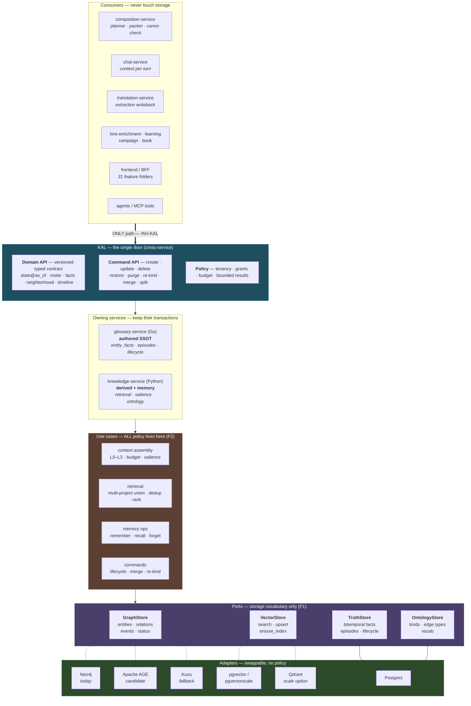
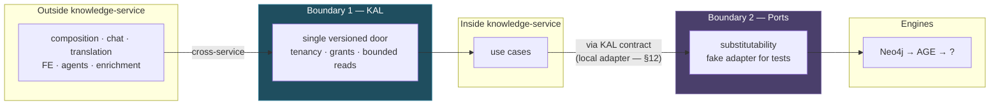
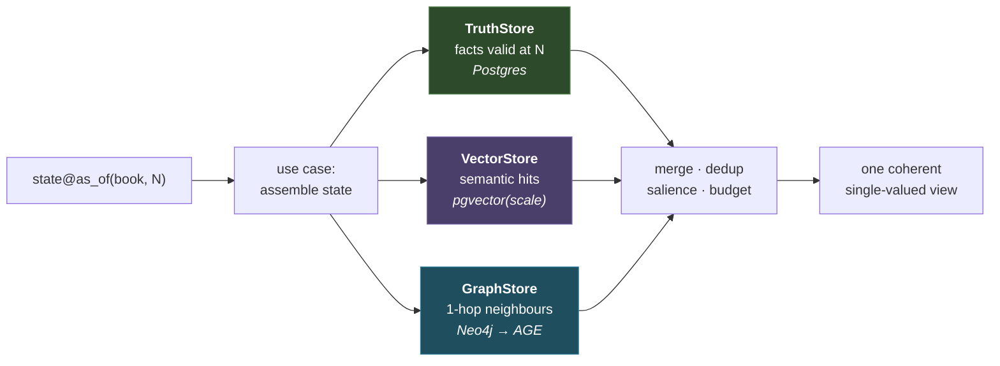
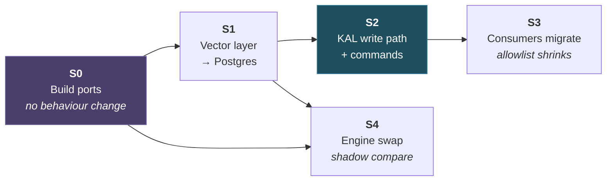
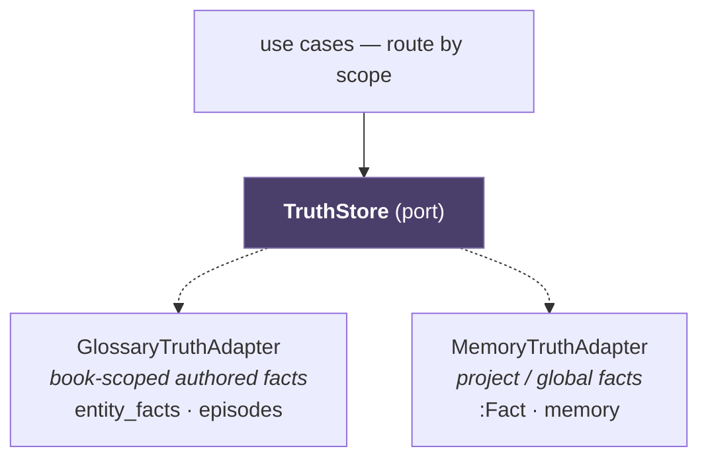
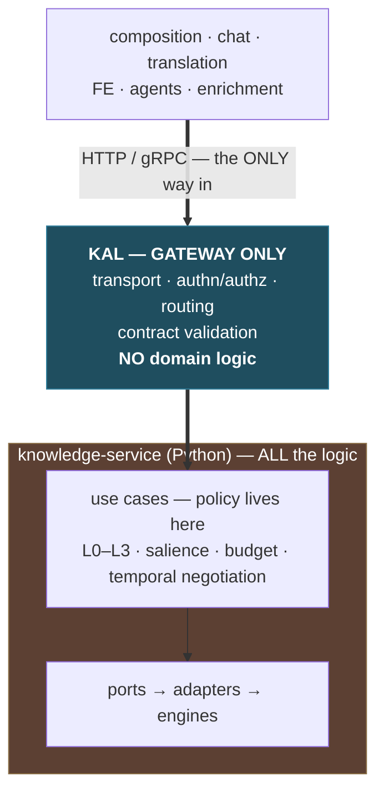

# Knowledge architecture — the two boundaries

**Status:** 🔒 **SEALED 2026-08-09** — the *reasoning* is closed and must not be re-litigated from memory; re-read it. **All 30 opened questions are closed.** No code has changed. Decision register: [ARCHITECTURE-OVERVIEW §9](2026-08-09-ARCHITECTURE-OVERVIEW.md#9--sealed--decision-register). **Opened:** 2026-08-09 · **Branch:** `refactor/entity-lifecycle`
**Verified against:** `df18e9049`
**PO decision this draws:** (1) split the data/graph layer behind a port so the vendor is swappable;
(2) centralize read/write through the KAL. Other services migrate onto the KAL **afterwards**.

---

## 1 · Verdict — is it solid?

**Yes.** Three reasons, and they are structural rather than stylistic:

1. **They are two boundaries at two different levels, not one idea twice.** The **port** is
   *intra-service* and buys **substitutability**. The **KAL** is *cross-service* and buys **a single
   door**. Neither substitutes for the other, and a system with only one of them is exactly what this
   repo has today — INV-KAL exists with a zero-allowlist CI gate, and inside knowledge-service 67
   modules bind straight to `app.db.neo4j_repos`.
2. **Both are half-built, so this is finishing.** The repo functions are already domain-shaped
   (`find_entities_by_name`, `status_at_order`, `archive_entity`); the KAL already has a frozen typed
   contract, read/write controllers, and two CI gates.
3. **It makes everything after it cheaper.** With the port, the engine swap is a config change. With
   the KAL extended, adding `as_of` to the read path is **one interface change instead of 67**, and the
   lifecycle command surface has somewhere to live.

**Four ways it goes wrong.** The diagrams below encode each one; they are the reason this document
exists rather than a single box-and-arrow sketch.

| # | failure | rule that prevents it |
|---|---|---|
| **F1** | KAL and port **mirror each other** → an extra hop with no added meaning | **KAL speaks domain** (state-as-of, roster, facts, commands). **Ports speak storage** (nodes, edges, vectors). If an operation appears identically in both, one of them is wrong |
| **F2** | Domain logic leaks **out of the use-case layer** — downward into adapters (salience/budget written in Cypher) **or upward into the gateway** (§12.1.1: `temporalCapability()` deciding `as_of` semantics in TypeScript) | A **use-case layer in Python owns all policy.** Adapters contain none. **The gateway contains none.** Logic in either neighbour is the same defect in two directions |
| **F3** ⚠️ **AMENDED 2026-08-09** | knowledge-service calls **itself over HTTP** → N+1 latency storm on every chat turn | ~~The KAL is the door for other services; in-process use cases call ports directly.~~ **PO decision: ALL reads go through the KAL over HTTP/gRPC — no direct code calls, no privileged internal path.** F3's premise was wrong: knowledge-service's internal composition is **behind** the door, not crossing it, so it never needed an exception. What remains is the **external** hop, which is measured (§12.2) rather than avoided |
| **F4** | The KAL tries to own a **transaction** spanning two services' databases | The **owning service** keeps the transaction. The KAL validates, authorizes and routes — it never coordinates a write across databases |
| **F5** 🆕 | The KAL becomes an **unclassified write-path SPOF** — a KAL outage stops *all* lore writes platform-wide, where today glossary is directly reachable and a gateway failure degrades rather than halts *(RT-5)* | The KAL gets an **`SR06` dependency tier** and a **documented degraded mode** *before* it owns writes. It currently has **no tier at all**, and it puts a third runtime (Node) on the critical path in front of Go and Python |

---

## 2 · The layered view

**Read it as four rules:**

- Consumers reach **only** the KAL. That is INV-KAL, already gated — this extends its scope to writes
  and to the authored catalog.
- The KAL speaks **domain**; ports speak **storage**. (F1)
- **All policy** — salience, budget, dedup, L0–L3, multi-project ranking — is in use cases. Adapters
  are dumb. (F2)
- Adapters are **dotted** because they are chosen by configuration, not by code.

---

## 3 · The two boundaries, and what each one buys

| | boundary 1 — **KAL** | boundary 2 — **Ports** |
|---|---|---|
| scope | cross-service | intra-service |
| buys | one door · tenancy in one place · a contract other teams code against | vendor swap · **fake adapter for tests** · shadow comparison |
| state today | exists · CI-gated · **zero allowlist** · but **read-only, 18 of 204 routes** | **absent** — 128 imports across 67 modules bind to `neo4j_repos` |
| this work | extend to **writes + authored catalog** | **build it** |

> ⚠️ **F3 AMENDED 2026-08-09 — see §12.** The PO sealed *"route writes, and ALL reads through the KAL"*,
> so the in-process exception below is **superseded**. It survives as the *risk* F3 names, resolved by
> §12.1's **gateway-only KAL, logic in Python**. Original text retained for the record:
>
> > **F3 is the rule that keeps this fast.** knowledge-service's own context assembly runs **in-process
 > against ports** — it does not call the KAL. Forcing it through HTTP would put a network hop inside
> > the L0–L3 loop on every chat turn. The KAL is a boundary for *other services*, not a mandatory
> > internal bus.

---

## 4 · Write path — who owns the transaction (F4)

The most important diagram here, because getting it wrong reintroduces the bug class this whole
refactor exists to kill: a write that lands in a store **without** its event.

```mermaid
sequenceDiagram
    autonumber
    participant C as Consumer<br/>(composition / FE / agent)
    participant K as KAL
    participant G as glossary-service<br/>(owns the SSOT)
    participant DB as Postgres<br/>(truth + outbox)
    participant R as Redis Streams
    participant N as knowledge-service<br/>(projector)
    participant GS as GraphStore adapter

    C->>K: command(delete_entity, position, evidence, actor)
    K->>K: validate · tenancy · grants
    K->>G: POST /commands/delete_entity
    rect rgb(45,74,43)
        Note over G,DB: ONE transaction — the invariant
        G->>DB: write lifecycle ledger
        G->>DB: write outbox row
    end
    G-->>K: ack
    K-->>C: ack

    DB->>R: publisher drains outbox
    R->>N: glossary.entity_deleted
    N->>GS: archive_entity(reason='glossary_deleted')
    Note over N,GS: projection catches up asynchronously
```

Three rules this encodes:

1. **The owning service keeps the transaction.** The KAL never spans two databases. It validates,
   authorizes and routes.
2. **Store write + outbox row are one transaction, always.** This is the rule
   `softDeleteEntityCore` breaks today — a bare `UPDATE … SET deleted_at` with no outbox write, which
   is precisely why deletion never reaches any consumer.
3. **The projection is eventually consistent, and that is fine** — the graph is derived and classified
   **P2** (`SR06`: *"does not block active play"*), so it may lag and may be rebuilt.

---

## 5 · Read path — and why the port split matters

> **Why `VectorStore` must be its own port.** The as-of filter lives in `entity_facts` in **Postgres**;
> the vectors live in **Neo4j**. They cannot be filtered against each other in one query today. Split
> as separate ports, the vector layer migrates to Postgres **independently of any graph decision** —
> and *"semantic search over facts valid as of chapter N"* becomes one query instead of an
> over-fetch-and-post-filter.

---

## 6 · Migration — the allowlist that shrinks

Other services move onto the KAL **after** the foundation, exactly as proposed. The mechanism already
exists and has been run to completion once: `knowledge-http-surface-gate.py` reached a **zero
allowlist** for the bi-temporal reads.

> ⚠️ **Do not over-read that precedent** *(RT-13)*. The gate covers **only** the bi-temporal knowledge
> reads — its own comment says the authored entities-LIST endpoint is *"intentionally NOT here."* The
> zero was achieved by scoping the problem small; S3 proposes the opposite, the remaining **186
> routes**. The *mechanism* is proven; the *effort* does not extrapolate.

- **S0 unblocks everything** and changes no behaviour — the Neo4j adapter is the existing code lifted.
- **S4 is parallel**, not sequential: once the port exists the engine swap does not block the KAL work.
- **S3 is incremental by construction** — each consumer moves, the allowlist entry is deleted, the gate
  keeps it moved. No big-bang cutover.

---

## 7 · What would make me say it is NOT solid

Recorded so the claim in §1 is falsifiable rather than encouraging:

- If the KAL ends up a **1:1 proxy** over `GraphStore`, it is a hop with no semantics (**F1**) — delete
  one of the layers.
- If knowledge-service is forced to call the KAL **over HTTP for its own context assembly** (**F3**),
  the L0–L3 loop pays a network hop per turn and the design is worse than today.
- If **policy lands in adapters** (**F2**), the vendor is not actually swappable and the port is
  decoration.
- If the KAL is made a **transaction coordinator** across glossary and knowledge (**F4**), it becomes a
  distributed-transaction problem that the outbox pattern already solves correctly.

Each has a gate in §8.

---

## 8 · Gates — each with a bite

Following this repo's discipline: a gate that cannot fail is decoration.

| gate | asserts | bite |
|---|---|---|
| **no-cypher-outside-adapters** | no `MATCH (` / `MERGE (` / `CREATE (` outside the adapter package | delete the adapter package → must go red |
| **no-storage-import-in-usecases** | use cases import ports, never adapters | import an adapter in a use case → must go red |
| **KAL-only (extended INV-KAL)** | consumers do not call owning services' `/internal/*` for lore, and do not touch `glossary_entities` | add a direct call in a consumer → must go red |
| **command-or-nothing** | no bare `UPDATE glossary_entities` outside a command | reintroduce `softDeleteEntityCore`'s bare UPDATE → must go red |
| **adapter parity** | `FakeGraphStore` and `Neo4jGraphStore` satisfy the same contract test suite | remove an operation from the fake → must go red |

---

## 9 · Open

| # | question |
|---|---|
| ~~**A1**~~ | ✅ **RESOLVED 2026-08-09 → §11.** The command layer **already exists in embryo**: **37 `*Core` functions**, documented as the shared SSOT for HTTP + MCP. What is missing is not the layer — it is **outbox-in-the-same-transaction as part of their contract** |
| ~~**A2**~~ | ✅ **SEALED 2026-08-09 → §12 — ROUTE ONLY, never federate.** F4 stands: the owning service keeps the transaction; a genuinely cross-store operation is refused in v1 rather than turned into a distributed transaction. *(orig)* **Does the KAL federate glossary writes, or does it only route them?** Routing is simpler and keeps F4 safe; federation (e.g. one call touching both stores) needs a saga and should probably be refused in v1 |
| ~~**A3**~~ | ✅ **SEALED 2026-08-09 → §12 — ALL reads go through the KAL, no in-process exception.** This **amends F3**, converting it from a rule into a measured risk; the resolution is §12.1's **gateway-only KAL with all logic in Python** — no direct code calls and no privileged internal path. knowledge-service's own composition is *behind* the door, not crossing it, so it needs no exception. The **external** KAL-overhead measurement remains a **hard gate before S2**. *(orig)* **Which reads stay in-process vs go through the KAL?** F3 says knowledge-service's own assembly stays in-process — but composition's `state@as_of` is cross-service and hot. Its latency budget is unmeasured |
| ~~**A4**~~ | **RESOLVED 2026-08-09 → §10.** `TruthStore` is a **port spanning both services**, not a store owned by one |

---

## 10 · A4 resolved — `TruthStore` is a port, and there are already two of them

The question was *"should `TruthStore` belong to knowledge-service, since knowledge is general-purpose
and glossary is not?"* The premise is factually right, and verified:

| | scope |
|---|---|
| knowledge `:Fact` | **`project_id` + `user_id`** — no `book_id` anywhere. Genuinely general-purpose |
| glossary `entity_facts` | **`book_id NOT NULL`**, FK → `glossary_entities`, FK → `episodes` |

But "general purpose" and "owns authored truth" are **two axes being read as one**:

| | **book-scoped** | **project / global** |
|---|---|---|
| **authored** | glossary `entity_facts` | knowledge **memory** (`memory_remember`) |
| **derived** | knowledge `:Fact` from chapters | knowledge `:Fact` from chat |

Three of four quadrants are already populated — so the two-layer rule as written in `AGENTS.md`
(*glossary = authored, knowledge = derived*) is **already softer than stated**: `memory_remember` is
authored and lives in knowledge-service.

### The real finding — two truth stores, forked by identity

| | `glossary.canonical_snapshot` | `knowledge.entity_canonical_snapshots` |
|---|---|---|
| identity key | `entity_id UUID` → `glossary_entities` | `entity_id TEXT` → **Neo4j content hash** |
| scope | `book_id` | `user_id` + `project_id` |
| belief watermark | `fact_coverage_xid` (**xid8**) | `fact_coverage_at` (**timestamptz**) |
| status vocabulary | `current / stale / unbuildable` | `ready / dirty / building / unbuildable` |

**One concept, folded twice, over two identity spaces, with status vocabularies that do not share
values.** That is not an ownership mistake — it is `D-ENTITY-IDENTITY-HASH` surfacing as duplicated
infrastructure. **Moving `entity_facts` between services would not unify them.**

### Resolution

The consumer asks *"facts about entity X as of N"* and never learns which store answered. This
preserves both scope models, gives one API over both quadrants today, and leaves physical
consolidation available later **without changing a single caller** — which is the whole point of
having the port.

### If consolidation is wanted (PO direction, 2026-08-09)

It is a refactor, so `D-SUBSTRATE-HOME` and SCOPE-3 are **inputs to rewrite, not blockers**. Three
things must be true first, and they are ordered:

1. **Identity unifies (D3).** While one store keys on a glossary UUID and the other on a content hash,
   *"entity X"* is ambiguous and no port can hide that honestly.
2. **Valid-time becomes a scope-dependent axis.** Book truth is indexed on **story ordinal**; memory
   truth on **wall-clock**. A merged store needs `time_axis: story_ordinal | wall_clock` as a
   first-class field — this is the one piece that must be *designed*, not ported.
3. **The mature implementation moves and keeps working.** `maintain_chain` (pin-aware supersession),
   the content-addressed natural key, half-open interval invariants, `anchor+delta` fold with
   `folds_since_reground`, episode-cited evidence — all live on the glossary (Go) side. Consolidation
   must port *that*, not rewrite from the weaker side.

**Costs, stated as costs rather than objections:** ~241 `deleted_at` reads re-point; `glossary.*`
outbox ownership moves and five consumers re-point; the bitemporal machinery crosses a language
boundary (Go → Python).

---

## 11 · A1 / O4 resolved — the command vocabulary, and the layer that already half-exists

### 11.1 The finding: `*Core` **is** the command layer

**37 `*Core` functions** exist in `glossary-service/internal/api`, and the codebase already describes
them exactly as a command layer would be described:

> *"the single source of truth for the REST DELETE route **AND** the `glossary_entity_delete` Tier-W
> confirm effect"* · *"Shared by HTTP + MCP"* · *"shared post-grant core"* · *"one source of truth
> across tiers"*

So **S2 is not "build a command layer."** The shape is there, and every write already funnels through
it. What was never made part of the contract is the half that matters:

> **The `*Core` contract today:** resolve tenancy → mutate the store → return.
> **The `*Core` contract required:** resolve tenancy → mutate the store **→ write the outbox row, in the
> same transaction** → return.

Emission is currently **ad hoc and inconsistent** — merge emits, `softDeleteEntityCore` /
`restoreEntityCore` / `purgeEntity` do not. That inconsistency *is* the lifecycle bug, and it is why
`19 files` can write `glossary_entities` while only some changes ever reach a consumer.

**This materially reduces S2.** It becomes: (a) make outbox-in-TX part of the `*Core` contract,
(b) route the stragglers through `*Core`, (c) gate it.

### 11.2 The vocabulary

Derived from the actual writers, not invented. **19 files write `glossary_entities`.**

| # | command | today | emits? |
|---|---|---|---|
| 1 | `create_entity` | `createEntity` · `createExtractedEntity` · `seedSelfEntityCore` | ⚠️ partial |
| 2 | `update_entity` | `patchEntity` · `applyEntityEdit` | ✅ `entity_updated` |
| 3 | **`delete_entity`** | `softDeleteEntityCore` · `bulkDeleteEntities` | ❌ **silent** |
| 4 | **`restore_entity`** | `restoreEntityCore` | ❌ **silent** |
| 5 | **`purge_entity`** | `purgeEntity` | ❌ **silent** |
| 6 | `erase_book_entities` | `internalEraseBookEntities` | ⚠️ nuclear — GDPR path |
| 7 | `set_status` | `bulkSetEntityStatusCore` · `curationStatusChangeCore` | ❌ |
| 8 | `pin` / `unpin` | `setEntityPinned` | ❌ |
| 9 | `merge_entities` | `mergeEntitiesCore` · `curationMergeCore` | ✅ `entity_merged` |
| 10 | `revert_merge` | `revertMergeCore` | ✅ `unmerged` |
| 11 | `split_entity` | (guarded by `entityExistsInBook`) | ❌ |
| 12 | `reassign_kind` | `reassignEntityKindCore` · `curationReassignKindCore` | ❌ |
| 13 | `resolve_kind` | `resolveEntityKind` (vote resolution) | ✅ on primary change |
| 14 | `restore_revision` | `restoreEntityRevisionCore` · `curationRestoreRevisionCore` | ❌ |
| 15 | `set_genres` | `setEntityGenresCore` · `setEntityGenresToolCore` | ❌ |
| 16 | `append_fact` / `create_evidence` | `createEvidenceCore` · `editAttributeCore` | ⚠️ |
| 17 | `fold_canonical` | `foldDirtyCount` + fold handler | n/a (derived) |
| 18 | 🆕 **`assert_role`** | — | **new — from Q2** |
| 19 | 🆕 **`assert_order`** | — | **new — from D8** |

**Three observations that shape S2/S3.**

**(a) Rows 3–5 are the lifecycle bug, exactly.** Delete, restore *and* purge are all silent. A design
that emits only `entity_deleted` fixes one third of the transitions and leaves a restored entity
permanently archived in every consumer.

**(b) Two commands are new, and both come from decisions sealed today.** `assert_role` (Q2 — roles are
relation facts with story intervals) and `assert_order` (D8 — `HAPPENS_BEFORE` edges). Both are
**plan-authored, not extracted**, which means **composition-service becomes a KAL command producer**.
That is the scope widening Q2 implied, made concrete.

**(c) The `curation*Core` family is a second entry point to the same transitions** — `curationMergeCore`,
`curationReassignKindCore`, `curationStatusChangeCore`, `curationRestoreRevisionCore`. Two paths into
one transition is exactly how emission drifts. **They should converge on the same command**, or the gate
will have to allowlist one of them forever.

### 11.3 Gate

**`command-or-nothing`** (from §8): no bare `UPDATE`/`INSERT` on `glossary_entities` outside a `*Core`
command, and every `*Core` that mutates the store writes its outbox row in the same transaction.

**Bite:** reintroduce `softDeleteEntityCore`'s bare `UPDATE … SET deleted_at = now()` with no outbox
write — the gate must go red. It is red today, which is the point.

---

## 12 · A2/A3 sealed — *route writes, and ALL reads through the KAL*

**PO decision, 2026-08-09:** the KAL **routes** writes (never federates — F4 stands), and **every read
goes through the KAL, with no in-process exception.**

**This contradicts F3 as originally written, and that is recorded rather than smoothed over.** F3 said
knowledge-service's own assembly should bypass the KAL to avoid a network hop in the L0–L3 loop. The
PO chose uniformity instead: one door, no exceptions to reason about, one place for tenancy and policy,
and a gate that needs no allowlist.

### 12.1 ⛔ **CORRECTED 2026-08-09 (PO)** — the KAL is a gateway, and logic lives in Python

> **My earlier proposal — *"one contract, two transports"*, with knowledge-service binding a local
> in-process adapter of the KAL contract — was wrong, and it was the boundary violation dressed up as
> an optimisation.** A privileged internal path that skips the real door is exactly the class of
> softness that produced 67 modules importing `neo4j_repos` directly. **Withdrawn.**

**The PO's rule:**

> *"KAL is just a gateway. Logic should be in the Python module. Other services read through HTTP or
> gRPC. Do not direct-call the code — our architecture broke because it violated boundaries."*

**Two things this fixes that my version did not.**

**(1) The drift problem dissolves — there is nothing to drift.** My version had *two implementations of
one contract* (TS + Python) held together by a conformance suite. Under the correct model there is
**one implementation, in Python**, and the KAL is a pass-through. No second implementation, no
conformance-suite-or-bust, no caveat.

**(2) knowledge-service's internal composition was never a boundary crossing.** I framed it as *"the
service calling itself"*, which implied it needed to go through the door. It does not — **it is behind
the door.** The door exists for *other* services. So A3 stands cleanly and F3's cost never arises:
external reads pay one gateway hop; internal composition is just the service doing its job.

### 12.1.1 🔴 The rule already has one live violation — and D0.1 would have exposed it

The KAL is genuinely thin — **646 lines total**. But `kal/temporal.ts` (31 lines) holds a **domain
policy** in TypeScript:

> *"The KAL must NOT silently serve transaction-time-contaminated KG `as_of`"* — `temporalCapability()`
> decides per substrate what `as_of` means, and **drops `as_of`** when the KG cannot honour it.

**D0.1 invalidates that rule.** Once the KG becomes authoritative for **event ordering** while
`TruthStore` owns **attribute state**, a flat per-substrate capability answer is wrong — and under my
withdrawn proposal it would have needed changing in TypeScript *and* Python, silently diverging in
between. **This is the drift the PO's rule prevents, caught before it bit.**

> **Action:** `temporalCapability()` and its `as_of` guard move **into the Python use-case layer**; the
> KAL forwards the capability the service reports. Gate: **no conditional on substrate, capability,
> budget, salience or tenancy semantics inside `knowledge-gateway/src`** — only transport, authn/authz,
> routing and contract validation. **Bite:** put a substrate conditional back in the gateway; the gate
> must go red.

### 12.2 The measurement is now a hard gate, not a nice-to-have

Under the corrected model (§12.1) the hop applies to **external** callers only — knowledge-service's
own composition is behind the door and pays nothing. But composition-service's `state@as_of` **is**
external and **is** hot (every chapter of every drafting run), so the number is still load-bearing:

> **Gate before S2 commits:** measure `state@as_of` end-to-end **through the KAL**, doc-21 style —
> rig stated, ratios not absolutes, with a bite — against the same read measured in-process.
> **Publish the ratio.** If the HTTP path costs materially more than the in-process one on a per-chapter
> read, §12.1 is mandatory rather than optional.

The in-process baseline already exists: **`state@as_of` is ~8.7 ms flat** at real book size
([PROPOSAL §6.3](2026-08-09-lore-pipeline-architecture-PROPOSAL.md)). What is unmeasured is the KAL
overhead on top of it — Node hop, serialization, and N-per-turn call count.

### 12.3 What this simplifies

Worth stating, because the decision buys real things:

- **The gate needs no in-process allowlist.** Under F3-as-written, every internal caller would have
  been an exception the gate had to permit, and exceptions are how INV-KAL's scope quietly stopped at
  18 of 204 routes.
- **Tenancy and grants have exactly one implementation site**, which is the property the register's
  scattered-guard bugs (`entityExistsInBook` vs `entityBelongsToBook`) came from lacking.
- **`temporal_capability` negotiation happens in one place**, which matters now that D0.1 makes the KG
  authoritative for event ordering and `TruthStore` authoritative for attribute state.
