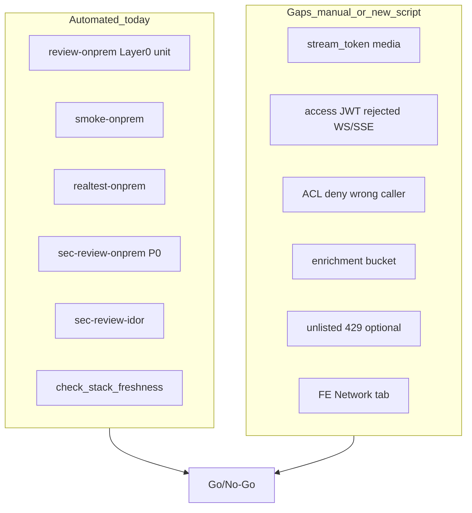

# Live Security Verification Plan (localhost:5296)

**Mục tiêu:** Xác nhận các fix security audit (AUDIT-001→013) hoạt động trên **stack prod overlay thật** — không chỉ unit test offline.

**Phạm vi:** `http://localhost:5296` only.

**Tham chiếu:** [SECURITY_AUDIT_REPORT.md](./SECURITY_AUDIT_REPORT.md) §10, [SECURITY_GO_LIVE_REVIEW.md](./SECURITY_GO_LIVE_REVIEW.md), [ON_PREM_DEPLOY.md](./ON_PREM_DEPLOY.md)

---

## Coverage map — fix vs live test



| Fix area | Automated today? | Gap |
|----------|------------------|-----|
| P0 ports / buckets / internal lateral | `sec-review-onprem.sh` | Covered |
| Register disabled (403) | `sec-review-onprem.sh` | Covered |
| IDOR cross-book media | `sec-review-idor.sh` | Needs `SEC_REVIEW_*` creds |
| Auth round-trip | `realtest-onprem.sh` | Needs `REALTEST_*` creds |
| Image stale / rebuild | `check_stack_freshness.py` | Covered (advisory) |
| `stream_token` media (AUDIT-002) | **No** | Manual curl or new script |
| BFF stream-only WS/SSE (AUDIT-003) | **No** | Manual curl |
| ACL enforce (AUDIT-004) | **No** | Docker lateral curl |
| Enrichment private bucket (AUDIT-006) | Partial (`/lw-chat` only) | Add `/lore-enrichment-uploads/` |
| JWT ≠ INTERNAL (AUDIT-012) | `validate-compose-secrets.sh` | Offline only (Layer 0) |

---

## Phase 0 — Chuẩn bị (bắt buộc)

### 0.1 Rebuild prod stack

Stack **phải** rebuild sau code change — nếu không, probe pass sai (đã gặp: register 201, dev nginx, thiếu stream-ticket).

```powershell
cd C:\Works\_Researchs\lore-weave
.\scripts\deploy-onprem.ps1
```

Hoặc thủ công:

```powershell
cd infra
docker compose -f docker-compose.yml -f docker-compose.prod.yml up -d --build `
  frontend auth-service api-gateway-bff book-service sharing-service `
  provider-registry-service video-gen-service lore-enrichment-service
```

**Xác nhận nhanh:**

```powershell
docker exec infra-frontend-1 grep -E "lw-books|Prod:" /etc/nginx/conf.d/default.conf
# Kỳ vọng: chỉ comment "Prod: no anonymous MinIO bucket proxy"

docker inspect infra-auth-service-1 --format "{{range .Config.Env}}{{println .}}{{end}}" | Select-String "ALLOW_PUBLIC|SERVICE_ACL"
# Kỳ vọng: ALLOW_PUBLIC_REGISTRATION=false, SERVICE_ACL_ENFORCE=true
```

### 0.2 `infra/.env` — secrets + test users

File [`.env.example`](./.env.example) cần:

- `JWT_SECRET` (≥32 chars)
- `INTERNAL_SERVICE_TOKEN` (≥32, **khác** JWT_SECRET)
- `PUBLIC_HTTP_PORT=5296`

**Test users (một lần)** — vì prod tắt public registration:

| Biến | Mục đích |
|------|----------|
| `REALTEST_EMAIL` / `REALTEST_PASSWORD` | `realtest-onprem.sh` |
| `SEC_REVIEW_EMAIL_A` / `SEC_REVIEW_PASSWORD_A` | `sec-review-idor.sh` user A |
| `SEC_REVIEW_EMAIL_B` / `SEC_REVIEW_PASSWORD_B` | `sec-review-idor.sh` user B |

**Bootstrap users (nếu chưa có):** tạm bật registration, register 3 account, tắt lại:

```powershell
# Dùng docker-compose.bootstrap.yml — chỉ dev local
docker compose -f docker-compose.yml -f docker-compose.prod.yml -f docker-compose.bootstrap.yml up -d auth-service
# register qua UI/curl → docker compose -f docker-compose.yml -f docker-compose.prod.yml up -d auth-service
```

### 0.3 Shell cho bash scripts

Trên Windows dùng **Git Bash**:

```bash
export $(grep -v '^#' infra/.env | xargs)   # load REALTEST_* / SEC_REVIEW_*
```

---

## Phase 1 — Suite tự động (Layer 0–3)

Chạy tuần tự; **dừng nếu Layer 3 fail** (trừ idor exit 2 khi thiếu creds).

```bash
cd /c/Works/_Researchs/lore-weave
infra/review-onprem.sh http://localhost:5296
```

Hoặc từng layer:

| Layer | Command | Pass criteria |
|-------|---------|---------------|
| 0 | `infra/review-onprem.sh` (no URL) | BFF 24+ tests; compose config OK |
| 1 | `infra/smoke-onprem.sh http://localhost:5296` | health 200; books 401; catalog 200 |
| 2 | `infra/realtest-onprem.sh http://localhost:5296` | login OK → profile, books, notifications |
| 2b | `python scripts/check_stack_freshness.py` | No STALE on auth/book/bff/frontend |
| 3a | `infra/sec-review-onprem.sh http://localhost:5296` | All PASS incl. register 403, buckets |
| 3b | `infra/sec-review-idor.sh http://localhost:5296` | 8/8 PASS (không exit 2) |

**PowerShell wrappers** (nếu có): `infra\smoke-onprem.ps1`, `infra\sec-review-onprem.ps1`

**Ghi kết quả** vào bảng Go/No-Go cuối plan.

---

## Phase 2 — P1 live probes (thiếu trong scripts — chạy thủ công)

Dùng Git Bash. Cần `ACCESS` từ login (`REALTEST_*`).

### 2.1 Stream ticket + media `stream_token` (AUDIT-002)

```bash
BASE=http://localhost:5296
ACCESS=$(curl -s -X POST "$BASE/v1/auth/login" -H "Content-Type: application/json" \
  -d "{\"email\":\"$REALTEST_EMAIL\",\"password\":\"$REALTEST_PASSWORD\"}" | node -pe "JSON.parse(require('fs').readFileSync(0,'utf8')).access_token")

# Mint stream ticket
STREAM=$(curl -s -X POST "$BASE/v1/auth/stream-ticket" -H "Authorization: Bearer $ACCESS" | node -pe "JSON.parse(require('fs').readFileSync(0,'utf8')).stream_token")

# access_token in query MUST fail (401/403)
curl -s -o /dev/null -w "access_token query: %{http_code}\n" \
  "$BASE/v1/books/00000000-0000-0000-0000-000000000001/media/object?key=books/fake/x.png&access_token=$ACCESS"
# Kỳ vọng: 401

# stream_token without ownership still 401/403/404 — but NOT 200 binary from IDOR
# (full IDOR covered by sec-review-idor)
```

| Check | Expected |
|-------|----------|
| `POST /v1/auth/stream-ticket` + Bearer | 200 + `stream_token` |
| `media/object?access_token=` | **401** (rejected) |
| `media/object?stream_token=` + valid book/key | 200 binary (nếu có media test data) |

### 2.2 BFF stream-only WS/SSE (AUDIT-003)

`BFF_REQUIRE_STREAM_TICKET=true` trong [docker-compose.prod.yml](./docker-compose.prod.yml).

```bash
# Access JWT on SSE — MUST fail (401 or connection error)
curl -s -o /dev/null -w "%{http_code}" \
  "$BASE/v1/notifications/stream?token=$ACCESS"
# Kỳ vọng: không 200 stream (thường 401)

# Stream ticket on SSE — MUST NOT 401 immediately
curl -s -o /dev/null -w "%{http_code}" \
  -H "Accept: text/event-stream" \
  "$BASE/v1/notifications/stream?token=$STREAM"
# Kỳ vọng: 200 (giữ vài giây rồi Ctrl+C)
```

WebSocket: mở DevTools → Network → filter `ws` → đăng nhập → notification bell; URL phải có `token=` với ticket ngắn, không phải access JWT dài.

### 2.3 ACL enforcement (AUDIT-004)

Từ container trên Docker network (cần `INTERNAL_SERVICE_TOKEN` từ `infra/.env`):

```bash
NET=$(docker inspect infra-auth-service-1 --format '{{range $k,$v := .NetworkSettings.Networks}}{{$k}}{{end}}')
TOKEN="<INTERNAL_SERVICE_TOKEN from .env>"

# Wrong caller — 403
docker run --rm --network "$NET" curlimages/curl -s -o /dev/null -w "%{http_code}" \
  -H "X-Internal-Token: $TOKEN" \
  -H "X-Caller-Service: evil-service" \
  "http://auth-service:8081/internal/users/00000000-0000-0000-0000-000000000001/profile"
# Kỳ vọng: 403

# Allowed caller (sharing → auth profile) — not 403 acl_denied
docker run --rm --network "$NET" curlimages/curl -s -o /dev/null -w "%{http_code}" \
  -H "X-Internal-Token: $TOKEN" \
  -H "X-Caller-Service: notification-service" \
  "http://auth-service:8081/internal/users/00000000-0000-0000-0000-000000000001/profile"
# Kỳ vọng: 200 hoặc 404 (user missing), không 403 acl
```

### 2.4 Enrichment bucket (AUDIT-006)

```bash
curl -s -o /dev/null -w "%{http_code}" "$BASE/lore-enrichment-uploads/test/orphan.bin"
# Kỳ vọng: 404 hoặc 403 — không 200 binary
```

### 2.5 Secret validation (AUDIT-012) — offline

```bash
source infra/.env
bash scripts/validate-compose-secrets.sh
# Thử cố ý: JWT_SECRET==INTERNAL → script exit 1
```

### 2.6 Optional — unlisted rate limit (AUDIT-P1-03)

```bash
# GET flood unlisted link (cần valid unlisted token từ sharing API)
# Kỳ vọng: 429 sau ~60 req/min (UNLISTED_RATE_LIMIT_MAX_REQUESTS default 60)
```

---

## Phase 3 — Browser manual (5 phút)

| Step | Action | Pass |
|------|--------|------|
| 1 | Login → mở book có cover/image | DevTools Network: image URL chứa `stream_token=`, **không** `access_token=` |
| 2 | Notification bell | SSE/WS connect; không lỗi console "stream-ticket failed" |
| 3 | `docker compose ps mailhog` | Không running (prod) |
| 4 | Thử register qua UI | Bị chặn / 403 |

---

## Phase 4 — Đề xuất script mới (optional, sau khi manual PASS)

Để lần sau không phải curl tay, thêm [sec-review-p1-live.sh](./sec-review-p1-live.sh):

- Input: `BASE_URL`, đọc `REALTEST_*` + `INTERNAL_SERVICE_TOKEN` từ env
- Probes: §2.1–2.4
- Wire vào [review-onprem.sh](./review-onprem.sh) as **Layer 3c** (sau idor)
- Mirror PowerShell: `infra/sec-review-p1-live.ps1`

**Không bắt buộc** cho lần verify đầu — manual đủ để Go/No-Go.

---

## Go/No-Go matrix (điền sau khi chạy)

| # | Check | Result | Notes |
|---|-------|--------|-------|
| 1 | `review-onprem.sh` Layer 0–2 | | |
| 2 | `sec-review-onprem.sh` | | incl. register 403 |
| 3 | `sec-review-idor.sh` | | needs SEC_REVIEW creds |
| 4 | `check_stack_freshness.py` | | no STALE frontend/auth/bff |
| 5 | stream-ticket mint | | |
| 6 | `access_token` query rejected | | |
| 7 | SSE access JWT rejected | | |
| 8 | SSE stream ticket OK | | |
| 9 | ACL wrong caller 403 | | |
| 10 | `/lore-enrichment-uploads/` not 200 | | |
| 11 | Browser `stream_token` on media | | |

**GO** khi: rows 1–4 PASS, rows 5–8 PASS, row 9 PASS (hoặc documented skip nếu ACL test env issue), rows 10–11 PASS.

**NO-GO** nếu: register 201, bucket 200 anonymous, `access_token` media works, WS works với access JWT only, stack STALE.

---

## Thứ tự thực hiện đề xuất

1. Phase 0 — deploy + `.env` + bootstrap users (~15 min)
2. Phase 1 — `review-onprem.sh` full (~5–10 min)
3. Phase 2 — manual P1 probes (~10 min)
4. Phase 3 — browser (~5 min)
5. Ghi Go/No-Go; cập nhật [SECURITY_GO_LIVE_REVIEW.md](./SECURITY_GO_LIVE_REVIEW.md) § Post-fix verification với ngày + kết quả
6. (Optional) Phase 4 — automate vào `sec-review-p1-live.sh`

**Ràng buộc:** Không commit secrets; không tắt `ALLOW_PUBLIC_REGISTRATION` trên host public; chỉ localhost.
