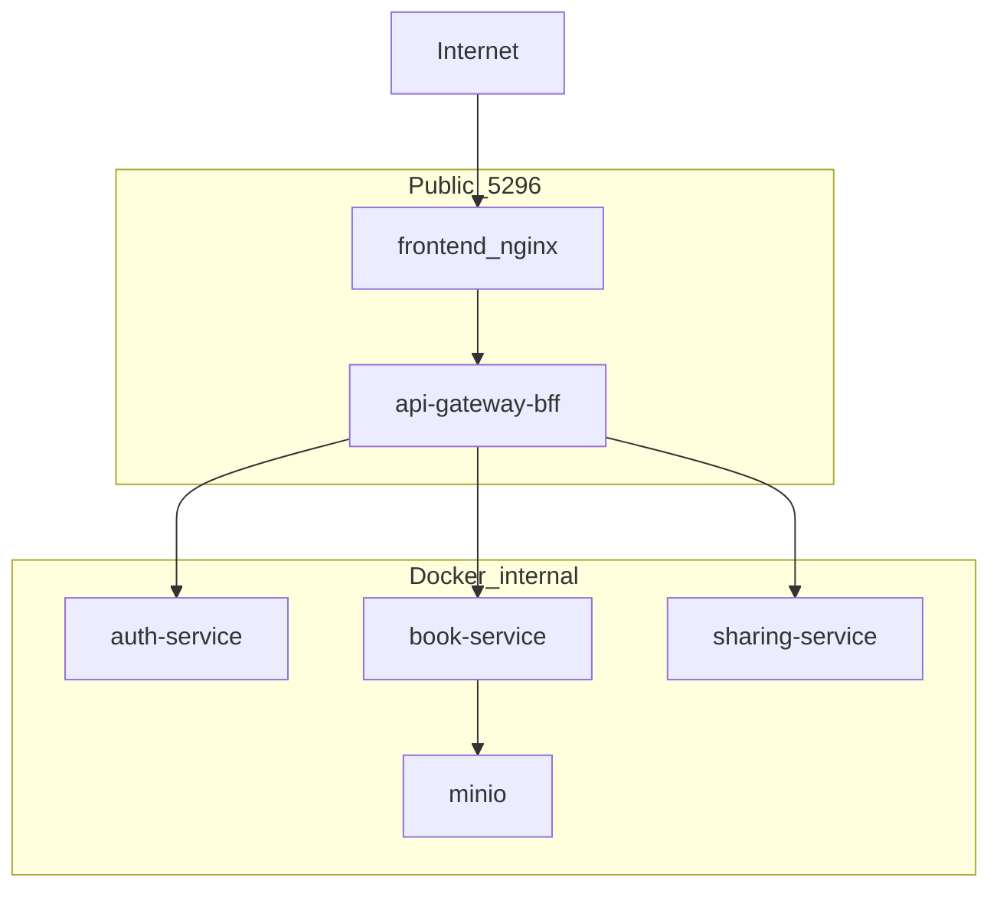

# Security Audit Report — On-Prem + P0/P1 Hardening

**Branch:** `feat/on-prem-single-port` (uncommitted vs `main`)  
**Audit date:** 2026-06-09  
**Scope:** Full diff vs `main` — on-prem single-port deploy, P0 go-live security, P1 hardening  
**Mode:** Audit (2026-06-09) — **fix phase completed** same day (see §10)

Related: [SECURITY_GO_LIVE_REVIEW.md](./SECURITY_GO_LIVE_REVIEW.md), [ON_PREM_DEPLOY.md](./ON_PREM_DEPLOY.md)

---

## 1. Executive summary

| Question | Answer (post-fix) |
|----------|-------------------|
| **Go-live ready?** | **Conditional GO** for controlled on-prem / ngrok demo |
| **P0 network isolation** | **PASS** with prod overlay + rebuild |
| **P1 hardening** | **DONE** in code (ACL spoofable header residual; mTLS deferred) |
| **Verification** | Use `SEC_REVIEW_*` / `REALTEST_*` creds when registration disabled |

**Recommendation:** Deploy via `scripts/deploy-onprem.*`, rebuild after pull, run `review-onprem.sh`. Residual: `X-Caller-Service` spoofable without mTLS; stream ticket still in query string (short TTL).

---

## 2. Diff summary

Changes are **uncommitted** on `feat/on-prem-single-port` (0 commits ahead of `main`; `git diff main` ≈ 29 tracked files + 20 new paths).

| Domain | Key paths | Lines (approx.) |
|--------|-----------|-----------------|
| **Edge / deploy** | `infra/docker-compose.prod.yml`, `frontend/nginx.prod.conf`, `frontend/Dockerfile`, `scripts/deploy-onprem.*`, `scripts/validate-compose-secrets.sh` | New overlay + deploy |
| **Auth / BFF** | `auth-service` (internal token, register gate, stream-ticket), `api-gateway-bff` (CORS, rate-limit, ws token) | +150 |
| **Media / IDOR** | `book-service/internal/api/media.go`, `provider-registry` audio_cache, `video-gen-service` | +120 |
| **Abuse** | `sharing-service/internal/ratelimit/`, BFF `rate-limit.ts` | New |
| **FE** | `api.ts` (stream ticket, mediaUrlWithAuth), WS/SSE hooks, `VersionHistoryPanel` | +50 |
| **S11 foundation** | `contracts/service_acl/matrix.yaml`, `sdks/go/serviceacl/`, `sdks/go/svid/`, `S11_MTLS_ROADMAP.md` | New, not wired |
| **Verification** | `sec-review-onprem.sh`, `sec-review-idor.sh`, `review-onprem.sh`, `realtest-onprem.sh`, docs | New |

---

## 3. Plan compliance matrix

### P0 (go-live blockers)

| ID | Item | Code | Live (post-rebuild) | Status |
|----|------|------|---------------------|--------|
| SEC-01 | Strong `INTERNAL_SERVICE_TOKEN` required | `docker-compose.prod.yml`, `validate-compose-secrets.sh` | Lateral probe: dev token → 401 | **Done** |
| SEC-02 | Private book media + IDOR-safe `/media/object` | `BOOKS_MEDIA_PUBLIC_READ=false`, `mediaObjectKeyAllowed` | Cross-book key → 403 | **Done** |
| SEC-03 | auth `/internal/*` requires token | `requireInternalToken` + tests | No token → 401 | **Done** |
| SEC-04 | Mailhog off in prod | `profiles: [dev-mail]`, `depends_on: !reset` | `docker ps mailhog` empty | **Done** |
| SEC-05 | BFF CORS pinned | `BFF_CORS_ORIGINS` from `PUBLIC_APP_URL` | Prod overlay sets env | **Done** |
| SEC-06 | No JWT in nginx access logs | `access_log off` on WS/SSE/media | Confirmed in running nginx | **Done** |

### P1 (hardening)

| ID | Item | Code | Live | Status |
|----|------|------|------|--------|
| SEC-P1-01 | BFF rate limiting | `rate-limit.ts`, gateway-setup | Unit tests 21/21 PASS; no live 429 flood run | **Done** (code) |
| SEC-P1-02a | ACL matrix + internal audit | `matrix.yaml`, `internalAudit` on auth only | ACL **not enforced** on any service | **Partial** |
| SEC-P1-02b/c | JWT-SVID + mTLS | `sdks/go/svid/`, roadmap doc | Foundation only | **Deferred** |
| SEC-P1-03 | Unlisted sharing rate limit | `ratelimit/limiter.go` on GET `/v1/sharing/unlisted/*` | Not probed (audit used wrong HTTP method) | **Done** (code) |
| SEC-P1-04 | `ALLOW_PUBLIC_REGISTRATION=false` | handlers + prod overlay | **403** after rebuild; **201** before rebuild | **Done** (needs rebuild) |
| SEC-P1-05 | `DEV_LOG_EMAIL_TOKENS` default off | config default + doc | `DEV_LOG_EMAIL_TOKENS=0` in container | **Done** |
| SEC-P1-06 | Stream ticket WS/SSE | `stream_ticket.go`, FE hooks | Route exists (401 w/o auth); BFF still accepts access JWT | **Partial** |
| SEC-P1-07 | Prod nginx + private buckets + FE media auth | `nginx.prod.conf`, audio/video private flags | nginx.prod active after rebuild; FE helper only in `VersionHistoryPanel` | **Partial** |

### On-prem deploy

| Item | Status |
|------|--------|
| Single port `:5296` | **Done** |
| Deploy scripts + secret validation | **Done** |
| Smoke / sec-review scripts | **Done** (with gaps — see §4) |
| `infra/.env` gitignored | **OK** (local secrets not in repo) |

### Known gaps (code vs plan)

| Gap | Severity |
|-----|----------|
| `mediaUrlWithAuth` not used in `ContentRenderer`, `AudioBlock`, `AudioBlockNode`, `VersionTimeline`, `ChapterEditorPage` | P1 |
| `lore-enrichment-service` — no `PUBLIC_READ` / presigned toggle | P1 |
| `serviceacl.Middleware` not mounted; `SERVICE_ACL_ENFORCE` documented only | P1 |
| `sec-review-idor.sh` / default `realtest-onprem.sh` require public registration | P1 |
| Stream ticket: FE fallback to full access JWT; BFF does not require `typ=stream` | P1 |

---

## 4. Live probe results

**Environment:** `http://localhost:5296`, prod overlay, Windows + Docker Desktop.

### Automated scripts

| Script | Pre-rebuild (stale images) | Post-rebuild |
|--------|---------------------------|--------------|
| `sec-review-onprem.sh` | **PASS** | **PASS** (same session; lateral + bucket probes) |
| `sec-review-idor.sh` | **PASS** (8/8) | **FAIL** — cannot register users (`ALLOW_PUBLIC_REGISTRATION=false`) |
| `review-onprem.sh` (layers 0–3) | **PASS** (BFF 21 tests, smoke, realtest, sec) | Not re-run full suite post-rebuild |
| `realtest-onprem.sh` | **PASS** (register+login) | Requires `REALTEST_EMAIL`/`REALTEST_PASSWORD` when registration disabled |

### Manual probes

| Probe | Pre-rebuild | Post-rebuild | Expected |
|-------|-------------|--------------|----------|
| `POST /v1/auth/register` (no token) | **201** | **403** `AUTH_REGISTRATION_DISABLED` | 403 |
| `POST /v1/auth/stream-ticket` (no auth) | **404** | **401** | 401/404 without Bearer |
| nginx bucket proxy locations | **Present** (`loreweave-dev-books`, `lw-chat`, …) | **Absent** (`nginx.prod.conf` comment only) | No bucket proxy |
| `ALLOW_PUBLIC_REGISTRATION` in auth container | **Unset** (default true) | **`false`** | false |
| Mailhog running | No | No | Off |

### Operational finding

**AUDIT-013:** Running `docker compose up` without `--build` after code changes leaves **stale images**. Pre-rebuild stack had P0 book media flags but **missed** P1 registration gate, stream-ticket route, and prod nginx. Document rebuild as mandatory step in deploy runbook.

---

## 5. Security findings

Findings are ordered by severity. IDs are for tracking in a future fix phase.

### P0

#### AUDIT-001 — Dev stack exposed as public edge

| Field | Value |
|-------|-------|
| **Severity** | P0 (if mis-deployed) |
| **Category** | Config |
| **Location** | `frontend/nginx.conf:60-67`, base `infra/docker-compose.yml` |
| **Evidence** | Pre-rebuild container had dev bucket `location` blocks; `sec-review-onprem.sh` would FAIL if anonymous bucket returned 200 |
| **Risk** | Anonymous MinIO read if dev compose/nginx used on a reachable host |
| **Fix direction** | Deploy only via prod overlay + `nginx.prod.conf`; optional runtime guard rejecting bucket locations in prod image |

*(Subagent P0-1; validated by pre-rebuild nginx inspect.)*

---

### P1

#### AUDIT-002 — Full access JWT in media URLs

| Field | Value |
|-------|-------|
| **Severity** | P1 |
| **Category** | Auth / info disclosure |
| **Location** | `frontend/src/api.ts:31-38`, `book-service/internal/api/media.go:643-651`, `VersionHistoryPanel.tsx` |
| **Evidence** | `mediaUrlWithAuth` appends `?access_token=<access JWT>`; book handler validates access JWT via `requireUserIDAllowQuery` |
| **Risk** | Session hijack if URL leaked (share, screenshot, Referer, non-nginx hops) — full API access until token expiry |
| **Fix direction** | Media-scoped or `typ=stream` tickets; reject access JWT in query; wire FE to ticket minting |

#### AUDIT-003 — Stream ticket enforcement incomplete

| Field | Value |
|-------|-------|
| **Severity** | P1 |
| **Category** | Auth |
| **Location** | `api-gateway-bff/src/ws/token.ts:8-10`, `useNotificationStream.ts:85-90`, `useImportEvents.ts:27-35` |
| **Evidence** | BFF accepts tokens without `typ` (access JWT passes); FE falls back to access token on ticket failure |
| **Risk** | Leaked `?token=` on WS/SSE grants full session capability for access-token TTL |
| **Fix direction** | Prod: require `typ === 'stream'`; remove or dev-gate fallback |

#### AUDIT-004 — S11 ACL matrix not enforced

| Field | Value |
|-------|-------|
| **Severity** | P1 |
| **Category** | EoP |
| **Location** | `contracts/service_acl/matrix.yaml`, `sdks/go/serviceacl/acl.go:67-76`, `auth-service/internal/api/server.go:87-91` |
| **Evidence** | No `serviceacl.Middleware` in any `services/*/server.go`; only `internalAudit` logging on auth |
| **Risk** | Any container with `INTERNAL_SERVICE_TOKEN` can call any internal route on any service |
| **Fix direction** | Mount ACL middleware when `SERVICE_ACL_ENFORCE=true`; trustworthy caller identity (not spoofable header alone) |

#### AUDIT-005 — FE private media auth incomplete

| Field | Value |
|-------|-------|
| **Severity** | P1 |
| **Category** | Media |
| **Location** | `ContentRenderer.tsx` → `ImageBlock`/`AudioBlock`; `AudioBlockNode.tsx`; `VersionTimeline.tsx:160`; `ChapterEditorPage.tsx:823` |
| **Evidence** | `grep mediaUrlWithAuth` — only `VersionHistoryPanel.tsx` |
| **Risk** | Broken images/audio in editor/reader when `BOOKS_MEDIA_PUBLIC_READ=false`; or reliance on stale public URLs |
| **Fix direction** | Centralize auth URL helper for all media render paths |

#### AUDIT-006 — lore-enrichment bucket not hardened

| Field | Value |
|-------|-------|
| **Severity** | P1 |
| **Category** | Media |
| **Location** | `services/lore-enrichment-service/app/config.py:49` |
| **Evidence** | No `PUBLIC_READ` flag or presigned path in enrichment service; dev nginx still proxied `lore-enrichment-uploads` in pre-rebuild image |
| **Risk** | Upload bucket exposure if dev nginx or public bucket policy used |
| **Fix direction** | Align with book/audio pattern: private bucket + presigned or auth proxy |

#### AUDIT-007 — Verification scripts incompatible with prod registration gate

| Field | Value |
|-------|-------|
| **Severity** | P1 |
| **Category** | Ops / verification |
| **Location** | `infra/sec-review-idor.sh:35-43`, `infra/realtest-onprem.sh:48-78` |
| **Evidence** | Post-rebuild: `sec-review-idor.sh` → `FAIL setup — could not obtain tokens` |
| **Risk** | False sense of security — IDOR suite cannot run on true prod config; operators may skip or use dev flags |
| **Fix direction** | Support `SEC_REVIEW_EMAIL`/`PASSWORD` or bootstrap via internal admin API |

#### AUDIT-008 — Stream ticket not rate-limited at auth-service

| Field | Value |
|-------|-------|
| **Severity** | P1 |
| **Category** | Abuse |
| **Location** | `auth-service/internal/api/server.go:114`, `stream_ticket.go` |
| **Evidence** | `register`/`login` use `ratelimit.Middleware`; `stream-ticket` does not |
| **Risk** | Amplified ticket minting if auth port exposed (hybrid dev) |
| **Fix direction** | Same limiter as login; per-user key at BFF |

---

### P2

#### AUDIT-009 — `requireInternalToken` fail-open when token empty

| Field | Value |
|-------|-------|
| **Severity** | P2 |
| **Category** | Auth |
| **Location** | `auth-service/internal/api/server.go:33-40` (pattern in book/sharing) |
| **Risk** | Misconfigured empty token bypasses internal auth |
| **Fix direction** | Fail-closed: deny unless header matches non-empty configured secret |

#### AUDIT-010 — BFF/sharing rate limit trusts `X-Forwarded-For`

| Field | Value |
|-------|-------|
| **Severity** | P2 |
| **Category** | Abuse |
| **Location** | `rate-limit.ts:7-12`, `sharing-service/internal/ratelimit/limiter.go:32-36` |
| **Risk** | IP bucket evasion if client can influence XFF |
| **Fix direction** | Trust single nginx hop or `remoteAddress` behind known proxy |

#### AUDIT-011 — `npm config set strict-ssl false` in frontend build

| Field | Value |
|-------|-------|
| **Severity** | P2 |
| **Category** | Supply chain |
| **Location** | `frontend/Dockerfile:8-9` |
| **Risk** | Build-time MITM on npm registry |
| **Fix direction** | Enable strict SSL; inject corporate CA if needed |

#### AUDIT-012 — Deploy validation does not forbid `JWT_SECRET === INTERNAL_SERVICE_TOKEN`

| Field | Value |
|-------|-------|
| **Severity** | P2 |
| **Category** | Secrets |
| **Location** | `scripts/validate-compose-secrets.sh` |
| **Risk** | Single secret compromise affects both user sessions and service mesh |
| **Fix direction** | Add inequality check in validate script |

#### AUDIT-013 — Stale containers after code change (operational)

| Field | Value |
|-------|-------|
| **Severity** | P2 |
| **Category** | Ops |
| **Evidence** | 4h-old images: registration open, stream-ticket 404, dev nginx |
| **Fix direction** | Mandate `--build` in deploy scripts; version label in `/health` |

---

## 6. STRIDE-lite threat model

| Threat | Surface | Assessment |
|--------|---------|------------|
| **Spoofing** | JWT, internal token, stream ticket | Prod token rotation OK; access JWT still accepted for WS/SSE and media query |
| **Tampering** | Media object API, sharing | IDOR checks solid for cross-book keys; `..` rejected |
| **Repudiation** | `internalAudit` on auth only | Other services lack structured internal RPC audit |
| **Info disclosure** | nginx logs, MinIO, presigned URLs | SEC-06 mitigates nginx; media still leaks full JWT in URL (AUDIT-002) |
| **DoS** | BFF 120/min, auth register/login limits, unlisted 60/min | In-memory limits; no global coordination; stream-ticket unbounded at auth |
| **EoP** | `/internal/*` | Shared token + no ACL = full lateral movement inside Docker net |

### Config / secrets review

| Check | Result |
|-------|--------|
| `infra/.env.example` documents prod secrets | OK |
| Default `dev_internal_token` in base compose | OK for dev only; blocked in prod overlay |
| Postgres/Redis/MinIO host ports in prod | Stripped via `!override []` |
| `JWT_SECRET` length | Enforced ≥32 in service config |
| Secret equality validation | **Missing** (AUDIT-012) |

### Test coverage gaps

| Area | Coverage | Gap |
|------|----------|-----|
| auth internal routes | `internal_routes_test.go` | PASS |
| register gate | `register_gate_test.go` | PASS |
| stream JWT | `stream_test.go` | PASS |
| BFF rate limit | `rate-limit.spec.ts` | No XFF spoof cases |
| IDOR cross-book media | `sec-review-idor.sh` | **Cannot run on prod registration-off** |
| Private media playback E2E | None | Broken UX risk (AUDIT-005) |
| ACL middleware | None wired | No integration tests |

---

## 7. Residual risks (accepted / deferred)

| Risk | Notes |
|------|-------|
| JWT in query string (WS/SSE/media) | Short stream tickets reduce but do not eliminate blast radius while access JWT fallback remains |
| mTLS / JWT-SVID | Explicitly deferred per `S11_MTLS_ROADMAP.md` |
| chat-service `lw-chat` | Presigned URLs (not anonymous proxy in prod nginx); not re-audited end-to-end in this pass |
| composition-service | Restarting during audit — unrelated to security branch but may affect stack health |

---

## 8. Suggested fix backlog (separate task — not implemented)

Priority order for a **fix phase**:

1. **AUDIT-002 / AUDIT-003** — Scoped media + stream tokens; prod-enforce `typ=stream`; remove access JWT fallback
2. **AUDIT-007** — Update `sec-review-idor.sh` and `realtest-onprem.sh` for registration-disabled prod
3. **AUDIT-005** — FE media auth across all render paths
4. **AUDIT-004** — Wire `serviceacl.Middleware` behind `SERVICE_ACL_ENFORCE`
5. **AUDIT-006** — lore-enrichment private bucket mode
6. **AUDIT-009–012** — Fail-closed internal auth, rate-limit hardening, strict-ssl, secret validation
7. **AUDIT-013** — Deploy script always `--build`; document in ON_PREM_DEPLOY

---

## 9. Subagent cross-reference

Automated [Security Review](0d0333cd-80ea-4309-b740-f3ee7b539f05) on branch diff vs `main` — findings aligned with this report:

| Severity | Count | Top themes |
|----------|-------|------------|
| P0 | 1 | Dev mis-deploy |
| P1 | 4 | JWT-in-URL, stream ticket, ACL, rate limits |
| P2 | 4 | Fail-open middleware, XFF, strict-ssl, secret validation |

Validated non-issues from subagent: cross-book media IDOR, prod CORS, path traversal on `key`, unlisted rate limit code path.

---

---

## 10. Fix phase resolution (2026-06-09)

| Finding | Status | Fix |
|---------|--------|-----|
| AUDIT-001 | Mitigated | `sec-review-onprem` bucket probes; ON_PREM_DEPLOY NO-GO |
| AUDIT-002 | **RESOLVED** | `stream_token` only in book-service; FE `resolveMediaUrl` |
| AUDIT-003 | **RESOLVED** | `BFF_REQUIRE_STREAM_TICKET`; no prod FE fallback |
| AUDIT-004 | **RESOLVED** | `serviceacl.OptionalMiddleware` + prod `SERVICE_ACL_ENFORCE` |
| AUDIT-005 | **RESOLVED** | `useMediaAuthUrl` / `AuthenticatedMedia*` across render paths |
| AUDIT-006 | **RESOLVED** | `ENRICHMENT_UPLOAD_PUBLIC_READ=false` + private bucket policy |
| AUDIT-007 | **RESOLVED** | `SEC_REVIEW_*` env in idor script; realtest 403 message |
| AUDIT-008 | **RESOLVED** | stream-ticket rate limit on auth-service |
| AUDIT-009 | **RESOLVED** | fail-closed `requireInternalToken` |
| AUDIT-010 | **RESOLVED** | `TRUST_PROXY` gating for rate-limit IP |
| AUDIT-011 | **RESOLVED** | removed `strict-ssl false` from frontend Dockerfile |
| AUDIT-012 | **RESOLVED** | `JWT_SECRET ≠ INTERNAL_SERVICE_TOKEN` in validate + deploy |
| AUDIT-013 | **RESOLVED** | deploy always `--build`; `check_stack_freshness` in review |

*Audit completed 2026-06-09. Fix phase applied same session.*
