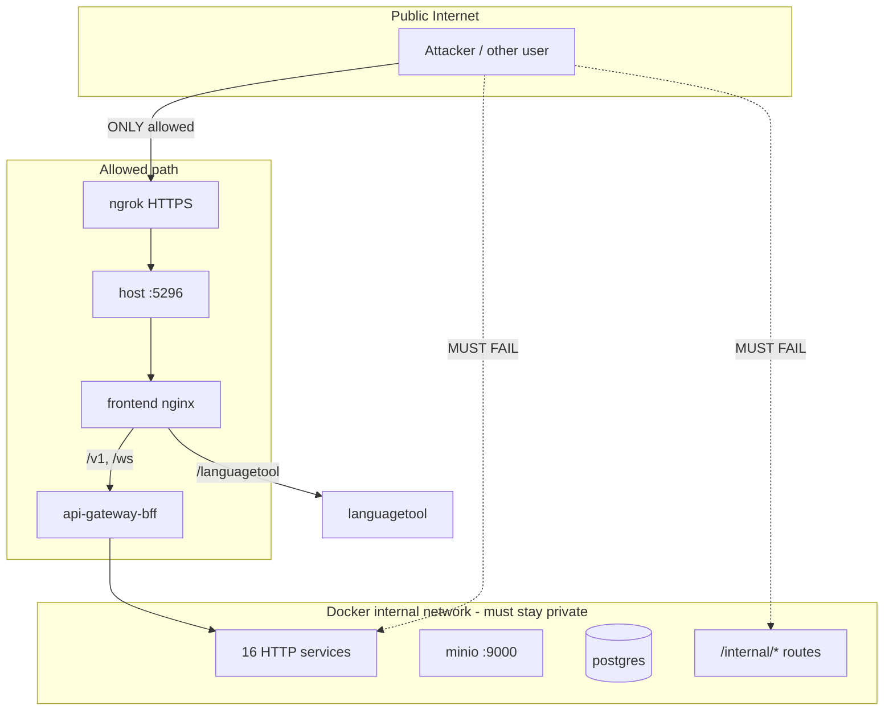

# Go-Live Security Review (On-Prem / ngrok)

Security checklist and probe results for exposing LoreWeave through a **single public port** (default `:5296`). Do **not** go live on ngrok until all **P0** items are **PASS**.

Related: [ON_PREM_DEPLOY.md](./ON_PREM_DEPLOY.md)

## Threat model



**Principles**

- One public entry: `HTTPS → :5296 → nginx → (BFF | languagetool)`
- Frontend `RequireAuth` is UX only — **authorization is enforced per service** (JWT + ownership)
- BFF is a dumb proxy (except WS/SSE) — not the sole auth layer
- Do **not** run dev compose (multi-port) alongside prod on the same host

## P0 blockers

| ID | Risk | Fix | Owner | Status |
|----|------|-----|-------|--------|
| SEC-01 | Default `dev_internal_token` in prod | Require `INTERNAL_SERVICE_TOKEN` in prod overlay + deploy validation | infra | PASS (code) |
| SEC-02 | MinIO public bucket read + anonymous nginx proxy | `BOOKS_MEDIA_PUBLIC_READ=false` in prod; auth media route `/v1/books/{id}/media/object` | book-service | PASS (code) |
| SEC-03 | auth `/internal/*` without `X-Internal-Token` | `requireInternalToken` middleware + tests | auth-service | PASS (code) |
| SEC-04 | Mailhog in prod stack | `profiles: [dev-mail]`; no host port; prod auth without mailhog dep | infra | PASS (code) |
| SEC-05 | BFF CORS `origin: true` | `BFF_CORS_ORIGINS` from `PUBLIC_APP_URL` in prod | api-gateway-bff | PASS (code) |
| SEC-06 | JWT in query (WS/SSE) logged by nginx | `access_log off` on `/ws` and `/v1/notifications/stream` | frontend nginx | PASS (code) |

## P1 hardening (implemented)

| ID | Item | Status |
|----|------|--------|
| SEC-P1-01 | BFF rate limiting (`BFF_RATE_LIMIT_*`) | DONE |
| SEC-P1-02a | S11 interim: ACL matrix + internal audit log + validate-compose-secrets | DONE |
| SEC-P1-02b/c | JWT-SVID (`sdks/go/svid`) + mTLS roadmap | FOUNDATION (see [S11_MTLS_ROADMAP.md](./S11_MTLS_ROADMAP.md)) |
| SEC-P1-03 | Unlisted sharing rate limit | DONE |
| SEC-P1-04 | `ALLOW_PUBLIC_REGISTRATION=false` in prod | DONE |
| SEC-P1-05 | `DEV_LOG_EMAIL_TOKENS` default off + doc | DONE |
| SEC-P1-06 | Stream ticket `POST /v1/auth/stream-ticket` + FE WS/SSE; `BFF_REQUIRE_STREAM_TICKET` in prod | DONE |
| SEC-P1-07 | Prod `nginx.prod.conf`; private buckets; FE `resolveMediaUrl` + `useMediaAuthUrl` (stream_token, not access JWT) | DONE |
| SEC-P1-08 | ACL `OptionalMiddleware` on auth/book/sharing when `SERVICE_ACL_ENFORCE=true` | DONE |
| SEC-P1-09 | lore-enrichment `ENRICHMENT_UPLOAD_PUBLIC_READ=false` in prod | DONE |

## Go gates

| Gate | Requirements |
|------|----------------|
| **Ngrok demo** | P0 PASS + deploy via `scripts/deploy-onprem.*` |
| **Public ngrok** | Above + SEC-P1-04 (registration off) + SEC-P1-01 rate limits |
| **Production** | Above + SEC-P1-07 media + Phase 5b JWT-SVID when on AWS |

## Review commands

| Layer | Command | Needs stack |
|-------|---------|-------------|
| Offline unit + compose | `infra/review-onprem.sh` | No |
| Network isolation | `infra/sec-review-onprem.sh http://localhost:5296` | Yes |
| IDOR / authz | `infra/sec-review-idor.sh http://localhost:5296` | Yes |
| Smoke | `infra/smoke-onprem.sh http://localhost:5296` | Yes |
| Real flow | `infra/realtest-onprem.sh http://localhost:5296` | Yes |

Windows: `.\infra\sec-review-onprem.ps1`, `.\infra\smoke-onprem.ps1`

### Internal route probe (manual)

From a container on the Docker network:

```bash
docker run --rm --network infra_default curlimages/curl \
  -H "X-Internal-Token: dev_internal_token" \
  http://auth-service:8081/internal/users/{uuid}/profile
```

Expected after P0: **401** (wrong/missing token). With valid prod token + existing user: **200**.

## Required prod env (`infra/.env`)

| Variable | Requirement |
|----------|-------------|
| `JWT_SECRET` | ≥ 32 chars, unique |
| `INTERNAL_SERVICE_TOKEN` | ≥ 32 chars, **different from JWT_SECRET**, not `dev_internal_token` |
| `PUBLIC_APP_URL` | Browser-visible HTTPS URL (ngrok or domain) |
| `PUBLIC_HTTP_PORT` | Default `5296` |
| `SMTP_HOST` | Real SMTP for prod email; or start stack with `--profile dev-mail` (Mailhog internal only, no host port) |

## Compose matrix

| Profile | Host ports | Mailhog | INTERNAL_SERVICE_TOKEN |
|---------|------------|---------|------------------------|
| dev (`docker-compose.yml`) | Many (8204+, 9123) | Yes (:8025 UI) | Default `dev_internal_token` OK |
| prod overlay | **5296 only** | Off (use `dev-mail` profile if needed) | **Required** strong secret |
| ngrok | prod overlay + tunnel | Same as prod | Same as prod |

## Baseline findings (pre-fix)

Documented from codebase audit before P0 hardening on branch `feat/on-prem-single-port`:

| ID | Evidence | Impact |
|----|----------|--------|
| SEC-01 | `INTERNAL_SERVICE_TOKEN:-dev_internal_token` in base compose | Lateral movement inside Docker net |
| SEC-02 | `setBucketPublicRead` + nginx bucket locations | Anonymous media read if URL known |
| SEC-03 | auth `server.go` `/internal` without middleware | Profile leak from compromised container |
| SEC-04 | mailhog in prod overlay (ports stripped only) | Reset tokens visible in Mailhog UI |
| SEC-05 | `gateway-setup.ts` `origin: true` | Cross-site API calls with user cookies/tokens |
| SEC-06 | JWT in WS/SSE query params | Token leakage via access logs |

## Post-fix verification (live — 2026-06-09, prod overlay localhost:5296)

| Check | Result |
|-------|--------|
| `smoke-onprem.sh` | **PASS** (health 200, books 401, catalog 200, llm 401, languagetool 200) |
| `sec-review-onprem.sh` | **PASS** (backend ports closed; only :5296 published; `/v1/internal/*` → 404; lateral probe dev token → 401) |
| `sec-review-idor.sh` | **PASS** (8/8 including cross-book `media/object`) |
| `realtest-onprem.sh` | **PASS** (register+login, profile, books, notifications, no :3123 leak) |

**Notes:** No LLM keys configured — `/v1/llm/*` returns 401 (route exists, auth enforced); LLM-dependent features not tested. `/internal/*` without `/v1` returns SPA HTML (200) — not routed to backend.

## Go / No-Go gate

**GO** when:

1. All P0 rows above are **PASS** on a prod-overlay stack
2. `sec-review-onprem.sh` and `infra/sec-review-idor.sh` pass against `PUBLIC_APP_URL` or localhost
3. `INTERNAL_SERVICE_TOKEN` is not the dev default (use `scripts/deploy-onprem.*`)
4. No backend ports reachable from host except `PUBLIC_HTTP_PORT`

**NO-GO** if any P0 fails, dev compose is exposed alongside prod, Mailhog UI is reachable from outside Docker, or deploy skips `INTERNAL_SERVICE_TOKEN` validation.

---

## Audit fix phase (2026-06-09)

Resolved AUDIT-002–013 from [SECURITY_AUDIT_REPORT.md](./SECURITY_AUDIT_REPORT.md): stream tokens for media/WS/SSE, FE media auth paths, ACL enforcement (prod), enrichment private bucket, probe scripts for registration-off prod, secret validation, fail-closed internal token, rate-limit IP trust.

*Last updated: audit fix phase on `feat/on-prem-single-port`.*
